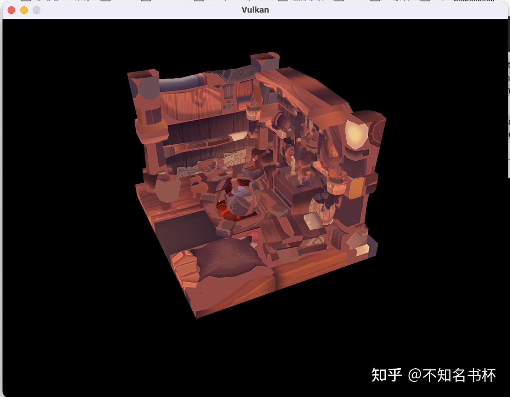
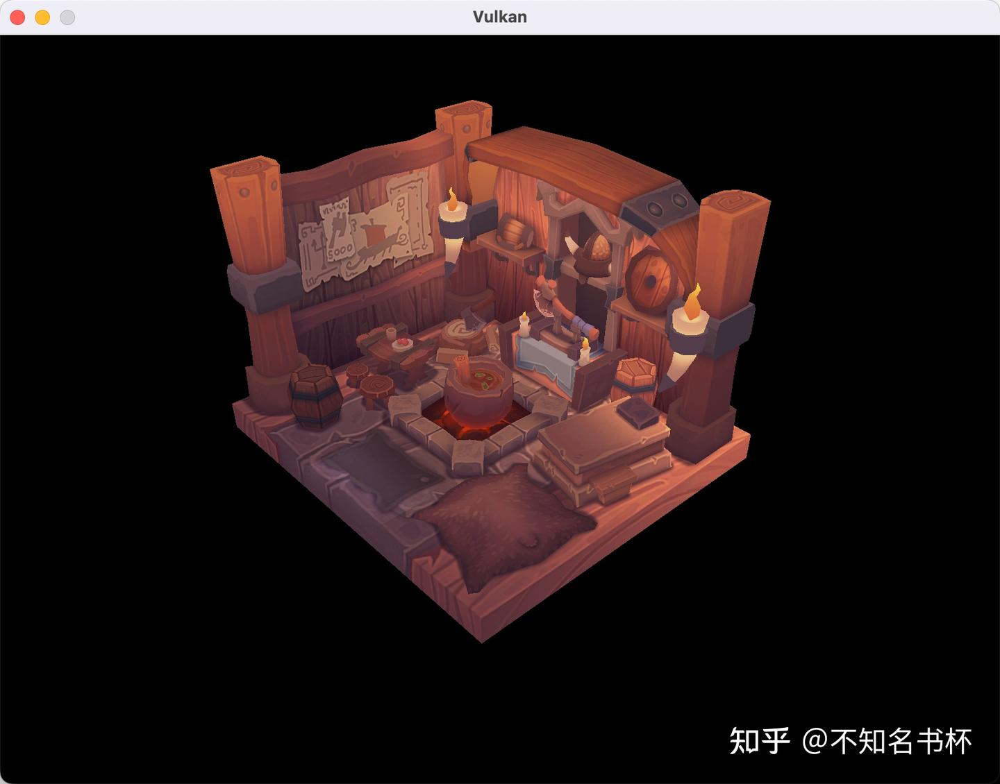

# Vulkan Load Model

> 这里是记录笔者Vulkan的学习记录，参照该教程[vulkan-tutorial.com](https://vulkan-tutorial.com/Drawing_a_triangle/Drawing/Command_buffers)这里是记录笔者Vulkan的学习记录，如果你想识别Vulkan相比于之前的传统图形API有什么区别和优势的话，欢迎看我的另外一篇文章[初探Vulkan](https://zhuanlan.zhihu.com/p/554631289)。相信应该能够帮助你识别Vulkan的优势所在。

从之前的内容现在已经准备好渲染可以使用纹理的三维网格了，但是当前顶点和索引数组中的几何图形还不是很有趣。在这里中，我们将对程序进行扩展，从一个实际的模型文件中加载顶点和索引，以使显卡真正做一些工作。

我们将从一个OBJ格式的模型中加载[网格数据](https://zhida.zhihu.com/search?content_id=212319780&content_type=Article&match_order=1&q=网格数据&zhida_source=entity)，但我们将更多的关注于将网格数据与程序本身的整合，而不是从文件中加载的细节。

我们将使用tinyobjloader库来从OBJ文件中加载顶点和面。它的速度很快，而且很容易集成，因为它是一个像stb_image一样的单文件库。去上面链接的资源库，下载 tiny_obj_loader.h 文件到你的库目录下的一个文件夹。

## **Sample mesh**

在这一章中，我们还不会启用灯光，所以使用一个将灯光烘焙到了纹理中的模型会有帮助。找到这种模型的一个简单方法是在Sketchfab上寻找3D扫描。该网站上的许多模型都是以OBJ格式提供的，并有许可权。

在你的程序中放入两个新的配置变量来定义模型和纹理路径。

```cpp
const std::string MODEL_PATH = "models/viking_room.obj";
const std::string TEXTURE_PATH = "textures/viking_room.png";

// 并将纹理的读取换成如下所示：
stbi_uc* pixels = stbi_load(TEXTURE_PATH.c_str(), &texWidth, &texHeight, &texChannels, STBI_rgb_alpha);
```

## **Loading vertices and indices**

我们现在要从模型文件中加载顶点和索引，所以你现在应该删除之前的顶点和索引数组。用非const容器代替它们作为类成员。

```cpp
std::vector<Vertex> vertices;
std::vector<uint32_t> indices;
```

你应该把索引的类型从uint16_t改为uint32_t，因为顶点会比65535多很多。记得也要改变vkCmdBindIndexBuffer参数。

```cpp
vkCmdBindIndexBuffer(commandBuffer, indexBuffer, 0, VK_INDEX_TYPE_UINT32);
```

tinyobjloader库的包含方式与STB库相同。包括 tiny_obj_loader.h 文件，并确保在一个[源文件](https://zhida.zhihu.com/search?content_id=212319780&content_type=Article&match_order=1&q=源文件&zhida_source=entity)中定义 TINYOBJLOADER_IMPLEMENTATION 以包括函数体并避免链接器错误。

```cpp
#define TINYOBJLOADER_IMPLEMENTATION
#include <tiny_obj_loader.h>
```

我们现在要写一个loadModel函数，使用这个库将网格的顶点数据填充到顶点和索引容器中。它应该在创建Vertex Buffer和Index Buffer之前被调用。

```cpp
void loadModel() {
    tinyobj::attrib_t attrib;
    std::vector<tinyobj::shape_t> shapes;
    std::vector<tinyobj::material_t> materials;
    std::string warn, err;

    if (!tinyobj::LoadObj(&attrib, &shapes, &materials, &warn, &err, MODEL_PATH.c_str())) {
        throw std::runtime_error(warn + err);
    }
}
```

OBJ文件由位置、法线、[纹理坐标](https://zhida.zhihu.com/search?content_id=212319780&content_type=Article&match_order=1&q=纹理坐标&zhida_source=entity)和面组成。面由任意数量的顶点组成，其中每个顶点通过索引指向一个位置、法线或纹理坐标。这使得它不仅可以重复使用整个顶点，还可以重复使用单个属性。

attrib容器在其attrib.vertices、attrib.normals和attrib.texcoords向量中保存所有的位置、法线和纹理坐标。shapes容器包含所有独立的对象和它们的面。每个面由一个顶点数组组成，每个顶点包含位置、法线和纹理坐标属性的索引。OBJ模型也可以为每个面定义一个材料和纹理，但我们将忽略这些。

err字符串包含错误，warning字符串包含加载文件时出现的警告，比如缺少材质定义。只有当LoadObj函数返回错误时，加载才真正失败。如上所述，OBJ文件中的面实际上可以包含任意数量的顶点，而我们的应用程序只能渲染三角形。幸运的是，LoadObj有一个可选的参数，可以自动对这样的面进行三角处理，这个参数默认是启用的。

我们将把文件中的所有面合并成一个单一的模型，所以只需遍历所有的形状。三角化功能已经确保了每个面有三个顶点，所以我们现在可以直接遍历顶点，并将它们直接压入我们的顶点容器当中。

```cpp
for (const auto& shape : shapes) {
    for (const auto& index : shape.mesh.indices) {
        Vertex vertex{};
        vertices.push_back(vertex);
        indices.push_back(indices.size());
    }
}
```

为了简单起见，我们将假设每一个顶点都是唯一的，因此采用简单的自动递增索引。索引变量的类型是 tinyobj::index_t，它包含 vertex_index, normal_index 和 texcoord_index 成员。我们需要使用这些索引来查找attrib数组中的实际顶点属性。

```cpp
vertex.pos = {
    attrib.vertices[3 * index.vertex_index + 0],
    attrib.vertices[3 * index.vertex_index + 1],
    attrib.vertices[3 * index.vertex_index + 2]
};

vertex.texCoord = {
    attrib.texcoords[2 * index.texcoord_index + 0],
    attrib.texcoords[2 * index.texcoord_index + 1]
};

vertex.color = {1.0f, 1.0f, 1.0f};
```

不幸的是，attrib.vertices数组是一个[float数组](https://zhida.zhihu.com/search?content_id=212319780&content_type=Article&match_order=1&q=float数组&zhida_source=entity)，而不是类似glm::vec3的东西，所以你需要将索引乘以3。同样，每个顶点有两个纹理坐标组件。0、1和2的Offset被用来访问X、Y和Z分量，或者在纹理坐标的情况下访问U和V分量。



很好，几何图形看起来很正确，但是纹理是怎么回事？OBJ格式假设了一个坐标系统，其中[垂直坐标](https://zhida.zhihu.com/search?content_id=212319780&content_type=Article&match_order=1&q=垂直坐标&zhida_source=entity)为0意味着图像的底部，然而我们已经将我们的图像以从上到下的方向上传到了Vulkan，其中0意味着图像的顶部。通过翻转纹理坐标的y轴部分来解决这个问题。

```cpp
vertex.texCoord = {
    attrib.texcoords[2 * index.texcoord_index + 0],
    1.0f - attrib.texcoords[2 * index.texcoord_index + 1]
};
```



## **Vertex deduplication**

不幸的是，我们还没有真正利用好Index Buffer的优势。顶点容器包含很多重复的顶点数据，因为很多顶点被包含在多个三角形中。我们应该只保留唯一的顶点，并在它们出现的时候使用Index Buffer来复用它们。实现这一点的直接方法是使用map或unordered_map来跟踪唯一顶点和各自的索引。

```cpp
#include <unordered_map>
...
std::unordered_map<Vertex, uint32_t> uniqueVertices{};

for (const auto& shape : shapes) {
    for (const auto& index : shape.mesh.indices) {
        Vertex vertex{};
        ...
        if (uniqueVertices.count(vertex) == 0) {
            uniqueVertices[vertex] = static_cast<uint32_t>(vertices.size());
            vertices.push_back(vertex);
        }

        indices.push_back(uniqueVertices[vertex]);
    }
}
```

每次我们从OBJ文件中读取一个顶点时，我们都会检查我们之前是否已经有过一个位置和纹理坐标完全相同的顶点。如果没有，我们就把它添加到顶点中，并把它的Index存储在unordered_map容器中。之后，我们将新顶点的Index添加到indices中。如果我们以前看到过完全相同的顶点，那么我们就在uniqueVertices中查找它的索引，并将Index存储在indices中。

现在程序将无法编译，因为使用自定义的数据类型(如我们的顶点结构)作为[哈希表](https://zhida.zhihu.com/search?content_id=212319780&content_type=Article&match_order=1&q=哈希表&zhida_source=entity)的键，需要我们实现两个函数：相等测试和哈希计算。前者可以通过重载顶点结构中的==运算符而轻松实现。

```cpp
bool operator==(const Vertex& other) const {
    return pos == other.pos && color == other.color && texCoord == other.texCoord;
}
```

Vertex的哈希函数是通过指定std::hash的[模板特化](https://zhida.zhihu.com/search?content_id=212319780&content_type=Article&match_order=1&q=模板特化&zhida_source=entity)来实现的。哈希函数是一个复杂的话题，但[http://cppreference.com](http://cppreference.com)推荐以下方法，结合结构的字段来创建一个质量不错的哈希函数。

```cpp
namespace std {
    template<> struct hash<Vertex> {
        size_t operator()(Vertex const& vertex) const {
            return ((hash<glm::vec3>()(vertex.pos) ^
                   (hash<glm::vec3>()(vertex.color) << 1)) >> 1) ^
                   (hash<glm::vec2>()(vertex.texCoord) << 1);
        }
    };
}
```

哈希函数是在gtx文件夹中定义的，这意味着它在技术上仍然是GLM的一个实验性扩展。因此你需要定义GLM_ENABLE_EXPERIMENTAL来使用它。这意味着API在未来可能会随着GLM的新版本而改变，但实际上API是非常稳定的。

现在你应该能够成功地编译和运行你的程序了。如果你检查顶点的大小，那么你会发现它已经从1,500,000缩减到265,645了！这意味着每个顶点都被重塑了。这意味着每个顶点平均在~6个三角形中被重复使用。这无疑为我们节省了大量的GPU内存。