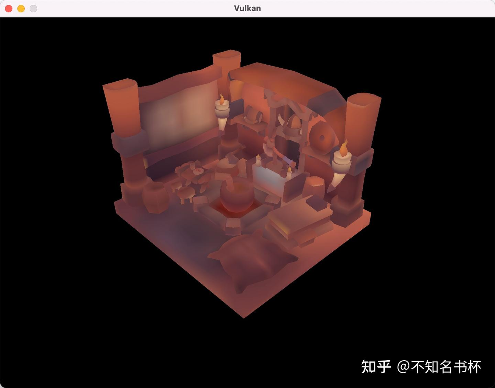

# Vulkan Generating Mipmaps

> 这里是记录笔者Vulkan的学习记录，参照该教程[vulkan-tutorial.com](https://vulkan-tutorial.com/Drawing_a_triangle/Drawing/Command_buffers)这里是记录笔者Vulkan的学习记录，如果你想识别Vulkan相比于之前的传统图形API有什么区别和优势的话，欢迎看我的另外一篇文章[初探Vulkan](https://zhuanlan.zhihu.com/p/554631289)。相信应该能够帮助你识别Vulkan的优势所在。

我们的程序现在可以加载和渲染3D模型。在这里我们将增加一个功能，即mipmap生成。Mipmaps在游戏和渲染软件中被广泛使用，而Vulkan让我们可以完全控制它们的创建方式。

Mipmaps是预先计算好的、缩小的图像版本。每张新图像的宽度和高度都是前一张的一半。Mipmaps被用来作为一种LOD的形式。离摄像机较远的物体将从较小的Mip Image中提取其纹理。使用较小的图像可以提高渲染速度，并避免出现[摩尔纹](https://zhida.zhihu.com/search?content_id=212511094&content_type=Article&match_order=1&q=摩尔纹&zhida_source=entity)等走样出现。一个关于[mipmaps](https://zhida.zhihu.com/search?content_id=212511094&content_type=Article&match_order=1&q=mipmaps&zhida_source=entity)例子如下所示。


## **Image creation**

在Vulkan中，每个mip Image都被存储在VkImage的不同mip Level中。0级是原始图像，而0级之后的mip Level通常被称为mip链。

mip Level的数量在创建VkImage时被指定。到现在为止，我们一直将这个值设置为1。我们需要从图像的尺寸中计算出mip层的数量。首先，添加一个类成员来存储这个数字。

```cpp
uint32_t mipLevels;

int texWidth, texHeight, texChannels;
stbi_uc* pixels = stbi_load(TEXTURE_PATH.c_str(), &texWidth, &texHeight, &texChannels, STBI_rgb_alpha);
...
mipLevels = static_cast<uint32_t>(std::floor(std::log2(std::max(texWidth, texHeight)))) + 1;
```

这是为了计算了mip链的最大Level。max函数选择最大的维度。log2函数计算该维度可以被2除以多少倍。 [floor函数](https://zhida.zhihu.com/search?content_id=212511094&content_type=Article&match_order=1&q=floor函数&zhida_source=entity)处理最大维度不是2的幂的情况。

为了使用这个值，我们需要改变createImage、createImageView和transitionImageLayout函数，以允许我们指定[mip level](https://zhida.zhihu.com/search?content_id=212511094&content_type=Article&match_order=1&q=mip+level&zhida_source=entity)的数量。在这些函数中添加一个mipLevels参数。

```cpp
void createImage(uint32_t width, uint32_t height, uint32_t mipLevels, VkFormat format, VkImageTiling tiling, VkImageUsageFlags usage, VkMemoryPropertyFlags properties, VkImage& image, VkDeviceMemory& imageMemory) {
    ...
    imageInfo.mipLevels = mipLevels;
    ...
}

VkImageView createImageView(VkImage image, VkFormat format, VkImageAspectFlags aspectFlags, uint32_t mipLevels) {
    ...
    viewInfo.subresourceRange.levelCount = mipLevels;
    ...

void transitionImageLayout(VkImage image, VkFormat format, VkImageLayout oldLayout, VkImageLayout newLayout, uint32_t mipLevels) {
    ...
    barrier.subresourceRange.levelCount = mipLevels;
    ...
```

依赖这些辅助函数的函数都需要进行修改。添加mipLevels参数。在这里就不一一列举了。

## **Generating Mipmaps**

我们的纹理图像现在有多个mip level，但Staging Buffer只能用来填充mip级别0。其他级别仍然没有定义。为了填充这些Level，我们需要从我们拥有的单一层次中生成数据。我们将使用vkCmdBlitImage命令。这个命令可以执行复制、缩放和过滤操作。我们将多次调用这个方法，将数据混合到我们的纹理图像的每个mip Level。

vkCmdBlitImage被认为是一个传输(Transfer)操作，所以我们必须告知Vulkan我们打算将纹理图像作为传输的源和目的。将VK_IMAGE_USAGE_TRANSFER_SRC_BIT添加到createTextureImage中纹理图像的使用标志中。

```cpp
createImage(texWidth, texHeight, mipLevels, VK_FORMAT_R8G8B8A8_SRGB, VK_IMAGE_TILING_OPTIMAL, VK_IMAGE_USAGE_TRANSFER_SRC_BIT | VK_IMAGE_USAGE_TRANSFER_DST_BIT | VK_IMAGE_USAGE_SAMPLED_BIT, VK_MEMORY_PROPERTY_DEVICE_LOCAL_BIT, textureImage, textureImageMemory);
```

vkCmdBlitImage依赖于它所操作的图像的布局。我们可以将整个图像过渡到 VK_IMAGE_LAYOUT_GENERAL，但会很慢。为了获得最佳性能，源图像应该在VK_IMAGE_LAYOUT_TRANSFER_SRC_OPTIMAL，目标图像应该在VK_IMAGE_LAYOUT_TRANSFER_DST_OPTIMAL。Vulkan允许我们对图像的每个mip Level进行独立过渡。每个blit一次只处理两个mip Level，所以我们可以在blit命令之间将每个层过渡到最合适布局。

transitionImageLayout方法只对整个Image进行布局转换，所以我们需要多写几个管道屏障(Pipeline Barrier)命令。在createTextureImage中删除现有的过渡到VK_IMAGE_LAYOUT_SHADER_READ_ONLY_OPTIMAL的操作。

```cpp
void generateMipmaps(VkImage image, int32_t texWidth, int32_t texHeight, uint32_t mipLevels) {
    VkCommandBuffer commandBuffer = beginSingleTimeCommands();

    VkImageMemoryBarrier barrier = {};
    barrier.sType = VK_STRUCTURE_TYPE_IMAGE_MEMORY_BARRIER;
    barrier.image = image;
    barrier.srcQueueFamilyIndex = VK_QUEUE_FAMILY_IGNORED;
    barrier.dstQueueFamilyIndex = VK_QUEUE_FAMILY_IGNORED;
    barrier.subresourceRange.aspectMask = VK_IMAGE_ASPECT_COLOR_BIT;
    barrier.subresourceRange.baseArrayLayer = 0;
    barrier.subresourceRange.layerCount = 1;
    barrier.subresourceRange.levelCount = 1;

    endSingleTimeCommands(commandBuffer);
}
```

我们将进行几个转换，因此我们将重用这个VkImageMemoryBarrier。以上设置的字段将对所有barrier保持不变。subresourceRange.miplevel, oldLayout, newLayout, srcAccessMask和dstAccessMask会随着每个转换而改变。

```cpp
int32_t mipWidth = texWidth;
int32_t mipHeight = texHeight;

for (uint32_t i = 1; i < mipLevels; i++) {
        barrier.subresourceRange.baseMipLevel = i - 1;
        barrier.oldLayout = VK_IMAGE_LAYOUT_TRANSFER_DST_OPTIMAL;
        barrier.newLayout = VK_IMAGE_LAYOUT_TRANSFER_SRC_OPTIMAL;
        barrier.srcAccessMask = VK_ACCESS_TRANSFER_WRITE_BIT;
        barrier.dstAccessMask = VK_ACCESS_TRANSFER_READ_BIT;

        vkCmdPipelineBarrier(commandBuffer,
            VK_PIPELINE_STAGE_TRANSFER_BIT, VK_PIPELINE_STAGE_TRANSFER_BIT, 0,
            0, nullptr,
            0, nullptr,
            1, &barrier);
}
```

首先，转换Level从`i - 1` 到 VK_IMAGE_LAYOUT_TRANSFER_SRC_OPTIMAL。这个转换将等待`i - 1` Level被填充，或者来自前面的blit命令或者来自vkCmdCopyBufferToImage，当前blit命令将等待这次转换。

```cpp
VkImageBlit blit{};
blit.srcOffsets[0] = { 0, 0, 0 };
blit.srcOffsets[1] = { mipWidth, mipHeight, 1 };
blit.srcSubresource.aspectMask = VK_IMAGE_ASPECT_COLOR_BIT;
blit.srcSubresource.mipLevel = i - 1;
blit.srcSubresource.baseArrayLayer = 0;
blit.srcSubresource.layerCount = 1;
blit.dstOffsets[0] = { 0, 0, 0 };
blit.dstOffsets[1] = { mipWidth > 1 ? mipWidth / 2 : 1, mipHeight > 1 ? mipHeight / 2 : 1, 1 };
blit.dstSubresource.aspectMask = VK_IMAGE_ASPECT_COLOR_BIT;
blit.dstSubresource.mipLevel = i;
blit.dstSubresource.baseArrayLayer = 0;
blit.dstSubresource.layerCount = 1;
```

接下来，我们指定将在blit操作中使用的区域。srcOffsets数组中的两个元素决定了数据将被blit出来的二维区域，dstOffsets决定了数据将被blit到的区域。dstOffsets[1]的X和Y维度被除以2，因为每个mip层是前一个层的一半大小。srcOffsets[1]和dstOffsets[1]的Z尺寸必须是1，因为[二维图像](https://zhida.zhihu.com/search?content_id=212511094&content_type=Article&match_order=1&q=二维图像&zhida_source=entity)的深度是1。

```cpp
vkCmdBlitImage(commandBuffer,
    image, VK_IMAGE_LAYOUT_TRANSFER_SRC_OPTIMAL,
    image, VK_IMAGE_LAYOUT_TRANSFER_DST_OPTIMAL,
    1, &blit,
    VK_FILTER_LINEAR);
```

现在，我们Record blit命令。注意，srcImage和dstImage参数都使用了textureImage。这是因为我们要在同一图像的不同层次之间进行混合。源mip层刚刚过渡到VK_IMAGE_LAYOUT_TRANSFER_SRC_OPTIMAL，而目的层仍然处于createTextureImage的VK_IMAGE_LAYOUT_TRANSFER_DST_OPTIMAL。

如果你使用专门的传输队列（如[顶点缓冲区](https://zhida.zhihu.com/search?content_id=212511094&content_type=Article&match_order=1&q=顶点缓冲区&zhida_source=entity)中建议的那样），请注意：vkCmdBlitImage必须提交给具有图形功能的队列。

最后一个参数允许我们指定一个VkFilter，以便在Blit中使用。我们在这里有和创建VkSampler时一样的过滤选项。我们使用VK_FILTER_LINEAR来启用插值。

```cpp
barrier.oldLayout = VK_IMAGE_LAYOUT_TRANSFER_SRC_OPTIMAL;
barrier.newLayout = VK_IMAGE_LAYOUT_SHADER_READ_ONLY_OPTIMAL;
barrier.srcAccessMask = VK_ACCESS_TRANSFER_READ_BIT;
barrier.dstAccessMask = VK_ACCESS_SHADER_READ_BIT;

vkCmdPipelineBarrier(commandBuffer,
    VK_PIPELINE_STAGE_TRANSFER_BIT, VK_PIPELINE_STAGE_FRAGMENT_SHADER_BIT, 0,
    0, nullptr,
    0, nullptr,
    1, &barrier);
```

这个barrier将mip level 0到i - 1转换到到VK_IMAGE_LAYOUT_SHADER_READ_ONLY_OPTIMAL。这个转换会等待当前blit命令的完成。所有的采样操作都将等待这个转换的完成。

```cpp
if (mipWidth > 1) mipWidth /= 2;
if (mipHeight > 1) mipHeight /= 2;
```

在循环的最后，我们将当前的mip level Image尺寸除以2。我们在除法之前检查每个维度，以确保该维度不会变成0。这可以处理图像不是方形的情况，因为其中一个mip维度会在另一个维度之前尺寸达到1。当这种情况发生时，该维度在所有剩余的mip Level中应该保持为1。

```cpp
barrier.subresourceRange.baseMipLevel = mipLevels - 1;
    barrier.oldLayout = VK_IMAGE_LAYOUT_TRANSFER_DST_OPTIMAL;
    barrier.newLayout = VK_IMAGE_LAYOUT_SHADER_READ_ONLY_OPTIMAL;
    barrier.srcAccessMask = VK_ACCESS_TRANSFER_WRITE_BIT;
    barrier.dstAccessMask = VK_ACCESS_SHADER_READ_BIT;

    vkCmdPipelineBarrier(commandBuffer,
        VK_PIPELINE_STAGE_TRANSFER_BIT, VK_PIPELINE_STAGE_FRAGMENT_SHADER_BIT, 0,
        0, nullptr,
        0, nullptr,
        1, &barrier);

    endSingleTimeCommands(commandBuffer);
}
```

在我们结束Command Buffer的Record之前，我们再插入一个PipeLine barrier。这个barrier将最后一个mip层从VK_IMAGE_LAYOUT_TRANSFER_DST_OPTIMAL过渡到VK_IMAGE_LAYOUT_SHADER_READ_ONLY_OPTIMAL。这不是由循环来处理的，因为最后一个mip Level从来没有被blit过。

```cpp
transitionImageLayout(textureImage, VK_FORMAT_R8G8B8A8_SRGB, VK_IMAGE_LAYOUT_UNDEFINED, VK_IMAGE_LAYOUT_TRANSFER_DST_OPTIMAL, mipLevels);
    copyBufferToImage(stagingBuffer, textureImage, static_cast<uint32_t>(texWidth), static_cast<uint32_t>(texHeight));
//transitioned to VK_IMAGE_LAYOUT_SHADER_READ_ONLY_OPTIMAL while generating mipmaps
...
generateMipmaps(textureImage, texWidth, texHeight, mipLevels);
```

## **Linear filtering support**

使用像vkCmdBlitImage这样的内置函数来生成所有mipLevel是非常方便的，但不幸的是，它不能保证在所有平台上都受支持。它需要我们用来支持[线性过滤](https://zhida.zhihu.com/search?content_id=212511094&content_type=Article&match_order=1&q=线性过滤&zhida_source=entity)的纹理图像格式，可以使用vkGetPhysicalDeviceFormatProperties函数来检查。我们将为此向generateMipmaps函数添加一个检查。

首先需要添加一个参数：

```cpp
void createTextureImage() {
    ...
    generateMipmaps(textureImage, VK_FORMAT_R8G8B8A8_UNORM, texWidth, texHeight, mipLevels);
}

void generateMipmaps(VkImage image, VkFormat imageFormat, int32_t texWidth, int32_t texHeight, uint32_t mipLevels) {
    ...
}
```

在**generateMipmaps**函数中，使用vkGetPhysicalDeviceFormatProperties请求纹理图像格式的属性:

```cpp
VkFormatProperties formatProperties;
vkGetPhysicalDeviceFormatProperties(physicalDevice, imageFormat, &formatProperties);
```

VkFormatProperties结构有三个字段，分别为linearTilingFeatures、optimalTilingFeatures和bufferFeatures，每个字段分别描述如何使用格式。我们采用最优平铺格式创建一个纹理图像，所以我们需要检查优化功能。线性过滤特性的支持可以通过vk_format_feature_sampled_image_filter_linear进行检查:

```cpp
if (!(formatProperties.optimalTilingFeatures & VK_FORMAT_FEATURE_SAMPLED_IMAGE_FILTER_LINEAR_BIT)) {
    throw std::runtime_error("texture image format does not support linear blitting!");
}
```

在这种情况下，有两种选择。你可以实现一个函数来搜索常见的纹理图像格式，寻找一个支持线性过滤的格式，或者你可以用一个类似stb_image_resize的库在软件中实现mipmap的生成。然后，每个mip级别都可以以加载原始图像的相同方式加载到图像中。

应该注意的是，在实践中，在运行时生成mipmap级别是不常见的。通常情况下，它们是预先生成的，并与基本级别一起存储在[纹理文件](https://zhida.zhihu.com/search?content_id=212511094&content_type=Article&match_order=1&q=纹理文件&zhida_source=entity)中，以提高加载速度。在软件中实现大小调整和从文件中加载多个层次其实是一个练习。

## **Sampler**

当VkImage持有mipmap数据时，VkSampler控制在渲染时如何读取这些数据。Vulkan允许我们指定minLod、maxLod、mipLodBias和mipmapMode（"Lod "是指 "细节级别"）。当对纹理进行采样时，采样器会根据以下伪码选择一个mip级别。

```cpp
lod = getLodLevelFromScreenSize(); //smaller when the object is close, may be negative
lod = clamp(lod + mipLodBias, minLod, maxLod);

level = clamp(floor(lod), 0, texture.mipLevels - 1);  //clamped to the number of mip levels in the texture

if (mipmapMode == VK_SAMPLER_MIPMAP_MODE_NEAREST) {
    color = sample(level);
} else {
    color = blend(sample(level), sample(level + 1));
}
```

如果samplerInfo.mipmapMode是VK_SAMPLER_MIPMAP_MODE_NEAREST，lod选择要采样的mip级。如果mipmap模式是VK_SAMPLER_MIPMAP_MODE_LINEAR，lod用于选择两个要采样的mip级。这些级别被采样，结果是线性混合的。

```cpp
if (lod <= 0) {
    color = readTexture(uv, magFilter);
} else {
    color = readTexture(uv, minFilter);
}
```

如果物体靠近相机，则使用magFilter作为过滤器。如果物体离摄像机较远，则使用minFilter。mipLodBias让我们强制Vulkan使用比它通常使用的更低的lod和level。

为了看到这次mipmap的结果，我们需要为我们的textureSampler选择值。我们已经将minFilter和magFilter设置为使用VK_FILTER_LINEAR。我们只需要为minLod、maxLod、mipLodBias和mipmapMode选择值。

```cpp
mipLodBias, and mipmapMode.

void createTextureSampler() {
    ...
    samplerInfo.mipmapMode = VK_SAMPLER_MIPMAP_MODE_LINEAR;
    samplerInfo.minLod = 0.0f; // Optional
    samplerInfo.maxLod = static_cast<float>(mipLevels);
    samplerInfo.mipLodBias = 0.0f; // Optional
    ...
}
```

为了允许使用全部的mip级别，我们将minLod设置为0.0f，maxLod设置为mip级别的数量。我们没有理由改变lod值，所以我们将mipLodBias设置为0.0f。


最明显的区别是纸张上的文字。有了mipmap，字迹就被磨平了。如果没有mipmaps，字迹的边缘和摩尔纹走样的间隙都很刺眼。

你可以完成sampler同的设置，看看它们如何影响mipmapping。例如，通过改变minLod，你可以强迫采样器不使用最低的mip水平。

```cpp
samplerInfo.minLod = static_cast<float>(mipLevels / 2);
```

结果如下所示：



