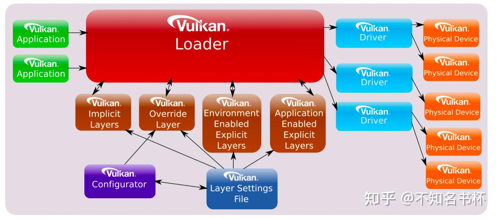
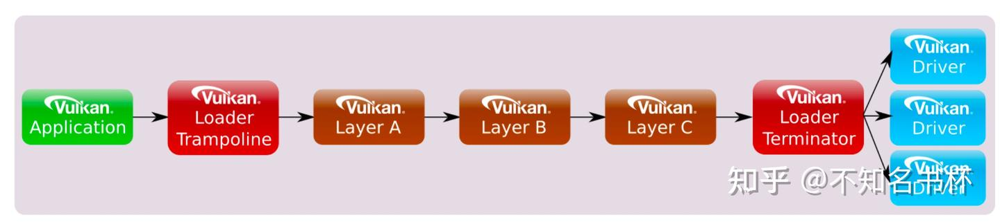
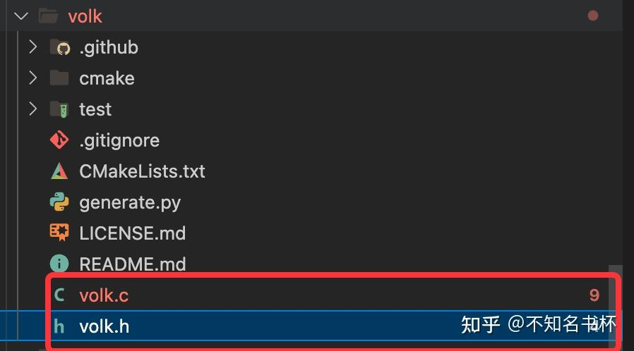
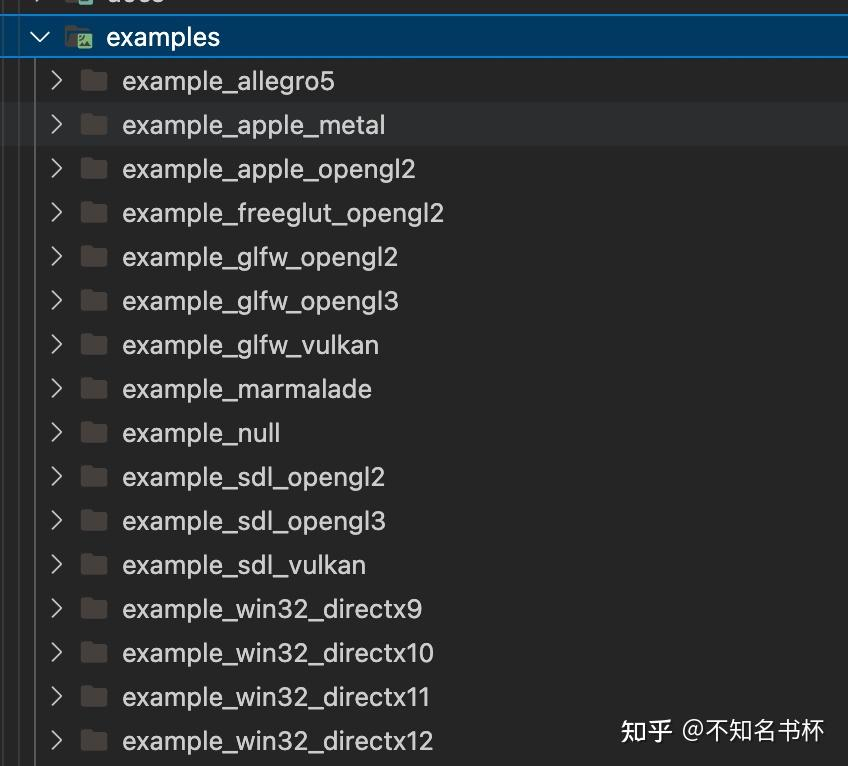
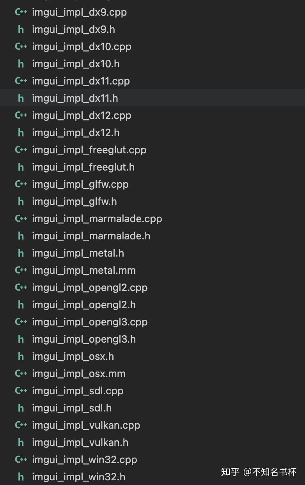
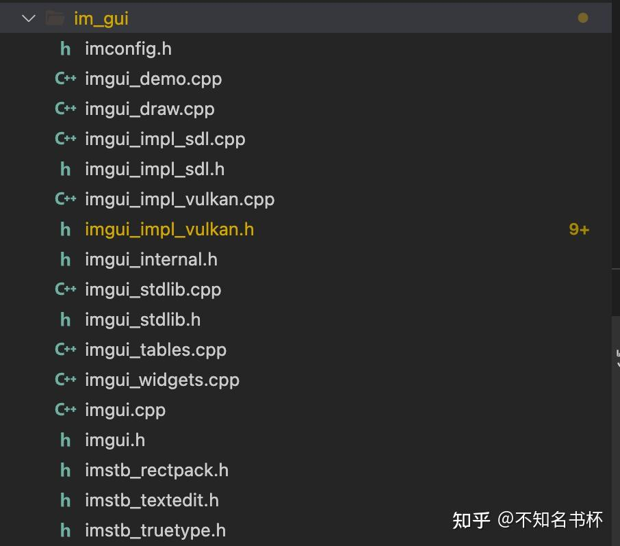
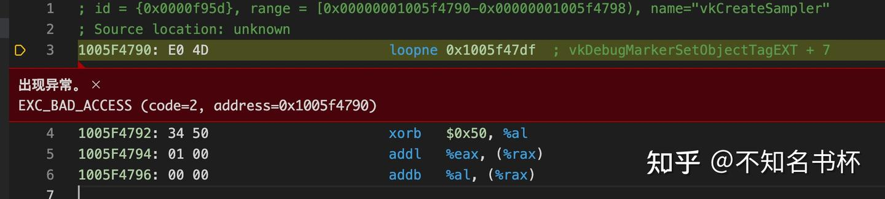
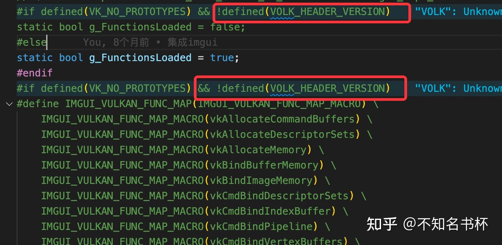
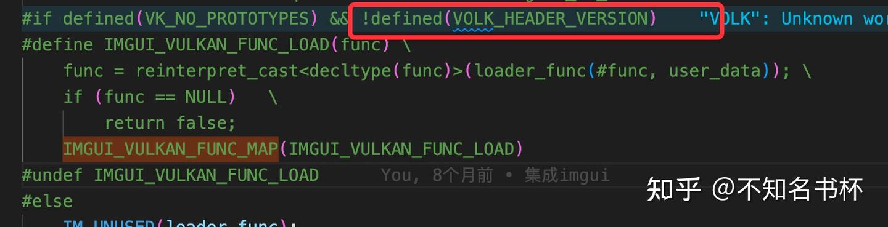
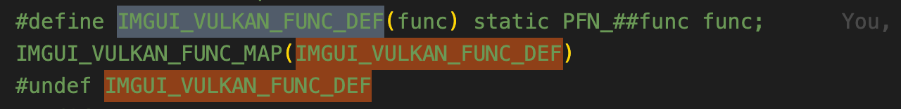

# Vulkan集成Volk踩坑记录

## 前言

本文是记录项目中集成Volk过程的踩坑过程以及在Volk下集成其他第三方库的注意事项，特此记录希望能让其他同学避免此坑。

## 前置知识::Vulkan架构



### Loader

Vulkan Application位于顶部并且直接与Vulkan Loader交互，而驱动程序(Dirver)位于底部。驱动程序可以控制一个或多个能够渲染的Vulkan Physical Device，实现从Vulkan到本机图形API的转换(比如MoltenVk就需要完成从Vulkan转译为Metal代码)或者实现在CPU上执行以模拟Vulkan设备(如SwiftShader或LavaPipe)。请记住支持Vulkan的硬件可能支持图形或计算能力，或者两者兼而有之。在Application和Drive之间，Loader可以注入任意数量的提供特殊功能的可选Layer。Loader对于将Vulkan函数正确分派到适当的Layer和Drive是至关重要的。Vulkan对象模型允许Loader在[调用链](https://zhida.zhihu.com/search?content_id=229222987&content_type=Article&match_order=1&q=调用链&zhida_source=entity)中插入各种Layer，以便Layer可以在调用驱动程序中函数之前处理Vulkan函数(比如做各种检查比如 Validate Layer和Synchronization Validation Layer)。

Loader的设计目的：

- 这样可以在用户的系统上支持一个或多个Vulkan的驱动程序，并且不会相互干扰。
- 支持Layer，它们是可由应用程序、开发人员或标准系统设置启用的可选模块。
- 将Loader的总体开销保持在尽可能低的水平。

### Layer

Layer是Vulkan开发环境中的可选组件。它们可以在从Application到Drive之间拦截、评估和修改现有的Vulkan函数调用。Layer被实现为可以以不同方式启用并在创建Vulkan Instance期间完成加载的库。每个Layer都可以选择Hook或拦截Vulkan函数，而Vulkan函数可以被忽略、检查或增强。假如Layer没有hook任何函数。则可以跳过该Layer，并且继续到下一个启用的Layer或直接到Driver。因此Layer可以选择是拦截所有已知的Vulkan函数或者是只拦截它感兴趣的子集。

现在Vulkan开发环境中已经有了很多类型的Layer，已经支持以下的功能：

- 检验函数调用参数
- 跟踪函数调用
- 调试辅助工具
- 同步调试
- 性能分析

并且Layer是可选的和动态加载的，可以根据需要启用和禁用它们。在开发和调试Application时可以启用某些Layer有助于确保它正确使用Vulkan。但是在发布正式版Application时，这些Layer是不必要的，因此不会被启用从而提高了应用程序的速度。

### Drive

实现Vulkan的库要么直接通过Physical Device来支持或者是将Vulkan命令转换为本地图形命令或者通过CPU模拟Vulkan，这些都被认为是“驱动程序”。最常见的驱动程序类型仍然是可安装客户端驱动程序(ICD)。Loader负责发现系统上可用的Vulkan Driver。并且可以给定可用Driver的列表，Loader可以枚举所有可用的Physical Device并为应用程序提供此信息。

**Installable Client Drivers(ICD)**

Vulkan允许多个ICD，每个ICD支持一个或多个设备。这些设备中的每一个都由Vulkan Physical Device对象表示。Loader负责通过系统上的标准驱动程序搜索发现可用的Vulkan ICD。

## 如何调用到Vulkan的函数？

Vulkan作为一个图形API标准，各家显卡商都会在驱动程序中实现Vulkan函数。驱动程序会提供每个平台对应的共享库并把标准接口通过库导出出去。在Windows上是dll和dllexport，在MacOS上则是dylib和dlsym。通常我们都会安装一个Vulkan的SDK但是可能会下载不同版本的SDK。这里有需要注意的点，比如1.1.130.0 SDK可用于开发Vulkan 1.0的应用程序，但不能用于开发Vulkan 1.2的应用程序。此外1.2.xx SDK的存在并不一定表明一个系统可以实际运行Vulkan 1.2。应用程序要使用大多数Vulkan 1.2功能，需要一个Vulkan 1.2驱动程序。重点还是在于显卡中的驱动支持的Vulkan什么版本。

Vulkan SDK会包含Vulkan头文件和[静态库](https://zhida.zhihu.com/search?content_id=229222987&content_type=Article&match_order=1&q=静态库&zhida_source=entity)，Vulkan头文件只提供了Vulkan函数声明，当构建一个Vulkan应用程序时你必须将其链接到Loader上，否则会得到Vulkan函数未定义的报错。有两种方式如下所示：

- 编译时直接链接：直接链接一个内置的Vulkan Loader(无论是作为静态库还是[动态库](https://zhida.zhihu.com/search?content_id=229222987&content_type=Article&match_order=1&q=动态库&zhida_source=entity)，一般使用SDK的Loader，当然你也可以构建自己的Loader)
- Runtime时[动态加载](https://zhida.zhihu.com/search?content_id=229222987&content_type=Article&match_order=2&q=动态加载&zhida_source=entity)：动态加载是使用动态符号查找(通过dlsym和dlopen等系统调用)，Application可以初始化自己的调度表。这允许Application在无法找到Loader时抛出失败报错。它还为Application调用Vulkan函数提供了最快的机制。

这就是找到Vulkan函数的两种方式，并且后续介绍的Volk便是使用动态加载的方式。如下所示是Volk当中初始化函数volkInitialize，也就是将整个lib加载到内存当中，从库里通过API的名字来加载函数。

```cpp
VkResult volkInitialize(void)
{
#if defined(_WIN32)
    HMODULE module = LoadLibraryA("vulkan-1.dll");
    if (!module)
        return VK_ERROR_INITIALIZATION_FAILED;

    // note: function pointer is cast through void function pointer to silence cast-function-type warning on gcc8
    vkGetInstanceProcAddr = (PFN_vkGetInstanceProcAddr)(void(*)(void))GetProcAddress(module, "vkGetInstanceProcAddr");
#elif defined(__APPLE__)
    void* module = dlopen("libvulkan.dylib", RTLD_NOW | RTLD_LOCAL);
    if (!module)
        module = dlopen("libvulkan.1.dylib", RTLD_NOW | RTLD_LOCAL);
    if (!module)
        module = dlopen("libMoltenVK.dylib", RTLD_NOW | RTLD_LOCAL);
    if (!module)
        return VK_ERROR_INITIALIZATION_FAILED;

    vkGetInstanceProcAddr = (PFN_vkGetInstanceProcAddr)dlsym(module, "vkGetInstanceProcAddr");
#else
    void* module = dlopen("libvulkan.so.1", RTLD_NOW | RTLD_LOCAL);
    if (!module)
        module = dlopen("libvulkan.so", RTLD_NOW | RTLD_LOCAL);
    if (!module)
        return VK_ERROR_INITIALIZATION_FAILED;

    vkGetInstanceProcAddr = (PFN_vkGetInstanceProcAddr)dlsym(module, "vkGetInstanceProcAddr");
#endif

    volkGenLoadLoader(NULL, vkGetInstanceProcAddrStub);

    return VK_SUCCESS;
}
```

## 什么是Volk？

Volk则是Vulkan的元Loader。它允许您动态加载使用Vulkan所需入口点(entrypoints)，而无需链接到对应Vulkan的dll或静态链接Vulkan Loader。此外Volk通过自动加载所有相关的入口点来简化Vulkan扩展的使用。最后Volk允许直接从Driver中加载Vulkan入口点，这可以通过跳过Vulkan的Loader调度开销来提高性能。

## 为什么选择Volk？

我们在这里选择Volk的目的是什么呢？首先是如果是使用[静态链接](https://zhida.zhihu.com/search?content_id=229222987&content_type=Article&match_order=2&q=静态链接&zhida_source=entity)的方式则需要配置各种链接库的工程设置，如果用Volk可以减少各种链接库相关的工程配置，并且Volk的使用相当方便，只要调用几个初始化函数即可。并且在上面的Vulkan架构当中可以看出Vulkan函数调用可能通过许多的Layer，并且一些函数在内层中可通过内层的GetProc可以直接得到接口，不需要通过上层的层层转发。可以提高一定的效率。

下图表示了vkCreateInstance的调用链流程。初始化调用链后，Loader调用第一个Layer的vkCreateInstance，它将调用下一个Layer的vkCreateInstance，并最终再次在Loader中终止，它将调用每个Driver的vkCreateInstance。这允许链中每个启用的Layer根据应用程序中的VkInstanceCreateInfo结构设置它需要的内容。



## 如何接入Volk

### 构建

现在开始接入Volk吧！下载Volk仓库如下所示，最关键的两个文件的也就是volk.h和volk.c。



在这里有两种方式来集成Volk到你的项目，如下所示：

- 可以使用head-only的方式集成Volk，在任何您想使用Vulkan函数的地方都包含volk.h。并且在引入volk.h之前定义VOLK_IMPLEMENTATION。这种方法就不需要再编译volk.c文件。
- 将volk.c加入到你的构建系统中(Cmake，Xmake)，这样需要注意的是在构建volk.c时，必须将启用Vulkan平台特定功能的常规预处理器定义(VK_USE_PLATFORM_WIN32_KHR、VK_USE_PLATFORM_XLIB_KHR、VK_USE_PLATFORM_MACOS_MVK等)按需要传递给编译器。

### 使用

如果没有使用volk，我们需要在使用Vulkan函数时引入vulkan/vulkan.h头文件，其中包含了函数声明。但是如果使用volk的话则只需要引入volk.h文件即可。但是这还有会有一个问题，那就是在集成了volk的情况下引入了vulkan/vulkan.h头文件。而没有引入volk.h的话，则会导致符号冲突。这种情况通常会出现在引入其他的第三方库的情况下，其他的库中引入了vulkan/vulkan.h并使用Vulkan函数。所以在编译使用Vulkan的代码时考虑设置VK_NO_PROTOTYPES以确保不会发生这种情况。在实践当中建议是开启VK_NO_PROTOTYPES，一般也不能保证后续引入的第三方没有引入[vulkan.h](https://zhida.zhihu.com/search?content_id=229222987&content_type=Article&match_order=4&q=vulkan.h&zhida_source=entity)。同时也要确保Vulkan的lib未链接到Application也很重要，因为同样会导致符号名称冲突。如下所示，这是一个通过构建volk.c的例子。

```cpp
#if defined(_WIN32)
#   define VK_USE_PLATFORM_WIN32_KHR
#elif defined(__linux__) || defined(__unix__)
#   define VK_USE_PLATFORM_XLIB_KHR
#elif defined(__APPLE__)
#   define VK_USE_PLATFORM_MACOS_MVK
#else
#endif
#define VK_NO_PROTOTYPES
#include "volk.h"
```

接下来初始volk！需要调用volkInitialize函数。这将尝试从系统加载Vulkan Loader，如果此函数返回VK_SUCCESS则可以继续创建Vulkan Instance。如果此函数失败，这意味着您的系统上没有安装Vulkan Loader。如下所示：

```cpp
int main(int argc, char** argv)
{

    VkResult r;
    uint32_t version;
    r = volkInitialize();
    if (r != VK_SUCCESS) {
        printf("volkInitialize failed!\n");
        return -1;
    }
}
```

并且在使用Vulkan API创建Vulkan实例后，调用volkLoadInstance函数。

```cpp
void volkLoadInstance(VkInstance instance);
```

此函数将加载所有必需的Vulkan入口点，包括所有Extension，在这之后就可以和往常一样使用Vulkan啦。

如果到此为止的话，在使用中所有与Vulkan Device相关的函数调用例如vkCmdDraw，都将通过Vulkan Loader来调度代码。这允许您在同一个Application中透明地支持多个VkDevice对象，但代价是调度开销可能高达7%，具体取决于Driver和Application。

如果需要避免的话，同样需要对于Device做处理。如果在Application只需要一个Device的话，直接调用volkLoadDevice即可。后续正常使用Vulkan函数即可。

```cpp
void volkLoadDevice(VkDevice device);
```

如果在Application需要多个Device的话，则调用volkLoadDeviceTable，这将要求更改Application代码以每个VkDevice存储一个VolkDeviceTable并从此表调用Vulkan函数。

```cpp
void volkLoadDeviceTable(struct VolkDeviceTable* table, VkDevice device);
```

volkLoadDevice内部使用vkGetDeviceProcAddr来加载Device相关函数的入口点，当不存在Layer时这通常会让大多数函数指针直接指向驱动程序，从而最大限度地减少调用开销。加载Layer时入口点将指向第一个可用Layer中的实现，所以这与包括Validation Layer在内的任何Layer都是兼容的。

## 在Volk下接入Vma

通常项目都会集成Vma来作为Vulkan的内存分配器，Vma同样也是一个head-only库，只需要头文件即可。一般如果没有引入Volk则无需任何操作，因为宏VMA_STATIC_VULKAN_FUNCTIONS默认定义为1。只需要直接引入vk_mem_alloc.h文件即可，并且在引入前添加VMA_IMPLEMENTATION，如下所示：

```cpp
#define VMA_IMPLEMENTATION
#include "vk_mem_alloc.h"
```

如希望VMA使用vkGetInstanceProcAddr、vkGetDeviceProcAddr动态加载指向Vulkan函数指针的话，则需要将VMA_STATIC_VULKAN_FUNCTIONS设置为0，VMA_DYNAMIC_VULKAN_FUNCTIONS设置为1。流程如下所示：

```cpp
#define VMA_STATIC_VULKAN_FUNCTIONS 0
#define VMA_DYNAMIC_VULKAN_FUNCTIONS 1
#include "vk_mem_alloc.h"

VmaVulkanFunctions vulkanFunctions = {};
vulkanFunctions.vkGetInstanceProcAddr = &vkGetInstanceProcAddr;
vulkanFunctions.vkGetDeviceProcAddr = &vkGetDeviceProcAddr;

VmaAllocatorCreateInfo allocatorCreateInfo = {};
allocatorCreateInfo.vulkanApiVersion = VK_API_VERSION_1_2;
allocatorCreateInfo.physicalDevice = physicalDevice;
allocatorCreateInfo.device = device;
allocatorCreateInfo.instance = instance;
allocatorCreateInfo.pVulkanFunctions = &vulkanFunctions;

VmaAllocator allocator;
vmaCreateAllocator(&allocatorCreateInfo, &allocator);
```

如果使用volk的话还是像上面一样配置的话。则会导致找不到对应的Vulkan函数实现。本质上Vma内部上还是需要调用各种Vulkan函数的。之前静态链接的方法无需手动注入这些函数。Vma可以自动获取到。使用volk的话这些函数都需要手动注入啦！并需要将VMA_STATIC_VULKAN_FUNCTIONS和VMA_DYNAMIC_VULKAN_FUNCTIONS设置为0。并且将相应的Vulkan函数传入VmaVulkanFunctions中。如下所示：

```cpp
#define VMA_STATIC_VULKAN_FUNCTIONS 0
#define VMA_DYNAMIC_VULKAN_FUNCTIONS 0
#include "vk_mem_alloc.h"

VmaVulkanFunctions vulkanFunctions{};
vulkanFunctions.vkGetPhysicalDeviceProperties = vkGetPhysicalDeviceProperties;
vulkanFunctions.vkGetPhysicalDeviceMemoryProperties = vkGetPhysicalDeviceMemoryProperties;
vulkanFunctions.vkAllocateMemory = vkAllocateMemory;
vulkanFunctions.vkFreeMemory = vkFreeMemory;
vulkanFunctions.vkMapMemory = vkMapMemory;
vulkanFunctions.vkUnmapMemory = vkUnmapMemory;
vulkanFunctions.vkFlushMappedMemoryRanges = vkFlushMappedMemoryRanges;
vulkanFunctions.vkInvalidateMappedMemoryRanges = vkInvalidateMappedMemoryRanges;
vulkanFunctions.vkBindBufferMemory = vkBindBufferMemory;
vulkanFunctions.vkBindImageMemory = vkBindImageMemory;
vulkanFunctions.vkGetBufferMemoryRequirements = vkGetBufferMemoryRequirements;
vulkanFunctions.vkGetImageMemoryRequirements = vkGetImageMemoryRequirements;
vulkanFunctions.vkCreateBuffer = vkCreateBuffer;
vulkanFunctions.vkDestroyBuffer = vkDestroyBuffer;
vulkanFunctions.vkCreateImage = vkCreateImage;
vulkanFunctions.vkDestroyImage = vkDestroyImage;
vulkanFunctions.vkCmdCopyBuffer = vkCmdCopyBuffer;
vulkanFunctions.vkGetBufferMemoryRequirements2KHR = vkGetBufferMemoryRequirements2KHR;
vulkanFunctions.vkGetImageMemoryRequirements2KHR = vkGetImageMemoryRequirements2KHR;
vulkanFunctions.vkBindBufferMemory2KHR = vkBindBufferMemory2KHR;
vulkanFunctions.vkBindImageMemory2KHR = vkBindImageMemory2KHR;
vulkanFunctions.vkGetPhysicalDeviceMemoryProperties2KHR =  vkGetPhysicalDeviceMemoryProperties2KHR;

VmaAllocatorCreateInfo allocatorCreateInfo = {};
allocatorCreateInfo.vulkanApiVersion = VK_API_VERSION_1_2;
allocatorCreateInfo.physicalDevice = physicalDevice;
allocatorCreateInfo.device = device;
allocatorCreateInfo.instance = instance;
allocatorCreateInfo.pVulkanFunctions = &vulkanFunctions;

VmaAllocator allocator;
vmaCreateAllocator(&allocatorCreateInfo, &allocator);
```

后续就可以继续的愉快的使用vma啦！

## 在Volk下接入Imgui

在很多的项目当中会引入Imgui来作为项目的Gui实现，它是一个C++的Gui库，内部实现简单并且快速、可移植、与渲染器无关且独立。在很多的游戏引擎中使用。来看看如何在Volk下能够愉快的使用Imgui吧。并且在Imgui中包含了很多的示例，可以使用它们来试验是否Imgui接入成功。如下所示，在Imgui中包含了多种图形API的实现，可根据需求引入相关的文件即可。





在这里使用的Vulkan来作为它的渲染后端，所以只需要引入相关文件即可。



可以按照这些示例尝试在接入Volk中的项目来使用Imgui，你将会发现在运行Imgui其中的Demo时会在造成Crash，如下所示，原因是Imgui调用Vulkan相关函数。



原因是接入Volk中我们推荐设置VK_NO_PROTOTYPES，但是宏定义其实并未对Imgui的编译单元可见，在Imgui中还是使用的vulkan/vulkan.h引入Vulkan函数。所以它还是在为静态链接的函数调用生成代码，直接使用vkCreateSampler值而不取消引用。但是它使用全局变量的指针(vkCreateSample)，它从另一个编译单元泄漏，违反了单一定义规则，最终为[静态函数](https://zhida.zhihu.com/search?content_id=229222987&content_type=Article&match_order=1&q=静态函数&zhida_source=entity)生成了代码。并且试图调用该函数指针，从而导致了程序Crash。

接下来有两个方案可以解决这个问题。

### 修改Imgui源码

在这里将修改Imgui其中的源码，主要集中在imgui_impl_vulkan.h和imgui_impl_vulkan.cpp两个文件下

### imgui_impl_vulkan.h

在这里主要就是讲vulkan/vulkan.h，替换为直接引入volk.h。避免按照静态链接的函数调用来生成代码。

```cpp
#include "../volk/volk.h"
// #include <vulkan/vulkan.h>
```

### imgui_impl_vulkan.cpp

VOLK_HEADER_VERSION是一个Volk内部的宏定义，只要引入了volk.h则会被定义。





那么在引入了volk.h的情况下，就会避免使用通过IMGUI_VULKAN_FUNC_LOAD去动态加载对应的Vulkan函数。而是使用IMGUI_VULKAN_FUNC_DEF便可使用Volk全局定义中的Vulkan函数，即可避免上述问题。



但是这个方案需要修改Imgui的源码，这可能后续对于需要更新Imgui的工程来说不太友好，每次重新拉取都需要修改一遍。实际工程中还是不推荐使用这个方案的。

### 设置IMGUI_IMPL_VULKAN_NO_PROTOTYPES

另外一种方案是使用IMGUI_IMPL_VULKAN_NO_PROTOTYPES，这是Imgui官方提供的一个方案。添加了这个宏定义之后再次去编译，我们会得到下面这个结果。所以还需要添加一个ImGui_ImplVulkan_LoadFunctions调用。

```cpp
Assertion failed: (g_FunctionsLoaded && "Need to call ImGui_ImplVulkan_LoadFunctions() if IMGUI_IMPL_VULKAN_NO_PROTOTYPES or VK_NO_PROTOTYPES are set!"), 
function ImGui_ImplVulkan_Init, file imgui_impl_vulkan.cpp, line 1033.
```

后续再调用ImGui_ImplVulkan_Init之前调用ImGui_ImplVulkan_LoadFunctions如下所示：

```cpp
ImGui_ImplVulkan_LoadFunctions([](const char *function_name, void *vulkan_instance) {
    return vkGetInstanceProcAddr(*(reinterpret_cast<VkInstance *>(vulkan_instance)), function_name);
}, &instance);
```

后续就可以正常的使用Imgui啦！所有的Vulkan函数都是由Volk提供的，因此可以轻松地将所有加载的函数委托给Imgui自己去加载，只需要提供vkGetInstanceProcAddr寄了，其他Vulkan函数可通过vkGetInstanceProcAddr获取，而无需更改Imgui[源代码](https://zhida.zhihu.com/search?content_id=229222987&content_type=Article&match_order=1&q=源代码&zhida_source=entity)中的任何内容。这无疑是更加优雅的方案！

其实说到这里Imgui其实应该想vma提供一个结构类似于上面的VmaVulkanFunctions结构体，这样便可以解决很多的问题。比如当你在Imgui中使用一些Vulkan的新功能或者扩展的时候，但是你的设备未必支持或者SDK的版本不支持。如果是老的SDK，开发者就需要启用IMGUI_IMPL_VULKAN_NO_PROTOTYPES。以便ImGui在运行时加载函数指针，否则便会出现一些链接失败的情况。如果是用vma传一个结构体的方案来说，可能会更加合理，该结构包含Vulkan后端必须使用的所有函数的指针。这就完全避免了这个问题，因为后端不负责任何与函数加载有关的事情。

## **References**

[Vulkan-Guide/loader.adoc at main · KhronosGroup/Vulkan-Guide](https://link.zhihu.com/?target=https%3A//github.com/KhronosGroup/Vulkan-Guide/blob/main/chapters/loader.adoc)

[Vulkan-Loader/LoaderInterfaceArchitecture.md at main · KhronosGroup/Vulkan-Loader](https://link.zhihu.com/?target=https%3A//github.com/KhronosGroup/Vulkan-Loader/blob/main/docs/LoaderInterfaceArchitecture.md%23the-loader)

[https://github.com/zeux/volk](https://link.zhihu.com/?target=https%3A//github.com/zeux/volk)

[https://github.com/ocornut/imgui/issues/4854](https://link.zhihu.com/?target=https%3A//github.com/ocornut/imgui/issues/4854)

[Vulkan Memory Allocator: Quick start](https://link.zhihu.com/?target=https%3A//gpuopen-librariesandsdks.github.io/VulkanMemoryAllocator/html/quick_start.html%23quick_start_initialization)