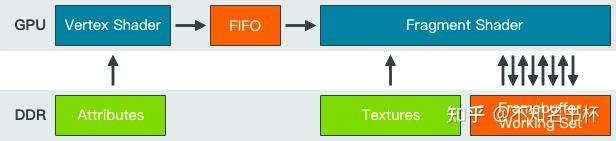
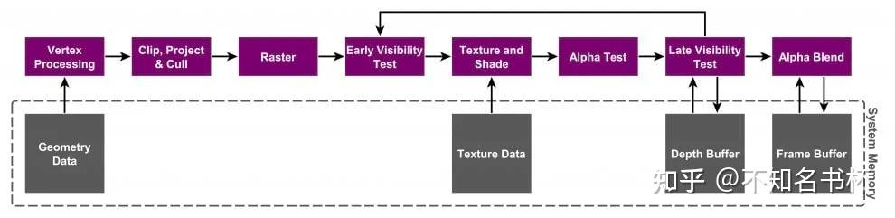
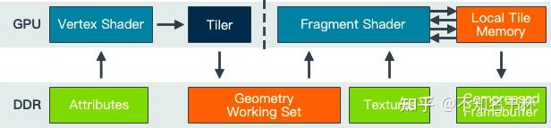
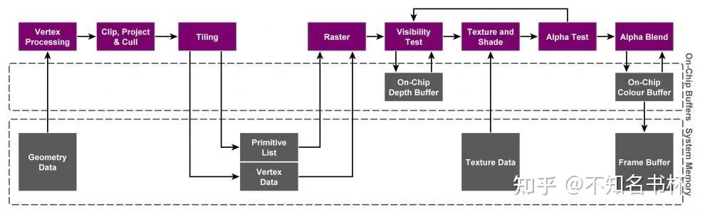
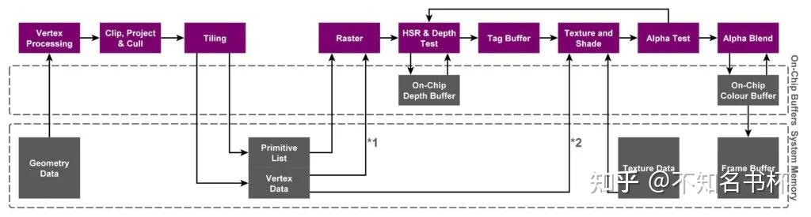
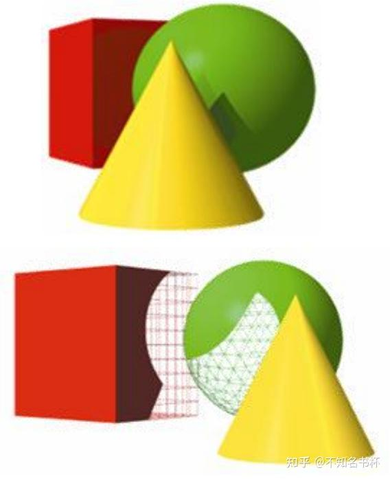
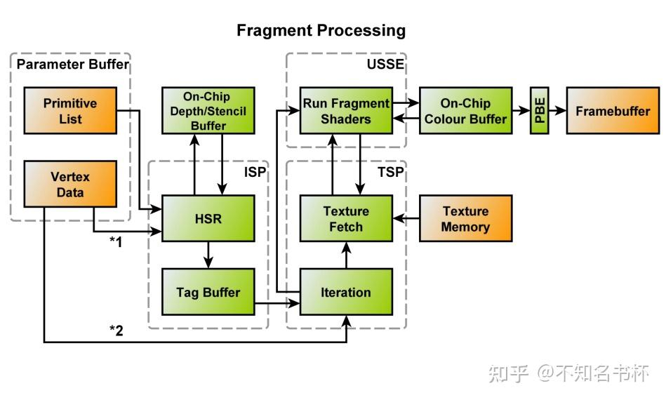
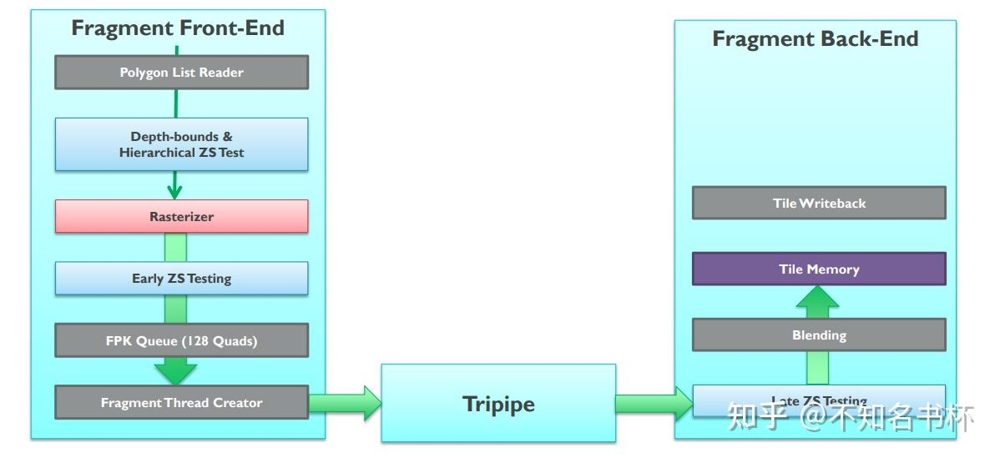
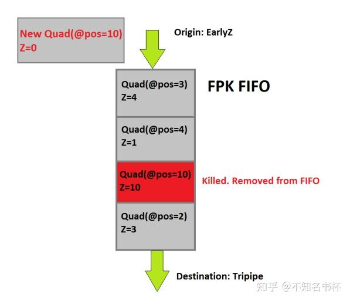
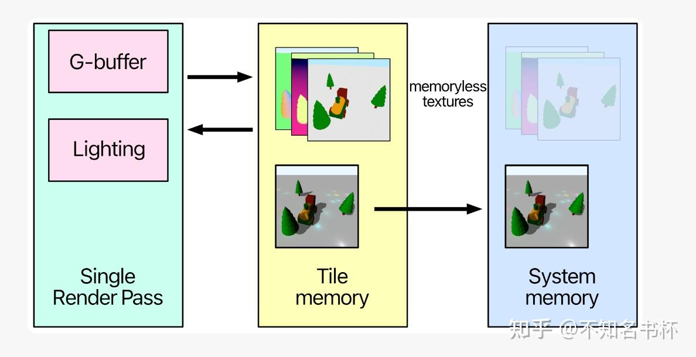

# 浅谈移动端GPU架构

## 前言

本文是关于TBR，TBDR、IMR三种不同的GPU架构的学习和总结，希望可以帮助到大家理解这些概念。

### 前置概念

现有的GPU架构主要分为以下三类：

- Immediately Mode Rendering（IMR）
- Tile-Based Rendering（TBR）
- Tile-based Deferred Rendering（TBDR）

按照硬件可以划分为桌面端GPU和移动端GPU，前者主要是PC或者工作站，后者主要用于手机和平板等等。

## 什么是IMR?

IMR全称Immediately Mode Rendering顾名思义是即时渲染，IMR会将DrawCall处理为严格的[命令流](https://zhida.zhihu.com/search?content_id=234114090&content_type=Article&match_order=1&q=命令流&zhida_source=entity)，每个DrawCall进来就会立马渲染并且渲染结果写入FrameBuffer内。具体的流程可以用以下[伪代码](https://zhida.zhihu.com/search?content_id=234114090&content_type=Article&match_order=1&q=伪代码&zhida_source=entity)表示：

```cpp
for draw in renderPass:
    for primitive in draw:
        for vertex in primitive:
            execute_vertex_shader(vertex)
        if primitive not culled:
            for fragment in primitive:
                execute_fragment_shader(fragment)
```

IMR渲染流程中的数据流动如下图所示，[顶点着色器](https://zhida.zhihu.com/search?content_id=234114090&content_type=Article&match_order=1&q=顶点着色器&zhida_source=entity)处理后的数据会进入一个FiIFO中并依次处理，可以看出IMR需要多次和FrameBuffer进行存取操作，这个带宽损耗也是相当炸裂，



TBR的整体流程如下所示：




优点：

- 首先每个[图元](https://zhida.zhihu.com/search?content_id=234114090&content_type=Article&match_order=1&q=图元&zhida_source=entity)直接提交渲染，无需任何额外处理，因为只需要专注于渲染图元而无需其他的控制逻辑，可以极大的提高GPU的吞吐量，充分利用GPU的性能。
- 顶点数据被填充到FIFO队列里依次处理，即使几何数据再多，也会累积在On-Chip上。直到下一阶段准备好使用这些数据。这意味着GPU使用很少的外部内存带宽来存储和检索中间几何结果。这也让IMR架构下可以处理海量的DrawCall和顶点，这也是IMR的优势之一。

缺点：

- 由于每个图元直接被渲染还会出现一个问题。比如A图元已经被渲染，但是B图元完全遮挡了A图元，A图元的渲染就毫无意义，这就是OverDraw。在IMR通常通过Early-Z(硬件支持)来避免OverDraw，也就是上图中的Early Visibility Test阶段。虽然能够避免一定的OverDraw，但是也不能保证效果一定好。
- IMR需要处理大量数据，因为IMR是全屏FrameBuffer上直接渲染的，FrameBuffer是一个全屏的本身就是很大的内存占用的，一般是放在显存中的。然而IMR架构下会和FrameBuffer的交互(多次存取)。并且在像素着色器之后的Depth Test，Stencil Test，Blend等操作都会有多次读取-修改-写入操作，这会消耗大量的带宽，同时还会产生较高的能耗，虽然可以通过将最近访问的[framebuffer](https://zhida.zhihu.com/search?content_id=234114090&content_type=Article&match_order=1&q=framebuffer&zhida_source=entity)部分保持在靠近GPU的位置(也就是On-Chip)来减轻高带宽负载。

## 什么是TBR?

TBR全名为Tile-Based Rendering，顾名思义是基于Tile的渲染，首先和IMR在全屏FrameBuffer上直接渲染不同，TBR的核心思想是将整个屏幕划分为多个Tile(Tile的大小每家厂商可能不一样，这是一个值得斟酌的数字)来进行渲染，并且整个Tile完成[片段着色器](https://zhida.zhihu.com/search?content_id=234114090&content_type=Article&match_order=1&q=片段着色器&zhida_source=entity)后才会将渲染结果写入FrameBuffer，所以TBR拆分为两个阶段，在顶点经过了MVP变换后并且完成裁剪和剔除后，形成对应的图元。首先为了能够知道哪个图元对于该Tile有效，所以需要做一步处理，伪代码如下所示：

```cpp
for draw in renderPass:
    for primitive in draw:
        for vertex in primitive:
            execute_vertex_shader(vertex)
        if primitive not culled:
            append_tile_list(primitive)
```

对应到下图的Tilling阶段，计算出所有对该Tile生效的图元，并存储到Primitive List当中。并且每个[三角面片](https://zhida.zhihu.com/search?content_id=234114090&content_type=Article&match_order=1&q=三角面片&zhida_source=entity)并且将处理后的数据存储到显存中，这些数据包括：顶点位置，VS的输出，三角面片索引，fragment状态以及其他与Tile相关联的数据结构。这些数据结构以及各个Tile的Primitive List都被存储在一个称为FrameData(PowerVR中被称为Parameter Buffer)。

之后就可以开始渲染所在该Tile的图元啦，伪代码如下所示：

```cpp
for tile in renderPass:
    for primitive in tile:
        for fragment in primitive:
            execute_fragment_shader(fragment)
```

根据每个Tile中的Primitive List完成[光栅化](https://zhida.zhihu.com/search?content_id=234114090&content_type=Article&match_order=1&q=光栅化&zhida_source=entity)和像素着色器操作，并将其渲染结果存入FrameBuffer。TBR架构下的数据流动如下所示，也可以看出和Framebuffer存取操作相对变少，与之变化的是像素着色器和On-Chip Memory的交互增加(后面会讲到)。



IMR的整体流程如图所示：



优点：

- TBR减少了对于FrameBuffer频繁的读取和写入，这将大大减少带宽损耗。而且每个Tile足够小的话，可以将FrameBuffer也放在都放在On-Chip上(也就是L1，L2Cache)。而对On-Chip来说读取和写入速度都非常的快。
- 不仅是FrameBuffer的读写，就连Depth Test和Color Blend等操作也可以在On-Chip上完成，这将进一步减少对于显存的存取操作，减少了带宽损耗。
- 一般情况下短暂存在的内容比如Depth Buffer以及Stencil Buffer等等如果后续不需使用即可丢弃，则无需回存到显存中，这进一步减少了带宽损耗。
- 对于某些技术有一定优势，比如MSAA，因为可以在On-Chip上实现 Multisampling，不会带来大量的访问主存的开销，也不会大幅增加显存占用。所以移动平台 MSAA 是比较高效的。但是开启MSAA，因为处理的数据要变多，On-Chip内存是固定的，所以Tile尺寸会对应缩小，会导致Tile整体数量增加。

缺点：

- 将Rasterize/PS的处理延后到处理完所有VS后(从上图也可看出)，而且处理后的数据还是要存入显存再被Rasterize/PS的处理，这一来一回的性能损耗，和IMR相比来说这将是一个明显的延迟。
- 对于处理完的顶点数据和Primitive List还需要放入显存中，如果顶点数量特别多的话，这将有一个明显的带宽开销。所以在移动端中关于[曲面细分](https://zhida.zhihu.com/search?content_id=234114090&content_type=Article&match_order=1&q=曲面细分&zhida_source=entity)和几何着色器的开销都会很大。
- 如果某些三角形叠加在数个Tile上，需要被绘制数次(每个Tile都会处理一遍)，某些图元会被重复计算，这意味着总渲染时间将高于IMR。
- Tile大小的选择是一个Trade Off点，如果Tile选择的过大，则Tile数量相对较少。意味着重复计算的图元会相对较少，但是对应Tile内覆盖的图元的数量也会增加，则On-Chip需要更大容量才可以。所以Tile大小的相当重要，现在大部分厂商都是使用32X32的大小。

## 为什么会出现IMR和TBR？

为什么要发展出两种不同的GPU架构呢？首先要从移动端和PC的硬件差异来看，移动端的设备主要就是手机，平板电脑。这类GPU芯片尺寸小，并且需要照顾到移动设备电池续航能力以及设计尺寸和散热能力有限，因此低功耗和降低发热成为移动设备的关键指标。然而带宽是功耗的第一杀手，所以通常需要牺牲部分带宽，大量的带宽开销会带来明显的耗电和发热。所以在TBR架构会尽可能的去减少带宽开销，核心处理也就是分为Tile来处理，便可以将有关显存读写的操作全部放在On-Chip来完成，无需和显存进行交互，大大减少带宽开销。也就是说TBR架构是在有限的带宽和功耗下追求最高效率也就是能效比最高，从后续的各类移动端的对于消灭OverDraw的措施也可以看出来。

但是对于PC来说，PC相对于移动设备拥有更多的内存、带宽和散热能力以及没有功耗的限制。可以认为PC下的带宽和能耗是相对冗余的，所以PC上可以不在乎成本如何，追求的是极致的吞吐量，可以处理大量的顶点，些许的OverDraw也可以忍受(虽说后面出了Early-Z的能力)，也就是说PC是不计成本的追求峰值性能最大化，这也就是为什么会出现两种架构的主要原因。

## TBDR

TBDR全称是Tile-Based Deferred Rendering，相比于TBR来说还增加了一个Deffered阶段，本身TBR就是已经将Rasterize/PS延迟到完成顶点处理之后才执行，这个新的Deffered阶段做了什么呢？这个阶段会将所有纹理和着色操作“延迟“直到它们的可见性已知，也就是说延迟了Rasterize到PS的的操作，在PowerVR中这个步骤被称为HSR(Hidden Surface Removal)。这一步的目的以避免执行不必要的PS计算与相关资源调用的带宽开销，以达到最少的性能消耗和最高的[渲染效率](https://zhida.zhihu.com/search?content_id=234114090&content_type=Article&match_order=1&q=渲染效率&zhida_source=entity)。整体的执行流程如下所示，可以看到在相比于之前的TBR，其中多了一步HSR的操作。



TBDR的名称也还有一个争论，PowerVR率先提出了TBDR的概念，并且申请了专利(划重点)。所以PowerVR会强调他们家才是真正的TBDR，因为在PowerVR利用了硬件加速来完成HSR。PowerVR狠狠地Diss其他友商试图重新定义TBDR这个概念的行为(将TBR解释为为TBDR因为TBR内已经包含了一次Deferred)。所以PowerVR强调了TBDR实际上是两次Deferred。这个名称的问题后续就不在多说，只需要记得TBR和TBDR它们的区别在哪就行，它们分别对什么阶段进行延迟。并且后续其他的友商也都跟上了PowerVR的脚步，纷纷提出了它们消灭OverDraw的方案。所以各家现在基本差不多，一般都是统称TBDR。但是需要注意的是各家的方案和实现原理各不相同，所以在说TBDR的时候记得要加上是哪家GPU的前置定语再讨论哦。

## 各自的手段

各家在TBDR中延迟了光栅化阶段到像素着色器阶段的执行去做了什么呢？当然它们都是为了同一个目的，那就是消灭OverDraw。这个时候应该会想到IMR架构下的Early-Z，它就在像素着色器执行之前进行一个深度测试，如果没通过则不会再进行像素着色器的计算，这可以极大程度上消灭OverDraw。这三家当然也提出了它们的方案，虽然各家的手段也都不一样并且原理也尽不相同，接下来看看各自怎么实现的吧。

### PowerVR-HSR

Hidden Surface Removal(HSR)译为隐藏表面消除，是PowerVR芯片的专用技术，通过HSR技术可以实现零OverDraw，并且与绘制顺序无关。如下图所示，



这里有三个物体，如果按照是黄色→绿色→红色顺序来渲染的话，便可以充分的利用的[Early-Z](https://zhida.zhihu.com/search?content_id=234114090&content_type=Article&match_order=4&q=Early-Z&zhida_source=entity)来减少OverDraw。因为在最前面的物体先被渲染了，使得后续绘制的图元所覆盖的像素会因为Early-Z 不通过而被丢弃，从而避免了OverDraw。但是在现实的渲染场景当中可能并不会按照这样的顺序来渲染，这将会造成大量的OverDraw，所以PowerVR为了解决这个问题，将像素着色器的执行延迟到了像素可见性确定之后再渲染，这样就可以避免OverDraw并且和绘制顺序无关，上述的渲染流程会如下所示：

- 物体1：光栅化→Early-Z→记录该像素对应的图元的映射关系，延迟像素着色器的计算。
- 物体2：光栅化→Early-Z→记录该像素对应的图元的映射关系，延迟像素着色器的计算。
- 物体3：光栅化→Early-Z→记录该像素对应的图元的映射关系，延迟像素着色器的计算。
- 待Tile中的所有的图元处理完毕，再根据像素和图元的映射关系来确定需要运行的是哪个像素着色器再运行，减少OverDraw并且绘制顺序无关。

这一步PowerVR也有一个专门的硬件来支持，那就是ISP(Image Signal Processor)，主要目的就是为了追踪和记录每个Tile中的每个像素来自于哪个图元，该硬件的具体结构如下所示：



ISP主要包括两个模块：

- HSR：包含了Raster和深度测试等模块，该模块会从PB中读取数据和Primitive List，针对每个可见图元来计算各个图元在每个像素的深度并进行深度测试，判断是否需要剔除等等。
- Tag Buffer: 用于跟踪和记录每个像素和对应的图元的映射关系，这也是PowerVR的TBDR能够做到绘制顺序无关并且减少OverDraw的关键，从TBR中的Per Object的剔除粒度控制到Per Fragment的粒度。这也是硬件上做的Trade Off，但是整体上效率上还是有很大的提升的，虽然说需要多了一块内存的占用，只能说小亏大赚了。

这还有一个问题，那就是PB的容量问题，假如PB容量满了的话，但是DrawCall还没执行完的情况下，为了确保能够后续的渲染继续执行，硬件会主动Flush。这就会导致两次HSR结果分开则导致其OverDraw增加(上一次HSR记录好的遮挡关系，因为分成两次导致上次HSR遮挡关系丢失了)，整体性能降低。 所以应该注意整体场景的复杂度的问题，避免出现这种情况，对于TagBuffer也是如此，如果一个Tile内包含的图元太多，记录的数据量超过Tag buffer容量的限制会有性能问题，不过一般情况下是PB先会爆炸，一般情况也不会轮到Tag Buffer出问题。

总的来说，PowerVR提出的该方案是有突破性的意义，它基本可以做到不透明物体的零OverDraw并且是绘制顺序无关的，代价是需要一块内存来维护其像素和图元的映射关系，但整体来说收益是远远大于代价的。

### ARM Mail- Forward Pixel Killing

上面介绍了PowerVR减少OverDraw的手段，那么ARM对应的手段是什么呢？ARM的消灭OverDraw的手段被称为FPK(Forward Pixel Kill)。正常情况下一个片元通过 Early-Z 之后会立马生成一个像素着色器线程去执行，并且这个过程是不可逆的。但是开启了FPK的GPU，像素着色的线程即便启动也不会不可逆转地完成。正在进行的计算可以在任何时候终止，如果[渲染管线](https://zhida.zhihu.com/search?content_id=234114090&content_type=Article&match_order=1&q=渲染管线&zhida_source=entity)发现后面的线程将把不透明的数据写入相同的像素位置。因为每个线程都需要有限的时间来完成，所以有一个时间窗口，可以利用它来杀死已经在管道中的像素。实际上与就是利用深度来完成。首先FPK是在Early-Z之后再生效的，如下图所示：



FPK是在Early-Z之后在Fragment Shader之前的一个步骤，它的主要目的就是阻止某些像素生成Fragment Thread造成的OverDraw。接下来看看FPK的是怎么做到的吧！首先在完成Early-Z后，不会直接将一个Quad(ARM将一个2X2的像素区域称为一个Quad)去生成像素着色器的线程去计算，而是进入一个深度为128的FIFO中，如下图所示：



进入FIFO的Quad，如果位置和已经在FIFO内的Quad坐标一致但是深度较大，那就意味着这个已经在对列中的同坐标Quad是被后面的Quad遮挡的。如上图中发现了相同位置上已经存在了深度为10的，现在进来的深度为0，深度为10的Quad应该被剔除掉也就不会再生成像素着色器线程。因为该Quad已经被遮挡了，这可以避免OverDraw，那么FPK就能够保证在存活下来的每个Quad都是深度最小的，使用FIFO可以取到一个去重的作用。

相比于上面的HSR维护了一个Tag Buffer，ARM选择维护一个FIFO，让后面的Quad能将FIFO内被遮挡的Quad剔除掉以实现减少OverDraw的目的。但是这个同样有着它的问题，那就是这个FiFO的深度问题，假如图元过多的话，当FIFO满了的话和HSR的PB满了会被Flush的情况一样，需要让最前面的Quad出去被渲染才能够处理新的DrawCall。可以说如果三角形特别多的情况不管对于HSR和FPK都是灾难性的(对于这种场景TBR是真的不擅长)，因为本来就是多延迟了一步，现在延迟的这一步反而得不到相应的优化。所以整体的剔除效率是不如HSR的(HSR是像素级别的粒度，FPK是Quad级别的粒度)。

FPK某种程度上是给Early-Z打了一个补丁，而且依赖Early-Z的功能，如果Early-Z关闭了的话，FPK也会关闭。并且Mail官方不建议依赖FPK，一是Early-Z总是更节能、结果上更一致，而是FPK是从Mali-T62X和T678以后的芯片才内置的功能。官方还是会建议对于物体进行排序来充分的利用Early-Z的效果，并且FPK对于透明物体也无法生效。并且ARM并不建议使用PreDepth Pass的方式来减少OverDraw，主要是多了一倍的顶点着色器的开销，当然如果是AlphaTest的物体特别多的话，那PreDepth Pass还是有必要的，不过得Case By Case的去看了。

### ARM Mail-IDVS

ARM还有一些优化方案可以聊聊比如Index-Driven Vertex Shading（IDVS），这是一个顶点处理的[优化技术](https://zhida.zhihu.com/search?content_id=234114090&content_type=Article&match_order=1&q=优化技术&zhida_source=entity)，发生在每个顶点处理的时候。因为早期的 Mali GPU在剔除图元之前会处理所有顶点着色任务，这可能会导致本要被剔除的图元还是完成了顶点处理，这浪费了计算和带宽。如下所示：


下图显示了 IDVS 如何从构建图元并按图元顺序提交着色开始，这将着色器分成两半。接下来Position Shading发生在Cliping和Culling之前，然后对所有未剔除的可见顶点运行Varying Shading：


从上图也可以看出IDVS将顶点处理分为了两个部分：

- Position Shading: 发生在各类顶点Culling之前，此阶段只转换顶点位置，而不执行顶点的其它操作。
- Varying Shading: 发生在各类顶点Culling之后，只处理通过各类Culling的顶点，执行顶点的位置转换之外的其它操作(比如拉取纹理等等)。

这样可以减少大量的顶点着色器计算以及带宽的消耗，因为处理完的顶点是要进入显存的。

### Adreno-Low Resolution

Adreno当然也是紧随其后提出了它们的消除OverDraw的手段也就是LRZ(Low Resolution Z)，是Adreno A5X及以上的芯片在TBR执行Early-Z剔除时的优化技术。不过关于LRZ的技术细节的资料相对较少，无法详细的知道具体的实现细节只能盲人摸象了。

不过官方文档中有一些基础的原理介绍，Adreno会在Binning阶段内，GPU会通过将场景中每个几何的每个顶点的深度值存储在到一个低分辨率的Z Buffer中，并且以LRZ-Tile（注意不是Bin Tile）为粒度来剔除被遮挡的区域并且这个剔除是可以精确到 Pixel Quad 以提高Binning阶段的性能。而对Adreno 而言，应该也有类似上面Mail的IDVS的优化技术，因为 LRZ 需要先跑一遍 VertexShader 中的 Position 部分，得到低分辨率深度图，所以对其而言拆分顶点着色的过程可以获得更大的收益。简单来说Adreno就是做了一个硬件上的HI-Z的裁剪剔除，但是关于绘制顺序的话，Adreno官方文档中提到排序对性能的影响较小。也就是说，仍然建议尽可能从前到后排序，并在所有 Adreno 平台上保持最佳性能。

## Q&A

### 老生常谈的Alpha Test和Alpha Blend

首先来谈谈Alpha Test，Alpha Test的问题是对于Early-Z的影响，因为是否渲染是在像素着色器才决定的，所以AlphaTest必须等待像素着色器计算完毕后才能决定。也就是说Early-Z在面对AlphaTest会失效，下面将以PowerVR的HSR为例(因为官方有做一个讨论，能够了解到更多的细节)，首先在HSR中渲染Alpha Test物体，那就是意味着在Early-Z中不能写入深度，必须需要等待像素着色器执行完毕，确定这个像素是否存活再将这个深度值写回ISP中的Depth Buffer中，这就需要一个深度回写的过程再完成执行深度和模板写入的操作。但是这个操作会让相同像素位置的后续图元都不能被处理，必须等待深度写入完毕才可继续执行，这就导致阻塞了管线的执行。

Alpha Test会让Early-Z失效的问题，主要是要分两个情况来讨论，如果是较老的GPU的话，由于它的硬件限制，读写需要放在一起操作。所以早期是将Early-Z碰到Alpha Test的情况直接让其失效，但是对于现代GPU来说，硬件上的[耦合性](https://zhida.zhihu.com/search?content_id=234114090&content_type=Article&match_order=1&q=耦合性&zhida_source=entity)拆开了，能够单独完成深度测试而不写入深度，所以Alpha Test应该可以正常享受到Early-Z的提前剔除的效果，但是不能写入其深度，处理完像素着色器后才可写入。

对于Alpha Blend来说是无需写入深度，所以不会和Alpha Test一样卡管线，但是Alpha Blend同样有其他问题，首先是OverDraw的问题，多个半透明叠加会造成大量的OverDraw因为没有深度写入。同时Alpha Test虽然会卡管线但是最后还是会写入深度，所以还是能够剔除后续被遮挡的物体的。所以关于Alpha Blend和Alpha Test哪个性能更好，还是得Case By Case的看。

Alpha Blend和Alpha Test一样在早期的GPU上会让Early-Z失效。但是现代GPU中Alpha Blend同样可以享受到深度测试的好处，被遮挡住的Alpha Blend物体可以直接被剔除掉。

### 整体管线的渲染顺序问题

还有一个问题是按照什么顺序来渲染Opaque，AlphaTest，Transparent这三种物体能够获得最高效率呢？一般的顺序都是Opaque→AlphaTest→Transparent，因为将Transparent放在最后面保证半透明物体渲染结果的正确性。Opaque和Alpha Test如果相互交叉渲染，那必然会造成深度回写等操作导致卡管线，会让整体的渲染效率低下。所以一般都是保持Opaque→AlphaTest→Transparent这样的顺序来渲染。

还有一个Opaque物体是否需要排序的问题，由于FPK并不能够完全避免OverDraw，所以对于Mail的机型可以做一个从近到远的物体排序充分利用Early-Z来避免OverDraw，对于PowerVR和Adreno可以直接选择不做排序。因为排序并不好做，严格的排序会一定程度上阻止合批的操作。这里有一个Trade Off的点，是选择避免OverDraw呢？还是尽量满足合批操作呢？这个就需要到具体项目中去慢慢对比啦！

### 现代图形API关于移动端GPU优化有哪些？

现代图形API都会针对移动端有一些专门的优化手段(DX12不用考虑，因为它没有s移动端)，也就是Metal和Vulkan。在这通过如何在Metal和Vulkan在移动端完成延迟渲染来展示具体的优化手段，如下所示：

Vulkan:

- Vulkan中移动端优化的重要机制是SubPass，一个RenderPass中包含多个SubPass，如果不是移动端，其实SubPass也就是[语法糖](https://zhida.zhihu.com/search?content_id=234114090&content_type=Article&match_order=1&q=语法糖&zhida_source=entity)，本质上还是一个一个RenderPass，但是在移动端内，由于TBDR架构，在一个Tile上的多个SubPass都是按顺序执行的(顺序需要手动指定)便可以让当前SubPass使用上一个SubPass的结果(通过InputAttachment实现)，这就可以让GBuffer在On-Chip保存并直接让LightingPass使用并计算完毕后，一次性写入FrameBuffer便可大大减少内存损耗。Vulkan中还有Transient attachments机制，针对GBuffer在GemotryPass被写入，在LightingPass计算完毕后便可丢弃的情况，便可以设置为Transient attachments进一步优化内存分配。

Meatl:

- 在Metal如何实现类似上面的效果呢？首先是如何将GBuffer放入Tile Memory(也就是On-Chip)中呢？使用Metal中的Memoryless机制即可，将MTLTextureDescriptor的storageMode设置为memoryless即可将GBuffer保存在On-Chip上，同时将其storeAction设置为DonCare可以保存用完即抛，无需存储回显存。并且在TBDR的架构下可通过programmable blending机制，让LightingPass中的像素着色器可以直接读取GBuffer的数据。具体如下所示：



## 总结

本文介绍了TBR和IMR等GPU架构的优劣势所在以及为什么会移动端和PC会选择不同的GPU架构，总的来说是因为硬件上的不同才会发展出两种不同的架构，移动端受限于功耗问题必须要控制其带宽损耗，所以选择分为多个Tile来渲染，尽量减少与显存的交互来减少带宽。进一步介绍了TBDR相关概念以及各家GPU在新的Deffer阶段都做了什么努力来消灭OverDraw。了解不同的GPU以及架构的原理，能够更好帮助我们分析其性能瓶颈，并且在不同的情况选择最优的方案。

## Reference

[Documentation – Arm Developer](https://developer.arm.com/documentation/102662/0100/Tile-based-GPUs)

[Understanding PowerVR Series5XT: PowerVR, TBDR and architecture efficiency - Imagination](https://blog.imaginationtech.com/understanding-powervr-series5xt-powervr-tbdr-and-architecture-efficiency-part-4/)

[https://docs.imgtec.com/starter-guides/powervr-architecture/topics/per-tile-rasterization.html](https://docs.imgtec.com/starter-guides/powervr-architecture/topics/per-tile-rasterization.html)

https://zhuanlan.zhihu.com/p/587949539

[剖析虚幻渲染体系（12）- 移动端专题Part 2（GPU架构和机制） - 0向往0 - 博客园](https://www.cnblogs.com/timlly/p/15546797.html%231241-tile-based-deferred-rendering)

[whoimi by liangz0707](https://liangz0707.github.io/whoimi/blogs/GPUAartch/%E8%B0%88%E8%B0%88%E9%82%A3%E4%BA%9Bearly_depth_testing%E6%8A%80%E6%9C%AF.html)

[Imagination 独家TBDR技术](https://zhuanlan.zhihu.com/p/455672723)

[https://www.jianshu.com/p/5a99750327fc](https://www.jianshu.com/p/5a99750327fc)

[mali tbr Forward Pixel Kill - minggoddess - 博客园](https://www.cnblogs.com/minggoddess/p/11282025.html)

[Killing Pixels - A New Optimization for Shading on ARM Mali GPUs](https://community.arm.com/arm-community-blogs/b/graphics-gaming-and-vr-blog/posts/killing-pixels---a-new-optimization-for-shading-on-arm-mali-gpus)

[ARM Mali GPU FPK技术](https://zhuanlan.zhihu.com/p/464337040)

[Overview — Game Developer Guides documentation](https://developer.qualcomm.com/sites/default/files/docs/adreno-gpu/snapdragon-game-toolkit/gdg/gpu/overview.html%23lrz)

[Low Resolution Z Buffer support on Turnip - Samuel Iglesias Gonsálvez's blog](https://blogs.igalia.com/siglesias/2021/04/19/low-resolution-z-buffer-support-on-turnip/)

[Low-resolution-Z on Adreno GPUs](https://blogs.igalia.com/dpiliaiev/adreno-lrz/)

[Alpha Test VS Alpha Blend](https://forums.imgtec.com/t/alpha-test-vs-alpha-blend/2291/7)