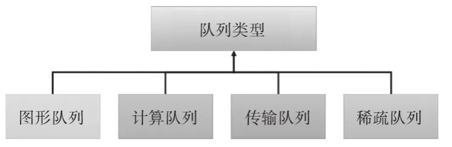
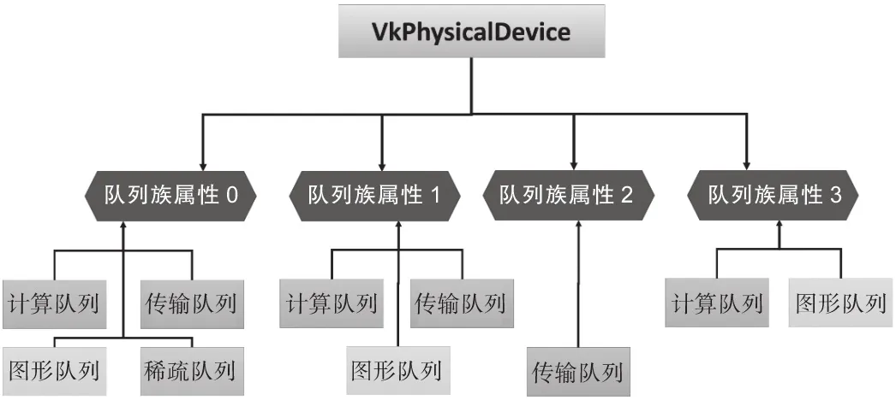

# Vulkan 设备队列

在Vulkan中，队列设备（Queue）是一个重要的概念。**应用程序通过将指令记录到指令缓存，然后提交到队列，而物理设备会设备读取队列中的任务并通过异步的方式来处理它们\**。\****

图片来自《Vulkan学习指南》

每个物理设备包含一个或多个队列族（Queue Family），每个队列族包含一个或多个队列。这些队列用于处理不同类型的任务，如图形渲染、计算任务和传输操作。

图片来自《Vulkan学习指南》

Vulkan将设备队列按照队列族的方式组织，组织方式有以下特点：

- 1. 一个队列族可以支持一到多个功能。
- 2.一个队列族中包含一个或多个队列。
- 3.同一个队列族中的所有队列支持相同的功能。
- 4.队列族之间可以有相同的功能，但两两队列之间不能有两个功能集。

我们可以通过vkGetPhysicalDeviceQueueFamilyProperties 函数获取设备队列（族）信息，其定义如下：

## 获取设备队列（族）信息

```
// 由 VK_VERSION_1_0 提供
void vkGetPhysicalDeviceQueueFamilyProperties(
VkPhysicalDevice                            physicalDevice,
uint32_t*                                   pQueueFamilyPropertyCount,
VkQueueFamilyProperties*                    pQueueFamilyProperties
);
```


- physicalDevice物理设备。
- pQueueFamilyPropertyCount表示队列族个数。
- pQueueFamilyProperties如果为nunllptr，将会向pQueueFamilyPropertyCount中写入physicalDevice外部开放的设备队列数量。否则将写入pQueueFamilyPropertyCount一个设备队列族信息数据。

为了获取设备队列信息，类似前面的操作，需要调用两个该函数。

```
VkPhysicalDevice physicaDevice;//之前获取的物理设备;

uint32_t queueFamilyCount;
vkGetPhysicalDeviceQueueFamilyProperties(physicaDevice, &queueFamilyCount,
                                       nullptr);
assert(queueFamilyCount);
std::vector<VkQueueFamilyProperties> queueFamilyProperties(queueFamilyCount);
vkGetPhysicalDeviceQueueFamilyProperties(physicaDevice, &queueFamilyCount,
                                       queueFamilyProperties.data());
```

该函数将物理设备的一系列队列设备（族）信息写入了VkQueueFamilyProperties类型的读写堆栈，该类型定义如下：

## VkQueueFamilyProperties

```
typedef struct VkQueueFamilyProperties {
    VkQueueFlags    queueFlags;
    uint32_t        queueCount;
    uint32_t        timestampValidBits;
    VkExtent3D      minImageTransferGranularity;
} VkQueueFamilyProperties;
```


- queueFlags是一个空白位码，表示队列族支持的操作类型。
- queueCount表示该队列中可用的队列数量。
- timestampValidBits表示时钟查询返回的有效时钟。该值为0表示该队列不支持时钟时钟。如果支持，时钟时钟返回的值将包含该时钟时钟的有效数据。
- minImageTransferGranularity表示该队列族支持的最小图像传输粒度。该粒度用于定义在执行图像传输操作（如复制或分层布局转换）时的最小单位。

其中VkQueueFlags可用的值定义在VkQueueFlagBits中，其定义如下：

```
// 由 VK_VERSION_1_0 提供
typedef enum VkQueueFlagBits {
    VK_QUEUE_GRAPHICS_BIT = 0x00000001,//图形
    VK_QUEUE_COMPUTE_BIT = 0x00000002, //计算
    VK_QUEUE_TRANSFER_BIT = 0x00000004, //传输
    VK_QUEUE_SPARSE_BINDING_BIT = 0x00000008, //稀疏绑定
    // 由 VK_VERSION_1_1 提供
    VK_QUEUE_PROTECTED_BIT = 0x00000010,
} VkQueueFlagBits;
```

在移动开发中图形和计算队列比较常用，其中计算着色器需要使用计算队列。

**Vulkan 的设备队列是用于提交命令方便GPU执行的关键机制。理解队列组和设备队列的工作原理，有助于更很好地利用Vulkan的性能特性。**

## 示例代码

下面是一个简单的示例代码，展示了如何查询队列属性、获取包含图形队列的队列索引（用于后续创建逻辑设备）：

```
VkPhysicalDevice physicaDevice;//之前获取的物理设备;
// 查询队列族属性
uint32_t queueFamilyCount = 0;
vkGetPhysicalDeviceQueueFamilyProperties(physicalDevice, &queueFamilyCount, nullptr);
std::vector<VkQueueFamilyProperties> queueFamilies(queueFamilyCount);
vkGetPhysicalDeviceQueueFamilyProperties(physicalDevice, &queueFamilyCount, queueFamilies.data());

// 找到支持图形操作的队列族索引
int graphicsQueueFamilyIndex = -1;
for (uint32_t i = 0; i < queueFamilyCount; i++) {
    if (queueFamilies[i].queueFlags & VK_QUEUE_GRAPHICS_BIT) {
        graphicsQueueFamilyIndex = i;
        break;
    }
}

//后续创建逻辑设备
```

# 参考

《Vulkan学习指南》
https://fuxiii.github.io/Essentials.of.Vulkan/DeviceQueue.html