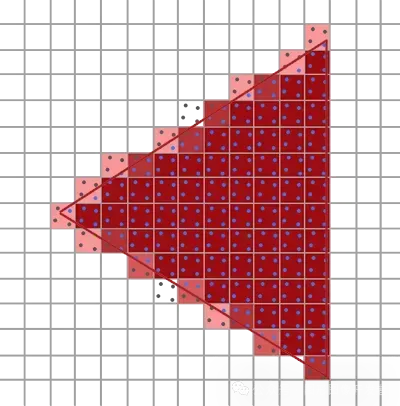
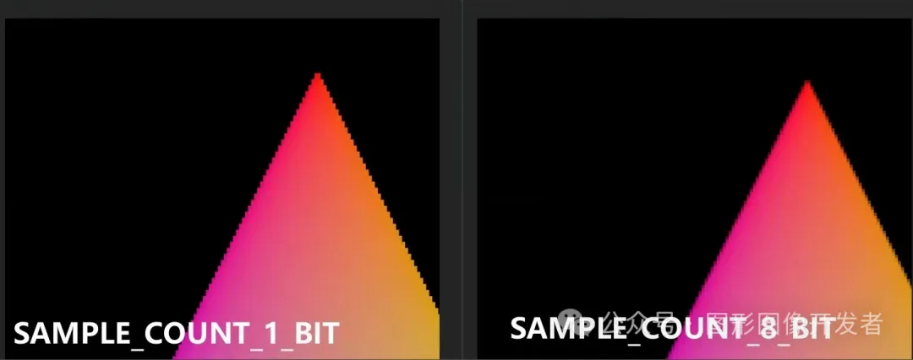

# Vulkan 图像

VkImage

VkImage 用于存储图像数据，支持 2D、3D 图像以及多层（array）、多级别（mip levels）的图像。它可以用于纹理、渲染目标等。

**Vulkan 图像比缓冲区更加复杂，因为它们是多维的，有独特的布局和格式信息，可作为过滤、深度或者模板测试等复杂操作的源或者目标。**

和 VkBuffer 一样，一旦设备内存绑定到一个 VkImage 上，这个内存绑定就不能再次改变了。

# VkImage 的创建

**VkImage 的创建与 VkBuffer 类似，首先要确定图像的格式、用途、采样数等属性，然后通过 Vulkan 的内存分配机制来分配相应的内存。**

创建过程通常涉及以下步骤：

1. 选择图像格式和属性：根据应用需求选择合适的图像格式和维度。
2. 创建图像：使用 vkCreateImage 函数创建一个 VkImage 对象。
3. 查询内存要求：使用 vkGetImageMemoryRequirements 查询与图像相关的内存需求。
4. 分配内存：根据查询到的内存要求，使用 vkAllocateMemory 分配内存。
5. 绑定内存：使用 vkBindImageMemory 将分配的内存绑定到 VkImage 对象。

其中 vkCreateImage() 函数定义如下：

```
1VkResult vkCreateImage(
2VkDevice                                    device,//逻辑设备
3const VkImageCreateInfo*                    pCreateInfo,//VkImage 的创建配置信息
4const VkAllocationCallbacks*                pAllocator,//内存分配器
5VkImage*                                    pImage //创建的目标图片句柄
6);
```

VkImage 的创建配置信息结构体我们重点看下：

```
 1typedef struct VkImageCreateInfo {
 2VkStructureType          sType;                 // 必须是 VK_STRUCTURE_TYPE_IMAGE_CREATE_INFO，表示该结构体的类型
 3const void*              pNext;                 // nullptr 或指向扩展结构体的指针，用于扩展
 4VkImageCreateFlags       flags;                 // 创建标志，通常为 0，可以指定特定的创建选项，如稀疏图像等
 5VkImageType              imageType;             // 图像类型，指定图像是一维、二维还是三维 (VK_IMAGE_TYPE_1D, VK_IMAGE_TYPE_2D, VK_IMAGE_TYPE_3D)
 6VkFormat                 format;                // 图像格式，指定像素数据的格式，如 VK_FORMAT_R8G8B8A8_SRGB
 7VkExtent3D               extent;                // 图像的宽度、高度和深度，使用 VkExtent3D 结构体指定
 8uint32_t                 mipLevels;             // mipmap 层级数，指定生成的 mipmap 级别数量
 9uint32_t                 arrayLayers;           // 图像数组的层数，指定图像数组的层数
10VkSampleCountFlagBits    samples;               // 采样计数，指定图像的多重采样数，如 VK_SAMPLE_COUNT_1_BIT 表示单采样
11VkImageTiling            tiling;                // 图像的tiling模式，可以是 VK_IMAGE_TILING_OPTIMAL 或 VK_IMAGE_TILING_LINEAR
12VkImageUsageFlags        usage;                 // 图像的用途标志，指定图像如何使用，如 VK_IMAGE_USAGE_TRANSFER_DST_BIT 表示图像可作为传输目标
13VkSharingMode            sharingMode;           // 共享模式，指定图像在多个队列族间的共享方式，如 VK_SHARING_MODE_EXCLUSIVE 表示独占访问
14uint32_t                 queueFamilyIndexCount; // 队列家族索引的数量，如果共享模式为 VK_SHARING_MODE_CONCURRENT，指定队列家族数量
15const uint32_t*          pQueueFamilyIndices;   // 指向队列家族索引的指针，指定图像可以在这些队列家族中使用
16VkImageLayout            initialLayout;         // 图像的初始布局，指定图像创建后的初始布局，如 VK_IMAGE_LAYOUT_UNDEFINED 表示未定义布局
17} VkImageCreateInfo;
```

VkImage 的属性看起来很多，其实我们只需要重点关注这几个：VkImageType、VkSampleCountFlagBits、VkImageTiling、VkImageUsageFlags、VkImageLayout。

## VkImageType

VkImageType 比较好理解，设置 VKImage 是几维的。

```
1typedef enum VkImageType {
2    VK_IMAGE_TYPE_1D = 0,
3    VK_IMAGE_TYPE_2D = 1,
4    VK_IMAGE_TYPE_3D = 2,
5} VkImageType;
```

## VkExtent3D

VkExtent3D 表示图片资源的宽、高和深度（各维度上的）大小。

如何你使用的是一维图像，那么结构体VkExtent3D 的 height 和 depth 固定为 1，2D 和 3D 图像以此类推。

```
1typedef struct VkExtent3D {
2    uint32_t    width;
3    uint32_t    height;
4    uint32_t    depth;
5} VkExtent3D;
```

## VkSampleCountFlagBits

**VkSampleCountFlagBits 用于设置每个像素（纹素）的采样数**，也就是 OpenGL 中常说的多重采样抗锯齿（MSAA），这个时候 VkImage 一般作为 FrameBuffer 的 ColorAttachment ，后面讲 Vulkan 多重采样抗锯齿时还会展开。


MSAA


```
1typedef enum VkSampleCountFlagBits {
2    VK_SAMPLE_COUNT_1_BIT = 0x00000001,//单采样，每个像素只有一个样本。
3    VK_SAMPLE_COUNT_2_BIT = 0x00000002,//多采样，每个像素都有两个样本。
4    VK_SAMPLE_COUNT_4_BIT = 0x00000004,
5    VK_SAMPLE_COUNT_8_BIT = 0x00000008,
6    VK_SAMPLE_COUNT_16_BIT = 0x00000010,
7    VK_SAMPLE_COUNT_32_BIT = 0x00000020,
8    VK_SAMPLE_COUNT_64_BIT = 0x00000040,
9} VkSampleCountFlagBits;
```

如下为 VK_SAMPLE_COUNT_1_BIT 和 VK_SAMPLE_COUNT_8_BIT 的成像对比：



单次采样与 8 次采样对比示意图

VkImageTiling 是 VkImage 的重要属性，它用于指定图像数据在内存中的存储布局的枚举类型。

**不同的VkImageTiling值决定了图像数据在内存中的排列方式，进而影响访问图像数据的效率和方式。**

```
1typedef enum VkImageTiling {
2VK_IMAGE_TILING_OPTIMAL = 0,//优化平铺
3VK_IMAGE_TILING_LINEAR = 1,//线性平铺
4} VkImageTiling;
```

当使用 VK_IMAGE_TILING_OPTIMAL 时**，用于指示该图片资源将会使用GPU 端内部偏爱的结构（驱动内部结构）进行创建，这一般在GPU上高速并行读写计算时使用。**

**当使用 VK_IMAGE_TILING_LINEAR 时，用于指示该图片资源将会使用CPU 端偏爱的线性结构进行创建，这一般在CPU读写图片资源数据时使用。**

## VkImageUsageFlagBits

##### VkImageUsageFlagBits 用于指定 VkImage 的用途。

```
 1typedef enum VkImageUsageFlagBits {
 2    VK_IMAGE_USAGE_TRANSFER_SRC_BIT = 0x00000001, // 用于数据传输的数据源。
 3    VK_IMAGE_USAGE_TRANSFER_DST_BIT = 0x00000002, // 用于数据传输的目的数据。
 4    VK_IMAGE_USAGE_SAMPLED_BIT = 0x00000004,      // 用于（纹素）采样（读取）。
 5    VK_IMAGE_USAGE_STORAGE_BIT = 0x00000008,      // 用于存储图像，这种图像可以被着色器进行读写操作。
 6    VK_IMAGE_USAGE_COLOR_ATTACHMENT_BIT = 0x00000010, // 用于作为颜色附件，即渲染目标。
 7    VK_IMAGE_USAGE_DEPTH_STENCIL_ATTACHMENT_BIT = 0x00000020, // 用于作为深度/模板附件。
 8    VK_IMAGE_USAGE_TRANSIENT_ATTACHMENT_BIT = 0x00000040,     // 用于临时附件，数据不会被持久化存储。
 9    VK_IMAGE_USAGE_INPUT_ATTACHMENT_BIT = 0x00000080,         // 用作输入附件，可以从片段着色器读取。
10} VkImageUsageFlagBits;
```

## VkImageLayout

**属性 VkImageLayout 图像布局定义了图像数据在内存中的组织方式，不同的布局对不同的操作有不同的性能特性，其最终目的还是为了提高设备对于该图片的操作效率。**

正确的使用VkImageLayout可以保证图像在各个方面操作阶段之间的有效转换，优化性能并避免数据冲突。

```
 1typedef enum VkImageLayout {
 2    VK_IMAGE_LAYOUT_UNDEFINED = 0,                       // 图像布局未定义。图像内容在这种布局下是未定义的。
 3    VK_IMAGE_LAYOUT_GENERAL = 1,                         // 图像可以用于几乎任何用途的通用布局。
 4    VK_IMAGE_LAYOUT_COLOR_ATTACHMENT_OPTIMAL = 2,        // 图像作为颜色附件使用时的最佳布局。
 5    VK_IMAGE_LAYOUT_DEPTH_STENCIL_ATTACHMENT_OPTIMAL = 3, // 图像作为深度/模板附件使用时的最佳布局。
 6    VK_IMAGE_LAYOUT_DEPTH_STENCIL_READ_ONLY_OPTIMAL = 4, // 图像作为只读的深度/模板附件使用时的最佳布局。
 7    VK_IMAGE_LAYOUT_SHADER_READ_ONLY_OPTIMAL = 5,        // 图像作为着色器资源读取时的最佳布局。
 8    VK_IMAGE_LAYOUT_TRANSFER_SRC_OPTIMAL = 6,            // 图像作为传输操作的数据源时的最佳布局。
 9    VK_IMAGE_LAYOUT_TRANSFER_DST_OPTIMAL = 7,            // 图像作为传输操作的目的地时的最佳布局。
10    VK_IMAGE_LAYOUT_PREINITIALIZED = 8,                  // 图像在初始化数据之前使用的布局。
11
12
13    VK_IMAGE_LAYOUT_PRESENT_SRC_KHR = 1000001002,// 由 VK_KHR_swapchain 提供，用于交换链的显示操作
14} VkImageLayout;
```

# 销毁图片

销毁 VkImage 只需要通过调用 vkDestroyImage() 函数即可，其定义如下：

#### vkDestroyImage

```
1void vkDestroyImage(
2VkDevice                                    device,//逻辑设备
3VkImage                                     image,//要销毁的图片
4const VkAllocationCallbacks*                pAllocator//
5);
```

## VkImage 示例代码

我们创建一个 VkImage 作为用于采样的二维纹理。

```
 1// 创建 VkImageCreateInfo 结构体并初始化
 2VkImageCreateInfo imageInfo = {};
 3imageInfo.sType = VK_STRUCTURE_TYPE_IMAGE_CREATE_INFO;  // 结构体类型
 4imageInfo.pNext = nullptr;                              // 指向扩展信息的指针
 5imageInfo.flags = 0;                                    // 图像创建标志
 6imageInfo.imageType = VK_IMAGE_TYPE_2D;                 // 图像类型为 2D
 7imageInfo.format = VK_FORMAT_R8G8B8A8_UNORM;            // 图像格式
 8imageInfo.extent.width = texWidth;                      // 图像宽度
 9imageInfo.extent.height = texHeight;                    // 图像高度
10imageInfo.extent.depth = 1;                             // 图像深度（对于 2D 图像为 1）
11imageInfo.mipLevels = 1;                                // MIP 级别数
12imageInfo.arrayLayers = 1;                              // 图像数组层数
13imageInfo.samples = VK_SAMPLE_COUNT_1_BIT;              // 多重采样数量（1 表示不使用多重采样）
14imageInfo.tiling = VK_IMAGE_TILING_LINEAR;             // 图像数据的存储方式（优化存储）
15imageInfo.usage = VK_IMAGE_USAGE_TRANSFER_DST_BIT | VK_IMAGE_USAGE_SAMPLED_BIT; // 图像用途（作为传输目标和采样器）
16imageInfo.sharingMode = VK_SHARING_MODE_EXCLUSIVE;      // 共享模式（独占模式）
17imageInfo.queueFamilyIndexCount = 0;                    // 使用队列族索引的数量
18imageInfo.pQueueFamilyIndices = &queueFamilyIndex;      // 队列族索引的指针
19imageInfo.initialLayout = VK_IMAGE_LAYOUT_UNDEFINED;    // 图像的初始布局（未定义）
20
21VkImage textureImage; // 定义 VkImage 变量
22// 创建图像
23if (vkCreateImage(device, &imageInfo, nullptr, &textureImage) != VK_SUCCESS) {
24    throw std::runtime_error("failed to create texture image!"); // 如果创建图像失败，抛出异常
25}
26
27// 获取图像的内存需求
28VkMemoryRequirements memRequirements;
29vkGetImageMemoryRequirements(device, textureImage, &memRequirements);
30
31// 创建 VkMemoryAllocateInfo 结构体并初始化
32VkMemoryAllocateInfo allocInfo = {};
33allocInfo.sType = VK_STRUCTURE_TYPE_MEMORY_ALLOCATE_INFO; // 结构体类型
34allocInfo.allocationSize = memRequirements.size;          // 所需内存大小
35allocInfo.memoryTypeIndex = findMemoryType(memRequirements.memoryTypeBits, 
36    VK_MEMORY_PROPERTY_DEVICE_LOCAL_BIT);                 // 内存类型索引
37
38VkDeviceMemory textureImageMemory; // 定义 VkDeviceMemory 变量
39// 分配内存
40if (vkAllocateMemory(device, &allocInfo, nullptr, &textureImageMemory) != VK_SUCCESS) {
41    throw std::runtime_error("failed to allocate texture image memory!"); // 如果分配内存失败，抛出异常
42}
43
44// 将内存绑定到图像
45vkBindImageMemory(device, textureImage, textureImageMemory, 0);
46
47// Vulkan 编程...
48
49// 使用完成后销毁资源
50vkDestroyImage(device, textureImage, nullptr);         // 销毁图像
51vkFreeMemory(device, textureImageMemory, nullptr);     // 释放图像内存
```

