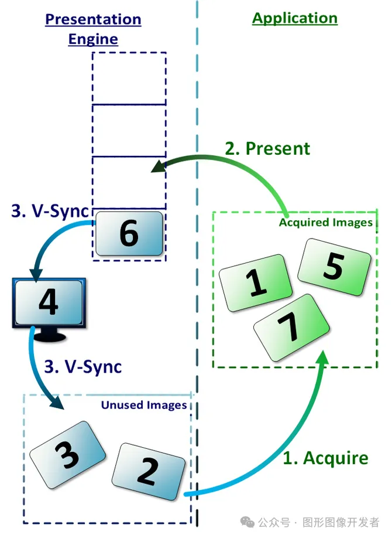

# Vulkan 交换链

## 什么是交换链




FIFO 呈现模式的交换链

Vulkan 交换链（Swapchain）是 Vulkan 应用程序与窗口系统之间的一座桥梁，负责将渲染结果呈现给用户。

换个说法，**交换链是一种图元绘制结果呈现的机制，它可以将绘制结果渲染到平台相关的展示窗口/展示层当中。**

交换链包含一组图像（一般作为渲染目标），这些图像被用于在屏幕上显示渲染的帧。

**交换链中的图像个数与驱动层的实现是密切相关的。如果交换链中有两幅图像，那么称为双缓存，如果有三幅图像，那么称作三缓存。**

在这些图像中，如果有一幅图像在后台已经完成了绘制过程，那么它会被交换到前台的展示窗口。

为了充分利用GPU的性能，此时另一幅图像会交换作为后台的缓存来执行下一帧的绘制过程。

这个过程往复执行，图像的交换过程也就持续进行。使用多幅图像可以保持GPU始终处于渲染某一帧图像的忙碌状态，从而降低总体的等待时间，改善输出帧速率。

## 交换链的作用

1. **图像管理**: **交换链维护了一组用于显示的图像，称为交换链图像（Swapchain Images）。**交换链图像通常至少有两个，这样就可以实现双缓冲或多缓冲，从而避免屏幕闪烁。
2. **同步**: 管理 CPU 和 GPU 之间的同步，确保渲染操作不会在显示更新之前完成，这有助于防止撕裂（tearing）现象，即在同一帧内看到两个不同图像的一部分。
3. **图像呈现**:

- 应用程序首先在一个缓冲区上进行渲染，完成渲染后，该缓冲区会被提交给交换链，然后交换链会将这个缓冲区的内容显示到屏幕上。
- 当一个缓冲区正在显示时，另一个缓冲区可以用于下一轮的渲染，这样就形成了一个循环。

# 创建交换链

创建交换链之前，我们需要利用上一节创建的 VkSurfaceKHR  对象来获取创建交换链所需的尺寸、格式、颜色空间等信息。

```
 1VkSurfaceKHR surface;
 3//获取表面的特性
 4VkSurfaceCapabilitiesKHR surfaceCapabilities;
 5vkGetPhysicalDeviceSurfaceCapabilitiesKHR(physicalDevice, surface,
 6                                        &surfaceCapabilities);
 7uint32_t formatCount = 0;
 8vkGetPhysicalDeviceSurfaceFormatsKHR(physicalDevice, surface,
 9                                   &formatCount, nullptr);
11//获取表面所支持的格式
12VkSurfaceFormatKHR* formats = new VkSurfaceFormatKHR[formatCount];
13vkGetPhysicalDeviceSurfaceFormatsKHR(physicalDevice, surface,
14                                   &formatCount, formats);
```

获取上述信息之后，我们来填充 VkSwapchainCreateInfoKHR 结构体。

创建交换链的函数 vkCreateSwapchainKHR ：

```
1VkResult vkCreateSwapchainKHR(
2    VkDevice                        device,                  // Vulkan 设备句柄
3    const VkSwapchainCreateInfoKHR* pCreateInfo,             // 指向 VkSwapchainCreateInfoKHR 结构体的指针，描述交换链的创建参数
4    const VkAllocationCallbacks*    pAllocator,              // 自定义的内存分配器回调函数指针，可以为 NULL 表示使用默认分配器
5    VkSwapchainKHR*                 pSwapchain               // 指向 VkSwapchainKHR 句柄的指针，函数成功返回时，包含创建的交换链
6)
```

VkSwapchainCreateInfoKHR 是一个用于描述交换链创建信息的结构体。它包含了创建交换链所需的所有参数，如表面、图像数量、格式、分辨率等。

以下是 VkSwapchainCreateInfoKHR 结构体的定义：

```
 1typedef struct VkSwapchainCreateInfoKHR {
 2VkStructureType                  sType;              // 必须是 VK_STRUCTURE_TYPE_SWAPCHAIN_CREATE_INFO_KHR
 3const void*                      pNext;              // 指向扩展结构的指针，通常为 nullptr
 4VkSwapchainCreateFlagsKHR        flags;              // 交换链创建标志，当前版本 Vulkan 中未使用，设置为 0
 5VkSurfaceKHR                     surface;            // 渲染表面（窗口或显示设备）
 6uint32_t                         minImageCount;      // 交换链中图像的最小数量
 7VkFormat                         imageFormat;        // 交换链图像的格式（颜色格式）
 8VkColorSpaceKHR                  imageColorSpace;    // 交换链图像的颜色空间
 9VkExtent2D                       imageExtent;        // 交换链图像的宽度和高度
10uint32_t                         imageArrayLayers;   // 交换链图像的数组层数（通常为 1）
11VkImageUsageFlags                imageUsage;         // 交换链图像的用途标志（如颜色附件）
12VkSharingMode                    imageSharingMode;   // 图像共享模式（独占模式或并发模式）
13uint32_t                         queueFamilyIndexCount; // 队列家族索引数量（imageSharingMode 为 VK_SHARING_MODE_CONCURRENT 时使用）
14const uint32_t*                  pQueueFamilyIndices;  // 指向队列家族索引数组的指针（imageSharingMode 为 VK_SHARING_MODE_CONCURRENT 时使用）
15VkSurfaceTransformFlagBitsKHR    preTransform;       // 表面变换（如旋转或翻转）
16VkCompositeAlphaFlagBitsKHR      compositeAlpha;     // 复合 Alpha 混合模式
17VkPresentModeKHR                 presentMode;        // 交换链的呈现模式（如 FIFO、Mailbox 等）
18VkBool32                         clipped;            // 指定剪裁窗口外的像素（VK_TRUE 为剪裁）
19VkSwapchainKHR                   oldSwapchain;       // 旧的交换链（用于重新创建交换链时），否则为 VK_NULL_HANDLE
20} VkSwapchainCreateInfoKHR;
```

VkSwapchainCreateInfoKHR结构体的属性看起来很多，实际上绝大部分情况下都是固定写死的，所以只需要简单了解下即可。

其中 VkColorSpaceKHR 、VkImageUsageFlags、VkSurfaceTransformFlagBitsKHR、VkPresentModeKHR 这个几个稍微关注下。

## VkColorSpaceKHR

VkColorSpaceKHR 定义了交换链图像的颜色空间。

颜色空间表示图像数据如何转换为颜色信息，以在显示设备上正确显示，处理 HDR 图像的时候需要重点关注。

```
 1typedef enum VkColorSpaceKHR {
 2    VK_COLOR_SPACE_SRGB_NONLINEAR_KHR = 0,                // sRGB 颜色空间，带非线性伽马校正。常用于标准显示器。
 3    VK_COLOR_SPACE_DISPLAY_P3_NONLINEAR_EXT = 1000104001, // Display-P3 色域，带非线性伽马校正。用于支持 P3 色域显示器。
 4    VK_COLOR_SPACE_EXTENDED_SRGB_LINEAR_EXT = 1000104002, // 扩展 sRGB 颜色空间，线性校正。
 5    VK_COLOR_SPACE_DISPLAY_P3_LINEAR_EXT = 1000104003,    // Display-P3 色域，线性校正。
 6    VK_COLOR_SPACE_DCI_P3_NONLINEAR_EXT = 1000104004,     // DCI-P3 色域，带非线性伽马校正。
 7    VK_COLOR_SPACE_BT709_LINEAR_EXT = 1000104005,         // BT.709 颜色空间，线性校正。
 8    VK_COLOR_SPACE_BT709_NONLINEAR_EXT = 1000104006,      // BT.709 颜色空间，非线性校正。
 9    VK_COLOR_SPACE_BT2020_LINEAR_EXT = 1000104007,        // BT.2020 颜色空间，线性校正。
10    VK_COLOR_SPACE_HDR10_ST2084_EXT = 1000104008,         // HDR10，使用 SMPTE ST 2084 EOTF。
11    VK_COLOR_SPACE_DOLBYVISION_EXT = 1000104009,          // Dolby Vision。
12    VK_COLOR_SPACE_HDR10_HLG_EXT = 1000104010,            // HDR10，使用 Hybrid Log-Gamma。
13    VK_COLOR_SPACE_ADOBERGB_LINEAR_EXT = 1000104011,      // Adobe RGB 颜色空间，线性校正。
14    VK_COLOR_SPACE_ADOBERGB_NONLINEAR_EXT = 1000104012,   // Adobe RGB 颜色空间，非线性校正。
15    VK_COLOR_SPACE_PASS_THROUGH_EXT = 1000104013,         // 颜色空间通过，不做任何校正。
16    VK_COLOR_SPACE_EXTENDED_SRGB_NONLINEAR_EXT = 1000104014, // 扩展 sRGB 颜色空间，非线性校正。
17    VK_COLOR_SPACE_DISPLAY_NATIVE_AMD = 1000213000,       // 原生显示颜色空间，AMD 扩展。
18    // 更多颜色空间可以通过扩展添加
19} VkColorSpaceKHR;
```

## VkImageUsageFlags

VkImageUsageFlags 表示图像的用途标志，例如 VK_IMAGE_USAGE_COLOR_ATTACHMENT_BIT 表示图像将用作颜色附件。

**可以组合多个用途标志，以表明图像的多种使用方式。**

```
 1typedef enum VkImageUsageFlagBits {
 2    VK_IMAGE_USAGE_TRANSFER_SRC_BIT = 0x00000001,                     // 图像可以作为传输操作的源。
 3    VK_IMAGE_USAGE_TRANSFER_DST_BIT = 0x00000002,                     // 图像可以作为传输操作的目标。
 4    VK_IMAGE_USAGE_SAMPLED_BIT = 0x00000004,                          // 图像可以被采样器访问。
 5    VK_IMAGE_USAGE_STORAGE_BIT = 0x00000008,                          // 图像可以作为存储图像使用。
 6    VK_IMAGE_USAGE_COLOR_ATTACHMENT_BIT = 0x00000010,                 // 图像可以作为颜色附件使用。
 7    VK_IMAGE_USAGE_DEPTH_STENCIL_ATTACHMENT_BIT = 0x00000020,         // 图像可以作为深度/模板附件使用。
 8    VK_IMAGE_USAGE_TRANSIENT_ATTACHMENT_BIT = 0x00000040,             // 图像内容是暂时的，并不会在帧之间保留。
 9    VK_IMAGE_USAGE_INPUT_ATTACHMENT_BIT = 0x00000080,                 // 图像可以作为输入附件使用。
10    VK_IMAGE_USAGE_SHADING_RATE_IMAGE_BIT_NV = 0x00000100,            // 图像可以作为着色率图像使用（NVIDIA 扩展）。
11    VK_IMAGE_USAGE_FRAGMENT_DENSITY_MAP_BIT_EXT = 0x00000200,         // 图像可以作为片段密度图使用（EXT 扩展）。
12    VK_IMAGE_USAGE_FRAGMENT_SHADING_RATE_ATTACHMENT_BIT_KHR =         // 图像可以作为片段着色率附件使用（KHR 扩展）。
13        VK_IMAGE_USAGE_SHADING_RATE_IMAGE_BIT_NV,
14    VK_IMAGE_USAGE_FLAG_BITS_MAX_ENUM = 0x7FFFFFFF                    // 枚举类型的最大值。
15} VkImageUsageFlagBits;
```

## VkSurfaceTransformFlagBitsKHR

VkSurfaceTransformFlagBitsKHR 枚举类型定义了交换链图像在显示之前可以应用的变换操作。


```
 1typedef enum VkSurfaceTransformFlagBitsKHR {
 2    VK_SURFACE_TRANSFORM_IDENTITY_BIT_KHR = 0x00000001,                    // 不进行任何变换。
 3    VK_SURFACE_TRANSFORM_ROTATE_90_BIT_KHR = 0x00000002,                   // 顺时针旋转 90 度。
 4    VK_SURFACE_TRANSFORM_ROTATE_180_BIT_KHR = 0x00000004,                  // 顺时针旋转 180 度。
 5    VK_SURFACE_TRANSFORM_ROTATE_270_BIT_KHR = 0x00000008,                  // 顺时针旋转 270 度。
 6    VK_SURFACE_TRANSFORM_HORIZONTAL_MIRROR_BIT_KHR = 0x00000010,           // 水平翻转。
 7    VK_SURFACE_TRANSFORM_HORIZONTAL_MIRROR_ROTATE_90_BIT_KHR = 0x00000020, // 水平翻转后顺时针旋转 90 度。
 8    VK_SURFACE_TRANSFORM_HORIZONTAL_MIRROR_ROTATE_180_BIT_KHR = 0x00000040,// 水平翻转后顺时针旋转 180 度。
 9    VK_SURFACE_TRANSFORM_HORIZONTAL_MIRROR_ROTATE_270_BIT_KHR = 0x00000080,// 水平翻转后顺时针旋转 270 度。
10    VK_SURFACE_TRANSFORM_INHERIT_BIT_KHR = 0x00000100                      // 继承当前变换。
11} VkSurfaceTransformFlagBitsKHR;
```

## VkPresentModeKHR

VkPresentModeKHR 枚举类型定义了**交换链的呈现模式。呈现模式决定了图像交换和显示的策略。**

```
1typedef enum VkPresentModeKHR {
2    VK_PRESENT_MODE_IMMEDIATE_KHR = 0,           // 图像立即提交到显示设备，可能导致撕裂。
3    VK_PRESENT_MODE_MAILBOX_KHR = 1,             // 使用邮箱模式，提交图像时如果显示队列满了，会覆盖旧的图像。
4    VK_PRESENT_MODE_FIFO_KHR = 2,                // 先进先出模式，提交的图像进入队列，显示设备按顺序显示。
5    VK_PRESENT_MODE_FIFO_RELAXED_KHR = 3,        // 类似于 FIFO 模式，但如果显示设备空闲，立即显示图像，减少延迟。
6    VK_PRESENT_MODE_SHARED_DEMAND_REFRESH_KHR = 1000111000, // 共享刷新模式，在显示设备需要时刷新。
7    VK_PRESENT_MODE_SHARED_CONTINUOUS_REFRESH_KHR = 1000111001 // 持续刷新模式，持续刷新图像。
8} VkPresentModeKHR;
```

# 创建交换链、获取交换链图像示例

```
 1VkSurfaceKHR surface;//上一节获取的表面
 3// 获取表面的特性
 4VkSurfaceCapabilitiesKHR surfaceCapabilities;
 5vkGetPhysicalDeviceSurfaceCapabilitiesKHR(physicalDevice, surface, &surfaceCapabilities);
 7uint32_t formatCount = 0;
 8vkGetPhysicalDeviceSurfaceFormatsKHR(physicalDevice, surface, &formatCount, nullptr);
10// 获取表面所支持的格式
11VkSurfaceFormatKHR* formats = new VkSurfaceFormatKHR[formatCount];
12vkGetPhysicalDeviceSurfaceFormatsKHR(physicalDevice, surface, &formatCount, formats);
14// 查找 VK_FORMAT_R8G8B8A8_UNORM 格式
15uint32_t targetFormatIdx;
16for (targetFormatIdx = 0; targetFormatIdx < formatCount; targetFormatIdx++) {
17    if (formats[targetFormatIdx].format == VK_FORMAT_R8G8B8A8_UNORM) break;
18}
19assert(targetFormatIdx < formatCount); // 确保找到目标格式
21VkSwapchainCreateInfoKHR swapchainCreateInfo = {};
22swapchainCreateInfo.sType = VK_STRUCTURE_TYPE_SWAPCHAIN_CREATE_INFO_KHR; // 设置结构体类型
23swapchainCreateInfo.surface = surface; // 设置表面句柄
24swapchainCreateInfo.minImageCount = surfaceCapabilities.minImageCount; // 最小图像数量（修正：minImageCoun 改为 minImageCount）
25swapchainCreateInfo.imageFormat = formats[targetFormatIdx].format; // 图像格式
26swapchainCreateInfo.imageColorSpace = formats[targetFormatIdx].colorSpace; // 颜色空间
27swapchainCreateInfo.imageExtent = surfaceCapabilities.currentExtent; // 图像范围
28swapchainCreateInfo.imageArrayLayers = 1; // 图像数组层数
29swapchainCreateInfo.imageUsage = VK_IMAGE_USAGE_COLOR_ATTACHMENT_BIT; // 图像用途
30swapchainCreateInfo.imageSharingMode = VK_SHARING_MODE_EXCLUSIVE; // 图像共享模式
31swapchainCreateInfo.preTransform = VK_SURFACE_TRANSFORM_IDENTITY_BIT_KHR; // 表面变换
32swapchainCreateInfo.compositeAlpha = VK_COMPOSITE_ALPHA_OPAQUE_BIT_KHR; // 复合 alpha 模式
33swapchainCreateInfo.presentMode = VK_PRESENT_MODE_FIFO_KHR; // 显示模式
34swapchainCreateInfo.clipped = VK_FALSE; // 是否剪辑
35swapchainCreateInfo.oldSwapchain = VK_NULL_HANDLE; // 旧交换链句柄
37VkSwapchainKHR swapchain;
38VkResult result = vkCreateSwapchainKHR(device, &swapchainCreateInfo, nullptr, &swapchain); // 创建交换链
39if (result != VK_SUCCESS) {
40    // 错误处理
41}
43// 获取交换链中的图像
44uint32_t imageCount;
45vkGetSwapchainImagesKHR(device, swapchain, &imageCount, nullptr);
46std::vector<VkImage> swapChainImages(imageCount);
47vkGetSwapchainImagesKHR(device, swapchain, &imageCount, swapChainImages.data());
49// 为每个交换链图像创建图像视图，这些图像视图将会作为帧缓冲区的 attachments
50std::vector<VkImageView> swapChainImageViews(swapChainImages.size());
51for (size_t i = 0; i < swapChainImages.size(); i++) {
52    VkImageViewCreateInfo createInfo = {};
53    createInfo.sType = VK_STRUCTURE_TYPE_IMAGE_VIEW_CREATE_INFO; // 设置结构体类型
54    createInfo.image = swapChainImages[i]; // 图像句柄
55    createInfo.viewType = VK_IMAGE_VIEW_TYPE_2D; // 视图类型
56    createInfo.format = formats[targetFormatIdx].format; // 图像格式
57    createInfo.components.r = VK_COMPONENT_SWIZZLE_IDENTITY; // 组件重映射
58    createInfo.components.g = VK_COMPONENT_SWIZZLE_IDENTITY;
59    createInfo.components.b = VK_COMPONENT_SWIZZLE_IDENTITY;
60    createInfo.components.a = VK_COMPONENT_SWIZZLE_IDENTITY;
61    createInfo.subresourceRange.aspectMask = VK_IMAGE_ASPECT_COLOR_BIT; // 子资源范围
62    createInfo.subresourceRange.baseMipLevel = 0;
63    createInfo.subresourceRange.levelCount = 1;
64    createInfo.subresourceRange.baseArrayLayer = 0;
65    createInfo.subresourceRange.layerCount = 1;
67    if (vkCreateImageView(device, &createInfo, nullptr, &swapChainImageViews[i]) != VK_SUCCESS) {
68        throw std::runtime_error("failed to create image views!"); // 错误处理
69    }
70}
72// 销毁交换链、释放资源
73for (size_t i = 0; i < swapChainImages.size(); i++) {
74    vkDestroyImageView(device, swapChainImageViews[i], nullptr); // 销毁图像视图
75}
76vkDestroySwapchainKHR(device, swapchain, nullptr); // 销毁交换链
77delete[] formats; // 释放格式数组内存
```

# 参考

《Vulkan学习指南》 — [新加坡] 帕敏德·辛格（Parminder Singh）
https://www.intel.com/content/www/us/en/developer/articles/training/api-without-secrets-introduction-to-vulkan-part-2.html

