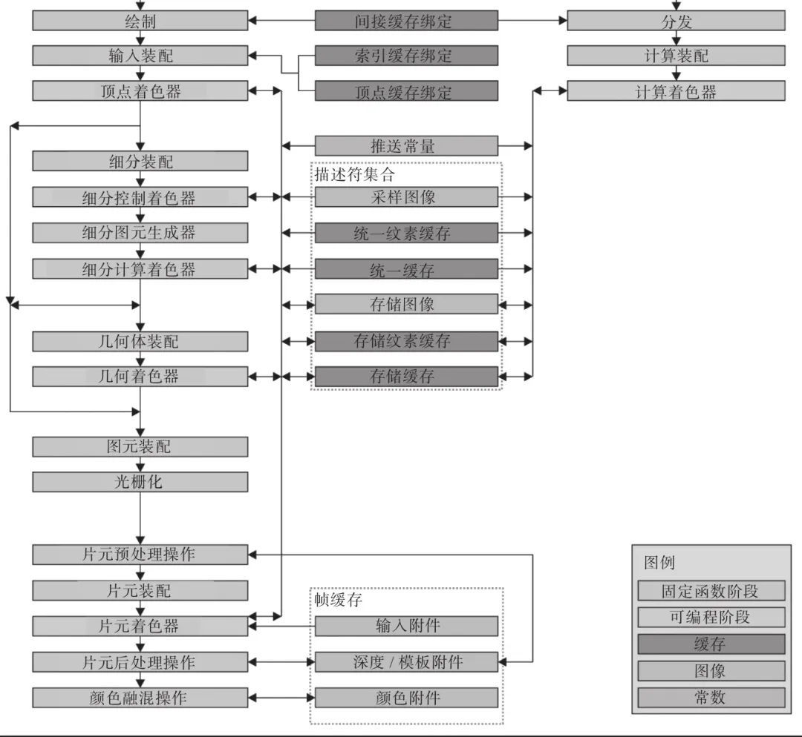
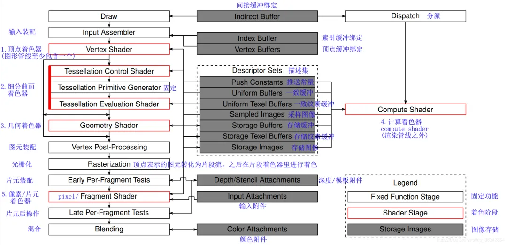
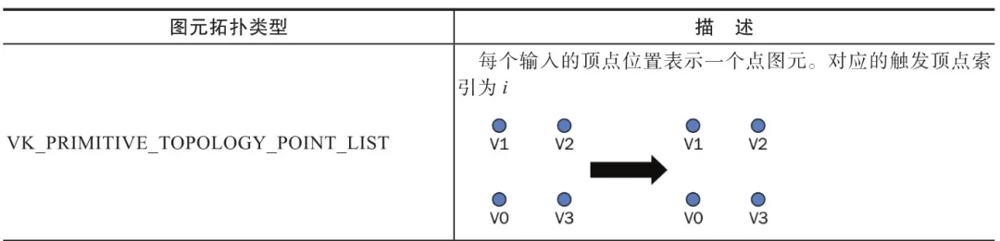
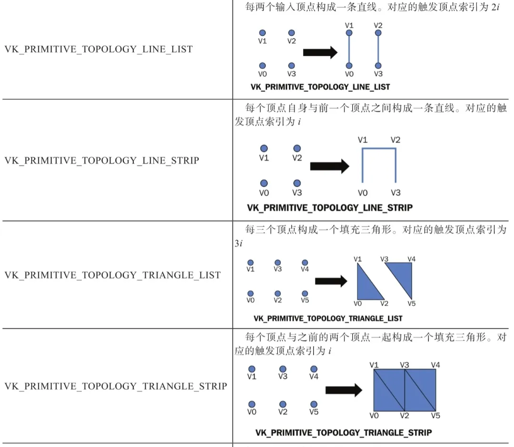
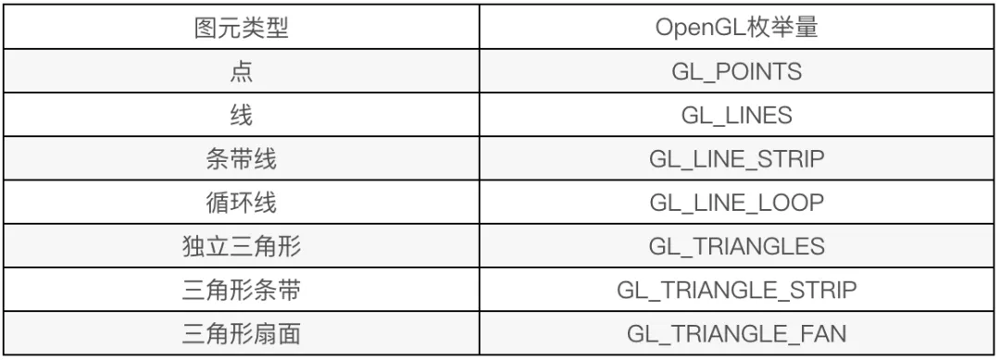

# Vulkan 图形管线，你了解多少？


# Vulkan 渲染管线



渲染管线可以看作是一条生产流水线，**定义了从输入顶点到最终输出图像的所有步骤。**

它包括一系列固定和可编程阶段，这些阶段按照特定顺序执行，以完成渲染任务。


Vulkan 渲染管线的许多阶段是可选的，你可以禁用它们，或者Vulkan实现可能根本不支持这些功能。

**管线中唯一必须启用的阶段是顶点着色器（vertex shader）**, 其余的阶段和功能可以根据需要选择启用或禁用，比如几何着色器、片段着色器和光栅化阶段等。

Vulkan提供了高度的灵活性，让开发者能够根据具体需求配置渲染管线。

# Vulkan 渲染管线的主要阶段



## 顶点输入阶段

顶点输入阶段主要是**从应用程序传递的顶点缓冲区中读取顶点数据，并将其传递给后续阶段。**顶点数据通常包括顶点位置、法线、颜色、纹理坐标等。


顶点输入阶段需要配置顶点绑定描述符（描述顶点缓冲区的布局）和顶点属性描述符（描述顶点数据的格式和偏移量）。**开发者在此阶段定义如何从顶点缓冲区中获取数据。**

顶点绑定描述符对应结构体 VkVertexInputBindingDescription ，顶点属性描述符对应结构体 VkVertexInputAttributeDescription , 这些结构体我们通过下面的代码体现它们各个属性的含义。

```
 1// 定义顶点输入绑定描述符，指定顶点数据的布局
 2VkVertexInputBindingDescription vertex_input_bindings{
 3    .binding = 0,                         // 绑定索引，指定顶点数据绑定的槽位（索引）
 4    .stride = 8 * sizeof(float),          // 每个顶点的数据跨度，即每个顶点数据的字节大小（8个float：3个float顶点坐标，2个float纹理坐标，3float个法向量）
 5    .inputRate = VK_VERTEX_INPUT_RATE_VERTEX, // 指定输入率为每个顶点（每个顶点都有一组数据）
 6};
 8// 定义顶点输入属性描述符数组，指定每个顶点属性的格式和偏移量
 9VkVertexInputAttributeDescription vertex_input_attributes[3]{
10    {
11        .location = 0,                         // 输入属性的位置，匹配顶点着色器中的输入变量
12        .binding = 0,                          // 顶点绑定索引，指定此属性从哪个绑定中获取数据
13        .format = VK_FORMAT_R32G32B32_SFLOAT,  // 属性的数据格式，这里是3个float（X, Y, Z坐标）
14        .offset = 0,                           // 数据在顶点中的偏移量，这里从第0个字节开始
15    },
16    {
17        .location = 1,                         // 第二个输入属性的位置，通常用于纹理坐标
18        .binding = 0,                          // 绑定索引，仍然是从同一个绑定中获取数据
19        .format = VK_FORMAT_R32G32_SFLOAT,     // 属性的数据格式，这里是2个float（纹理坐标U, V）
20        .offset = sizeof(float) * 3,           // 数据在顶点中的偏移量，这里从第3个float开始（跳过XYZ坐标）
21    },
22    {
23        .location = 2,                         // 第三个输入属性的位置
24        .binding = 0,                          // 绑定索引
25        .format = VK_FORMAT_R32G32B32_SFLOAT,  // 属性的数据格式，这里是3个float（X, Y, Z坐标）
26        .offset = sizeof(float) * 5,           // 数据在顶点中的偏移量，这里从第5个float开始
27    },
28};
30// 创建并初始化VkPipelineVertexInputStateCreateInfo结构体
31VkPipelineVertexInputStateCreateInfo vertexInputInfo{
32    .sType = VK_STRUCTURE_TYPE_PIPELINE_VERTEX_INPUT_STATE_CREATE_INFO, // 指定结构体类型
33    .pNext = nullptr,                           // 指定扩展指针（通常为nullptr）
34    .vertexBindingDescriptionCount = 1,         // 顶点绑定描述符的数量
35    .pVertexBindingDescriptions = &vertex_input_bindings, // 指向顶点绑定描述符的指针
36    .vertexAttributeDescriptionCount = 3,       // 顶点属性描述符的数量
37    .pVertexAttributeDescriptions = vertex_input_attributes, // 指向顶点属性描述符数组的指针
38};
```

上述代码我们结合着对应的顶点着色器来看，大致就可以明白这些配置的用途。

顶点着色器脚本中的 location 顶与点输入属性描述符的 location 属性一一对应。

```
 1#version 400
 4layout (location = 0) in vec4 pos;//顶点坐标
 5layout (location = 1) in vec2 attr;//纹理坐标
 6layout (location = 2) in vec3 normal;//顶点法向量
 8layout (location = 0) out vec2 texcoord;
10void main() {
11   texcoord = attr;
12   gl_Position = pos;
13}
```

## 输入装配阶段

输入装配阶段将顶点数据组装成几何图元（如点、线、三角形）。这是顶点着色器之前的最后一个阶段，它定义了如何将顶点数据组合成图形基元。

**通过指定图元拓扑方式（如点列表、线条列表、三角形列表）来控制如何将顶点组装成图元。**

VkPipelineInputAssemblyStateCreateInfo 是用于指定输入装配阶段（Input Assembly）配置的结构体，用于将顶点数据组装成图元（如点、线、三角形等），这些图元将会被后续的管线阶段处理。

```
1typedef struct VkPipelineInputAssemblyStateCreateInfo {
2VkStructureType                     sType;                  // 结构体类型，必须是 VK_STRUCTURE_TYPE_PIPELINE_INPUT_ASSEMBLY_STATE_CREATE_INFO
3const void*                         pNext;                  // 指向扩展的指针，通常为 nullptr
4VkPipelineInputAssemblyStateCreateFlags flags;             // 保留字段，当前必须为 0
5VkPrimitiveTopology                 topology;               // 指定图元拓扑类型（如三角形、线、点等）
6VkBool32                            primitiveRestartEnable; // 是否启用图元重启功能
7} VkPipelineInputAssemblyStateCreateInfo;
```

其中 **VkPrimitiveTopology** topology 定义了图元拓扑类型，比较常用，用于控制组装的图元类型（如点、线、三角形）。

image.png

image.png

```
 1typedef enum VkPrimitiveTopology {
 2    VK_PRIMITIVE_TOPOLOGY_POINT_LIST = 0,                  // 点列表，每个顶点单独作为一个点渲染。
 3    VK_PRIMITIVE_TOPOLOGY_LINE_LIST = 1,                   // 线段列表，每两个顶点组成一条独立的线段。
 4    VK_PRIMITIVE_TOPOLOGY_LINE_STRIP = 2,                  // 线段条带，前两个顶点组成一条线段，后续的每个顶点与前一个顶点组成新的线段。
 5    VK_PRIMITIVE_TOPOLOGY_TRIANGLE_LIST = 3,               // 三角形列表，每三个顶点组成一个独立的三角形。
 6    VK_PRIMITIVE_TOPOLOGY_TRIANGLE_STRIP = 4,              // 三角形条带，前两个顶点与后续每个顶点组成一个三角形。
 7    VK_PRIMITIVE_TOPOLOGY_TRIANGLE_FAN = 5,                // 三角形扇，每个三角形都共享第一个顶点。
 8    VK_PRIMITIVE_TOPOLOGY_LINE_LIST_WITH_ADJACENCY = 6,    // 带有邻接信息的线段列表，每两个顶点组成一条线段，并提供附加的邻接顶点数据。
 9    VK_PRIMITIVE_TOPOLOGY_LINE_STRIP_WITH_ADJACENCY = 7,   // 带有邻接信息的线段条带，与 `LINE_STRIP` 类似，但包括邻接信息。
10    VK_PRIMITIVE_TOPOLOGY_TRIANGLE_LIST_WITH_ADJACENCY = 8,// 带有邻接信息的三角形列表，每个三角形都有附加的邻接顶点数据。
11    VK_PRIMITIVE_TOPOLOGY_TRIANGLE_STRIP_WITH_ADJACENCY = 9,// 带有邻接信息的三角形条带，与 `TRIANGLE_STRIP` 类似，但包括邻接信息。
12    VK_PRIMITIVE_TOPOLOGY_PATCH_LIST = 10,                 // 补丁列表，通常用于细分曲面（tessellation），每个补丁由一组顶点组成。
13    VK_PRIMITIVE_TOPOLOGY_MAX_ENUM = 0x7FFFFFFF            // 枚举值的最大可能值，用于内存对齐或保证枚举类型大小的技术性标记。
14} VkPrimitiveTopology;
```

**如果你学过 OpenGL 的绘制方式，就会发现他们如出一辙。
**



结构体配置代码示例：

```
1VkPipelineInputAssemblyStateCreateInfo inputAssemblyInfo{};
2inputAssemblyInfo.sType = VK_STRUCTURE_TYPE_PIPELINE_INPUT_ASSEMBLY_STATE_CREATE_INFO;
3inputAssemblyInfo.pNext = nullptr;
4inputAssemblyInfo.flags = 0;
5inputAssemblyInfo.topology = VK_PRIMITIVE_TOPOLOGY_TRIANGLE_LIST; // 设置为三角形列表拓扑
6inputAssemblyInfo.primitiveRestartEnable = VK_FALSE; // 不启用图元重启
```

## 顶点着色器阶段

**顶点着色器阶段处理每个顶点，通常用于应用几何变换（如模型视图变换、投影变换），并计算顶点的输出属性，如颜色、纹理坐标和法线等**。

开发者编写顶点着色器程序（通常使用GLSL或SPIR-V）来定义每个顶点的处理逻辑。**该阶段是必须启用的，是管线中唯一一个必不可少的阶段**。

关于 SPIR-V 着色器程序后面我们会单独开一节来讲，这里暂时不展开。

Vulkan 是通过结构体 VkPipelineShaderStageCreateInfo 配置顶点着色器：

```
1typedef struct VkPipelineShaderStageCreateInfo {
2    VkStructureType                     sType;               // 结构体类型，必须是 VK_STRUCTURE_TYPE_PIPELINE_SHADER_STAGE_CREATE_INFO
3    const void*                         pNext;               // 指向扩展结构的指针，一般设置为 nullptr
4    VkPipelineShaderStageCreateFlags    flags;               // 用于将来扩展的标志，当前必须为 0
5    VkShaderStageFlagBits               stage;               // 着色器阶段，例如 VK_SHADER_STAGE_VERTEX_BIT 或 VK_SHADER_STAGE_FRAGMENT_BIT
6    VkShaderModule                      module;              // 指向包含着色器代码的 VkShaderModule 对象
7    const char*                         pName;               // 着色器入口函数的名称，通常为 "main"
8    const VkSpecializationInfo*         pSpecializationInfo; // 指向 VkSpecializationInfo 的指针，用于指定特化常量，可以是 nullptr
9} VkPipelineShaderStageCreateInfo;
```

示例代码：

```
1VkPipelineShaderStageCreateInfo shaderStage = {};
2shaderStage.sType = VK_STRUCTURE_TYPE_PIPELINE_SHADER_STAGE_CREATE_INFO;
3shaderStage.pNext = nullptr;
4shaderStage.flags = 0;
5shaderStage.stage = VK_SHADER_STAGE_VERTEX_BIT;//指定该着色器阶段为顶点着色器阶段
6shaderStage.module = vertexShader;
7shaderStage.pName = "main";
8shaderStage.pSpecializationInfo = nullptr;
```

## 细分控制、评估着色器阶段（可选）

曲面细分是近代 GPU 提供的一项高级特性，可以再采用较少原始顶点数据的情况下绘制出如同采用海量数据描述的光滑曲面。

曲面细分工作由细分控制着色器&细分求值着色器协同完成。

## 几何着色器阶段（可选）

几何着色器（Geometry Shader）是图形渲染管线中的一个可选阶段，它在顶点着色器和光栅化阶段之间运行。

**几何着色器的主要作用是处理图元（如点、线或三角形），可以生成、修改或删除图元。**

通过几何着色器，输入为一个图元，输出可以为一个或多个图元，图元类型可以不同。

例如输入三角形，输出三角形的三条边和法线共四根线。开发者能够对几何形状执行复杂的几何变换和操作，从而创建丰富的视觉效果。

## 图元装配阶段

**将来自顶点着色器、细分求值着色器或几何着色器的顶点按照指定的绘制模式（如点、线、三角形）进行分组，以形成基本图元**（如点、线段、三角形等），这些图元将被传递到光栅化阶段。

在图元组装完成后，对其进行裁剪。若图元完全位于视景体或裁剪平面内部，则将完整的图元传递至下一个阶段；

若完全位于视景体或自定义裁剪平面外部，则丢弃该图元；若图元部分位于内部，部分位于外部，则需对该图元进行裁剪，以确保仅保留视景体内部的部分。

## 光栅化阶段

**光栅化是将图元（如三角形）转换为片段的过程，这些片段最终会被着色并显示在屏幕上。**


Vulkan 光栅化阶段包括设置**光栅化模式**（如填充模式、线框模式、点模式）、**面剔除模式（如剔除背面或正面）以及深度偏移**等。光栅化是将三维几何体转换为二维像素的关键步骤。

VkPipelineRasterizationStateCreateInfo 是 Vulkan 渲染管线中用于配置光栅化阶段的结构体。

```
 1typedef struct VkPipelineRasterizationStateCreateInfo {
 2    VkStructureType                            sType;                  // 结构体类型标识
 3    const void*                                pNext;                  // 指向扩展结构的指针
 4    VkPipelineRasterizationStateCreateFlags    flags;                  // 预留标志，通常设置为 0
 5    VkBool32                                   depthClampEnable;       // 是否启用深度钳制
 6    VkBool32                                   rasterizerDiscardEnable;// 是否丢弃光栅化阶段输出
 7    VkPolygonMode                              polygonMode;            // 指定如何绘制多边形（点、线或填充）
 8    VkCullModeFlags                            cullMode;               // 指定要剔除的面（前面、背面或两者）
 9    VkFrontFace                                frontFace;              // 指定正面三角形的顶点顺序
10    VkBool32                                   depthBiasEnable;        // 是否启用深度偏移
11    float                                      depthBiasConstantFactor;// 深度偏移的常数因子
12    float                                      depthBiasClamp;         // 深度偏移的最大值
13    float                                      depthBiasSlopeFactor;   // 深度偏移的斜率因子
14    float                                      lineWidth;              // 线宽
15} VkPipelineRasterizationStateCreateInfo;
```

别被那么多属性吓到了，真正常用的不多，上示例代码：

```
 1VkPipelineRasterizationStateCreateInfo rasterInfo{
 2    .sType = VK_STRUCTURE_TYPE_PIPELINE_RASTERIZATION_STATE_CREATE_INFO, // 指定结构体类型，必须为 VK_STRUCTURE_TYPE_PIPELINE_RASTERIZATION_STATE_CREATE_INFO
 3    .pNext = nullptr,                        // 指向扩展结构的指针，通常为 nullptr
 4    .depthClampEnable = VK_FALSE,            // 禁用深度钳制，深度值不会被限制在 [minDepth, maxDepth] 范围内
 5    .rasterizerDiscardEnable = VK_FALSE,     // 禁用光栅化丢弃，光栅化阶段正常进行
 6    .polygonMode = VK_POLYGON_MODE_FILL,     // 使用填充模式绘制多边形（默认设置）
 7    .cullMode = VK_CULL_MODE_NONE,           // 不进行面剔除，渲染正面和背面
 8    .frontFace = VK_FRONT_FACE_CLOCKWISE,    // 指定顺时针方向为正面
 9    .depthBiasEnable = VK_FALSE,             // 禁用深度偏移，深度值不会被调整
10    .lineWidth = 1.0f,                       // 线宽设置为1.0，单位为像素，注意这里应使用浮点数（1.0f）
11};
```

## 片段着色器阶段

**片段着色器阶段对每个片段进行处理，决定最终的像素颜色。**这一阶段通常用于纹理映射、光照计算和颜色处理。

使用的结构体和顶点着色器一样，只是类型为片段着色器。

```
1VkPipelineShaderStageCreateInfo shaderStage = {};
2shaderStage.sType = VK_STRUCTURE_TYPE_PIPELINE_SHADER_STAGE_CREATE_INFO;
3shaderStage.pNext = nullptr;
4shaderStage.flags = 0;
5shaderStage.stage = VK_SHADER_STAGE_FRAGMENT_BIT;//指定该着色器阶段为片段着色器阶段
6shaderStage.module = fragmentShader;
7shaderStage.pName = "main";
8shaderStage.pSpecializationInfo = nullptr;
```

## 片段测试阶段

在片段着色器执行后对片段进行**深度和模板测试**。


**深度测试中，它可以根据片段的深度值决定是否更新帧缓冲区中的深度和颜色值。而模板测试是将绘制区域限定在任意形状的指定范围内。**


结构体 VkPipelineDepthStencilStateCreateInfo 用于设置深度和模板测试。


```
1// 创建深度和模板测试状态信息结构体
2VkPipelineDepthStencilStateCreateInfo depthStencil = {};
3depthStencil.sType = VK_STRUCTURE_TYPE_PIPELINE_DEPTH_STENCIL_STATE_CREATE_INFO;
4depthStencil.depthTestEnable = VK_TRUE; // 启用深度测试
5depthStencil.depthWriteEnable = VK_TRUE; // 启用深度写入
6depthStencil.depthCompareOp = VK_COMPARE_OP_LESS; // 深度比较操作
7depthStencil.depthBoundsTestEnable = VK_FALSE; // 禁用深度边界测试
8depthStencil.stencilTestEnable = VK_FALSE; // 禁用模板测试
```

## 混合阶段

**混合阶段将片段着色器输出的颜色与帧缓冲区中的现有颜色进行混合**。该阶段处理透明度和混合效果。

开发者可以设置混合操作、混合因子和颜色掩码，以实现诸如半透明、叠加等效果。混合阶段直接影响最终输出的图像。

管线混合阶段设置：

```
 1// 创建颜色混合附件状态信息结构体
 2VkPipelineColorBlendAttachmentState colorBlendAttachment = {};
 3colorBlendAttachment.blendEnable = VK_TRUE; // 启用颜色混合
 4colorBlendAttachment.srcColorBlendFactor = VK_BLEND_FACTOR_SRC_ALPHA; // 源颜色混合因子为源 alpha
 5colorBlendAttachment.dstColorBlendFactor = VK_BLEND_FACTOR_ONE_MINUS_SRC_ALPHA; // 目标颜色混合因子为 1 - 源 alpha
 6colorBlendAttachment.colorBlendOp = VK_BLEND_OP_ADD; // 颜色混合方程为加法
 7colorBlendAttachment.srcAlphaBlendFactor = VK_BLEND_FACTOR_SRC_ALPHA; // 源 alpha 混合因子为源 alpha
 8colorBlendAttachment.dstAlphaBlendFactor = VK_BLEND_FACTOR_ONE_MINUS_SRC_ALPHA; // 目标 alpha 混合因子为 1 - 源 alpha
 9colorBlendAttachment.alphaBlendOp = VK_BLEND_OP_ADD; // alpha 混合方程为加法
10colorBlendAttachment.colorWriteMask = VK_COLOR_COMPONENT_R_BIT | VK_COLOR_COMPONENT_G_BIT |
11                                      VK_COLOR_COMPONENT_B_BIT | VK_COLOR_COMPONENT_A_BIT; // 颜色写掩码
13// 创建颜色混合状态信息结构体
14VkPipelineColorBlendStateCreateInfo colorBlending = {};
15colorBlending.sType = VK_STRUCTURE_TYPE_PIPELINE_COLOR_BLEND_STATE_CREATE_INFO;
16colorBlending.logicOpEnable = VK_FALSE; // 禁用逻辑操作
17colorBlending.logicOp = VK_LOGIC_OP_COPY; // 设置逻辑操作为复制，通常禁用时设置为默认值
18colorBlending.attachmentCount = 1; // 颜色混合附件数量
19colorBlending.pAttachments = &colorBlendAttachment; // 指向颜色混合附件的指针
```

# 创建渲染管线

下面通过一段代码来感受下 Vulkan 渲染管线的创建流程。

```
  1// 创建顶点输入状态信息结构体
  2VkPipelineVertexInputStateCreateInfo vertexInputInfo = {};
  3vertexInputInfo.sType = VK_STRUCTURE_TYPE_PIPELINE_VERTEX_INPUT_STATE_CREATE_INFO;
  4// 顶点绑定和属性描述略
  6// 创建输入装配状态信息结构体
  7VkPipelineInputAssemblyStateCreateInfo inputAssembly = {};
  8inputAssembly.sType = VK_STRUCTURE_TYPE_PIPELINE_INPUT_ASSEMBLY_STATE_CREATE_INFO;
  9inputAssembly.topology = VK_PRIMITIVE_TOPOLOGY_TRIANGLE_LIST; // 基元拓扑类型为三角形列表
 10inputAssembly.primitiveRestartEnable = VK_FALSE; // 禁用基元重启
 12// 设置视口和剪裁矩形
 13VkViewport viewport = {};
 14viewport.x = 0.0f; // 视口左上角的X坐标
 15viewport.y = 0.0f; // 视口左上角的Y坐标
 16viewport.width = (float)swapChainExtent.width; // 视口的宽度
 17viewport.height = (float)swapChainExtent.height; // 视口的高度
 18viewport.minDepth = 0.0f; // 视口的最小深度
 19viewport.maxDepth = 1.0f; // 视口的最大深度
 21VkRect2D scissor = {};
 22scissor.offset = {0, 0}; // 剪裁矩形的左上角偏移
 23scissor.extent = swapChainExtent; // 剪裁矩形的宽度和高度
 25// 创建视口状态信息结构体
 26VkPipelineViewportStateCreateInfo viewportState = {};
 27viewportState.sType = VK_STRUCTURE_TYPE_PIPELINE_VIEWPORT_STATE_CREATE_INFO;
 28viewportState.viewportCount = 1; // 视口数量
 29viewportState.pViewports = &viewport; // 指向视口的指针
 30viewportState.scissorCount = 1; // 剪裁矩形数量
 31viewportState.pScissors = &scissor; // 指向剪裁矩形的指针
 33// 创建光栅化状态信息结构体
 34VkPipelineRasterizationStateCreateInfo rasterizer = {};
 35rasterizer.sType = VK_STRUCTURE_TYPE_PIPELINE_RASTERIZATION_STATE_CREATE_INFO;
 36rasterizer.depthClampEnable = VK_FALSE; // 禁用深度钳位
 37rasterizer.rasterizerDiscardEnable = VK_FALSE; // 禁用光栅化丢弃
 38rasterizer.polygonMode = VK_POLYGON_MODE_FILL; // 多边形填充模式
 39rasterizer.lineWidth = 1.0f; // 线宽
 40rasterizer.cullMode = VK_CULL_MODE_BACK_BIT; // 背面剔除
 41rasterizer.frontFace = VK_FRONT_FACE_CLOCKWISE; // 顺时针顶点顺序为正面
 42rasterizer.depthBiasEnable = VK_FALSE; // 禁用深度偏移
 44// 创建多重采样状态信息结构体
 45VkPipelineMultisampleStateCreateInfo multisampling = {};
 46multisampling.sType = VK_STRUCTURE_TYPE_PIPELINE_MULTISAMPLE_STATE_CREATE_INFO;
 47multisampling.sampleShadingEnable = VK_FALSE; // 禁用样本着色
 48multisampling.rasterizationSamples = VK_SAMPLE_COUNT_1_BIT; // 采样数
 50// 创建深度和模板测试状态信息结构体
 51VkPipelineDepthStencilStateCreateInfo depthStencil = {};
 52depthStencil.sType = VK_STRUCTURE_TYPE_PIPELINE_DEPTH_STENCIL_STATE_CREATE_INFO;
 53depthStencil.depthTestEnable = VK_TRUE; // 启用深度测试
 54depthStencil.depthWriteEnable = VK_TRUE; // 启用深度写入
 55depthStencil.depthCompareOp = VK_COMPARE_OP_LESS; // 深度比较操作
 56depthStencil.depthBoundsTestEnable = VK_FALSE; // 禁用深度边界测试
 57depthStencil.stencilTestEnable = VK_FALSE; // 禁用模板测试
 59// 创建颜色混合附件状态信息结构体
 60VkPipelineColorBlendAttachmentState colorBlendAttachment = {};
 61colorBlendAttachment.colorWriteMask = VK_COLOR_COMPONENT_R_BIT | VK_COLOR_COMPONENT_G_BIT |
 62                                      VK_COLOR_COMPONENT_B_BIT | VK_COLOR_COMPONENT_A_BIT; // 颜色写掩码
 63colorBlendAttachment.blendEnable = VK_FALSE; // 禁用颜色混合
 65// 创建颜色混合状态信息结构体
 66VkPipelineColorBlendStateCreateInfo colorBlending = {};
 67colorBlending.sType = VK_STRUCTURE_TYPE_PIPELINE_COLOR_BLEND_STATE_CREATE_INFO;
 68colorBlending.logicOpEnable = VK_FALSE; // 禁用逻辑操作
 69colorBlending.attachmentCount = 1; // 颜色混合附件数量
 70colorBlending.pAttachments = &colorBlendAttachment; // 指向颜色混合附件的指针
 72// 创建管线布局信息结构体
 73VkPipelineLayoutCreateInfo pipelineLayoutInfo = {};
 74pipelineLayoutInfo.sType = VK_STRUCTURE_TYPE_PIPELINE_LAYOUT_CREATE_INFO;
 75// 设置描述符集布局和推送常量布局略
 77// 创建管线布局
 78VkPipelineLayout pipelineLayout;
 79if (vkCreatePipelineLayout(device, &pipelineLayoutInfo, nullptr, &pipelineLayout) != VK_SUCCESS) {
 80    throw std::runtime_error("failed to create pipeline layout!"); // 创建失败则抛出异常
 81}
 83// 创建图形管线信息结构体
 84VkGraphicsPipelineCreateInfo pipelineInfo = {};
 85pipelineInfo.sType = VK_STRUCTURE_TYPE_GRAPHICS_PIPELINE_CREATE_INFO;
 86pipelineInfo.stageCount = 2; // 着色器阶段数量
 87pipelineInfo.pStages = shaderStages; // 指向着色器阶段信息的指针
 88pipelineInfo.pVertexInputState = &vertexInputInfo; // 顶点输入状态
 89pipelineInfo.pInputAssemblyState = &inputAssembly; // 输入装配状态
 90pipelineInfo.pViewportState = &viewportState; // 视口状态
 91pipelineInfo.pRasterizationState = &rasterizer; // 光栅化状态
 92pipelineInfo.pMultisampleState = &multisampling; // 多重采样状态
 93pipelineInfo.pDepthStencilState = &depthStencil; // 深度和模板测试状态
 94pipelineInfo.pColorBlendState = &colorBlending; // 颜色混合状态
 95pipelineInfo.layout = pipelineLayout; // 管线布局
 96pipelineInfo.renderPass = renderPass; // 渲染过程
 97pipelineInfo.subpass = 0; // 子通道索引
 99// 创建图形管线
100VkPipeline graphicsPipeline;
101if (vkCreateGraphicsPipelines(device, VK_NULL_HANDLE, 1, &pipelineInfo, nullptr, &graphicsPipeline) != VK_SUCCESS) {
102    throw std::runtime_error("failed to create graphics pipeline!"); // 创建失败则抛出异常
103}
```

# 参考

- 《Vulkan学习指南》 — [新加坡] 帕敏德·辛格（Parminder Singh）
- https://blog.csdn.net/qq_36342854/article/details/104413040
- https://blog.csdn.net/niu2212035673/article/details/78932701

