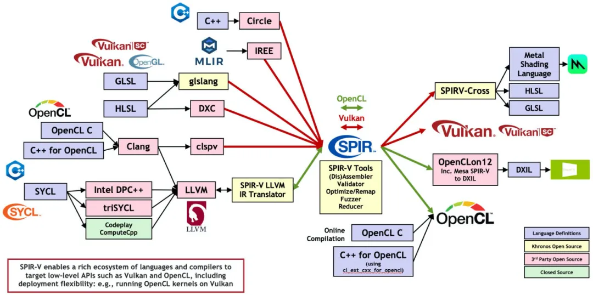
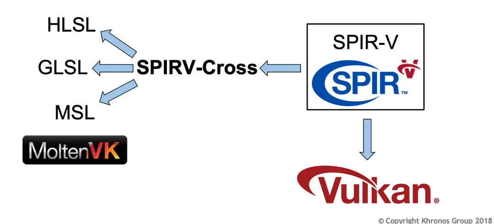

# Vulkan 的着色器有什么特点？

接上一节[ Vulkan 渲染管线](http://mp.weixin.qq.com/s?__biz=MzIwNTIwMzAzNg==&mid=2654177299&idx=1&sn=03af8b45ccd56ce1fd8ca01adb0598e3&chksm=8cf35b20bb84d2369917c759198354d45bdc8e2b73c2133de8e98719041e3a20762f43c47aef&scene=21#wechat_redirect)介绍，现在单独把 Vulkan 着色器抽出来作为一节来讲。



# Vulkan 着色器

**Vulkan 使用的着色器必须编译为 SPIR-V 格式，这是一种二进制中间语言**，它可以由多种高级着色器语言（如 GLSL、HLSL ）编译而成。



SPIR-V 的全称是 Standard Portable Intermediate Representation，而“V”表示它是为了 Vulkan 设计的版本。

**SPIR-V是一种平台无关的中间语言，可以用于各种语言和各种驱动平台。**

**这意味着同一份 SPIR-V 代码可以在不同的硬件和操作系统上运行**，为着色器的跨平台部署提供了便利。

如果 GPU 供应商可以提供编译工具将它转换到 SPIR-V 格式的话，应用程序可以使用任何一种高层次语言（如 GLSL、HLSL）。

跟 OpenGL 类似，我们**无论是使用 GLSL还是 HLSL （脚本语言）编写我们的 shader , 都需要事先编译为 SPIR-V（二进制格式）**，并通过 Vulkan API 加载到 GPU上执行。

# 编译和加载 Vulkan 着色器

我们以 GLSL 脚本编译为例，推荐使用 glslangValidator 或 ShaderC 编译工具将 GLSL 代码编译为 SPIR-V 字节码。

下面是一个可编译成 SPIR-V 字节码的 GLSL 脚本 (用于纹理采样)，除了版本声明外，我们来对比下于我们常用的 OpenGL 着色器脚本有什么区别。

顶点着色器脚本：

```
 1#version 450  // 指定GLSL的版本号为450，对应于OpenGL 4.5或Vulkan 1.0
 3// 输入属性
 4layout(location = 0) in vec3 inPos;     // 顶点位置，location = 0 表示从顶点输入中读取第一个属性
 5layout(location = 1) in vec2 inUV;      // 纹理坐标，location = 1 表示从顶点输入中读取第二个属性
 6layout(location = 2) in vec3 inNormal;  // 顶点法线，location = 2 表示从顶点输入中读取第三个属性
 8// Uniform 缓冲对象 (UBO)，用于传递投影、模型、视图矩阵
 9layout(binding = 0) uniform UBO 
10{
11    mat4 projectionMatrix;  // 投影矩阵
12    mat4 modelMatrix;       // 模型矩阵
13    mat4 viewMatrix;        // 视图矩阵
14} ubo;  // `ubo` 是这个 uniform 块的实例名，着色器中通过它访问矩阵
16// 输出变量，传递到片段着色器
17layout(location = 0) out vec2 outUV;  // 纹理坐标输出，location = 0 表示传递给片段着色器的第一个输出变量
19// 顶点着色器的主函数
20void main() 
21{
22    outUV = inUV;  // 将输入的纹理坐标传递给输出变量 `outUV`
24    // 计算最终顶点位置并赋值给gl_Position
25    gl_Position = ubo.projectionMatrix * ubo.viewMatrix * ubo.modelMatrix * vec4(inPos.xyz, 1.0);  
26    // 将输入的顶点位置转换为世界坐标系中的位置，再转换为观察空间坐标系，最后转换为裁剪空间坐标系，并传递给gl_Position
27}
```

片段着色器脚本：

```
 1#version 450  // 指定GLSL的版本号为450，对应于OpenGL 4.5或Vulkan 1.0
 3// Uniform 变量，用于传递2D纹理采样器
 4layout (binding = 1) uniform sampler2D samplerColor;
 5// sampler2D：用于在片段着色器中采样2D纹理的统一变量
 6// binding = 1：指定了该采样器在着色器中的绑定点为1
 8// 输入变量，从顶点着色器传递过来的纹理坐标
 9layout (location = 0) in vec2 inUV;  
10// location = 0：指定输入变量的位置为0
12// 输出变量，片段的最终颜色
13layout (location = 0) out vec4 outFragColor;  
14// location = 0：指定输出变量的位置为0，表示片段着色器输出的颜色
16// 片段着色器的主函数
17void main() 
18{
19    // 通过采样2D纹理 `samplerColor`，使用插值后的纹理坐标 `inUV`，获取纹理颜色，并将其赋值给 `outFragColor`
20    outFragColor = texture(samplerColor, inUV, 0.0);
21    // `texture()` 函数：在指定的 `samplerColor` 纹理上采样，使用纹理坐标 `inUV`，第三个参数 0.0 是一个 LOD（细节层次）的偏移量，这里不使用 LOD 偏移
22}
```

## glslangValidator

glslangValidator 是由 Khronos Group 提供的，一个用于验证和编译 GLSL（OpenGL Shading Language）着色器代码的工具， 它是 Khronos Group 的 GLSLang 项目的一部分。

地址：https://github.com/KhronosGroup/glslang

假设你有一个名为 shader.vert 的顶点着色器文件，内容如下：

```
 1#version 450  // 指定GLSL的版本号为450，对应于OpenGL 4.5或Vulkan 1.0
 3// 输入属性
 4layout(location = 0) in vec3 inPosition;  // 顶点位置，location = 0 表示从顶点输入中第一个属性读取
 5layout(location = 1) in vec3 inColor;     // 顶点颜色，location = 1 表示从顶点输入中第二个属性读取
 7// 输出变量，传递到片段着色器
 8layout(location = 0) out vec3 fragColor;  // 片段颜色输出，location = 0 表示传递给片段着色器的第一个输出变量
10// 顶点着色器主函数
11void main() {
12    // 将输入的顶点位置转换为标准化设备坐标系中的位置并赋值给gl_Position
13    gl_Position = vec4(inPosition, 1.0);  // gl_Position 是GLSL中的内建变量，表示顶点位置
15    // 将输入的颜色传递给片段着色器
16    fragColor = inColor;  // 将输入的颜色直接赋值给fragColor，这个值将传递到片段着色器
17}
```

上述脚本中 **#version 450 为指定 GLSL 的版本号为 450 ，对应于 OpenGL 4.5 或 Vulkan 1.0 。**

使用 glslangValidator 将其编译为 SPIR-V：

```
1glslangValidator -V shader.vert -o shader.vert.spv
```

- -V 参数表示目标为 Vulkan。
- -o 参数用于指定输出文件名，shader.vert.spv 就是生成的 SPIR-V 字节码文件。

# ShaderC

ShaderC 是一个基于 glslang 的库，专门为自动化和编程场景设计，适用于在应用程序内动态编译着色器。

地址：https://github.com/google/shaderc

基于 ShaderC 编译 GLSL 脚本的代码：

```
 1#include <shaderc.h>
 2std::vector<char> glslShader;  // 用于存储加载的GLSL着色器代码字符串
 4// 使用shaderc编译器将GLSL代码编译成SPIR-V字节码
 5shaderc_compiler_t compiler = shaderc_compiler_initialize();  // 初始化shaderc编译器
 7shaderc_compilation_result_t spvShader = shaderc_compile_into_spv(
 8    compiler,                          // 编译器实例
 9    glslShader.data(),                 // GLSL着色器代码数据指针
10    glslShader.size(),                 // GLSL着色器代码长度
11    getShadercShaderType(type),        // 根据type（如顶点、片段）获取shaderc着色器类型
12    "shaderc_error",                   // 用于调试的着色器文件名（可以随意）
13    "main",                            // 着色器入口点函数名
14    nullptr                            // 可选的编译选项
15);
17// 获取编译状态，检查是否成功
18int status = shaderc_result_get_compilation_status(spvShader);
19if (status != shaderc_compilation_status_success) {  // 如果编译不成功
20    LOGCATE("compilation status error = %d", status); // 输出错误状态
21    return static_cast<VkResult>(-1);                // 返回错误代码
22}
24// 获取 SPIR-V 二进制
25size_t  codeSize = shaderc_result_get_length(spvShader);
26const uint32_t*  pCode = (const uint32_t*)shaderc_result_get_bytes(spvShader);
28// 释放shaderc编译器和编译结果的资源
29shaderc_result_release(spvShader);    // 释放SPIR-V编译结果资源
30shaderc_compiler_release(compiler);   // 释放shaderc编译器资源
```

## 加载 Vulkan 着色器

VkShaderModule 是 Vulkan 中表示着色器模块的结构体。

```
1typedef struct VkShaderModuleCreateInfo {
2    VkStructureType            sType;    // 必须为 VK_STRUCTURE_TYPE_SHADER_MODULE_CREATE_INFO
3    const void*                pNext;    // 用于扩展的指针，通常为 nullptr
4    VkShaderModuleCreateFlags  flags;    // 创建标志，当前版本必须为 0
5    size_t                     codeSize; // SPIR-V 字节码的大小（以字节为单位）
6    const uint32_t*            pCode;    // 指向 SPIR-V 字节码数据的指针
7} VkShaderModuleCreateInfo;
```

将着色器脚本编译成 SPIR-V 二进制代码之后，通过创建 Vulkan 着色器模块来加载二进制代码。

```
 1char *shaderCode = new char[size];//加载我们编译好的 SPIR-V 字节码数据
 3// 创建Vulkan着色器模块（shader module）
 4VkShaderModule shaderModule;
 5VkShaderModuleCreateInfo moduleCreateInfo;
 6moduleCreateInfo.sType = VK_STRUCTURE_TYPE_SHADER_MODULE_CREATE_INFO;
 7moduleCreateInfo.pNext = NULL;
 8moduleCreateInfo.codeSize = size;
 9moduleCreateInfo.pCode = (uint32_t*)shaderCode;
10moduleCreateInfo.flags = 0;
12// 调用Vulkan函数创建着色器模块，结果存储在 shaderModule
13VkResult result = vkCreateShaderModule(vkDevice, &moduleCreateInfo, 
14                                       nullptr, &shaderModule);
15if(result!= VK_SUCCESS) {
16    throw std::runtime_error("failed to create shader module!");
17}
19VkPipelineShaderStageCreateInfo shaderStage = {};
20shaderStage.sType = VK_STRUCTURE_TYPE_PIPELINE_SHADER_STAGE_CREATE_INFO;
21shaderStage.pNext = nullptr;
22shaderStage.flags = 0;
23shaderStage.stage = VK_SHADER_STAGE_VERTEX_BIT;//指定该着色器阶段为顶点着色器阶段
24shaderStage.module = shaderModule;
25shaderStage.pName = "main";
26shaderStage.pSpecializationInfo = nullptr;
28// 基于上述结构体创建管线
30//管线创建完毕注意销毁 shaderModule
31delete[] shaderCode;
32vkDestroyShaderModule(vkDevice, shaderModule, nullptr);
```

# 参考

《Vulkan 学习指南》 — [新加坡] 帕敏德·辛格（Parminder Singh）
《Vulkan 应用开发指南》— [美] 格拉汉姆·塞勒斯等 译者：李晓波等