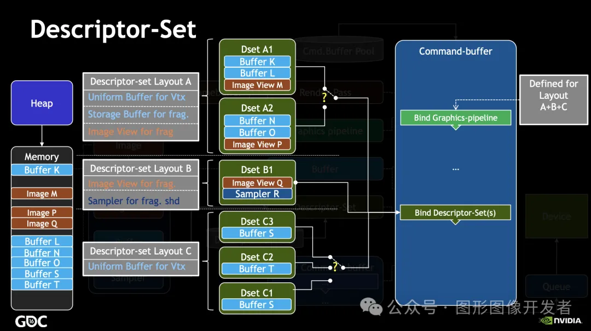
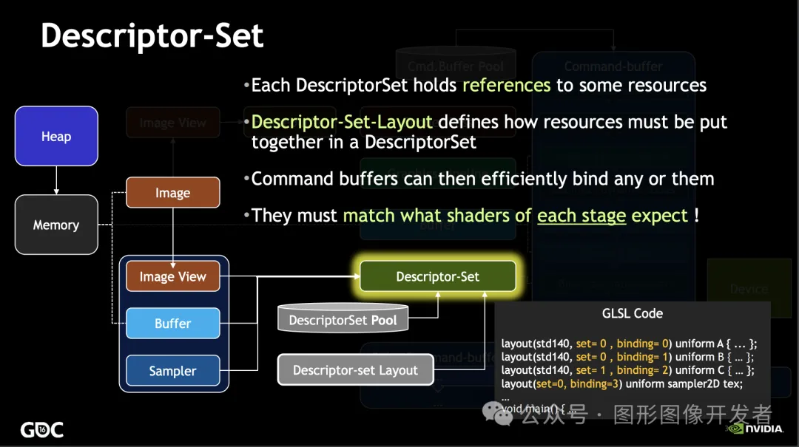
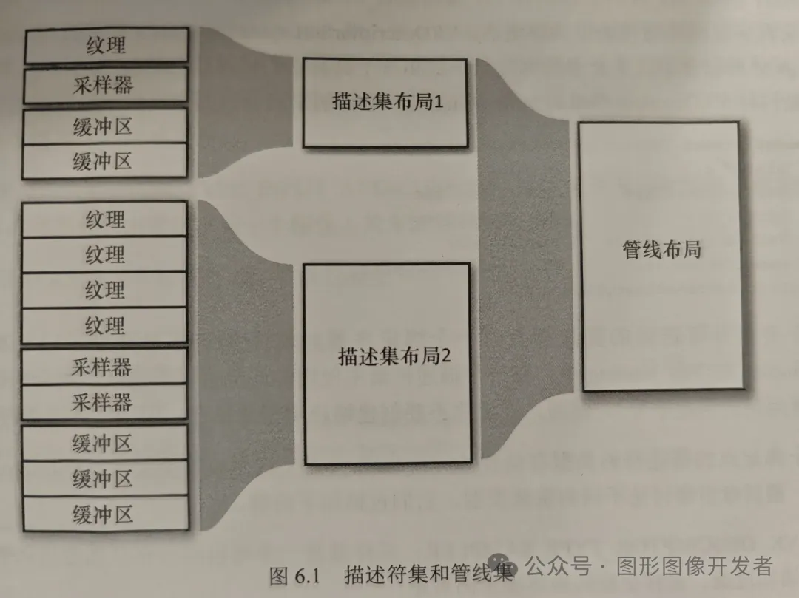

# 一文讲清楚 Vulkan 描述符集



# Vulkan 描述符集

Vulkan 中，描述符（Descriptor）是一种用于在着色器中访问资源（如缓冲区、图像、采样器等）的机制或协议。

每个描述符对应一个资源，代表 GPU 内存中的资源，如 uniform buffer、storage buffer、纹理、采样器等。

**Vulkan 描述符集（VkDescriptorSet）表示着色器可以与之交互的资源的集合，着色器是通过描述符集读取和解析资源中的数据，着色器中的绑定点和相应描述符集中的绑定点必须一一对应****。**

**Vulkan 描述符集是不能被直接创建的**。它们首先需要从一个特定的缓冲池中被分配得到，这个池叫作描述符池（VkDescriptorPool），这个有点类似于内存池的概念。




描述符池负责分配新的描述符对象。换句话说，它相当于一组描述符的集合，新的描述符集就是从这些描述符中分配得到的。


描述符池对于内存分配效率较低的场合是非常有用的，它可以直接分配多组描述符集而不需要调用全局同步操作。


**在创建描述符集之前，需要定义描述符集的布局（VkDescriptorSetLayout）。布局指定了每个描述符的类型、数量、绑定点等信息。**

描述符集布局定义了描述符集中资源的结构，确保描述符集能正确地绑定到管线上。**两个拥有相同布局的描述符集被视为兼容的和可相互交换的。**

# 描述符集布局和管线布局




上文讲到描述符集布局 VkDescriptorSetLayout 指定了每个描述符的类型、数量、绑定点等信息，那么又跟管线布局 VkPipelineLayout 有什么关系呢？


**管线布局是对着色器资源绑定的全局描述，代表了图形管线可以访问的所有资源的集合。**


创建Vulkan渲染管线的时候需要设置管线布局，它描述了在渲染过程中着色器如何访问资源，包括描述符集和推送常量等。

**管线布局可以包含一个或多个描述符集布局和推送常量描述**（推送常量可以更新着色器中的常量数据，后面会再展开讲），下面是创建管线布局的结构体（这个结构体在前文图形管线的创建中用到）：

```
typedef struct VkPipelineLayoutCreateInfo {
    VkStructureType                 sType;                  // 结构体类型，必须是 VK_STRUCTURE_TYPE_PIPELINE_LAYOUT_CREATE_INFO
    const void*                     pNext;                  // 指向扩展结构体的指针，通常为 nullptr
    VkPipelineLayoutCreateFlags     flags;                  // 管线布局创建标志，通常为 0
    uint32_t                        setLayoutCount;         // 绑定的描述符集布局数量
    const VkDescriptorSetLayout*    pSetLayouts;            // 指向描述符集布局数组的指针
    uint32_t                        pushConstantRangeCount; // 推送常量范围数量
    const VkPushConstantRange*      pPushConstantRanges;    // 指向推送常量范围数组的指针
} VkPipelineLayoutCreateInfo;
```

**无论是管线布局还是描述符集布局，本质上都是对资源的一种描述，其本身并不占用资源。**


## 创建和使用描述符集

### 创建描述符集步骤

1. **定义描述符集布局：**

2. - 使用 `VkDescriptorSetLayoutBinding` 结构体定义每个描述符的类型、数量和绑定点。
   - 调用 `vkCreateDescriptorSetLayout` 创建描述符集布局。

3. **创建描述符池：**

4. - 使用 `VkDescriptorPoolSize` 指定描述符池中的每种描述符类型的数量。
   - 调用 `vkCreateDescriptorPool` 创建描述符池。

5. **分配描述符集：**

6. - 调用 `vkAllocateDescriptorSets` 从描述符池中分配描述符集。

7. **更新描述符集：**

8. - 使用 `VkWriteDescriptorSet` 结构体更新描述符集中的描述符，绑定实际的资源（如缓冲区、纹理）。

9. **绑定描述符集**：

10. - 在渲染过程中，调用 `vkCmdBindDescriptorSets` 将描述符集绑定到管线，着色器便可以访问描述符集中指定的资源。

      

我们先搞个着色器的脚本，**然后对着这个着色器脚本创建描述符集布局和描述符集，主要是为了展示着色器和描述符集的关系是多么地密切，一目了然哈。**

顶点着色器：

```
#version 450  // 指定GLSL的版本号为450，对应于OpenGL 4.5或Vulkan 1.0

// 输入属性
layout(location = 0) in vec3 inPos;     // 顶点位置，location = 0 表示从顶点输入中读取第一个属性
layout(location = 1) in vec2 inUV;      // 纹理坐标，location = 1 表示从顶点输入中读取第二个属性
layout(location = 2) in vec3 inNormal;  // 顶点法线，location = 2 表示从顶点输入中读取第三个属性

// Uniform 缓冲对象 (UBO)，用于传递投影、模型、视图矩阵
layout(binding = 0) uniform UBO 
{
    mat4 mvp;
} ubo;  // `ubo` 是这个 uniform 块的实例名，着色器中通过它访问矩阵

// 输出变量，传递到片段着色器
layout(location = 0) out vec2 outUV;  // 纹理坐标输出，location = 0 表示传递给片段着色器的第一个输出变量

// 顶点着色器的主函数
void main() 
{
    outUV = inUV;  // 将输入的纹理坐标传递给输出变量 `outUV`

    // 计算最终顶点位置并赋值给gl_Position
    gl_Position = ubo.mvp * vec4(inPos.xyz, 1.0);  
    // 将输入的顶点位置转换为世界坐标系中的位置，再转换为观察空间坐标系，最后转换为裁剪空间坐标系，并传递给gl_Position
}
```

片段着色器：

```
#version 450  // 指定GLSL的版本号为450，对应于OpenGL 4.5或Vulkan 1.0

// Uniform 变量，用于传递2D纹理采样器
layout (binding = 1) uniform sampler2D samplerColor;
// sampler2D：用于在片段着色器中采样2D纹理的统一变量
// binding = 1：指定了该采样器在着色器中的绑定点为1

// 输入变量，从顶点着色器传递过来的纹理坐标
layout (location = 0) in vec2 inUV;  
// location = 0：指定输入变量的位置为0

// 输出变量，片段的最终颜色
layout (location = 0) out vec4 outFragColor;  
// location = 0：指定输出变量的位置为0，表示片段着色器输出的颜色

// 片段着色器的主函数
void main() 
{
    // 通过采样2D纹理 `samplerColor`，使用插值后的纹理坐标 `inUV`，获取纹理颜色，并将其赋值给 `outFragColor`
    outFragColor = texture(samplerColor, inUV, 0.0);
    // `texture()` 函数：在指定的 `samplerColor` 纹理上采样，使用纹理坐标 `inUV`，第三个参数 0.0 是一个 LOD（细节层次）的偏移量，这里不使用 LOD 偏移
}
```


上面脚本中有 2 个绑定点，binding = 0 是 UBO（ MVP 矩阵） ，另一个 binding = 1 是纹理采样器，我们需要使用 2 个描述符。

我们通过 VkDescriptorSetLayoutBinding 描述符集布局绑定来设置描述符的信息：

```
// 定义 Uniform Buffer Object (UBO) 的描述符集布局绑定
VkDescriptorSetLayoutBinding uboLayoutBinding{};
uboLayoutBinding.binding = 0; // 绑定点 0
uboLayoutBinding.descriptorType = VK_DESCRIPTOR_TYPE_UNIFORM_BUFFER; // 描述符类型为 Uniform Buffer
uboLayoutBinding.descriptorCount = 1; // 仅绑定一个描述符
uboLayoutBinding.stageFlags = VK_SHADER_STAGE_VERTEX_BIT; // 该 UBO 将用于顶点着色器

// 定义 Combined Image Sampler 的描述符集布局绑定
VkDescriptorSetLayoutBinding samplerLayoutBinding{};
samplerLayoutBinding.binding = 1; // 绑定点 1
samplerLayoutBinding.descriptorType = VK_DESCRIPTOR_TYPE_COMBINED_IMAGE_SAMPLER; // 描述符类型为 Combined Image Sampler
samplerLayoutBinding.descriptorCount = 1; // 仅绑定一个描述符
samplerLayoutBinding.stageFlags = VK_SHADER_STAGE_FRAGMENT_BIT; // 该采样器将用于片段着色器
```

基于描述符集布局绑定创建描述符集布局：

```
// 将两个绑定定义组合到一个数组中
std::array<VkDescriptorSetLayoutBinding, 2> bindings = {uboLayoutBinding, samplerLayoutBinding};

// 创建描述符集布局
VkDescriptorSetLayoutCreateInfo layoutInfo{};
layoutInfo.sType = VK_STRUCTURE_TYPE_DESCRIPTOR_SET_LAYOUT_CREATE_INFO; // 结构体类型
layoutInfo.bindingCount = static_cast<uint32_t>(bindings.size()); // 绑定数量
layoutInfo.pBindings = bindings.data(); // 指向绑定数组

VkDescriptorSetLayout descriptorSetLayout;
vkCreateDescriptorSetLayout(device, &layoutInfo, nullptr, &descriptorSetLayout); // 创建描述符集布局
```

创建描述符池：

```
// 创建描述符池，用于分配描述符集
std::array<VkDescriptorPoolSize, 2> poolSizes{};
poolSizes[0].type = VK_DESCRIPTOR_TYPE_UNIFORM_BUFFER; // 池中的第一个类型为 Uniform Buffer
poolSizes[0].descriptorCount = 1; // 分配一个此类型的描述符

poolSizes[1].type = VK_DESCRIPTOR_TYPE_COMBINED_IMAGE_SAMPLER; // 池中的第二个类型为 Combined Image Sampler
poolSizes[1].descriptorCount = 1; // 分配一个此类型的描述符

VkDescriptorPoolCreateInfo poolInfo{};
poolInfo.sType = VK_STRUCTURE_TYPE_DESCRIPTOR_POOL_CREATE_INFO; // 结构体类型
poolInfo.poolSizeCount = static_cast<uint32_t>(poolSizes.size()); // 描述符池大小数量
poolInfo.pPoolSizes = poolSizes.data(); // 指向描述符池大小数组
poolInfo.maxSets = 1; // 仅创建一个描述符集

VkDescriptorPool descriptorPool;
vkCreateDescriptorPool(device, &poolInfo, nullptr, &descriptorPool); // 创建描述符池
```

从描述符池中分配描述符集：

```
// 分配描述符集
VkDescriptorSetAllocateInfo allocInfo{};
allocInfo.sType = VK_STRUCTURE_TYPE_DESCRIPTOR_SET_ALLOCATE_INFO; // 结构体类型
allocInfo.descriptorPool = descriptorPool; // 从先前创建的描述符池中分配
allocInfo.descriptorSetCount = 1; // 分配一个描述符集
allocInfo.pSetLayouts = &descriptorSetLayout; // 指向描述符集布局

VkDescriptorSet descriptorSet;
vkAllocateDescriptorSets(device, &allocInfo, &descriptorSet); // 分配描述符集
```

更新描述符集（一个是 Buffer ，另一个是纹理采样器+图像视图）：

```
// 更新描述符集中的 UBO 部分
VkDescriptorBufferInfo bufferInfo{};
bufferInfo.buffer = uniformBuffer; // 指向包含 UBO 的缓冲区
bufferInfo.offset = 0; // 缓冲区起始偏移量
bufferInfo.range = sizeof(UniformBufferObject); // 缓冲区范围

VkWriteDescriptorSet descriptorWrite{};
descriptorWrite.sType = VK_STRUCTURE_TYPE_WRITE_DESCRIPTOR_SET; // 结构体类型
descriptorWrite.dstSet = descriptorSet; // 目标描述符集
descriptorWrite.dstBinding = 0; // 目标绑定点 0
descriptorWrite.dstArrayElement = 0; // 数组中的第一个元素
descriptorWrite.descriptorType = VK_DESCRIPTOR_TYPE_UNIFORM_BUFFER; // 描述符类型
descriptorWrite.descriptorCount = 1; // 更新一个描述符
descriptorWrite.pBufferInfo = &bufferInfo; // 指向包含 UBO 信息的结构体

// 更新描述符集中的 Combined Image Sampler 部分
VkDescriptorImageInfo imageInfo{};
imageInfo.sampler = textureSampler; // 指向已创建的采样器
imageInfo.imageView = textureImageView; // 指向已创建的图像视图
imageInfo.imageLayout = VK_IMAGE_LAYOUT_SHADER_READ_ONLY_OPTIMAL; // 图像布局

VkWriteDescriptorSet samplerDescriptorWrite{};
samplerDescriptorWrite.sType = VK_STRUCTURE_TYPE_WRITE_DESCRIPTOR_SET; // 结构体类型
samplerDescriptorWrite.dstSet = descriptorSet; // 目标描述符集
samplerDescriptorWrite.dstBinding = 1; // 目标绑定点 1
samplerDescriptorWrite.dstArrayElement = 0; // 数组中的第一个元素
samplerDescriptorWrite.descriptorType = VK_DESCRIPTOR_TYPE_COMBINED_IMAGE_SAMPLER; // 描述符类型
samplerDescriptorWrite.descriptorCount = 1; // 更新一个描述符
samplerDescriptorWrite.pImageInfo = &imageInfo; // 指向包含图像采样器信息的结构体

// 更新描述符集
std::array<VkWriteDescriptorSet, 2> descriptorWrites = {descriptorWrite, samplerDescriptorWrite};
vkUpdateDescriptorSets(device, static_cast<uint32_t>(descriptorWrites.size()), descriptorWrites.data(), 0, nullptr);
```

我们后续在录制渲染指令到指令缓存时（后面章节会讲到），通过 vkCmdBindDescriptorSets 来绑定相应的描述符集：

```
// 在命令缓冲区中绑定描述符集
vkCmdBindDescriptorSets(
    commandBuffer,                   // 目标命令缓冲区
    VK_PIPELINE_BIND_POINT_GRAPHICS, // 指定为图形管线
    pipelineLayout,                  // 绑定的管线布局
    0,                               // 第一个描述符集的索引
    1,                               // 绑定一个描述符集
    &descriptorSet,                  // 指向描述符集的指针
    0,                               // 动态偏移量数量
    nullptr                          // 没有动态偏移量
);
```

好了，关于描述符集的介绍到此为止，我们完成了闭环。

# 参考

《Vulkan 学习指南》 — [新加坡] 帕敏德·辛格（Parminder Singh）

《Vulkan 应用开发指南》— [美] 格拉汉姆·塞勒斯（Graham Sellers）等 译者：李晓波 等


-- END --

推荐 Vulkan 系列文章：

[1.开篇，Vulkan 概述](http://mp.weixin.qq.com/s?__biz=MzIwNTIwMzAzNg==&mid=2654177035&idx=1&sn=48ab8877a7ae1620845dc63b2e7cb070&chksm=8cf35438bb84dd2e919d288deaa06f16580e5cb339d2be2ec606fbf772377dd02bc111df5e34&scene=21#wechat_redirect)

2. [Vulkan 实例](http://mp.weixin.qq.com/s?__biz=MzIwNTIwMzAzNg==&mid=2654177037&idx=1&sn=b7adcfa1fa1592df694f59753985183f&chksm=8cf3543ebb84dd282395f1403ed66116039ee7a4a42f0f1dc0bdaf318584302f82f97ed3362a&scene=21#wechat_redirect)
3. [Vulkan 物理设备](http://mp.weixin.qq.com/s?__biz=MzIwNTIwMzAzNg==&mid=2654177041&idx=1&sn=1701e31a8aa6d6520dfbec640ef9ba8b&chksm=8cf35422bb84dd34a8332c60ec5525818fa9767b21889dc15b989618ad50707ad3572c02c403&scene=21#wechat_redirect)
4. [Vulkan 设备队列](http://mp.weixin.qq.com/s?__biz=MzIwNTIwMzAzNg==&mid=2654177050&idx=1&sn=a9bedbf489a562e8ba6238d708d17ad0&chksm=8cf35429bb84dd3f86ad93fa414295a0ddb39993630ff1b36b731896fb52ff941653c1d61aba&scene=21#wechat_redirect)
5. [Vulkan 逻辑设备](http://mp.weixin.qq.com/s?__biz=MzIwNTIwMzAzNg==&mid=2654177058&idx=1&sn=1e94127b5ad3825d0e6501b89ffc794f&chksm=8cf35411bb84dd075249f830a547178117b2f788cf1fe2847d94c61348f8a6a52abffbb67dad&scene=21#wechat_redirect)
6. [Vulkan 内存管理](http://mp.weixin.qq.com/s?__biz=MzIwNTIwMzAzNg==&mid=2654177104&idx=1&sn=35bba934feaadcf44710f3a1aa3f4a20&chksm=8cf35463bb84dd7581f4136810d132e7ba8ad973d31c33d3dc2012a07ab5b4a47e339fcdfb70&scene=21#wechat_redirect)
7. [Vulkan 缓存](http://mp.weixin.qq.com/s?__biz=MzIwNTIwMzAzNg==&mid=2654177091&idx=1&sn=0070a312e57d8e7a4768dcdf5e29dfcc&chksm=8cf35470bb84dd66e45570101eb0b39092c66170d59ec5825c4a1a661821efaf05ad2c0a16af&scene=21#wechat_redirect)
8. [Vulkan 图像](http://mp.weixin.qq.com/s?__biz=MzIwNTIwMzAzNg==&mid=2654177095&idx=1&sn=0f787a32de1b9bf03a654b5b9ea773a6&chksm=8cf35474bb84dd62e587503ab79d2bd9715b2d572ebe830a1ab0b94d398ad71ca968d8f24da8&scene=21#wechat_redirect)

9. [Vulkan 图像视图](http://mp.weixin.qq.com/s?__biz=MzIwNTIwMzAzNg==&mid=2654177103&idx=1&sn=9889d04325edf4940e0a3786882a3df2&chksm=8cf3547cbb84dd6a058f9d71561c9e745418af953f2e50e2e0c8ab2572638aac40e7047789b8&scene=21#wechat_redirect)
10. [Vulkan 窗口表面（Surface）](http://mp.weixin.qq.com/s?__biz=MzIwNTIwMzAzNg==&mid=2654177108&idx=1&sn=92151c8b687f62e0d5119f69fea35b49&chksm=8cf35467bb84dd71e025853b6170a17b95bffbd5fb0ca1499ee42eaa59231f9558d78f2c64ef&scene=21#wechat_redirect)
11. [Vulkan 交换链](http://mp.weixin.qq.com/s?__biz=MzIwNTIwMzAzNg==&mid=2654177115&idx=1&sn=41d8e9f9e2d20bd71f39ebbcee42015c&chksm=8cf35468bb84dd7ed0f67bcaa8db656f6995574dcf2852cd5f584a81ae540698840040eede69&scene=21#wechat_redirect)
12. [Vulkan 渲染通道](http://mp.weixin.qq.com/s?__biz=MzIwNTIwMzAzNg==&mid=2654177269&idx=1&sn=be0d98bfa045c6e84c07e607a9eaa6a8&chksm=8cf354c6bb84ddd02bdd202df24045d6433950fe048a92130ab3f493b7bcdc957b7c79ed633a&scene=21#wechat_redirect)

13.[Vulkan 帧缓冲区（FrameBuffer）](http://mp.weixin.qq.com/s?__biz=MzIwNTIwMzAzNg==&mid=2654177275&idx=1&sn=142709de9db4064cb02688532c113027&chksm=8cf354c8bb84dddea29a512511ca79e3b8c5df9c8431aebbed62aef67f4cdde7a5cc38edbec1&scene=21#wechat_redirect)

14. [Vulkan 图形管线](http://mp.weixin.qq.com/s?__biz=MzIwNTIwMzAzNg==&mid=2654177299&idx=1&sn=03af8b45ccd56ce1fd8ca01adb0598e3&chksm=8cf35b20bb84d2369917c759198354d45bdc8e2b73c2133de8e98719041e3a20762f43c47aef&scene=21#wechat_redirect)

15.[Vulkan 的着色器](http://mp.weixin.qq.com/s?__biz=Mzg2NDc1OTIzOQ==&mid=2247484120&idx=1&sn=c14e3390020281e22eac9bc9f1dbe5a2&chksm=ce653e70f912b76635f2be2b48239a567331ab15a57ace2eab05d98845923828eb9531569545&scene=21#wechat_redirect)