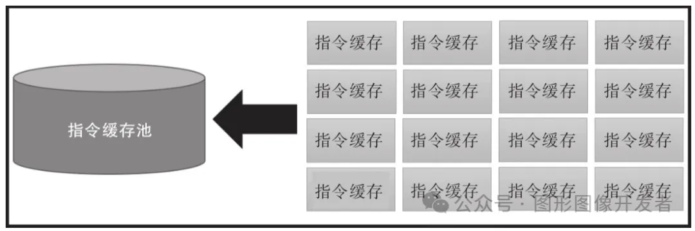
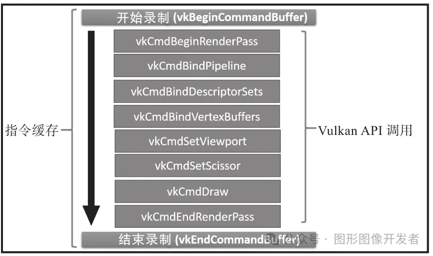

# 理解 Vulkan 指令缓存

在 Vulkan 中，指令缓存（Command Buffer）是**用于记录和存储一系列绘图和计算指令的对象**。


这些指令将在 GPU 上执行，可以用于执行不同类型的工作，包括绑定顶点缓存、绑定流水线、录制渲染通道指令、设置视口和裁切矩形、设置绘制指令、执行图像和缓存内容的复制操作等。


**指令缓存提交到硬件队列的过程和它们被执行的过程是异步进行的。**


指令缓存的类型主要有两种：主指令缓存和次指令缓存。


- **主指令缓存**（primary command buffer）：包含次指令缓存，负责执行它们，可以直接提交给队列执行。
- **次指令缓存**（secondary command buffer）：不能直接提交给队列，必须嵌套在主指令缓存执行中。适用于记录可重用的指令或者多线程录制指令。

# 指令池




一个应用程序中指令缓存的数量可能成百上千。Vulkan API 的设计是为了最大化地提升性能，**指令缓存的分配通过指令池 VkCommandPool 来完成**，从而降低多个指令缓存之间的资源创建带来的性能消耗。


指令缓存可以是一直存在的，它们只需要创建一次，就可以一直反复地使用。如果不想继续使用某一个指令缓存了，可以通过一个简单的休眠指令让它恢复到可复用的状态。

相比传统的“先销毁缓存，再创建一个新的缓存”这样的流程，上述方案是非常高效。

# 指令缓存的创建

## 创建指令池

首先，需要创建一个指令池。指令池用于分配指令缓存。

```
1VkCommandPool commandPool;
2VkCommandPoolCreateInfo poolInfo = {};
3poolInfo.sType = VK_STRUCTURE_TYPE_COMMAND_POOL_CREATE_INFO;
4poolInfo.queueFamilyIndex = graphicsQueueFamilyIndex; // 指定队列族索引
5poolInfo.flags = 0; // 可以指定一些标志，如 VK_COMMAND_POOL_CREATE_RESET_COMMAND_BUFFER_BIT
7if (vkCreateCommandPool(device, &poolInfo, nullptr, &commandPool) != VK_SUCCESS) {
8    throw std::runtime_error("failed to create command pool!");
9}
```

### 分配指令缓存

用于分配指令缓存的结构体：

```
1typedef struct VkCommandBufferAllocateInfo {
2    VkStructureType           sType;              // 结构体类型，必须为 VK_STRUCTURE_TYPE_COMMAND_BUFFER_ALLOCATE_INFO
3    const void*               pNext;              // 可选的扩展指针，通常为 nullptr
4    VkCommandPool             commandPool;        // 用于分配命令缓冲区的命令池
5    VkCommandBufferLevel      level;              // 命令缓冲区的级别，主级别或次级别
6    uint32_t                  commandBufferCount; // 要分配的命令缓冲区数量，你可以一次性分配多个命令缓冲区。
7} VkCommandBufferAllocateInfo;
```

其中 level 这个属性你稍加注意下，level: 指定命令缓冲区的级别。可以是以下两个值之一：

- `VK_COMMAND_BUFFER_LEVEL_PRIMARY`: 主命令缓冲区，可以直接提交到队列并执行。
- `VK_COMMAND_BUFFER_LEVEL_SECONDARY`: 次级命令缓冲区，不能直接提交，需要在主命令缓冲区内调用。

在创建指令池后，可以从指令池中分配指令缓存。

```
 1VkCommandBufferAllocateInfo allocInfo = {};
 2allocInfo.sType = VK_STRUCTURE_TYPE_COMMAND_BUFFER_ALLOCATE_INFO;
 3allocInfo.commandPool = commandPool; // 指定指令池
 4allocInfo.level = VK_COMMAND_BUFFER_LEVEL_PRIMARY; // 指定缓存类型
 5allocInfo.commandBufferCount = 1; // 分配的指令缓存数量
 7VkCommandBuffer commandBuffer;
 8if (vkAllocateCommandBuffers(device, &allocInfo, &commandBuffer) != VK_SUCCESS) {
 9    throw std::runtime_error("failed to allocate command buffers!");
10}
```

## 释放指令缓存、销毁缓存池

```
1// 释放指令缓存
2vkFreeCommandBuffers(device, commandPool, 1, &commandBuffer);
3// 销毁命令池
4vkDestroyCommandPool(device, commandPool, nullptr);
```

# 指令缓存的使用



**
**

**指令缓存是用来记录指令的，它是通过函数 vkBeginCommandBuffer() 和 vkEndCommandBuffer() 来完成**。这两个函数定义了一个范围，在这个范围之内的所有Vulkan指令都会被记录下来。

指令记录的起始位置是通过函数 vkBeginCommandBuffer(）设置的。它定义了一个起始位置，在它之后的所有指令调用都会被记录下来，直到我们设置了结束位置（即vkEndCommandBuffer（））。

分配指令缓存后，可以开始记录指令。

```
 1// 定义命令缓冲区的开始信息结构体
 2VkCommandBufferBeginInfo beginInfo = {}; // 初始化 VkCommandBufferBeginInfo 结构体
 3beginInfo.sType = VK_STRUCTURE_TYPE_COMMAND_BUFFER_BEGIN_INFO; // 指定结构体类型为 VK_STRUCTURE_TYPE_COMMAND_BUFFER_BEGIN_INFO
 4beginInfo.flags = 0; // 设置为 0 或 VK_COMMAND_BUFFER_USAGE_ONE_TIME_SUBMIT_BIT 表示一次性使用
 5beginInfo.pInheritanceInfo = nullptr; // 仅在次级命令缓冲区中使用，如果是主命令缓冲区则为 nullptr
 7// 开始录制命令缓冲区
 8VkResult result = vkBeginCommandBuffer(commandBuffer, &beginInfo); // 开始录制命令缓冲区，传入初始化的 beginInfo
 9if (result != VK_SUCCESS) {
10    throw std::runtime_error("Failed to begin recording command buffer!"); // 检查录制是否成功，若失败则抛出异常
11}
13// 录制 Vulkan 指令
15// 1. 设置视口（可选）
16VkViewport viewport = {}; // 初始化 VkViewport 结构体
17viewport.x = 0.0f; // 视口左上角的 X 坐标
18viewport.y = 0.0f; // 视口左上角的 Y 坐标
19viewport.width = (float)swapChainExtent.width; // 视口的宽度，通常是交换链的宽度
20viewport.height = (float)swapChainExtent.height; // 视口的高度，通常是交换链的高度
21viewport.minDepth = 0.0f; // 最小深度值
22viewport.maxDepth = 1.0f; // 最大深度值
23vkCmdSetViewport(commandBuffer, 0, 1, &viewport); // 录制设置视口的指令，绑定到命令缓冲区
25// 2. 设置剪裁区域（可选）
26VkRect2D scissor = {}; // 初始化 VkRect2D 结构体
27scissor.offset = {0, 0}; // 剪裁区域的偏移量，从左上角开始
28scissor.extent = swapChainExtent; // 剪裁区域的大小，通常是交换链的尺寸
29vkCmdSetScissor(commandBuffer, 0, 1, &scissor); // 录制设置剪裁区域的指令
31// 3. 开始渲染通道（Render Pass）
32VkRenderPassBeginInfo renderPassInfo = {}; // 初始化 VkRenderPassBeginInfo 结构体
33renderPassInfo.sType = VK_STRUCTURE_TYPE_RENDER_PASS_BEGIN_INFO; // 指定结构体类型
34renderPassInfo.renderPass = renderPass; // 指定关联的渲染通道
35renderPassInfo.framebuffer = framebuffer; // 指定要渲染的帧缓冲区
36renderPassInfo.renderArea.offset = {0, 0}; // 渲染区域的起点，通常是从左上角（0, 0）开始
37renderPassInfo.renderArea.extent = swapChainExtent; // 渲染区域的大小，通常与交换链一致
39VkClearValue clearColor = {{{0.0f, 0.0f, 0.0f, 1.0f}}}; // 定义清屏颜色为黑色
40renderPassInfo.clearValueCount = 1; // 清屏的值数量，这里只设置一个清屏颜色
41renderPassInfo.pClearValues = &clearColor; // 指向清屏颜色的指针
43// 开始录制渲染通道
44vkCmdBeginRenderPass(commandBuffer, &renderPassInfo, VK_SUBPASS_CONTENTS_INLINE); // 开始渲染通道的录制
46// 4. 绑定图形管线
47vkCmdBindPipeline(commandBuffer, VK_PIPELINE_BIND_POINT_GRAPHICS, graphicsPipeline); // 绑定图形管线到命令缓冲区
49// 5. 绑定顶点缓冲区（可选）
50VkBuffer vertexBuffers[] = {vertexBuffer}; // 顶点缓冲区数组，包含顶点数据的缓冲区
51VkDeviceSize offsets[] = {0}; // 偏移量数组，表示从缓冲区的哪个位置开始读取数据
52vkCmdBindVertexBuffers(commandBuffer, 0, 1, vertexBuffers, offsets); // 绑定顶点缓冲区，设置偏移量
54// 6. 绘制图元
55vkCmdDraw(commandBuffer, static_cast<uint32_t>(vertexCount), 1, 0, 0); // 录制绘制指令，指定要绘制的顶点数量
57// 结束渲染通道
58vkCmdEndRenderPass(commandBuffer); // 结束当前渲染通道
60// 结束命令缓冲区的录制
61result = vkEndCommandBuffer(commandBuffer); // 结束命令缓冲区的录制
62if (result != VK_SUCCESS) {
63    throw std::runtime_error("Failed to record command buffer!"); // 检查是否成功录制命令缓冲区，失败则抛出异常
64}
```

## 提交指令缓存

记录完命令后，可以将指令缓存提交给队列执行。

```
 1VkSubmitInfo submitInfo = {};
 2submitInfo.sType = VK_STRUCTURE_TYPE_SUBMIT_INFO;
 3submitInfo.commandBufferCount = 1;
 4submitInfo.pCommandBuffers = &commandBuffer;
 6if (vkQueueSubmit(graphicsQueue, 1, &submitInfo, VK_NULL_HANDLE) != VK_SUCCESS) {
 7    throw std::runtime_error("failed to submit draw command buffer!");
 8}
10vkQueueWaitIdle(graphicsQueue); // 等待队列完成执行
12//GPU 渲染完成（渲染指令执行完毕）
```

# 参考

- 《Vulkan 学习指南》 — [新加坡] 帕敏德·辛格（Parminder Singh）
- 《Vulkan 应用开发指南》— [美] 格拉汉姆·塞勒斯（Graham Sellers）等 译者：李晓波 等

