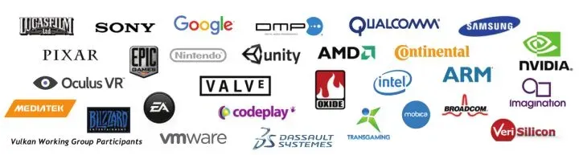
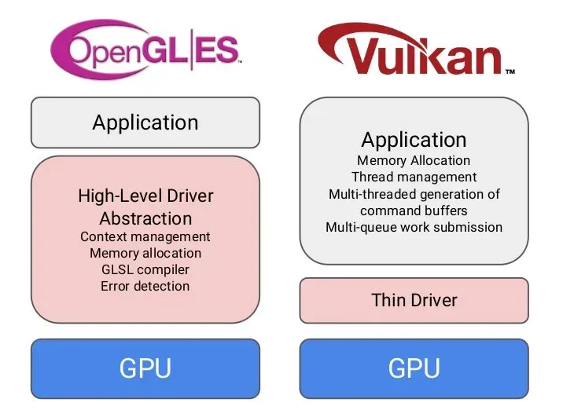
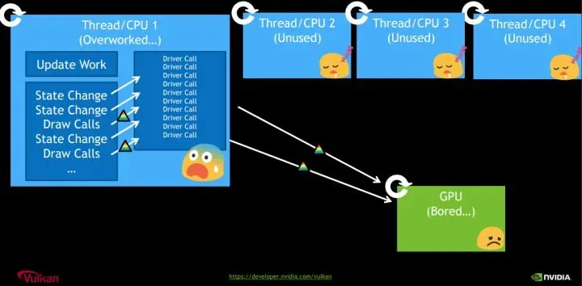
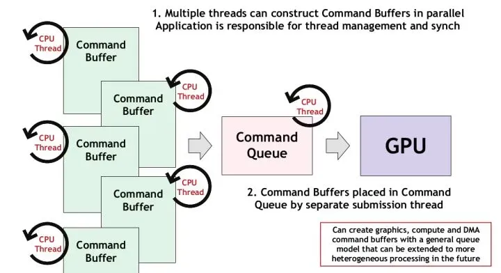

# 开篇，Vulkan 概述

# **什么是 Vulkan**

Vulkan 是由 Khronos Group 开发的一种现代、高性能的图形和计算 API。**它设计用于替代 OpenGL，并提供更直接和细粒度的硬件控制。**

**与 OpenGL 相比，Vulkan 可以更详细的向显卡描述你的应用程序打算做什么，从而可以获得更好的性能和更小的驱动开销。**

Vulkan 的开发者来自图形领域的各行各业，有 GPU 厂商，有系统厂商，有游戏引擎厂商等。

所以 Vulkan 诞生之初就决定了它一定要有跨平台属性，目的就是成为行业内的统一标准。

# **Vulkan 对比 OpenGL**

很多同学肯定经常听到这样的言论：OpenGL（ES）都过时啦，还学它干嘛，现在大家都学 Vulkan 了。

抛开业务场景去谈优势、劣势都是耍流氓，**目前我还看不到 OpenGL（ES）会被 Vulkan 完全替换的可能。**

就拿移动应用开发来说，OpenGL ES 3.0  早在 2012 年发布了， 很过 APP 开发者考虑到 Android 设备的兼容性，依然在使用 GL ES 2.0 版本，另外 iOS 端开发者主要使用苹果的 Metal （类似于 GLES，性能更优）。

**快速开发轻量级、跨平台的图形应用， OpenGL（ES）有着无可替代的优势**，比如在移动开发中，使用 OpenGL ES 做一些图像视频特效、图形图像渲染，开发者可以在更短的时间内完成交付。

**Vulkan 作为一个更为现代化和高效的解决方案，更适合构建对渲染性能和效率要求高的大型软件**。

Vulkan 常用于游戏开发、渲染引擎、虚拟现实、3D 建模等领域，另外，手机厂商也使用 Vulkan 开发和优化各种高性能、图形密集型的应用和功能，从而提升设备性能和用户体验。

## **OpenGL**

**
**

#### 优势：

- **跨平台支持**：OpenGL支持多种操作系统，包括 Windows、macOS、Linux 以及移动操作系统，如iOS和 Android （OpenGL ES）。

- **易于学习和使用**：由于OpenGL有着较长的历史，学习资源丰富，文档齐全，初学者较容易上手。

- **广泛应用**：在游戏开发、CAD、虚拟现实、科学可视化等领域广泛应用，拥有庞大的用户基础。

- **兼容性好**：对于需要兼容多种硬件和操作系统的应用，OpenGL是一个不错的选择。

- **成熟的生态系统**：丰富的第三方库和工具，如 GLUT、GLEW 等，使开发更加便捷。

  

#### 劣势：

- **性能限制**：由于OpenGL的抽象层次较高，某些情况下的性能不如低级别的图形API。
- **单线程设计**：OpenGL的设计主要是单线程的，这在多线程应用中可能会导致性能瓶颈。
- **驱动差异**：不同厂商的驱动实现可能存在差异，导致一些未定义行为和兼容性问题。

### **Vulkan**

**
**

#### 优势：

- **高性能**：Vulkan的设计允许更直接地控制GPU，减少了驱动程序的开销，使其在高性能应用中表现出色。

- **多线程支持**：Vulkan原生支持多线程，能够更有效地利用多核 CPU，提升渲染性能。

- **更低的开销**：通过减少驱动程序的开销，Vulkan提供了更细粒度的控制和更高效的资源管理。

- **统一的跨平台支持**：与OpenGL一样，Vulkan也支持多种操作系统，并且提供了一致的行为和性能。

  

#### 劣势：

- **复杂性高**：Vulkan的设计更为底层和复杂，学习曲线陡峭，对于新手来说上手难度较大。
- **开发成本高**：由于需要更多的手动管理和优化，开发时间和成本可能更高。
- **生态系统尚在完善**：虽然Vulkan生态系统在不断成长，但与OpenGL相比，某些第三方工具和库可能还不够成熟。
- **硬件支持**：虽然大多数现代GPU都支持Vulkan，但一些较老的硬件可能不支持。

# **Vulkan 的优势体现在哪里**

## **驱动层面**

**在 OpenGL 驱动中，驱动会帮你做API验证，内存管理，线程管理等大部分工作**。

OpenGL 驱动大包大揽什么事情都管，即使应用使用API出错，也会帮忙解决处理，保证应用正常运行。开发者使用起来非常简单。

但是 OpenGL为了这些事情，牺牲了大量的性能。

在一些复杂的应用场景，依然会遇到无法解决的问题，很多时候经常是驱动的一厢情愿，应用并不为此买单。

Vulkan 则不然，**Vulkan把API验证、内存管理、多线程管理等工作交由开发者负责。**一旦API使用出错，应用就会出现crash。

没人帮应用兜底，所有事情都交由应用打理。这种方式无疑增加了API使用的复杂度和困难度，但换来的是性能上巨大的提升。

单单是在驱动中去掉API验证操作，就把性能提升了9倍。

## **多线程支持**

在OpenGL中，所有的渲染操作都放在一个线程，其他线程就算处于空闲状态，也只能围观。

Vulkan中引入了 Command Buffer 的概念，每个线程都可以往Command Buffer 提交渲染命令，给开发者提供了充分发挥CPU多核多线程的优势。在复杂场景下，性能的提升非常客观！

# **如何学习 Vulkan**

如果你计划从事图形图像相关的岗位，如特效、游戏、渲染引擎、VR 等，建议学习下 Vulkan 。从招聘网站上可以看到，这些岗位的职位描述（JD）高频出现了 Vulkan ，已经慢慢的成为趋势。

学习 Vulkan 需要具备什么基础？

**了解 C/C++ ，了解 OpenGL（ES）（或者其他图形 API ）**。

为什么需要了解  OpenGL（ES）？

OpenGL 和 Vulkan 中的很多概念都是相似的，比如渲染管线、frameBuffer 帧缓冲区、离屏渲染、片段/顶点/计算着色器、实例化渲染等，之前如果接触过 OpenGL ,  Vulkan 学起来会事半功倍。

**后面将会出一系列文章来介绍 Vulkan 开发**（基于移动端 Android 设备演示），从 Vulkan 的基本概念开始，到绘制一个三角形，再到多通道渲染、加载 3D 模型、PBR、计算着色器等高级特效。

一些学习资料：

- 官方 Sample，支持 Android、WIndows、Linux、MacOS 平台

  https://github.com/KhronosGroup/Vulkan-Samples

- SaschaWillems 大神的教程，支持 Android、iOS、WIndows、Linux、MacOS 平台

  https://github.com/SaschaWillems/Vulkan

- Google 提供的 Vulkan 入门学习的 sample ，从创建 Vulkan device 到纹理贴图，很贴心。

  https://github.com/googlesamples/android-vulkan-tutorials

# **参考文章：**

https://zhuanlan.zhihu.com/p/165141740

https://geek-docs.com/vulkan/vulkan-tutorial/vulkan-and-opengl.html

-- END --