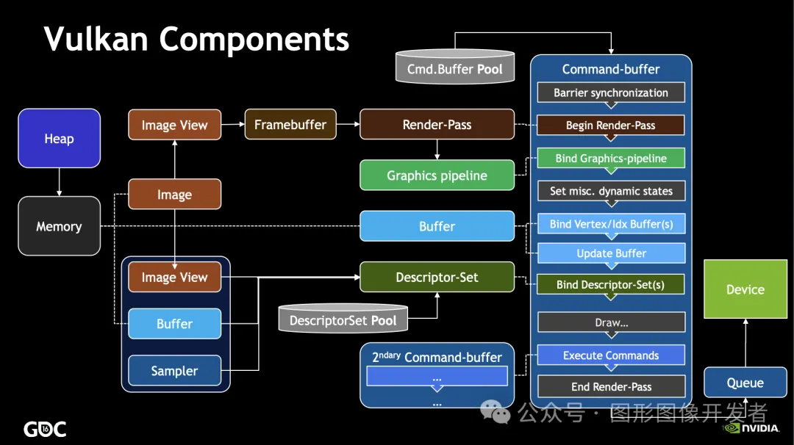
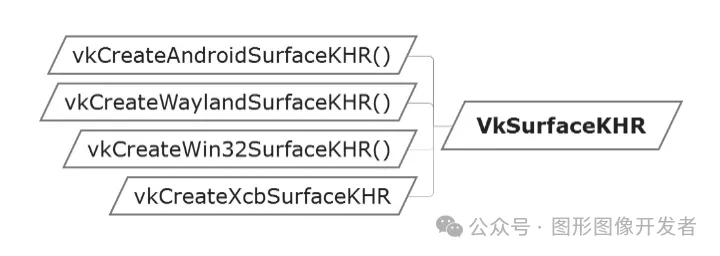

# Vulkan 窗口表面（Surface）




# 窗口表面

Vulkan 是一个平台无关的图形 API ，这意味着它不能直接与特定的窗口系统（如 Windows、Linux 或 macOS 的窗口系统）交互。


**为了解决这个问题，Vulkan 引入了窗口系统集成（Window System Integration，WSI）机制**，使得 Vulkan 应用程序可以与不同操作系统的窗口系统（如 Windows 的 Win32、Linux 的 X11 或 Wayland、Android 的 ANativeWindow 等）进行交互。


**这些机制允许 Vulkan 应用程序在窗口系统中创建和管理表面（Surface），并与图形硬件交换图像（Swapchain）**。


**VK_KHR_surface是 WSI 的核心扩展（instance 扩展），是 Vulkan 中用于表示渲染表面的对象，它是一个平台无关的抽象类型，用于封装与窗口系统相关的表面信息，**通过这个对象，Vulkan 可以将渲染结果输出到窗口上。

# 创建窗口表面

**VkSurfaceKHR对象是平台无关的，但是创建 VkSurfaceKHR对象时，不同的操作系统（窗口系统）需要使用不同的 API 。**



如 Android 系统使用 vkCreateAndroidSurfaceKHR， Windows 系统使用 vkCreateWin32SurfaceKHR 。


另外，在创建 Vulkan 实例的时候需要提前设置好相应的扩展：


```
1std::vector<const char*> instance_extensions;
2instance_extensions.push_back("VK_KHR_surface");
3instance_extensions.push_back("VK_KHR_android_surface");//Android
4//如果是 WIndow 平台使用 VK_KHR_win32_surface
```


本文主要涉及 Vulkan 移动开发在 Android 端的应用（其他平台流程相似），Android 系统创建窗口表面 VkSurfaceKHR流程：


1. 确定支持VK_KHR_android_surface扩展：检查物理设备是否支持该扩展。

2. 定义ANativeWindow：获取Android的ANativeWindow对象，这是Vulkan在Android上创建表面的必要条件。

3. 创建VkSurfaceKHR：使用vkCreateAndroidSurfaceKHR函数创建Vulkan表面。

   
在Android平台上创建Vulkan窗口表面的代码示例：


```
 1#include <vulkan/vulkan.h>
 2#include <vulkan/vulkan_android.h>
 3#include <android/native_window.h>
 4#include <android/native_window_jni.h>
 6// 需要在 Android 应用程序的某处获取到 ANativeWindow 对象，通常在 Activity 或 SurfaceView 中
 7extern ANativeWindow* window; // 这个 window 对象应该是从 Java 层传递过来的
 9// 检查物理设备是否支持 VK_KHR_android_surface 扩展
10bool isExtensionSupported(const char* extensionName, const std::vector<VkExtensionProperties>& availableExtensions) {
11    for (const auto& extension : availableExtensions) {
12        if (strcmp(extension.extensionName, extensionName) == 0) {
13            return true;
14        }
15    }
16    return false;
17}
19// 获取物理设备支持的扩展
20uint32_t extensionCount = 0;
21vkEnumerateDeviceExtensionProperties(physicalDevice, nullptr, &extensionCount, nullptr);
22std::vector<VkExtensionProperties> availableExtensions(extensionCount);
23vkEnumerateDeviceExtensionProperties(physicalDevice, nullptr, &extensionCount, availableExtensions.data());
25if (!isExtensionSupported(VK_KHR_ANDROID_SURFACE_EXTENSION_NAME, availableExtensions)) {
26    throw std::runtime_error("VK_KHR_android_surface extension not supported");
27}
29// 创建 VkAndroidSurfaceCreateInfoKHR 结构体并初始化
30VkAndroidSurfaceCreateInfoKHR createInfo = {};
31createInfo.sType = VK_STRUCTURE_TYPE_ANDROID_SURFACE_CREATE_INFO_KHR;
32createInfo.pNext = nullptr;
33createInfo.flags = 0;
34createInfo.window = window; // 指向 ANativeWindow 对象的指针
36VkSurfaceKHR surface;
37VkResult result = vkCreateAndroidSurfaceKHR(instance, &createInfo, nullptr, &surface);
39if (result != VK_SUCCESS) {
40    throw std::runtime_error("failed to create Vulkan surface");
41}
43// 现在 surface 对象可以在 Vulkan 渲染管线中使用
```


其中，在Android应用程序中添加ANativeWindow对象，你需要获取ANativeWindow对象，通常是在 Activity 或 SurfaceView 中通过 JNI 从 Java 层传递过来。例如：


```
1// 在 Java 代码中
2public native void setNativeWindow(Surface surface);
4// 在 C++ 代码中
5extern "C" JNIEXPORT void JNICALL Java_com_example_app_NativeLib_setNativeWindow(JNIEnv* env, jobject obj, jobject surface) {
6    ANativeWindow* window = ANativeWindow_fromSurface(env, surface);
7    // 将 window 存储在一个全局变量中，以便稍后使用
8}
```

-- END --