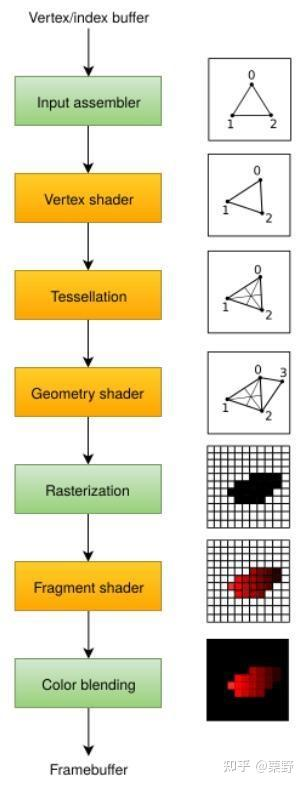
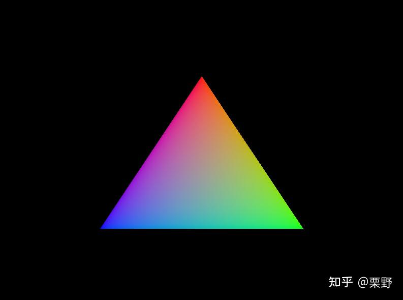

# Vulkan学习笔记(三）利用CMake在项目中编译配置Shader

接上文：

[栗野：Vulkan学习笔记(二）创建交换链之前的设备检测0 赞同 · 0 评论文章](https://zhuanlan.zhihu.com/p/538979880)

## 图形管线



在关注着色器前，首先需要明确图形管线的概念和着色器在图形管线中的位置。上图中黄色的部分区域是可编程阶段，包括熟悉的顶点着色器、[曲面细分](https://zhida.zhihu.com/search?content_id=208035948&content_type=Article&match_order=1&q=曲面细分&zhida_source=entity)、几何着色器、片元着色器等；而绿色部分则是固定功能阶段，可以通过设置参数来进行改变。

Vulkan的图形管线与DirectX和OpenGL中的管线本身没有区别。我们可以按照之前学习OpenGL的理解去看Vulkan是如何构建管线的。不过值得注意的是，对于Vulkan来说图形管线是不允许动态设置的。包括着色器代码，绑定帧缓冲，混合方式的参数等等都是在创建只是就完全定死的。想要改变状态就需要切换或是创建新的管线。尽管这样在编程时会很麻烦，但是这也是Vulkan性能优化的源头所在。

### 着色器模块

Vulkan在着色器上使用的是SPIR-V，它是一种字节码格式的代码，可以用于编写图形和计算着色器。同时它也作为一门中间码，可以在传统的shader language 如 glsl和[hlsl](https://zhida.zhihu.com/search?content_id=208035948&content_type=Article&match_order=1&q=hlsl&zhida_source=entity)中相互转换。因为传统的glsl和hlsl在编译时需要类C编译器把高级语言编译为字节码，但是因为GPU厂商编译器实现不同，还会有错误等原因，Vulkan采用的是SPIR-V这种字节码直接作为着色器代码。

但是我们仍然可以用glsl来作为编写着色器的语言。通过Vulkan SDK中的`glslangValidator`将我们的.glsl代码编译为.spv的二进制文件，从而让Vulkan验证我们代码是否符合标准。

下面给出基础的着色器代码：

```glsl
// 顶点着色器
#version 450
#extension GL_ARB_separate_shader_objects : enable

out gl_PerVertex{
    vec4 gl_Position;
};

layout(location = 0) out vec3 fragColor;

vec2 positions[3] = vec2[](vec2(0.0, -0.5), vec2(0.5, 0.5), vec2(-0.5, 0.5));

vec3 colors[3] = vec3[](
    vec3(1.0, 0.0, 0.0),
    vec3(0.0, 1.0, 0.0),
    vec3(0.0, 0.0, 1.0)
);

void main()
{
    gl_Position = vec4(positions[gl_VertexIndex], 0.0, 1.0);
    fragColor = colors[gl_VertexIndex];
}

// 片元着色器
#version 450
#extension GL_ARB_separate_shader_objects : enable

layout(location = 0) in vec3 fragColor;

layout(location = 0) out vec4 outColor;

void main() 
{
    outColor = vec4(fragColor, 1.0);
}
```

以上的着色器代码甚至不需要定点的输入，顶点位置和颜色都[硬编码](https://zhida.zhihu.com/search?content_id=208035948&content_type=Article&match_order=1&q=硬编码&zhida_source=entity)在了着色器中。在之后的流程中，我们会逐渐使用图形管线中顶点输入的顶点来作为顶点着色器的输入。代码标准上，与OpenGL中编写的GLSL代码也有所不同：

- 为了让着色器代码在Vulkan下可以工作，需要添加`#extension GL_ARB_separate_shader_objects : enable`扩展
- 着色器中无论是输入还是输出都需要用`(layout = 0)`来指定对应的某个[渲染目标](https://zhida.zhihu.com/search?content_id=208035948&content_type=Article&match_order=1&q=渲染目标&zhida_source=entity)或是顶点输入

### 编译着色器

使用`glslangValidator`将我们的.glsl代码编译为.spv的二进制文件，可以通过以下命令行完成：

```bash
glslValidator -I <includeDir> -V100 -o <outputDir>
```

其中`includeDir`代表编译时的包含目录，如glsl的头文件等；`outputDir`代表输出目录。这点与g++等编译器的命令行一致。`V100`代表创建Vulkan使用的spv二进制文件，其中100代表输入着色器代码的版本，编译中会以`#define Vulkan 100`这样的形式来区分编译的版本。

### 在项目中使用编译后的着色器代码

编译后的着色器就是.spv的[二进制文件](https://zhida.zhihu.com/search?content_id=208035948&content_type=Article&match_order=4&q=二进制文件&zhida_source=entity)。我们可以通过文件读入的方式将其以`std::vector<char>`的形式载入内存。这种方式对于项目中一些动态添加的着色器比较适合。

```cpp
static std::vector<char> readFile(const std::string& filename) {
    std::ifstream file(filename, std::ios::ate | std::ios::binary);
    if (!file.is_open()) {
        throw std::runtime_error("failed to open file!");
    }
    size_t fileSize = (size_t)file.tellg();
    std::vector<char> buffer(fileSize);
    file.seekg(0);
    file.read(buffer.data(), fileSize);
    file.close();
    return buffer;
}
```

除此之外还有一种将二进制文件硬编码为.h文件在项目构建阶段就直接嵌入工程的方式使用。这里我们借助CMake的`add_custom_command`的强大功能，在项目构建期就将编译后的代码以头文件的方式内嵌项目中。

首先在`CMakeLists.txt`中先收集项目中的着色器代码，在其中添加下面语句：

```cmake
set(SHADER_DIR ${CMAKE_CURRENT_SOURCE_DIR}/src/shaders)
file(GLOB SHADER_FILES CONFIGURE_DEPENDS "${SHADER_DIR}/*.vert" "${SHADER_DIR}/*.frag" "${SHADER_DIR}/*.comp" "${SHADER_DIR}/*.geom" "${SHADER_DIR}/*.tesc" "${SHADER_DIR}/*.tese" "${SHADER_DIR}/*.mesh" "${SHADER_DIR}/*.task" "${SHADER_DIR}/*.rgen" "${SHADER_DIR}/*.rchit" "${SHADER_DIR}/*.rmiss" "${SHADER_DIR}/*.rcall")

compile_shader("LearnVKPrecompile" "${SHADER_FILES}" "${SHADER_INCLUDE_DIR}")
```

我们定义了一个编译shader的cmake函数，并将收集的shader[源文件](https://zhida.zhihu.com/search?content_id=208035948&content_type=Article&match_order=1&q=源文件&zhida_source=entity)传给它：

```cmake
function(compile_shader TARGET_NAME SHADERS SHADER_INCLUDE_DIR)
    set(working_dir "${CMAKE_CURRENT_SOURCE_DIR}")
    set(GLSLANG_BIN $ENV{VK_SDK_PATH}/Bin/glslangValidator.exe) # 设置glslangValidator的位置
    foreach(SHADER ${SHADERS})  # 遍历每一个shader源文件
    get_filename_component(SHADER_NAME ${SHADER} NAME)  # 获取shader的名字
    string(REPLACE "." "_" HEADER_NAME ${SHADER_NAME})  # 在生成的.h文件中将文件名的'.'换成'_'
    string(TOUPPER ${HEADER_NAME} GLOBAL_SHADER_VAR)    # 将存储二进制内容的全局vector对象名改为全部大写
    set(SPV_FILE "${CMAKE_CURRENT_SOURCE_DIR}/generated/spv/${SHADER_NAME}.spv")    # 生成的.spv文件
    set(CPP_FILE "${CMAKE_CURRENT_SOURCE_DIR}/generated/cpp/${HEADER_NAME}.h")      # 生成的.h文件
    add_custom_command(
        OUTPUT ${SPV_FILE}
        COMMAND ${GLSLANG_BIN} -I${SHADER_INCLUDE_DIR} -V100 -o ${SPV_FILE} ${SHADER}
        DEPENDS ${SHADER}
        WORKING_DIRECTORY "${working_dir}")             # 添加编译命令，在项目生成时执行
    list(APPEND ALL_GENERATED_SPV_FILES ${SPV_FILE})    
    add_custom_command(
            OUTPUT ${CPP_FILE}
            COMMAND ${CMAKE_COMMAND} -DPATH=${SPV_FILE} -DHEADER="${CPP_FILE}" 
                -DGLOBAL="${GLOBAL_SHADER_VAR}" -P "${CMAKE_CURRENT_SOURCE_DIR}/cmake/GenerateShaderCPPFile.cmake"
            DEPENDS ${SPV_FILE}
            WORKING_DIRECTORY "${working_dir}")         # 添加执行将spv转换为h文件的cmake函数的命令
    list(APPEND ALL_GENERATED_CPP_FILES ${CPP_FILE})
    endforeach()
    add_custom_target(${TARGET_NAME}    # 将上述过程添加到一个生成目标中
        DEPENDS ${ALL_GENERATED_SPV_FILES} ${ALL_GENERATED_CPP_FILES} SOURCES ${SHADERS})
endfunction()
# GenerateShaderCPPFile.cmake
function(embed_resource resource_file_name source_file_name variable_name)
    if(EXISTS "${source_file_name}")
        if("${source_file_name}" IS_NEWER_THAN "${resource_file_name}")
            return()
        endif()
    endif()
    if(EXISTS "${resource_file_name}")
        file(READ "${resource_file_name}" hex_content HEX)
        string(REPEAT "[0-9a-f]" 32 pattern)
        string(REGEX REPLACE "(${pattern})" "\\1\n" content "${hex_content}")
        string(REGEX REPLACE "([0-9a-f][0-9a-f])" "0x\\1, " content "${content}")
        string(REGEX REPLACE ", $" "" content "${content}")
        set(array_definition "static const std::vector<unsigned char> ${variable_name} =\n{\n${content}\n};")
        get_filename_component(file_name ${source_file_name} NAME)
        set(source "/**\n * @file ${file_name}\n * @brief Auto generated file.\n */\n#include <vector>\n${array_definition}\n")
        file(WRITE "${source_file_name}" "${source}")
    else()
        message("ERROR: ${resource_file_name} doesn't exist")
        return()
    endif()
endfunction()
if(EXISTS "${PATH}")
    embed_resource("${PATH}" "${HEADER}" "${GLOBAL}")
endif()
```

其中`GenerateShaderCPPFile.cmake`的作用是将生成的.spv文件转为.h代码，并生成一个全局的`std::vector<unsigned char>`对象，让我们在项目中可以直接引用头文件访问，而不需要加载文件。这种实现是参考了GAMES104课程项目Piccolo的着色器生成方式，上述过程用到的代码都可以在其仓库中找到。

通过这种方式就可以在CMake配置工程之后生成一个`LearnVKPrecompile`的自定义工程，生成工程就完成了编译和嵌入式代码的生成。为了让生成的代码可以在项目中使用，还需要添加包含目录：

```cmake
target_include_directories(LearnVK PRIVATE ${CMAKE_CURRENT_SOURCE_DIR}/generated/cpp)
```

做完上述工作，就可以在代码中通过头文件直接引用编写的着色器代码了。

```cpp
#include <vertex_vert.h>    // 着色器的名字叫vertex.vert
#include <fragment_frag.h>
```

### 在管线中使用着色器

获取了字节码之后想要在Vulkan管线中使用就需要包装成着色器模块。

```cpp
VkShaderModule LearnVKApp::createShaderModule(const std::vector<unsigned char>& code) {
    VkShaderModuleCreateInfo createInfo = {};
    createInfo.sType = VK_STRUCTURE_TYPE_SHADER_MODULE_CREATE_INFO;
    createInfo.codeSize = code.size();
    createInfo.pCode = reinterpret_cast<const uint32_t*>(code.data());
    VkShaderModule shaderModule;
    VkResult res = vkCreateShaderModule(m_device, &createInfo, nullptr, &shaderModule);
    if (res != VK_SUCCESS) {
        throw std::runtime_error("failed to create shader module!");
    }
    return shaderModule;
}

// createPipeline
VkShaderModule vertexShaderModule = createShaderModule(VERTEX_VERT);
VkShaderModule fragmentShaderModule = createShaderModule(FRAGMENT_FRAG);
```

着色器模块也只是封装了着色器代码，我们需要指定这个模块在管线中的什么阶段。通过`VkPipelineShaderStageCreateInfo`创建。

```cpp
VkPipelineShaderStageCreateInfo vertStageCreateInfo = {};
vertStageCreateInfo.sType = VK_STRUCTURE_TYPE_PIPELINE_SHADER_STAGE_CREATE_INFO;
vertStageCreateInfo.pName = "main";
vertStageCreateInfo.module = vertexShaderModule;
vertStageCreateInfo.stage = VK_SHADER_STAGE_VERTEX_BIT;

VkPipelineShaderStageCreateInfo fragStageCreateInfo = {};
// ...
VkPipelineShaderStageCreateInfo shaderStages[2] = {
    vertStageCreateInfo, fragStageCreateInfo
};
```

至此，着色器在项目中的集成和在图形管线中的设置就已经完成。接下来就是设置其他繁杂的图形管线的固定功能和渲染流程了，这部分内容我将放在下一篇文章中。最后给出管线设置全部实现后，上文给出的着色器代码最终的效果：



[栗野：Vulkan学习笔记(四）厘清Pipeline和RenderPass的关系23 赞同 · 0 评论文章](https://zhuanlan.zhihu.com/p/539718382)


