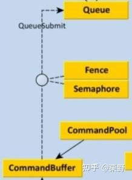
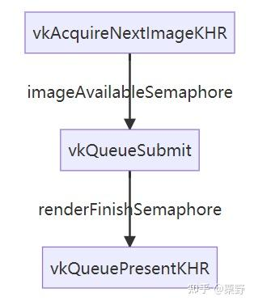

# Vulkan学习笔记(五）指令系统与渲染同步

接上文：

[栗野：Vulkan学习笔记(四）厘清Pipeline和RenderPass的关系23 赞同 · 0 评论文章](https://zhuanlan.zhihu.com/p/539718382)

## **指令系统概述**

Vulkan几乎所有的GPU执行的功能几乎都由指令的形式驱动完成。代表的函数形式就是`vkCmd_`开头的函数。在这类函数中第一个参数会指定一个`VkCommandBuffer`，它会记录每一次绘制的指令，并且在`vkQueueSubmit`中提交到某一个队列族对应的队列中，交由GPU异步执行。

因此当我们在编写程序使用`vkCmd_`开头的指令时，它并不像OpenGL那样直接执行，而是被[指令缓冲](https://zhida.zhihu.com/search?content_id=208652660&content_type=Article&match_order=1&q=指令缓冲&zhida_source=entity)录制了下来，在真正提交到队列时被某个[GPU线程](https://zhida.zhihu.com/search?content_id=208652660&content_type=Article&match_order=1&q=GPU线程&zhida_source=entity)异步执行。正因为这个特性，Vulkan需要我们手动对GPU端的多线程的同步问题进行管理。

### **指令缓冲与指令池**



在创建一个指令缓冲之前，需要创建指令池来管理缓冲的内存和缓冲对象的分配。因为**每一个指令池中的产生的指令只能被提交到一个队列族的队列**中去，因此需要在初始化时指定图形队列族的索引。

```cpp
// createCommandPool
QueueFamiliyIndices indices = findDeviceQueueFamilies(m_physicalDevice);
VkCommandPoolCreateInfo createInfo = {};
createInfo.sType = VK_STRUCTURE_TYPE_COMMAND_POOL_CREATE_INFO;
createInfo.queueFamilyIndex = indices.graphicsFamily;
// flags标志位意味指令缓冲对象之间相互独立，不会被一起重置。这在之后多帧并行渲染时会用到。
createInfo.flags = VK_COMMAND_POOL_CREATE_RESET_COMMAND_BUFFER_BIT;
VkResult res = vkCreateCommandPool(m_device, &createInfo, nullptr, &m_commandPool);
if (res != VK_SUCCESS) {
    throw std::runtime_error("failed to create command pool!");
}
```

有了指令池就可以为一个指令缓冲分配空间了。此处在`commandBuffer`到底需要分配多少个，是否每个帧缓冲都需要对应一个指令缓冲的问题上，无论是中文版还是英文版的教程都比较模糊。英文版源码是只分配了**一个指令缓冲供所有帧缓冲使用**；而中文版是根据`vkAcquireNextImageKHR`获取到了[交换链](https://zhida.zhihu.com/search?content_id=208652660&content_type=Article&match_order=1&q=交换链&zhida_source=entity)中渲染的下一张图片的索引，**每一个索引对应一个指令缓冲**。

两种写法应该都是可以正常运作，只不过似乎没有必要每一个帧缓冲对应一个command buffer。实际上真正需要多个buffer的原因在于多帧预渲染机制需要单独的指令缓冲，否则就会存在同步的问题。因此我这里给出的创建指令池和指令缓冲的代码均是在多帧预渲染机制下的创建方式。关于多帧预渲染机制很快就会介绍到。

```cpp
m_commandBuffers.resize(MAX_FRAMES_IN_FLIGHT);  // 多帧预渲染的帧数
VkCommandBufferAllocateInfo allocInfo = {};
allocInfo.sType = VK_STRUCTURE_TYPE_COMMAND_BUFFER_ALLOCATE_INFO;
// 设为顶级缓存，意味着可以直接被提交，但是不能被其他缓存调用
allocInfo.level = VK_COMMAND_BUFFER_LEVEL_PRIMARY;
allocInfo.commandPool = m_commandPool;
allocInfo.commandBufferCount = static_cast<uint32_t>(m_commandBuffers.size());
VkResult res = vkAllocateCommandBuffers(m_device, &allocInfo, m_commandBuffers.data());
if (res != VK_SUCCESS) {
    throw std::runtime_error("failed to allocate command buffer!");
}
```

`VK_COMMAND_BUFFER_LEVEL_PRIMARY`代表顶级缓存，它可以直接被提交，但是不能被其他缓存调用。还有一种标记`VK_COMMAND_BUFFER_LEVEL_SECONDARY`代表[二级缓存](https://zhida.zhihu.com/search?content_id=208652660&content_type=Article&match_order=1&q=二级缓存&zhida_source=entity)，它不能直接提交，但是可以被其他的缓存调用。这样的特性就让我们可以在顶级队列中使用与一些预录的二级指令系列，提升开发效率。

### **记录指令到指令缓冲**


Vulkan Spec上给出的command buffer 生命周期示意图

在为command buffer分配好内存之后，command的buffer在进入了initial的状态。如Vulkan spec中给出的这张指令声明周期的示意图。我们需要通过`vkBeginCommandBuffer`开始将指令线型地按照顺序“录制”到缓存之中，此时command buffer处于recording态；当使用`vkEndCommandBuffer`时转换为可执行Executable态，此时一个command buffer就录制结束了。

然后通过`vkSubmitQueue`通过某个队列组上传到GPU执行，此时正在的command buffer就不再接受任何的改变，进入Pending态。当GPU结束执行这一批指令，如果beginInfo中flags记录的是`VK_COMMAND_BUFFER_USAGE_ONE_TIME_SUBMIT_BIT`，则只执行一次就进入invalid态；如果是`VK_COMMAND_BUFFER_USAGE_SIMULTANEOUS_USE_BIT`则重新回到Executable态，准备下一次执行。

当使用`vkResetCommandBuffer`时在Executable和Invalid两种状态的command buffer都会被清空指令，并回到Initial状态等待再次录制指令序列。

### **渲染同步**

### **GPU任务前驱序列的同步**

在系列第一篇文章中我们就提到，Vulkan中渲染的主循环：

1. 首先使用`vkAcquireNextImageKHR`函数从交换链获取一张图像。**（获取）**
2. 接着使用`vkQueueSubmit`函数提交图像对应的指令缓冲。**（提交）**
3. 最后，使用`vkQueuePresentKHR`函数将图像返回给交换链，显示图像到屏幕**（返回）**

三个步骤都是异步提交到GPU中执行，因此需要使用信号量来同步其执行的顺序。信号量的一种经典使用场景就是用于实现前驱关系，上文中提到的前驱关系如图：



为保证两种前驱关系，我们分别设置了`imageAvailableSemaphore`代表等待获取到交换链图片；和`renderFinishSemaphore`代表等待渲染完成再呈现到Surface上。

在Vulkan这些需要同步的函数的参数中需要传入信号量来同步，在代码中实现的效果如下：

```cpp
// 获取
VkSemaphore waitSemaphores[] = {m_imageAvailableSemaphore[m_currentFrameIndex]}; // 为等待从交换链获取图片的信号量
VkSemaphore signalSemaphores[] = {m_renderFinishSemaphore[m_currentFrameIndex]};
vkAcquireNextImageKHR(m_device, m_swapChain, MAX_TIMEOUT, waitSemaphores[0], VK_NULL_HANDLE,&imageIndex); //开始获取的同时 P(wait);当获取之后就会S(wait);

// 提交
VkSubmitInfo submitInfo = {};
submitInfo.sType = VK_STRUCTURE_TYPE_SUBMIT_INFO;
VkPipelineStageFlags waitStageFlags[] = {VK_PIPELINE_STAGE_COLOR_ATTACHMENT_OUTPUT_BIT};
submitInfo.waitSemaphoreCount = 1;
submitInfo.pWaitSemaphores = waitSemaphores; // P(wait); 在获取到图片S(wait)就submit指令
submitInfo.pWaitDstStageMask = waitStageFlags;
submitInfo.signalSemaphoreCount = 1;
submitInfo.pSignalSemaphores = signalSemaphores; // S(signal); 代表完成渲染，可以呈现
submitInfo.commandBufferCount = 1;
submitInfo.pCommandBuffers = &m_commandBuffers[m_currentFrameIndex];
VkQueue& queue = m_queueMap["graphicsFamily"];
res = vkQueueSubmit(queue, 1, &submitInfo, m_fences[m_currentFrameIndex]); // 提交渲染指令的时候一并提交这一帧的栅栏

// 呈现
VkPresentInfoKHR presentInfo = {};
presentInfo.sType = VK_STRUCTURE_TYPE_PRESENT_INFO_KHR;
presentInfo.waitSemaphoreCount = 1;
presentInfo.pWaitSemaphores =signalSemaphores; // P(signal); 申请将渲染的内容呈现
VkSwapchainKHR swapChains[] = {m_swapChain};
presentInfo.swapchainCount = 1;
presentInfo.pSwapchains = swapChains;
presentInfo.pImageIndices = &imageIndex;
queue = m_queueMap["presentFamily"];
res = vkQueuePresentKHR(queue, &presentInfo);
```

每一步在执行前都需要获取前一步完成的信号量，否则任务进入[阻塞状态](https://zhida.zhihu.com/search?content_id=208652660&content_type=Article&match_order=1&q=阻塞状态&zhida_source=entity)，等待上一步的任务完成后释放信号量。

可以注意到`vkQueueSubmit`不仅在submitInfo中分别申请和释放了两种信号量，同时在函数参数中也提交了一个栅栏`m_fences[m_currentFrameIndex]`用于同步；并且两种信号量也是以数组形式存储的。这就需要引入第二个同步：GPU与CPU之间的同步。

### **GPU与CPU之间的同步**

在我们程序的主循环中，每一次循环都会不停歇地将[指令序列](https://zhida.zhihu.com/search?content_id=208652660&content_type=Article&match_order=2&q=指令序列&zhida_source=entity)提交到GPU执行。然而提交的速度与GPU执行的速度的不匹配，会导致提交的指令会逐渐堆积，导致程序爆栈；另外当上一帧还未执行完毕就进行下一帧指令的执行可能会导致使用了相同的信号量导致时空上的死锁（本来由第二步获取的资源被未来的第一步预支）。因此需要等待GPU完成一次提交的任务之后，再提交下一帧的[渲染指令](https://zhida.zhihu.com/search?content_id=208652660&content_type=Article&match_order=2&q=渲染指令&zhida_source=entity)。如下：

```text
vkQueueWaitIdle(presentQueue);  // 等待presentQueue执行完毕，相当于一帧的渲染结束
```

但是这样相当于CPU会浪费大量时间等待GPU计算，没有运用到Vulkan多线程的优势。为了让CPU提交的一帧指令的速率可控，引入了**多帧预渲染**的概念。

在多帧预渲染中，我们规定最多有`MAX_FRAMES_IN_FLIGHT`的帧被CPU提交并且没有进入生命周期的终结，意味着同时存在着这么多帧的command buffer和信号量。为了同步一帧内的command buffer和信号量资源，CPU与GPU之间可以通过设置栅栏`VkFence`来阻止同一帧的资源在生命周期未终结时被重新使用。

```cpp
vkWaitForFences(m_device, 1, &m_fences[m_currentFrameIndex], VK_TRUE, MAX_TIMEOUT); // 等待某个预渲染的帧被GPU处理完毕，通过栅栏，实现不会提交过多的帧
vkResetFences(m_device, 1, &m_fences[m_currentFrameIndex]); // 释放fence
// ...
vkQueueSubmit(queue, 1, &submitInfo,m_fences[m_currentFrameIndex]); // 提交渲染指令的时候一并提交这一帧的栅栏
```

注意这里`vkWaitForFences`等待的不是渲染中上一帧的fence，而是在当前帧-`MAX_FRAMES_IN_FLIGHT`的fence被`vkQueueSubmit`释放掉，当重用这一帧的conmmand buffer和信号量时就不会发生死锁问题。这样我们就实现了同时渲染多帧。当同时渲染的帧数为`MAX_FRAMES_IN_FLIGHT = 1`时，就退化成为了`vkQueueWaitIdle`一样的效果。在这里我们可以指定`MAX_FRAMES_IN_FLIGHT = 3`比较合适。最后不要忘记改变当前帧的计数`m_currentFrameIndex = (m_currentFrameIndex + 1) % MAX_FRAMES_IN_FLIGHT;`

为了使用信号量和栅栏，我们在一个函数中初始化它们：

```cpp
VkSemaphoreCreateInfo createInfo = {};
createInfo.sType = VK_STRUCTURE_TYPE_SEMAPHORE_CREATE_INFO;
m_imageAvailableSemaphore.resize(MAX_FRAMES_IN_FLIGHT);
m_renderFinishSemaphore.resize(MAX_FRAMES_IN_FLIGHT);
VkFenceCreateInfo fenceCreateInfo = {};
fenceCreateInfo.sType = VK_STRUCTURE_TYPE_FENCE_CREATE_INFO;
fenceCreateInfo.flags = VK_FENCE_CREATE_SIGNALED_BIT;   // 创建后第一次不会被waitFence阻塞
m_fences.resize(MAX_FRAMES_IN_FLIGHT);
for (int i = 0; i < MAX_FRAMES_IN_FLIGHT; i++) {
    VkResult res1 = vkCreateSemaphore(m_device, &createInfo, nullptr, &m_imageAvailableSemaphore[i]);
    VkResult res2 = vkCreateSemaphore(m_device, &createInfo, nullptr, &m_renderFinishSemaphore[i]);
    VkResult res3 = vkCreateFence(m_device, &fenceCreateInfo, nullptr,  &m_fences[i]);
    if (res1 != VK_SUCCESS || res2 != VK_SUCCESS || res3 != VK_SUCCESS) {
        throw std::runtime_error("failed to create semaphores!");
    }
}
```

实际上多帧预渲染不仅让更多的CPU资源能够得到利用，并且因为本身预渲染的[数据模型](https://zhida.zhihu.com/search?content_id=208652660&content_type=Article&match_order=1&q=数据模型&zhida_source=entity)就是个队列，利用其先进先出和缓冲的特性，可以让输出有一层缓冲，使得当每一帧处理时间不同时输出的帧率能够比较平滑。

最后，当我们需要关闭程序时，需要等待所有指令执行完毕。因此使用`vkDeviceWaitIdle(m_device)`等待设备停止执行所有指令。

