# 软光栅化渲染器学习笔记（一）：简单几何图元

参考TinyRenderer项目，GAMES101和众多大佬的文章梳理出的软[光栅化](https://zhida.zhihu.com/search?content_id=212713894&content_type=Article&match_order=1&q=光栅化&zhida_source=entity)渲染器开发要点，仅作学习与记录。

## 接入SDL2实现创建窗口和绘制像素：

使用SDL2可以简单快捷地搭建窗口框架，我们只需要一个绘制像素点的基础功能即可，其它SDL2提供的绘制功能均不使用：

```cpp
const int width = 600;
const int height = 400;

void DrawPixel(SDL_Renderer* renderer, int x, int y, Vector3f color) {
	SDL_SetRenderDrawColor(renderer, (Uint8)(color.x * 255), (Uint8)(color.y * 255), (Uint8)(color.z * 255), SDL_ALPHA_OPAQUE);
	SDL_Point point;
	point.x = x;
	point.y = y;
	SDL_RenderDrawPoints(renderer, &point, 1);
}
 
int main(int argc, char* argv[]) {
	SDL_Window* window;
	SDL_Renderer* renderer;

	window = SDL_CreateWindow("Soft Renderer", SDL_WINDOWPOS_UNDEFINED, SDL_WINDOWPOS_UNDEFINED, width, height, SDL_WINDOW_SHOWN);
	renderer = SDL_CreateRenderer(window, 0, 0);

        bool quit = false;
	while (!quit) {
		SDL_Event sdlEvent;
		while (SDL_PollEvent(&sdlEvent)) {
			if (sdlEvent.type == SDL_QUIT) {
				quit = true;
			}
		}
                SDL_SetRenderDrawColor(renderer, 0, 0, 0, SDL_ALPHA_OPAQUE);
	        SDL_RenderClear(renderer);

                //Draw

	        SDL_RenderPresent(renderer);
 
	}

	return 0;
}
```

## **Bresenham画线算法**

优点：可以减轻绘制的工作量，可以减少锯齿的出现

原理：以X坐标为基准，不断递增，同时依据直线的斜率计算Y坐标的值，Y坐标的值有两种情况，一种情况sub>0，则下一个绘制的点在原来点的斜侧，另一种情况sub<0，则下一个绘制的点就在原来点的旁边。

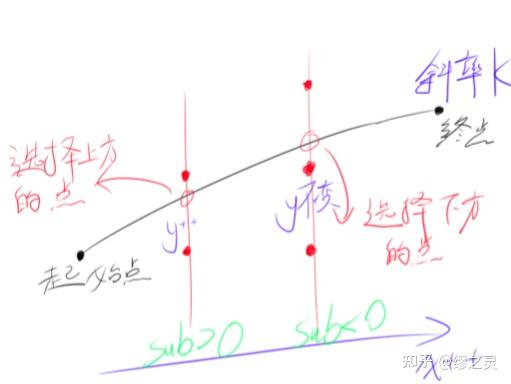

Bresenham画线算法草稿

代码：

```cpp
void DrawLine(SDL_Renderer* renderer, int x0, int y0, int x1, int y1, Vector3f color) {
	int dx = x1 - x0;
	int dy = y1 - y0;
	float k = (float)dy / (float)dx;
	
	int x = x0;
	int y = y0;

        int d = 1;

	float sub = k - 0.5f;

	while (x < x1) {
		x++;
		if (sub > 0.0f) {
			sub += k - 1.0f;
			y += d;
		}
		else {
			sub += k;
		}
		DrawPixel(renderer, x, y, color);
	}
}
```

sub的值用来推定下一个绘制的点的位置，在每次循环时将sub与0作比较，若>0则将sub减去1（因为此时Y坐标已增加1）。

但是以上代码仅适用于0<k<1，x1>x0的情况，为了使其适应其它的情况，还需要将代码进行一些扩充。

当k为负值时，需要将递增的d设为负值，来确保直线会向反方向走，修改原来的代码如下：

```cpp
float k = (float)dy / (float)dx;
		
int d = 1;
if (k < 0)
	d = -1;
k = fabsf(k);

float sub = k - 0.5f;
```

必须确保作为基准的坐标方向是正方向，所以当k<1，dx<0或k>1，dy<0时，要将两个端点的坐标对调一下，修改原来的代码如下：

```cpp
bool steep = false;

if (abs(x1 - x0) < abs(y1 - y0))
	steep = true;

if (((x0 > x1) && (!steep)) || ((y0 > y1) && (steep))) {
	int temp = x1;
	x1 = x0;
	x0 = temp;
	temp = y1;
	y1 = y0;
	y0 = temp;
}
```

当k>1时，以X坐标为基准无法绘制出完整的直线，所以要以Y坐标为基准，修改原来的代码如下：

```cpp
if (!steep) {
	float k = (float)dy / (float)dx;
		
	int d = 1;
	if (k < 0)
		d = -1;
	k = fabsf(k);

	float sub = k - 0.5f;

	while (x < x1) {
		x++;
		if (sub > 0.0f) {
			sub += k - 1.0f;
			y += d;
		}
		else {
			sub += k;
		}
		DrawPixel(renderer, x, y, color);
	}
}
else {
	float k = (float)dx / (float)dy;

	int d = 1;
	if (k < 0)
		d = -1;
	k = fabsf(k);

	float sub = k - 0.5f;

	while (y < y1) {
		y++;
		if (sub > 0.0f) {
			sub += k - 1.0f;
			x += d;
		}
		else {
			sub += k;
		}
		DrawPixel(renderer, x, y, color);
	}
}
```

最终结果：

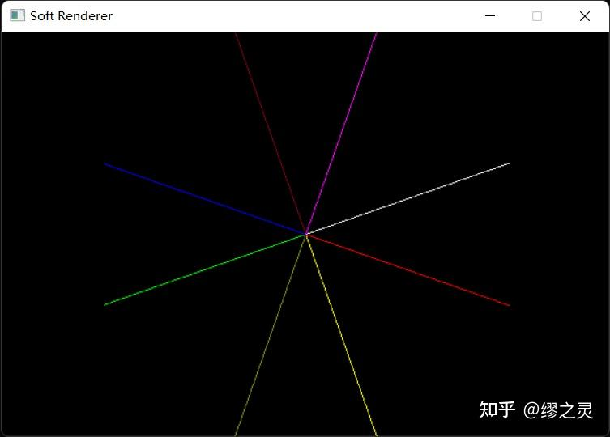

优化方案：通过适当地修改sub的算法可以避免浮点数运算和除法运算，思路是利用[相似三角形](https://zhida.zhihu.com/search?content_id=212713894&content_type=Article&match_order=1&q=相似三角形&zhida_source=entity)的原理，在sub运算时整个乘上2dx（或2dy），修改后的代码如下：

```cpp
if (!steep) {
	int d = 1;
	if (dy < 0) {
		d = -1;
		dy = -dy;
	}

	int sub = 2 * dy - dx;

	while (x < x1) {
		x++;
		if (sub > 0) {
			sub += 2 * dy - 2 * dx;
			y += d;
		}
		else {
			sub += 2 * dy;
		}
		DrawPixel(renderer, x, y, color);
	}
}
else {
	int d = 1;
	if (dx < 0) {
		d = -1;
		dx = -dx;
	}

	int sub = 2 * dx - dy;

	while (y < y1) {
		y++;
		if (sub > 0) {
			sub += 2 * dx - 2 * dy;
			x += d;
		}
		else {
			sub +=  2 * dx;
		}
		DrawPixel(renderer, x, y, color);
	}
}
```

## 三角形着色

### 扫描线算法

原理：所谓扫描线就是将三角形的着色看作从下到上画多条线结合在一起，即多次以p0，p1为端点作直线。将三角形的三个顶点按照从高到低进行排序（t2，t1，t0），得到三角形的中间点t1，并以该点的Y坐标分割整个三角形为两半。p0的坐标依靠线段t0/t2的斜率计算，p1的坐标依靠线段t0/t1或线段t1/t2的斜率计算。

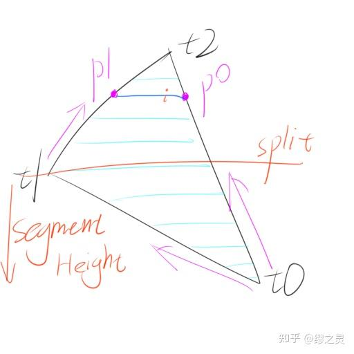

扫描线算法草稿

代码：

```cpp
void DrawTriangle(SDL_Renderer* renderer, int x0, int y0, int x1, int y1, int x2, int y2, Vector3f color) {
	if (y0 == y1 && y1 == y2)
		return;

        int temp;
	if (y0 > y1)temp = y0, y0 = y1, y1 = temp, temp = x0, x0 = x1, x1 = temp;
	if (y0 > y2)temp = y0, y0 = y2, y2 = temp, temp = x0, x0 = x2, x2 = temp;
	if (y1 > y2)temp = y1, y1 = y2, y2 = temp, temp = x1, x1 = x2, x2 = temp;
	
	int height = y2 - y0;

	for (int i = 0; i < height; i++) {
		bool split = i > y1 - y0 || y1 == y0;
		int segmentHeight = split ? y2 - y1 : y1 - y0;

		float alpha = (float)i / height;
		float beta = (float)(i - (split ? y1 - y0 : 0)) / segmentHeight;

		int p0 = x0 + (x2 - x0) * alpha;
		int p1 = split ? x1 + (x2 - x1) * beta : x0 + (x1 - x0) * beta;

		if (p1 < p0)temp = p0, p0 = p1, p1 = temp;

		for (int p = p0; p <= p1; p++) {
			DrawPixel(renderer, p, y0 + i, color);
		}
	}
}
```

### 重心坐标算法

优点：方便进行顶点属性插值

原理：首先计算出三角形最小[包围盒](https://zhida.zhihu.com/search?content_id=212713894&content_type=Article&match_order=1&q=包围盒&zhida_source=entity)，然后遍历包围盒内的每一个像素坐标点，利用重心坐标判断该点是否在三角形内，如果在则进行绘制，反之则不进行绘制。

计算三角形中一点的重心坐标并判断该点是否处于三角形中的方法如下所示：

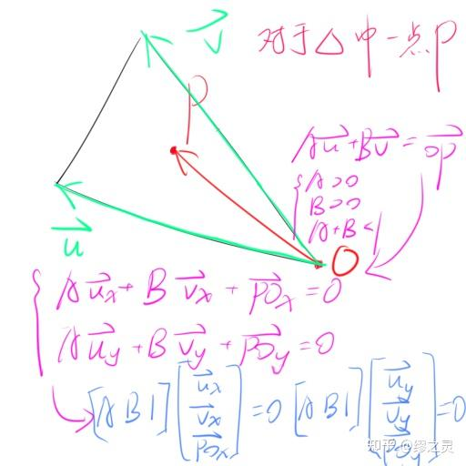

计算重心坐标草稿

由最后的结果可以得知向量（A, B, 1）分别和向量（**u**x, **v**x, **PO**x），（**u**y, **v**y, **PO**y）相垂直，基于此可以得到向量（**u**x, **v**x, **PO**x）和（**u**y, **v**y, **PO**y）的[叉积](https://zhida.zhihu.com/search?content_id=212713894&content_type=Article&match_order=1&q=叉积&zhida_source=entity)即为k(A, B, 1），就可以求出A，B的值，若该点在三角形内，则得到该点的重心坐标为（1 - A - B, A, B）。

代码：

```cpp
 Vector3f CalcBarycentric(float x0, float y0, float x1, float y1, float x2, float y2, float px, float py) {
	float Ux = x1 - x0;
	float Uy = y1 - y0;
	float Vx = x2 - x0;
	float Vy = y2 - y0;
	float POx = x0 - px;
	float POy = y0 - py;

	Vector3f kAB1 = Cross(Vector3f(Ux, Vx, POx), Vector3f(Uy, Vy, POy));
	
	if (abs(kAB1.z) < 1.0f)                           
		return Vector3f(-1.0f, 1.0f, 1.0f);

	float A = kAB1.x / kAB1.z;
	float B = kAB1.y / kAB1.z;
	return Vector3f(1.0f - A - B, A, B);
}
```

当三角形的两边重合时，会导致kAB1.z的绝对值小于1，此时该三角形不合法，直接抛弃即可。

计算三角形的[轴对齐包围盒](https://zhida.zhihu.com/search?content_id=212713894&content_type=Article&match_order=1&q=轴对齐包围盒&zhida_source=entity)（AABB）并且完成遍历选出在三角形内的像素，代码如下：

```cpp
void DrawTriangleBarycentric(SDL_Renderer* renderer, int x0, int y0, int x1, int y1, int x2, int y2, Vector3f color) {  
        int minX = x0, minY = y0, maxX = x0, maxY = y0;
	
	if (x1 < minX)minX = x1;
	if (y1 < minY)minY = y1;
	if (x1 > maxX)maxX = x1;
	if (y1 > maxY)maxY = y1;

	if (x2 < minX)minX = x2;
	if (y2 < minY)minY = y2;
	if (x2 > maxX)maxX = x2;
	if (y2 > maxY)maxY = y2;

	for (int y = minY; y < maxY; y++) {
		for (int x = minX; x < maxX; x++) {
			Vector3f mass = CalcBarycentric(x0, y0, x1, y1, x2, y2, x, y);
			if (mass.x >= -1e-5f && mass.y >= -1e-5f && mass.z >= -1e-5f) {
				DrawPixel(renderer, x, y, color);
			}
		}
	}
}
```

最终结果：

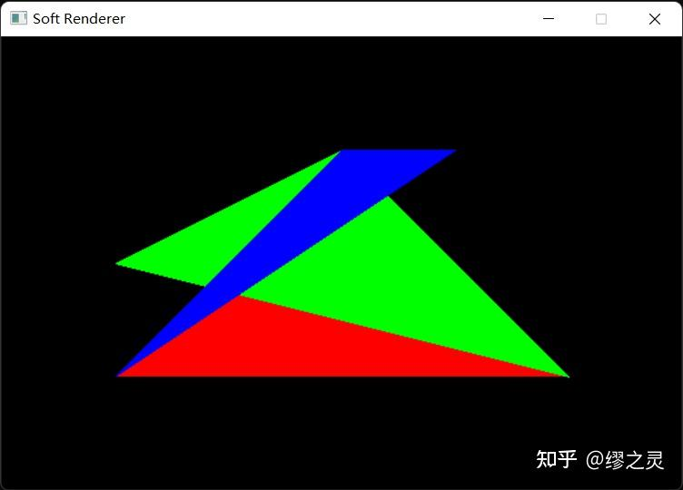

## 坐标变换

在以上的绘制中，我们均直接使用屏幕空间坐标，但是在绘制整个3D场景时我们就不可以这样做，必须将3D空间中的坐标经过多步坐标变换最终成为屏幕空间坐标，这个过程由MVP（Model，View，Projection）[矩阵变换](https://zhida.zhihu.com/search?content_id=212713894&content_type=Article&match_order=1&q=矩阵变换&zhida_source=entity)和屏幕空间变换组成。（以下所使用矩阵皆为行主序，采用右乘结合）

### SRT矩阵

所有的矩阵变换都可以看作是由最基本的三个操作所构成的，即缩放（Scale，S），旋转（Rotate，R），平移（Translate，T），SRT矩阵的组合通常被称作[世界矩阵](https://zhida.zhihu.com/search?content_id=212713894&content_type=Article&match_order=1&q=世界矩阵&zhida_source=entity)或模型矩阵（MVP中的M），即将坐标从物体空间变换至世界空间。缩放变换和[旋转变换](https://zhida.zhihu.com/search?content_id=212713894&content_type=Article&match_order=1&q=旋转变换&zhida_source=entity)皆为线性变换（可用于向量和点），而平移变换是[仿射变换](https://zhida.zhihu.com/search?content_id=212713894&content_type=Article&match_order=1&q=仿射变换&zhida_source=entity)（仅用于点），需要用到除xyz外的第四个分量w，在[仿射空间](https://zhida.zhihu.com/search?content_id=212713894&content_type=Article&match_order=1&q=仿射空间&zhida_source=entity)中，向量的w分量被认为是0，点的w分量被认为是1。

缩放矩阵的基本形式： [X000Y000Z]

绕x轴旋转 β 度角的矩阵的基本形式： [1000cosβsinβ0−sinβcosβ]

绕y轴旋转 β 度角的矩阵的基本形式： [cosβ0−sinβ010sinβ0cosβ]

绕z轴旋转 β 度角的矩阵的基本形式： [cosβsinβ0−sinβcosβ0001]

绕任意固定轴n旋转 β 度角的矩阵的基本形式（c=cos β ，s=sin β ，xyz为n的三个分量）：[c+(1−c)x2(1−c)xy+sz(1−c)xz−sy(1−c)xy−szc+(1−c)y2(1−c)yz+sx(1−c)xz+sy(1−c)yz−sxc+(1−c)z2]

平移矩阵的基本形式： [100001000010XYZ1]

### 坐标系变换矩阵及其逆矩阵

同一个向量或坐标在不同的坐标系中拥有不同的坐标，我们将不同坐标系间坐标的转换称为坐标变换（Change of coordinate transformation），而这个过程可以用矩阵的形式进行高效紧凑的表达。

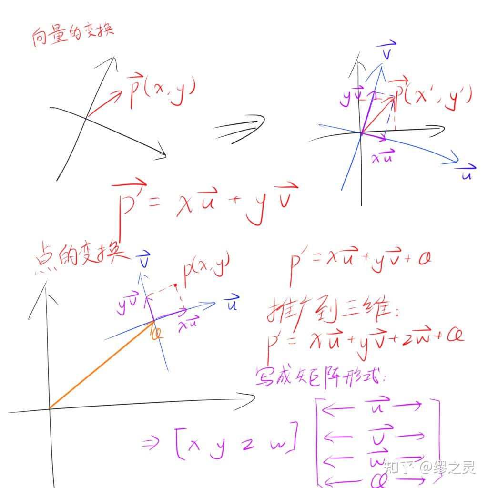

坐标变换草稿

我们只需要知道原始坐标系的基底向量和原点在目标坐标系中的坐标，我们可以得到一个适用于任何点从原始坐标系变换到目标坐标系的仿射变换矩阵，它的形式如下：

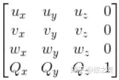

坐标系变换矩阵（Change of coordinate matrix）

在我们使用多个坐标系变换矩阵时，由于矩阵满足结合率，所以通常会把多个矩阵合为一个矩阵再进行计算，即p*矩阵A*矩阵B=p*(矩阵A*矩阵B)，这样最大的好处是仅借助一次开销极低的矩阵之间的乘法运算，便可以节省多次向量与[矩阵乘法](https://zhida.zhihu.com/search?content_id=212713894&content_type=Article&match_order=1&q=矩阵乘法&zhida_source=entity)所需的大量计算资源。

对于所有可逆的坐标系变换，其矩阵都有对应的逆矩阵，用来向相反方向转换坐标系，而对于[正交矩阵](https://zhida.zhihu.com/search?content_id=212713894&content_type=Article&match_order=1&q=正交矩阵&zhida_source=entity)（Orthogonal matrix，行向量都是两两规范正交的矩阵）有一个特殊的性质，它的逆矩阵与转置矩阵是相同的，这会给我们计算逆矩阵带来极大的便利，也就是说，只要我们所构建的坐标系变换矩阵的原始坐标系是直角坐标系，那么它的逆矩阵就是转置矩阵。（仅对用于变换向量的3*3矩阵而言，因为4*4矩阵的第四个行向量不会正交，如何求它的逆矩阵会在下面再进行讲解）

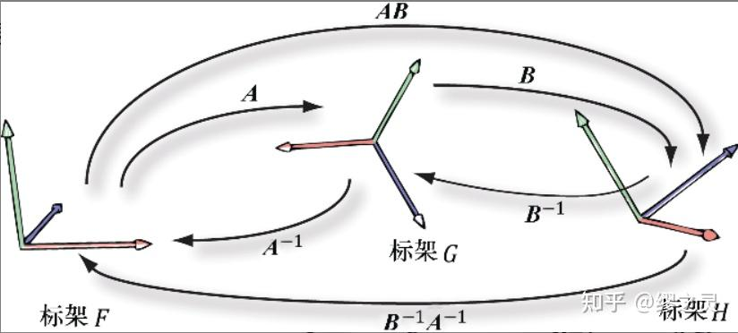

坐标系变换（图片来自DirectX12龙书）

### 观察矩阵

观察矩阵描述了世界空间相对于观察空间的坐标变换，我们通常通过描述摄像机的状态来构建观察坐标系，即一个朝向y轴正方向的up向量，一个朝向x轴正方向的right向量，一个朝向z轴负方向的look向量，以及一个标记了摄像机位置的坐标position。

这时候我们会很自然地想到用up，right，look和position来构建坐标系变换矩阵，但是仅仅这样是不够的，因为我们用于标记摄像机的坐标是在世界空间下的，构建出来的矩阵也是观察空间->世界空间变换矩阵，而我们需要的是世界空间->观察空间变换矩阵，所以必须求这个矩阵的逆矩阵。

为了方便求逆矩阵，首先对up，right，look三向量进行规范[正交化](https://zhida.zhihu.com/search?content_id=212713894&content_type=Article&match_order=1&q=正交化&zhida_source=entity)，这里采用的是Gram-Schmidt正交化方法：

```cpp
look = look.Normalize();
up = Cross(look, right).Normalize();
right = Cross(up, look);
```

但是观察矩阵是一个4*4矩阵，它的逆矩阵并非就是转置矩阵，所以我们要将观察矩阵的线性变换部分和平移部分分开，变成一个3*3矩阵和一个仿射变换矩阵，这样就可以对3*3矩阵单独求逆，直接使用它的转置矩阵，推导过程如下：

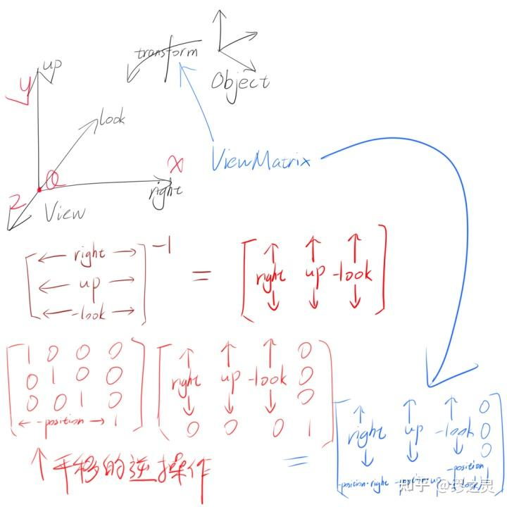

推导观察矩阵草稿

最终完成构建观察矩阵的代码：

```cpp
viewMatrix = Matrix4x4f(
	Vector4f(right.x, up.x, -look.x, 0.0f),
	Vector4f(right.y, up.y, -look.y, 0.0f),
	Vector4f(right.z, up.z, -look.z, 0.0f),
	Vector4f(-Dot(position, right), -Dot(position, up), -Dot(position, Vector3f(-position.x, -position.y, -position.z)), 1.0f)
);
```

### 投影矩阵

投影矩阵分为正交投影（Orthograpic projection）矩阵和透视投影（Perspective projection）矩阵，[工程制图](https://zhida.zhihu.com/search?content_id=212713894&content_type=Article&match_order=1&q=工程制图&zhida_source=entity)常用正交投影，而透视投影也就是俗称的近大远小，正交投影矩阵的构建相对来说比较简单，所以先从它开始。

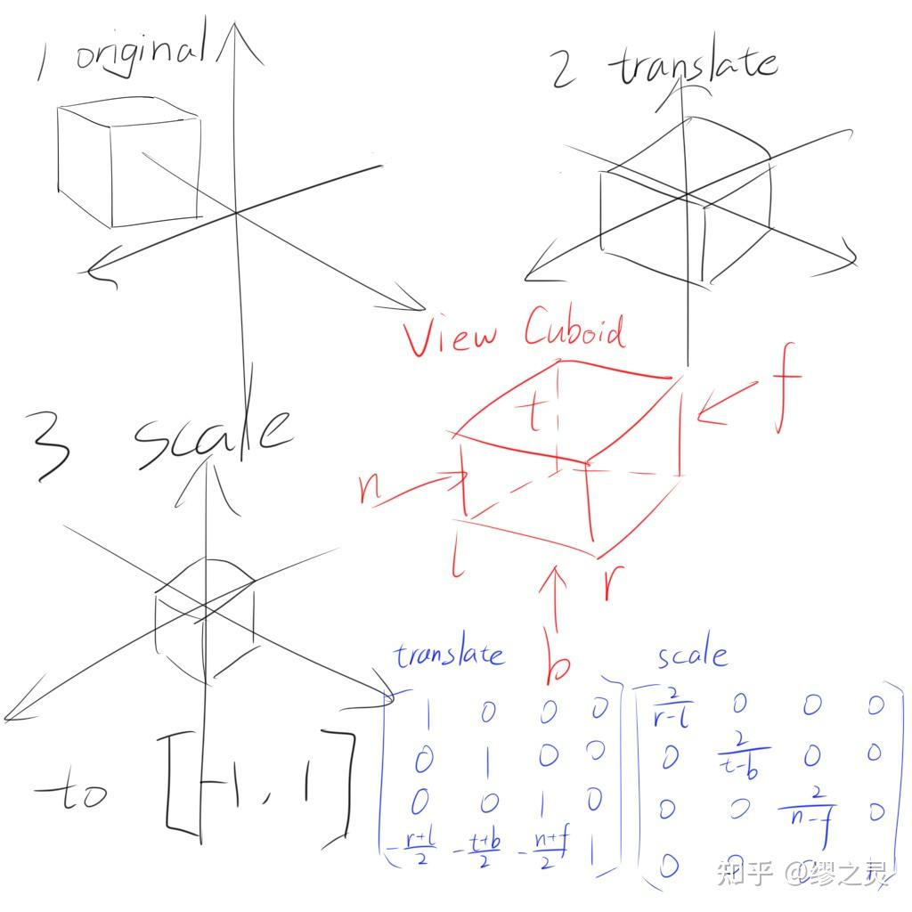

正交投影草稿

正交投影的任务是将一个位于观察空间内的视方体（View Cuboid）变换至NDC（Normalized Device Coordinates，规范化设备坐标）空间内，这个过程可以被拆分成平移（将视角平截锥体的中心平移至NDC坐标原点）和缩放（将视角平截锥体的坐标映射至[-1,1]内）两步，也就是一个平移矩阵乘以一个缩放矩阵的形式。

用*l，r，t，b，n，f*六个参量来描述一个视方体（有点类似轴对齐包围盒），接着构建对应的正交投影矩阵：

```cpp
Matrix4x4f OrthograpicProjection(float l, float r, float t, float b, float n, float f) {
	Matrix4x4f translate(
		Vector4f(1.0f, 0.0f, 0.0f, 0.0f),
		Vector4f(0.0f, 1.0f, 0.0f, 0.0f),
		Vector4f(0.0f, 0.0f, 1.0f, 0.0f),
		Vector4f(-(l + r) / 2.0f, -(t + b) / 2.0f, -(n + f) / 2.0f, 1.0f)
	);
	Matrix4x4f scale(
		Vector4f(2.0f / (r - l), 0.0f, 0.0f, 0.0f),
		Vector4f(0.0f, 2.0f / (t - b), 0.0f, 0.0f),
		Vector4f(0.0f, 0.0f, 2.0f / (n - f), 0.0f),
		Vector4f(0.0f, 0.0f, 0.0f, 1.0f)
	);
	return Multiply(translate, scale);
}
```

我们知道了正交投影的算法之后，考虑透视投影就更为简单，因为只需要将透视投影的视锥体变换为正交投影的视方体，再进行正交投影变换，就相当于进行了一次透视投影变换，也就是说接下来只需要推出透视投影->正交投影的算法即可。

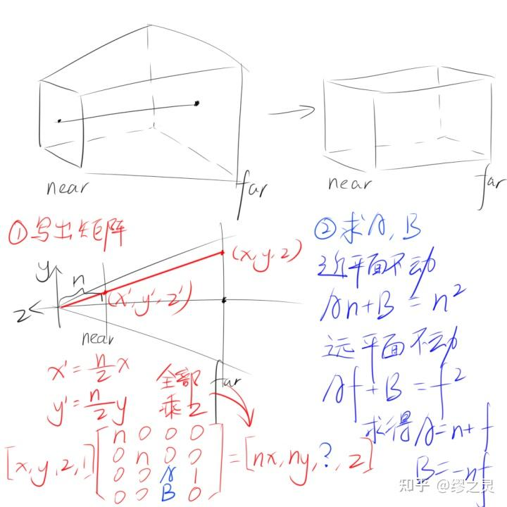

推导透视投影-&gt;正交投影草稿

我们的目标是将位于视锥体中的坐标变换到视方体中，根据相似三角形的原理，可以推出x'=(n/z)*x和y'=(n/z)*y，由于我们要将整个变换放进矩阵里，所以为了去掉除法部分，将x,y,z,w分量全部乘以z，在最后的透视除法中再将这个z除掉。

在写出这个矩阵大概的样子后，由于z分量的变换无法定义，还差A，B两个位置的元素我们推不出来，这时候依据近平面和远平面z值是不改变的，所以将它们的z值代入进原式计算，就可以推出A=n+f，B=-n*f（n是近平面的z值，f是远平面的z值）。

在代码中完成透视投影矩阵的构建：

```cpp
Matrix4x4f PerspectiveProjection(float l, float r, float t, float b, float n, float f) {
	Matrix4x4f perspToOrtho(
		Vector4f(n, 0.0f, 0.0f, 0.0f),
		Vector4f(0.0f, n, 0.0f, 0.0f),
		Vector4f(0.0f, 0.0f, n + f, 1.0f),
		Vector4f(0.0f, 0.0f, -n * f, 0.0f)
	);
	return Multiply(perspToOrtho, OrthograpicProjection(l, r, t, b, n, f));
}
```

不要忘记在透视投影变换完成后进行透视除法：

```cpp
position = Vector3f(position.x / position.w, position.y / position.w, position.z / position.w, 1.0f);
```

### 视口变换矩阵

所有变换的最后一步就是将位于NDC空间内的坐标变换为屏幕空间内的坐标，可以在屏幕上绘制出来，这一步被称作视口变换。视口变换主要干两件事，一件是将原本[-1,1]*[-1,1]的坐标范围映射至[0,width]*[0,height]，同时反转y轴，一件是将坐标原点移至屏幕左上角（暂时忽略z分量），所以我们要做的事十分清晰，照旧是一个平移和一个缩放。

最终得出的变换矩阵是这样的： [width20000height2000010width2height201]

代码：

```cpp
Matrix4x4f ScreenSpaceMatrix() {
	return Matrix4x4f(
		Vector4f(width / 2.0f, 0.0f, 0.0f, 0.0f),
		Vector4f(0.0f, height / 2.0f, 0.0f, 0.0f),
		Vector4f(0.0f, 0.0f, 1.0f, 0.0f),
		Vector4f(width / 2.0f, height / 2.0f, 0.0f, 1.0f)
	);
}
```

值得一提的是，这样变换出来的视口坐标的坐标原点是在屏幕左下角的，但是很多时候屏幕坐标系的坐标原点是在屏幕左上角的（比如我这里使用的SDL2就是），所以需要手动翻转一下y轴。

> 由于视口变换是在浮点数上进行的计算，在转换成整数后可能会带来一定的误差，通过四舍五入可以规避一些误差，不过最好的办法还是提升精度。

## 绘制模型线框

有了以上的这些内容铺垫，我们就可以真正地创造一个三维场景，也可以将一些模型加载进来绘制，关于使用Assimp加载模型的相关内容我已经写过文章，有兴趣的可以戳下面的链接去看看，这里我就不再叙述和模型加载有关的内容。

[Assimp与模型渲染的故事：模型加载，骨骼蒙皮动画24 赞同 · 6 评论文章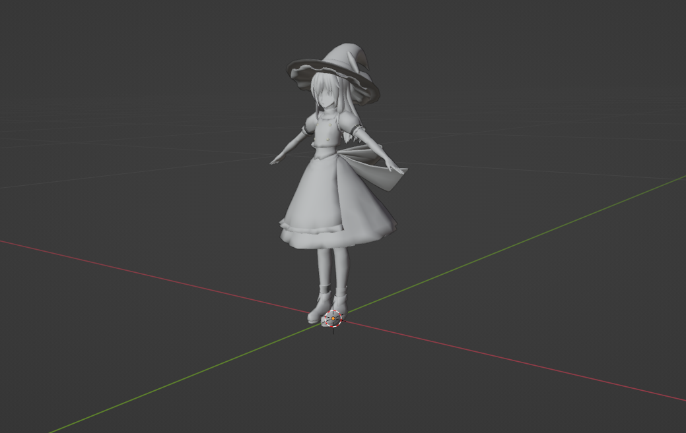](https://zhuanlan.zhihu.com/p/559637598)

### 构建Camera类

我们需要定义一个抽象的Camera来辅助构建观察矩阵和投影矩阵，这个Camera具有基本的移动和旋转镜头功能，它的代码如下：

```cpp
class Camera {
public:
	Camera() {
		SetLens(0.25f * M_PI, 2.0f, 0.1f, 1000.0f);
	}
	Camera(float aspect) {
		SetLens(0.25f * M_PI, aspect, 0.1f, 1000.0f);
	}

	Vector3f GetPosition() { return position; }
	Matrix4x4f GetViewMatrix()const { return viewMatrix; }
	Matrix4x4f GetProjMatrix()const { return projMatrix; }

	void SetLens(float fovY, float aspect, float nearZ, float farZ) {
		this->fovY = fovY;
		this->aspect = aspect;
		this->nearZ = nearZ;
		this->farZ = farZ;

                //用fovY和aspect推算出近平面的高度与宽度
		float h = tan(fovY / 2.0f) * nearZ;       
		float l = h * aspect;

		projMatrix = PerspectiveProjection(-l, l, -h, h, nearZ, farZ);
	}

	void SetPosition(Vector3f pos) {
		position = pos;
		viewDirty = true;
	}

	void LookAt(Vector3f pos, Vector3f target, Vector3f worldUp) {、
		look = Vector3f(target.x - pos.x, target.y - pos.y, target.z - pos.z).Normalize();
		right = Cross(look, worldUp).Normalize();
		up = Cross(right, look);

		viewDirty = true;
	}

	void UpdataViewMatrix() {
		if (viewDirty) {
			look = look.Normalize();
			right = Cross(look, up).Normalize();
			up = Cross(right, look);

			viewMatrix = Matrix4x4f(
				Vector4f(right.x, up.x, -look.x, 0.0f),
				Vector4f(right.y, up.y, -look.y, 0.0f),
				Vector4f(right.z, up.z, -look.z, 0.0f),
				Vector4f(-Dot(position, right), -Dot(position, up), -Dot(position, Vector3f(-look.x, -look.y, -look.z)), 1.0f)
			);

			viewDirty = false;
		}
	}

	void Walk(float distance) {
		position.x += look.x * distance;
		position.y += look.y * distance;
		position.z += look.z * distance;
		viewDirty = true;
	}

	void Strafe(float distance) {
		position.x += right.x * distance;
		position.y += right.y * distance;
		position.z += right.z * distance;
		viewDirty = true;
	}

	void Pitch(float angle) {
		Matrix4x4f m = RotateAxis(right, angle);
		up = Multiply(Vector4f(up, 1.0f), m).GetVector3f();
		look = Multiply(Vector4f(look, 1.0f), m).GetVector3f();

		viewDirty = true;
	}

	void RotateY(float angle) {
		Matrix4x4f m(
			Vector4f(cos(angle), 0.0f, -sin(angle), 0.0f),
			Vector4f(0.0f ,1.0f, 0.0f, 0.0f),
			Vector4f(sin(angle), 0.0f, cos(angle), 0.0f),
			Vector4f(0.0f, 0.0f, 0.0f, 1.0f)
		);
		up = Multiply(Vector4f(up, 1.0f), m).GetVector3f();
		right = Multiply(Vector4f(right, 1.0f), m).GetVector3f();
		look = Multiply(Vector4f(look, 1.0f), m).GetVector3f();

		viewDirty = true;
	}

private:
	Vector3f position = { 0.0f, 0.0f, 0.0f };
	Vector3f right = { 1.0f, 0.0f, 0.0f };
	Vector3f up = { 0.0f, 1.0f, 0.0f };
	Vector3f look = { 0.0f, 0.0f, -1.0f };

	Matrix4x4f viewMatrix;
	Matrix4x4f projMatrix;

	float nearZ = 0.0f;
	float farZ = 0.0f;
	float aspect = 0.0f;
	float fovY = 0.0f;

	bool viewDirty = false;
};
```

### 完成坐标变换和绘制操作

首先我们把Camera摆正到需要的位置：

```cpp
Camera camera((float)width / (float)height);
camera.LookAt(Vector3f(0.0f, 0.0f, 1.0f), Vector3f(0.0f, 0.0f, 0.0f), Vector3f(0.0f, 1.0f, 0.0f));
camera.UpdataViewMatrix();
```

接着将模型的顶点和索引加载进来（全部[三角形化](https://zhida.zhihu.com/search?content_id=212713894&content_type=Article&match_order=1&q=三角形化&zhida_source=entity)），完成MVP变换后进行透视除法，最后完成视口变换：

```cpp
Matrix4x4f SRT = Multiply(Multiply(scale, rotate), translate);

for (auto& renderInfo : model.renderInfo) {
	vertices.insert(vertices.end(), renderInfo.vertices.begin(), renderInfo.vertices.end());
}
for (auto& v : vertices) {
	v.position = Multiply(v.position, SRT);
	v.position = Multiply(v.position, camera.GetViewMatrix4x4());
	v.position = Multiply(v.position, camera.GetProjMatrix4x4());

	v.position.x /= v.position.w;
	v.position.y /= v.position.w;
	v.position.z /= v.position.w;
	v.position.w = 1.0f;
	v.position = Multiply(v.position, ScreenSpaceMatrix());
}
```

根据索引查找需要绘制的顶点，因为我们已经将模型三角形化，所以索引一定是三的倍数；注意这里在浮点数屏幕空间坐标上加0.5是为了四舍五入至整数坐标：

```cpp
int offset = 0;
for (int i = 0; i < model.renderInfo.size(); i++) {
	for (int j = 0; j <= model.renderInfo[i].indices.size() - 3; j += 3) {
		Vector4f v0 = vertices[model.renderInfo[i].indices[j] + offset].position;
		Vector4f v1 = vertices[model.renderInfo[i].indices[j + 1] + offset].position;
		Vector4f v2 = vertices[model.renderInfo[i].indices[j + 2] + offset].position;

		DrawLine(renderer, v0.x + 0.5f, v0.y + 0.5f, v1.x + 0.5f, v1.y + 0.5f, Vector3f(0.0f, 0.0f, 1.0f));
		DrawLine(renderer, v2.x + 0.5f, v2.y + 0.5f, v1.x + 0.5f, v1.y + 0.5f, Vector3f(0.0f, 0.0f, 1.0f));
		DrawLine(renderer, v0.x + 0.5f, v0.y + 0.5f, v2.x + 0.5f, v2.y + 0.5f, Vector3f(0.0f, 0.0f, 1.0f));
	}
	offset += model.renderInfo[i].indices.size();
}
```

最终结果：

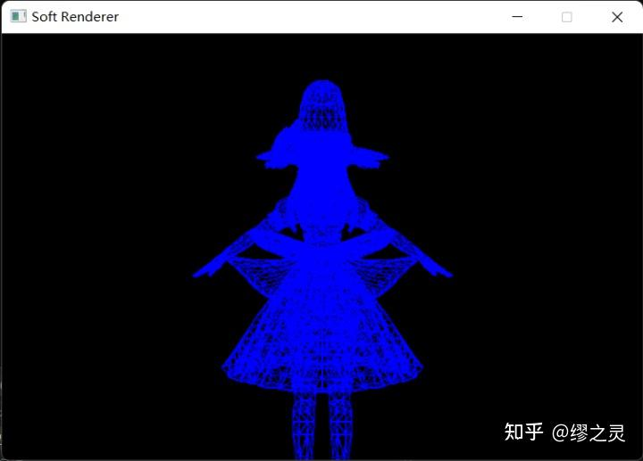

## 插值算法

顶点属性插值是光栅化过程中一个相当重要的步骤，大多数顶点属性（颜色，UV坐标，法向量，切向量）如果不经过插值操作就无法使用，所以插值同样是后面我们实现[纹理映射](https://zhida.zhihu.com/search?content_id=212713894&content_type=Article&match_order=1&q=纹理映射&zhida_source=entity)，光照之类算法的基础。接下来我就以颜色为例来研究一下线插值和三角形插值算法。

### 直线插值

直线的插值非常简单，因为其完全线性的特点，所以我们只要在绘制时根据基准值（递增的x或y）直接[线性插值](https://zhida.zhihu.com/search?content_id=212713894&content_type=Article&match_order=1&q=线性插值&zhida_source=entity)即可。（记得在交换点坐标的同时交换点颜色）

简略代码：

```cpp
float Lerp(float v0, float v1, float percent) {
	return v0 * (1.0f - percent) + v1 * percent;
}

Vector3f Lerp(Vector3f v0, Vector3f v1, float percent) {
	return Vector3f(
		Lerp(v0.x, v1.x, percent),
		Lerp(v0.y, v1.y, percent),
		Lerp(v0.z, v1.z, percent)
	);
}

void DrawLine(SDL_Renderer* renderer, int x0, int y0, int x1, int y1, Vector3f color0, Vector3f color1) {
        ...

	DrawPixel(renderer, x, y, Lerp(color0, color1, (float)(x - x0) / (float)(x1 - x0)));

        ...

	DrawPixel(renderer, x, y, Lerp(color0, color1, (float)(y - y0) / (float)(y1 - y0)));

        ...
}
```

### 三角形插值

还记得之前在讲解的三角形着色的重心坐标算法，它的优点是什么吗？没错，就是便于顶点属性插值。所以在进行三角形插值时，我们首选重心坐标算法，它直观地告诉我们三角形中的一个点与三个顶点的关系。

```cpp
Vector3f mass = CalcBarycentric(x0, y0, x1, y1, x2, y2, x, y);
if (mass.x > 0.0f && mass.y > 0.0f && mass.z > 0.0f) {
	Vector3f color;
	color.x = mass.x * color0.x + mass.y * color1.x + mass.z * color2.x;
	color.y = mass.x * color0.y + mass.y * color1.y + mass.z * color2.y;
	color.z = mass.x * color0.z + mass.y * color1.x + mass.z * color2.z;
	DrawPixel(renderer, x, y, color);
}
```

最终结果：

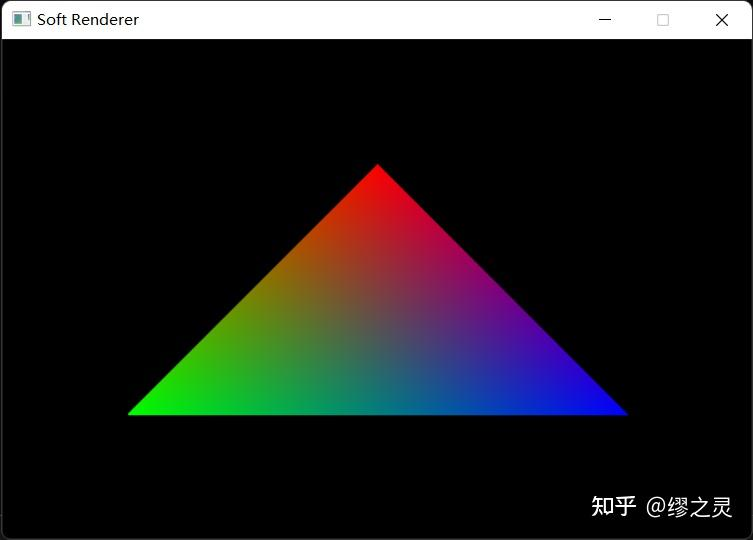

### 透视矫正插值

然而，三角形插值会带来比较大的误差，原因是三角形的重心坐标在经历透视除法之后会发生偏移，所以我们在透视投影变换后计算得到的重心坐标并非是它原本的重心坐标，这时候就要使用透视矫正插值（Perspective-Correct Interpolation）来修正原来的算法。

二维空间中z值的透视矫正插值结果推导：

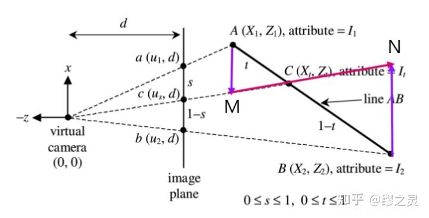

透视矫正插值说明

由相似三角形的原理得：

因为 sd=AMZ1 1−sd=BNZ2 t1−t=AMBN=sZ1(1−s)Z2

所以 1−tt=(1−s)Z1sZ2

所以 1t=(1−s)Z1sZ2+1

所以 t=sZ1(1−s)Z2+sZ1

所以C由A和B插值得到 Zt=(1−t)Z1+tZ2

所以 Zt=(1−sZ1(1−s)Z2+sZ1)Z1+sZ1(1−s)Z2+sZ1Z2

所以 Zt=((1−s)Z2(1−s)Z2+sZ1)Z1+sZ1(1−s)Z2+sZ1Z2

所以 Zt=Z1Z2(1−s)Z2+sZ1=11−sZ1+sZ2

假设要插值的数据为N，用N替换原式中的Z值，得到 Nt=((1−s)Z2(1−s)Z2+sZ1)N1+sZ1(1−s)Z2+sZ1N2

用已经求出的 Zt 可以简化计算，即 Nt=Zt(1−sZ1N1+sZ2N2)

推广至三维空间： Zt=11−u−vZ1+uZ2+vZ3 其中u和v满足 P=(1−u−v)A+uB+vC

同样假设要插值的数据为N，则Nt=Zt(1−u−vZ1N1+uZ2N2+vZ3N3) ，这也就是说我们只需知道三角形三个顶点在世界空间（或观察空间和齐次裁剪空间，只要是透视除法前的皆可）中的Z值和所求点的重心坐标，就可以得到透视矫正插值后正确的值。

代码：

```cpp
Vector3f PerspectiveCorrectInterpolate(float z1, float z2, float z3, Vector3f n1, Vector3f n2, Vector3f n3, float u, float v) {
	float zt = 1.0f / ((1.0f - u - v) / z1 + u / z2 + v / z3);
	Vector3f nt;
	nt.x = ((1.0f - u - v) / z1 * n1.x + u / z2 * n2.x + v / z3 * n3.x) * zt;
	nt.y = ((1.0f - u - v) / z1 * n1.y + u / z2 * n2.y + v / z3 * n3.y) * zt;
	nt.z = ((1.0f - u - v) / z1 * n1.z + u / z2 * n2.z + v / z3 * n3.z) * zt;
	return nt;
}
```

