# 软光栅化渲染器学习笔记（三）：细分几何

## 贝塞尔曲线

**贝塞尔曲线（Bézier Curves）** 是一种经典的多项式曲线模型，它提供了基于多个控制点（Control point）的曲线生成方法。[Animated Bézier Curves - Jason Davies](https://www.jasondavies.com/animated-bezier/)用动画展现了贝塞尔曲线生成的过程，可以十分直观地了解这种优美的曲线背后的原理。

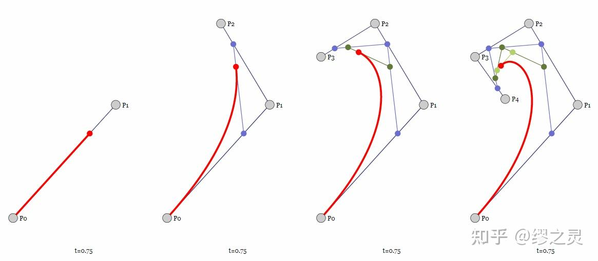

### 二次贝塞尔曲线

我们用三个控制点 p0,p1,p2 来生成最基础的二次贝塞尔曲线，首先可以在 p0 和 p1 ， p1 和 p2 之间各自连一条直线，然后再直线上用相同的参量 t(0≤t≤1) 进行[线性插值](https://zhida.zhihu.com/search?content_id=215389663&content_type=Article&match_order=1&q=线性插值&zhida_source=entity)：

p01=(1−t)p0+tp1p11=(1−t)p1+tp2在由插值得到的两个点之间，我们同样可以连出一条直线，并继续用相同的参量 t 进行线性插值，最终就可以得到在当前 t 值下贝塞尔曲线上的一个点：

p02=(1−t)p01+tp11展开可以得到：

p02=(1−t)2p0+2tp1+t2p2用足够精细的步长取 t 值，并将所有得到的点都画出来，就可以得到一条完整的二次贝塞尔曲线。代码如下：

```cpp
std::vector<Vertex> controlPoints(3);
controlPoints[0].position = Vector4f(-0.5f, -0.5f, 0.0f, 1.0f);
controlPoints[0].color = Vector4f(1.0f, 0.0f, 0.0f, 1.0f);
controlPoints[1].position = Vector4f(0.0f, 1.0f, 0.0f, 1.0f);
controlPoints[1].color = Vector4f(1.0f, 0.0f, 0.0f, 1.0f);
controlPoints[2].position = Vector4f(0.5f, -0.5f, 0.0f, 1.0f);
controlPoints[2].color = Vector4f(1.0f, 0.0f, 0.0f, 1.0f);

const float step = 0.001f;
for (float t = 0.0f; t <= 1.0f; t += step) {
    Vertex p01 = VertexInterplote(controlPoints[0], controlPoints[1], t);
    Vertex p11 = VertexInterplote(controlPoints[1], controlPoints[2], t);
    Vertex p02 = VertexInterplote(p01, p11, t);
    pipeline.SetVertexBuffer(&p02, 1);
    pipeline.DrawPoint(0);
}
```

最终结果：

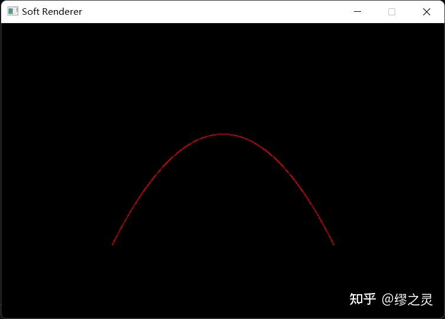

### 三次贝塞尔曲线

当我们有四个控制点后，就可以在二次贝塞尔曲线的基础再增加一层[贝塞尔曲线插值](https://zhida.zhihu.com/search?content_id=215389663&content_type=Article&match_order=1&q=贝塞尔曲线插值&zhida_source=entity)了，它的原理与上述基本无异，只不过操作更加复杂了一些，首先是第一层插值：

p01=(1−t)p0+tp1p11=(1−t)p1+tp2p21=(1−t)p2+tp3接着用插值得到的三个点进行第二层插值：

p02=(1−t)p01+tp11p12=(1−t)p11+tp21最后是第三层插值：

p03=(1−t)p02+tp12展开可以得到：

p03=(1−t)3p0+3t(1−t)2p1+3t2(1−t)p2+t3p3代码如下：

```cpp
std::vector<Vertex> controlPoints(4);
controlPoints[0].position = Vector4f(-0.8f, -0.5f, 0.0f, 1.0f);
controlPoints[0].color = Vector4f(1.0f, 0.0f, 0.0f, 1.0f);
controlPoints[1].position = Vector4f(-0.3f, 1.0f, 0.0f, 1.0f);
controlPoints[1].color = Vector4f(1.0f, 0.0f, 0.0f, 1.0f);
controlPoints[2].position = Vector4f(0.2f, -1.5f, 0.0f, 1.0f);
controlPoints[2].color = Vector4f(1.0f, 0.0f, 0.0f, 1.0f);
controlPoints[3].position = Vector4f(0.7f, 1.5f, 0.0f, 1.0f);
controlPoints[3].color = Vector4f(1.0f, 0.0f, 0.0f, 1.0f);

const float step = 0.001f;
for (float t = 0.0f; t <= 1.0f; t += step) {
    Vertex p01 = VertexInterplote(controlPoints[0], controlPoints[1], t);
    Vertex p11 = VertexInterplote(controlPoints[1], controlPoints[2], t);
    Vertex p21 = VertexInterplote(controlPoints[2], controlPoints[3], t);
    Vertex p02 = VertexInterplote(p01, p11, t);
    Vertex p12 = VertexInterplote(p11, p21, t);
    Vertex p03 = VertexInterplote(p02, p12, t);
    pipeline.SetVertexBuffer(&p03, 1);
    pipeline.DrawPoint(0);
}
```

最终结果：

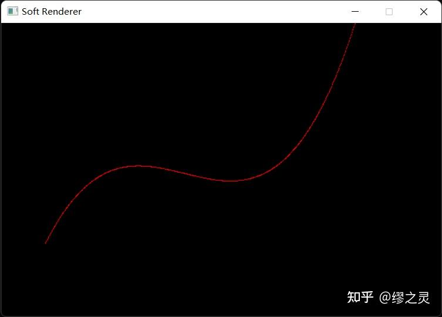

### 高阶贝塞尔曲线通式

我们不难看出，贝塞尔曲线计算的本质是对所有控制点的线性组合，也就是说对于 n 次贝塞尔曲线，取上面任一点有： p0n=k1p1+k2p2+k3p3+...+knpn(k1+k2+k3+...kn=1)

实际上，贝塞尔曲线可以借助**[伯恩斯坦多项式](https://zhida.zhihu.com/search?content_id=215389663&content_type=Article&match_order=1&q=伯恩斯坦多项式&zhida_source=entity)（Bernstein Polynomial）** 被定义在点集上，用 Bin(t) 表示 n 次（次数=阶数-1）伯恩斯坦多项式的第 i 项：

Bin(t)=Cniti(1−t)n−i=n!i!(n−i)!ti(1−t)n−i贝塞尔曲线的完整计算式如下：

pn(t)=∑i=0npiBin(t)t∈[0,1]藉由[二项式定理](https://zhida.zhihu.com/search?content_id=215389663&content_type=Article&match_order=1&q=二项式定理&zhida_source=entity)，我们也非常容易证得伯恩斯坦多项式的归一性：

∑i=0nBin(t)=∑i=0nCniti(1−t)n−i=[(1−t)+t]n≡1借助伯恩斯坦多项式的另一个性质**递归性（Recursive）**，我们可以将贝塞尔曲线写为更容易计算的**de Casteljau形式**，伯恩斯坦多项式的递归性推导如下：

Bin(t)=Cniti(1−t)n−i=(Cn−1i+Cn−1i−1)ti(1−t)n−i=(1−t)Cn−1iti(1−t)(n−1)−i+tCn−1i−1ti−1(1−t)(n−1)−(i−1)=(1−t)Bin−1(t)+tBi−1n−1(t)

伯恩斯坦基函数的递归形式具有可微性，[微分方程](https://zhida.zhihu.com/search?content_id=215389663&content_type=Article&match_order=1&q=微分方程&zhida_source=entity)如下：

(Bin(t))′=n[Bi−1n−1(t)−Bin−1(t)]所以可以将 pn(t) 的计算也写成递归形式，实际上就是我们用来计算二次和三次贝塞尔曲线的方法：

pn(t)=(1−t)p0n−1+tp1n−1de Casteljau算法的代码实现如下：

```cpp
Vertex GetCurvePoint(const std::vector<Vertex>& points, float t) {
    size_t pointCount = points.size();
    std::vector<Vertex> newPoints(pointCount - 1);
    for (size_t i = 0; i < pointCount - 1; i++)
        newPoints[i] = VertexInterplote(points[i], points[i + 1], t);

    if (pointCount == 2)
        return newPoints[0];
    else
        return GetCurvePoint(newPoints, t);
}
```

自然递归方法没有直接使用伯恩斯坦多项式计算效率高，但是对数值计算的要求更低，能得到更稳定的数据。

### 曲线升阶

有的时候为了更加灵活的操作贝塞尔曲线，我们需要增加一个贝塞尔曲线上的控制点数量，并使原曲线的形状保持不变，这个过程就被称作贝塞尔曲线的升阶。 为了得到贝塞尔曲线的升阶公式，我们首先推导伯恩斯坦多项式的升阶公式，由 Bin(t) 的公式可得：

(1−t)Bin(t)=(1−in+1)Bin+1(t)tBin(t)=i+1n+1Bi+1n+1(t)将上面两式相加可得：

Bin(t)=(1−in+1)Bin+1(t)+i+1n+1Bi+1n+1(t)所以可以将 pn(t) 中的 Bin(t) 拆开，表示为：

pi(t)=∑i=0npi((1−in+1)Bin+1(t)+i+1n+1Bi+1n+1(t))展开可以得：

pi(t)=B0n+1(t)p0+1n+1B1n+1(t)p0+(1−1n+1)B1n+1(t)p1+2n+1B2n+1(t)p1+...+(1−nn+1)Bnn+1(t)pn+Bn+1n+1(t)pn可以看出，[展开式](https://zhida.zhihu.com/search?content_id=215389663&content_type=Article&match_order=1&q=展开式&zhida_source=entity)中除了第一项和最后一项，每两项都可以合并为一个新的项，如下所示：

pi(t)=B0n+1(t)p0+B1n+1(t)p1∗+B2n+1(t)p2∗+...+Bnn+1(t)pn∗+Bn+1n+1(t)pn因此我们可以得知，贝塞尔曲线的升阶公式为：

pi∗(t)=in+1pi−1(t)+(1−in+1)pi(t)在经过一次升阶操作后，原曲线的控制点数量会由 n+1 增加为 n+2 ，值得一提得是，当升阶的次数越多，控制点连成的直线就会越逼近曲线本身，这和[数学分析](https://zhida.zhihu.com/search?content_id=215389663&content_type=Article&match_order=1&q=数学分析&zhida_source=entity)中重要的**Weierstrass[逼近定理](https://zhida.zhihu.com/search?content_id=215389663&content_type=Article&match_order=1&q=逼近定理&zhida_source=entity)**结论是一致的。

代码如下：

```cpp
void DegreeElevation(const std::vector<Vertex>& controlPoints, std::vector<Vertex>& newPoints, size_t elevation) {
    std::vector<Vertex> temp;
    temp = controlPoints;
    for (size_t e = 0; e < elevation; e++) {
        newPoints.clear();
        newPoints.push_back(temp[0]);
        int n = temp.size();
        for (size_t i = 1; i < n; i++) {
            float ratio = (float)i / n;
            newPoints.push_back(VertexInterplote(temp[i], temp[i - 1], ratio));
        }
        newPoints.push_back(temp[n - 1]);
        temp = newPoints;
    }
}
```

最终结果（白色矩形表示控制点）：

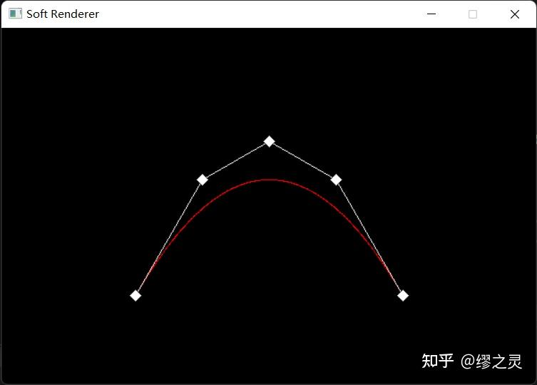

升阶前（四次贝塞尔曲线）

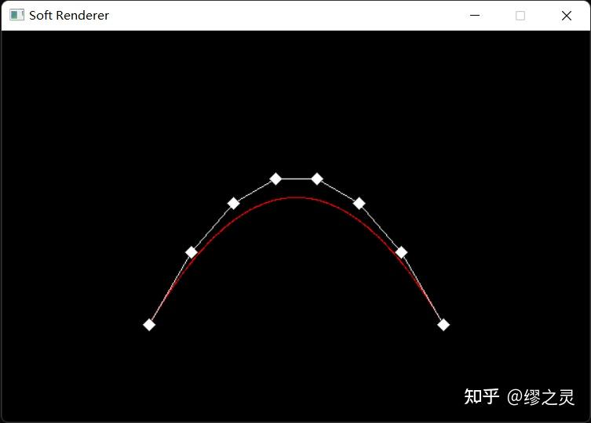

升阶后（七次贝塞尔曲线）

### 曲线的分段和连续

由于控制点过多会导致曲线的难以操控，所以在生成复杂曲线时，我们通常不会直接使用高阶贝塞尔曲线，而是采用**[分段贝塞尔曲线](https://zhida.zhihu.com/search?content_id=215389663&content_type=Article&match_order=1&q=分段贝塞尔曲线&zhida_source=entity)（Piecewise Bézier Curves）** 的方法进行绘制，比如下面的曲线就是用两个二次贝塞尔曲线拼接而成的：

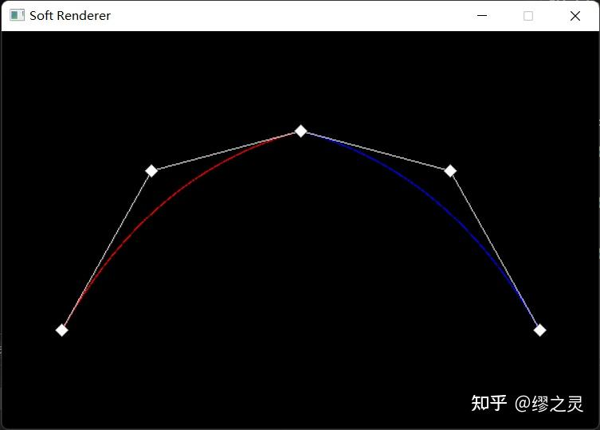

上面这种曲线的拼接方式满足 C0 **连续**，称为位置连续，意思是两条曲线首尾相接，即 an=b0 。

同样的，我们定义了更高阶的连续形式， C1 **连续**（又称斜率连续）指的是两条曲线在相接处的切向量方向相同，模长相等，即导数相等 C1 ，或者可以写成 an=b0=12(an−1+b1) ，一般我们说的曲线光滑都是指 C1 连续。下图演示了一个 C1 连续的情形：

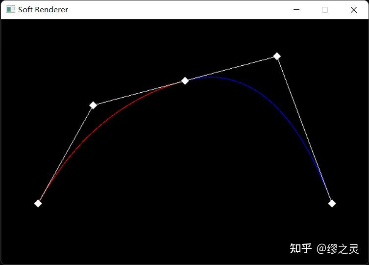

我们有更多关于曲线连续的定义：

- G1**连续**：两条曲线相接处的切向量方向相同，模长不等，即 an′=kb0′(k≠0) 。
- G2**连续（曲率连续）**：两曲线相接处曲率相等且主法线方向一致，即 b0″=αan″+βan′ 。
- C2**连续**：曲率连续的特殊形式，两曲线相交处的二阶导相等，即 an″=b0″ 。

## B样条

### B样条基本性质

贝塞尔曲线的最大缺陷就是高阶曲线难以进行控制，而分段曲线又难以确保整条曲线的连续性，因此就有了贝塞尔曲线的替代品**样条曲线（Spline Curves）**，所谓样条就是一种用低阶多项式去逼近高阶多项式曲线的方法，**B样条（B-Spline）** 就是其中的一种，它既有贝塞尔曲线的基本性质，又可以解决多个控制点使复杂度上升的问题。

在开始讲解B样条的数学公式之前需要先厘清一些B样条的概念：B样条被定义在 n+1 个控制点上，阶数为 k ，次数为 k−1 ， pi 表示第 i 个控制点，除此以外，B样条还拥有一串非减的无符号实数序列，称为**节点向量（Knot vector）**，表示为 {t0,t1,...,tm} ，顾名思义，节点向量中包含的 m 个节点将整个B样条曲线分成 m−1 段曲线，曲线的不同段受到不同的控制点的控制，同时我们规定每一个控制点都会依次控制 k 段曲线，所以节点的数量为 m+1=n+k+1 。举个例子，对于一条三阶的B样条曲线，它的0号控制点控制第一段和第二段曲线，1号控制点控制第二段和第三段曲线，以此类推。

B样条的[基本公式](https://zhida.zhihu.com/search?content_id=215389663&content_type=Article&match_order=1&q=基本公式&zhida_source=entity)与贝塞尔曲线类似，只不过用B样条基函数来代替伯恩斯坦基函数：

pn(t)=∑i=0npiNik(t)t∈[tk−1,tn+1]其中 Nik(t) 代表第 i 个 k 阶的B样条基函数。对于一阶的B样条基函数，它的计算式如下：

Ni1(t)={1ti≤x≤ti+10Otherwise这说明B样条基函数具有**局部支撑性（Local support）**，即每个控制点只能影响一定区间上的曲线，这有效避免了移动部分控制点就造成整条曲线变化的麻烦。

对于高阶B样条基函数，它可以被定义为**de Boor-Cox递归**形式，公式如下：

Nik(t)=t−titi+k−1−tiNik−1(t)+ti+k−tti+k−ti+1Ni+1k−1(t)

> 注意可能会有相同的节点存在，所以当系数的分母为0时将系数设为0。

如此复杂的系数看上去十分吓人，但实际上并不难理解，同样以一条三阶的B样条曲线为例，则 N03(t) 可以拆成：

N03(t)=t−t0t2−t0N02(t)+t3−tt3−t1N12(t)因为 N03(t) 影响的是 t0∼t2 范围内的 t 值，而 N12(t) 影响的是 t1∼t3 范围内的 t 值，所以当 t 在 t1∼t2 中， N03(t) 的值就会同时由 N02(t) 和 N12(t) 决定，这实际上和线性插值操作非常类似，目的都是使最终的系数和（除了首尾两端）等于1。

B样条基函数同样也具有和伯恩斯坦多项式类似的一些基本性质，比如归一性，但是要注意的是B样条基函数的归一性是在区间 [tk−1,tn+1] 内定义的：

∑i=0nNik(t)=1t∈[tk−1,tn+1]B样条基函数所满足的微分方程如下：

(Nik(t))′=k−1ti+k−1−tiNik−1(t)+k−1ti+k−ti+1Ni+1k−1(t)对于B样条上的一点 p(t) ，将计算公式进一步展开，得到完整的**de Boor算法**，推导过程如下：

p(t)=∑i=0npiNik(t)=∑i=j−k+1jpiNik(t)=∑i=j−k+1jpi[t−titi+k−1−tiNik−1(t)+ti+k−tti+k−ti+1Ni+1k−1(t)]=∑i=j−k+1j[t−titi+k−1−tipi+ti+k−1−tti+k−1−tipi−1]Nik−1(t)t∈[tj,tj+1]可以将原式中的系数提出来，写成一个单独的表达式：

τir=t−titi+k−r−ti并且将 p(t) 的递推写成分段函数的形式：

pi[r]={pir=0(1−τir)pi−1[r−1](t)+τirpi[r−1](t)r>0

那么原式可以写成：

p(t)=∑i=j−k+1jpiNik(t)=∑i=j−k+2jpi[1](t)Nik−1(t)=pj[k−1]t∈[tj,tj+1]**de Boor算法的几何解释**：每次使用线段 pi[r]pi+1[r] 切割顶角 pi[r−1] ，经过 k−1 轮割角后，最终可以得到 pj[r−1](t) 。

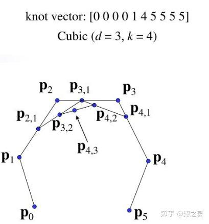

de Boor算法的几何解释

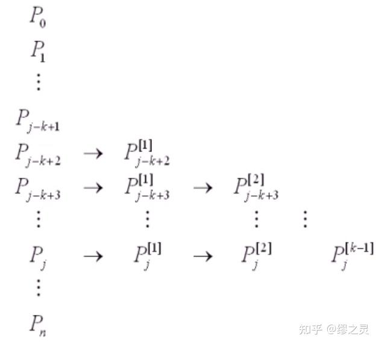

de Boor算法的递推方式

代码如下：

```cpp
class BSpline {
public:
    BSpline(const std::vector<Vertex>& controlPoints, const std::vector<float>& knotVector)
        : controlPoints(controlPoints), knotVector(knotVector) {
        n = controlPoints.size() - 1;
        order = knotVector.size() - n - 1;
    }

    Vertex GetCurvePoint(float t) {
        size_t j = std::distance(knotVector.begin(), std::upper_bound(knotVector.begin(), knotVector.end(), t)) - 1;
        std::vector<Vertex> newPoints;
        newPoints.insert(newPoints.end(), controlPoints.begin() + (j + 1 - order), controlPoints.begin() + (j + 1));
        return GetCurvePoint(newPoints, t, j + 1 - order);
    }

private:
    Vertex GetCurvePoint(const std::vector<Vertex>& points, float t, size_t index) {
        if (points.size() == 1) return points[0];
        size_t r = order - points.size() + 1;
        index++;

        std::vector<Vertex> newPoints;
        for (size_t i = 0; i < points.size() - 1; i++) {
            Vertex newPoint;
            float basisFactor = BasisFactor(index + i, r, t);
            newPoint.position = (1.0f - basisFactor) * points[i].position + basisFactor * points[i + 1].position;
            newPoint.color = (1.0f - basisFactor) * points[i].color + basisFactor * points[i + 1].color;
            newPoints.push_back(newPoint);
        }
        return GetCurvePoint(newPoints, t, index);
    }

    float BasisFactor(size_t i, size_t r, float t) {
        if (knotVector[i + order - r] - knotVector[i] <= 1e-6f) return 0.0f;
        return (t - knotVector[i]) / (knotVector[i + order - r] - knotVector[i]);
    }

    std::vector<Vertex> controlPoints;
    std::vector<float> knotVector;
    size_t n, order;
};
```

### B样条分类

根据节点向量中节点的分布形式，B样条可以分为以下4类：

1. **均匀B样条**：节点成等差数列均分排布，对应均匀B样条基函数，例如 {0,15,25,35,45,1} 。

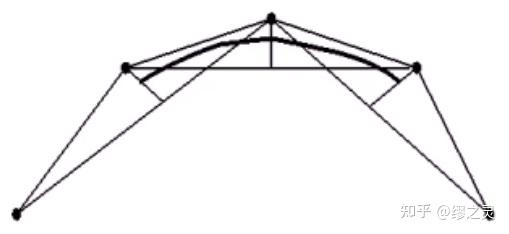

均匀B样条演示

1. **准均匀B样条**：均匀B样条并不满足曲线的首尾端点和控制点重合，我们可以通过在节点向量的首尾端点取 k 的重复度使曲线满足端点性质，例如三阶B样条的节点向量就可以写成这样 {0,0,0,15,25,35,45,1,1,1} 。
2. **分段贝塞尔曲线**：B样条以分段贝塞尔曲线的形式生成。起始节点和终止节点都具有 k 的重复度，其它所有节点都具有 k−1 的重复度，这样，所有的曲线段都是贝塞尔曲线。
3. **非均匀B样条**：最不特殊的B样条曲线形式，不满足以上任何一个B样条形式就可以被称为非均匀B样条。

### 操纵B样条

B样条具有很强的灵活性（Flexibility），所以可以轻易做到一些贝塞尔曲线无法做到的事情：

- 若要在B样条中包含一段线段，则需要设置 k 个连续控制点共线。
- 若要使曲线通过点 pi ，则需要设置 pi=pi+1=pi+2 。
- 若希望曲线与某直线 L 相切，只需要指定控制点 pi,pi+1,pi+2 都在 L 上，并让 ti+3 的重复度小于2。

添加节点也是B样条中一个重要的操作，在原来的节点 ti 和 ti+1 间添加一个节点得到新的节点向量如下：

T1={t01,t11,...,ti1,ti+11,ti+21,...,tn+k+11}则有以下公式可以确保整个B样条不会在新增节点时受到影响，其中 r 是新增节点在节点向量中的重复度：

{pj1=pjj∈[0,i−k+1]pj1=(1−τj1)pj−1+τj1pjj∈[i−k+2,i−r]pj1=pj−1j∈[i−r+1,n+1]代码如下：

```cpp
void AddKnot(float value) {
    size_t index = knotVector.size() - 1;
    bool found = false;
    for (size_t i = 0; i < knotVector.size(); i++) {
        if (value < knotVector[i]) {
            index = i - 1;
            found = true;
            break;
        }
    }

    n++;
    std::vector<Vertex> newPoints(n + 1);
    for (size_t i = 0; i <= index - order + 1; i++) {
        newPoints[i] = controlPoints[i];
    }
    for (size_t i = index - order + 2; i <= index; i++) {
        float basisFactor = BasisFactor(i, 1, value);
        newPoints[i].position = (1.0f - basisFactor) * controlPoints[i - 1].position
            + basisFactor * controlPoints[i].position;
        newPoints[i].color = (1.0f - basisFactor) * controlPoints[i - 1].color
            + basisFactor * controlPoints[i].color;
    }
    for (size_t i = index + 1; i <= n; i++) {
        newPoints[i] = controlPoints[i - 1];
    }

    if (found)
        knotVector.insert(knotVector.begin() + index + 1, value);
    else
        knotVector.push_back(value);
    controlPoints = newPoints;
}
```

### NURBS简述

在介绍NURBS之前，我们首先需要了解一下有理贝塞尔曲线的概念，我们知道，在[仿射空间](https://zhida.zhihu.com/search?content_id=215389663&content_type=Article&match_order=1&q=仿射空间&zhida_source=entity)中，我们会通过透视除法将[齐次坐标](https://zhida.zhihu.com/search?content_id=215389663&content_type=Article&match_order=1&q=齐次坐标&zhida_source=entity)投影至线性空间中，类似的，我们将贝塞尔曲线定义在高维空间中并通过除法投影至原来的空间，这就是有理贝塞尔曲线的基本原理，它的公式如下：

并且p(t)=∑i=0npiBin(t)ωi∑j=0nBjn(t)ωi=∑i=0nqi(t)pi并且∑i=0nqi(t)=1其中 ωi 代表第 i 个控制点的权系数，权系数越大，则最终得到的曲线就会越靠近那一个控制点。

有理贝塞尔曲线具有一些普通贝塞尔曲线所不具有的优势，比如有理贝塞尔曲线可以进行透视投影变换而不发生形变，而且可以精准地表示圆和圆锥曲线（普通贝塞尔曲线无法表示数学正确的圆形），下面就演示了一个用有理贝塞尔曲线表示圆的例子：

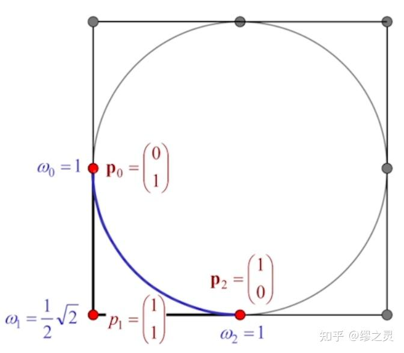

有理贝塞尔曲线表示圆形（图片来自GAMES102）

有了有理贝塞尔曲线的定义，我们就可以引出**NURBS（Non-Uniform Rational B-Spline，非均匀有理B样条）** 了，它的定义方式和有理贝塞尔曲线是类似的：

p(t)=∑i=1nNin(t)ωipi∑i=1nNin(t)ωiNURBS具有B样条的性质，同样也拥有良好的几何直观性，所以被广泛运用于曲面的设计中，是[曲面建模](https://zhida.zhihu.com/search?content_id=215389663&content_type=Article&match_order=1&q=曲面建模&zhida_source=entity)的工业标准之一，下图就展示了用NURBS绘制圆锥曲线的例子：

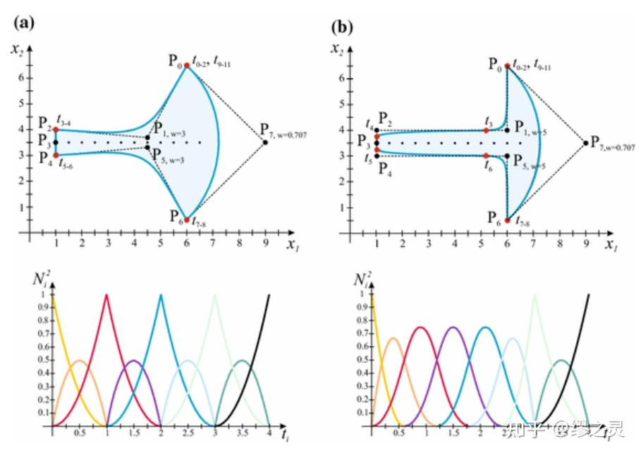

使用NURBS绘制圆锥曲线（图片来自GAMES102）

## 曲面

### 贝塞尔曲面

假如我们将多条贝塞尔曲线并排排列在一起，并以相同的 t 值进行绘制，如下图所示：

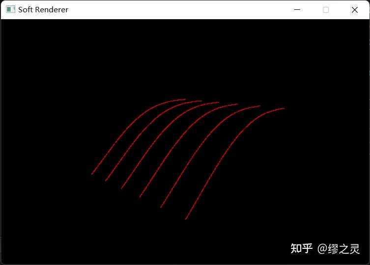

可以看到，这些曲线排列组成的形状已经及其接近曲面了，假如我们把每条贝塞尔曲线在当前 t 值计算得到的点都当作控制点，就可以借助这些点画出一条新的贝塞尔曲线，多条这样的贝塞尔曲线可以组成网格状曲面，而只要 t 值步长取得足够精细，我们就可以画出真正的曲面！这便是**贝塞尔曲面**的基本原理。

构建一个BezierSurface类来辅助完成贝塞尔曲面的构建：

```cpp
class BezierSurface {
public:
    BezierSurface() {}
    BezierSurface(Vector2f size, Vector2i tess) : size(size), tess(tess) {
        float horizontal = size.x / tess.x;
        float vertical = size.y / tess.y;
        for (int i = 0; i <= tess.x; i++) {
            float x = -size.x / 2.0f + horizontal * i;
            std::vector<Vertex> controlPoints;
            for (int j = 0; j <= tess.y; j++) {
                float y = -size.y / 2.0f + vertical * j;
                Vertex point;
                point.position = Vector4f(x, y, powf(sinf(j * 1.0f / M_PI), 10.0f), 1.0f);
                point.color = Vector4f(1.0f, 0.0f, 0.0f, 1.0f);
                controlPoints.push_back(point);
            }
            curves.push_back(BezierCurve(controlPoints));
        }
    }

    void GetControlCurve(std::vector<BezierCurve>& curves) {
        curves = this->curves;
    }

    void GetSurfaceCurve(float t, BezierCurve& curve) {
        std::vector<Vertex> controlPoints;
        for (auto& curve : curves) {
            controlPoints.push_back(curve.GetCurvePoint(t));
        }
        curve = BezierCurve(controlPoints);
    }

private:
    std::vector<BezierCurve> curves;
    Vector2f size;
    Vector2i tess;
};
```

此处我使用正弦函数来实现对曲面的弯曲。接下来完成曲面的绘制：

```cpp
pipeline.SetWorldMatrix(RotateX(M_PI * 0.5f));
BezierSurface surface(Vector2f(2.0f, 2.0f), Vector2i(5, 5));

for (float t0 = 0.0f; t0 <= 1.0f; t0 += 0.02f) {
    BezierCurve curve;
    surface.GetSurfaceCurve(t0, curve);
    for (float t1 = 0.0f; t1 <= 1.0f; t1 += 0.001f) {
        Vertex point = curve.GetCurvePoint(t1);
        pipeline.SetVertexBuffer(&point, 1);
        pipeline.DrawPoint(0);
    }
}

std::vector<BezierCurve> controlCurves;
surface.GetControlCurve(controlCurves);

for (auto& curve : controlCurves) {
    for (float t = 0.0f; t <= 1.0f; t += 0.001f) {
        Vertex point = curve.GetCurvePoint(t);
        pipeline.SetVertexBuffer(&point, 1);
        pipeline.DrawPoint(0);
    }
}
```

最终结果：

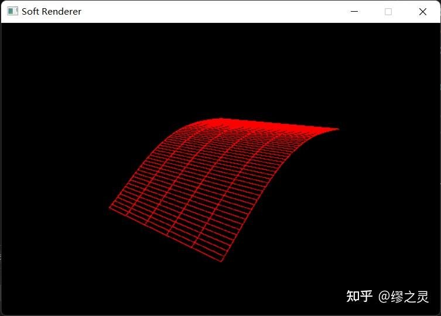

贝塞尔曲面上的一点同样可以用伯恩斯坦多项式的形式进行表达，将原来的参数 t 改写为 u 和 v 两个参数，设第 i 条的 n 阶贝塞尔曲线的第 j 个控制点为 pij ，则对于曲线上的一点 p(u)，有

p(u)=∑j=0npijBjn(u)p(u)=∑j=0npijBjn(u)对每条贝塞尔曲线执行一次计算，可以得到 m 个 p(u) ，这些点会再形成新的贝塞尔曲线，可以表示为

p(v)=∑i=0mpi(u)Bim(v)将两个公式组合起来，就可以得到求贝塞尔曲面上任意点的公式：

p(u,v)=∑i=0m[∑j=0npijBjn(u)]Bim(v)

### 三角域曲面

刚刚我们绘制的贝塞尔曲面是基于矩形的，接下来就研究一下怎么实现三角形曲面。

我们可以将三角形的每条边都均分为n份，称为n阶的三角域贝塞尔曲面，对于三角形内任意一点，可以用重心坐标法表示为 p(u,v,w) ，可以由以下计算式推得：

p(u,v,w)=∑pi,j,kBi,j,kn(u,v,w)由于 0≤i≤n ，所以 j 可以写成 n−i 的形式， k 可以写成 n−i−j ，那么上式可以改写为：

p(u,v,w)=∑i=0n∑j=0n−ipi,j,kBi,j,kn(u,v,w)这里的 n−i−j 可以写作伯恩斯坦三项展开式，它的形式如下：

Bi,j,kn(u,v,w)=n!i!j!k!uivjwk它同样具有伯恩斯坦多项式的一些基本性质，如归一性 ∑i+j+k=nBi,j,kn(u,v,w)=1 和递归性 Bi,j,kn(u,v,w)=uBi−1,j,kn−1(u,v,w)+vBi,j−1,kn−1(u,v,w)+wBi,j,k−1n−1(u,v,w) 。

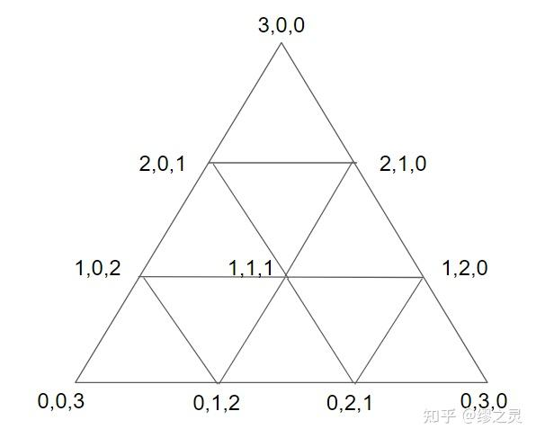

细分三角形演示，对于控制点而言，它的重心坐标等于下标除以阶数n

用双层循环进行三角形的细分，代码如下：

```cpp
TriangulateSurface(const std::vector<Vertex>& vertices, size_t tess) : vertices(vertices) {
    controlPoints.resize(tess + 1);
    for (int i = tess; i >= 0; i--) {
        float height = 3.0f * powf(sinf(i * 1.0f / M_PI), 10.0f);
        controlPoints[i].resize(tess - i + 1);
        for (int j = tess - i; j >= 0; j--) {
            int k = tess - i - j;
            Vertex controlPoint;
            controlPoint.position =
                (float)i / tess * vertices[0].position +
                (float)j / tess * vertices[1].position +
                (float)k / tess * vertices[2].position;
            controlPoint.position.y += height;
            controlPoint.color =
                (float)i / tess * vertices[0].color +
                (float)j / tess * vertices[1].color +
                (float)k / tess * vertices[2].color;
            controlPoints[i][j] = controlPoint;
        }
    }
}
```

利用伯恩斯坦多项式计算曲面上给定重心坐标的一点：

```cpp
//阶乘算法
long Factorial(size_t n) {
    long result = 1;
    for (size_t i = 1; i <= n; i++) {
        result *= i;
    }
    return result;
}

Vertex GetSurfacePoint(float u, float v, float w) {
    int n = controlPoints.size() - 1;
    Vertex point;
    for (int i = n; i >= 0; i--) {
        for (int j = n - i; j >= 0; j--) {
            int k = n - i - j;
            float bernstein = Factorial(n) / (Factorial(i) * Factorial(j) * Factorial(k))
                * powf(u, i) * powf(v, j) * powf(w, k);
            point.position = point.position + bernstein * controlPoints[i][j].position;
            point.color = point.color + bernstein * controlPoints[i][j].color;
        }
    }
    return point;
}
```

最后以固定步长取uv值，画出这些点形成曲面：

```cpp
std::vector<Vertex> controlPoints(3);
controlPoints[0].position = Vector4f(0.0f, 0.0f, -2.0f, 1.0f);
controlPoints[1].position = Vector4f(-2.0f, 0.0f, 0.0f, 1.0f);
controlPoints[2].position = Vector4f(2.0f, 0.0f, 0.0f, 1.0f);
controlPoints[0].color = Vector4f(1.0f, 0.0f, 0.0f, 1.0f);
controlPoints[1].color = Vector4f(0.0f, 1.0f, 0.0f, 1.0f);
controlPoints[2].color = Vector4f(0.0f, 0.0f, 1.0f, 1.0f);
TriangulateSurface surface(controlPoints, 4);

for (float u = 1.0f; u > 0.0f; u -= 0.01f) {
    for (float v = 1.0f - u; v > 0.0f; v -= 0.01f) {
        Vertex point = surface.GetSurfacePoint(u, v, 1.0f - u - v);
        pipeline.SetVertexBuffer(&point, 1);
        pipeline.DrawPoint(0);
    }
}
```

最终结果：

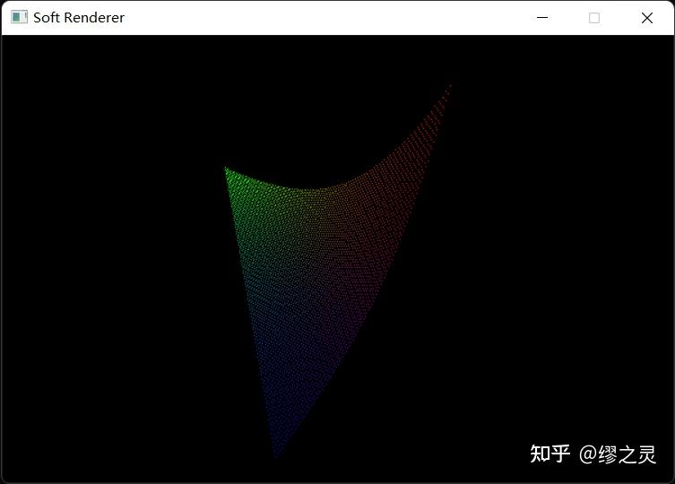

我们同样可以推导三角域曲面de Casteljau算法，将原来的计算公式展开：

p(u,v,w)=∑i=0n∑j=0n−ipi,j,kBi,j,kn(u,v,w)p(u,v,w)=p0,0,nB0,0,nn(u,v,w)+p0,1,n−1B0,1,n−1n(u,v,w)+...+p0,n,0B0,n,0n(u,v,w)+p1,0,n−1B1,0,n−1n(u,v,w)+...+pn,0,0Bn,0,0n(u,v,w)将上式用伯恩斯坦多项式的递归性展开，得到：

p(u,v,w)=p0,0,n(0+0+wB0,0,n−1n−1(u,v,w))+p0,1,n−1(0+vB0,0,n−1n−1(u,v,w)+wB0,1,n−2n−1(u,v,w))+...可以发现展开式中有相同的 B 项可以合并，例如

wB0,0,n−1n−1p0,0,n+vB0,0,n−1n−1p0,1,n−1+uB0,0,n−1n−1p1,0,n−1可以并项为

(wp0,0,n+vp0,1,n−1+up1,0,n−1)B0,0,n−1n−1这样就成功将其转化为了三角形中的一点，由此我们可以得知，将 n 阶的三角形转化为 n−1 阶的三角形，新的控制点和原来的控制点有以下关系：

pi,j,k∗=upi+1,j,k+vpi,j+1,k+wpi,j,k+1不断进行递归计算，最终会剩下一个点无法再继续转化，这个点就是我们要求的三角域曲面上的点。

代码如下：

```cpp
Vertex GetSurfacePointRecursive(const std::vector<std::vector<Vertex>>& referencePoints, float u, float v, float w) {
    int n = referencePoints.size() - 1;
    std::vector<std::vector<Vertex>> newPoints(n);
    n--;
    for (int i = n; i >= 0; i--) {
        newPoints[i].resize(n - i + 1);
        for (int j = n - i; j >= 0; j--) {
            Vertex point;
            point.position = u * referencePoints[i + 1][j].position
                + v * referencePoints[i][j + 1].position
                + w * referencePoints[i][j].position;
            point.color = u * referencePoints[i + 1][j].color
                + v * referencePoints[i][j + 1].color
                + w * referencePoints[i][j].color;
            newPoints[i][j] = point;
        }
    }
    if (n == 0)
        return newPoints[0][0];
    else
        return GetSurfacePointRecursive(newPoints, u, v, w);
}

Vertex GetSurfacePointRecursive(float u, float v, float w) {
    return GetSurfacePointRecursive(controlPoints, u, v, w);
}
```

两种方法可以计算得到相同的结果。

### PN三角形

在三角域曲面的基础上，我们可以考虑加入法线对控制点的影响，以此更加方便地控制曲面的走势，这种算法被称为**PN三角形（Point-Normal Triangles）**。

PN三角形通常只需要指定三个顶点以及其对应的法向量，然后藉此在三角形边上完成细分，这样我们就不用再去人为地指定边上的控制点，大大减轻了工作量并增加了灵活度。

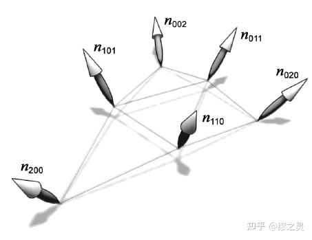

PN三角形演示

一般而言，在创建PN三角形时，我们将三角形的每条边均分成三份，对于每一个新细分出的控制点，找到与其相距最近的三角形顶点，然后将该点投影到顶点和法线所构成的平面，这个过程的图片表述如下：

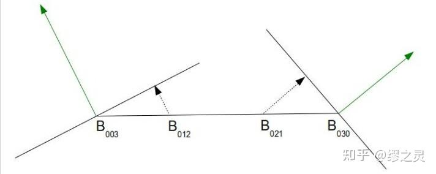

进行控制点投影的计算方法如下（注意法向量的单位化）：

p′=p−[(p−v)⋅n→]n→投影后的三角形中心的计算方法如下：

p1,1,1′=16(p0,1,2′+p0,2,1′+p1,0,2′+p2,0,1′+p1,2,0′+p2,1,0′)+13(p0,0,3+p0,3,0+p3,0,0)2所以我们总共需要完成6+1个控制点的计算，代码如下：

```cpp
TriangulateSurface(const std::vector<Vertex>& vertices) : vertices(vertices) {
    controlPoints.resize(4);
    std::vector<Vertex> newPoints;
    for (size_t i = 0; i < 3; i++) {
        Vertex p = VertexInterplote(vertices[i], vertices[(i + 1) % 3], 1.0f / 3.0f);
        float distance = Dot((p.position - vertices[i].position).GetVector3f(), vertices[i].normal);
        p.position = Vector4f((p.position.GetVector3f() - distance * vertices[i].normal), 1.0f);
        newPoints.push_back(p);

        p = VertexInterplote(vertices[i], vertices[(i + 1) % 3], 2.0f / 3.0f);
        distance = Dot((p.position - vertices[i + 1].position).GetVector3f(), vertices[i + 1].normal);
        p.position = Vector4f((p.position.GetVector3f() - distance * vertices[i + 1].normal), 1.0f);
        newPoints.push_back(p);
    }
    Vertex center;
    for (auto& p : newPoints)
        center.position = center.position + 1.0f / 6.0f * p.position;
    for (auto& v : vertices) {
        center.position = center.position + 1.0f / 3.0f * v.position;
        center.color = center.color + 1.0f / 3.0f * v.color;
    }
    center.position = 0.5f * center.position;

    controlPoints = {
        { vertices[0] },
        { newPoints[5], newPoints[0] },
        { newPoints[4], center, newPoints[1] },
        { vertices[2], newPoints[3], newPoints[2], vertices[1] }
    };
}
```

## 半边结构

**半边结构（Half-Edge）** 是一种常用于存储和遍历多边形网格的[数据结构](https://zhida.zhihu.com/search?content_id=215389663&content_type=Article&match_order=1&q=数据结构&zhida_source=entity)，适用于**流形网格（每个网格上的边最多被两个面片所共用）**，主要优势是易于存储点边面信息，容易通过循环查找到网格上一点的一环（1-ring）顶点，以及查找速度快。

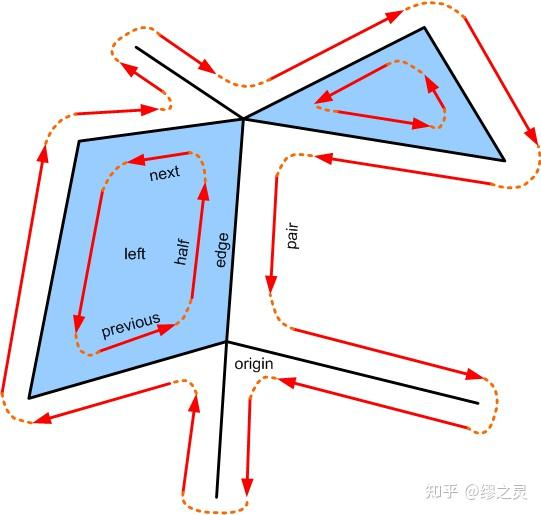

半边结构演示

半边结构的三个重要组成部分：顶点，半边，面片，代码如下所示：

```cpp
class HalfEdgeStructure {
public:
    struct HalfEdge;
    struct Face;
    struct Vertex {
        size_t id;
        ::Vertex data;
        HalfEdge* edge;
    };
    struct HalfEdge {
        size_t id;
        Vertex* vertex;
        Face* face;
        HalfEdge* opposite;
        HalfEdge* next;
    };
    struct Face {
        size_t id;
        HalfEdge* edge;
        Vector3f normal;
    };

    std::vector<std::unique_ptr<Vertex>> vertices;
    std::vector<std::unique_ptr<Face>> faces;
    std::vector<std::unique_ptr<HalfEdge>> halfEdges;
};
```

创建顶点的方法，此处仅仅为顶点指定ID，半边指针保持为空：

```cpp
Vertex* AddVertex(const ::Vertex& vertex) {
    auto vert = std::make_unique<Vertex>();
    vert->data = vertex;
    vert->id = vertices.size();
    vertices.push_back(std::move(vert));
    return vertices.rbegin()->get();
}
```

创建面片的方法，为面片上包含的所有顶点每两个之间创建半边，同时指定半边之间的顺序关系和半边对应的面片，而面片对应的半边只需要设置为第一个半边即可，因为我们可以通过一个半边推出其它的半边：

```cpp
Face* AddFace(Vertex** vertices, size_t num) {
    auto face = std::make_unique<Face>();
    std::vector<HalfEdge*> edges(num);

    for (size_t i = 0; i < num; i++) {
        edges[i] = AddEdge(vertices[i % num], vertices[(i + 1) % num]);
    }
    for (size_t i = 0; i < num; i++) {
        edges[i]->next = edges[(i + 1) % num];
        edges[i]->face = face.get();
    }
    face->edge = edges[0];
    face->normal = Cross((vertices[1]->data.position - vertices[0]->data.position).GetVector3f(),
        (vertices[2]->data.position - vertices[1]->data.position).GetVector3f()).Normalize();

    face->id = faces.size();
    faces.push_back(std::move(face));
    return faces.rbegin()->get();
}
```

创建半边的方法，遍历所有已经存在的半边，如果找到了就使用已经存在的半边，如果没有找到相同的就创造新的半边。半边在创建时通常是成对的，也就是说我们在创建时不但会创建正向的那一边，也会同时创建出反向的那一边，注意这个方法成立的前提是所有面片上顶点绕序相同：

```cpp
HalfEdge* AddEdge(Vertex* v0, Vertex* v1) {
    for (size_t i = 0; i < halfEdges.size(); i++) {
        if (halfEdges[i]->vertex->id == v1->id && halfEdges[i]->opposite->vertex->id == v0->id) {
            return halfEdges[i].get();
        }
    }

    auto edge = std::make_unique<HalfEdge>();
    auto edge_op = std::make_unique<HalfEdge>();

    edge->vertex = v1;
    edge->opposite = edge_op.get();
    edge->id = halfEdges.size();
    v0->edge = edge.get();
    edge_op->vertex = v0;
    edge_op->opposite = edge.get();
    edge->id = halfEdges.size() + 1;

    halfEdges.push_back(std::move(edge));
    halfEdges.push_back(std::move(edge_op));

    return (halfEdges.rbegin() + 1)->get();
}
```

可以使用哈希表来加速对半边的查找，添加EdgeKey键值和用于查找的edgeMap无序映射表：

```cpp
struct EdgeKey {
    EdgeKey() {}
    EdgeKey(size_t v0, size_t v1) : v0(v0), v1(v1) {}
    struct Hash {
        size_t operator()(const EdgeKey& key)const {
            return std::hash<size_t>()(key.v0) ^ std::hash<size_t>()(key.v1);
        }
    };
    bool operator==(const EdgeKey& key)const {
        return v0 == key.v0 && v1 == key.v1;
    }
    size_t v0, v1;
};

std::unordered_map<EdgeKey, HalfEdge*, EdgeKey::Hash> edgeMap;
```

将AddEdge函数的代码进行修改：

```cpp
HalfEdge* AddEdge(Vertex* v0, Vertex* v1) {
    EdgeKey key(v0->id, v1->id);
    if (edgeMap.find(key) != edgeMap.end()) {
        return edgeMap[key];
    }

    auto edge = std::make_unique<HalfEdge>();
    auto edge_op = std::make_unique<HalfEdge>();

    edge->vertex = v1;
    edge->opposite = edge_op.get();
    edge->id = halfEdges.size();
    v0->edge = edge.get();
    edge_op->vertex = v0;
    edge_op->opposite = edge.get();
    edge->id = halfEdges.size() + 1;

    halfEdges.push_back(std::move(edge));
    halfEdges.push_back(std::move(edge_op));

    edgeMap[EdgeKey(v0->id, v1->id)] = (halfEdges.rbegin() + 1)->get();
    edgeMap[EdgeKey(v1->id, v0->id)] = halfEdges.rbegin()->get();

    return edgeMap[EdgeKey(v0->id, v1->id)];
}
```

以上，我们完成了半边结构的建立，接下来就可以开始愉快地使用了！

获取顶点的相邻半边的方法，先沿着最初的一条半边开始顺序访问，回到原点之后沿着反向半边继续访问，若遇到边界（没有继续连接着的半边）则回到最初的半边开始逆序访问：

```cpp
std::vector<HalfEdge*> GetEdgesFromVertex(const Vertex* vertex)const {
    std::vector<HalfEdge*> edges;
    HalfEdge* edge = vertex->edge;
    edges.push_back(edge);
    size_t primeID = edge->vertex->id;
    bool isBoundarty = true;

    while (true) {
        edge = edge->next;
        if (!edge) break;
        if (edge->vertex->id == primeID) {
            isBoundarty = false;
            break;
        }
        if (edge->vertex->id == vertex->id) {
            edge = edge->opposite;
            edges.push_back(edge);
        }
    }
    if (isBoundarty) {
        edge = vertex->edge->opposite;
        while (true) {
            edge = edge->next;
            if (!edge) break;
            edges.push_back(edge);
            if (edge->vertex->id = vertex->id) {
                edge = edge->opposite;
                edges.push_back(edge);
            }
        }
    }
    return edges;
}
```

获取顶点相邻的所有面片的方法，借助上面已经实现的获取相邻半边的方法，记录所有半边对应的面片即可：

```cpp
std::vector<Face*> GetFacesFromVertex(const Vertex* vertex)const {
    std::vector<Face*> faces;
    auto edges = GetEdgesFromVertex(vertex);
    for (auto& edge : edges) {
        faces.push_back(edge->face);
    }
    return faces;
}
```

获取面片上所有顶点的方法，这个实现比较简单，只需要沿着初始半边顺序遍历然后记录所有顶点即可：

```cpp
std::vector<Vertex*> GetVerticesFromFace(const Face* face)const {
    std::vector<Vertex*> vertices;
    HalfEdge* edge = face->edge;
    size_t primeID = edge->vertex->id;
    do {
        edge = edge->next;
        vertices.push_back(edge->vertex);
    } while (edge->vertex->id != primeID);
    return vertices;
}
```

获取半边两端顶点的方法，由于边界半边的另一侧半边没有指定顶点，所以不能直接使用opposite->vertex的方法获取，可以借助GetVerticesFromFace完成这一操作：

```cpp
std::vector<Vertex*> GetVerticesFromEdge(const HalfEdge* edge)const {
    std::vector<Vertex*> vertices;
    auto faceVert = GetVerticesFromFace(edge->face);
    for (size_t i = 0; i < faceVert.size(); i++) {
        if (faceVert[i]->id == edge->vertex->id) {
            vertices.push_back(faceVert[i == 0 ? faceVert.size() - 1 : i - 1]);
            vertices.push_back(faceVert[i]);
        }
    }
    return vertices;
}
```

获取顶点的相邻顶点的方法，首先获取顶点的相邻面，然后再依次记录相邻面上的顶点，同时避免重复记录相同顶点：

```cpp
std::vector<Vertex*> GetNeighborVertices(const Vertex* vertex)const {
    std::vector<Vertex*> neighbors;
    auto faces = GetFacesFromVertex(vertex);
    for (auto& face : faces) {
        auto vertices = GetVerticesFromFace(face);
        for (auto& vert : vertices) {
            bool isInsert = true;
            for (auto& neighbor : neighbors) {
                if (vert->id == neighbor->id)
                    isInsert = false;
            }
            if (isInsert && vert->id != vertex->id) {
                neighbors.push_back(vert);
            }
        }
    }
    return neighbors;
}
```

## 细分

细分是[计算几何](https://zhida.zhihu.com/search?content_id=215389663&content_type=Article&match_order=1&q=计算几何&zhida_source=entity)当中的重要思想，也是[游戏引擎](https://zhida.zhihu.com/search?content_id=215389663&content_type=Article&match_order=1&q=游戏引擎&zhida_source=entity)中用于实现LOD的主要方法，在现代[图形学](https://zhida.zhihu.com/search?content_id=215389663&content_type=Article&match_order=1&q=图形学&zhida_source=entity)API中，往往都会有专门的管线阶段提供给图形细分操作，这些操作也有对应得着色器实现，例如HLSL中的外壳着色器，曲面着色器，域着色器和GLSL中的[曲面细分](https://zhida.zhihu.com/search?content_id=215389663&content_type=Article&match_order=1&q=曲面细分&zhida_source=entity)着色器，不过在软渲染器中这些操作都得由我们自己来实现。下面就对一些常用的细分算法进行讲解。

### Loop细分

**Loop细分（Loop Subdivision）** 是一种广泛用于三角形面的细分方法，它的基本思想是往三角形中插入新的顶点，而新插入的顶点和原来的顶点使用不同的方法计算出各自的新坐标，再把细分后的图形用重新计算过的坐标绘制出来。

在一条边上插入新的顶点，我们在找到与这条边相邻的两个三角形，并用这两个三角形上的四个顶点推算新顶点的坐标，如下图所示：

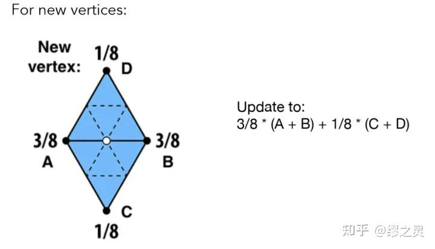

New Vertex（图片来自GAMES101）

这里白色的点就是新的顶点，其坐标为周围四个顶点的加权平均。假如新的顶点在边界边上，只有一个相邻的三角形，那么直接将边上的两个顶点坐标进行平均就是新的顶点坐标。

在边界插入顶点的代码如下：

```cpp
auto edge = originEdge.second.get();
auto v0 = edge->next->next->vertex;
auto v1 = edge->vertex;
HalfEdgeStructure::EdgeKey key(v0->id, v1->id);

Vertex newVertex;
newVertex.position = 0.5f * (v0->data.position + v1->data.position);
newVertex.color = 0.5f * (v0->data.color + v1->data.color);
```

在内部插入顶点的代码如下：

```cpp
auto v2 = edge->next->vertex;
auto v3 = edge->opposite->next->vertex;
Vertex newVertex;
newVertex.position = 3.0f / 8.0f * (v0->data.position + v1->data.position)
    + 1.0f / 8.0f * (v2->data.position + v3->data.position);
newVertex.color = 3.0f / 8.0f * (v0->data.color + v1->data.color)
    + 1.0f / 8.0f * (v2->data.color + v3->data.color);
```

对于原来的顶点，要做的更加复杂一点，我们需要找到邻近的所有三角形，如下图所示：

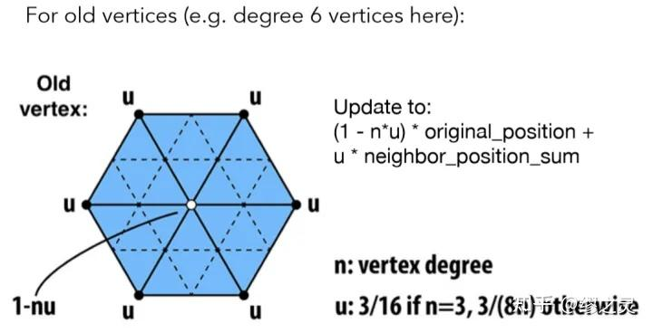

Old Vertex（图片来自GAMES101）

这里的vertex degree指定是该顶点被几个三角形所共用，如果共用的三角形数量越多，那么每个三角形能对顶点造成的影响也就越小。

```cpp
Vertex newVertex;

auto neighborVertices = originMesh->GetNeigborVertices(originVertex.get());
size_t n = neighborVertices.size();
float u = n == 3 ? 3.0f / 16.0f : 3.0f / (8.0f * n);

newVertex.position = (1.0f - n * u) * originVertex->data.position;
newVertex.color = (1.0f - n * u) * originVertex->data.color;

for (auto& neighbor : neighborVertices) {
    newVertex.position = newVertex.position + u * neighbor->data.position;
    newVertex.color = newVertex.color + u * neighbor->data.color;
}
```

Loop细分的完整代码如下：

```cpp
std::unique_ptr<HalfEdgeStructure> LoopSubdivision(HalfEdgeStructure* originMesh) {
    auto resultMesh = std::make_unique<HalfEdgeStructure>();

    //用于存储新的顶点
    std::vector<HalfEdgeStructure::Vertex*> newVertices;

    //遍历并更新所有的旧顶点
    for (auto& originVertex : originMesh->GetVertices()) {
        Vertex newVertex;

        auto neighborVertices = originMesh->GetNeighborVertices(originVertex);
        size_t n = neighborVertices.size();
        float u = n == 3 ? 3.0f / 16.0f : 3.0f / (8.0f * n);

        newVertex.position = (1.0f - n * u) * originVertex->data.position;
        newVertex.color = (1.0f - n * u) * originVertex->data.color;

        for (auto& neighbor : neighborVertices) {
            newVertex.position = newVertex.position + u * neighbor->data.position;
            newVertex.color = newVertex.color + u * neighbor->data.color;
        }

        auto vert = resultMesh->AddVertex(newVertex);
        newVertices.push_back(vert);
    }

    //建立无序映射表用于存储新顶点和边的映射关系
    std::unordered_map<HalfEdgeStructure::EdgeKey, HalfEdgeStructure::Vertex*, HalfEdgeStructure::EdgeKey::Hash> vertexMap;

    //遍历每条半边并建立新的顶点
    for (auto& edge : originMesh->GetHalfEdges()) {
        auto v0 = edge->next->next->vertex;
        auto v1 = edge->vertex;
        HalfEdgeStructure::EdgeKey key(v0->id, v1->id);

        //防止重复建立
        if (vertexMap.find(key) != vertexMap.end()) continue;

        if (!edge->opposite->face) {    //边界插入点
            Vertex newVertex;
            newVertex.position = 0.5f * (v0->data.position + v1->data.position);
            newVertex.color = 0.5f * (v0->data.color + v1->data.color);

            auto vert = resultMesh->AddVertex(newVertex);
            vertexMap[HalfEdgeStructure::EdgeKey(v0->id, v1->id)] = vert;
            vertexMap[HalfEdgeStructure::EdgeKey(v1->id, v0->id)] = vert;
        }
        else {  //内部插入点
            auto v2 = edge->next->vertex;
            auto v3 = edge->opposite->next->vertex;
            Vertex newVertex;
            newVertex.position = 3.0f / 8.0f * (v0->data.position + v1->data.position)
                + 1.0f / 8.0f * (v2->data.position + v3->data.position);
            newVertex.color = 3.0f / 8.0f * (v0->data.color + v1->data.color)
                + 1.0f / 8.0f * (v2->data.color + v3->data.color);

            auto vert = resultMesh->AddVertex(newVertex);
            vertexMap[HalfEdgeStructure::EdgeKey(v0->id, v1->id)] = vert;
            vertexMap[HalfEdgeStructure::EdgeKey(v1->id, v0->id)] = vert;
        }
    }

    //遍历每个面片并为所有顶点重新建立拓扑关系（1个面片->4个面片）
    for (auto& face : originMesh->GetFaces()) {
        HalfEdgeStructure::HalfEdge* edges[3];
        edges[0] = face->edge;
        edges[1] = edges[0]->next;
        edges[2] = edges[1]->next;

        //将新产生的顶点相连组成一个面片
        HalfEdgeStructure::Vertex* center[3];
        for (size_t i = 0; i < 3; i++) {
            auto key = HalfEdgeStructure::EdgeKey(edges[i]->vertex->id, edges[(i + 2) % 3]->vertex->id);
            center[i] = vertexMap[key];
        }
        resultMesh->AddFace(center, 3);

        //每两个新顶点和一个旧顶点相连组成一个面片
        for (size_t i = 0; i < 3; i++) {
            HalfEdgeStructure::Vertex* triVertex[3];
            triVertex[0] = newVertices[edges[(i + 2) % 3]->vertex->id];
            triVertex[1] = center[i];
            triVertex[2] = center[(i + 2) % 3];
            resultMesh->AddFace(triVertex, 3);
        }
    }

    return std::move(resultMesh);
}
```

最终结果：

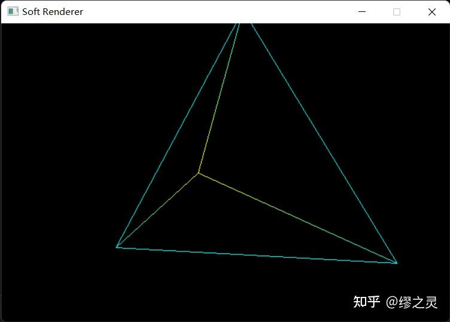

原始网格（经过缩小）

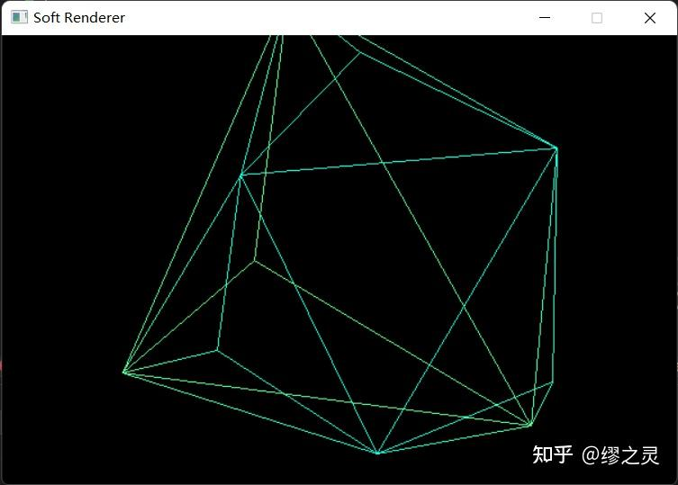

1次细分

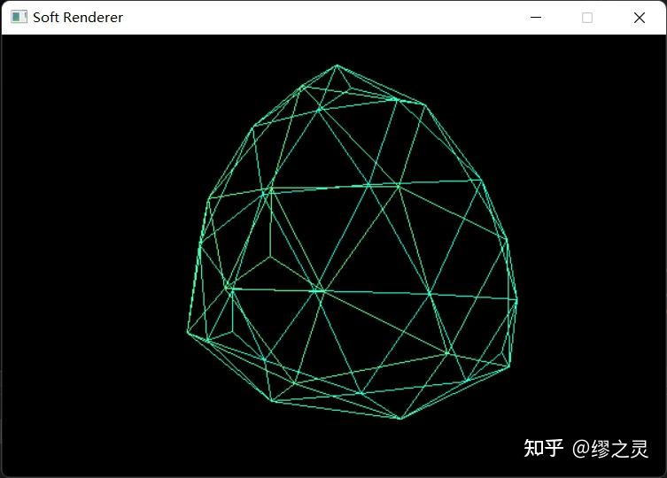

2次细分

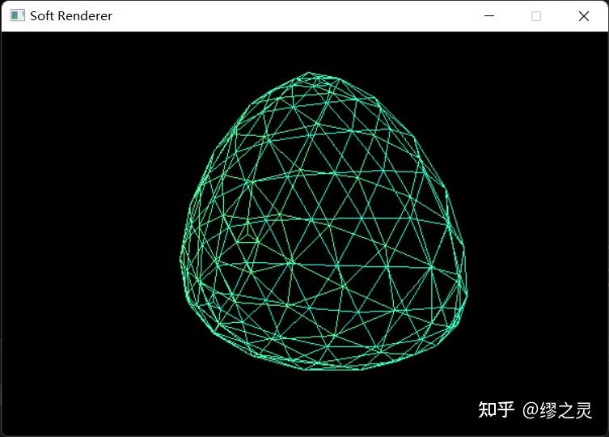

3次细分

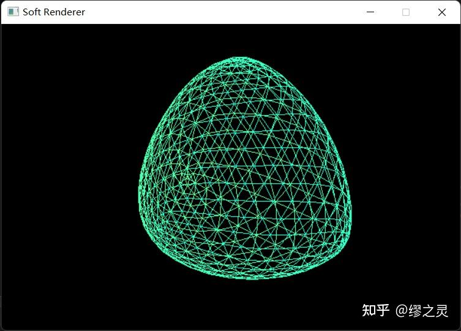

4次细分

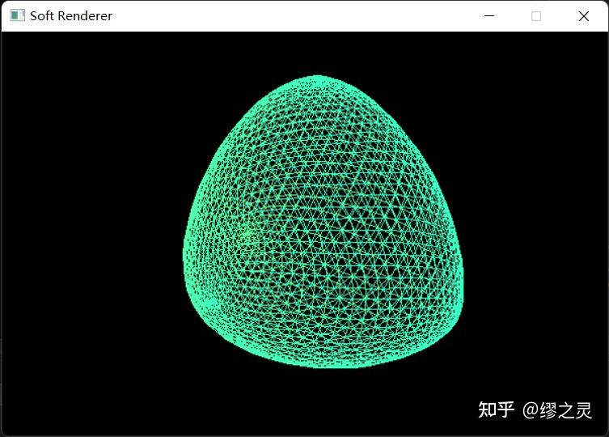

5次细分

### Catmull-Clark细分

Loop细分只能用于三角形网格，而对于通常的多边形网格我们需要使用**Catmull-Clark细分（Catmull-Clark Subdivision）** 方法。

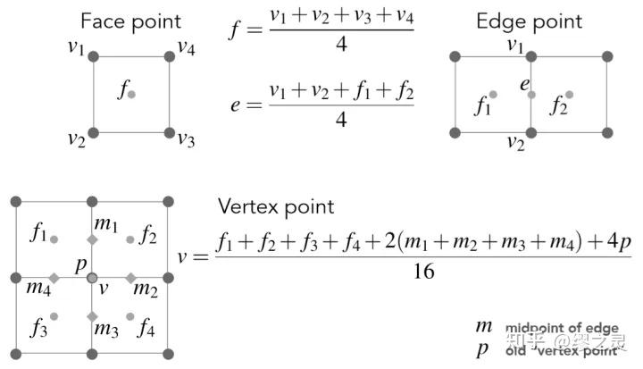

Catmull-Clark细分演示（图片来自GAMES101）

在该细分方法中，我们首先在每个面当中建立一个新点，它由面上的所有顶点平均得到；接着在每条边的中点处建立一个新点，它由相邻的边端点和面中点平均得到；最后用已经建立的新顶点更新所有原来的顶点，将面顶点，边中点和面中心的点相连接，得到细分后的网格。每经过一次细分，n边形面片就会被切分成n个四边形面片。

Catmull-Clark细分的完整代码如下：

```cpp
std::unique_ptr<HalfEdgeStructure> CatmullClarkSubdivision(HalfEdgeStructure* originMesh) {
    auto resultMesh = std::make_unique<HalfEdgeStructure>();

    //遍历所有面片并建立面中心点
    std::unordered_map<HalfEdgeStructure::EdgeKey, HalfEdgeStructure::Vertex*, HalfEdgeStructure::EdgeKey::Hash> faceVertMap;
    for (auto& face : originMesh->GetFaces()) {
        Vertex newVertex;

        auto faceVert = originMesh->GetVerticesFromFace(face);
        size_t n = faceVert.size();
        for (auto& v : faceVert) {
            newVertex.position = newVertex.position + v->data.position;
            newVertex.color = newVertex.color + v->data.color;
        }
        newVertex.position = 1.0f / n * newVertex.position;
        newVertex.color = 1.0f / n * newVertex.color;

        auto vert = resultMesh->AddVertex(newVertex);
        for (size_t i = 0; i < n; i++) {
            faceVertMap[HalfEdgeStructure::EdgeKey(faceVert[i]->id, faceVert[(i + 1) % n]->id)] = vert;
        }
    }

    //遍历所有半边并建立边中心点
    std::unordered_map<HalfEdgeStructure::EdgeKey, HalfEdgeStructure::Vertex*, HalfEdgeStructure::EdgeKey::Hash> edgeVertMap;
    for (auto& edge : originMesh->GetHalfEdges()) {
        auto edgeVert = originMesh->GetVerticesFromEdge(edge);
        auto v0 = edgeVert[0];
        auto v1 = edgeVert[1];
        if (edgeVertMap.find(HalfEdgeStructure::EdgeKey(v0->id, v1->id)) != edgeVertMap.end()) continue;

        size_t count = 2;
        Vertex newVertex;
        newVertex.position = v0->data.position + v1->data.position;
        newVertex.color = v0->data.color + v1->data.color;

        //是否存在面片中心点
        if (faceVertMap.find(HalfEdgeStructure::EdgeKey(v0->id, v1->id)) != faceVertMap.end()) {
            newVertex.position = newVertex.position + faceVertMap[HalfEdgeStructure::EdgeKey(v0->id, v1->id)]->data.position;
            newVertex.color = newVertex.color + faceVertMap[HalfEdgeStructure::EdgeKey(v0->id, v1->id)]->data.color;
            count++;
        }
        if (faceVertMap.find(HalfEdgeStructure::EdgeKey(v1->id, v0->id)) != faceVertMap.end()) {
            newVertex.position = newVertex.position + faceVertMap[HalfEdgeStructure::EdgeKey(v1->id, v0->id)]->data.position;
            newVertex.color = newVertex.color + faceVertMap[HalfEdgeStructure::EdgeKey(v1->id, v0->id)]->data.color;
            count++;
        }
        newVertex.position = 1.0f / count * newVertex.position;
        newVertex.color = 1.0f / count * newVertex.color;

        auto vert = resultMesh->AddVertex(newVertex);
        edgeVertMap[HalfEdgeStructure::EdgeKey(v0->id, v1->id)] = vert;
        edgeVertMap[HalfEdgeStructure::EdgeKey(v1->id, v0->id)] = vert;
    }

    //遍历并更新所有的旧顶点
    std::vector<HalfEdgeStructure::Vertex*> newVertices;
    for (auto& vertex : originMesh->GetVertices()) {
        size_t count = 4;
        Vertex newVertex;
        newVertex.position = 4.0f * vertex->data.position;
        newVertex.color = 4.0f * vertex->data.color;

        auto edges = originMesh->GetEdgesFromVertex(vertex);
        for (auto& edge : edges) {
            auto& edgeVert = edgeVertMap[HalfEdgeStructure::EdgeKey(vertex->id, edge->vertex->id)]->data;
            newVertex.position = newVertex.position + 2.0f * edgeVert.position;
            newVertex.color = newVertex.color + 2.0f * edgeVert.color;
            count += 2;

            auto& faceVert = faceVertMap[HalfEdgeStructure::EdgeKey(vertex->id, edge->vertex->id)]->data;
            newVertex.position = newVertex.position + faceVert.position;
            newVertex.color = newVertex.color + faceVert.color;
            count++;
        }
        newVertex.position = 1.0f / count * newVertex.position;
        newVertex.color = 1.0f / count * newVertex.color;

        auto vert = resultMesh->AddVertex(newVertex);
        newVertices.push_back(vert);
    }

    //遍历每个面片并为所有顶点重新建立拓扑关系（n边形面->n个四边形面）
    for (auto& face : originMesh->GetFaces()) {
        auto faceVert = originMesh->GetVerticesFromFace(face);
        auto center = faceVertMap[HalfEdgeStructure::EdgeKey(faceVert[0]->id, faceVert[1]->id)];
        size_t n = faceVert.size();

        for (size_t i = 0; i < n; i++) {
            HalfEdgeStructure::Vertex* vertices[] = {
                newVertices[faceVert[i]->id],
                edgeVertMap[HalfEdgeStructure::EdgeKey(faceVert[i]->id, faceVert[(i + 1) % n]->id)],
                center,
                edgeVertMap[HalfEdgeStructure::EdgeKey(faceVert[i == 0 ? n - 1 : i - 1]->id, faceVert[i]->id)],
            };
            resultMesh->AddFace(vertices, 4);
        }
    }

    return std::move(resultMesh);
}
```

原始网格顶点和绕序如下：

```cpp
Vertex originVert[8];
originVert[0].position = Vector4f(-1.0f, 1.0f, 1.0f, 1.0f);
originVert[1].position = Vector4f(-1.0f, -1.0f, 1.0f, 1.0f);
originVert[2].position = Vector4f(1.0f, -1.0f, 1.0f, 1.0f);
originVert[3].position = Vector4f(1.0f, 1.0f, 1.0f, 1.0f);
originVert[4].position = Vector4f(1.0f, -1.0f, -1.0f, 1.0f);
originVert[5].position = Vector4f(1.0f, 1.0f, -1.0f, 1.0f);
originVert[6].position = Vector4f(-1.0f, -1.0f, -1.0f, 1.0f);
originVert[7].position = Vector4f(-1.0f, 1.0f, -1.0f, 1.0f);
originVert[0].color = Vector4f(0.0f, 1.0f, 0.8f, 1.0f);
originVert[1].color = Vector4f(0.0f, 1.0f, 0.8f, 1.0f);
originVert[2].color = Vector4f(0.0f, 1.0f, 0.8f, 1.0f);
originVert[3].color = Vector4f(0.0f, 1.0f, 0.8f, 1.0f);
originVert[4].color = Vector4f(0.0f, 0.0f, 0.8f, 1.0f);
originVert[5].color = Vector4f(0.0f, 0.0f, 0.8f, 1.0f);
originVert[6].color = Vector4f(0.0f, 0.0f, 0.8f, 1.0f);
originVert[7].color = Vector4f(0.0f, 0.0f, 0.8f, 1.0f);

size_t inputFaces[6][4] = {
    {0, 1, 2, 3},
    {3, 2, 4, 5},
    {5, 4, 6, 7},
    {7, 0, 3, 5},
    {7, 6, 1, 0},
    {1, 6, 4, 2}
};
```

最终结果：

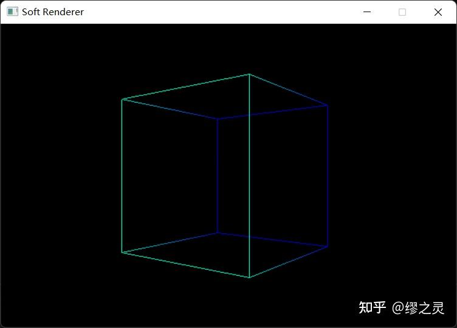

原始网格（经过缩小）

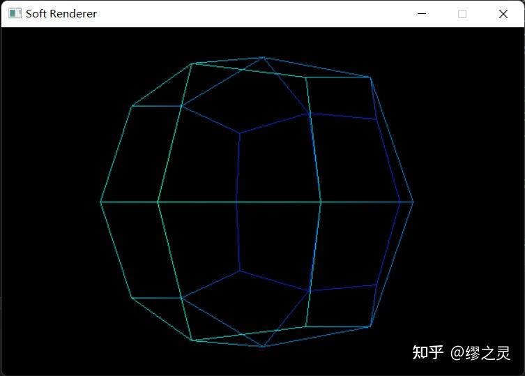

1次细分

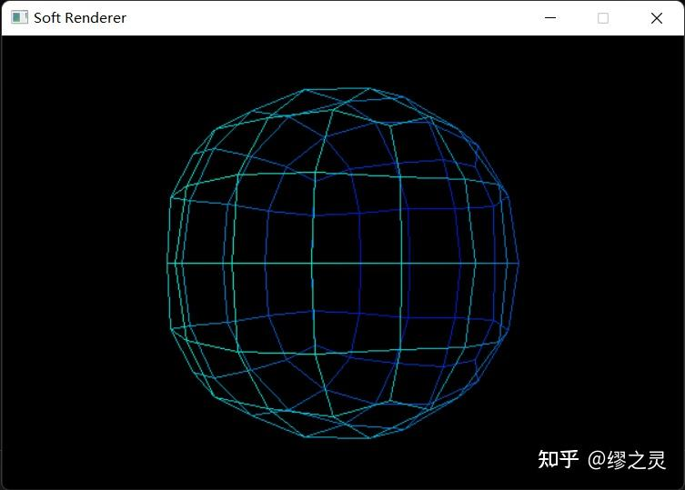

2次细分

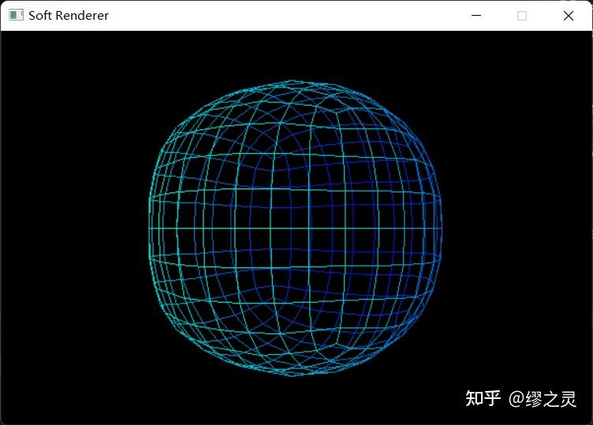

3次细分

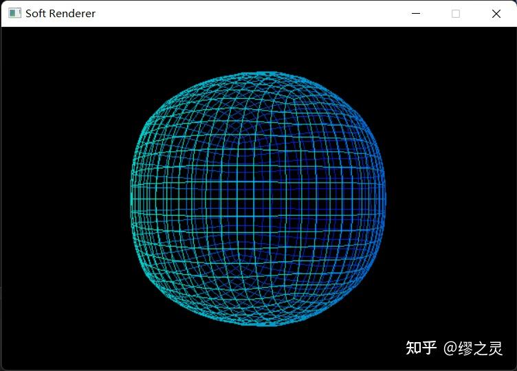

4次细分

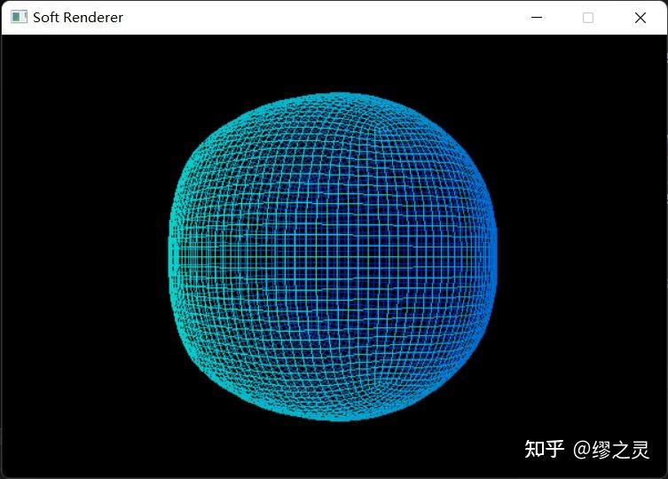

5次细分

## 细节层次（LOD）和网格简化

LOD（Level of Detail，细节层次）是游戏引擎中用于场景优化的一个重要手段，包括Mipmap和网格简化技术（几何形变LOD）都在LOD中被广泛应用。LOD的基本思想是对于一些重要的部分用非常精细的方法进行绘制，而对于那些不重要的部分则极度简化以求最小开销，有以下两种LOD方法：

- **静态LOD**是指在渲染之前就提前人为创建好不同的LOD层次，在渲染的时候根据需求选择一个设置好的层次。
- **动态LOD**是指在渲染时根据具体的情况再自动计算LOD，这样就可以实现**连续细节层次（Continuous LOD）** 而非离散的静态LOD，常用的判断LOD的方法有**View-Dependent**，根据场景和摄像机的距离，越近就采用越精细的LOD层次。

在LOD中，出于性能考求，我们不仅会遇到需要细分网格的情况，也会遇到需要简化网格的情况，目的是在将误差尽可能减小的情况下减轻绘制网格所需要的开销，下面演示一些基于半边结构的网格简化方式：

### 删除网格中的顶点

向半边结构中添加删除顶点的方法：首先获取与顶点相邻的半边，记录下这些半边的索引以便之后删除，将无序映射表中的键值对删除：

```cpp
std::vector<size_t> deleteEdgeID;
auto neighborEdge = GetEdgesFromVertex(vertex);
for (auto& edge : neighborEdge) {
    deleteEdgeID.push_back(edge->id);
    deleteEdgeID.push_back(edge->opposite->id);
    edgeMap.erase(EdgeKey(vertex->id, edge->vertex->id));
    edgeMap.erase(EdgeKey(edge->vertex->id, vertex->id));
}
```

将和顶点相邻的面移除，这里我选择直接将unique_ptr设为空指针并删除指向的内存，在获取要绘制的面片时可以直接跳过空指针：

```cpp
auto faces = GetFacesFromVertex(vertex);
for (auto& face : faces)
    this->faces[face->id].reset(nullptr);
```

检查删除掉的点周围的一圈顶点是否满足构成一个新面片的条件，如果满足就创建出一个新的面片：

```cpp
std::vector<Vertex*> neighbors;
HalfEdge* edge = vertex->edge;
neighbors.push_back(edge->vertex);
size_t primeID = edge->vertex->id;
bool newFace = false;
while (true) {
    edge = edge->next;
    if (!edge) break;
    if (edge->vertex->id == primeID) {
        newFace = true;
        break;
    }
    if (edge->vertex->id == vertex->id) {
        edge = edge->opposite;
        continue;
    }
    neighbors.push_back(edge->vertex);
}
//防止有顶点失去指向的边
for (size_t i = 0; i < neighbors.size(); i++) {
    neighbors[i]->edge = edgeMap[EdgeKey(neighbors[i]->id, neighbors[(i + 1) % neighbors.size()]->id)];
}
if (newFace)
    AddFace(neighbors.data(), neighbors.size());
```

最后完成所有半边和顶点的删除：

```cpp
for (auto& id : deleteEdgeID)
    halfEdges[id].reset(nullptr);
vertices[vertex->id].reset(nullptr);
```

### 边坍缩

**边坍缩（Edge Collapsing）** 是一种常用的网格简化方法，它的基本操作是将一条边上的两个顶点合成为一个顶点，这样整个网格的边数就会发生减少。

首先修改顶点相邻的半边，将它们的端点设成新添加的顶点。

```cpp
auto newVert = AddVertex(v);
for (auto& edge : GetEdgesFromVertex(v0)) {
    if (edge->vertex->id != v1->id) {
        edgeMap.erase(EdgeKey(v0->id, edge->vertex->id));
        edgeMap.erase(EdgeKey(edge->vertex->id, v0->id));
        edge->opposite->vertex = newVert;
        edgeMap[EdgeKey(newVert->id, edge->vertex->id)] = edge;
        edgeMap[EdgeKey(edge->vertex->id, newVert->id)] = edge->opposite;
    }
}
for (auto& edge : GetEdgesFromVertex(v1)) {
    if (edge->vertex->id != v0->id) {
        edgeMap.erase(EdgeKey(v1->id, edge->vertex->id));
        edgeMap.erase(EdgeKey(edge->vertex->id, v1->id));
        edge->opposite->vertex = newVert;
        edgeMap[EdgeKey(newVert->id, edge->vertex->id)] = edge;
        edgeMap[EdgeKey(edge->vertex->id, newVert->id)] =  edge->opposite;
    }
}
```

接下来修改需要删除的半边相邻的面片，如果面片为三角形，则在顶点合并后会发生退化，不必再新建：

```cpp
HalfEdge* deleteEdge = edgeMap[EdgeKey(v0->id, v1->id)];
auto face = deleteEdge->face;
if (face) {
    if (GetVerticesFromFace(face).size() > 3) {
        std::vector<Vertex*> faceVert;
        for (auto& v : GetVerticesFromFace(face)) {
            if (v->id != v0->id && v->id != v1->id)
                faceVert.push_back(v);
        }
        AddFace(faceVert.data(), faceVert.size());
    }
    faces[face->id].reset(nullptr);
}
face = deleteEdge->opposite->face;
if (face) {
    if (GetVerticesFromFace(face).size() > 3) {
        std::vector<Vertex*> faceVert;
        for (auto& v : GetVerticesFromFace(face)) {
            if (v->id != v0->id && v->id != v1->id)
                faceVert.push_back(v);
        }
        AddFace(faceVert.data(), faceVert.size());
    }
    faces[face->id].reset(nullptr);
}
```

完成赘余的半边和顶点的删除：

```cpp
edgeMap.erase(EdgeKey(v0->id, v1->id));
edgeMap.erase(EdgeKey(v1->id, v0->id));
halfEdges[deleteEdge->opposite->id].reset(nullptr);
halfEdges[deleteEdge->id].reset(nullptr);

vertices[v0->id].reset(nullptr);
vertices[v1->id].reset(nullptr);
```

### 二次误差度量

在整个网格中不同的边对于模型的重要程度肯定有大有小，对不同边进行坍缩操作所造成的影响也各不相同，这也就是边坍缩所产生的代价。我们对边的坍缩是一个不断迭代的过程，显然最合适的方法就是在每次迭代过程中都选取产生代价最小的一条边进行坍缩，为了计算这个代价，我们需要引入一个新的概念**二次误差度量（Quadric Error Metrics）**，也就是用顶点和它相邻面的距离平方计算得到误差值。

对于网格上的任一顶点 v ，和它相邻的面可以定义在一个[平面方程](https://zhida.zhihu.com/search?content_id=215389663&content_type=Article&match_order=1&q=平面方程&zhida_source=entity) ax+by+cz+d=0 上，设平面上的单位法向量为 n→ ，则有：

n→=(a,b,c)d=−(avx+bvy+cvz)=−n→⋅v平面外一点 v′ 到平面的距离可以用如下方法计算：

distance=av′x+bv′y+cv′z+d如果我们把 v′ 当成齐次坐标 (v′x,v′y,v′z,1) ，设 p=(a,b,c,d) ，那么距离计算公式还可以简写为：

distance=v′pT用 plane(v) 表示顶点相邻面的集合，将 v 转换为 v′ ，其二次误差的计算式可以表示为：

Δ(v→v′)=∑plane(v)(v′pT)2=v′(∑plane(v)pTp)v′T可以将 p 左乘自身的转置的结果写成一个代价矩阵，如下所示：

Kv=pTp=[a2abacadabb2bcbdacbcc2cdadbdcdd2]所以最终我们的代价矩阵就是所有顶点相邻平面的误差矩阵之和：

Q(v)=∑plane(v)Kv这样，在对每一对顶点进行预处理时，我们可以按照以上方法计算矩阵 Q(v) 进行误差度量，对于一对顶点，我们将坍缩产生的误差简单定义为它们各自的代价矩阵之和：

Δ(v)=Δ(v0→v)+Δ(v1→v)=v(Q(v0)+Q(v1))vT=vQvT计算面片代价矩阵的代码如下：

```cpp
std::vector<Matrix4x4f> faceQuadric;
for (auto& face : originMesh->GetFaces()) {
    float d = -Dot(face->normal, face->edge->vertex->data.position.GetVector3f());
    faceQuadric.push_back(Matrix4x4f(
        Vector4f(face->normal.x * face->normal.x, face->normal.x * face->normal.y, face->normal.x * face->normal.z, face->normal.x * d),
        Vector4f(face->normal.x * face->normal.y, face->normal.y * face->normal.y, face->normal.y * face->normal.z, face->normal.y * d),
        Vector4f(face->normal.x * face->normal.z, face->normal.y * face->normal.z, face->normal.z * face->normal.z, face->normal.z * d),
        Vector4f(face->normal.x * d, face->normal.y * d, face->normal.z * d, d * d)
    ));
}
```

计算顶点相邻面的代价矩阵之和的代码如下：

```cpp
std::vector<Matrix4x4f> vertexQuadric;
for (auto& vertex : originMesh->GetVertices()) {
    auto faces = originMesh->GetFacesFromVertex(vertex.get());
    Matrix4x4f Q;
    for (auto& face : faces) {
        Q = Q + faceQuadric[face->id];
    }
    vertexQuadric.push_back(Q);
}
```

在边坍缩时，计算我们要将新点放在哪里才可以使误差降到最小，也就是计算 vQvT 的最小值，由极值的性质可以知道，极小值处求偏导为0，即：

∂Δ(v)∂x=∂Δ(v)∂y=∂Δ(v)∂z=0转化为求解一个矩阵方程的形式如下：

[xyz1][a2abac0abb2bc0acbcc20adbdcd1]=[0001]A=[a2abac0abb2bc0acbcc20adbdcd1]若矩阵 A 可逆，则可以解出矩阵方程 v=[0001]A−1 ，该点为最优解；若其不可逆，则可以求其伪逆，或者简单点直接将 v 表示为边上中点 v0+v12 。

代码如下：

```cpp
std::priority_queue<EdgeRecord> edgeRecords;
for (auto& edge : originMesh->GetHalfEdges()) {
    auto vertices = originMesh->GetVerticesFromEdge(edge);
    Matrix4x4f quadric = vertexQuadric[vertices[0]->id] + vertexQuadric[vertices[1]->id];
    quadric.a4 = 0.0f; quadric.b4 = 0.0f; quadric.c4 = 0.0f; quadric.d4 = 1.0f;

    EdgeRecord record;
    record.vertex = VertexInterplote(vertices[0]->data, vertices[1]->data, 0.5f);
    if (quadric.Determinant() < 1e-6f) {
        record.vertex.position = 0.5f * (vertices[0]->data.position + vertices[1]->data.position);
    }
    else {
        record.vertex.position = Multiply(Vector4f(0.0f, 0.0f, 0.0f, 1.0f), quadric.Inverse());
    }
    record.quadric = Dot(Multiply(record.vertex.position, quadric), record.vertex.position);
    record.edge = edge;
    edgeRecords.push(record);
}
```

这里以EdgeReord作为键值定义了一个[优先队列](https://zhida.zhihu.com/search?content_id=215389663&content_type=Article&match_order=1&q=优先队列&zhida_source=entity)，目的是为了让二次误差最小的边被最先取出进行坍缩，EdgeRecord的定义如下：

```cpp
struct EdgeRecord {
    EdgeRecord() {}
    bool operator<(const EdgeRecord& record)const {
        return quadric > record.quadric;
    }
    HalfEdgeStructure::HalfEdge* edge;
    Vertex vertex;
    float quadric;
};
```

在完成一次坍缩后，需要更新修改后的顶点与相邻面的代价矩阵，以便进行后续的坍缩。

