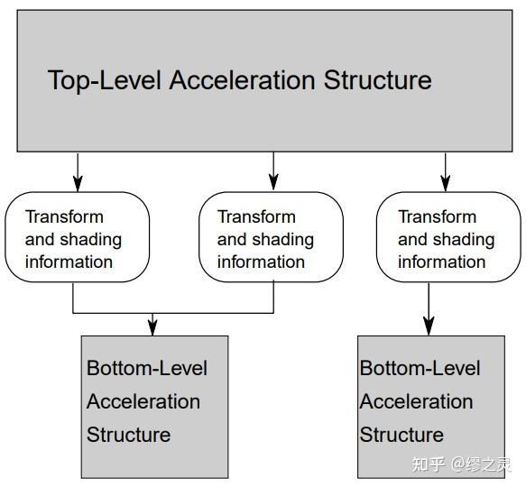

# 从零开始的 Vulkan（七）：光线追踪

原文链接：

[从零开始的 Vulkan（七）：光线追踪illurin.com/articles/vulkan07/](http://illurin.com/articles/vulkan07/)

## 光线追踪支持

硬件光线追踪图形API是由 DXR（DirectX Ray Tracing）首先提出并实现的，随后 Vulkan 也引入了光线追踪并作为扩展功能由 NVIDIA 完成实现。在 Vulkan 1.2 后，光线追踪正式进入了 Vulkan 核心部分并成为了 KHR 扩展功能。

既然是扩展功能，那么就代表并不是所有平台上都可以使用，以 NVIDIA RTX 为首的显卡自然是能够使用硬件光追，部分 GTX 显卡也可以籍由驱动实现伪硬件光追，同时 AMD 显卡也在努力完善对硬件光追的支持。

为了使 Vulkan 支持光线追踪，需要开启以下相关 KHR 扩展：

```cpp
deviceExtensions.emplace_back(VK_KHR_ACCELERATION_STRUCTURE_EXTENSION_NAME);
deviceExtensions.emplace_back(VK_KHR_RAY_TRACING_PIPELINE_EXTENSION_NAME);
deviceExtensions.emplace_back(VK_KHR_RAY_QUERY_EXTENSION_NAME);
deviceExtensions.emplace_back(VK_KHR_DEFERRED_HOST_OPERATIONS_EXTENSION_NAME);

auto features12 = vk::PhysicalDeviceVulkan12Features()
    .setBufferDeviceAddress(VK_TRUE);                                // 获取缓冲设备地址

auto accelerationStructureFeatures = vk::PhysicalDeviceAccelerationStructureFeaturesKHR()
    .setPNext(&features12)
    .setAccelerationStructure(VK_TRUE)                                  // 加速结构支持
    .setAccelerationStructureCaptureReplay(VK_TRUE)                     // 保存和重用加速结构设备地址，用于捕获和回放追踪结果
    .setAccelerationStructureIndirectBuild(VK_FALSE)                    // 间接构建加速结构
    .setAccelerationStructureHostCommands(VK_FALSE)                     // 从主机端操作加速结构
    .setDescriptorBindingAccelerationStructureUpdateAfterBind(VK_TRUE); // 在绑定后更新加速结构

auto rayTracingPipelineFeatures = vk::PhysicalDeviceRayTracingPipelineFeaturesKHR()
    .setPNext(&accelerationStructureFeatures)
    .setRayTracingPipeline(VK_TRUE)                                     // 光线追踪管线支持
    .setRayTracingPipelineShaderGroupHandleCaptureReplay(VK_FALSE)      // 保存和重用管线着色器组，用于捕获和回放追踪结果
    .setRayTracingPipelineShaderGroupHandleCaptureReplayMixed(VK_FALSE) // 混用可重用和非可重用的着色器组
    .setRayTracingPipelineTraceRaysIndirect(VK_TRUE)                    // 间接光线追踪调度命令
    .setRayTraversalPrimitiveCulling(VK_TRUE);                          // 在光线遍历时剔除图元

auto rayQueryFeatures = vk::PhysicalDeviceRayQueryFeaturesKHR rayQueryFeatures()
    .setPNext(&rayTracingPipelineFeatures)
    .setRayQuery(VK_TRUE);

deviceInfo.setPNext(&rayQueryFeatures);
```

同时，使用`vkGetPhysicalDeviceProperties2`（或使用 vkconfig tools 查询）来获取显卡支持的光线追踪相关参数：

```cpp
vk::PhysicalDeviceAccelerationStructurePropertiesKHR accelerationStructureProperties;
vk::PhysicalDeviceRayTracingPipelinePropertiesKHR rayTracingPipelineProperties;

rayTracingPipelineProperties.pNext = &accelerationStructureProperties;

vk::PhysicalDeviceProperties2 properties;
properties.pNext = &rayTracingPipelineProperties;

physicalDevice.getProperties2(&properties);
```

由于大部分光线追踪相关函数都是 KHR 扩展，并不会被[静态链接](https://zhida.zhihu.com/search?content_id=225602527&content_type=Article&match_order=1&q=静态链接&zhida_source=entity)到程序中，所以需要用`vk::DispatchLoaderDynamic`动态加载进来：

```cpp
vk::DynamicLoader dl;
auto pGetInstanceProcAddr = dl.getProcAddress<PFN_vkGetInstanceProcAddr>("vkGetInstanceProcAddr");
auto dispatcher = vk::DispatchLoaderDynamic(instance, pGetInstanceProcAddr);
```

## 加速结构

加速结构（acceleration structure）是在光线追踪时十分必要的数据结构，用于减少求交次数，提高光线遍历的效率，如果你不了解它大概是什么，可以去看看我的这篇文章：

[软光线追踪渲染器学习笔记（一）：Whitted-Style光线追踪illurin.com/articles/renderer04/](https://illurin.com/articles/renderer04/)

在 Vulkan 中，用户创建的加速结构分为两个部分：**底层加速结构（bottom level acceleration structure，BLAS）** 和**顶层加速结构（top level acceleration structure，TLAS）**。



底层加速结构和顶层加速结构（图片来自 vkspec）

底层加速结构用于存储一系列的几何体数据，它们可以是三角形顶点和索引数据，也可以是 AABB。

顶层加速结构用于存储一系列实例数据，并通过实例来引用对应的底层加速结构。可以通过描述符或设备地址来引用顶层加速结构，使其作为遍历的开始点。

### 几何信息描述

为了构建加速结构，我们需要将手头上已有的几何数据转换为 Vulkan 加速结构能够理解的数据，即三角形、AABB 和实例，下面我们针对各个类型分别进行了解。

**三角形：**

三角形几何数据通过以下结构体进行描述：

```c
typedef struct VkAccelerationStructureGeometryTrianglesDataKHR {
    VkStructureType                  sType;
    const void*                      pNext;
    VkFormat                         vertexFormat;  // 顶点的数据格式
    VkDeviceOrHostAddressConstKHR    vertexData;    // 顶点的数据地址
    VkDeviceSize                     vertexStride;  // 顶点数据的存储步长
    uint32_t                         maxVertex;     // 创建时最大的顶点索引
    VkIndexType                      indexType;     // 索引的类型
    VkDeviceOrHostAddressConstKHR    indexData;     // 索引的数据地址
    VkDeviceOrHostAddressConstKHR    transformData; // 变换矩阵的数据地址
} VkAccelerationStructureGeometryTrianglesDataKHR;
```

加速结构只会用到`vertexData`中的顶点位置属性，其它顶点属性需要我们后续进行手动查找。

`VkDeviceOrHostAddressConstKHR`用于描述指向设备或主机内存的一段地址。当我们从主机端操作加速结构时，可以引用主机上的内存，只需要：

```cpp
auto address = vk::DeviceOrHostAddressConstKHR().setHostAddress(&memory);
```

当我们从设备端操作操作加速结构时，就只能引用设备上的内存，例如`VkBuffer`绑定的`VkDeviceMemory`上的内存。引用设备上的内存会稍微麻烦一些，需要通过`vkGetBufferDeviceAddress`获取设备内存的对应地址：

```cpp
// Provided by VK_VERSION_1_2
auto getAddressInfo = vk::BufferDeviceAddressInfo().setBuffer(buffer);
auto address = vk::DeviceOrHostAddressConstKHR()
    .setDeviceAddress(device.getBufferAddress(getAddressInfo));
```

需要注意的是，若想获取缓冲的设备内存地址，必须在创建时为其`bufferUsage`指定`VK_BUFFER_USAGE_SHADER_DEVICE_ADDRESS_BIT`，并且在分配内存时添加额外的`flags`：

```cpp
vk::MemoryAllocateFlagsInfo memoryAllocateFlagsInfo;
vk::MemoryAllocateInfo memoryInfo;

if (bufferInfo.usage & vk::BufferUsageFlagBits::eShaderDeviceAddress) {
    memoryInfo.setPNext(&memoryAllocateFlagsInfo);
    memoryAllocateFlagsInfo.setFlags(vk::MemoryAllocateFlagBits::eDeviceAddress);
}
```

同时，能被用作`vertexData`和`indexData`的缓冲，必须在创建时为其`bufferUsage`指定`VK_BUFFER_USAGE_ACCELERATION_STRUCTURE_BUILD_INPUT_READ_ONLY_BIT_KHR`，也就是说，我们在创建供加速结构使用的顶点和[索引缓冲](https://zhida.zhihu.com/search?content_id=225602527&content_type=Article&match_order=1&q=索引缓冲&zhida_source=entity)时，至少需要：

```cpp
vk::BufferCreateInfo()
    .setUsage(vk::BufferUsageFlagBits::eAccelerationStructureBuildInputReadOnlyKHR |
              vk::BufferUsageFlagBits::eShaderDeviceAddress);
```

`transformData`可以是一个可选的指向`VkTransformMatrixKHR`结构体的地址，其中存储了一个 3 × 4 的行主序矩阵（并且抽取前三列组成的 3 × 3 子矩阵必须可逆），用于描述顶点相对于加速结构被定义的空间的[仿射变换](https://zhida.zhihu.com/search?content_id=225602527&content_type=Article&match_order=1&q=仿射变换&zhida_source=entity)：

```cpp
std::array<std::array<float, 4>, 3> transformation;
vk::TransformMatrixKHR().setMatrix(transformation);
auto address = vk::DeviceOrHostAddressConstKHR().setHostAddress(&transformation);
trianglesData.setTransformData(address);
```

**AABB：**

AABB 几何数据通过以下结构体进行描述：

```c
typedef struct VkAccelerationStructureGeometryAabbsDataKHR {
    VkStructureType                  sType;
    const void*                      pNext;
    VkDeviceOrHostAddressConstKHR    data;   // AABB 的数据地址
    VkDeviceSize                     stride; // AABB 数据的存储步长（必须是8的倍数）
} VkAccelerationStructureGeometryAabbsDataKHR;
```

`data`是一个指向`VkAabbPositionsKHR`结构体的地址，其中存储了 AABB 的最小和最大坐标值：

```cpp
auto aabbPosition = vk::AabbPositionsKHR()
    .setMinX(minX).setMinY(minY).setMinZ(minZ)
    .setMaxX(maxX).setMaxY(maxY).setMinZ(maxZ);
auto address = vk::DeviceOrHostAddressConstKHR().setHostAddress(&aabbPosition);
aabbsData.setData(address);
```

**实例：**

实例数据通过以下结构体进行描述：

```c
typedef struct VkAccelerationStructureGeometryInstancesDataKHR {
    VkStructureType                  sType;
    const void*                      pNext;
    VkBool32                         arrayOfPointers; // 指定数据是一系列指针还是一个数组
    VkDeviceOrHostAddressConstKHR    data;            // 实例的数据地址
} VkAccelerationStructureGeometryInstancesDataKHR;
```

此处的`arrayOfPointers`决定了`data`所指向的内容——若`arrayOfPointers`为真值，则`data`是一个指向一系列指针的地址，其中每一个指针都指向一个单独的`VkAccelerationStructureInstanceKHR`结构体或 packed motion instance；否则`data`是一个指向`VkAccelerationStructureInstanceKHR`结构体数组的地址。

> 关于 packed motion instance 的详细内容，参考 [motion instances](https://registry.khronos.org/vulkan/specs/1.3-extensions/html/vkspec.html%23acceleration-structure-motion-instances)。

`VkAccelerationStructureInstanceKHR`存储了一个实例的具体信息：

```c
typedef struct VkAccelerationStructureInstanceKHR {
    VkTransformMatrixKHR          transform;                                 // 针对加速结构的变换矩阵
    uint32_t                      instanceCustomIndex:24;                    // 24位的自定义索引值
    uint32_t                      mask:8;                                    // 8位几何掩码
    uint32_t                      instanceShaderBindingTableRecordOffset:24; // 24位偏移量，用于计算命中着色器绑定表索引
    VkGeometryInstanceFlagsKHR    flags:8;
    uint64_t                      accelerationStructureReference;            // 引用的底层加速结构
} VkAccelerationStructureInstanceKHR;
```

此处`instanceCustomIndex`是用户自定义的着色器索引值，可以通过着色器内建值`InstanceCustomIndexKHR`访问；`mask`是一个特殊的几何掩码，只有当`CullMask & instance.mask != 0`时，实例才会被判定为击中；`instanceShaderBindingTableRecordOffset`用在着色器绑定表中，它的具体作用我们将在后文提及。

`flags`可以使用以下几个枚举量（不包含扩展）：

```c
typedef enum VkGeometryInstanceFlagBitsKHR {
    VK_GEOMETRY_INSTANCE_TRIANGLE_FACING_CULL_DISABLE_BIT_KHR = 0x00000001,
    VK_GEOMETRY_INSTANCE_TRIANGLE_FLIP_FACING_BIT_KHR = 0x00000002,
    VK_GEOMETRY_INSTANCE_FORCE_OPAQUE_BIT_KHR = 0x00000004,
    VK_GEOMETRY_INSTANCE_FORCE_NO_OPAQUE_BIT_KHR = 0x00000008,
} VkGeometryInstanceFlagBitsKHR;
```

`accelerationStructureReference`是一个指向加速结构的地址，通过`vkGetAccelerationStructureDeviceAddressKHR`可以查询到存储在设备上的加速结构地址；若从主机端操作加速结构，则直接使用`VkAccelerationStructureKHR`对象。

```cpp
vk::AccelerationStructureKHR accelerationStructure;
auto getAddressInfo = vk::AccelerationStructureDeviceAddressInfoKHR()
    .setAccelerationStructure(accelerationStructure);
auto instance = vk::AccelerationStructureInstanceKHR()
    .setAccelerationStructureReference(device.getAccelerationStructureAddressKHR(getAddressInfo));
```

**几何信息描述：**

`VkAccelerationStructureGeometryKHR`是用于描述几何信息的最上层结构体，其中指定了几何数据及其具体类型：

```c
typedef struct VkAccelerationStructureGeometryKHR {
    VkStructureType                           sType;
    const void*                               pNext;
    VkGeometryTypeKHR                         geometryType; // 几何数据类型
    VkAccelerationStructureGeometryDataKHR    geometry;     // 几何具体数据
    VkGeometryFlagsKHR                        flags;
} VkAccelerationStructureGeometryKHR;
```

`geometry`是一个用于容纳三角形、AABB、实例数据之一的共用体，而`geometryType`则具体指定了存储的是哪个类型的几何数据。

`flags`可以使用以下几个枚举量（不包含扩展）：

```c
typedef enum VkGeometryFlagBitsKHR {
    VK_GEOMETRY_OPAQUE_BIT_KHR = 0x00000001,
    VK_GEOMETRY_NO_DUPLICATE_ANY_HIT_INVOCATION_BIT_KHR = 0x00000002,
} VkGeometryFlagBitsKHR;
```

**[图元](https://zhida.zhihu.com/search?content_id=225602527&content_type=Article&match_order=2&q=图元&zhida_source=entity)和实例的未激活状态：**

加速结构允许通过以下输入值，来指定图元和实例的未激活状态：

- 未激活三角形：将三角形所有顶点的第一个分量（即X分量）设为 NaN。
- 未激活实例：将实例对应的加速结构句柄设为空值（`VK_NULL_HANDLE`）。
- 未激活 AABB：将 AABB 的最小X坐标设为 NaN。

未激活的对象将在光线遍历时被忽视，并且不应当出现在加速结构中。但未激活的图元和实例仍然会被计入自动生成的着色器索引序列中（`InstanceId`和`PrimitiveId`）。

### 创建加速结构

Vulkan 提供了两种不同的操作来生成几何体对应的加速结构，一种是构建出新的加速结构（build operation），一种是在已有的加速结构上进行更新（update operation）。其中更新加速结构比构建加速结构拥有更快的速度，但同样也拥有更多的限制，以下行为不允许在更新加速结构时发生：

1. 更改图元或实例的激活状态。
2. 更改三角形图元的顶点或索引格式。
3. 更改三角形几何体变换指针从空指针至非空指针（或从非空指针至空指针）。
4. 更改几何体或实例的数量。
5. 更改几何体标志（flags）。
6. 更改几何体中的顶点或图元数量。

通过以下结构体来描述加速结构构建信息：

```c
typedef struct VkAccelerationStructureBuildGeometryInfoKHR {
    VkStructureType                                     sType;
    const void*                                         pNext;
    VkAccelerationStructureTypeKHR                      type;                     // 加速结构类型
    VkBuildAccelerationStructureFlagsKHR                flags;
    VkBuildAccelerationStructureModeKHR                 mode;                     // 执行的操作类型
    VkAccelerationStructureKHR                          srcAccelerationStructure; // 执行更新操作时作为更新源的加速结构
    VkAccelerationStructureKHR                          dstAccelerationStructure; // 目标加速结构
    uint32_t                                            geometryCount;            // 加速结构中的几何体数量
    const VkAccelerationStructureGeometryKHR*           pGeometries;
    const VkAccelerationStructureGeometryKHR* const*    ppGeometries;
    VkDeviceOrHostAddressKHR                            scratchData;              // 用于存储临时数据的缓冲区地址
} VkAccelerationStructureBuildGeometryInfoKHR;
```

`type`是 TopLevel、BottomLevel 和 Generic 中的一种，指定为 Generic 表示加速结构类型不在创建（creation）时指定，但必须在构建（build）时完成指定。

`mode`指定了所要对加速结构进行的操作是构建（build）还是更新（update），如果是更新的话，就使用`srcAccelerationStructure`作为更新源。

`pGeometries`和`ppGeometries`同时只能使用一个，另一个必须为空指针。其中每一个元素的索引都将用作光线遍历时的几何体索引，通过着色器内建值`RayGeometryIndexKHR`访问。

`flags`可以使用以下几个枚举量（不包含扩展）：

```c
typedef enum VkBuildAccelerationStructureFlagBitsKHR {
    VK_BUILD_ACCELERATION_STRUCTURE_ALLOW_UPDATE_BIT_KHR = 0x00000001,
    VK_BUILD_ACCELERATION_STRUCTURE_ALLOW_COMPACTION_BIT_KHR = 0x00000002,
    VK_BUILD_ACCELERATION_STRUCTURE_PREFER_FAST_TRACE_BIT_KHR = 0x00000004,
    VK_BUILD_ACCELERATION_STRUCTURE_PREFER_FAST_BUILD_BIT_KHR = 0x00000008,
    VK_BUILD_ACCELERATION_STRUCTURE_LOW_MEMORY_BIT_KHR = 0x00000010,
} VkBuildAccelerationStructureFlagBitsKHR;
```

使用以下方法来根据加速结构构建信息，查询其所需要的充足空间（并非最小空间）：

```cpp
auto requiredSizes = device.getAccelerationStructureBuildSizesKHR(vk::AccelerationStructureBuildTypeKHR::eHost,
                                                                  buildInfo, 
                                                                  maxPrimitiveCounts);
```

`buildType`指定了创建的加速结构放在主机内存上还是设备内存上，一般而言我们都放在设备内存上；`pMaxPrimitiveCounts`是一个指向每个几何体所包含的图元数量的指针，几何体数量必须和`buildInfo.geometryCount`保持一致。

“图元数量”对于不同几何数据类型的加速结构有着不同意义：

- 当几何数据类型为三角形时，若不使用索引绘制，则将从顶点缓冲中读取“图元数量 × 3”个顶点数据；若使用索引绘制，则将从索引缓冲中读取“图元数量 × 3”个索引数据。
- 当几何数据类型为 AABB 时，“图元数量”即 AABB 的数量。
- 当几何数据类型为实例时，“图元数量”即引用的底层加速结构的数量。

接着根据查询得到的空间信息，创建存放加速结构的缓冲和暂存缓冲：

```cpp
auto accelerationStructureBufferInfo = vk::BufferCreateInfo()
    .setSize(requiredSizes.accelerationStructureSize)
    .setUsage(vk::BufferUsageFlagBits::eAccelerationStructureStorageKHR);
auto accelerationStructureBuffer = device.createBuffer(accelerationStructureBufferInfo);

// 绑定 VkDeviceMemory

auto scratchBufferInfo = vk::BufferCreateInfo()
    .setSize(requiredSizes.buildScratchSize)
    .setUsage(vk::BufferUsageFlagBits::eStorageBuffer | vk::BufferUsageFlagBits::eShaderDeviceAddress);
auto scratchBuffer = device.createBuffer(scratchBufferInfo);

// 绑定 VkDeviceMemory
```

通过填写`VkAccelerationStructureCreateInfoKHR`结构体和调用`vkCreateAccelerationStructureKHR`函数来创建加速结构对象：

```cpp
auto accelerationStructureInfo = vk::AccelerationStructureCreateInfoKHR()
    .setBuffer(accelerationStructureBuffer)
    .setSize(requiredSizes.accelerationStructureSize)
    .setOffset(0)                                            // 缓冲的偏移量，必须是256的倍数
    .setType(vk::AccelerationStructureTypeKHR::eBottomLevel) 
    .setDeviceAddress(0);                                    // 用于 accelerationStructureCaptureReplay

auto accelerationStructure = device.createAccelerationStructureKHR(accelerationStructureInfo);
```

在得到加速结构对象句柄后，我们从设备端完成加速结构的构建，这需要提供一个`VkAccelerationStructureBuildRangeInfoKHR`结构体来描述输入图元和顶点的信息：

```c
typedef struct VkAccelerationStructureBuildRangeInfoKHR {
    uint32_t    primitiveCount;  // 对应的加速结构中图元的数量
    uint32_t    primitiveOffset; // 图元数据存储内存的字节偏移量
    uint32_t    firstVertex;     // 三角形几何体的第一个顶点的索引
    uint32_t    transformOffset; // 变换矩阵存储内存的字节偏移量
} VkAccelerationStructureBuildRangeInfoKHR;
```

最后只需要在命令缓冲区上放置构建命令即可，为了防止在`scratchData`上产生资源冲突，可以考虑放置一个额外的管线屏障：

```cpp
std::vector<vk::AccelerationStructureGeometryKHR> geometries;

auto geometryInfo = vk::AccelerationStructureBuildGeometryInfoKHR()
    .setType(vk::AccelerationStructureTypeKHR::eBottomLevel)
    .setMode(vk::BuildAccelerationStructureModeKHR::eBuild)
    .setDstAccelerationStructure(blas)
    .setGeometries(geometries)
    .setScratchData(vk::DeviceOrHostAddressKHR().setDeviceAddress(
        device.getBufferAddress(vk::BufferDeviceAddressInfo()
            .setBuffer(scratchBuffer))));

std::vector<vk::AccelerationStructureBuildRangeInfoKHR> srangeInfos(geometries.size());
for (std::size_t i = 0; i < srangeInfos.size(); i++) {
    srangeInfos[i].setPrimitiveCount(maxPrimitiveCounts[i])
                  .setFirstVertex(0);
}

commandBuffer.buildAccelerationStructuresKHR(geometryInfos, rangeInfos, dispatcher);

auto barrier = vk::MemoryBarrier()
    .setSrcAccessMask(vk::AccessFlagBits::eAccelerationStructureWriteKHR)
    .setDstAccessMask(vk::AccessFlagBits::eAccelerationStructureReadKHR);

commandBuffer.pipelineBarrier(vk::PipelineStageFlagBits::eAccelerationStructureBuildKHR,
                              vk::PipelineStageFlagBits::eAccelerationStructureBuildKHR,
                              vk::DependencyFlags(), barrier, nullptr, nullptr);
```

### 压缩加速结构

前面提到了我们所分配的加速结构空间并非是最优的大小，而是尽可能大以满足创建加速结构的需求，在完成创建后最终所占的实际空间可能会更小，这样，压缩加速结构所占空间就是一个十分可观的优化手段。

> 要使用查询，在构建加速结构时必须为`VkAccelerationStructureBuildGeometryInfoKHR::flags`指定`VK_BUILD_ACCELERATION_STRUCTURE_ALLOW_COMPACTION_BIT_KHR`。

我们需要创建一个**查询池**，并藉由命令缓冲区进行相关信息的查询：

```cpp
auto queryPoolInfo = vk::QueryPoolCreateInfo()
    .setQueryCount(1)
    .setQueryType(vk::QueryType::eAccelerationStructureCompactedSizeKHR);
auto queryPool = device.createQueryPool(queryPoolInfo);

commandBuffer.resetQueryPool(queryPool, 0, 1);
```

压缩加速结构分为以下几个步骤：

1. 从查询池中获取加速结构压缩后的实际大小；
2. 用更小的尺寸创建一个新的加速结构；
3. 将之前的加速结构数据拷贝到新创建的加速结构中；
4. 销毁之前的加速结构。

通过以下方法查询加速结构压缩后的实际大小：

```cpp
commandBuffer.writeAccelerationStructuresPropertiesKHR(geometryInfos[0].dstAccelerationStructure,
                                                       vk::QueryType::eAccelerationStructureCompactedSizeKHR,
                                                       queryPool,
                                                       0, 
                                                       dispatcher);

queue.submit(vk::SubmitInfo().setCommandBuffers(commandBuffer));
queue.waitIdle();

vk::DeviceSize result;
device.getQueryPoolResults(queryPool, 0, 1, sizeof(vk::DeviceSize), &result, sizeof(vk::DeviceSize), vk::QueryResultFlagBits::eWait);
```

通过以下方法以压缩方式拷贝加速结构数据：

```cpp
auto copyInfo = vk::CopyAccelerationStructureInfoKHR()
    .setMode(vk::CopyAccelerationStructureModeKHR::eCompact)
    .setSrc(blas)
    .setDst(compactBlas);
commandBuffer.copyAccelerationStructureKHR(copyInfo, dispatcher);
```

### 描述符引用加速结构

光线追踪着色器和[光栅化](https://zhida.zhihu.com/search?content_id=225602527&content_type=Article&match_order=1&q=光栅化&zhida_source=entity)着色器一样，通过描述符来引用外部资源，而顶层加速结构同样可以通过描述符被着色器使用。

我们创建一个容纳两个描述符的描述符布局，其中第一个描述符指向顶层加速结构，第二个描述符指向可以用于写入像素数据的存储图像，将其用作光线追踪的[渲染目标](https://zhida.zhihu.com/search?content_id=225602527&content_type=Article&match_order=1&q=渲染目标&zhida_source=entity)。

```cpp
std::array<vk::DescriptorSetLayoutBinding, 2> layoutBindings;

layoutBindings[0].setBinding(0)
                 .setDescriptorCount(1)
                 .setDescriptorType(vk::DescriptorType::eAccelerationStructureKHR)
                 .setStageFlags(vk::ShaderStageFlagBits::eRaygenKHR);

layoutBindings[1].setBinding(1)
                 .setDescriptorCount(1)
                 .setDescriptorType(vk::DescriptorType::eStorageImage)
                 .setStageFlags(vk::ShaderStageFlagBits::eRaygenKHR);

auto descriptorSetLayoutInfo = vk::DescriptorSetLayoutCreateInfo()
    .setBindings(layoutBindings);
auto descriptorSetLayout = device.createDescriptorSetLayout(descriptorSetLayoutInfo);
```

为我们使用的描述符布局分配描述符集：

```cpp
std::array<vk::DescriptorPoolSize, 2> poolSizes;
poolSizes[0].setType(vk::DescriptorType::eAccelerationStructureKHR)
            .setDescriptorCount(1);
poolSizes[1].setType(vk::DescriptorType::eStorageImage)
            .setDescriptorCount(1);

auto descriptorPoolInfo = vk::DescriptorPoolCreateInfo()
    .setPoolSizes(poolSizes)
    .setMaxSets(1);
auto descriptorPool = device.createDescriptorPool(descriptorPoolInfo);

auto descriptorSetAllocateInfo = vk::DescriptorSetAllocateInfo()
    .setDescriptorPool(descriptorPool)
    .setDescriptorSetCount(1)
    .setSetLayouts(descriptorSetLayout);
auto descriptorSets = device.allocateDescriptorSets(descriptorSetAllocateInfo);
```

向描述符集中写入描述符：

```cpp
std::array<vk::WriteDescriptorSet, 2> descriptorWrites;

auto accelerationStructureWrite = vk::WriteDescriptorSetAccelerationStructureKHR()
    .setAccelerationStructures(tlas);
descriptorWrites[0].setPNext(&accelerationStructureWrite)
                   .setDstSet(descriptorSets[0])
                   .setDescriptorType(vk::DescriptorType::eAccelerationStructureKHR)
                   .setDescriptorCount(1)
                   .setDstBinding(0)
                   .setDstArrayElement(0);

auto renderTargetWrite = vk::DescriptorImageInfo()
    .setImageLayout(vk::ImageLayout::eGeneral)
    .setImageView(renderTargetImageView);
descriptorWrites[1].setImageInfo(renderTargetWrite)
                   .setDstSet(descriptorSets[0])
                   .setDescriptorType(vk::DescriptorType::eStorageImage)
                   .setDescriptorCount(1)
                   .setDstBinding(1)
                   .setDstArrayElement(0);

device.updateDescriptorSets(descriptorWrites, nullptr);
```

> 被用于写入描述符的加速结构创建类型必须是`VK_ACCELERATION_STRUCTURE_TYPE_TOP_LEVEL_KHR`或`VK_ACCELERATION_STRUCTURE_TYPE_GENERIC_KHR`。

## 光线追踪着色器

光线追踪为[渲染管线](https://zhida.zhihu.com/search?content_id=225602527&content_type=Article&match_order=1&q=渲染管线&zhida_source=entity)引入了额外的6个着色器阶段，这些新引入的着色器阶段在光线追踪管线中按照下图所示规则发挥作用：


光线追踪管线（图片来自 vkspec）

与光栅化不同的是，光线追踪着色器并没有明确的调用顺序，而是由光线和场景的不同交互状态决定要调用的着色器，因此我们必须确保所有光线追踪所用到着色器能够随时被调用。在 Vulkan 中，通过**着色器绑定表（Shader Binding Table，SBT）** 来实现这个目的。

我们仍然使用 HLSL 来完成着色器的编写，并通过 DXC（DirectX Shader Compiler）将 HLSL 源码编译为 SPIR-V 字节码。DXC 并没有为光线追踪的各个着色器阶段采取特定的配置，而是统一使用`lib_6_*`配置；并且在一个 HLSL [源文件](https://zhida.zhihu.com/search?content_id=225602527&content_type=Article&match_order=1&q=源文件&zhida_source=entity)中可以拥有多个入口点函数，使用`[shader("<stage>")]`进行标识。

### 光线生成着色器 ray generation shader

光线追踪时最开始工作的是光线生成着色器，它工作在和计算着色器十分相似的三维线程组上。光线生成着色器的入口点函数必须用`[shader("raygeneration")]`标识，并且既不接受参数也没有返回值。

```cpp
// raygen.hlsl

RaytracingAccelerationStructure rs : register(t0);
RWTexture2D<float4> renderTarget : register(u1);

struct Payload {
    float4 color;
};

[shader("raygeneration")]
void main() {
    Payload myPayload = { float4(0.0f, 0.0f, 0.0f, 0.0f) };

    // 摄相机属性
    const float aspect = (float) DispatchRaysDimensions().x / (float) DispatchRaysDimensions().y;
    const float halfFovY = 0.25f * 3.1415962f;

    float3 nearPlane;
    nearPlane.z = 1.0f;
    nearPlane.y = nearPlane.z * tan(halfFovY) * 2.0f;
    nearPlane.x = nearPlane.y * aspect;

    // 计算光线的原点和方向
    float delta = nearPlane.x / (float) DispatchRaysDimensions().x;

    float3 center = nearPlane.z * float3(0.0f, 0.0f, 1.0f);
    float3 direction = float3(0.0f, 0.0f, -1.0f)
        + (-nearPlane.x / 2.0f + ((float) DispatchRaysIndex().x + 0.5f) * delta) * float3(1.0f, 0.0f, 0.0f)
        + (nearPlane.y / 2.0f - ((float) DispatchRaysIndex().y + 0.5f) * delta) * float3(0.0f, 1.0f, 0.0f);

    RayDesc rayDesc;
    rayDesc.Origin = float3(0.0f, 0.0f, 1.0f);
    rayDesc.Direction = direction;
    rayDesc.TMin = 0.0f;
    rayDesc.TMax = 1000.0f;

    TraceRay(rs, 0x0u, 0xffu, 0u, 1u, 0u, rayDesc, myPayload);

    renderTarget[DispatchRaysIndex().xy] = myPayload.color;
}
```

`RaytracingAccelerationStructure`用于获取绑定在描述符上的加速结构，`RWTexture2D<float4>`用于获取绑定在描述符上的存储图像；`RayDesc`是一个光线生成着色器内置的结构体，用于描述射出光线的属性；`Payload`是我们自定义的一个结构体，能够作为光线负载传递给其它的着色器。

调用内置函数`DispatchRaysDimensions`来获取光线追踪调度的宽度、高度、深度；调用内置函数`DispatchRaysIndex`来获取当前光线在调度中所处的位置。

调用内置函数`TraceRay`以生成光线，这个函数的原型如下：

```cpp
template<payload_t>
void TraceRay(RaytracingAccelerationStructure AccelerationStructure,
              uint RayFlags,
              uint InstanceInclusionMask,                            // 对应 SPIR-V 中的 CullMask
              uint RayContributionToHitGroupIndex,                   // 对应 SPIR-V 中的 SBTOffset 
              uint MultiplierForGeometryContributionToHitGroupIndex, // 对应 SPIR-V 中的 SBTStride
              uint MissShaderIndex,
              RayDesc Ray,
              inout payload_t Payload);
```

在调用完`TraceRay`后，我们传入的光线负载会被后续的着色器阶段修改，最终我们将修改后的值写入到`renderTarget`中。

### 相交着色器 Intersection shader

相交着色器用于实现任意的光线和图元相交，例如球体和 AABB，而三角形图元不需要一个自定义的相交着色器。光线生成着色器的入口点函数必须用`[shader("intersection")]`标识，并且既不接受参数也没有返回值。

```cpp
// intersection.hlsl

struct Attribute {
    float2 bary;
};

[shader("intersection")]
void main() {
    Attribute myHitAttribute = { float2(0.0f, 0.0f) };
    ReportHit(0.0f, 0, myHitAttribute);
}
```

调用内置函数`ReportHit`以报告光线相交，这个函数的原型如下：

```cpp
template<attr_t>
bool ReportHit(float THit, uint HitKind, attr_t Attributes);
```

其中`THit`是一个指定交点距离参数的浮点数；`HitKind`是一个用户自定义的无符号整数，用于标识发生的命中类型；`Attributes`是用户自定义的结构体，用于指定交点属性。

### 任意命中着色器 Any-hit shader

任意命中着色器将在光线和图元的任意一次相交时被执行。任意命中着色器的入口点函数必须用`[shader("anyhit")]`标识，接受来自光线生成着色器的光线负载和来自相交着色器的交点属性，输出一个修改后的光线负载。

```cpp
// anyhit.hlsl

struct Attribute {
    float2 bary;
};

struct Payload {
    float4 color;
};

[shader("anyhit")]
void main(inout Payload output, in Attribute attribute) {
    output.color = float4(1.0f, 0.0f, 0.0f, 1.0f);
}
```

在任意命中着色器中调用内置函数`AcceptHitAndEndSearch`将提交当前命中，并停止搜索更多命中光线，并调用最近命中着色器，如果存在正在执行的相交着色器，则执行将停止；调用内置函数`IgnoreHit`将忽略当前命中，继续更多的命中搜索，但对光线负载所做的修改会被保留，相交着色器中的`ReportHit`函数将返回`false`。

### 最近命中着色器 Closest-hit shader

最近命中着色器将在光线和图元的最近相交时被执行，用于计算最近交点或生成次生光线。任意命中着色器的入口点函数必须用`[shader("closest")]`标识，接受来自光线生成着色器的光线负载和来自相交着色器的交点属性，输出一个修改后的光线负载。

```cpp
struct Attribute {
    float2 bary;
};

struct Payload {
    float4 color;
};

[shader("closesthit")]
void main(inout Payload a, in Attribute b) {
    a.color = float4(1.0f, 0.0f, 0.0f, 1.0f);
}
```

在最近命中着色器中可以调用`TraceRay`来生成次生光线，它的用法和在光线生成着色器中类似，这里不再过多叙述。

> 相交着色器、任意命中着色器和最近命中着色器统称为**命中着色器（hit shaders）**。

### 未命中着色器 Miss shader

当光线没有与任何图元相交时，未命中着色器会被执行。任意命中着色器的入口点函数必须用[shader("miss")]标识，接受并修改来自光线生成着色器的光线负载。

```cpp
// miss.hlsl

struct Payload {
  float4 color;
};

[shader("miss")]
void main(inout Payload a) {
    a.color = float4(0.0f, 0.0f, 0.0f, 0.0f);
}
```

未命中着色器一般通过内置函数`CallShader`和`TraceRay`来安排更多工作。

### 可调用着色器 Callable shader

可调用着色器是一个通用的着色器阶段，可以在任意光线追踪着色器阶段（包括可调用着色器自身）通过内置函数`CallShader`进行调用。任意命中着色器的入口点函数必须用[shader("callable")]标识，拥有唯一一个`inout`用户自定义参数。

```cpp
// callable.hlsl

struct CallData {
  float4 data;
};

[shader("callable")]
void main(inout CallData a) {
  a.data = float4(0.0f,1.0f,0.0f,0.0f);
}
```

`CallShader`函数的原型如下：

```cpp
template<param_t>
void CallShader(uint ShaderIndex, inout param_t Parameter);
```

### 使用 DXC 编译 HLSL

我们可以通过命令行使用 DXC 的二进制[可执行文件](https://zhida.zhihu.com/search?content_id=225602527&content_type=Article&match_order=1&q=可执行文件&zhida_source=entity)编译 HLSL，也可以使用 DXC [库文件](https://zhida.zhihu.com/search?content_id=225602527&content_type=Article&match_order=1&q=库文件&zhida_source=entity)提供的 API 接口在程序中编译 HLSL，下面我会简单演示 DXC API 的使用方法。

使用 DXC API 所要包含的头文件如下：

```cpp
#ifdef _WIN32
#include <Unknwnbase.h>
#endif // _WIN32

#include "dxcapi.h"
```

通过以下代码初始化 DXC 编译环境，并设置编译参数：

```cpp
IDxcUtils* dxcUtils;
DxcCreateInstance(CLSID_DxcUtils, IID_PPV_ARGS(&dxcUtils));

IDxcCompiler3* dxcCompiler;
DxcCreateInstance(CLSID_DxcCompiler, IID_PPV_ARGS(&dxcCompiler));

IDxcIncludeHandler* dxcIncludeHandler;
dxcUtils->CreateDefaultIncludeHandler(&dxcIncludeHandler);

std::vector<const wchar_t*> arguments = {
    L"-T", L"lib_6_4",  // DXC 编译光线追踪着色器时，profile 全部指定为 lib
    L"-I", hlsl_include_path,
    L"-Zpc",            // 以列主序存储矩阵
    L"-spirv",
    L"-fspv-target-env=vulkan1.2",
    L"-fspv-extension=SPV_KHR_non_semantic_info",
    L"-fspv-extension=SPV_KHR_ray_tracing",
    L"-fspv-extension=SPV_KHR_ray_query"
};
```

通过以下代码载入 HLSL 源码并完成编译：

```cpp
std::ifstream loadFile(sourcePath, std::ios::ate | std::ios::binary);

if (!loadFile.is_open()) {
    throw std::runtime_error("Cannot open the shader file");
}

uint32_t sourceCodeSize = static_cast<uint32_t>(loadFile.tellg());

std::vector<char> sourceCode(sourceCodeSize);
loadFile.seekg(0);
loadFile.read(sourceCode.data(), sourceCodeSize);
loadFile.close();

IDxcBlobEncoding* dxcEncoding;
dxcUtils->CreateBlob(pSourceCode, sourceCodeSize, CP_UTF8, &dxcEncoding);

DxcBuffer dxcSourceBuffer;
dxcSourceBuffer.Ptr = dxcEncoding->GetBufferPointer();
dxcSourceBuffer.Size = dxcEncoding->GetBufferSize();
dxcSourceBuffer.Encoding = 0;

IDxcResult* dxcCompileResult;
auto result = dxcCompiler->Compile(&dxcSourceBuffer, arguments.data(), static_cast<uint32_t>(arguments.size()), dxcIncludeHandler, IID_PPV_ARGS(&dxcCompileResult));

if (!SUCCEEDED(result)) {
    throw std::runtime_error("Cannot compile the shader file");
}

dxcEncoding->Release();
```

通过以下代码获取编译产生的报错信息：

```cpp
std::string errorInfo;
IDxcBlobUtf8* dxcErrorInfo;
IDxcBlobWide* outputName;
dxcCompileResult->GetOutput(DXC_OUT_ERRORS, IID_PPV_ARGS(&dxcErrorInfo), &outputName);

if (outputName) outputName->Release();

if (dxcErrorInfo && dxcErrorInfo->GetStringLength() > 0) {
    errorInfo = static_cast<const char*>(dxcErrorInfo->GetStringPointer());
}

dxcErrorInfo->Release();
```

通过以下代码获取编译完成的 SPIR-V 字节码：

```cpp
std::vector<uint8_t> sourceObject;
IDxcBlob* dxcObjectInfo;
IDxcBlobWide* outputName;
dxcCompileResult->GetOutput(DXC_OUT_OBJECT, IID_PPV_ARGS(&dxcObjectInfo), &outputName);

if (outputName) outputName->Release();

if (dxcObjectInfo && dxcObjectInfo->GetBufferSize() > 0) {
    sourceObject.resize(dxcObjectInfo->GetBufferSize());
    auto ptr = static_cast<uint8_t*>(dxcObjectInfo->GetBufferPointer());
    std::copy(ptr, ptr + dxcObjectInfo->GetBufferSize(), sourceObject.begin());
}

dxcObjectInfo->Release();
```

所有编译工作完成后清理残余对象：

```cpp
dxcUtils->Release();
dxcCompiler->Release();
dxcIncludeHandler->Release();
```

有关 HLSL 映射到 SPIR-V 的详细内容，请参考 [http://khr.io/hlsl2spirv](http://khr.io/hlsl2spirv)。

## 光线追踪管线

光线追踪管线是独立于图形管线和计算管线的另一套渲染管线，创建光线追踪管线需要填写一个`VkRayTracingPipelineCreateInfoKHR`结构体，下面我们就来详细了解一下该结构体中的内容。

### 着色器模块

与常规的着色器模块创建方法相同，我们需要先将光线追踪着色器编译并加载进`VkShaderModule`中，再填入`VkPipelineShaderStageCreateInfo`结构体：

```cpp
std::array<vk::PipelineShaderStageCreateInfo, 4> shaderStageInfos;

shaderStageInfos[0] = vk::PipelineShaderStageCreateInfo()
    .setPName("main").setModule(raygen).setStage(vk::ShaderStageFlagBits::eRaygenKHR);
shaderStageInfos[1] = vk::PipelineShaderStageCreateInfo()
    .setPName("main").setModule(miss).setStage(vk::ShaderStageFlagBits::eMissKHR);
shaderStageInfos[2] = vk::PipelineShaderStageCreateInfo()
    .setPName("main").setModule(anyhit).setStage(vk::ShaderStageFlagBits::eAnyHitKHR);
shaderStageInfos[3] = vk::PipelineShaderStageCreateInfo()
    .setPName("main").setModule(closesthit).setStage(vk::ShaderStageFlagBits::eClosestHitKHR);

pipelineInfo.setStages(shaderStageInfos);
```

不同的是，我们需要通过填写一个`VkRayTracingShaderGroupCreateInfoKHR`数组来指定光线追踪管线所要使用的着色器绑定表，其中每一个元素都代表一个着色器组，并通过数组索引来引用之前在`VkPipelineShaderStageCreateInfo`结构体中填入的着色器模块：

```cpp
std::array<vk::RayTracingShaderGroupCreateInfoKHR, 3> shaderGroups;

shaderGroups[0].setType(vk::RayTracingShaderGroupTypeKHR::eGeneral)
               .setGeneralShader(0)
               .setAnyHitShader(VK_SHADER_UNUSED_KHR)
               .setClosestHitShader(VK_SHADER_UNUSED_KHR)
               .setIntersectionShader(VK_SHADER_UNUSED_KHR);
shaderGroups[1].setType(vk::RayTracingShaderGroupTypeKHR::eGeneral)
               .setGeneralShader(1)
               .setAnyHitShader(VK_SHADER_UNUSED_KHR)
               .setClosestHitShader(VK_SHADER_UNUSED_KHR)
               .setIntersectionShader(VK_SHADER_UNUSED_KHR);
shaderGroups[2].setType(vk::RayTracingShaderGroupTypeKHR::eTrianglesHitGroup)
               .setGeneralShader(VK_SHADER_UNUSED_KHR)
               .setAnyHitShader(2)
               .setClosestHitShader(3)
               .setIntersectionShader(VK_SHADER_UNUSED_KHR);

pipelineInfo.setGroups(shaderGroups);
```

其中`VkRayTracingShaderGroupTypeKHR`表示所用的着色器组类型：

| 枚举量                                                    | 含义                                                         |
| --------------------------------------------------------- | ------------------------------------------------------------ |
| VK_RAY_TRACING_SHADER_GROUP_TYPE_GENERAL_KHR              | 表示着色器组只有一个光线生成着色器、未命中着色器或可调用着色器，其它着色器设为VK_SHADER_UNUSED_KHR |
| VK_RAY_TRACING_SHADER_GROUP_TYPE_TRIANGLES_HIT_GROUP_KHR  | 表示着色器组只用于三角形图元的光线遍历，无法使用相交着色器，只包含命中着色器 |
| VK_RAY_TRACING_SHADER_GROUP_TYPE_PROCEDURAL_HIT_GROUP_KHR | 表示着色器组只用于自定义几何体的光线遍历，必须包含相交着色器 |

### 递归深度

使用`maxPipelineRayRecursionDepth`来指定光线追踪的最大递归深度，递归深度越大渲染效果越好，同时带来的开销也就更大。这个值不能大于`VkPhysicalDeviceRayTracingPipelinePropertiesKHR::maxRayRecursionDepth`。

### 动态阶段

光线追踪管的动态阶段和光栅化管线的动态阶段作用类似，但是所能使用的动态阶段不同，光线追踪管线可以指定以下动态阶段：

```c
typedef enum VkDynamicState {
    VK_DYNAMIC_STATE_RAY_TRACING_PIPELINE_STACK_SIZE_KHR,
} VkDynamicState;
```

### 管线库

管线库是一种特殊的管线，它没办法直接被绑定到渲染流水线上使用，相反，它定义了一系列可以被链接到其它管线上的管线阶段（比如着色器模块和着色器组）。通过在创建管线时为`VkPipelineCreateFlagBits`指定`VK_PIPELINE_CREATE_LIBRARY_BIT_KHR`来创建管线库。

> 使用管线库需要启用`VK_KHR_pipeline_library`扩展

通过填写`pLibraryInfo`指向的结构体来将管线库链接到管线上：

```c
typedef struct VkPipelineLibraryCreateInfoKHR {
  VkStructureType sType;
  const void* pNext;
  uint32_t libraryCount;
  const VkPipeline* pLibraries;
} VkPipelineLibraryCreateInfoKHR;
```

管线库之间也可以相互链接。需要特别注意的是，在管线使用期间，不可以销毁链接在其上的管线库。

通过填写`pLibraryInterface`指向的结构体来为管线库附加额外信息：

```c
typedef struct VkRayTracingPipelineInterfaceCreateInfoKHR {
    VkStructureType    sType;
    const void*        pNext;
    uint32_t           maxPipelineRayPayloadSize;
    uint32_t           maxPipelineRayHitAttributeSize;
} VkRayTracingPipelineInterfaceCreateInfoKHR;
```

如果`pLibraryInfo`不是空指针，那么`pLibraryInterface`也不能是空指针，并且`pLibraryInterface`指向的值必须与管线库在创建时`pLibraryInterface`指向的值相等。

### 管线布局

与光栅化管线相同，我们也需要为所用到的描述符集布局创建管线布局：

```cpp
auto pipelineLayoutInfo = vk::PipelineLayoutCreateInfo()
    .setSetLayouts(descriptorSetLayout);
auto pipelineLayout = device.createPipelineLayout(pipelineLayoutInfo);

pipelineInfo.setLayout(pipelineLayout);
```

### 延迟操作

我们注意到`vkCreateRayTracingPipelineKHR`函数的第一个参数是一个延迟操作追踪对象，如果不想要使用延迟操作的话填入空指针即可：

```cpp
auto pipeline = device.createRayTracingPipelineKHR(nullptr, nullptr, pipelineInfo, nullptr, dispatcher);

// 清理残余的着色器模块对象
for (auto& shaderMoudle : shaderModules) {
    device.destroy(shaderMoudle);
}
```

下面我会对延迟操作进行一些大致的介绍：

某些 Vulkan 操作对于主机 CPU 端来说，执行起来是很昂贵的，而延迟操作的存在目的就是为了将此类工作卸载到后台线程，并跨多个 CPU 进行并行处理，在一定程度上优化性能。我们可以向 Vulkan 请求对一个操作进行延迟，但由 Vulkan 的具体实现来决定该操作是否真的会被延迟。

> 在延迟操作完成之前，操作所用到的数据必须都处于可访问状态。

调用`vkCreateDeferredOperationKHR`函数来创建一个延迟操作追踪对象：

```cpp
vk::DeferredOperationKHR deferredOperation = device.createDeferredOperationKHR(nullptr, dispatcher);
```

调用`vkDeferredOperationJoinKHR`函数来将延迟操作追踪对象所追踪的操作分派到当前线程上执行：

```cpp
vk::Result result = device.deferredOperationJoinKHR(deferredOperation, dispatcher);
```

调用`vkGetDeferredOperationResultKHR`函数来查询被延迟的操作是否执行完成：

```cpp
vk::Result result = device.getDeferredOperationResultKHR(deferredOperation, dispatcher);
```

调用`vkGetDeferredOperationMaxConcurrencyKHR`函数来获取该操作最多能在多少线程上进行并发执行：

```cpp
uint32_t maxConcurrency = device.getDeferredOperationMaxConcurrencyKHR(deferredOperation, dispatcher);
```

在延迟操作执行完成后，销毁延迟操作追踪对象：

```cpp
device.destroy(deferredOperation, nullptr, dispatcher);
```

## 着色器绑定表 SBT

着色器绑定表用于在光线追踪管线和加速结构资源之间建立关系，它指定了对加速结构中每个几何体进行操作的具体着色器。此外，它还包含每个着色器需要访问的资源，包括纹理索引、缓冲设备地址和一些常量数据。

### 管理着色器组句柄

在之前创建光线追踪管线的时候，我们已经将所要使用的着色器组也一同创建了出来，接下来我们所要做的就是获取着色器组的句柄，并将其组装成着色器绑定表。调用`vkGetRayTracingShaderGroupHandlesKHR`函数来获取着色器组句柄：

```cpp
// 获取着色器组句柄相关信息
vk::PhysicalDeviceRayTracingPipelinePropertiesKHR rayTracingPipelineProperties;
vk::PhysicalDeviceProperties2 properties;
properties.pNext = &rayTracingPipelineProperties;
physicalDevice.getProperties2(&properties);

// 获取着色器组句柄
const uint32_t missGroupCount = 1;
const uint32_t hitGroupCount = 1;
const uint32_t groupCount = 1 + missGroupCount + hitGroupCount;
std::vector<uint8_t> shaderGroupHandles(groupCoumnt * rayTracingPipelineProperties.shaderGroupHandleSize);
device.getRayTracingShaderGroupHandlesKHR(pipeline, 0, groupCount, shaderGroupHandles.size(), shaderGroupHandles.data(), dispatcher);
```

Vulkan 通过`VkBuffer`对象来分配和管理着色器绑定表，我们可以根据已有的信息，创建合适的 SBT 缓冲区来存放着色器组句柄数据。但需要注意的是，Vulkan 无法帮我们实现着色器组句柄数据的[内存对齐](https://zhida.zhihu.com/search?content_id=225602527&content_type=Article&match_order=1&q=内存对齐&zhida_source=entity)，需要我们自己手动完成，并满足 Vulkan 的要求。

我们所用的向上对齐方法长这样：

```cpp
inline uint32_t UpperAlign(uint32_t size, uint32_t alignSize) {
    return (size + alignSize - 1) & (~(alignSize - 1));
}
```

计算各个着色器组句柄数据的内存要求：

```cpp
auto handleSizeAligned = UpperAlign(
    rayTracingPipelineProperties.shaderGroupHandleSize,
    rayTracingPipelineProperties.shaderGroupHandleAlignment);

auto raygenRegionSize = static_cast<vk::DeviceSize>(
    UpperAlign(handleSizeAligned,
               rayTracingPipelineProperties.shaderGroupBaseAlignment));
auto missRegionSize = static_cast<vk::DeviceSize>(
    UpperAlign(missGroupCount * handleSizeAligned,
               rayTracingPipelineProperties.shaderGroupBaseAlignment));
auto hitRegionSize = static_cast<vk::DeviceSize>(
    UpperAlign(hitGroupCount * handleSizeAligned,
               rayTracingPipelineProperties.shaderGroupBaseAlignment));
```

创建充当着色器绑定表的`VkBuffer`对象，注意此处的`usage`不要遗漏：

```cpp
auto sbtBufferSize = raygenRegionSize + missRegionSize + hitRegionSize;
auto sbtBufferInfo = vk::BufferCreateInfo()
    .setSize(sbtBufferSize)
    .setUsage(vk::BufferUsageFlagBits::eShaderBindingTableKHR |
              vk::BufferUsageFlagBits::eShaderDeviceAddress);
auto sbtBuffer = device.createBuffer(sbtBufferInfo);

// 绑定 VkDeviceMemory
```

通过填写`VkStridedDeviceAddressRegionKHR`结构体来引用 SBT 缓冲区中存储着着色器组句柄数据的内存：

```cpp
auto sbtBufferAddress = device.getBufferAddress(vk::BufferDeviceAddressInfo().setBuffer(sbtBuffer), dispatcher);

auto raygenRegion = vk::StridedDeviceAddressRegionKHR()
    .setSize(raygenRegionSize)
    .setStride(raygenRegionSize)    // 光线生成着色器绑定表的 size 必须等于 stride
    .setDeviceAddress(sbtBufferAddress);
auto missRegionSize = vk::StridedDeviceAddressRegionKHR()
    .setSize(missRegionSize)
    .setStride(handleSizeAligned)
    .setDeviceAddress(sbtBufferAddress + raygenRegionSize);
auto hitRegionSize = vk::StridedDeviceAddressRegionKHR()
    .setSize(hitRegionSize)
    .setStride(handleSizeAligned)
    .setDeviceAddress(sbtBufferAddress + raygenRegionSize + missRegionSize);
```

不过目前我们的 SBT 缓冲区还并没有真正地存储着数据，我们的最后一步工作就是将着色器组句柄数据拷贝进 SBT 缓冲区中：

```cpp
auto pSrc = shaderGroupHandles.data();
auto pDst = reinterpret_cast<uint8_t*>(device.mapMemory(sbtBufferMemory, 0, sbtBufferSize));

std::copy(pSrc, pSrc + rayTracingPipelineProperties.shaderGroupHandleSize, pDst);
pSrc += rayTracingPipelineProperties.shaderGroupHandleSize;
pDst += raygenRegionSize;

for (uint32_t i = 0; i < missGroupCount; i++) {
    std::copy(pSrc, pSrc + rayTracingPipelineProperties.shaderGroupHandleSize, pDst + handleSizeAligned * i);
    pSrc += rayTracingPipelineProperties.shaderGroupHandleSize;
}
pDst += missRegionSize;

for (uint32_t i = 0; i < hitGroupCount; i++) {
    std::copy(pSrc, pSrc + rayTracingPipelineProperties.shaderGroupHandleSize, pDst + handleSizeAligned * i);
    pSrc += rayTracingPipelineProperties.shaderGroupHandleSize;
}

device.unmapMemory(sbtBufferMemory);
```

### SBT 索引规则

为了在光线追踪调度期间正确地执行着色器和访问资源，Vulkan 实现必须能够在各个执行阶段定位着色器绑定表的入口点，这是通过定义一系列着色器绑定表的索引计算规则来实现的，这些计算规则可以算出着色器绑定表记录（shader binding table record）关于缓冲基址的相对位置。因此我们在使用着色器记录的时候，必须按照索引规则正确地组织着色器绑定表内存的内容索引。

**光线生成着色器：**

每次执行光线追踪调度时，只有一个光线生成着色器会被执行，通过`pRaygenShaderBindingTable->deviceAddress`指定缓冲基址，因此`pRaygenShaderBindingTable->size`和`pRaygenShaderBindingTable->stride`必须是相等的。

**命中着色器：**

通过`pHitShaderBindingTable->deviceAddress`指定命中着色器的缓冲基址，命中着色器绑定表的索引计算规则如下：

```text
pHitShaderBindingTable->deviceAddress + pHitShaderBindingTable->stride × (
instanceShaderBindingTableRecordOffset + geometryIndex × sbtRecordStride + sbtRecordOffset )
```

其中`instanceShaderBindingTableRecordOffset`是在创建顶层加速结构时，传入`VkAccelerationStructureInstanceKHR`结构体的对应值；`geometryIndex`是命中的集合体在底层加速结构中的数组索引；`sbtRecordStride`对应于 HLSL 内置函数`TraceRay`的参数`MultiplierForGeometryContributionToHitGroupIndex`，`sbtRecordOffset`对应于`TraceRay`的参数`RayContributionToHitGroupIndex`。

**未命中着色器：**

通过`pMissShaderBindingTable->deviceAddress`指定命中着色器的缓冲基址，未命中着色器绑定表的索引计算规则如下：

```text
pMissShaderBindingTable->deviceAddress + pMissShaderBindingTable->stride × missIndex
```

其中`missIndex`对应于 HLSL 内置函数`TraceRay`的参数`MissShaderIndex`。

**可调用着色器：**

通过`pCallableShaderBindingTable->deviceAddress`指定命中着色器的缓冲基址，可调用着色器绑定表的索引计算规则如下:

```text
pCallableShaderBindingTable->deviceAddress + pCallableShaderBindingTable->stride × sbtRecordIndex
```

其中`sbtRecordIndex`对应于 HLSL 内置函数`CallShader`的参数`ShaderIndex`。

## 执行光线追踪

在了解完以上繁复的概念后，我们终于可以正式开始执行光线追踪了。需要注意的是，光线追踪管线的行为更接近计算管线而非光栅化管线，并且执行在渲染通道之外。

和光栅化一样，在调用 DrawCall 前需要完成一些准备工作，比如绑定管线和描述符集：

```cpp
commandBuffer.bindPipeline(vk::PipelineBindPoint::eRayTracingKHR, pipeline);
commandBuffer.bindDescriptorSets(vk::PipelineBindPoint::eRayTracingKHR, pipelineLayout,
                                 0, static_cast<uint32_t>(descriptorSets.size()), descriptorSets.data(), 0, nullptr);
```

通过调用`vkCmdTraceRaysKHR`函数来执行光线追踪调度：

```cpp
commandBuffer.traceRaysKHR(raygenRegion, missRegion, hitRegion, vk::StridedDeviceAddressRegionKHR(),
                           renderExtent.width, renderExtent.height, 1, dispatcher);
```

这个函数要求对光线生成、未命中、命中、可调用着色器绑定表分别填入对应的`VkStridedDeviceAddressRegionKHR`结构体来引用其 SBT 缓冲区；由于我们想对每个像素都发射出一条光线，所以将`width`和`height`指定为渲染区域的大小，并将`depth`设为1，这与 HLSL 内置函数`DispatchRaysDimensions`获取的值相对应。

需要注意的是，由于缺少了渲染通道对渲染目标图像进行图像布局转换，我们需要手动放置管线屏障以转换图像布局。例如，假设我们直接渲染到交换链图像上，那么在渲染开始前必须将其图像布局转换至`VK_IMAGE_LAYOUT_GENERAL`，在渲染结束后必须将其图像布局转换至`VK_IMAGE_LAYOUT_PRESENT_SRC_KHR`，如下所示：

```cpp
auto barrier = vk::ImageMemoryBarrier()
    .setImage(renderTargetImage)
    .setOldLayout(vk::ImageLayout::eGeneral)
    .setNewLayout(vk::ImageLayout::ePresentSrcKHR)
    .setSrcQueueFamilyIndex(VK_QUEUE_FAMILY_IGNORED)
    .setDstQueueFamilyIndex(VK_QUEUE_FAMILY_IGNORED)
    .setSubresourceRange(vk::ImageSubresourceRange()
        .setAspectMask(vk::ImageAspectFlagBits::eColor)
        .setBaseArrayLayer(0)
        .setBaseMipLevel(0)
        .setLayerCount(1)
        .setLevelCount(1));

commandBuffer.pipelineBarrier(vk::PipelineStageFlagBits::eTopOfPipe,
                              vk::PipelineStageFlagBits::eBottomOfPipe,
                              vk::DependencyFlags(),
                              0, nullptr, 0, nullptr, 1, &barrier);
```

在支持`rayTracingPipelineTraceRaysIndirect`功能的情况下，可以调用另一个函数`vkCmdTraceRaysIndirectKHR`来执行光线追踪调度。这个函数被称作“间接”，其实就是将`width`、`height`、`depth`参数也存储在设备内存中，通过缓冲区来间接引用，即创建一个`VkBuffer`容纳以下结构体：

```c
typedef struct VkTraceRaysIndirectCommandKHR {
    uint32_t    width;
    uint32_t    height;
    uint32_t    depth;
} VkTraceRaysIndirectCommandKHR;
```

在`VK_KHR_ray_tracing_maintenance1`扩展中还提供了一个函数`vkCmdTraceRaysIndirect2KHR`，它则是更加彻底地将所有参数全部放在了一个缓冲区中，使用方法和上面所讲函数类似，这里不再过多提及。

综上，我们基本了解了在 Vulkan 中使用光线追踪的方法，至于能用它做出多么漂亮的画面，就交给奇妙的[计算机图形学](https://zhida.zhihu.com/search?content_id=225602527&content_type=Article&match_order=1&q=计算机图形学&zhida_source=entity)算法了。

