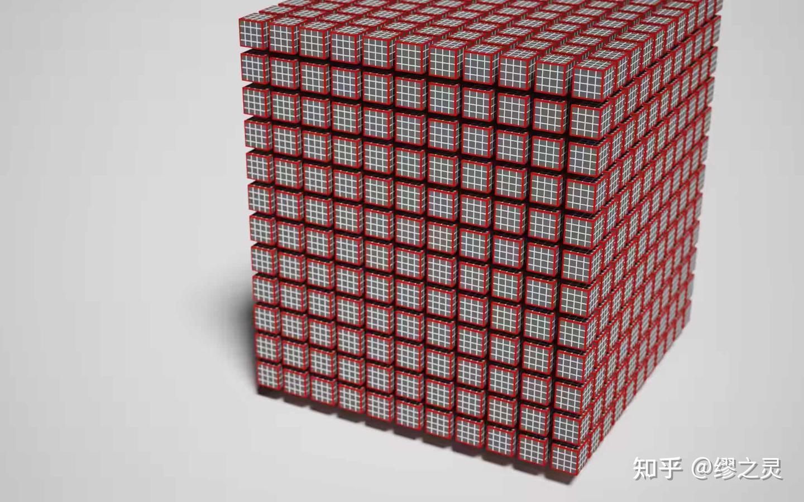
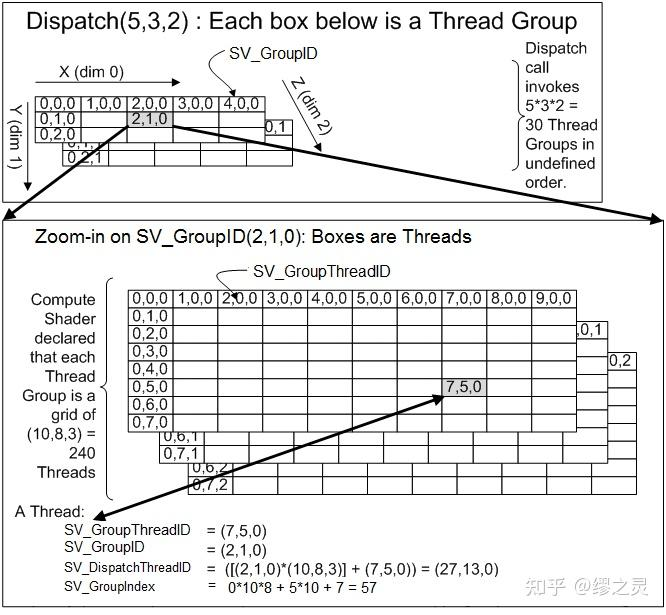

# 从零开始的 Vulkan（八）：计算管线

原文链接：

[从零开始的 Vulkan（八）：计算管线illurin.com/articles/vulkan08/](http://illurin.com/articles/vulkan08/)

假如离开了[图形渲染](https://zhida.zhihu.com/search?content_id=226934172&content_type=Article&match_order=1&q=图形渲染&zhida_source=entity)，GPU 还能干什么？GPU [通用计算](https://zhida.zhihu.com/search?content_id=226934172&content_type=Article&match_order=1&q=通用计算&zhida_source=entity)（General-purpose computing on GPU，GPGPU）向我们展现了一个美好的图景，使用 GPU 强大的并行处理能力，能够将 CPU 从的大量的重复运算中解放出来，实现远超传统 CPU 处理的运算速度。

在 GPGPU 的道路上，有诸如 OpenGL 的[计算着色器](https://zhida.zhihu.com/search?content_id=226934172&content_type=Article&match_order=1&q=计算着色器&zhida_source=entity)，微软的 Direct Compute，NVIDIA 的 CUDA 这些前辈，Vulkan 同样也有其自己的用于 GPGPU 的 API，也就是我们这节所要了解的计算管线。

## 存储资源对象

### 创建存储资源对象

在[光栅化](https://zhida.zhihu.com/search?content_id=226934172&content_type=Article&match_order=1&q=光栅化&zhida_source=entity)渲染中，我们通过将帧缓冲绑定到渲染通道上，来向[渲染目标](https://zhida.zhihu.com/search?content_id=226934172&content_type=Article&match_order=1&q=渲染目标&zhida_source=entity)中写入像素数据。但在计算管线中，既没有渲染通道也没有帧缓冲的概念，我们要做的事情更加简单，创建一个用于读写数据的存储资源对象，并通过描述符将其绑定到着色器阶段上，直接在着色器中对其进行**[原子操作](https://zhida.zhihu.com/search?content_id=226934172&content_type=Article&match_order=1&q=原子操作&zhida_source=entity)（atomic operations）**。

存储资源对象有以下几种：

- Storage Buffer：以缓冲的形式存储数据。
- Storage Buffer Dynamic：除了指定偏移的方式以外，和 Storage Buffer 相同。
- Storage Texel Buffer：以缓冲的形式存储数据，以图像的形式访问数据。
- Storage Image：以图像的形式存储数据，其子资源图像布局必须为`VK_IMAGE_LAYOUT_SHARED_PRESENT_KHR`或`VK_IMAGE_LAYOUT_GENERAL`。

> Storage Texel Buffer 和 Storage Image 可以在计算着色器中直接使用，但要在片元着色器使用，需要开启`fragmentStoresAndAtomics`特性；要在顶点/细分/几何着色器中使用，需要开启`vertexPipelineStoresAndAtomics`特性。

存储缓冲/存储图像的创建方法和普通的缓冲/图像并没有什么大的区别，唯一需要注意的就是在`usage`中指定作为存储资源对象使用：

```cpp
bufferInfo.setUsage(vk::BufferUsageFlagBits::eStorageBuffer); // 或 eStorageTexelBuffer
...
auto storageBuffer = device.createBuffer(bufferInfo);

imageInfo.setUsage(vk::ImageUsageFlagBits::eStorage);
...
auto storageImage = device.createImage(imageInfo);
```

### 描述符与 HLSL 资源绑定

下表简单阐述了存储资源对象对应的描述符类型，以及写入描述符时需要在`VkWriteDescriptorSet`中填写的信息：

| 存储资源对象           | 描述符类型                                | 描述符写入信息         |
| ---------------------- | ----------------------------------------- | ---------------------- |
| Storage Buffer         | VK_DESCRIPTOR_TYPE_STORAGE_BUFFER         | VkDescriptorBufferInfo |
| Storage Buffer Dynamic | VK_DESCRIPTOR_TYPE_STORAGE_BUFFER_DYNAMIC | VkDescriptorBufferInfo |
| Storage Texel Buffer   | VK_DESCRIPTOR_TYPE_STORAGE_TEXEL_BUFFER   | VkBufferView           |
| Storage Image          | VK_DESCRIPTOR_TYPE_STORAGE_IMAGE          | VkDescriptorBufferInfo |

HLSL 资源类型与 Vulkan 描述符类型的对应关系如下所示：

```cpp
// compute.hlsl

// Storage Buffer
RWStructuredBuffer<BufferStructure> storageBuffer;

// Storage Texel Buffer
RWBuffer<T> storageTexelBuffer;

// Storage Image
RWTexture1D<T> storageImage1D;
RWTexture2D<T> storageImage2D;
RWTexture3D<T> storageImage3D;
RWTexture1DArray<T> storageImage1DArray;
RWTexture2DArray<T> storageImage2DArray;
```

在下面的例子中，我们创建了一个能容纳两个描述符的描述符布局，第一个描述符指向用于着色器读取的存储图像，第二个描述指向用于写入数据的存储图像：

```cpp
std::array<vk::DescriptorSetLayoutBinding, 2> layoutBindings;

layoutBindings[0].setBinding(0)
                 .setDescriptorCount(1)
                 .setDescriptorType(vk::DescriptorType::eStorageImage)
                 .setStageFlags(vk::ShaderStageFlagBits::eCompute);

layoutBindings[1].setBinding(1)
                 .setDescriptorCount(1)
                 .setDescriptorType(vk::DescriptorType::eStorageImage)
                 .setStageFlags(vk::ShaderStageFlagBits::eCompute);

auto descriptorSetLayoutInfo = vk::DescriptorSetLayoutCreateInfo()
    .setBindings(layoutBindings);
auto descriptorSetLayout = device.createDescriptorSetLayout(descriptorSetLayoutInfo);
```

为我们使用的描述符布局分配描述符集：

```cpp
std::array<vk::DescriptorPoolSize, 1> poolSizes;
poolSizes[0].setType(vk::DescriptorType::eStorageImage)
            .setDescriptorCount(2);

auto descriptorPoolInfo = vk::DescriptorPoolCreateInfo()
    .setPoolSizes(poolSizes)
    .setMaxSets(1);
auto descriptorPool = device.createDescriptorPool(descriptorPoolInfo);

auto descriptorSetAllocateInfo = vk::DescriptorSetAllocateInfo()
    .setDescriptorPool(descriptorPool)
    .setDescriptorSetCount(1)
    .setSetLayouts(descriptorSetLayout);
auto descriptorSets = device.allocateDescriptorSets(descriptorSetAllocateInfo);
```

向描述符集中写入描述符：

```cpp
std::array<vk::WriteDescriptorSet, 2> descriptorWrites;

auto shaderReadWrite = vk::DescriptorImageInfo()
    .setImageLayout(vk::ImageLayout::eGeneral)
    .setImageView(shaderReadImageView);
descriptorWrites[1].setImageInfo(shaderReadWrite)
                   .setDstSet(descriptorSets[0])
                   .setDescriptorType(vk::DescriptorType::eStorageImage)
                   .setDescriptorCount(1)
                   .setDstBinding(0)
                   .setDstArrayElement(0);

auto renderTargetWrite = vk::DescriptorImageInfo()
    .setImageLayout(vk::ImageLayout::eGeneral)
    .setImageView(renderTargetImageView);
descriptorWrites[1].setImageInfo(renderTargetWrite)
                   .setDstSet(descriptorSets[0])
                   .setDescriptorType(vk::DescriptorType::eStorageImage)
                   .setDescriptorCount(1)
                   .setDstBinding(1)
                   .setDstArrayElement(0);

device.updateDescriptorSets(descriptorWrites, nullptr);
```

在 HLSL 中完成对资源的绑定：

```cpp
// compute.hlsl

RWTexture2D<float4> shaderRead   : register(u0);
RWTexture2D<float4> renderTarget : register(u1);
```

## 计算空间与计算着色器

### 计算空间

在介绍计算着色器之前，我们首先需要了解**计算空间**的概念：计算空间是一个用三维空间来描述 GPU 线程执行方式的抽象模型，它将线程抽象成一个个的小格子，并组合成多个**工作组（[线程组](https://zhida.zhihu.com/search?content_id=226934172&content_type=Article&match_order=1&q=线程组&zhida_source=entity)）**，以便从外部将工作分派到线程上并行执行，分派工作的过程就称为**调度**。

- **线程（thread）：** 在单个线程上完成对计算着色器的一次调用，线程上的指令按顺序执行。
- **工作组/线程组（work/thread group）：** 由多个线程组成的三维网格。在同一个工作组中的线程是并行执行的，来自不同工作组中的线程也可能并行执行，但这并不由硬件调控，需要通过其它手段来达成。每个工作组都有一块**组内的[共享内存](https://zhida.zhihu.com/search?content_id=226934172&content_type=Article&match_order=1&q=共享内存&zhida_source=entity)（group shared memory）**。
- **调度（dispatch）：** 由多个工作组组成的三维网格。通过将对应的命令提交到计算队列中来执行一次调度，同时指定需要分派的工作组数量及其 X、Y、Z 坐标。

下图演示了一次计算调度具象化后的模样，其中白色小立方体代表线程，红色立方体代表工作组，红色立方体由 4³ 个白色小立方体构成，代表一个工作组拥有 64 个线程：



（图片来自 https://surma.dev/things/webgpu/）

在 HLSL 中，我们可以通过一系列系统值来查询当前线程位于计算空间中的位置：

- `SV_GroupID`：当前工作组在单次调度中的位置。
- `SV_GroupThreadID`：当前线程在其对应工作组中的位置。
- `SV_DispatchThreadID`：当前线程在单次调度中的全局位置。

```text
SV_DispatchThreadID = (SV_GroupID × NumThreadsPerGroup) + SV_GroupThreadID
```

- `SV_GroupIndex`：`SV_GroupThreadID`的扁平数组索引版本。

```text
SV_GroupIndex = SV_GroupThreadID.z × NumThreadsPerGroup.x × NumThreadsPerGroup.y + 
                SV_GroupThreadID.y × NumThreadsPerGroup.x + 
                SV_GroupThreadID.x
```

下图以工作组大小为 10 × 8 × 3，调度数量为 5 × 3 × 2 为例，演示了计算空间中的坐标计算原理：



（图片来自 Microsoft 官方文档）

NVIDIA GPU 通过将每个工作组划分为 32 个**[线程束](https://zhida.zhihu.com/search?content_id=226934172&content_type=Article&match_order=1&q=线程束&zhida_source=entity)（thread wrap）** 来运行计算管线，每个线程束采用 **SIMT（单指令多线程）** 执行模式运行，这意味着我们应该更多地将工作组中的线程数设为 **32 或 128 的倍数**。

每个**[流式多处理器](https://zhida.zhihu.com/search?content_id=226934172&content_type=Article&match_order=1&q=流式多处理器&zhida_source=entity)（streaming multiprocessor，SM）** 可以一次处理多个工作组，这意味着每个工作组拥有多个线程束运行效率会更高，但每个工作组都有一些线程束数量的限制，并且寄存器的数量和共享内存的大小也会影响最佳的工作组大小。

当然，我们能分派的工作组数量也是有限的，通过`VkPhysicalDeviceProperties::limits`来获取与计算空间相关的硬件限制，如下所示：

```cpp
vk::PhysicalDevice physicalDevice;
auto properties = physicalDevice.getProperties();
properties.limits.maxComputeWorkGroupCount;       // 单次调度中所能分派的最大工作组数量
properties.limits.maxComputeWorkGroupInvocations; // 单个工作组中能拥有的最大线程数量（计算着色器调用次数），一般是 1024
properties.limits.maxComputeWorkGroupSize;        // 工作组的最大大小
```

### 计算着色器

计算着色器的入口点函数并没有返回值，但我们可以通过函数的参数来获取需要的系统值。在入口点函数之前，必须用`[numthreads(<groupSize>)]`标识来指定所使用的工作组的大小（即线程的数量）。

```cpp
// compute.hlsl

struct ComputeSpace {
    uint3 groupId          : SV_GroupID;
    uint3 groupThreadId    : SV_GroupThreadID;
    uint3 dispatchThreadId : SV_DispatchThreadID;
    uint  groupIndex       : SV_GroupIndex;
};

groupshared float4 sharedMemory[cacheSize];

[numthreads(10, 8, 3)]
void main(ComputeSpace computeSpace) {
    ...
    // 等待所有线程完成任务
    GroupMemoryBarrierWithGroupSync();
}
```

使用`groupshared`关键字来声明一块组内的共享内存，它的访问速度很快，可以和[高速缓存](https://zhida.zhihu.com/search?content_id=226934172&content_type=Article&match_order=1&q=高速缓存&zhida_source=entity)的速度相当，所以为了优化性能，如果有需要频繁读取的数据，最好是先存储到共享内存中再进行使用。为了避免发生访问冲突，HLSL 提供了下列[内置函数](https://zhida.zhihu.com/search?content_id=226934172&content_type=Article&match_order=1&q=内置函数&zhida_source=entity)来控制对共享内存的访问：

- `GroupMemoryBarrier`：阻塞组内的所有线程，直到对共享内存的访问全部完成。
- `GroupMemoryBarrierWithGroupSync`：阻塞组内的所有线程，直到对共享内存的访问全部完成，并且所有线程都已到达此调用。

> 使用 DXC 编译计算着色器，需要将 profile [命令行参数](https://zhida.zhihu.com/search?content_id=226934172&content_type=Article&match_order=1&q=命令行参数&zhida_source=entity)设为`cs_5_x`或`cs_6_x`。

### 一个简单的例子：[高斯模糊](https://zhida.zhihu.com/search?content_id=226934172&content_type=Article&match_order=1&q=高斯模糊&zhida_source=entity)

诸如高斯模糊之类的图像操作由于涉及到大量的像素操作，是十分适合交由计算管线进行并行处理的，在这里我们就以高斯模糊作为一个简单的例子，来熟悉计算着色器的具体用法。

首先我们要确定使用的工作组大小，通常的选择是 256 个线程，由于我们需要横向和纵向各执行一次模糊，所以需要使用两个计算着色器，工作组大小分别是 256 × 1 × 1 和 1 × 256 × 1，我们要调度的工作组数量即图片尺寸除以 256 再向上取整。

我们将读取的图像像素数据存入共享内存中，由于模糊半径的原因，我们需要存储的图像要比实际图像宽 2 个半径。

```cpp
// compute.hlsl

#define groupSize 256
#define blurRadius 5
#define cacheSize (groupSize + 2 * blurRadius)

RWTexture2D<float4> shaderRead   : register(u0);
RWTexture2D<float4> renderTarget : register(u1);

groupshared float4 sharedMemory[cacheSize];

[numthreads(groupSize, 1, 1)]
void HorizontalBlurMain(uint3 groupThreadId    : SV_GroupThreadID,
                        uint3 dispatchThreadId : SV_DispatchThreadID) {
    ...
}

[numthreads(1, groupSize, 1)]
void VerticalBlurMain(uint3 groupThreadId    : SV_GroupThreadID,
                      uint3 dispatchThreadId : SV_DispatchThreadID) {
    ...
}
```

在水平方向模糊和在竖直方向模糊的两个着色器入口点函数完整代码如下：

```cpp
// 利用高斯函数求得的模糊核
const float weights[] = {
    0.227027, 0.1945946, 0.1216216, 0.054054, 0.016216
};

[numthreads(groupSize, 1, 1)]
void HorizontalBlurMain(uint3 groupThreadId    : SV_GroupThreadID,
                        uint3 dispatchThreadId : SV_DispatchThreadID) {
    // 得到图像的宽高
    uint2 imageSize;
    shaderRead.GetDimensions(imageSize.x, imageSize.y);
    
    // 将边界点像素数据存入共享内存，钳制越界访问
    if (groupThreadId.x < blurRadius) {
        uint clampedX = max(dispatchThreadId.x - blurRadius, 0);
        sharedMemory[groupThreadId.x] = shaderRead[uint2(clampedX, dispatchThreadId.y)];
    }
    else if (dispatchThreadId.x >= groupSize - blurRadius) {
        uint clampedX = min(dispatchThreadId.x + blurRadius, imageSize.x - 1);
        sharedMemory[groupThreadId.x + 2 * blurRadius] = shaderRead[uint2(clampedX, dispatchThreadId.y)];
    }
    
    // 将图像像素数据存入共享内存（防止访问越界）
    sharedMemory[groupThreadId.x + blurRadius] = shaderRead[min(dispatchThreadId.xy, imageSize - 1)];
    
    // 等待所有线程完成任务
    GroupMemoryBarrierWithGroupSync();
    
    // 根据模糊半径对图像进行横向模糊
    float4 blurColor = weights[0] * sharedMemory[groupThreadId.x + blurRadius];
    [unroll] // 展开流处理语句
    for (int i = 1; i <= blurRadius; ++i) {
        blurColor += weights[i] * sharedMemory[groupThreadId.x + blurRadius - i];
        blurColor += weights[i] * sharedMemory[groupThreadId.x + blurRadius + i];
    }
    renderTarget[dispatchThreadId.xy] = blurColor;
}

[numthreads(1, groupSize, 1)]
void VerticalBlurMain(uint3 groupThreadId    : SV_GroupThreadID,
                      uint3 dispatchThreadId : SV_DispatchThreadID) {
    // 得到图像的宽高
    uint2 imageSize;
    shaderRead.GetDimensions(imageSize.x, imageSize.y);
    
    // 将边界点像素数据存入共享内存，钳制越界访问
    if (groupThreadId.y < blurRadius) {
        uint clampedY = max(dispatchThreadId.y - blurRadius, 0);
        sharedMemory[groupThreadId.y] = shaderRead[uint2(dispatchThreadId.x, clampedY)];
    }
    else if (dispatchThreadId.y >= groupSize - blurRadius) {
        uint clampedY = min(dispatchThreadId.y + blurRadius, imageSize.y - 1);
        sharedMemory[groupThreadId.y + 2 * blurRadius] = shaderRead[uint2(dispatchThreadId.x, clampedY)];
    }
    
    // 将图像像素数据存入共享内存（防止访问越界）
    sharedMemory[groupThreadId.y + blurRadius] = shaderRead[min(dispatchThreadId.xy, imageSize - 1)];
    
    // 等待所有线程完成任务
    GroupMemoryBarrierWithGroupSync();
    
    // 根据模糊半径对图像进行纵向模糊
    float4 blurColor = weights[0] * sharedMemory[groupThreadId.y + blurRadius];
    [unroll] // 展开流处理语句
    for (int i = 1; i <= blurRadius; ++i) {
        blurColor += weights[i] * sharedMemory[groupThreadId.y + blurRadius - i];
        blurColor += weights[i] * sharedMemory[groupThreadId.y + blurRadius + i];
    }
    renderTarget[dispatchThreadId.xy] = blurColor;
}
```

## 计算管线

计算管线的创建要比图形管线简单得多，我们不必设置一大堆管线状态，只需要准备好需要使用的着色器模块和管线布局即可。

填写管线着色器信息的代码如下：

```cpp
vk::ComputePipelineCreateInfo pipelineInfo;

auto shaderStageInfo = vk::PipelineShaderStageCreateInfo()
    .setModule(computeShaderModule)
    .setPName("main")
    .setStage(vk::ShaderStageFlagBits::eCompute);

pipelineInfo.setStage(shaderStageInfo);
```

创建管线布局的代码如下：

```cpp
auto pipelineLayoutInfo = vk::PipelineLayoutCreateInfo()
    .setSetLayouts(descriptorSetLayout);
auto pipelineLayout = device.createPipelineLayout(pipelineLayoutInfo);

pipelineInfo.setLayout(pipelineLayout);
```

最终完成计算管线的创建：

```cpp
auto pipeline = device.createComputePipeline(nullptr, pipelineInfo).value;

// 清理残余的着色器模块对象
device.destroy(computeShaderModule);
```

## 执行调度命令

### 计算队列

之前我们提到过所有 GPU 操作命令都是通过队列（Queue）间接放置到 GPU 引擎上进行执行的，图形操作需要被分派到图形队列上进行执行，对应的，计算操作也需要被分派到计算队列上进行执行。

通过以下方法查询可用的计算队列族，并为该队列族创建一个队列：

```cpp
// 获取支持计算操作的队列族

auto queueProp = physicalDevice.getQueueFamilyProperties();
uint32_t computeQueueFamilyIndex = 0;

bool found = false;
for (size_t i = 0; i < queueProp.size(); i++) {
    if (queueProp[i].queueFlags & vk::QueueFlagBits::eCompute) {
        computeQueueFamilyIndex = i;
        found = true;
        break;
    }
}
if (!found)
    throw std::runtime_error("Cannot find queue family");

// 在创建逻辑设备的同时创建出计算队列

std::array<float, 1> priorities = { 0.0f };
auto deviceQueueInfo = vk::DeviceQueueCreateInfo()
    .setQueuePriorities(priorities)
    .setQueueFamilyIndex(computeQueueFamilyIndex);

deviceInfo.setQueueCreateInfos(deviceQueueInfo);
auto device = physicalDevice.createDevice(deviceInfo);

// 获取创建出的计算队列

auto queue = device.getQueue(computeQueueFamilyIndex, 0);
```

在大部分情况下，Vulkan 要求物理设备至少具有一个同时支持图形和计算操作的队列族，将图形操作和计算操作分派到同一个队列上可以避免同步带来的麻烦；但在一些情况下，我们需要用到专门的计算队列，这意味着**[异步计算](https://zhida.zhihu.com/search?content_id=226934172&content_type=Article&match_order=1&q=异步计算&zhida_source=entity)队列**的存在，如何处理图形操作和计算操作之间的顺序关系，是一个需要特别关注的问题。

### 调度命令

在完成管线和描述符集的绑定后，我们就可以将调度命令放置到命令缓冲区中了，调度命令有几个不同的版本，接下来我们来一一对它们进行了解。

```c
void vkCmdDispatch(
  VkCommandBuffer commandBuffer,
  uint32_t groupCountX,
  uint32_t groupCountY,
  uint32_t groupCountZ);
```

这是调度命令最基础的版本，`groupCountX`、`groupCountY`、`groupCountZ`三个参数指定了调度的工作组数量，对应 HLSL 中的系统值`SV_GroupID`和`SV_DispatchThreadID`。

```c
void vkCmdDispatchIndirect(
  VkCommandBuffer commandBuffer,
  VkBuffer buffer,
  VkDeviceSize offset);
```

调度命令的间接版本，将工作组数量放在`VkDispatchIndirectCommand`结构体里，存储在设备内存中，通过缓冲区来间接引用。

```c
// Provided by VK_VERSION_1_1
void vkCmdDispatchBase(
  VkCommandBuffer commandBuffer,
  uint32_t baseGroupX,
  uint32_t baseGroupY,
  uint32_t baseGroupZ,
  uint32_t groupCountX,
  uint32_t groupCountY,
  uint32_t groupCountZ);
```

带有工作组偏移量的调度命令，该调度命令可以为`SV_GroupID`附加一个额外的偏移量，使其不再从零开始。

### 队列间同步

在录制完所有的命令后，将命令缓冲区提交给队列执行，假如我们使用的图像队列和计算队列是分开的，就需要考虑队列间的同步问题，CPU 和 GPU 的执行顺序不一致的，这就意味着即使我们按顺序提交队列，它们在实际执行时也不一定遵照此顺序。

一个解决此问题的方法是使用 Semaphore：假设我们需要计算队列执行完成后，再允许图形队列开始执行，则我们可以创建一个 Semaphore，让计算队列去触发它，图形队列去等待它，实现代码如下：

```cpp
auto computeFinishedSemaphore = device.createSemaphore(vk::SemaphoreCreateInfo());

...

auto computeSubmitInfo = vk::SubmitInfo()
    .setCommandBuffers(computeCommmandBuffer)
    .setSignalSemaphores(computeFinishedSemaphore);
computeQueue.submit(computeSubmitInfo);

auto graphicsSubmitInfo = vk::SubmitInfo()
    .setCommandBuffers(graphicsCommandBuffer)
    .setWaitSemaphores(computeFinishedSemaphore)
    .setWaitDstStageMask(waitDstStageMask);     // 需要等待信号量的管线阶段
graphicsQueue.submit(graphicsSubmitInfo);
```

另一个方法是使用 Fence，在主机端强制[等待队列](https://zhida.zhihu.com/search?content_id=226934172&content_type=Article&match_order=1&q=等待队列&zhida_source=entity)执行完成，这样做的缺点是降低了 CPU 和 GPU 的并行度，实现代码如下：

```cpp
auto fence = device.createFence(vk::FenceCreateInfo());

...

auto computeSubmitInfo = vk::SubmitInfo()
    .setCommandBuffers(computeCommmandBuffer);
computeQueue.submit(computeSubmitInfo, fence);

device.waitForFences(fence, VK_TRUE, UINT64_MAX);
device.resetFences(fence);

auto graphicsSubmitInfo = vk::SubmitInfo()
    .setCommandBuffers(graphicsCommandBuffer)
    .setWaitSemaphores(computeFinishedSemaphore)
    .setWaitDstStageMask(waitDstStageMask);
graphicsQueue.submit(graphicsSubmitInfo);
```

综上，我们了解了如何在 Vulkan 中使用计算管线来实现 GPGPU，将大量的重复运算移交给 GPU，减轻 CPU 的负担，能更加增强程序的效率与灵活度。

