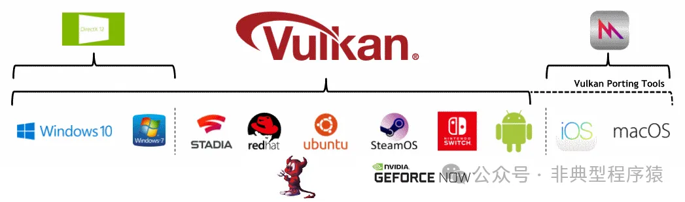
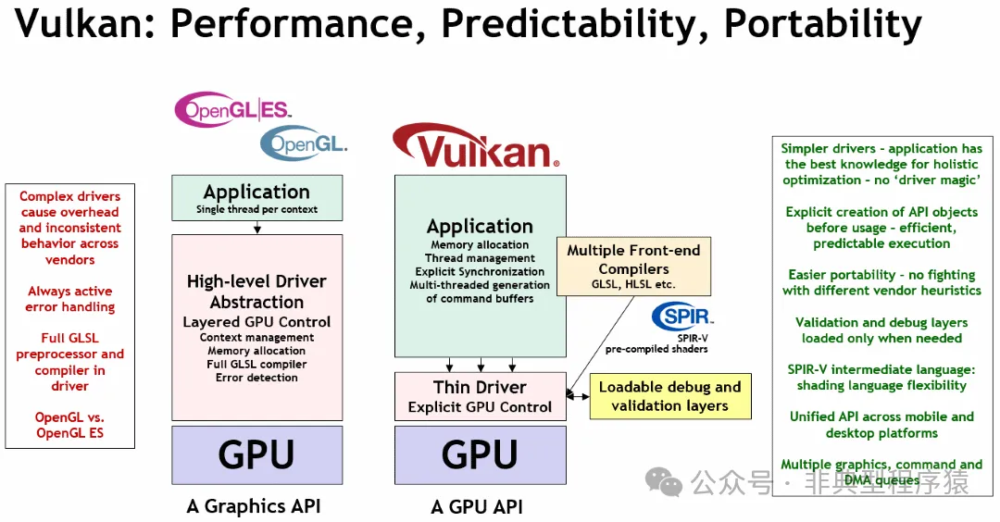
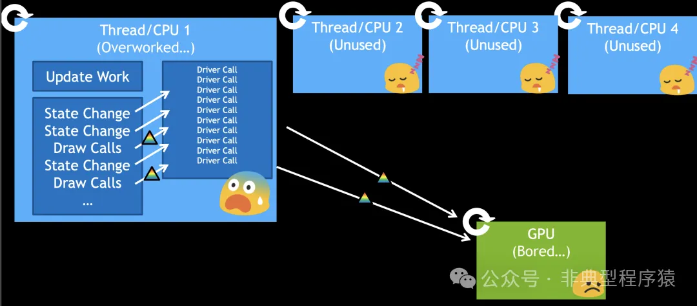
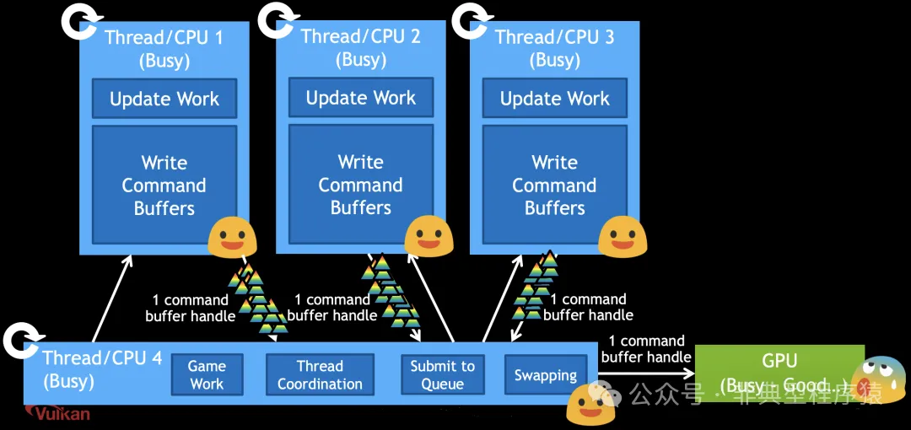
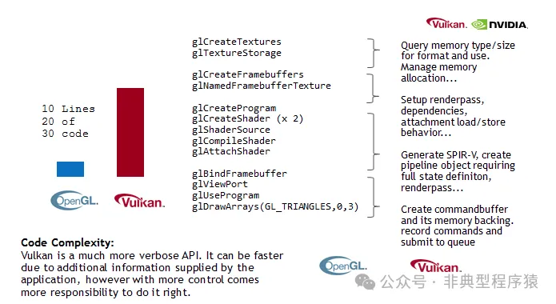
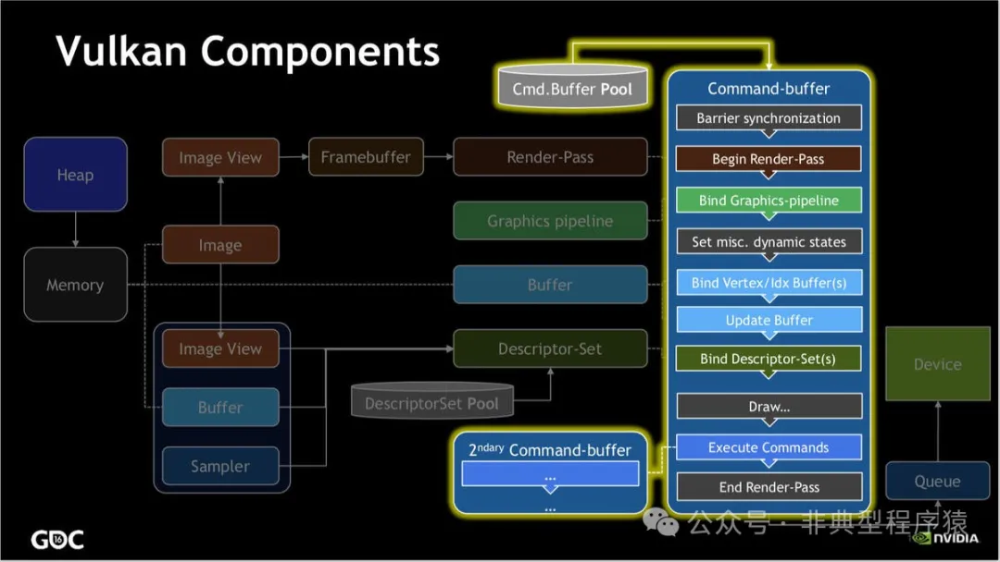

# 【Vulkan 入门系列】什么是 Vulkan API？（一）

Vulkan 是 Khronos 组织（搞 OpenGL 的组织）的新 API，最早由 Khronos 组织 在 2015 年游戏开发者大会（GDC）上发表，它提供了对现代显卡更好的抽象。Khronos 最先把 Vulkan API 称为“下一代 OpenGL 行动”（next generation OpenGL initiative）或“glNext”，但在正式宣布 Vulkan 之后这些名字就没有再使用了。Vulkan API 允许你更好地描述应用程序打算做什么，这与现有的 API（如 OpenGL 和 Direct3D）相比，可以带来更好的性能和更少的意外驱动程序行为。Vulkan 背后的想法与 Direct3D 12 和 Metal 类似，但 Vulkan 的优势在于它完全是跨平台的，并且允许同时为 Windows、Linux、Android 和鸿蒙，甚至 macOS、iOS （MoltenVK 是 Vulkan 可移植性实现。它将 Vulkan API 的子集分层到 Apple 的 Metal 图形框架上，使 Vulkan 应用程序能够在 macOS、iOS 和 tvOS 上运行）上进行开发。

Vulkan 是新一代图形和计算 API，可提供高效、跨平台访问现代 GPU。Vulkan 不是一家公司，也不是一种语言，而是一种让开发人员以跨平台和跨供应商的方式对其现代 GPU 硬件进行编程的方式。Khronos 组织是一个由成员驱动的联盟，它创建并维护着 Vulkan。

## 一、为什么需要 Vulkan？

第一次看到 Vulkan API 只能用一个词形容：复杂！比如在安卓手机屏幕上绘制一个三角形，使用 OpenGL API 可以较为轻松办到，而调用 Vulkan 去实现需要写非常多的代码。既然 Vulkan 一开始叫“下一代 OpenGL 行动”，那说明是用来解决 OpenGL 既有问题的，代表着以后要替换掉 OpenGL。不过 Vulkan 并不是 OpenGL 的直接替代品，而是一个显式 API，允许更明确地控制 GPU。

OpenGL 最初由硅图公司（Silicon Graphics）在 1991 年开发，旨在提供一个高性能的图形渲染解决方案，现在也是由 Khronos 组织维护。经过这么多年的发展，现已经逐渐满足不了行业的需要。但是现已经逐渐满足不了行业的需要。GPU 的可编程性越来越强，越来越多的平台开始支持加速图形、计算、视觉和深度学习，灵活性和可移植性变得很重要。性能上，OpenGL 也不能充分发挥现代 CPU 多核多线程的性能优势。

为了解决上述问题，行业对新一代 GPU API 的提出了更高的要求：

1. Explicit（明确、透明）：GPU driver 做更少的事情，把更多的控制权交给开发者。
2. Streamlined（精简）：更高的性能，更低的开销，更少的延迟。
3. Portable（可移植）：云端、桌面、游戏主机、移动设备以及嵌入式设备都可使用。
4. Extensible （可扩展）：支持新功能的扩展，推动行业技术进步。

**Vulkan 的优势**

1. 高性能：Vulkan 的设计允许更直接地控制 GPU，减少了驱动程序的开销，使其在高性能应用中表现出色。
2. 多线程支持：Vulkan 原生支持多线程，能够更有效地利用多核 CPU，提升渲染性能。
3. 更低的开销：通过减少驱动程序的开销，Vulkan 提供了更细粒度的控制和更高效的资源管理。
4. 统一的跨平台支持：Vulkan 支持多种操作系统，并且提供了一致的行为和性能，包括 Windows、Linux、Android 和鸿蒙，甚至 macOS 和 iOS 。

## 二、OpenGL vs Vulkan

以下是 OpenGL 与 Vulkan 的详细对比分析。

### 2.1 架构设计

**OpenGL**：

**状态机模型**：通过全局状态控制渲染流程（如设置纹理、着色器），状态切换可能导致驱动开销。
**隐式管理**：驱动程序自动处理资源管理和同步，开发者无需直接控制底层细节。

**Vulkan**：

**显式控制**：基于命令缓冲区的设计，开发者需手动管理资源、同步和多线程。
**模块化架构**：分离管线、描述符集和内存分配，提供更细粒度的硬件控制。

OpenGL 使用单一全局状态，并且必须为每次绘制调用重新创建必要的渲染状态和资源绑定表。使用的状态组合仅在绘制时才为人所知，这意味着某些优化很难应用或成本高昂。

Vulkan 使用基于对象的状态（称为描述符），允许应用程序提前打包使用状态的组合。编译后的管道对象组合了所有相关状态，从而可以更可预测地应用基于着色器的优化，以降低运行时成本。

这些变化的影响是显著减少图形驱动程序的 CPU 开销，但代价是要求应用程序预先确定所需的状态，以便构建状态对象并从减少的开销中受益。

比如在 OpenGL 中，切换纹理只需 `glBindTexture`；而 Vulkan 需配置描述符集并绑定到命令缓冲区。

### 2.2 性能

**OpenGL**：

驱动优化可能导致性能不可预测，多线程支持有限（通常主线程渲染）。

**Vulkan**：

**更低 CPU 开销**：多线程并行录制命令缓冲区，减少驱动瓶颈。
**更高效资源利用**：显式内存管理和同步减少冗余操作。

OpenGL 使用同步渲染模型，这意味着 API 调用必须表现得好像所有先前的 API 调用都已处理过一样。实际上，没有现代 GPU 以这种方式工作，渲染工作负载是异步处理的，同步模型是设备驱动程序维护的复杂假象。为了保持这种假象，驱动程序必须跟踪队列中每个渲染操作读取或写入的资源，确保工作负载按合法顺序运行以避免渲染损坏，并确保需要数据资源的 API 调用被阻止并等待，直到该资源安全可用。

Vulkan 使用异步渲染模型，反映了现代 GPU 的工作方式。应用程序将渲染命令排队到队列中，使用显式调度依赖项来控制工作负载执行顺序，并使用显式同步原语来协调相关的 CPU 和 GPU 处理。

这些变化的影响是显著减少图形驱动程序的 CPU 开销，但代价是要求应用程序处理依赖管理和同步。

OpenGL 使用单线程渲染模型，这严重限制了应用程序在主渲染管道中使用多个 CPU 核心的能力。典型的 CPU 工作模式为一核有难，多核围观（睡大觉），而且 GPU 利用率也不高！

Vulkan 使用多线程渲染模型，允许应用程序在多个 CPU 核心上并行执行渲染操作。GPU 被彻底调用了起来，并且 CPU 的多个核心也忙碌了起来，效率显然更高。

### 2.3 开发复杂度

**OpenGL**：

**快速上手**：简单API设计（如 `glDrawArrays`），适合原型开发。
**隐藏复杂性**：错误可能延迟暴露（如错误配置在绘制时崩溃）。

**Vulkan**：

**高入门门槛**：需编写大量模板代码（如创建管线需 50+ 参数）。
**显式管理**：必须处理内存分配、同步（如信号量/栅栏）和资源生命周期。

Vulkan 的初始化代码量通常是 OpenGL 的 5-10 倍。

### 2.4 内存管理

**OpenGL**：

驱动自动管理内存，但可能碎片化或过度分配。

**Vulkan**：

显式分配内存（`VkAllocation`），支持自定义内存池和重用策略。减少内存浪费，提升缓存效率（如 GPU 专属内存标记）。

OpenGL 使用客户端-服务器内存模型。此模型明确划分了客户端 (CPU) 和服务器 (GPU) 上可访问的资源，并提供了在两者之间移动数据的传输函数。这有两个主要副作用：

1. 应用程序无法直接分配或管理支持服务器端资源的内存。驱动程序将使用内部内存分配器单独管理所有这些资源，而不会意识到任何可以利用以降低成本的更高级别的关系。
2. 客户端和服务器之间的资源同步是有成本的，特别是在 API 的同步渲染要求和异步处理现实存在冲突的情况下。

Vulkan 专为现代硬件而设计，并假设 CPU 和 GPU 可见内存设备之间存在一定程度的硬件支持内存一致性。这允许 API 让应用程序更直接地控制内存资源、内存分配方式和更新方式。

这些变化的影响是减少驱动程序的 CPU 负载，并让应用程序更好地控制内存管理。应用程序可以进一步减少 CPU 负载，例如，将具有相同生命周期的对象分组到单个分配中并跟踪该分配，而不是分别跟踪它们。

### 2.5 错误处理与调试

**OpenGL**：

`glGetError` 逐行检查，难以追踪复杂错误。

**Vulkan**：

**严格返回码**：每个 API 调用返回 `VkResult`。
**验证层**：动态启用调试层检测资源泄漏或同步错误。

### 2.6 应用场景

**OpenGL**：

教育、快速原型、2D/简单 3D 应用（如 Unity 旧版本）。

**Vulkan**：

AAA 游戏、高性能计算（AI 推理）、引擎开发（Unreal/Unity 支持）。

### 2.7 未来趋势

**OpenGL**：维护模式，Khronos 组织已停止重大更新。
**Vulkan**：持续演进，支持新硬件特性（如 AI 降噪、虚拟现实）。

## 三、Vulkan 渲染的基本步骤

现在，开始概述一个行为良好的 Vulkan 程序中渲染三角形所需的所有步骤。

### 3.1 步骤 1：实例和物理设备选择

Vulkan 应用程序首先通过 `VkInstance` 设置 Vulkan API。实例是通过描述应用程序以及将使用的任何 API 扩展来创建的。创建实例后，可以查询 Vulkan 支持的硬件并选择一个或多个 `VkPhysicalDevice` 来用于操作。可以查询诸如 VRAM 大小和设备功能之类的属性来选择所需的设备，例如首选使用专用显卡。

### 3.2 步骤 2：逻辑设备和队列族

选择要使用的正确的硬件设备后，需要创建一个 `VkDevice`（逻辑设备），在其中更具体地描述将使用的 `VkPhysicalDeviceFeatures`，例如多视口渲染和 64 位浮点数。还需要指定要使用哪些队列族。使用 Vulkan 执行的大多数操作（例如绘制命令和内存操作）都是通过将它们提交到 `VkQueue` 来异步执行的。队列是从队列族中分配的，其中每个队列族在其队列中支持一组特定的操作。例如，图形、计算和内存传输操作可能有单独的队列族。队列族的可用性也可以用作物理设备选择中的一个区别因素。具有 Vulkan 支持的设备有可能不提供任何图形功能，但是，如今所有具有 Vulkan 支持的显卡通常都支持我们感兴趣的所有队列操作。

### 3.3 步骤 3：窗口 Surface 和交换链

除非你只对离屏渲染感兴趣，否则需要创建一个窗口来呈现渲染后的图像。

我们需要另外两个组件才能真正渲染到窗口：一个窗口 Surface (`VkSurfaceKHR`) 和一个交换链 (`VkSwapchainKHR`)。请注意 KHR 后缀，这意味着这些对象是 Vulkan 扩展的一部分。Surface 是对窗口进行渲染的跨平台抽象，通常通过提供对本地窗口（比如 Android 的 ANativeWindow、Windows 上的 HWND）句柄的引用来实例化 。

交换链是一组渲染目标。其基本目的是确保我们当前正在渲染的图像与当前在屏幕上的图像不同。这对于确保只显示完整的图像非常重要。每次我们要绘制一帧时，我们都必须要求交换链向我们提供一个要渲染的图像。当我们完成绘制一帧时，该图像将返回到交换链，以便在某个时间点将其呈现到屏幕上。渲染目标的数量以及将完成的图像呈现到屏幕的条件取决于呈现模式。常见的呈现模式是双缓冲（垂直同步）和三缓冲。

某些平台允许直接渲染到显示器，而无需通过 `VK_KHR_display` 和 `VK_KHR_display_swapchain` 扩展与任何窗口管理器进行交互。这些扩展允许创建一个表示整个屏幕的 Surface，例如，可用于实现你自己的窗口管理器。

### 3.4 步骤 4：图像视图和帧缓冲

要绘制到从交换链获取的图像，我们必须将其包装到 `VkImageView` 和 `VkFramebuffer` 中。图像视图引用要使用的图像的特定部分，而帧缓冲引用要用于颜色、深度和模板目标的图像视图。由于交换链中可能存在许多不同的图像，因此我们将为每个图像预先创建一个图像视图和帧缓冲，并在绘制时选择正确的图像视图和帧缓冲。

### 3.5 步骤 5：渲染通道

Vulkan 中的渲染通道描述了渲染操作期间使用的图像类型、它们的使用方式以及应如何处理其内容。在我们最初的三角形渲染应用程序中，我们将告诉 Vulkan 使用单个图像作为颜色目标，并且希望在绘制操作之前将其清除为纯色。渲染通道仅描述图像类型，而 `VkFramebuffer` 实际上将特定图像绑定到这些槽。

### 3.6 步骤 6：图形管线

Vulkan 中的图形管线通过创建 `VkPipeline` 对象来设置。它描述了显卡的可配置状态，例如视口大小和深度缓冲区操作，以及使用 `VkShaderModule` 对象的可编程状态。`VkShaderModule` 对象是从着色器字节码创建的。驱动程序还需要知道管线中将使用哪些渲染目标，我们通过引用渲染通道来指定这些渲染目标。

与现有 API 相比，Vulkan 最突出的功能之一是，几乎所有图形管线的配置都需要预先设置。这意味着，如果要切换到不同的着色器或稍微更改顶点布局，则需要完全重新创建图形管线。这意味着必须预先为渲染操作所需的所有不同组合创建许多 `VkPipeline` 对象。只有一些基本配置，例如视口大小和清除颜色，可以动态更改。所有状态也需要显式描述，例如，没有默认的颜色混合状态。

好消息是，由于正在进行类似于预先编译而不是即时编译的操作，因此驱动程序有更多的优化机会，并且运行时性能更可预测，因为像切换到不同的图形管线这样的大状态更改非常明确。

### 3.7 步骤 7：命令池和命令缓冲区

我们在 Vulkan 中要执行的许多操作（例如绘制操作）都需要提交到队列。这些操作首先需要记录到 `VkCommandBuffer` 中，然后才能提交。这些命令缓冲区是从与特定队列族关联的 `VkCommandPool` 中分配的。要绘制一个简单的三角形，我们需要记录一个包含以下操作的命令缓冲区：

1. 开始渲染通道
2. 绑定图形管线
3. 绘制 3 个顶点
4. 结束渲染通道

由于帧缓冲中的图像取决于交换链将提供给我们的特定图像，因此我们需要为每个可能的图像记录一个命令缓冲区，并在绘制时选择正确的命令缓冲区。另一种方法是每帧再次记录命令缓冲区，但这效率不高。

### 3.8 步骤 8：主循环

现在绘制命令已包装到命令缓冲区中，主循环非常简单。我们首先使用 `vkAcquireNextImageKHR` 从交换链获取一个图像。然后，我们可以为该图像选择适当的命令缓冲区，并使用 `vkQueueSubmit` 执行它。最后，我们将图像返回到交换链，以便使用 `vkQueuePresentKHR` 呈现到屏幕上。

提交到队列的操作是异步执行的。因此，我们必须使用诸如信号量之类的同步对象来确保正确的执行顺序。必须设置绘制命令缓冲区的执行以等待图像获取完成，否则可能会发生我们开始渲染到仍在读取以在屏幕上呈现的图像的情况。`vkQueuePresentKHR` 调用反过来需要等待渲染完成，为此我们将使用第二个信号量，该信号量在渲染完成后发出信号。

### 3.9 总结

这个快速导览应该能让你基本了解绘制第一个三角形所需的工作。一个真实的程序包含更多的步骤，例如分配顶点缓冲区、创建统一缓冲区和上传纹理图像等。简而言之，要绘制第一个三角形，我们需要：

1. 创建一个 `VkInstance`
2. 选择一个支持的显卡 (`VkPhysicalDevice`)
3. 创建用于绘制和呈现的 `VkDevice` 和 `VkQueue`
4. 创建一个窗口、窗口 Surface 和交换链
5. 将交换链图像包装到 `VkImageView` 中
6. 创建一个指定渲染目标和用法的渲染通道
7. 为渲染通道创建帧缓冲区
8. 设置图形管线
9. 为每个可能的交换链图像分配并记录带有绘制命令的命令缓冲区
10. 通过获取图像、提交正确的绘制命令缓冲区并将图像返回到交换链来绘制帧

参考资料

1. https://docs.vulkan.org/guide/latest/what_is_vulkan.html
2. https://github.com/KhronosGroup/Vulkan-Samples/blob/main/samples/vulkan_basics.adoc
3. https://docs.vulkan.net.cn/tutorial/latest/01_Overview.html