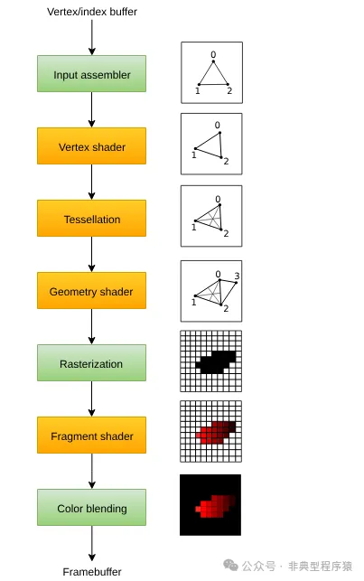
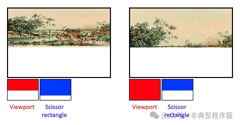
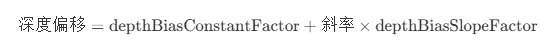
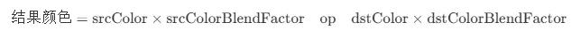

# 【Vulkan 入门系列】创建描述符集布局和图形管线（五）

描述符集布局定义了着色器如何访问资源（如缓冲区和图像），是渲染管线配置的关键部分。图形管线定义了从顶点数据到最终像素输出的整个处理流程，包括可编程阶段（如顶点和片段着色器）和固定功能阶段（如光栅化、深度测试）。

## 一、创建描述符集布局

`createDescriptorSetLayout` 用于创建描述符集布局（Descriptor Set Layout），用于定义着色器如何访问资源（如 Uniform 缓冲区和纹理采样器）。

```
void HelloVK::initVulkan() {
createInstance();
createSurface();
pickPhysicalDevice();
createLogicalDeviceAndQueue();
setupDebugMessenger();
establishDisplaySizeIdentity();
createSwapChain();
createImageViews();
createRenderPass();
createDescriptorSetLayout();
  ...
}

void HelloVK::createDescriptorSetLayout() {
  VkDescriptorSetLayoutBinding uboLayoutBinding{};
  uboLayoutBinding.binding = 0;
  uboLayoutBinding.descriptorType = VK_DESCRIPTOR_TYPE_UNIFORM_BUFFER;
  uboLayoutBinding.descriptorCount = 1;
  uboLayoutBinding.stageFlags = VK_SHADER_STAGE_VERTEX_BIT;
  uboLayoutBinding.pImmutableSamplers = nullptr;

// Combined image sampler layout binding
  VkDescriptorSetLayoutBinding samplerLayoutBinding{};
  samplerLayoutBinding.binding = 1;
  samplerLayoutBinding.descriptorType = VK_DESCRIPTOR_TYPE_COMBINED_IMAGE_SAMPLER;
  samplerLayoutBinding.descriptorCount = 1;
  samplerLayoutBinding.stageFlags = VK_SHADER_STAGE_FRAGMENT_BIT;
  samplerLayoutBinding.pImmutableSamplers = nullptr;

  std::array<VkDescriptorSetLayoutBinding, 2> bindings =
      {uboLayoutBinding, samplerLayoutBinding};

  VkDescriptorSetLayoutCreateInfo layoutInfo{};
  layoutInfo.sType = VK_STRUCTURE_TYPE_DESCRIPTOR_SET_LAYOUT_CREATE_INFO;
  layoutInfo.bindingCount = static_cast<uint32_t>(bindings.size());
  layoutInfo.pBindings = bindings.data();

VK_CHECK(vkCreateDescriptorSetLayout(device, &layoutInfo, nullptr,
                                       &descriptorSetLayout));
}
```

### 1.1 描述符绑定定义

#### 1.1.1 Uniform 缓冲区绑定（uboLayoutBinding）

定义一个 Uniform 缓冲区（UBO），用于在顶点着色器中传递常量数据（如模型-视图-投影矩阵）。

```
VkDescriptorSetLayoutBinding uboLayoutBinding{};
uboLayoutBinding.binding = 0;                           // 绑定位置 0
uboLayoutBinding.descriptorType = VK_DESCRIPTOR_TYPE_UNIFORM_BUFFER;
uboLayoutBinding.descriptorCount = 1;                   // 1 个描述符
uboLayoutBinding.stageFlags = VK_SHADER_STAGE_VERTEX_BIT; // 在顶点着色器中使用
uboLayoutBinding.pImmutableSamplers = nullptr;          // 不适用 Uniform 缓冲区
```

- ```
  binding = 0
  ```

  ：对应着色器中的 `layout(binding = 0)`。

- ```
  stageFlags = VK_SHADER_STAGE_VERTEX_BIT
  ```

  ：仅顶点着色器可访问此资源。

`VkDescriptorSetLayoutBinding` 是 Vulkan 中定义描述符（Descriptor）如何与着色器绑定的核心结构体。它描述了着色器某个绑定点（Binding Point）对应的资源类型、数量、作用阶段等关键信息。以下是逐字段的详细解读：

**`VkDescriptorSetLayoutBinding` 结构体定义**

```
typedef struct VkDescriptorSetLayoutBinding {
    uint32_t              binding;            // 绑定位置（与着色器中的 `binding` 对应）
    VkDescriptorType      descriptorType;     // 描述符类型（如 UBO、采样器等）
    uint32_t              descriptorCount;    // 描述符数量（用于数组）
    VkShaderStageFlags    stageFlags;         // 着色器阶段（如顶点、片段着色器）
    const VkSampler*      pImmutableSamplers; // 固定采样器（仅对采样器类型有效）
} VkDescriptorSetLayoutBinding;
```

##### 1. `binding`

指定着色器中的绑定位置，与着色器代码中的 `layout(binding = N)` 声明一致。绑定位置必须在同一描述符集布局内唯一，不可重复。

##### 2. `descriptorType`

定义描述符的类型，决定资源类型（如 Uniform 缓冲区、纹理采样器等）。

**常见类型**：

| 类型                                      | 用途                                                   |
| ----------------------------------------- | ------------------------------------------------------ |
| VK_DESCRIPTOR_TYPE_UNIFORM_BUFFER         | Uniform 缓冲区（UBO），用于传递常量数据（如 MVP 矩阵） |
| VK_DESCRIPTOR_TYPE_COMBINED_IMAGE_SAMPLER | 组合图像采样器（纹理 + 采样器）                        |
| VK_DESCRIPTOR_TYPE_STORAGE_BUFFER         | 存储缓冲区（SSBO），用于可读写数据                     |
| VK_DESCRIPTOR_TYPE_SAMPLER                | 独立采样器（不与特定纹理绑定）                         |
| VK_DESCRIPTOR_TYPE_SAMPLED_IMAGE          | 独立纹理（不与采样器绑定）                             |

- Uniform Buffer：只读数据，适合高频更新（每帧更新）。
- Combined Image Sampler：在片段着色器中采样纹理的常用类型。

##### 3. `descriptorCount`

指定该绑定点包含的描述符数量。若大于 1，表示绑定一个数组资源。绑定多个纹理：`descriptorCount = 4` 对应着色器中的 `sampler2D textures[4]`。

- 当使用数组时，所有描述符必须为同一类型。
- 动态描述符数组（Dynamic Descriptor）需配合 `VK_DESCRIPTOR_BINDING_VARIABLE_DESCRIPTOR_COUNT_BIT` 标志。

##### 4. `stageFlags`

指定该描述符在哪些着色器阶段可见（可访问）。

**常用标志**：

| 标志                         | 作用                     |
| ---------------------------- | ------------------------ |
| VK_SHADER_STAGE_VERTEX_BIT   | 顶点着色器可访问         |
| VK_SHADER_STAGE_FRAGMENT_BIT | 片段着色器可访问         |
| VK_SHADER_STAGE_ALL_GRAPHICS | 所有图形着色器阶段可访问 |

##### 5. `pImmutableSamplers`

为采样器类型（如 `VK_DESCRIPTOR_TYPE_SAMPLER` 或 `VK_DESCRIPTOR_TYPE_COMBINED_IMAGE_SAMPLER`）提供固定采样器。这些采样器在描述符创建后不可更改。若设为 `nullptr`，需在描述符集中动态绑定采样器。仅在 `descriptorType` 为采样器相关类型时有效。

#### 1.1.2 组合图像采样器绑定（samplerLayoutBinding）

定义一个组合图像采样器，用于在片段着色器中采样纹理。

```
VkDescriptorSetLayoutBinding samplerLayoutBinding{};
samplerLayoutBinding.binding = 1;                          // 绑定位置 1
samplerLayoutBinding.descriptorType = VK_DESCRIPTOR_TYPE_COMBINED_IMAGE_SAMPLER;
samplerLayoutBinding.descriptorCount = 1;                   // 1 个描述符
samplerLayoutBinding.stageFlags = VK_SHADER_STAGE_FRAGMENT_BIT; // 在片段着色器中使用
samplerLayoutBinding.pImmutableSamplers = nullptr;          // 动态指定采样器
```

- ```
  binding = 1
  ```

  ：对应着色器中的 `layout(binding = 1)`。

- ```
  stageFlags = VK_SHADER_STAGE_FRAGMENT_BIT
  ```

  ：仅片段着色器可访问此资源。

### 1.2 绑定集合

将两个绑定（Uniform 缓冲区和采样器）存入数组，顺序对应绑定的 `0` 和 `1`。

```
std::array<VkDescriptorSetLayoutBinding, 2> bindings = {uboLayoutBinding, samplerLayoutBinding};
```

### 1.3 创建描述符集布局

通过绑定信息创建描述符集布局。

```
VkDescriptorSetLayoutCreateInfo layoutInfo{};
layoutInfo.sType = VK_STRUCTURE_TYPE_DESCRIPTOR_SET_LAYOUT_CREATE_INFO;
layoutInfo.bindingCount = static_cast<uint32_t>(bindings.size());
layoutInfo.pBindings = bindings.data();

VK_CHECK(vkCreateDescriptorSetLayout(device, &layoutInfo, nullptr, &descriptorSetLayout));
```

- ```
  sType
  ```

  ：结构体类型标识（`VK_STRUCTURE_TYPE_DESCRIPTOR_SET_LAYOUT_CREATE_INFO`）。

- ```
  bindingCount
  ```

   和 `pBindings`：传递绑定配置数组。

- ```
  vkCreateDescriptorSetLayout
  ```

  ：创建实际的描述符集布局对象，结果存储在 `descriptorSetLayout` 中。

### 1.4 与着色器的关联

顶点着色器中存在以下声明：

shader.vert

```
layout(binding = 0) uniform UniformBufferObject {
    mat4 MVP;
} ubo;
```

片段着色器中存在以下声明：

shader.frag

```
layout(binding = 1) uniform sampler2D samp;
```

## 二、创建图形管线

图形管线是一系列操作，它将网格的顶点和纹理一直带到渲染目标中的像素。下面显示了一个简化的概述：



输入汇编器从指定的缓冲区收集原始顶点数据，并且还可以使用索引缓冲区来重复某些元素，而无需复制顶点数据本身。

顶点着色器为每个顶点运行，通常应用变换将顶点位置从模型空间转换为屏幕空间。它还将每个顶点的数据传递到管线中。

细分着色器允许根据某些规则细分几何图形以提高网格质量。这通常用于使附近的砖墙和楼梯等表面看起来不那么平坦。

几何着色器在每个图元（三角形、直线、点）上运行，可以丢弃它或输出比输入更多的图元。这与细分着色器类似，但更加灵活。但是，它在当今的应用程序中使用不多。

光栅化阶段将图元离散化为片段。这些是它们在帧缓冲上填充的像素元素。落在屏幕外的任何片段都会被丢弃，并且顶点着色器输出的属性会在片段之间进行插值，如图所示。通常，由于深度测试，此处也会丢弃其他图元片段后面的片段。

片段着色器为每个幸存的片段调用，并确定将片段写入哪个（哪些）帧缓冲区，以及使用哪个颜色和深度值。它可以使用来自顶点着色器的插值数据来做到这一点，其中可以包括纹理坐标和用于照明的法线等内容。

颜色混合阶段应用操作来混合映射到帧缓冲区中同一像素的不同片段。片段可以简单地相互覆盖、相加或基于透明度进行混合。

颜色为绿色的阶段称为固定功能阶段。这些阶段允许使用参数调整其操作，但它们的工作方式是预定义的。另一方面，颜色为橙色的阶段是可编程的，这意味着可以将自己的代码上传到图形卡以精确应用想要的操作。可以使用片段着色器，例如，实现从纹理和照明到光线追踪器的任何功能。这些程序在许多 GPU 内核上同时运行，以并行处理许多对象，如顶点和片段。

`createGraphicsPipeline` 创建一个图形管线，加载一个简单的顶点着色器和片段着色器，两者的入口点都设置为“main”。提供了一系列标准参数：

- 来自应用程序的顶点输入被设置为空，因为我们在顶点着色器中硬编码了三角形。
- 输入装配被配置为绘制三角形列表。
- 绘制整个屏幕，因此裁剪范围被指定为与交换链范围相同。
- 光栅化器被设置为丢弃超出近平面和远平面的片段（`depthClampEnable=false`），并将几何体发送到帧缓冲区，并为几何体的整个区域生成片段。考虑几何体的顶点输入的顺时针顺序。
- 禁用多采样。
- 禁用深度和模板测试。
- 颜色混合被设置为不透明模式，这意味着任何新的片段将覆盖帧缓冲区中已存在的片段。
- 利用 Vulkan 的动态状态概念来处理视口和裁剪。另一种选择是硬编码视口/裁剪选项，但这意味着在屏幕旋转时需要重新创建整个图形管线对象。
- 管线布局向着色器发送一个统一缓冲区对象，其中包含由描述符集布局指定的 4x4 旋转矩阵。这是为了在设备旋转时渲染旋转后的场景所必需的。

```
void HelloVK::initVulkan() {
createInstance();
createSurface();
pickPhysicalDevice();
createLogicalDeviceAndQueue();
setupDebugMessenger();
establishDisplaySizeIdentity();
createSwapChain();
createImageViews();
createRenderPass();
createDescriptorSetLayout();
createGraphicsPipeline();
  ...
}

void HelloVK::createGraphicsPipeline() {
auto vertShaderCode =
      LoadBinaryFileToVector("shaders/shader.vert.spv", assetManager);
auto fragShaderCode =
      LoadBinaryFileToVector("shaders/shader.frag.spv", assetManager);

  VkShaderModule vertShaderModule = createShaderModule(vertShaderCode);
  VkShaderModule fragShaderModule = createShaderModule(fragShaderCode);

  VkPipelineShaderStageCreateInfo vertShaderStageInfo{};
  vertShaderStageInfo.sType =
      VK_STRUCTURE_TYPE_PIPELINE_SHADER_STAGE_CREATE_INFO;
  vertShaderStageInfo.stage = VK_SHADER_STAGE_VERTEX_BIT;
  vertShaderStageInfo.module = vertShaderModule;
  vertShaderStageInfo.pName = "main";

  VkPipelineShaderStageCreateInfo fragShaderStageInfo{};
  fragShaderStageInfo.sType =
      VK_STRUCTURE_TYPE_PIPELINE_SHADER_STAGE_CREATE_INFO;
  fragShaderStageInfo.stage = VK_SHADER_STAGE_FRAGMENT_BIT;
  fragShaderStageInfo.module = fragShaderModule;
  fragShaderStageInfo.pName = "main";

  VkPipelineShaderStageCreateInfo shaderStages[] = {vertShaderStageInfo,
                                                    fragShaderStageInfo};

  VkPipelineVertexInputStateCreateInfo vertexInputInfo{};
  vertexInputInfo.sType =
      VK_STRUCTURE_TYPE_PIPELINE_VERTEX_INPUT_STATE_CREATE_INFO;
  vertexInputInfo.vertexBindingDescriptionCount = 0;
  vertexInputInfo.pVertexBindingDescriptions = nullptr;
  vertexInputInfo.vertexAttributeDescriptionCount = 0;
  vertexInputInfo.pVertexAttributeDescriptions = nullptr;

  VkPipelineInputAssemblyStateCreateInfo inputAssembly{};
  inputAssembly.sType =
      VK_STRUCTURE_TYPE_PIPELINE_INPUT_ASSEMBLY_STATE_CREATE_INFO;
  inputAssembly.topology = VK_PRIMITIVE_TOPOLOGY_TRIANGLE_LIST;
  inputAssembly.primitiveRestartEnable = VK_FALSE;

  VkPipelineViewportStateCreateInfo viewportState{};
  viewportState.sType = VK_STRUCTURE_TYPE_PIPELINE_VIEWPORT_STATE_CREATE_INFO;
  viewportState.viewportCount = 1;
  viewportState.scissorCount = 1;

  VkPipelineRasterizationStateCreateInfo rasterizer{};
  rasterizer.sType = VK_STRUCTURE_TYPE_PIPELINE_RASTERIZATION_STATE_CREATE_INFO;
  rasterizer.depthClampEnable = VK_FALSE;
  rasterizer.rasterizerDiscardEnable = VK_FALSE;
  rasterizer.polygonMode = VK_POLYGON_MODE_FILL;
  rasterizer.lineWidth = 1.0f;

  rasterizer.cullMode = VK_CULL_MODE_BACK_BIT;
  rasterizer.frontFace = VK_FRONT_FACE_CLOCKWISE;

  rasterizer.depthBiasEnable = VK_FALSE;
  rasterizer.depthBiasConstantFactor = 0.0f;
  rasterizer.depthBiasClamp = 0.0f;
  rasterizer.depthBiasSlopeFactor = 0.0f;

  VkPipelineMultisampleStateCreateInfo multisampling{};
  multisampling.sType =
      VK_STRUCTURE_TYPE_PIPELINE_MULTISAMPLE_STATE_CREATE_INFO;
  multisampling.sampleShadingEnable = VK_FALSE;
  multisampling.rasterizationSamples = VK_SAMPLE_COUNT_1_BIT;
  multisampling.minSampleShading = 1.0f;
  multisampling.pSampleMask = nullptr;
  multisampling.alphaToCoverageEnable = VK_FALSE;
  multisampling.alphaToOneEnable = VK_FALSE;

  VkPipelineColorBlendAttachmentState colorBlendAttachment{};
  colorBlendAttachment.colorWriteMask =
      VK_COLOR_COMPONENT_R_BIT | VK_COLOR_COMPONENT_G_BIT |
      VK_COLOR_COMPONENT_B_BIT | VK_COLOR_COMPONENT_A_BIT;
  colorBlendAttachment.blendEnable = VK_FALSE;

  VkPipelineColorBlendStateCreateInfo colorBlending{};
  colorBlending.sType =
      VK_STRUCTURE_TYPE_PIPELINE_COLOR_BLEND_STATE_CREATE_INFO;
  colorBlending.logicOpEnable = VK_FALSE;
  colorBlending.logicOp = VK_LOGIC_OP_COPY;
  colorBlending.attachmentCount = 1;
  colorBlending.pAttachments = &colorBlendAttachment;
  colorBlending.blendConstants[0] = 0.0f;
  colorBlending.blendConstants[1] = 0.0f;
  colorBlending.blendConstants[2] = 0.0f;
  colorBlending.blendConstants[3] = 0.0f;

  VkPipelineLayoutCreateInfo pipelineLayoutInfo{};
  pipelineLayoutInfo.sType = VK_STRUCTURE_TYPE_PIPELINE_LAYOUT_CREATE_INFO;
  pipelineLayoutInfo.setLayoutCount = 1;
  pipelineLayoutInfo.pSetLayouts = &descriptorSetLayout;
  pipelineLayoutInfo.pushConstantRangeCount = 0;
  pipelineLayoutInfo.pPushConstantRanges = nullptr;

VK_CHECK(vkCreatePipelineLayout(device, &pipelineLayoutInfo, nullptr,
                                  &pipelineLayout));
  std::vector<VkDynamicState> dynamicStateEnables = {VK_DYNAMIC_STATE_VIEWPORT,
                                                     VK_DYNAMIC_STATE_SCISSOR};
  VkPipelineDynamicStateCreateInfo dynamicStateCI{};
  dynamicStateCI.sType = VK_STRUCTURE_TYPE_PIPELINE_DYNAMIC_STATE_CREATE_INFO;
  dynamicStateCI.pDynamicStates = dynamicStateEnables.data();
  dynamicStateCI.dynamicStateCount =
      static_cast<uint32_t>(dynamicStateEnables.size());

  VkGraphicsPipelineCreateInfo pipelineInfo{};
  pipelineInfo.sType = VK_STRUCTURE_TYPE_GRAPHICS_PIPELINE_CREATE_INFO;
  pipelineInfo.stageCount = 2;
  pipelineInfo.pStages = shaderStages;
  pipelineInfo.pVertexInputState = &vertexInputInfo;
  pipelineInfo.pInputAssemblyState = &inputAssembly;
  pipelineInfo.pViewportState = &viewportState;
  pipelineInfo.pRasterizationState = &rasterizer;
  pipelineInfo.pMultisampleState = &multisampling;
  pipelineInfo.pDepthStencilState = nullptr;
  pipelineInfo.pColorBlendState = &colorBlending;
  pipelineInfo.pDynamicState = &dynamicStateCI;
  pipelineInfo.layout = pipelineLayout;
  pipelineInfo.renderPass = renderPass;
  pipelineInfo.subpass = 0;
  pipelineInfo.basePipelineHandle = VK_NULL_HANDLE;
  pipelineInfo.basePipelineIndex = -1;

VK_CHECK(vkCreateGraphicsPipelines(device, VK_NULL_HANDLE, 1, &pipelineInfo,
                                     nullptr, &graphicsPipeline));
vkDestroyShaderModule(device, fragShaderModule, nullptr);
vkDestroyShaderModule(device, vertShaderModule, nullptr);
}
```

### 2.1 加载着色器字节码并创建着色器模块

从二进制文件加载顶点和片段着色器的 SPIR-V 字节码。通过 `vkCreateShaderModule`（封装在 `createShaderModule` 中）创建着色器模块，供管线使用。

```
auto vertShaderCode = LoadBinaryFileToVector("shaders/shader.vert.spv", assetManager);
auto fragShaderCode = LoadBinaryFileToVector("shaders/shader.frag.spv", assetManager);

VkShaderModule vertShaderModule = createShaderModule(vertShaderCode);
VkShaderModule fragShaderModule = createShaderModule(fragShaderCode);
```

- SPIR-V 是 Vulkan 的标准着色器中间表示格式。
- 着色器模块是 Vulkan 对着色器代码的封装，与具体硬件无关。

#### 2.1.1 LoadBinaryFileToVector

该函数用于从 Android 应用的 `assets` 目录中加载二进制文件，并将其内容读取到内存中的 `std::vector<uint8_t>` 容器中。

此处用在 Android 平台上加载 Vulkan 着色器文件（`.spv` 文件）。

```
std::vector<uint8_t> LoadBinaryFileToVector(const char *file_path,
                                            AAssetManager *assetManager) {
  std::vector<uint8_t> file_content;
assert(assetManager);
  AAsset *file =
      AAssetManager_open(assetManager, file_path, AASSET_MODE_BUFFER);
size_t file_length = AAsset_getLength(file);

  file_content.resize(file_length);

AAsset_read(file, file_content.data(), file_length);
AAsset_close(file);
return file_content;
}
```

#### 2.1.2 createShaderModule

该函数用于将 SPIR-V 格式的着色器字节码加载到 Vulkan 着色器模块中，供后续渲染管线使用。

```
VkShaderModule HelloVK::createShaderModule(const std::vector<uint8_t> &code) {
  VkShaderModuleCreateInfo createInfo{};
  createInfo.sType = VK_STRUCTURE_TYPE_SHADER_MODULE_CREATE_INFO;
  createInfo.codeSize = code.size();

// Satisifies alignment requirements since the allocator
// in vector ensures worst case requirements
  createInfo.pCode = reinterpret_cast<constuint32_t *>(code.data());
  VkShaderModule shaderModule;
VK_CHECK(vkCreateShaderModule(device, &createInfo, nullptr, &shaderModule));

return shaderModule;
}
```

- ```
  sType
  ```

  ：必须设为 `VK_STRUCTURE_TYPE_SHADER_MODULE_CREATE_INFO`，标识结构体类型。

- ```
  codeSize
  ```

  ：SPIR-V 字节码的总字节数（必须是 4 的倍数，因 SPIR-V 以 32 位字为单位）。

- ```
  pCode
  ```

  ：指向 SPIR-V 字节码的指针，需强制转换为 uint32_t*。

`vkCreateShaderModule` 是 Vulkan API，用于创建着色器模块。

### 2.2 定义着色器阶段信息

为顶点和片段着色器定义管线阶段信息。将两个阶段合并为数组，供后续管线创建使用。

```
VkPipelineShaderStageCreateInfo vertShaderStageInfo{};
vertShaderStageInfo.sType = VK_STRUCTURE_TYPE_PIPELINE_SHADER_STAGE_CREATE_INFO;
vertShaderStageInfo.stage = VK_SHADER_STAGE_VERTEX_BIT;    // 顶点着色器阶段
vertShaderStageInfo.module = vertShaderModule;             // 定点着色器模块
vertShaderStageInfo.pName = "main";                        // 入口函数名

VkPipelineShaderStageCreateInfo fragShaderStageInfo{};
fragShaderStageInfo.sType = VK_STRUCTURE_TYPE_PIPELINE_SHADER_STAGE_CREATE_INFO;
fragShaderStageInfo.stage = VK_SHADER_STAGE_FRAGMENT_BIT;  // 片段着色器阶段
fragShaderStageInfo.module = fragShaderModule;           // 片段着色器模块
fragShaderStageInfo.pName = "main";                       // 入口函数名

VkPipelineShaderStageCreateInfo shaderStages[] = {vertShaderStageInfo, fragShaderStageInfo};
```

- ```
  stage
  ```

  ：指定着色器阶段（如顶点、片段和计算等）。

- ```
  pName
  ```

  ：着色器入口函数名（通常为 `main`）。

### 2.3 顶点输入状态配置

定义顶点数据的输入格式（如顶点位置、颜色和纹理坐标等）。

若需从顶点缓冲区读取数据，需在此处定义 `VkVertexInputBindingDescription` 和 `VkVertexInputAttributeDescription`。此处设为 `0`，表示顶点数据可能通过其他方式传递（硬编码在着色器中）。

```
VkPipelineVertexInputStateCreateInfo vertexInputInfo{};
vertexInputInfo.sType = VK_STRUCTURE_TYPE_PIPELINE_VERTEX_INPUT_STATE_CREATE_INFO;
vertexInputInfo.vertexBindingDescriptionCount = 0;      // 无顶点绑定描述
vertexInputInfo.pVertexBindingDescriptions = nullptr;
vertexInputInfo.vertexAttributeDescriptionCount = 0;    // 无顶点属性描述
vertexInputInfo.pVertexAttributeDescriptions = nullptr;
```

### 2.4 输入装配状态

指定如何将顶点装配为图元（如三角形、线条等）。

```
VkPipelineInputAssemblyStateCreateInfo inputAssembly{};
inputAssembly.sType = VK_STRUCTURE_TYPE_PIPELINE_INPUT_ASSEMBLY_STATE_CREATE_INFO;
inputAssembly.topology = VK_PRIMITIVE_TOPOLOGY_TRIANGLE_LIST; // 三角形列表
inputAssembly.primitiveRestartEnable = VK_FALSE;              // 禁用图元重启
```

- ```
  topology
  ```

  ：图元类型（此处为三角形列表，每三个顶点构成一个三角形）。

**常见取值**

| 值                                   | 描述                             |
| ------------------------------------ | -------------------------------- |
| VK_PRIMITIVE_TOPOLOGY_POINT_LIST     | 每个顶点为一个独立的点。         |
| VK_PRIMITIVE_TOPOLOGY_LINE_LIST      | 每两个顶点构成一条线段。         |
| VK_PRIMITIVE_TOPOLOGY_LINE_STRIP     | 顶点依次连接成连续线段（条带）。 |
| VK_PRIMITIVE_TOPOLOGY_TRIANGLE_LIST  | 每三个顶点构成一个独立的三角形。 |
| VK_PRIMITIVE_TOPOLOGY_TRIANGLE_STRIP | 顶点依次连接成连续三角形条带。   |
| VK_PRIMITIVE_TOPOLOGY_TRIANGLE_FAN   | 顶点依次连接成扇形三角形序列。   |

- ```
  primitiveRestartEnable
  ```

  ：是否允许在索引缓冲区中使用图元重启值（如 `0xFFFF` 或 `0xFFFFFFFF`）来分割图元序列。此处禁用图元重启。

### 2.5 视口与裁剪状态

定义视口（Viewport）和裁剪区域（Scissor）的数量。此处实际视口和裁剪区域并未静态定义，而是通过动态状态在渲染时设置。

```
VkPipelineViewportStateCreateInfo viewportState{};
viewportState.sType = VK_STRUCTURE_TYPE_PIPELINE_VIEWPORT_STATE_CREATE_INFO;
viewportState.viewportCount = 1;    // 视口数量
viewportState.scissorCount = 1;     // 裁剪区域数量
```



### 2.6 光栅化状态

控制几何体如何被光栅化为片段。

```
VkPipelineRasterizationStateCreateInfo rasterizer{};
rasterizer.sType = VK_STRUCTURE_TYPE_PIPELINE_RASTERIZATION_STATE_CREATE_INFO;
rasterizer.depthClampEnable = VK_FALSE;       // 禁用深度截断（超出深度范围的片段被丢弃）
rasterizer.rasterizerDiscardEnable = VK_FALSE;// 禁用光栅化丢弃（若启用，不输出片段）
rasterizer.polygonMode = VK_POLYGON_MODE_FILL;// 填充模式（线框模式设为 VK_POLYGON_MODE_LINE）
rasterizer.lineWidth = 1.0f;                  // 线宽（需检查 GPU 是否支持非 1.0 的值）
rasterizer.cullMode = VK_CULL_MODE_BACK_BIT;  // 背面剔除
rasterizer.frontFace = VK_FRONT_FACE_CLOCKWISE;// 顺时针顶点顺序为正面
rasterizer.depthBiasEnable = VK_FALSE;        // 禁用深度偏移（用于阴影映射等）
rasterizer.depthBiasConstantFactor = 0.0f;      //深度偏移的常数因子
rasterizer.depthBiasClamp = 0.0f;        //深度偏移的最大允许值
rasterizer.depthBiasSlopeFactor = 0.0f;      //深度偏移的斜率因子
```

现在我们详细了解 `VkPipelineRasterizationStateCreateInfo` 结构体，以下是 `VkPipelineRasterizationStateCreateInfo` 结构体包含的字段说明。

#### 2.6.1 `sType`

标识结构体类型，确保 Vulkan 正确解析该结构体。必须设为 `VK_STRUCTURE_TYPE_PIPELINE_RASTERIZATION_STATE_CREATE_INFO`。

#### 2.6.2 `pNext`

指向扩展特定结构体的指针。通常为 `nullptr`，除非使用扩展功能（如深度裁剪控制扩展）。

#### 2.6.3 `flags`

保留字段，供未来版本或扩展使用。当前 Vulkan 规范中未定义有效标志，必须设为 `0`。

#### 2.6.4 `depthClampEnable`

是否将超出深度范围 `[0, 1]` 的片元深度值限制在 `0` 或 `1`。`VK_FALSE`（超出深度范围的片元被丢弃）。启用后，用于渲染超出近/远平面的几何体（如阴影映射中的远平面外物体）。需设备支持 `depthClamp` 特性（大部分 GPU 支持）。

#### 2.6.5 `rasterizerDiscardEnable`

是否完全跳过光栅化阶段，禁止生成任何片元。`VK_FALSE`（正常执行光栅化）。调试时禁用片段着色器，仅执行顶点处理。用于几何着色器或顶点处理后的数据输出。

#### 2.6.6 `polygonMode`

定义如何填充多边形的表面。

**可选值**

| 值                      | 描述                           |
| ----------------------- | ------------------------------ |
| `VK_POLYGON_MODE_FILL`  | 完全填充多边形（默认）。       |
| `VK_POLYGON_MODE_LINE`  | 仅绘制多边形边线（线框模式）。 |
| `VK_POLYGON_MODE_POINT` | 仅绘制多边形顶点（点模式）。   |

- ```
  VK_POLYGON_MODE_LINE
  ```

   和 `VK_POLYGON_MODE_POINT` 需设备支持 `fillModeNonSolid` 特性。

- 线宽（`lineWidth`）大于 `1.0` 需支持 `wideLines`。

#### 2.6.7 `cullMode`

指定剔除哪些朝向的面。减少不可见面片元的处理，提升性能。

**可选值**

| 值                            | 描述                         |
| ----------------------------- | ---------------------------- |
| `VK_CULL_MODE_NONE`           | 不剔除任何面。               |
| `VK_CULL_MODE_FRONT_BIT`      | 剔除正面。                   |
| `VK_CULL_MODE_BACK_BIT`       | 剔除背面（默认常用）。       |
| `VK_CULL_MODE_FRONT_AND_BACK` | 剔除所有面（仅点或线可见）。 |

#### 2.6.8 `frontFace`

定义何谓“正面”的顶点环绕顺序。

**可选值**

| 值                                | 描述                           |
| --------------------------------- | ------------------------------ |
| `VK_FRONT_FACE_COUNTER_CLOCKWISE` | 逆时针顶点顺序为正面（默认）。 |
| `VK_FRONT_FACE_CLOCKWISE`         | 顺时针顶点顺序为正面。         |

#### 2.6.9 `depthBiasEnable`

是否启用深度偏移（Depth Bias），用于解决 Z-fighting 问题。

**原理**：在计算深度值时添加一个偏移量，公式为：




其中斜率是片元所在多边形在屏幕空间中的最大深度斜率。

#### 2.6.10 `depthBiasConstantFactor`

深度偏移的常数因子，用于静态调整偏移量。例如，设为 0.01 可轻微提升深度值，避免 Z-fighting。

#### 2.6.11 `depthBiasClamp`

深度偏移的最大允许值，防止偏移过大导致不合理的深度值。默认设为 0.0 表示无限制。

#### 2.6.12 `depthBiasSlopeFactor`

深度偏移的斜率因子，基于多边形在屏幕空间中的斜率调整偏移量。例如，陡峭的多边形（如侧面）可能需要更大的偏移量。

#### 2.6.13 `lineWidth`

定义线条的宽度（单位：像素）。大部分 GPU 仅支持 `1.0`，如需更宽线条需检查 `wideLines` 特性支持。启用 `VK_POLYGON_MODE_LINE` 时影响多边形边线的宽度。

### 2.7 多重采样状态

配置多重采样抗锯齿（MSAA）。此处禁用了 MSAA，仅使用单采样。

```
VkPipelineMultisampleStateCreateInfo multisampling{};
multisampling.sType = VK_STRUCTURE_TYPE_PIPELINE_MULTISAMPLE_STATE_CREATE_INFO;
multisampling.sampleShadingEnable = VK_FALSE;          // 禁用采样着色（MSAA 的高级特性）
multisampling.rasterizationSamples = VK_SAMPLE_COUNT_1_BIT; // 单采样（无抗锯齿）
multisampling.minSampleShading = 1.0f;                 // 最小采样着色比例
```

- ```
  sampleShadingEnable
  ```

  ：是否启用逐采样着色（Per-Sample Shading）。默认为 `VK_FALSE`（每个像素计算一次片段着色器结果，所有采样共享该结果）。启用后，每个采样独立执行片段着色器，提升边缘平滑度；需结合 `minSampleShading` 控制着色频率；显著增加 GPU 负载，通常仅在需要高质量抗锯齿时启用。

- ```
  rasterizationSamples
  ```

  ：指定每个像素的采样数，决定 MSAA 的抗锯齿级别。实际支持的采样数需通过 `VkPhysicalDeviceLimits::framebufferColorSampleCounts` 检查。更高的采样数会增加内存和计算开销。

**可选值**

| 值                    | 描述                        |
| --------------------- | --------------------------- |
| VK_SAMPLE_COUNT_1_BIT | 禁用多重采样（单采样）。    |
| VK_SAMPLE_COUNT_2_BIT | 每像素 2 次采样。           |
| VK_SAMPLE_COUNT_4_BIT | 每像素 4 次采样（常用）。   |
| VK_SAMPLE_COUNT_8_BIT | 每像素 8 次采样（高画质）。 |

- ```
  minSampleShading
  ```

  ：指定至少对多少比例的采样执行片段着色器。取值范围 0.0（禁用）到 1.0（全采样着色）。例如，`rasterizationSamples = VK_SAMPLE_COUNT_4_BIT`，`minSampleShading = 0.5`，意味着每个像素至少对 2 个采样执行着色器。

### 2.8 颜色混合状态

控制颜色附件（如帧缓冲）的混合方式。此处禁用混合，直接写入颜色，不进行透明度混合。

```
VkPipelineColorBlendAttachmentState colorBlendAttachment{};
colorBlendAttachment.colorWriteMask = 
    VK_COLOR_COMPONENT_R_BIT | VK_COLOR_COMPONENT_G_BIT |
    VK_COLOR_COMPONENT_B_BIT | VK_COLOR_COMPONENT_A_BIT; // 允许写入所有颜色通道
colorBlendAttachment.blendEnable = VK_FALSE;             // 禁用混合（直接覆盖目标颜色）

VkPipelineColorBlendStateCreateInfo colorBlending{};
colorBlending.sType = VK_STRUCTURE_TYPE_PIPELINE_COLOR_BLEND_STATE_CREATE_INFO;
colorBlending.logicOpEnable = VK_FALSE;                  // 禁用逻辑操作（如 XOR）
colorBlending.attachmentCount = 1;
colorBlending.pAttachments = &colorBlendAttachment;      // 关联颜色混合附件
colorBlending.blendConstants[0] = 0.0f;
colorBlending.blendConstants[1] = 0.0f;
colorBlending.blendConstants[2] = 0.0f;
colorBlending.blendConstants[3] = 0.0f;
```

`VkPipelineColorBlendAttachmentState` 是 Vulkan 中用于配置单个颜色附件（Color Attachment）的混合行为的结构体。它定义了在颜色混合阶段，如何将片段着色器的输出颜色与帧缓冲中现有颜色进行混合。下面是结构体字段的详细说明。

#### 2.8.1 `blendEnable`

是否启用颜色混合。若为 `VK_FALSE`，片段颜色直接覆盖帧缓冲中的颜色（不混合）。

#### 2.8.2 `srcColorBlendFactor` 与 `dstColorBlendFactor`

分别指定源颜色（片段输出颜色）和目标颜色（帧缓冲现有颜色）的混合因子。

**常见取值**

| 值                                  | 描述                      |
| ----------------------------------- | ------------------------- |
| VK_BLEND_FACTOR_ZERO                | 因子为 0                  |
| VK_BLEND_FACTOR_ONE                 | 因子为 1                  |
| VK_BLEND_FACTOR_SRC_ALPHA           | 因子为源颜色的 Alpha 值   |
| VK_BLEND_FACTOR_ONE_MINUS_SRC_ALPHA | 因子为 `1 - 源 Alpha`     |
| VK_BLEND_FACTOR_DST_ALPHA`          | 因子为目标颜色的 Alpha 值 |
| VK_BLEND_FACTOR_ONE_MINUS_DST_ALPHA | 因子为 `1 - 目标 Alpha`   |

混合后的颜色通过以下公式计算：




#### 2.8.3 `colorBlendOp`

定义颜色混合的数学操作。

**常见取值**：

| 值                   | 描述                                           |
| -------------------- | ---------------------------------------------- |
| VK_BLEND_OP_ADD      | 将源颜色和目标颜色按指定的混合因子加权后相加。 |
| VK_BLEND_OP_SUBTRACT | 将源颜色和目标颜色按指定的混合因子加权后相减。 |
| VK_BLEND_OP_MIN      | 取源与目标的最小值。                           |
| VK_BLEND_OP_MAX      | 取源与目标的最大值。                           |

#### 2.8.4 `srcAlphaBlendFactor` 与 `dstAlphaBlendFactor`

分别指定源 Alpha 和目标 Alpha 的混合因子，与颜色混合类似，但独立作用于 Alpha 通道。

#### 2.8.5 `alphaBlendOp`

定义 Alpha 通道的混合操作，与 `colorBlendOp` 类似。

#### 2.8.6 `colorWriteMask`

控制哪些颜色通道允许写入帧缓冲（RGBA）。

通过位掩码组合以下值：

| 值                          | 描述                       |
| --------------------------- | -------------------------- |
| VK_COLOR_COMPONENT_R_BIT    | 允许写入红色通道。         |
| VK_COLOR_COMPONENT_G_BIT    | 允许写入绿色通道。         |
| VK_COLOR_COMPONENT_B_BIT    | 允许写入蓝色通道。         |
| VK_COLOR_COMPONENT_A_BIT    | 允许写入 Alpha 通道。      |
| VK_COLOR_COMPONENT_ALL_BITS | 允许写入所有通道（默认）。 |

### 2.9 管线布局

定义管线布局，描述着色器可访问的资源（如描述符集和推送常量）。

```
VkPipelineLayoutCreateInfo pipelineLayoutInfo{};
pipelineLayoutInfo.sType = VK_STRUCTURE_TYPE_PIPELINE_LAYOUT_CREATE_INFO;
pipelineLayoutInfo.setLayoutCount = 1;
pipelineLayoutInfo.pSetLayouts = &descriptorSetLayout;    // 引用描述符集布局
pipelineLayoutInfo.pushConstantRangeCount = 0;            // 无推送常量
pipelineLayoutInfo.pPushConstantRanges = nullptr;

VK_CHECK(vkCreatePipelineLayout(device, &pipelineLayoutInfo, nullptr,
                                &pipelineLayout));
```

- ```
  setLayoutCount
  ```

   与 `pSetLayouts`：定义管线布局引用的描述符集布局（Descriptor Set Layouts）。每个 `VkDescriptorSetLayout` 描述了一组绑定到着色器的资源（如 Uniform 缓冲区、纹理采样器等）。管线布局通过数组 `pSetLayouts` 引用多个描述符集布局，对应着色器中的 `layout(set = N)` 声明。

- ```
  pushConstantRangeCount
  ```

   与 `pPushConstantRanges`：定义推送常量（Push Constants）的使用范围。推送常量是小块数据（最大通常为 128 或 256 字节），可直接通过命令缓冲区更新，无需描述符集。每个 `VkPushConstantRange` 描述一个推送常量块的范围和适用阶段。

- ```
  vkCreatePipelineLayout
  ```

   用于创建管线布局对象。

**VkPushConstantRange 结构体**

```
typedef struct VkPushConstantRange {
    VkShaderStageFlags    stageFlags; // 适用着色器阶段（如 VK_SHADER_STAGE_VERTEX_BIT）
    uint32_t              offset;     // 偏移量（字节）
    uint32_t              size;       // 大小（字节）
} VkPushConstantRange;
```

- 推送常量的范围不能重叠，且必须符合硬件限制（通过 `VkPhysicalDeviceLimits::maxPushConstantsSize` 查询）。
- 不同着色器阶段可共享同一推送常量块，但需在 `stageFlags` 中指定所有适用的阶段。

### 2.10 动态状态

指定需在渲染时动态设置的管线状态（而非在管线创建时固定）。此处允许在命令缓冲中动态设置视口和裁剪区域，提高灵活性（如适应窗口大小变化）。

```
std::vector<VkDynamicState> dynamicStateEnables = {
    VK_DYNAMIC_STATE_VIEWPORT,  // 视口动态设置
    VK_DYNAMIC_STATE_SCISSOR    // 裁剪区域动态设置
};
VkPipelineDynamicStateCreateInfo dynamicStateCI{};
dynamicStateCI.sType = VK_STRUCTURE_TYPE_PIPELINE_DYNAMIC_STATE_CREATE_INFO;
dynamicStateCI.dynamicStateCount = dynamicStateEnables.size();
dynamicStateCI.pDynamicStates = dynamicStateEnables.data();
```

### 2.11 创建图形管线

```
VkGraphicsPipelineCreateInfo pipelineInfo{};
pipelineInfo.sType = VK_STRUCTURE_TYPE_GRAPHICS_PIPELINE_CREATE_INFO;
pipelineInfo.stageCount = 2;                     // 顶点 + 片段着色器阶段
pipelineInfo.pStages = shaderStages;              // 着色器阶段数组
pipelineInfo.pVertexInputState = &vertexInputInfo; 
pipelineInfo.pInputAssemblyState = &inputAssembly;
pipelineInfo.pViewportState = &viewportState;
pipelineInfo.pRasterizationState = &rasterizer;
pipelineInfo.pMultisampleState = &multisampling;
pipelineInfo.pDepthStencilState = nullptr;        // 未启用深度/模板测试
pipelineInfo.pColorBlendState = &colorBlending;
pipelineInfo.pDynamicState = &dynamicStateCI;     // 动态状态配置
pipelineInfo.layout = pipelineLayout;             // 管线布局
pipelineInfo.renderPass = renderPass;             // 关联的渲染流程
pipelineInfo.subpass = 0;                         // 使用的子流程索引

VK_CHECK(vkCreateGraphicsPipelines(device, VK_NULL_HANDLE, 1, &pipelineInfo,
                                   nullptr, &graphicsPipeline));
```

**关键参数**

- ```
  renderPass
  ```

  ：指定管线关联的渲染流程（定义颜色/深度附件的使用方式）。

- ```
  subpass
  ```

  ：指定管线用于渲染流程的哪个子流程。

- ```
  pDepthStencilState = nullptr
  ```

  ：未启用深度/模板测试（如需深度缓冲需单独配置）。

`vkCreateGraphicsPipelines` 用于创建图形管线（Graphics Pipelines）。图形管线定义了 Vulkan 渲染图形的方式，包括顶点处理、光栅化、颜色混合等各个阶段的配置。

### 2.12 销毁着色器模块

着色器模块在管线创建后不再需要，及时释放资源。

```
vkDestroyShaderModule(device, fragShaderModule, nullptr);
vkDestroyShaderModule(device, vertShaderModule, nullptr);
```

### 2.13 总结

管线核心流程如下：

