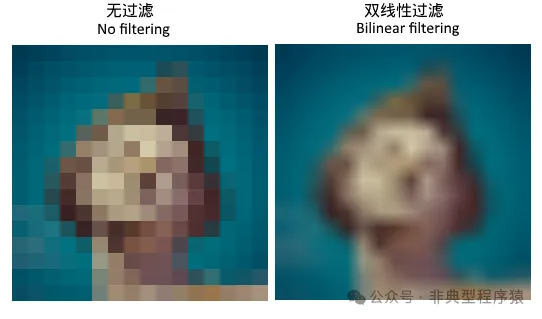
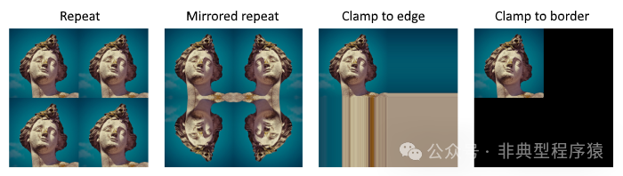

# 【Vulkan 入门系列】创建纹理采样器、Uniform 缓冲区、描述符池（八）

这一节主要介绍创建纹理采样器，创建 Uniform 缓冲区和创建描述符池。

## 一、创建纹理采样器

`createTextureSampler` 用于在 Vulkan 中创建一个纹理采样器（Texture Sampler），它定义了在着色器中如何对纹理进行采样。

```
void HelloVK::initVulkan() {
createInstance();
createSurface();
pickPhysicalDevice();
createLogicalDeviceAndQueue();
setupDebugMessenger();
establishDisplaySizeIdentity();
createSwapChain();
createImageViews();
createRenderPass();
createDescriptorSetLayout();
createGraphicsPipeline();
createFramebuffers();
createCommandPool();
createCommandBuffer();
decodeImage();
createTextureImage();
copyBufferToImage();
createTextureImageViews();
createTextureSampler();
  ...
}

void HelloVK::createTextureSampler() {
  VkSamplerCreateInfo createInfo{};
  createInfo.sType = VK_STRUCTURE_TYPE_SAMPLER_CREATE_INFO;
  createInfo.magFilter = VK_FILTER_LINEAR;
  createInfo.minFilter = VK_FILTER_LINEAR;
  createInfo.addressModeU = VK_SAMPLER_ADDRESS_MODE_REPEAT;
  createInfo.addressModeV = VK_SAMPLER_ADDRESS_MODE_REPEAT;
  createInfo.addressModeW = VK_SAMPLER_ADDRESS_MODE_REPEAT;
  createInfo.anisotropyEnable = VK_FALSE;
  createInfo.maxAnisotropy = 16;
  createInfo.borderColor = VK_BORDER_COLOR_INT_OPAQUE_BLACK;
  createInfo.unnormalizedCoordinates = VK_FALSE;
  createInfo.compareEnable = VK_FALSE;
  createInfo.compareOp = VK_COMPARE_OP_ALWAYS;
  createInfo.mipmapMode = VK_SAMPLER_MIPMAP_MODE_LINEAR;
  createInfo.mipLodBias = 0.0f;
  createInfo.minLod = 0.0f;
  createInfo.maxLod = VK_LOD_CLAMP_NONE;

VK_CHECK(vkCreateSampler(device, &createInfo, nullptr, &textureSampler));
}
```

### 1.1 结构体初始化

创建 `VkSamplerCreateInfo` 结构体实例 `createInfo`，用于配置采样器参数。指定结构体类型为 `VK_STRUCTURE_TYPE_SAMPLER_CREATE_INFO`，这是 Vulkan 的固定要求。

```
VkSamplerCreateInfo createInfo{};
createInfo.sType = VK_STRUCTURE_TYPE_SAMPLER_CREATE_INFO;
```

### 1.2 过滤模式

配置放大和缩小时使用过滤模式为线性过滤（使用了双线性插值）。

```
createInfo.magFilter = VK_FILTER_LINEAR;  // 放大时使用线性过滤
createInfo.minFilter = VK_FILTER_LINEAR;  // 缩小时使用线性过滤
```

1. 线性过滤（Linear Filtering）`VK_FILTER_LINEAR`：在放大（靠近纹理）或缩小（远离纹理）时，对周围像素进行插值，使纹理平滑。

2. ```
   VK_FILTER_NEAREST
   ```

   ：最近邻插值。



### 1.3 寻址模式

设置纹理坐标超出 `[0, 1]` 范围时的处理方式。

```
createInfo.addressModeU = VK_SAMPLER_ADDRESS_MODE_REPEAT;
createInfo.addressModeV = VK_SAMPLER_ADDRESS_MODE_REPEAT;
createInfo.addressModeW = VK_SAMPLER_ADDRESS_MODE_REPEAT;
```

**可选值**

`VK_SAMPLER_ADDRESS_MODE_REPEAT`：重复纹理（平铺）。
`VK_SAMPLER_ADDRESS_MODE_MIRRORED_REPEAT`：镜像重复。
`VK_SAMPLER_ADDRESS_MODE_CLAMP_TO_EDGE`：截取到边缘颜色。
`VK_SAMPLER_ADDRESS_MODE_CLAMP_TO_BORDER`：使用边界颜色（需定义 `borderColor`）。
`VK_SAMPLER_ADDRESS_MODE_MIRROR_CLAMP_TO_EDGE`：镜像截取到边缘。



### 1.4 各向异性过滤

改善倾斜视角下的纹理清晰度（需硬件支持）。

此处禁用，但若启用，应确保 `maxAnisotropy` 不超过物理设备的 `VkPhysicalDeviceProperties::limits.maxSamplerAnisotropy`。

```
createInfo.anisotropyEnable = VK_FALSE;  // 禁用各向异性过滤
createInfo.maxAnisotropy = 16;           // 若启用，最大各向异性级别为 16
```

### 1.5 边界颜色

当使用 `VK_BORDER_COLOR_INT_OPAQUE_BLACK` 模式时，超出范围的区域将填充此颜色（此处为不透明黑色）。

```
createInfo.borderColor = VK_BORDER_COLOR_INT_OPAQUE_BLACK;
```

**可选值**

`VK_BORDER_COLOR_FLOAT_TRANSPARENT_BLACK`：透明黑（浮点格式）。
`VK_BORDER_COLOR_INT_TRANSPARENT_BLACK`：透明黑（整数格式）。
`VK_BORDER_COLOR_FLOAT_OPAQUE_BLACK`：不透明黑（浮点格式）。
`VK_BORDER_COLOR_INT_OPAQUE_BLACK`：不透明黑（整数格式）。
`VK_BORDER_COLOR_FLOAT_OPAQUE_WHITE`：不透明白（浮点格式）。
`VK_BORDER_COLOR_INT_OPAQUE_WHITE`：不透明白（整数格式）。

### 1.6 纹理坐标类型

使用归一化坐标 `[0, 1)`。

```
createInfo.unnormalizedCoordinates = VK_FALSE;
```

1. ```
   VK_FALSE
   ```

   ：使用归一化坐标 `[0, 1)`。

2. ```
   VK_TRUE
   ```

   ：使用实际像素坐标（需手动处理范围，较少用）。

### 1.7 比较操作

若启用 `compareEnable`，采样器将执行深度比较（用于阴影映射，此处未使用）。

```
createInfo.compareEnable = VK_FALSE;     // 禁用比较操作
createInfo.compareOp = VK_COMPARE_OP_ALWAYS;
```

### 1.8 Mipmap 设置

```
createInfo.mipmapMode = VK_SAMPLER_MIPMAP_MODE_LINEAR; // Mipmap 间线性插值
createInfo.mipLodBias = 0.0f;          // Mipmap 级别偏移
createInfo.minLod = 0.0f;              // 最小 Mipmap 级别
createInfo.maxLod = VK_LOD_CLAMP_NONE; // 最大 Mipmap 级别无限制
1. mipmapMode
```

：控制 Mipmap 层级之间的过渡方式。

**可选值**

`VK_SAMPLER_MIPMAP_MODE_NEAREST`：选择最接近的 Mip 层级。
`VK_SAMPLER_MIPMAP_MODE_LINEAR`：在相邻 Mip 层级之间线性插值。

```
2. maxLod = VK_LOD_CLAMP_NONE
```

 表示使用所有可用 Mipmap 级别。

### 1.9 创建采样器

调用 `vkCreateSampler` 创建采样器，结果存储在 `textureSampler`。

```
VK_CHECK(vkCreateSampler(device, &createInfo, nullptr, &textureSampler));
```

### 1.10 总结

此采样器配置为：

1. 双线性过滤（平滑缩放）。
2. 重复纹理寻址模式（平铺纹理）。
3. 禁用各向异性过滤和深度比较。
4. 使用线性 Mipmap 插值。
5. 适用于常规纹理采样（如漫反射贴图）。

## 二、创建 Uniform 缓冲区

`createUniformBuffers` 用于 Vulkan 中管理 Uniform 缓冲区，确保了多帧渲染中的数据安全性和高效性。

```
void HelloVK::initVulkan() {
createInstance();
createSurface();
pickPhysicalDevice();
createLogicalDeviceAndQueue();
setupDebugMessenger();
establishDisplaySizeIdentity();
createSwapChain();
createImageViews();
createRenderPass();
createDescriptorSetLayout();
createGraphicsPipeline();
createFramebuffers();
createCommandPool();
createCommandBuffer();
decodeImage();
createTextureImage();
copyBufferToImage();
createTextureImageViews();
createTextureSampler();
createUniformBuffers();
  ...
}

/*
 *	Create a buffer with specified usage and memory properties
 *	i.e a uniform buffer which uses HOST_COHERENT memory
 *  Upon creation, these buffers will list memory requirements which need to be
 *  satisfied by the device in use in order to be created.
 */
void HelloVK::createBuffer(VkDeviceSize size, VkBufferUsageFlags usage,
                           VkMemoryPropertyFlags properties, VkBuffer &buffer,
                           VkDeviceMemory &bufferMemory) {
  VkBufferCreateInfo bufferInfo{};
  bufferInfo.sType = VK_STRUCTURE_TYPE_BUFFER_CREATE_INFO;
  bufferInfo.size = size;
  bufferInfo.usage = usage;
  bufferInfo.sharingMode = VK_SHARING_MODE_EXCLUSIVE;

VK_CHECK(vkCreateBuffer(device, &bufferInfo, nullptr, &buffer));

  VkMemoryRequirements memRequirements;
vkGetBufferMemoryRequirements(device, buffer, &memRequirements);

  VkMemoryAllocateInfo allocInfo{};
  allocInfo.sType = VK_STRUCTURE_TYPE_MEMORY_ALLOCATE_INFO;
  allocInfo.allocationSize = memRequirements.size;
  allocInfo.memoryTypeIndex =
      findMemoryType(memRequirements.memoryTypeBits, properties);

VK_CHECK(vkAllocateMemory(device, &allocInfo, nullptr, &bufferMemory));

vkBindBufferMemory(device, buffer, bufferMemory, 0);
}

void HelloVK::createUniformBuffers() {
  VkDeviceSize bufferSize = sizeof(UniformBufferObject);

  uniformBuffers.resize(MAX_FRAMES_IN_FLIGHT);
  uniformBuffersMemory.resize(MAX_FRAMES_IN_FLIGHT);

for (size_t i = 0; i < MAX_FRAMES_IN_FLIGHT; i++) {
    createBuffer(bufferSize, VK_BUFFER_USAGE_UNIFORM_BUFFER_BIT,
                 VK_MEMORY_PROPERTY_HOST_VISIBLE_BIT |
                     VK_MEMORY_PROPERTY_HOST_COHERENT_BIT,
                 uniformBuffers[i], uniformBuffersMemory[i]);
  }
}
```

### 2.1 `createUniformBuffers`

1. 计算缓冲区大小。`bufferSize` 为 `UniformBufferObject` 结构体的大小，表示每帧需要传递的 Uniform 数据量（如 MVP 矩阵）。
2. 预分配资源数组。`uniformBuffers` 和 `uniformBuffersMemory` 是存储缓冲区和内存句柄的数组，大小为 `MAX_FRAMES_IN_FLIGHT`（值为 2，实现双缓冲）。
3. 循环创建每帧的 Uniform 缓冲区。为每个帧创建独立的 Uniform 缓冲区，避免 CPU 和 GPU 同时访问同一资源的冲突。

### 2.2 `createBuffer`

1. 创建缓冲区对象

- ```
  VkBufferCreateInfo
  ```

   定义缓冲区的属性，如大小、用途和共享模式。

- ```
  usage
  ```

   参数指定为 `VK_BUFFER_USAGE_UNIFORM_BUFFER_BIT`，表示该缓冲区用于 Uniform 数据。

- ```
  sharingMode = VK_SHARING_MODE_EXCLUSIVE
  ```

   表示缓冲区仅由一个队列族使用。

- 查询内存需求

- ```
  vkGetBufferMemoryRequirements
  ```

   获取缓冲区需要的内存大小、对齐和兼容的内存类型。

- 分配内存

- ```
  VkMemoryAllocateInfo
  ```

   指定分配的大小和内存类型。

- ```
  findMemoryType
  ```

   函数根据内存类型掩码和属性（`VK_MEMORY_PROPERTY_HOST_VISIBLE_BIT` 和 `VK_MEMORY_PROPERTY_HOST_COHERENT_BIT`）选择合适的内存类型索引。

`VK_MEMORY_PROPERTY_HOST_VISIBLE_BIT`：允许 CPU 通过 `vkMapMemory` 映射内存直接写入数据。
`VK_MEMORY_PROPERTY_HOST_COHERENT_BIT`：确保 CPU 写入的数据对 GPU 立即可见，无需手动调用 `vkFlushMappedMemoryRanges`。

- ```
  vkAllocateMemory
  ```

   是 Vulkan 中用于分配设备内存的核心函数。

- 绑定内存到缓冲区

- ```
  vkBindBufferMemory
  ```

   将分配的内存与缓冲区关联，偏移量为 0。

### 2.3 流程总结

```
createUniformBuffers()
├─ 计算 Uniform 数据大小（bufferSize）
├─ 为每帧预分配缓冲区和内存数组
└─ 循环创建每帧的 Uniform 缓冲区：
   └─ createBuffer()
      ├─ 创建缓冲区对象（vkCreateBuffer）
      ├─ 查询内存需求（vkGetBufferMemoryRequirements）
      ├─ 分配设备内存（vkAllocateMemory）
      └─ 绑定内存到缓冲区（vkBindBufferMemory）
```

## 三、创建描述符池

`createDescriptorPool` 用于创建 Vulkan 的描述符池（Descriptor Pool）。

```
void HelloVK::initVulkan() {
createInstance();
createSurface();
pickPhysicalDevice();
createLogicalDeviceAndQueue();
setupDebugMessenger();
establishDisplaySizeIdentity();
createSwapChain();
createImageViews();
createRenderPass();
createDescriptorSetLayout();
createGraphicsPipeline();
createFramebuffers();
createCommandPool();
createCommandBuffer();
decodeImage();
createTextureImage();
copyBufferToImage();
createTextureImageViews();
createTextureSampler();
createUniformBuffers();
createDescriptorPool();
  ...
}

void HelloVK::createDescriptorPool() {
  VkDescriptorPoolSize poolSizes[2];
  poolSizes[0].type = VK_DESCRIPTOR_TYPE_UNIFORM_BUFFER;
  poolSizes[0].descriptorCount = static_cast<uint32_t>(MAX_FRAMES_IN_FLIGHT);
  poolSizes[1].type = VK_DESCRIPTOR_TYPE_COMBINED_IMAGE_SAMPLER;
  poolSizes[1].descriptorCount = static_cast<uint32_t>(MAX_FRAMES_IN_FLIGHT);

  VkDescriptorPoolCreateInfo poolInfo{};
  poolInfo.sType = VK_STRUCTURE_TYPE_DESCRIPTOR_POOL_CREATE_INFO;
  poolInfo.poolSizeCount = 2;
  poolInfo.pPoolSizes = poolSizes;
  poolInfo.maxSets = static_cast<uint32_t>(MAX_FRAMES_IN_FLIGHT) * 2;

VK_CHECK(vkCreateDescriptorPool(device, &poolInfo, nullptr, &descriptorPool));
}
```

### 3.1 描述符池大小配置

定义描述符池中每种类型的描述符数量。

```
VkDescriptorPoolSize poolSizes[2];
poolSizes[0].type = VK_DESCRIPTOR_TYPE_UNIFORM_BUFFER;
poolSizes[0].descriptorCount = static_cast<uint32_t>(MAX_FRAMES_IN_FLIGHT);
poolSizes[1].type = VK_DESCRIPTOR_TYPE_COMBINED_IMAGE_SAMPLER;
poolSizes[1].descriptorCount = static_cast<uint32_t>(MAX_FRAMES_IN_FLIGHT);
```

`VkDescriptorPoolSize`：结构体表示某类描述符的数量。

`type`：描述符类型。

- ```
  VK_DESCRIPTOR_TYPE_UNIFORM_BUFFER
  ```

  ：Uniform 缓冲区，用于传递全局数据（如 MVP 矩阵）到着色器。

- ```
  VK_DESCRIPTOR_TYPE_COMBINED_IMAGE_SAMPLER
  ```

  ：组合图像采样器，用于在着色器中采样纹理。

`descriptorCount`：此类描述符的数量，设为 `MAX_FRAMES_IN_FLIGHT`（2，表示双缓冲）。

### 3.2 描述符池创建信息

配置描述符池的创建参数。

```
VkDescriptorPoolCreateInfo poolInfo{};
poolInfo.sType = VK_STRUCTURE_TYPE_DESCRIPTOR_POOL_CREATE_INFO;
poolInfo.poolSizeCount = 2;
poolInfo.pPoolSizes = poolSizes;
poolInfo.maxSets = static_cast<uint32_t>(MAX_FRAMES_IN_FLIGHT) * 2;
```

- ```
  sType
  ```

  ：结构体类型，固定为 `VK_STRUCTURE_TYPE_DESCRIPTOR_POOL_CREATE_INFO`。

- ```
  poolSizeCount
  ```

  ：描述符类型数量（这里是 2）。

- ```
  pPoolSizes
  ```

  ：指向 `poolSizes` 数组的指针。

- ```
  maxSets
  ```

  ：池中可分配的描述符集最大数量。这里设为 `MAX_FRAMES_IN_FLIGHT * 2`，表示每帧需要 2 个描述符集。

### 3.3 创建描述符池

调用 Vulkan API 创建描述符池。

```
VK_CHECK(vkCreateDescriptorPool(device, &poolInfo, nullptr, &descriptorPool));
```