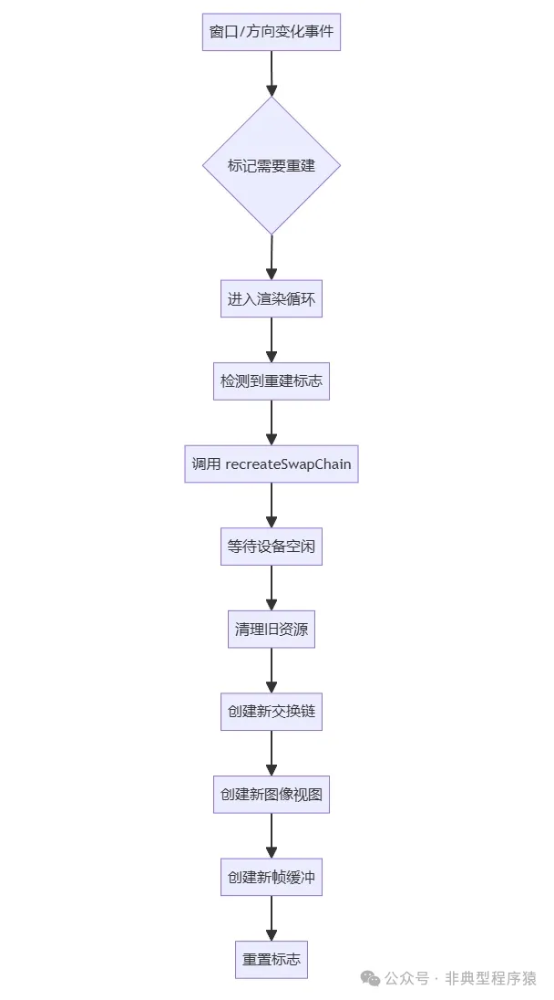
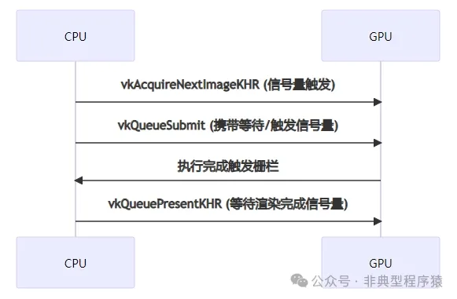

# 【Vulkan 入门系列】图像渲染，让图像动起来（十）

这一节我们主要学习如何渲染图像。展示了 Vulkan 渲染管线的典型控制流程，突出了其显式控制的特性，需要开发者精确管理资源生命周期和同步机制。

```
void HelloVK::render() {
if (!initialized) {
    return;
  }
if (orientationChanged) {
    onOrientationChange();
  }

vkWaitForFences(device, 1, &inFlightFences[currentFrame], VK_TRUE,
                  UINT64_MAX);
uint32_t imageIndex;
  VkResult result = vkAcquireNextImageKHR(
      device, swapChain, UINT64_MAX, imageAvailableSemaphores[currentFrame],
      VK_NULL_HANDLE, &imageIndex);
if (result == VK_ERROR_OUT_OF_DATE_KHR) {
    recreateSwapChain();
    return;
  }
assert(result == VK_SUCCESS ||
         result == VK_SUBOPTIMAL_KHR);  // failed to acquire swap chain image
updateUniformBuffer(currentFrame);

vkResetFences(device, 1, &inFlightFences[currentFrame]);
vkResetCommandBuffer(commandBuffers[currentFrame], 0);

recordCommandBuffer(commandBuffers[currentFrame], imageIndex);

  VkSubmitInfo submitInfo{};
  submitInfo.sType = VK_STRUCTURE_TYPE_SUBMIT_INFO;

  VkSemaphore waitSemaphores[] = {imageAvailableSemaphores[currentFrame]};
  VkPipelineStageFlags waitStages[] = {
      VK_PIPELINE_STAGE_COLOR_ATTACHMENT_OUTPUT_BIT};
  submitInfo.waitSemaphoreCount = 1;
  submitInfo.pWaitSemaphores = waitSemaphores;
  submitInfo.pWaitDstStageMask = waitStages;
  submitInfo.commandBufferCount = 1;
  submitInfo.pCommandBuffers = &commandBuffers[currentFrame];
  VkSemaphore signalSemaphores[] = {renderFinishedSemaphores[currentFrame]};
  submitInfo.signalSemaphoreCount = 1;
  submitInfo.pSignalSemaphores = signalSemaphores;

VK_CHECK(vkQueueSubmit(graphicsQueue, 1, &submitInfo,
                         inFlightFences[currentFrame]));

  VkPresentInfoKHR presentInfo{};
  presentInfo.sType = VK_STRUCTURE_TYPE_PRESENT_INFO_KHR;

  presentInfo.waitSemaphoreCount = 1;
  presentInfo.pWaitSemaphores = signalSemaphores;

  VkSwapchainKHR swapChains[] = {swapChain};
  presentInfo.swapchainCount = 1;
  presentInfo.pSwapchains = swapChains;
  presentInfo.pImageIndices = &imageIndex;
  presentInfo.pResults = nullptr;

  result = vkQueuePresentKHR(presentQueue, &presentInfo);
if (result == VK_SUBOPTIMAL_KHR) {
    orientationChanged = true;
  } elseif (result == VK_ERROR_OUT_OF_DATE_KHR) {
    recreateSwapChain();
  } else {
    assert(result == VK_SUCCESS);  // failed to present swap chain image!
  }
  currentFrame = (currentFrame + 1) % MAX_FRAMES_IN_FLIGHT;
}
```

## 1. 初始化检查与方向变化处理

```
if (!initialized) return;
if (orientationChanged) onOrientationChange();
```

- ```
  initialized
  ```

  ：确保 Vulkan 资源已初始化。

- ```
  orientationChanged
  ```

  ：处理屏幕方向变化（手机旋转），需要重建交换链。

orientationChanged 函数调用链如下（其中 `createSwapChain`、`createImageViews` 和 `createFramebuffers`，在前面的章节中已分析）：

onOrientationChange -> recreateSwapChain -> cleanupSwapChain -> createSwapChain -> createImageViews -> createFramebuffers

```
void HelloVK::recreateSwapChain() {
vkDeviceWaitIdle(device);
cleanupSwapChain();
createSwapChain();
createImageViews();
createFramebuffers();
}

void HelloVK::onOrientationChange() {
recreateSwapChain();
  orientationChanged = false;
}

void HelloVK::cleanupSwapChain() {
for (size_t i = 0; i < swapChainFramebuffers.size(); i++) {
    vkDestroyFramebuffer(device, swapChainFramebuffers[i], nullptr);
  }

for (size_t i = 0; i < swapChainImageViews.size(); i++) {
    vkDestroyImageView(device, swapChainImageViews[i], nullptr);
  }

vkDestroySwapchainKHR(device, swapChain, nullptr);
}
```

### 1.1 onOrientationChange()

处理屏幕方向变化事件（手机旋转）。移动端设备旋转时，交换链的宽高比/尺寸需要更新。

```
void HelloVK::onOrientationChange() {
  recreateSwapChain();    // 重建交换链
  orientationChanged = false;  // 重置标志
}
```

1. 调用 `recreateSwapChain()` 适配新的屏幕方向。
2. 重置 `orientationChanged` 标志避免重复触发 。

### 1.2. recreateSwapChain()

重建整个交换链系统。

```
void HelloVK::recreateSwapChain() {
  vkDeviceWaitIdle(device);       // 等待所有 GPU 操作完成
  cleanupSwapChain();             // 清理旧交换链资源
  createSwapChain();              // 创建新交换链
  createImageViews();             // 创建新的图像视图
  createFramebuffers();           // 创建新的帧缓冲
}
```

1. ```
   vkDeviceWaitIdle(device)
   ```

   ：强制等待 GPU 完成所有队列操作，确保安全销毁旧资源。

2. ```
   cleanupSwapChain()
   ```

   *：清理旧交换链及其依赖资源（帧缓冲、图像视图等）。

3. ```
   createSwapChain()
   ```

   ：重新创建与当前窗口 Surface 兼容的新交换链。

4. ```
   createImageViews()
   ```

    ：为交换链中的每个图像创建新的图像视图。

5. ```
   createFramebuffers()
   ```

    ：基于新的交换链图像视图和渲染流程（Render Pass）重建帧缓冲。

### 1.3 cleanupSwapChain()

安全释放与交换链相关的所有资源。

```
void HelloVK::cleanupSwapChain() {
// 销毁所有帧缓冲
for (auto framebuffer : swapChainFramebuffers) {
    vkDestroyFramebuffer(device, framebuffer, nullptr);
  }

// 销毁所有图像视图
for (auto imageView : swapChainImageViews) {
    vkDestroyImageView(device, imageView, nullptr);
  }

// 销毁交换链
vkDestroySwapchainKHR(device, swapChain, nullptr);
}
```

1. 帧缓冲（Framebuffers）

- 依赖图像视图和渲染流程，需先销毁

- ```
  vkDestroyFramebuffer
  ```

   释放每个帧缓冲对象

- 图像视图（Image Views）

- 基于交换链图像创建，需在交换链销毁前清理

- ```
  vkDestroyImageView
  ```

   释放每个图像视图

- 交换链（Swapchain）

最后调用 `vkDestroySwapchainKHR` 销毁交换链本身。交换链销毁后，其包含的 `VkImage` 对象会自动释放。



## 2. 同步等待与图像获取

```
vkWaitForFences(device, 1, &inFlightFences[currentFrame], VK_TRUE, UINT64_MAX);
uint32_t imageIndex;
VkResult result = vkAcquireNextImageKHR(
    device, swapChain, UINT64_MAX, 
    imageAvailableSemaphores[currentFrame], VK_NULL_HANDLE, &imageIndex);
```

1. ```
   vkWaitForFences
   ```

   ：等待前一帧的栅栏，确保不会覆盖正在使用的资源。

2. ```
   vkAcquireNextImageKHR
   ```

   ：获取下一个可用的交换链图像索引。
   使用 `imageAvailableSemaphores` 信号量进行同步。超时设置为最大值 `UINT64_MAX` 表示无限等待。

## 3. 交换链状态处理

```
if (result == VK_ERROR_OUT_OF_DATE_KHR) {
    recreateSwapChain();
    return;
}
assert(result == VK_SUCCESS || result == VK_SUBOPTIMAL_KHR);
```

1. ```
   VK_ERROR_OUT_OF_DATE_KHR
   ```

   ：交换链已失效（如窗口大小改变），需要重建。

2. ```
   VK_SUBOPTIMAL_KHR
   ```

   ：交换链仍可用但非最佳状态，稍后处理；`VK_SUCCESS`：正常获取图像。

## 4. 资源更新与命令缓冲区准备

```
updateUniformBuffer(currentFrame);
vkResetFences(device, 1, &inFlightFences[currentFrame]);
vkResetCommandBuffer(commandBuffers[currentFrame], 0);
recordCommandBuffer(commandBuffers[currentFrame], imageIndex);
```

1. ```
   updateUniformBuffer
   ```

   ：更新当前帧的 Uniform 数据（如 MVP 矩阵）。

2. ```
   vkResetFences
   ```

   ：重置栅栏状态为未触发。

3. ```
   vkResetCommandBuffer
   ```

   ：重置命令缓冲区。

4. ```
   recordCommandBuffer
   ```

   ：重新录制绘制命令。

### 4.1 updateUniformBuffer

`updateUniformBuffer()` 用于更新 Vulkan 的 Uniform 缓冲区数据，主要处理屏幕旋转适配和 MVP 矩阵更新，确保渲染内容正确适应设备方向变化。

```
void HelloVK::updateUniformBuffer(uint32_t currentImage) {
  VkSurfaceCapabilitiesKHR capabilities{};
vkGetPhysicalDeviceSurfaceCapabilitiesKHR(physicalDevice, surface,
                                            &capabilities);

  UniformBufferObject ubo{};
float ratio = (float)swapChainExtent.width / (float)swapChainExtent.height; 
getPrerotationMatrix(capabilities, pretransformFlag,
                       ubo.mvp, ratio);
void *data;
vkMapMemory(device, uniformBuffersMemory[currentImage], 0, sizeof(ubo), 0,
              &data);
memcpy(data, glm::value_ptr(ubo.mvp), sizeof(glm::mat4));
vkUnmapMemory(device, uniformBuffersMemory[currentImage]);
}
```

#### 4.1.1 获取 Surface 能力信息

获取当前物理设备 Surface（窗口/屏幕）的属性信息，包括：

- 当前旋转方向 (`currentTransform`)
- 最小/最大图像数量
- 图像尺寸限制

```
VkSurfaceCapabilitiesKHR capabilities{};
vkGetPhysicalDeviceSurfaceCapabilitiesKHR(physicalDevice, surface, &capabilities);
```

**VkSurfaceCapabilitiesKHR 结构体**

```
typedef struct VkSurfaceCapabilitiesKHR {
    //...
    VkSurfaceTransformFlagsKHR    supportedTransforms; // 支持的变换操作
    VkSurfaceTransformFlagBitsKHR currentTransform;    // 当前应用的变换
    //...
} VkSurfaceCapabilitiesKHR;
```

#### 4.1.2 计算宽高比

计算屏幕宽高比（可能已包含旋转补偿后的尺寸）。

```
float ratio = (float)swapChainExtent.width / (float)swapChainExtent.height;
```

#### 4.1.3 生成预旋转矩阵

这个函数尝试生成一个包含旋转动画效果的预变换矩阵。

```
getPrerotationMatrix(capabilities, pretransformFlag, ubo.mvp, ratio);
```

下面是 `getPrerotationMatrix` 具体实现，使用了 glm 库。

```
void getPrerotationMatrix(const VkSurfaceCapabilitiesKHR &capabilities,
                          const VkSurfaceTransformFlagBitsKHR &pretransformFlag,
                          glm::mat4 &mat, float ratio) {
// mat is initialized to the identity matrix
  mat = glm::mat4(1.0f);

// scale by screen ratio
  mat = glm::scale(mat, glm::vec3(1.0f, ratio, 1.0f));

// rotate 1 degree every function call.
staticfloat currentAngleDegrees = 0.0f;
  currentAngleDegrees += 1.0f;
  mat = glm::rotate(mat, glm::radians(currentAngleDegrees), glm::vec3(0.0f, 0.0f, 1.0f));
}
```

1. 初始化单位矩阵。
2. 在 Y 轴方向缩放 ratio 倍。
3. 持续旋转动画。使用 `static` 变量保存旋转角度（每次调用增加 1 度），绕 Z 轴（屏幕法线方向）旋转。

#### 4.1.4 更新 Uniform 缓冲区

```
void *data;
vkMapMemory(device, uniformBuffersMemory[currentImage], 0, sizeof(ubo), 0, &data);
memcpy(data, glm::value_ptr(ubo.mvp), sizeof(glm::mat4));
vkUnmapMemory(device, uniformBuffersMemory[currentImage]);
```

1. 映射内存：将 GPU 显存映射到 CPU 可访问的指针 (`vkMapMemory`)。
2. 数据拷贝：使用 `memcpy` 将 MVP 矩阵写入映射内存。
3. 解除映射：立即解除映射以保证 GPU 能正确访问 (`vkUnmapMemory`)。

### 4.2 recordCommandBuffer

`recordCommandBuffer` 用于录制 Vulkan 命令缓冲区，包含完整的渲染流程设置和绘制指令。

```
void HelloVK::recordCommandBuffer(VkCommandBuffer commandBuffer,
                                  uint32_t imageIndex) {
  VkCommandBufferBeginInfo beginInfo{};
  beginInfo.sType = VK_STRUCTURE_TYPE_COMMAND_BUFFER_BEGIN_INFO;
  beginInfo.flags = 0;
  beginInfo.pInheritanceInfo = nullptr;

VK_CHECK(vkBeginCommandBuffer(commandBuffer, &beginInfo));

  VkRenderPassBeginInfo renderPassInfo{};
  renderPassInfo.sType = VK_STRUCTURE_TYPE_RENDER_PASS_BEGIN_INFO;
  renderPassInfo.renderPass = renderPass;
  renderPassInfo.framebuffer = swapChainFramebuffers[imageIndex];
  renderPassInfo.renderArea.offset = {0, 0};
  renderPassInfo.renderArea.extent = swapChainExtent;

  VkViewport viewport{};
  viewport.width = (float)swapChainExtent.width;
  viewport.height = (float)swapChainExtent.height;
  viewport.minDepth = 0.0f;
  viewport.maxDepth = 1.0f;
vkCmdSetViewport(commandBuffer, 0, 1, &viewport);

  VkRect2D scissor{};
  scissor.extent = swapChainExtent;
vkCmdSetScissor(commandBuffer, 0, 1, &scissor);

  VkClearValue clearColor = {{{0.0f, 0.0f, 0.0f, 1.0f}}};

  renderPassInfo.clearValueCount = 1;
  renderPassInfo.pClearValues = &clearColor;
vkCmdBeginRenderPass(commandBuffer, &renderPassInfo,
                       VK_SUBPASS_CONTENTS_INLINE);
vkCmdBindPipeline(commandBuffer, VK_PIPELINE_BIND_POINT_GRAPHICS,
                    graphicsPipeline);
vkCmdBindDescriptorSets(commandBuffer, VK_PIPELINE_BIND_POINT_GRAPHICS,
                          pipelineLayout, 0, 1, &descriptorSets[currentFrame],
                          0, nullptr);

vkCmdDraw(commandBuffer, 3, 1, 0, 0);
vkCmdEndRenderPass(commandBuffer);
VK_CHECK(vkEndCommandBuffer(commandBuffer));
}
```

#### 4.2.1 命令缓冲区初始化

开始命令缓冲区的录制。

```
VkCommandBufferBeginInfo beginInfo{};
beginInfo.sType = VK_STRUCTURE_TYPE_COMMAND_BUFFER_BEGIN_INFO;
beginInfo.flags = 0; // 无特殊标志
beginInfo.pInheritanceInfo = nullptr; // 主命令缓冲区不需要继承信息

VK_CHECK(vkBeginCommandBuffer(commandBuffer, &beginInfo));
```

- ```
  flags=0
  ```

   表示默认一次性提交行为。

- ```
  pInheritanceInfo
  ```

   仅用于次级命令缓冲区。

#### 4.2.2 视口与裁剪区域设置

覆盖整个交换链图像区域。

```
VkViewport viewport{};
viewport.width = (float)swapChainExtent.width;
viewport.height = (float)swapChainExtent.height;
viewport.minDepth = 0.0f;
viewport.maxDepth = 1.0f;
vkCmdSetViewport(commandBuffer, 0, 1, &viewport);

VkRect2D scissor{};
scissor.extent = swapChainExtent;
vkCmdSetScissor(commandBuffer, 0, 1, &scissor);
```

1. 视口变换。
2. 裁剪区域：定义实际渲染的有效区域。

#### 4.2.3 渲染流程启动

```
VkRenderPassBeginInfo renderPassInfo{};
renderPassInfo.sType = VK_STRUCTURE_TYPE_RENDER_PASS_BEGIN_INFO;
renderPassInfo.renderPass = renderPass;
renderPassInfo.framebuffer = swapChainFramebuffers[imageIndex];
renderPassInfo.renderArea.offset = {0, 0};
renderPassInfo.renderArea.extent = swapChainExtent;

VkClearValue clearColor = {{{0.0f, 0.0f, 0.0f, 1.0f}}}; // RGBA 黑色
renderPassInfo.clearValueCount = 1;
renderPassInfo.pClearValues = &clearColor;

vkCmdBeginRenderPass(commandBuffer, &renderPassInfo, VK_SUBPASS_CONTENTS_INLINE);
```

- ```
  framebuffer
  ```

  ：选择当前交换链图像对应的帧缓冲。

- ```
  clearColor
  ```

  ：指定颜色附件加载时的清除值。

- ```
  VK_SUBPASS_CONTENTS_INLINE
  ```

  ：渲染指令直接记录在主命令缓冲区。

- 开始第一个子流程（Subpass 0）。

- 执行颜色附件的 `LOAD_OP_CLEAR` 操作。

#### 4.2.4 管线与资源绑定

```
vkCmdBindPipeline(commandBuffer, VK_PIPELINE_BIND_POINT_GRAPHICS, graphicsPipeline);
vkCmdBindDescriptorSets(commandBuffer, 
                       VK_PIPELINE_BIND_POINT_GRAPHICS,
                       pipelineLayout, 
                       0, // 第一个描述符集
                       1, // 描述符集数量
                       &descriptorSets[currentFrame],
                       0, nullptr); // 无动态偏移
```

1. 绑定顺序要求：
   1）管线必须与渲染流程兼容；
   2）描述符集必须与管线布局匹配。
2. 多帧机制：`currentFrame` 实现帧资源轮转（通常配合 `MAX_FRAMES_IN_FLIGHT`）。

#### 4.2.5 绘制指令

```
vkCmdDraw(commandBuffer, 3, 1, 0, 0);
```

- ```
  vertexCount=3
  ```

  ：绘制三角形（3 个顶点）。

- ```
  instanceCount=1
  ```

  ：非实例化渲染。

- ```
  firstVertex=0
  ```

  ：从顶点缓冲区 0 位置开始。

- ```
  firstInstance=0
  ```

  ：实例 ID 从 0 开始。

#### 4.2.6. 收尾操作

```
vkCmdEndRenderPass(commandBuffer);
VK_CHECK(vkEndCommandBuffer(commandBuffer));
```

1. ```
   vkCmdEndRenderPass
   ```

    标记渲染流程的结束，完成所有子流程（Subpass）和附件操作。

2. ```
   vkEndCommandBuffer
   ```

    结束命令缓冲区的录制过程，使其准备好被提交到队列执行。

## 5. 命令提交到图形队列

```
VkSubmitInfo submitInfo{};
// 等待阶段配置
VkSemaphore waitSemaphores[] = {imageAvailableSemaphores[currentFrame]};
VkPipelineStageFlags waitStages[] = {VK_PIPELINE_STAGE_COLOR_ATTACHMENT_OUTPUT_BIT};
submitInfo.waitSemaphoreCount = 1;
submitInfo.pWaitSemaphores = waitSemaphores;
submitInfo.pWaitDstStageMask = waitStages;

// 命令缓冲区配置
submitInfo.commandBufferCount = 1;
submitInfo.pCommandBuffers = &commandBuffers[currentFrame];

// 信号量配置
VkSemaphore signalSemaphores[] = {renderFinishedSemaphores[currentFrame]};
submitInfo.signalSemaphoreCount = 1;
submitInfo.pSignalSemaphores = signalSemaphores;

VK_CHECK(vkQueueSubmit(graphicsQueue, 1, &submitInfo, inFlightFences[currentFrame]));
```

1. 等待阶段：在颜色附件输出阶段等待图像可用。
2. 信号量：渲染完成后触发 `renderFinishedSemaphores`。
3. 栅栏：提交时关联 `inFlightFences`，用于 CPU-GPU 同步。

## 6. 图像呈现

```
VkPresentInfoKHR presentInfo{};
presentInfo.sType = VK_STRUCTURE_TYPE_PRESENT_INFO_KHR;

presentInfo.waitSemaphoreCount = 1;
presentInfo.pWaitSemaphores = signalSemaphores; // 等待渲染完成信号量

VkSwapchainKHR swapChains[] = {swapChain};
presentInfo.swapchainCount = 1;
presentInfo.pSwapchains = swapChains;
presentInfo.pImageIndices = &imageIndex;
presentInfo.pResults = nullptr;

result = vkQueuePresentKHR(presentQueue, &presentInfo);
```

1. 等待信号量：确保命令缓冲区执行完成后再呈现。

2. 呈现参数：指定要呈现的交换链和图像索引。

3. ```
   vkQueuePresentKHR
   ```

    将渲染完成的交换链图像提交给窗口系统，最终显示在屏幕上。

## 7. 呈现结果处理

```
if (result == VK_SUBOPTIMAL_KHR) {
    orientationChanged = true;
} else if (result == VK_ERROR_OUT_OF_DATE_KHR) {
    recreateSwapChain();
} else {
    assert(result == VK_SUCCESS);
}
currentFrame = (currentFrame + 1) % MAX_FRAMES_IN_FLIGHT;
```

1. ```
   VK_SUBOPTIMAL_KHR
   ```

    标记方向变化，稍后处理。

2. ```
   VK_ERROR_OUT_OF_DATE_KHR
   ```

    立即重建交换链。

3. 帧索引循环，使用模运算实现环形缓冲区。

下面分别是 demo 在手机竖屏和横屏下的显示截图，抓取一帧：


## 8. 关键同步机制示意图



