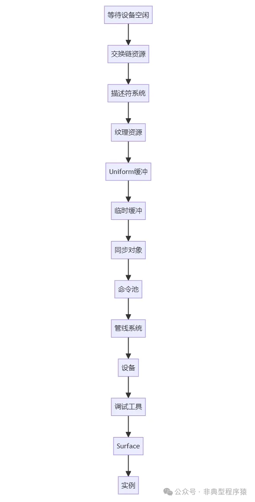

# 【Vulkan 入门系列】本地窗口改变后重置、资源清理和 GLSL 分析（十一）

最后一节主要介绍本地窗口改变后重置、资源清理和 GLSL 分析，本地窗口改变后重置可能涉及新建 Surface 和重建交换链。资源清理涉及销毁各种使用的 Vulkan 资源。GLSL 分析涉及顶点着色器和片段着色器。

## 一、重置

```
void HelloVK::reset(ANativeWindow *newWindow, AAssetManager *newManager) {
  window.reset(newWindow);
  assetManager = newManager;
if (initialized) {
    createSurface();
    recreateSwapChain();
  }
}

void HelloVK::recreateSwapChain() {
vkDeviceWaitIdle(device);
cleanupSwapChain();
createSwapChain();
createImageViews();
createFramebuffers();
}
```

### `reset()`

```
1. window.reset(newWindow)
```

，通过智能指针安全替换旧的 `ANativeWindow`，自动释放旧窗口资源。最终会调用 `ANativeWindow_release` 正确释放 `ANativeWindow`。

```
struct ANativeWindowDeleter {
  void operator()(ANativeWindow *window) { ANativeWindow_release(window); }
};
2. assetManager = newManager
```

，更新资源管理器指针，确保后续资源加载正确。

3. 条件性重建 Vulkan 资源。

1）`initialized` 检查：避免在 Vulkan 未初始化时调用 Vulkan API（防止崩溃）。
2）`createSurface()`：基于新窗口创建 Vulkan Surface（与窗口系统的连接点）。
3）`recreateSwapChain()`：重建交换链以适配新窗口尺寸/方向。

## 二、资源清理

`cleanup` 体现了 Vulkan 显式资源管理的核心原则，每个资源的生命周期都需要精确控制。

```
void HelloVK::cleanup() {
vkDeviceWaitIdle(device);
cleanupSwapChain();
vkDestroyDescriptorPool(device, descriptorPool, nullptr);

vkDestroyDescriptorSetLayout(device, descriptorSetLayout, nullptr);

vkDestroySampler(device, textureSampler, nullptr);
vkDestroyImageView(device, textureImageView, nullptr);
vkDestroyImage(device, textureImage, nullptr);

for (size_t i = 0; i < MAX_FRAMES_IN_FLIGHT; i++) {
    vkDestroyBuffer(device, uniformBuffers[i], nullptr);
    vkFreeMemory(device, uniformBuffersMemory[i], nullptr);
  }
vkDestroyBuffer(device, stagingBuffer, nullptr);
vkFreeMemory(device, stagingMemory, nullptr);
vkFreeMemory(device, textureImageMemory, nullptr);

for (size_t i = 0; i < MAX_FRAMES_IN_FLIGHT; i++) {
    vkDestroySemaphore(device, imageAvailableSemaphores[i], nullptr);
    vkDestroySemaphore(device, renderFinishedSemaphores[i], nullptr);
    vkDestroyFence(device, inFlightFences[i], nullptr);
  }
vkDestroyCommandPool(device, commandPool, nullptr);
vkDestroyPipeline(device, graphicsPipeline, nullptr);
vkDestroyPipelineLayout(device, pipelineLayout, nullptr);
vkDestroyRenderPass(device, renderPass, nullptr);
vkDestroyDevice(device, nullptr);
if (enableValidationLayers) {
    DestroyDebugUtilsMessengerEXT(instance, debugMessenger, nullptr);
  }
vkDestroySurfaceKHR(instance, surface, nullptr);
vkDestroyInstance(instance, nullptr);
  initialized = false;
}
```

### 2.1 初始同步操作

确保所有队列操作完成，避免销毁正在使用的资源。

```
vkDeviceWaitIdle(device); // 等待 GPU 完成所有操作
```

### 2.2 交换链相关资源销毁

销毁顺序：帧缓冲→图像视图→交换链，必须先于设备销毁。

```
cleanupSwapChain(); // 内部包含：
// vkDestroyFramebuffer (所有帧缓冲)
// vkDestroyImageView (所有图像视图)
// vkDestroySwapchainKHR (交换链)
```

### 2.3 描述符系统销毁

先销毁池再销毁布局（技术上无依赖，但逻辑上合理）。描述符集自动随池销毁。

```
vkDestroyDescriptorPool(device, descriptorPool, nullptr);
vkDestroyDescriptorSetLayout(device, descriptorSetLayout, nullptr);
```

### 2.4 纹理资源销毁

必须按依赖顺序销毁（视图依赖图像，图像依赖内存）。

```
vkDestroySampler(device, textureSampler, nullptr);
vkDestroyImageView(device, textureImageView, nullptr);
vkDestroyImage(device, textureImage, nullptr);
vkFreeMemory(device, textureImageMemory, nullptr);
```

1. 销毁采样器（与图像视图无关）。
2. 销毁图像视图。
3. 销毁图像对象。
4. 释放图像内存。

### 2.5 Uniform 缓冲区销毁

显式释放内存（非池化分配）。

```
for (size_t i = 0; i < MAX_FRAMES_IN_FLIGHT; i++) {
  vkDestroyBuffer(device, uniformBuffers[i], nullptr);
  vkFreeMemory(device, uniformBuffersMemory[i], nullptr);
}
```

### 2.6 临时缓冲区（Staging Buffer）销毁

销毁用于 CPU→GPU 数据传输的临时缓冲区。

```
vkDestroyBuffer(device, stagingBuffer, nullptr);
vkFreeMemory(device, stagingMemory, nullptr);
```

### 2.7 同步对象销毁

每组对应一个飞行中的帧，信号量和栅栏无依赖关系直接销毁。

```
for (size_t i = 0; i < MAX_FRAMES_IN_FLIGHT; i++) {
  vkDestroySemaphore(device, imageAvailableSemaphores[i], nullptr);
  vkDestroySemaphore(device, renderFinishedSemaphores[i], nullptr);
  vkDestroyFence(device, inFlightFences[i], nullptr);
}
```

### 2.8 命令系统销毁

销毁命令池会自动释放其分配的所有命令缓冲区，必须在设备销毁前执行。

```
vkDestroyCommandPool(device, commandPool, nullptr); 
```

### 2.9 渲染管线销毁

```
vkDestroyPipeline(device, graphicsPipeline, nullptr);
vkDestroyPipelineLayout(device, pipelineLayout, nullptr);
vkDestroyRenderPass(device, renderPass, nullptr);
```

1. 管线依赖管线布局和渲染流程
2. 管线布局可独立销毁
3. 渲染流程最后销毁

### 2.10 设备与实例销毁

```
vkDestroyDevice(device, nullptr);
if (enableValidationLayers) {
  DestroyDebugUtilsMessengerEXT(instance, debugMessenger, nullptr);
}
vkDestroySurfaceKHR(instance, surface, nullptr);
vkDestroyInstance(instance, nullptr);
```

1. 设备必须在实例之前销毁。
2. 调试工具在实例销毁前销毁。
3. Surface 在实例销毁前销毁。

### 2.11 关键销毁顺序总结



## 三、shader.vert

```
#version 450

// Uniform buffer containing an MVP matrix.
// Currently the vulkan backend only sets the rotation matix
// required to handle device rotation.
layout(binding = 0) uniform UniformBufferObject {
    mat4 MVP;
} ubo;

vec2 positions[3] = vec2[](
    vec2(0.0, 0.577),
    vec2(-0.5, -0.289),
    vec2(0.5, -0.289)
);

vec2 texCoords[3] = vec2[](
    vec2(0.5, 1.0),
    vec2(0.0, 0.0),
    vec2(1.0, 0.0)
);

layout(location = 0) outvec2 vTexCoords;

void main() {
    gl_Position = ubo.MVP * vec4(positions[gl_VertexIndex], 0.0, 1.0);
    vTexCoords = texCoords[gl_VertexIndex];
}
```

### 3.1 版本声明

指定使用 GLSL 4.50 核心版本，匹配 Vulkan 的着色器要求。

```
#version 450
```

### 3.2 Uniform 缓冲区定义

接收应用程序传入的模型-视图-投影矩阵。该结构体需与 CPU 端定义的内存布局完全一致（通常使用 `std140` 布局）。

```
layout(binding = 0) uniform UniformBufferObject {
    mat4 MVP; 
} ubo;
```

- 绑定点：`binding = 0` 对应 Vulkan 描述符集的绑定点 0。

### 3.3 顶点位置数组

```
vec2 positions[3] = vec2[](
    vec2(0.0, 0.577),   // 顶部顶点 (近似等边三角形高度)
    vec2(-0.5, -0.289), // 左下顶点 
    vec2(0.5, -0.289)   // 右下顶点
);
```

构成一个中心在原点、Y 轴向上的等边三角形。Y 坐标值计算依据：等边三角形高度公式 h = √3/2 ≈ 0.866（高度 = 边长 × √3 ÷ 2）。

### 3.4 纹理坐标数组

将三角形映射到纹理的底部区域，顶部顶点拉伸到纹理上半部中点。

```
vec2 texCoords[3] = vec2[](
    vec2(0.5, 1.0),  // 顶部顶点对应纹理上半部中点
    vec2(0.0, 0.0),  // 左下顶点对应纹理左下角
    vec2(1.0, 0.0)   // 右下顶点对应纹理右下角
);
```

### 3.5 输出变量声明

将纹理坐标传递给片段着色器。

```
layout(location = 0) out vec2 vTexCoords;
```

- Location：对应片段着色器 `layout(location = 0) in vec2 vTexCoords`。

### 3.6 主函数逻辑

```
void main() {
    // 顶点位置变换
    gl_Position = ubo.MVP * vec4(positions[gl_VertexIndex], 0.0, 1.0);
    // 传递纹理坐标
    vTexCoords = texCoords[gl_VertexIndex];
}
1. gl_VertexIndex：
```

- 在无索引绘制时：表示当前顶点序号（0,1,2,...）。
- 在索引绘制时：表示索引缓冲区中的值。
- 此处用于访问硬编码数组。
- 位置变换

- ```
  vec4(positions[gl_VertexIndex], 0.0, 1.0)
  ```

   将 2D 位置扩展为齐次坐标（3D z=0，w=1）。

- 矩阵乘法：`ubo.MVP * vec4(...)`。应用完整的模型-视图-投影变换，输出为裁剪空间坐标。

- 纹理坐标传递

- 直接按顶点索引获取预定义的纹理坐标。
- 输出后由光栅化阶段插值。

## 四、shader.frag

```
#version 450

layout(location = 0) in vec2 vTexCoords;

layout(binding = 1) uniform sampler2D samp;

// Output colour for the fragment
layout(location = 0) out vec4 outColor;

void main() {
    outColor = texture(samp, vTexCoords);
}
```

### 4.1 输入变量声明

接收来自顶点着色器的纹理坐标输入。

```
layout(location = 0) in vec2 vTexCoords;
```

- 类型：`vec2` 二维向量，表示纹理坐标 (U, V)。
- 布局限定符：`location = 0` 表示该输入变量对应顶点着色器输出位置 0 的变量。

### 4.2 Uniform 采样器声明

声明一个 2D 纹理采样器，用于访问绑定的纹理。

```
layout(binding = 1) uniform sampler2D samp;
```

绑定点：`binding = 1` 表示该采样器对应描述符集绑定点 1 的纹理资源。

### 4.3 输出变量声明

定义片段着色器的输出颜色。

```
layout(location = 0) out vec4 outColor;
```

- 类型：`vec4` 四维向量，表示 RGBA 颜色（取值范围通常为 [0,1]）。
- 输出位置：`location = 0` 对应渲染目标的颜色附件索引 0。

### 4.5 主函数逻辑

```
void main() {
    outColor = texture(samp, vTexCoords);
}
```

1. 纹理采样：使用 `texture()` 函数，通过采样器 `samp` 在纹理坐标 `vTexCoords` 处进行采样。
2. 颜色输出：将采样得到的颜色值直接赋给输出变量 `outColor`。

