# Unveil GPU-1 GPU的工作环境

10年前，当自己踏入GPU芯片行业时，就深刻感受到这个领域的博大精深。一直以来都想写一个文章系列，聊聊GPU的内部世界，讲讲架构设计的理念。可惜每次该行动时，又觉得功力尚浅不了了之。如今依然学艺不精，但还是拿起键盘试一试，当作学习。顺道立根杆子，等哪天回头一看：写的什么垃圾。

**GPU的工作环境**

------

我们不妨先跳过GPU的历史，暂且关注它的当下。我们知道，GPU在结构上属于CPU的外围设备，功能上是CPU的协处理器，负责图形渲染和通用计算。通俗地讲，**GPU是个替CPU打工的**。但CPU并不是一个单纯的老板，而是一套完整的运营体系。在这个体系里，应用作为客户位于最顶层，往下是一家名为O&D的渲染公司，由操作系统和驱动两大部门组成。这两个部门的员工都懂技术，他们负责校验、解析客户的需求和材料，然后布置任务给最一线的技术人员，一个游离于体系外的自由职业者——GPU。这套体系的逻辑结构大致长这样（这篇文章以Windows平台为例）：

如果你觉得这张图有你感兴趣的点，那么欢迎接着看下去。下面将自顶向下介绍这套体系，坐稳了，出发。

**应用**

在讲应用之前，先要说下图形API。这是O&D公司为了方便沟通所制定的一系列图形应用接口，客户使用其中的抽象函数和高级Shader语言（比如HLSL和GLSL）来跟O&D打交道。API大大提升了用户体验，在桌面平台上，常见的图形API有三种：Direct3D, OpenGL和Vulkan。移动端则是OpengGL ES。这些接口并非一成不变，在历史上它们随着需求的丰富以及技术的创新出现了多个版本，时至今日仍然在发展。

所以应用可以定义为：**任何使用了图形API的程序**。可能是3D游戏，引擎，也可能是工业界用的3D建模软件。可能运行于计算机，手机，或者机顶盒，VR/AR设备。应用的渲染可能是静态的，也可能随着玩家位置和视角变化而切换到不同场景。应用可能执行了许多高级图形算法，也可能只有一个Hello Triangle。应用的代码好比客户手上的《需求说明书》，上面写满了业务代码和各种渲染操作。这份说明书的最终需求是要O&D公司画一帧图像，输出到显示设备（比如电脑屏幕）或者存储为离屏图像。

拿到了需求说明书，O&D公司马上立项搞起。这么庞大的项目自然需要整个公司分工和协作。而要想明白他们的协作机制，就需要先了解不同员工的职责，掌声有请：

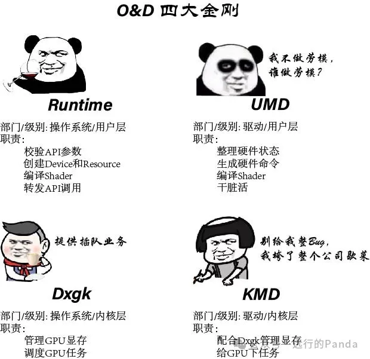

**Runtime**

作为一家自立更生的企业，O&D公司遵循客户即上帝的企业价值观。每位客户都配有一个与之对接的专属项目主管——Runtime。首当其冲的Runtime会小心翼翼地检查相关接口参数的合法性。当他发现非法参数，会当面反馈给应用。而作为久经沙场的老司机，他总结出了需求说明书的基本套路：

- 1. 创建Device
- 2. 创建各种Resource
- 3. 编译Shader
- 4. 设置渲染流水线状态，调用Draw

在解释Runtime如何拆解这些招数之前，有必要简单聊一下计算机的显卡（O&D公司习惯称它为Display Adapter或Adapter）。显卡对于我们并不陌生，它由母板和若干关键部件组成。GPU是这些部件的核心，和他携手的家人们一般还有显存(Video Memory)，PCIe接口，显示接口(如HDMI，DVI和VGA)，VRM（电压调节模块）和散热系统等等。你可能脑海里已经浮现了显卡的样子，但有点模糊。我从网上随便找了张图片，将就看一下。

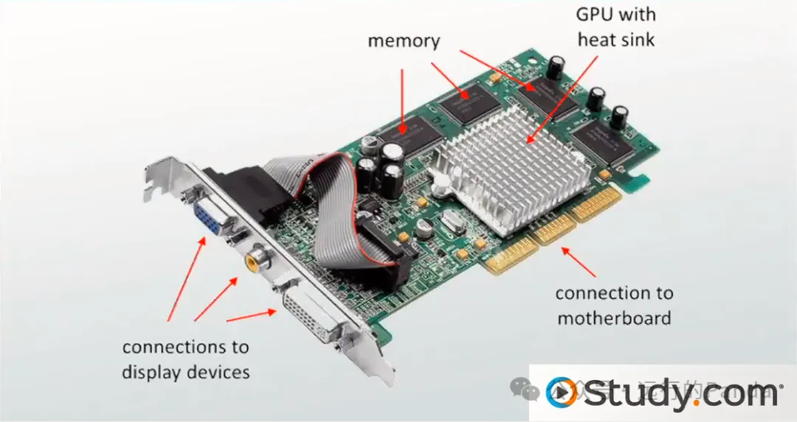

GPU从母板获得电能，每次上电后CPU会对他初始化。CPU通过PCIe接口访问显存和GPU（MMIO寄存器），并且CPU访问它们的方式跟访问主存一样简单。这得益于MMIO（Memory mapping I/O），MMIO把I/O设备映射成CPU可见的地址，使得PCIe这班高铁能无差别去到北上广，深港澳，甚至直达GPU家门口。凭借便利的高铁，CPU把命令和用到的资源都传送到显存中（也有一部分资源在主存中），然后驱动GPU工作。GPU完成渲染后往Render Target写了一帧图像。最后，在CPU的操作下，这帧图像被拷贝出来并经由输出接口传送到显示设备显示出来。只要这个渲染过程一直运行，图像就源源不断。因为帧速率足够快，渐变的渲染结果在你眼前便形成动画。

API干的事大致分为两类：**创建资源和操控渲染**。资源可以理解为一块特定用途，会被填充特定数据的存储空间，如Vertex Buffer，Texture，Render Target和各类Shader。API层面的资源创建和使用都会牵涉到对显卡的操作，作为夹在应用和硬件之间的中介公司，O&D需要一个平台，或者说，需要一种抽象，把应用和硬件的操作关联起来。这种抽象在Direct3D API里叫做Device。

Device提供了创建Resource和操控渲染的接口。应用每次调用Device的接口时，O&D会将之解释成为硬件行为。所以每个应用都必须创建Device。另外提一下，Direct3D为了支持多线程优化，把操控渲染这一块单独拎出来整成Context。不过，为了方便，接下来我会把Context也归入到Device来讲。

Device和Resource都是在Runtime的主导下完成创建的。其实四大金刚的称号具有迷惑性，表面上他们是组团出道，但在实际的工作日常中，要么是Runtime对UMD发号施令，要么是Dxgx（经由Runtime指示后）向KMD下达请求。没错，扎心的真相就是：**Driver为OS服务。**

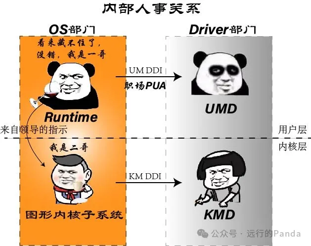

好了，回归正题，继续围观，一起见证Runtime见招拆招。

1：创建Device

初出茅庐的Runtime指挥全局，在用户层和内核层各创建一个Device：

- 在Runtime指示下，Dxgk向KMD请求创建KM (Kernal Mode) Device
- 如果创建成功，那么Runtime接着向UMD请求实例化UM (User Mode) Device

这里面有一个小插曲，就是UMD在实例化Device的过程中需要创建Command Buffer，用来记录渲染状态和渲染操作对应的GPU硬件命令。当然实际分配存储是由KMD完成的，UMD回调Runtime，让Runtime指示Dxgk向KMD请求创建。

随着UM Device和KM Device的创建，用户层和内核层各搭起了一座桥梁。对于Runtime来说，UM Device就像一个遥控器，上面的每个按钮对应着一个内部接口——DDI (Device Driver Interface），接口的实际功能由UMD实现。

2：创建各种Resource

在这一步，Runtime使用了UM Device这个新武器——调用UM Device的CreateResource接口让UMD创建资源。类似地，其中分配存储的操作还是得回调到KMD来完成。

3：编译Shader

Runtime会先校验Shader，检查是否有语法错误，是否遵守Direct3D的限制，比如对于使用Shader Model 4.0的Vertex Shader，每个constant buffer包含的向量不能超过4096个，输出的Attribute不能超过32个等等。确认无误后，Runtime接着把Shader编译成Token指令。

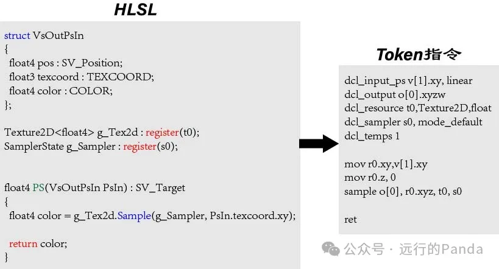

Token指令是Shader的中间形态，它接下来会被UMD进一步编译成硬件指令（Instruction，注意不要跟硬件命令，Command混淆）。Runtime所做的编译含有许多高层的优化，比如死代码消除、常量传播以及循环和分支方面的优化。有一说一，这些优化给驱动编译器减轻了不少负担，UMD得说声谢谢。

4：设置渲染流水线状态，调用Draw

这一部分的API基本都有对应的DDI，Runtime躺平按按钮，把遥控器的功能发挥到极致，压力一直在UMD这边，我贴了冰山一角给大家感受下：

| **API函数**            | **DDI函数**            |
| ---------------------- | ---------------------- |
| VSSetShader            | VsSetShader            |
| VSSetConstantBuffers   | VsSetConstantBuffers   |
| PSSetShaderResources   | PsSetShaderResources   |
| PSSetSamplers          | PsSetSamplers          |
| CreateDepthStencilView | CreateDepthStencilView |
| OMSetDepthStencilState | SetDepthStencilState   |
| CopyResource           | ResourceCopy           |
| IASetVertexBuffers     | IaSetVertexBuffers     |
| IASetInputLayout       | IaSetInputLayout       |
| Draw                   | Draw                   |

**UMD**

UMD的实体是一个供Runtime加载使用的动态链接库文件（dll），他其实很形象，你看得见他。电脑的C:\System32下有个DriverStore目录，UMD就住在其中某个驱动子目录里面。他居无定所，每当你更新一次驱动，他就会被迫搬一次家。在64位机器下跑Direct3D 10/11应用的时候，三大GPU主流厂商用到的UMD实体分别是：

| NV (RTX)     | nvldumdx.dll    |
| ------------ | --------------- |
| AMD (Radeon) | aticfx64.dll    |
| Intel        | igd10iumd64.dll |

Direct3D 9/12的UMD可能跟10/11不同。比如Intel的GPU，在跑Direct3D 9和12使用的UMD实体分别是igdumdim64.dll和igd12umd64.dll。

在前面介绍Runtime时我们讲到，UMD需要处理来自Runtime的3种请求：Resource，Shader，Raster State/Operation。

任务1：创建Resource

到这里需要稍微聊下GPU了，虽然距离他正式登台还有一段时间。首先要说的是，GPU不是一个单独的大块头，而是由多个各司其职的模块连接组成。Direct3D 11的pipeline本身就是多个模块组成的流水线，请看：

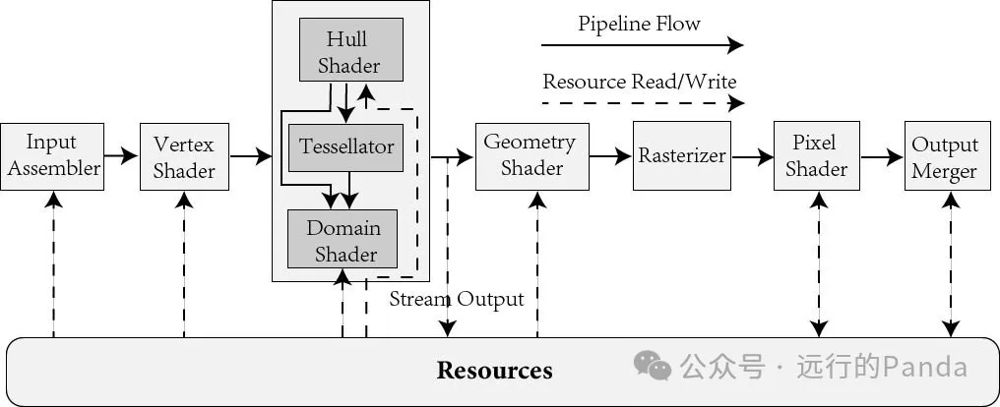

我们可以清楚地感受到，对Resource的需求是贯穿整条pipeline的。比如

- Input Assembler可能读Index
- 各类Shader可能索要Texture，Sampler或者UAV
- Stream Output会写Vertex
- Output Merger可能读写Depth，Stencil或者Color

Resource的容量上限一般都比较高，比如Direct3D允许的Render Target容量上限是2G，基本算是上不封顶了，显存都不一定有这么大。所以，Resource通常需要存放在Memory里，GPU根据Resource的地址去读取里面的数据。

但我说了是通常，也会一些特殊情况，比如Resource的容量不算大，又或者厂商财大气粗不care，那么Resource也可能被安置在一块on-chip存储上，让GPU直接读取。在财力允许的情况下，on-chip是更优选择。从Memory读缺点明显：**要等很久**。延迟一般是几百个时钟周期，一个时钟周期按1纳秒算的话，这大概是一份快递从广东寄到上海花费的时间。而相比之下，on-chip读取，是你到附近商场一次愉快的购物之旅。

除了Direct3D流水线上显式标注的Resource，广义上的Resource还包括各种流水线状态，流水线状态是一种轻量级的信息，也属于on-chip存储。不管是off-chip还是on-chip，UMD需要做的是维护所有Resource，追踪仓库地址或者包裹本身。等到恰当时机，把这些信息告诉GPU。

任务2：编译Shader

UMD从Runtime那里接手的Shader，是一串通过了校验，确认无语法错误并且遵守规范的Token指令，其中包含了Runtime所做的高层级优化。也许当Runtime无聊的时候他也有想过要玩低层级编译，所谓技多不压身嘛，可是马上发现没资源——因为处理器的指令集（Instruction Set Architecture，ISA）是UMD和GPU作为钢铁联盟，从不外传的核心机密，哪怕是同一个公司内不同部门的同事也不行。并且这个联盟还可能随时跳槽，重新招另一家联盟进来后，那又是不一样的指令集。

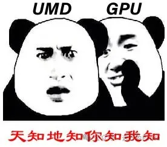

UMD会先把Token指令转换成中间语言，然后进一步编译成机器码。他把原来的逻辑寄存器映射成物理寄存器，把Runtime家的算术逻辑、控制指令翻译成自家指令。同时还加入了低级别的优化，比如循环展开，隐藏延时等等。这是一项不小的工程，让专业的编译工程师来讲，可能一个小时都讲不完。本着抓(我)大(也)放(不)小(懂)的原则，就此打(溜)住(了)。

任务3：设置渲染流水线状态

在Direct3D的流水线上，每个模块的工作行为都受状态指示。比如在Output Merger里，Blend状态会指示AlphaToCoverage和Blend是否开启，source color和dest color使用什么blend factor。在每次启动渲染前，CPU会通过**寄存器配置命令**，把每个API状态推送到它归属的模块，然后保存在那个模块的**寄存器**里。等后面执行渲染时，这个模块再通过寄存器查看状态。

寄存器是一种on-chip存储介质，出于成本考虑，每个状态的占位都要抠到bit level，并且要尽可能避免空位。所以，寄存器里状态的排布一般跟API有差别。比如API的DepthStencilDesc状态：

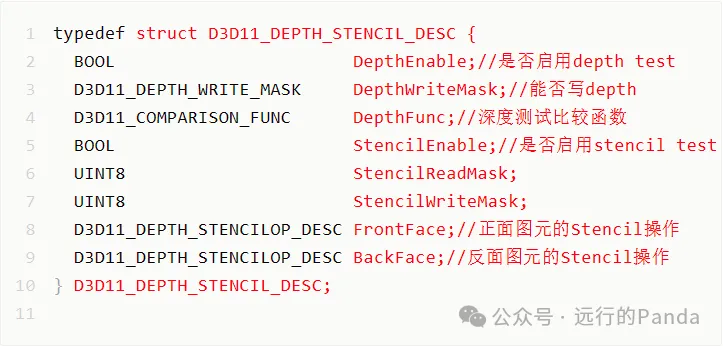

到了寄存器这边可能只需要2个Dword就够了（1个Dword 等于32bits），并且还留有18bit的空位等其他状态来拼桌：

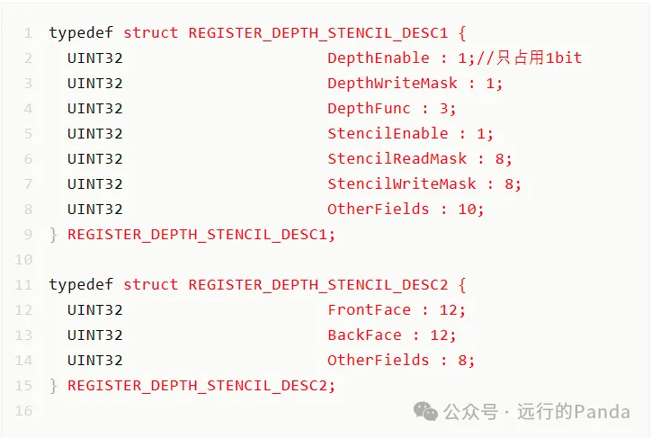

当Runtime把一个渲染状态转发给UMD，UMD需要先把它转换成寄存器状态，然后再生成寄存器配置命令。

寄存器配置命令是本文迄今出现的第一种命令。和指令集一样，命令集也属于U-G联盟的机密，所以我也不知道这个命令的具体面目。但为了让各位童鞋有个基本概念，我要尝试山寨这个命令。众所周知，山寨不犯法。Anyway, continue。既然命令是山寨的，那么GPU应该也是山寨的，我们假设这个山寨版GPU：

- 内部模块跟Direct3D pipeline完全一致，一共有9个模块：IA, VS, HS, TS, DS, GS, RS, PS和OM
- 支持的命令类型不多，不超过16种
- 每个模块的寄存器也不多，不超过16个Dword

了解指令编码译码的童鞋都知道，一条指令的类型，是通过操作码来标志的。到了命令集这边，我们就管这个标志叫**命令码**好了。因为我们要山寨的命令不会超过16种，命令码只需要4bit。我们规定命令码为1表示寄存器配置命令。

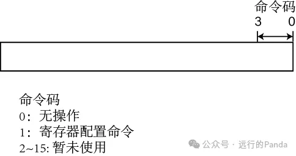

因为寄存器配置命令是要把数据推送给某个模块，所以它还需要一个模块标志。山寨版GPU只有9个模块，模块标志占4bit：

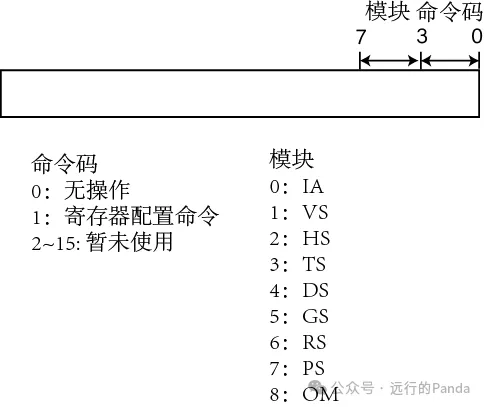

最后，我们还需要一个标志，DwIdx，表示正在配置的是寄存器的第几个Dword。因为所有模块的寄存器容量都不超过16个Dword，这个标志占4bit。到这里，山寨版GPU的第一版命令集就完成了：

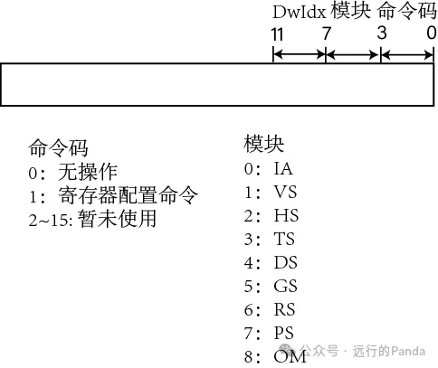

它看上去简单，但有效。我们仍然以DepthStencilDesc作为例子看看UMD怎么工作。假设depth test开启，能写depth，比较函数为Less。同时stencil test开启，read mask和write mask全1，所有stencil操作都为keep。

按照命令集规范，UMD生成了两个命令头部：0x81和0x181。根据寄存器排布，UMD整理出了两个状态值：0x3fffe7和0x0。最终形成的命令流是：0x81，0x3fffe7，0x181，0x0。

镜头给到GPU这边，每个模块收到命令头部后，会先检查下命令码，得知是寄存器配置命令后接着查看目标模块：如果不是给自己的，那么就把头部和后面的状态值一起转发下去。如果是给自己的，就提取出DwIdx，把状态值存到对应的寄存器位置。

前面我们说过，UMD会追踪每个Resource在Memory的地址。GPU这边哪个模块要访问Resource，就在寄存器上留一个Resource地址，让UMD按照刚刚那套流程去配置。

好了，配置状态的故事就到这。最后提一下，API状态不是硬件寄存器的全部。寄存器里面还有很多硬件独有的控制量，比如任务调度模式，Buffer使用模式，加速开关，等等等等。还有，也不是全部寄存器都由UMD管理，有一部分app-independent的全局状态由KMD出马管理。

任务4：渲染操作

类似Clear或Draw这样的操作，UMD的处理很简单，他会跟GPU定义对应的命令，然后把Clear或Draw和参数转化成对应的GPU命令即可。

除了处理Runtime派发的工作，UMD还有一项特殊的工作：干脏活。

很多时候，UMD需要给GPU擦屁股打补丁：

- 情景1：GPU流片回来后发现有硬件bug

这种情况，GPU一般不会很慌，最多小抽几口烟压下惊。他会找到UMD仔细复盘，研讨补救方法。有时候运气好，UMD修改几个寄存器或者下几个特殊命令就绕过去了。运气差一点的话，也就是重新编译一次Shader。而有时候运气特别背，UMD告诉他，打了补丁之后他的整体战斗力会掉30%，意味着他以后每天要多上班三个小时……

- 情景2：GPU有些硬件功能没来得及完成

不出意外，GPU又找上UMD的家门了。这次他希望UMD能发挥下技术优势，给他整个软件解决方案。举个不现实、但有助于理解的例子，Direct3D有个展示模型轮廓线的Wireframe功能，如果硬件没实现的话，UMD可以偷偷起一个Geometry Shader把每个三角形转化成它的3条边。妙吧，比妙脆角还妙。只是那个已经过气到十八线的Geometry Shader，做梦都想不到自己会以这种方式获得热度。

- 情景3：为GPU卸掉历史负担

Direct3D的流水线是经过多个版本的演变才发展到今天这个模样的。标准规范要增加点什么，无非是加几页纸的事。但硬件一直加东西会变得很臃肿，有时候也需要给自己瘦瘦身，砍掉一些过时的功能。被砍掉的一般是Fixed-Function功能，比如Direct3D 9的Alpha Test和Fog功能。当然，再过时的功能，也可能还有老粉在用，真要遇上了就用情景2的方案给搞个妙脆角。

可能有些童鞋没明白Fixed-Function是什么。顾名思义，它是指用固定电路做的、不可编程的功能。跟它对应的就是用一段代码运行在处理器上实现的可编程功能。Fixed-Function就像七十二绝技，精准强悍，但多学一技多一分成本。可编程功能是小无相功，学一技可催动百技。但效率和功耗方面不如Fixed-Function。历史上，曾有一个完全使用可编程功能设计GPU的案例：

- 情景4：给GPU包装

这其实是一份体面活——UMD针对特定的Benchmark或游戏选择专门硬件配置，以使性能更优。比如，假设有某个缓存被两个模块A和B共享。默认情况下，A和B各使用一半。但实验发现在跑某款游戏时，模块A几乎不用这个缓存，而且模块B却经常因为不够用而卡住，这时UMD可以通过多配一些缓存给模块B来缓和瓶颈。

**内核双雄：Dxgk和KMD**

Dxgk（DirectX Graphics Kernal subsystem)的实体是电脑上的dxgkrnl.sys文件。它包含两大功能：显存管理和任务调度。显存管理这一块，我们在前面已经接触到了它在创建Resource的一些表现，除此之外，Dxgk还负责创建和管理页表。

KMD是真正和硬件打交道的CPU成员，UMD是每个应用对应一个，KMD永远只有一个。他负责在设备启动时初始化GPU，设置Adapter，获取Adpater信息，配置watchdog计时器等等。

还有一点，KMD还会在每个**DMA Buffer**（DMA Buffer可以看作由许多命令构成的任务块，后面会详细说到）的尾巴上插入一个**Fence命令**，上面携带Fence Id和一个Memory地址。其中Fence Id表示当前DMA Buffer的序数。GPU每收到一个Fence命令，会把Fence Id通过PCIe写到Memory地址对应的位置，触发一次KMD的中断，接着KMD把Fence Id读出来，就知道了Fence Id对应的DMA已经被GPU执行完。对于CPU来说，很多同步工作都靠这套Fence Id的机制来完成。比如，我们在前一个DMA Buffer使用Stream Output输出了一些Vertex，然后在后面跟着的DMA Buffer使用这些Vertex，两个DMA Buffer存在RAW（Read After Write）的依赖关系。CPU需要等到前一个DMA Buffer的Fence Id触发中断后，才能提交下一个DMA Buffer给GPU。

这里重点介绍下Dxgk和KMD联手奉献的两个代表作：超时检测和恢复 (Timeout Detection and Recover, TDR）和抢占（Preemption）。

我们知道，GPU是支持被多个应用共享使用的，但每个应用似乎都感觉自己在独占着GPU。这是因为背后有Dxgk负责调度这些应用，避免因为某个应用过度使用GPU导致其他应用卡顿。

Dxgk使用了时间片(time-sliced)的调度方式。假设有两个进程A和B一起运行在GPU上，一开始是进程A占用GPU，持续了时间T后，Dxgk就暂停受理进程A的DMA Buffer，转而去传送进程B的命令。同样，当进程B占用了时间T之后，Dxgk再次切换回去服务进程A。A和B就这样轮流地，以固定时间T使用GPU:

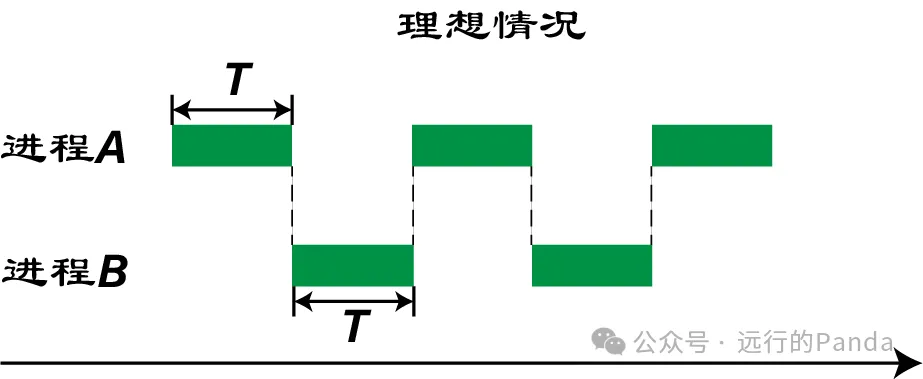

当然，上面图片所展示的切换是一种理想情况。在实际中，当Dxgk从进程A切换到进程B，开始把进程B的DMA Buffer送给KMD时，GPU可能还有一些进程A的DMA Buffer没执行完：

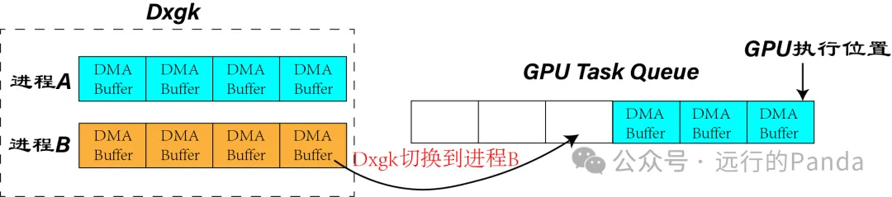

一般来说，这几个没完成的DMA Buffer都是小菜，GPU会迅速消化掉它们，切换延迟远小于T，所以整个切换过程还算流畅：

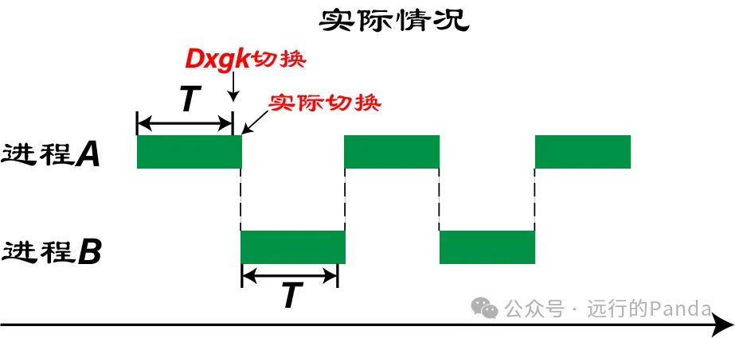

但如果某个DMA Buffer里含有非常耗时的硬骨头，它就有可能赖很久才走，这种情况就比较讨人厌了：

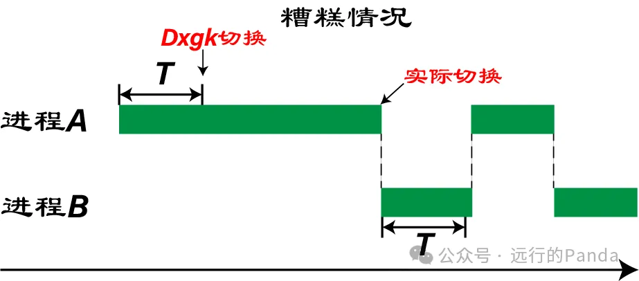

这块硬骨头可能是负载很大的Draw或者通用计算。虽然并不常见，但一旦出现了就会带来不愉快的体验。在Windows平台上，桌面窗口管理器有一些功能是通过GPU完成的，比如，你在锁屏时看到的毛玻璃效果，就是出自GPU之手：

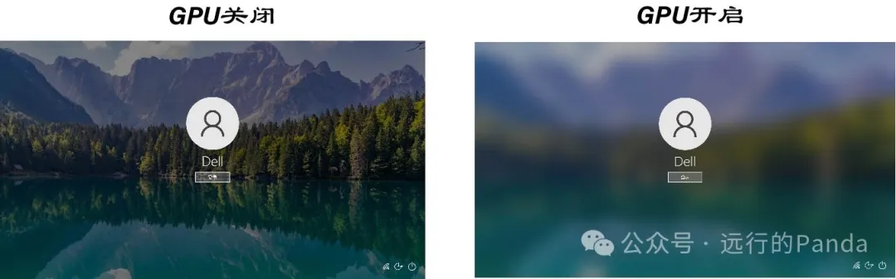

如果一个应用要执行一些复杂的计算任务，每个任务会占用GPU几秒左右的时间，那么在每个任务执行期间，桌面窗口管理器将没法使用GPU，从而可能导致桌面出现肉眼可见的瑕疵。

为了应对这种隐患，OS联手GPU给出了解决方法：超时检测和恢复 (TDR)。当Dxgk检测到GPU的切换延迟超出一个允许值时，它会通过KMD给GPU发一个**抢占**命令，指示GPU做两件事：

**以最快速度保留当前DMA现场，扔掉还没完成的DMA。**

这等于是下了死命令：**交出兵权，越快越好**！如果GPU收到命令后很快就切换过来，那么这个隐患就消除了。但是如果GPU因为种种原因，一直按兵不动呢？

Dxgk的忍耐是有限的，默认只有2秒钟。如果这个军令出门超出2秒，GPU还没有执行，那么不好意思，Dxgk将会采取暴力：重启GPU。

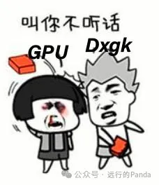

Dxgk会通过DDI接口指示KMD启动Reset。KMD收到指示后会立刻停止访问Memory和GPU，并重新初始化自己和GPU的状态。Dxgk这边会先把所有显存的Allocation都清干净，然后从图形栈里找出最后的状态，把事故发生前的桌面现场重新绘制。重绘虽然会导致桌面出现一次不友好的闪烁，但是跟重启电脑比好得不能更多。

我们再回头看下抢占。当Dxgk发出抢占命令时，如果GPU不支持抢占，就可能成为老赖。而支持抢占的GPU呢，切换粒度也可能是良莠不齐的，比如对于渲染这一块，常见的抢占粒度是下面3种：

- DMA粒度

  把当前DMA Buffer执行完后执行切换，这是最粗糙的粒度。

- Draw粒度

  把当前Draw执行完后，保留现场执行切换。因为一个DMA里面可能有多个Draw，所以Draw粒度优于DMA粒度。

- Primitive粒度

  把当前Primitive执行后，保留现场执行切换。因为一个Draw里面可能有多个Primitive，所以Primitive粒度优于Draw粒度。

这三种粒度，越来越细，但相应地，实现难度也越来越大。因为粒度越细，说明切换点在流水线的位置越深，需要保留和恢复的现场状态越多，保留和恢复的逻辑越复杂，验证成本越高。

比如DMA粒度，它压根不需要保存现场，而对于Draw粒度，需要保存切换时GPU正执行到DMA Buffer的哪个位置。前些年VR很火的时候，实现渲染和计算之间丝滑切换的呼声很高，有某大厂把抢占做到了像素粒度和指令粒度，现场状态需要好几兆存储。这种卷也说明支持抢占的趋势，这早已不是臣妾能否做到的问题，而是臣妾得做得多好的问题。

发生切换时，现场状态会被写入到指定的Memory位置，在恢复阶段，Dxgk会把这个DMA Buffer重新下一次，而GPU这边会把现场状态读回来，根据这些状态找到之前切换的位置然后继续执行。也就是说，GPU负责从一个DMA Buffer内部找到恢复位置。

而判断从哪个DMA Buffer恢复，则由Dxgk和KMD合作完成的。每个DMA的尾巴上都有一个Fence命令，当一个DMA被完整执行后，会把Fence命令上携带的Fence Id会写进Memory，然后中断KMD和Dxgk去读Fence Id。因为被丢掉的DMA是没有Fence Id出门的，所以抢占启动时，GPU命令队列所有DMA Buffer当中，**最后一个发Fence Id的，就是切换发生的地方**。

比如下面的例子，GPU收到抢占指令时，正在执行进程A的DMA Buffer1，同在任务队列里的还有Buffer2和Buffer3。GPU会根据粒度保留现场，接着跳过DMA Buffer1剩余的命令，然后把尾巴上的Fence Id写出门，并扔掉DMA Buffer2和DMA Buffer3。

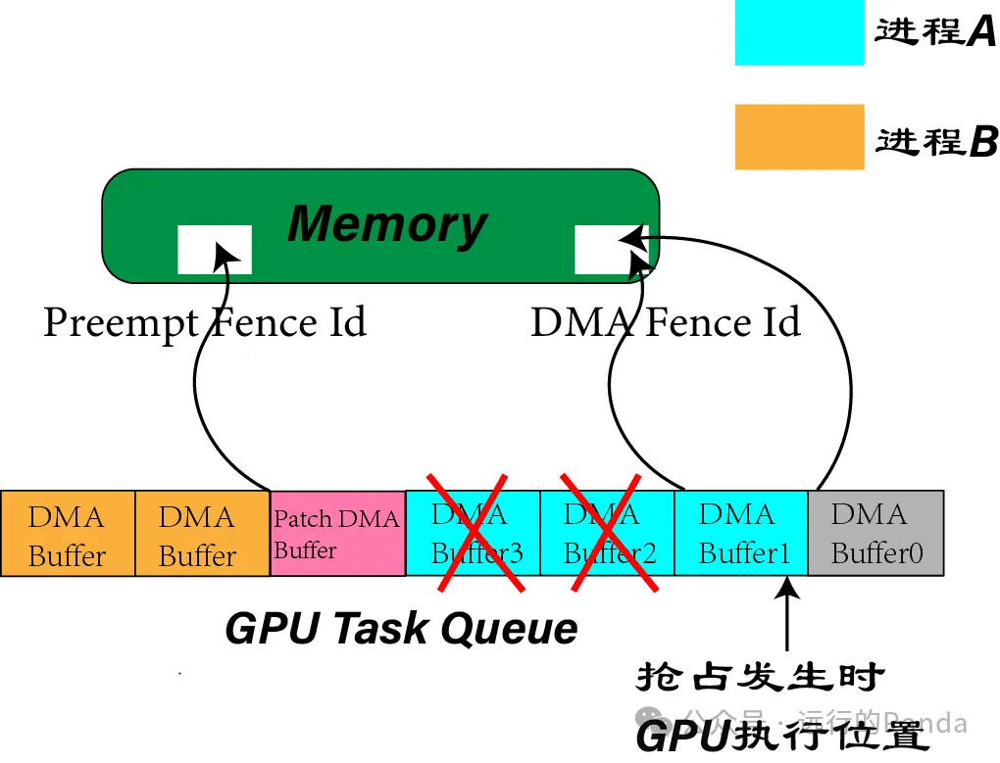

Dxgk这边，他在给KMD发抢占命令后，会发一个Patch DMA Buffer，里面只有一个Fence命令，上面携带者一个Preempt Fence Id，代表这是第几次发生抢占，当Dxgk被这个Preempt Fence Id中断时，说明GPU已经完成了这次抢占，这时Dxgk查看最后一个DMA Fence Id，就知道抢占发生在DMA Buffer1。后面恢复进程A时，Dxgk将重发DMA Buffer1，DMA Buffer2和DMA Buffer3。

**提交Command Buffer**

在前面介绍UMD的时候，我们说到，UMD在Runtime的调度下，追踪着Device创建的每个Resource，并把状态的配置和渲染操作转化为GPU可识别并执行的硬件命令。这些命令会被写入到Command Buffer里，当UMD觉得有必要时，他就会向Runtime发起一次Command Buffer的提交。

关于Command Buffer的提交，UMD遵从的理念是：**非必要不提交**。这个很好理解，当我们寄快递的时候，如果一个包裹就能装上，我们肯定不愿意用两个。拆成多个包裹可能会引入额外代价，对于每一次提交，通常都需要在头尾加上初始和收尾工作，相邻提交之间可能会引入状态切换。

那么什么情况才算有必要呢？我们把UMD想象成一个做外卖的厨子，他的工作是不停地做菜，做好的每份外卖都会被装到一个叫Command Buffer的包裹里。这天，外卖骑手已经守候多时，但UMD迟迟不发货，直到出现下面这4种情况——

- Command Buffer满了

  这是最常见的情况，UMD会把当前包裹发出去，然后再换个空的包裹继续工作。

- Runtime调用Flush

  这种情况很少见：骑手小哥施加压力，让现在就发货。

- Runtime调用Lock (Map一个Resouce让CPU访问）

  店小二告诉他，现在需要锁下帐，统计下某款新品上个月的销售状况。所以要先把包裹发出去，等统计完了再继续工作。

- Runtime调用Present

  这次店小二告诉他菜齐了，今天的订单都完成了，可以发货下班了。

当UMD发货后，Command Buffer会被提交到Dxgk这边签到。然后排队办手续，走流程，进军内核圈：

- 首先，Command Buffer是在用户模式下分配的，隶属于UMD和应用，它们不能被GPU直接访问。为此，显存管理器会指示KMD会在内核模式下分配一个DMA Buffer，把Command Buffer的内容通过拷贝给收编到DMA Buffer里。在收编前KMD会审查这些Command，比如，检查是否有命令对Memory的访问越界。

- 接着，Dxgk会指示KMD创建一个**Paging Buffer**，并在Paging Buffer里插入一些GPU命令，用于**把位于主存的、被DMA Buffer所引用的显存资源给搬运到显存**。也许你把加粗的字品读了三遍了，但还是没懂它在说啥。

  黑人问号.JPG

  其实翻译过来就是显存家有几只鸭子跑到主存家玩去了，现在明天要办宴席需要它们，赶紧赶它们回家。养鸭千日，用在一时嘛。

  但问题是显存家的鸭子为什么能跑到主存家去呢？这其实是WDDM（Windows Display Driver Model）的玩法，它允许显存家养鸭子的数量超过床位的数量。超过的那部分鸭子会寄存到主存家里（主存是大户，床位多）。平常没事的时候，这些鸭子在哪都无所谓，但如果有个宴席点名道姓要谁谁谁，就会出现前面让黑人小哥困惑的那一幕。

  然后新的问题出现了，当GPU把谁谁谁赶回显存家的时候，发现床位不够怎么办。这个好办，先随便找几只跟宴席无关的鸭子，把它们赶到主存家去，腾出空位。然后再让GPU把谁谁谁赶回来。

  赶鸭子的命令在整个业界是统一的，叫做MDC，全称是Move Duck Command，这个名字背后有一段故事，咳咳，嗯……算了，实在编不下去了，其实这条命令叫**Blit**，搬运的意思。给出Source和Dest两个Memory地址以及数据大小，GPU会帮你把Source data搬运到Dest位置。

完成这些后，整个收编工作就正式结束了。但还有一个问题——DMA Buffer里所用到的Allocation都是虚拟地址，貌似不能给GPU直接用？

**要看WDDM的版本**。WDDM v1不行，WDDM v2可以。

- WDDM v1不支持虚拟地址空间，Allocation对于UMD来说是一个Handle，UMD需要记录一个Allocation列表，KMD需要给列表里所有Allocation分配物理地址。
- WDDM v2支持虚拟地址空间，KMD只给虚拟地址和进程Id，GPU的MMU（Memory Management Unit）模块会根据进程的页表把虚拟地址转化成物理地址。

Dxgk开始把Paging Buffer和DMA Buffer提交给KMD。Paging Buffer可以认为是一种特殊的DMA Buffer，它必须走在前面，因为执行普通DMA Buffer之前，必须要保证所有显存资源都位于显存里。

KMD从Dxgk那里接手的是什么？是DMA Buffer。没错，更准确地说是DMA Buffer的地址。那么KMD要做什么？他要把DMA Buffer里的命令读出来，然后一个个推送给GPU？

答案是No。KMD跟GPU的通信是MMIO方式，带宽一般很小，不适合传送大量命令。否则KMD会被绑住干不了其他活，而GPU也会一直挨饿。所以，传数据是不可能传数据的。KMD的处理是把每个DMA Buffer转化成一个命令，就叫**DMA命令**好了。DMA命令携带着DMA Buffer的地址和大小，GPU每收到一个DMA命令，就由Memory Engine发起一次读请求，拉取DMA Buffer里的所有命令。这时走的是常规的PCIe接口，路会宽不少。

**CPU-GPU的通信**

好了，经过了这么多的铺垫，主角终于登场了。到了这里，需要指出的是，作为打工人GPU虽然优秀，但不完美。他深度社恐，习惯居家办公，并且不习惯主管（KMD）当面给他派活。好在主管唯才是用，不拘一格，专门为GPU打造了一套无接触通信方案。这套方案是这样的：

- 主管在主存里头租了一个小仓库(**Ring Buffer**)，用于**存放GPU实际需要处理的****硬件命令**。所有任务的命令将会在仓库里按顺序、紧挨着依次放置。
- GPU在家门口摆放了4个通信用的**MMIO寄存器**，这些寄存器记录着Ring Buffer的2个静态信息：**地址和大小**。以及2个动态指针：**tail和head**。
- 地址和大小是指Ring Buffer在主存分配到的地址和容量。当仓库分配完毕后，主管会把这两个信息填到MMIO寄存器中。
- Tail指向下一个待布置任务的起始位置（这是一个空位）。主管每次布置好新任务，会更新MMIO寄存器里的tail。
- Head指向下一个待执行任务的起始位置（也就是下一个任务的第一条指令），初始值是0。GPU利用仓库的地址、head和tail定位任务在主存的地址区间从而获取命令。每当完成一个任务，GPU会更新head。

如果你是名程序员，你应该老早就知道Ring Buffer是个队列并且秒懂了这套方案。如果你不是并且这会还有点云里雾里，别急，再看看下面这个例子，Ring Buffer的容量为8。

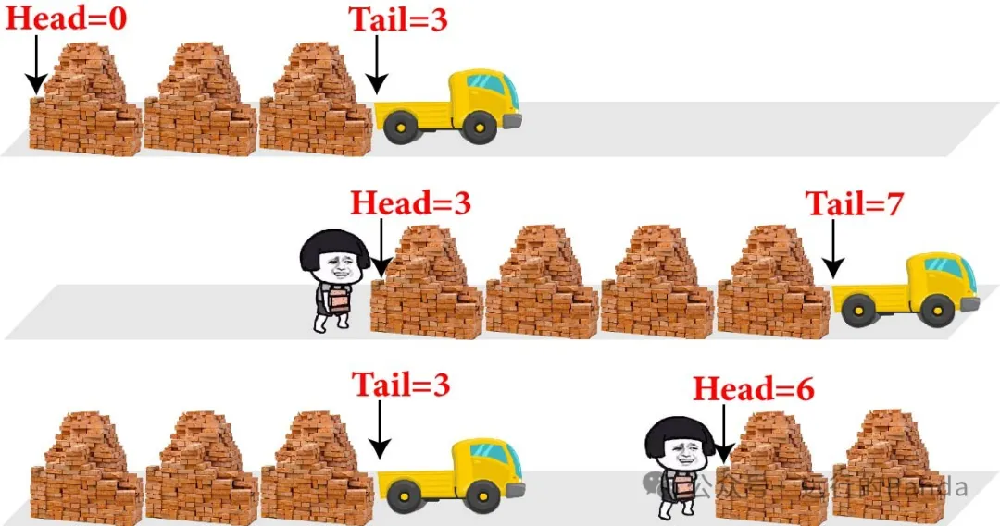

- 主管第一次布置了3个任务，这时Tail被更新为3。
- GPU闪亮登场，一鼓作气把3个任务都给完成，Head被更新为3。与此同时，主管又卸下4个任务，Tail来到了7。
- 然后GPU发挥稳定，继续完成了3个任务，Head来到了6。主管继续布置了4个任务，Tail经历了循环走到了3。

可以看到，Ring Buffer在结构上是首位相接的，也就是一个环（懂了，这就是人家姓Ring的原因）。根据队列的特点，只要队列不空（head不等于tail），GPU就会一直干下去。如果队列满了（tail+1等于head），KMD只能停止派活。

**总结**

- 应用通过API实现渲染的需求，API主要做两件事：创建资源，操控渲染。
- Runtime负责协调完成Device和Resouce的创建，并初步编译Shader
- UMD把高层级的状态和操作转化成硬件命令，如寄存器配置命令，Draw。
- Dxgk和KMD配合实现硬件初始化，显存管理，GPU任务启动和调度等底层工作。
- KMD通过一个轻量级的Ring Buffer队列给GPU布置任务，重量级的DMA Buffer通过DMA命令让GPU自取。

本文介绍过的硬件命令：

| **命令**   | **描述**                           |
| ---------- | ---------------------------------- |
| 寄存器配置 | 把状态值推送到某个模块的寄存器上   |
| Blit       | 可用于在主存和显存之间搬运Resource |
| Fence      | 用于跟踪DMA Buffer是否已完成执行   |

写这篇文章的时候发现了WDDM的水太深了，还是有很多没理解的地方。如果你就着其中某个点给我提问题，我还真不一定答得上。毕竟我不是Driver部的，隔行如隔山嘛。当然，我也不是OS部的，我是Arch部的。

