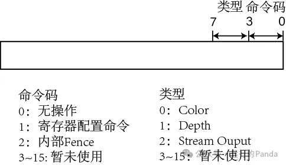

# Unveil GPU-2 GPU的命令解析模块

上一篇文章发出后，有童鞋在后台私信表示持续关注。诚惶诚恐，我轻答一声谢谢，生怕暴露心中窃喜，跟自己的内敛不搭。在这里也说明两点：第一，我会沿着pipeline一直写下去，这也是我上篇文章开头就提过的初衷。第二，由于是利用工作外的时间写的，更新频率可能有所起伏。比如接下来会比较忙，下一篇可能会比较迟。但只要有时间，就尽量多写写。

好了，回归正题。在[上一篇文章](https://mp.weixin.qq.com/s?__biz=MzkxMDY0OTkzOQ==&mid=2247483773&idx=1&sn=192bf719a8a8af429b44bc3e83a9ad6b&chksm=c1297e41f65ef757c81facb24915898263d1a7765c7b448422f9b6ee93b9cd99cf425cc1c9bf&scene=21#wechat_redirect)中，我们了解了GPU的工作环境，知道了OS和Driver如何协作，把应用的API操作转化成GPU可识别的命令。从本篇文章开始，我们将慢慢拉开帷幕，一起看看登上舞台中央的GPU如何工作。

**命令解析模块**

GPU是一个大型状态机，驱动这个机器运转的原始动力是KMD为他准备的Ring Buffer和tail指针，或者说，是Ring Buffer中的命令。所以不难推测，当我们揭开GPU的面纱时，龙头位置必然是一个**命令解析模块**，而命令解析模块的第一项工作必然是读取命令。

**读取命令**

首先我得把一个隐式的假定搬上台面，那就是——**我在讲的是独显**。之所以要说明，是因为显存这个概念在独显跟集显两个语义下是有本质区别的。独显的显存是独立的存储，会跟GPU放一块，是货真价实的GPU存储。而集显的显存通常是从主存划出一片地址来模拟，本质还是CPU存储。比如我的笔记本上，同时有Intel的集显和NVIDIA的独显，其中集显的主存是16253M，显存是128M，这128M其实也是CPU存储。

不知道你还有没有印象，在上篇文章中，Ring Buffer是放在主存中的。那是不是也可以放到显存中？显存的容量虽然不及主存，但他也有自己的优势：首先，显存的纸面带宽完胜主存，而且从GPU的角度看，访问主存还要受制于PCIe的带宽。其次，显存距离GPU更近。虽然显存的纸面延迟可能高于主存，但GPU访问主存还要沿着母板到车站坐一班PCIe列车，那可是千山万水。

Intel® Core™ i7-11800H CPU + NVIDIA GeForce RTX 3050 Ti Laptop GPU

|      | **主存**  | **显存 ** |
| ---- | --------- | --------- |
| 容量 | 16253 MB  | 3978 MB   |
| 带宽 | 51.2 GB/s | 192 GB/s  |

虽然把显存猛夸了一顿，但你看到了，是站在GPU的角度夸的，多少有点情人眼里出西施的意思。我们来换位思考下，想象我们在拍谍战剧。CPU扮演的间谍（代号雪狐）深入到延安内部，偷偷摸摸收集情报。他大概每天收集一份材料，他准备了一个文件袋，打算装满100份材料后就发电报喊重庆那边GPU扮演的同伙（代号黑豹）一次性取走袋子。那么，只要导演脑子没被驴踢了，这个袋子肯定要放在延安而不是重庆。为什么？交通成本低嘛。

所以一个资源放哪合适要综合考虑CPU和GPU的访问模式。而Ring Buffer是什么模式？Ring Buffer是最高级机密，它属于一写一读，阅后即焚模式，太Low，应该是双向奔赴模式。无论它放哪，雪狐写和黑豹读所走的路程之和（也就是交通报销）相差不大。

这种模式下，Ring Buffer要放菜鸟驿站还是放GPU家门口，就取决于CPU的个人爱好了。但不管Ring Buffer放在哪，命令解析模块其实并不关心。他要做的，是拿Ring Buffer的Memory（主存或显存无所谓）地址，加上当前的Head指针偏移量，然后向MAC（Memory Access Control，内存访问控制）模块发送一次Read请求。

在到达MAC之前，通常他还需要先经过一个HUB，在这里，这个Read请求会跟来自其他模块的请求形成竞争，它需要经过仲裁器的盖章许可后才能继续前进。然后来到L2 Cache（作为阅后即焚的数据，Ring Buffer其实没有所谓的Cache功能，在这一块应该可以作为VIP走便捷通道），在里面做一次命中测试，如果命中（Hit），说明请求数据在L2 Cache有备份，可以直接把数据拉出来。如果不命中（Miss），那么这个请求就走到MAC。MAC会利用MMU把请求的VA转换成PA，然后向显存或主存的控制单元发起Read请求。接着就是漫长的等待……

三年？御弟哥哥，在耗时预测方面你恐怕还只是个弟弟。但无论如何总算是回来了。High five！轻舟已过万重山，根据需要，这些数据可能会在L2 Cache里留存一份，然后原路返回（如果是压缩数据，还需要先解压），最后被存到命令解析模块内的Buffer里。

注意，这个Buffer跟之前出现过的Buffer是有区别的。我们之前提到过的DMA Buffer，Ring Buffer和Vertex Buffer，都位于Memory中，而命令解析模块用来存储命令的Buffer，显然是on-chip介质。实际上，Buffer指的并非介质类型，而是一种存储行为：hold住数据直到数据的生命周期结束被释放。

硬件中常见的三种存储介质：flip-flop，SRAM和DRAM都可以用来充当Buffer。既然走到这里了，不妨稍作停留，登门拜访下他们好了：

flip-flop是口碑最好的，装个MUX设备，无论你一次要多少行数据，他都会当天拉给你。但是贵得离谱，一般适用于精英阶层，特点是需求量偏小，延迟要求高，比如GPU上绝大多数寄存器和部分on-chip Buffer。

SRAM口碑低了一档，你要数据得申请，每次限申请一行，而数据要等到提交申请后的第二天才给到你。当然了，他的收费也低了一档。SRAM的主要订单来自于中产阶层。通常是需求量中等，不需要被同时获取多行的on-chip Buffer。比如，命令解析模块中用来存放命令的Buffer就属于此类。

DRAM垄断了整个庞大的低端市场，主存和显存都是他的客户。他的客户特点是需求量大，对延迟要求不高，当然也可以认为是因为买不起flip-flop和SRAM而不得不妥协。DRAM看上去有点不靠谱，比如，别人家拉数据是拷贝，他家是用剪切（不过还是会还原回去的）。另外，别人家是电在数在，而他家的数据库是电容造的，太久不访问数据会随着电压下降而丢失。所以他家需要定期做Refresh维护数据，一次维护可能要花费一年甚至更久的时间。即便抛开Refresh不说，他家拉数据的效率也是不忍直视。

在逻辑和物理上，DRAM可以被看作一个二维网格或矩阵。读取DRAM的某块数据需要经历两个步骤：先在网格中读一行，然后行中取列。其中，行号和列号由一个叫内存控制器的单元根据访问地址解析得出。在读取DRAM数据的过程中，主要有3种延迟：tRCD，tCAS和tRP。

- tRCD (RAS to CAS Delay)

  tRCD可以大致理解为打开一行数据的时间。这里的RA和CA分别是Row Address和Column Address。内存控制器先发读行指令(RA)，然后要**至少**等待tRCD的时间后才能接着发读列指令(CA)。

- tCAS (Column Address Strobe)

  这是从内存控制器发出读列指令到它接收到第一笔数据间的**准确**延迟。

- tRP (Row Precharge)

  tRP是预充电时间，可以理解为关闭一行数据的时间，等于tRCD。内存控制器发出关闭指令后，**至少**要等tRP之后才能发出新的读行指令。

简单地说，tRCD是打开一行的延迟，tCAS是从这一行读列数据的延迟，tRP是关闭一行的延迟。另外还有一个跟这三个延迟有重叠的参数——tRAS，它表示一行数据的打开状态至少要保持多久。通常内存的延迟指标会通过tCAS-tRCD-tRP-tRAS时序来衡量，比如我机器上的内存时序是22天-22天-22天-52天，够拉跨吧。

**模块结构**

每当命令解析模块的Buffer里有了新情报，枕戈待旦的特工部门就开始工作。特工部门的职务很明确：识别每个硬件命令，然后

- 对于专属他的命令，他会自己处理掉。
- 对于专属某个下游模块的命令，他会Bypass下去。
- 对于全局命令，他将驱动下游相关模块一同执行命令对应的任务。

既然叫特工部门了，那么多少有些神秘，我们不知道它具体的内部结构：这是个组合，还是团体，又或是个人？

从流程的角度看，GPU各个功能的设计并没有什么高大上之处。无非就是纸面设计->写代码->验证/修正功能->验证/改进性能。我们不妨延续之前的山寨精神做下推演，假设最开始时特工部门只有一个光杆司令——**解析器**。解析器没助手没跟班。他质疑过人事部为什么不多铺些人力，但人事部的回应很坚定：用人是需要成本的，不是请不起，而是追求性价比。总之，请人需要一个充分的理由，比如遇到性能瓶颈。

于是解析器只能势单力薄地完成个人职业生涯首秀——执行一帧渲染。结果，这一趟走下来他还真的碰到了性能问题，而且还是捉襟见肘那种。

解析器发现了某些命令，比如DMA，Draw和Restore，都有一个讨人厌的行为：它们需要先从Memory读取数据，然后还要等数据返回之后才能完成解析和执行。

我们给这种命令起个名字，就叫**带Read命令**好了。每当解析器遇到一个带Read命令，他大概率需要等待几百个cycle才能继续工作。而相比之下，解析本身只需要几个到十几个cycle。同时，在第一笔数据返回后，虽然接着数据会源源不断，但潜在的卡顿也是有的。因为Read的带宽也有可能跟不上解析器的消耗。这些都会导致解析器的考勤状态出现一个个貌似摸鱼的bubble。

在这些bubble中，最严重的当数DMA命令，因为DMA Buffer容载量很大，而且通常都是满载命令的。如果就让解析器穿这身破烂的衣裳，孤身走暗巷，势必走走停停，五步一小泡，十步一大泡（可能有些童鞋没玩过这个游戏，稍微解释下，僵尸干掉坚果需要不少时间，而干掉高坚果需要更多时间）：

你可能也发现了，导演玩的谍战剧带有恐怖元素。但这并不重要，重要的是该如何有效减少这些bubble？

首先，解析命令就像拆盲盒一样，没规律，没套路，打开了才知道是巧克力糖还是卡通玩具。所以不可能通过预测提前Read。其次，硬件命令顺序大致来源于API的顺序，绝大多数情况下，命令必须被解析器按顺序执行。如果解析器遇到带Read命令时不愿意等，想先去处理后面的命令，那么他能做的也仅仅是为那些带Read命令发送Read请求，但不能执行那些命令本身。

这么说解析器得来一场折返跑，第一次解析的时候为所有带Read命令发Read请求，接着回到起点，正式执行每条命令，到这个时候几百个cycle都过去了，这下不就没人误会他摸鱼了？

简单是简单，但你在跑第一遍过程中，有些Read请求的数据已经回来了，但命令却没人去执行，这仅仅是把考勤状态调整成上午摸鱼，下午干活而已，bubble还是很严重。还有，你在跑第一遍的时候点了这么多快递包裹却不处理，你确定你们部门放得下？

那是不是可以改成分段折返跑？包裹放满往回跑？行啦行啦，别折腾了。是时候放弃孤勇者思维了。其实我们已经有了充分理由，可以喊人事部招人了。在流水线里如果某项工作依赖的数据来自Memory，那就需要尽可能提前发送Read请求，尽最大努力去减少工作时的等待时间，这个叫做**预取**。**有条件预取就预取，没条件的话就创造条件**。

对于每一个带Read命令，它理论上的最早预取时机是什么？是命令本身刚被读到GPU的时候。但作为唯一能识别命令的解析器，通常这个时候都在忙于更早之前的命令，实在无暇远顾。所以，很明显，特工部门需要一个助手——**预取器**来创造更早（即便不是理论最早）的预取时机。预取器的段位是橄榄球僵尸，他转行当特工前是个运动员。特点是跑得快，因为他只需要拆开每个盲盒看看是否为带Read命令，是的话就发送Read请求，否则就继续拆下一个。他不需要深度解析命令，更不需要花时间去执行命令。

我们把预取器拉到特工部门的群聊里，再试下跑第二轮，看看这个双子星组合能否扭转战局。这次，当蹒跚的解析器刚走几步，预取器已经到达DMA命令并发送了Read请求：

这一轮跑下来，预取器立下了不小的功劳。他很有效地缩短了整体的Read等待时间，HR猛夸这个用人成本花得值。但整体效果吧却只能算差强人意，因为DMA命令（高坚果）太烧时间了，预取器相对于解析器的快发优势一不小心就被耗尽，bubble还是有不少。

既然一个预取器解决不了问题，那就继续引进人才，尝试用两个好了。在第三轮沙盘演练，我们打一场配合战——把预取器A的作战范围限制在Ring Buffer上，而且专为DMA命令预取数据。而另一边，让预取器B一直走在解析器前头替他扫路，负责为带Read的非DMA命令做预取。

从这一轮的战果看，虽然最终解析器还算不上所向披靡，但bubble应该可以被按压到一个可以接受的水平。

那么，这个铁三角组合是否就是特工部门的通用结构？

这个不一定。铁三角是我们依据假定的作战环境推演出来的，但不同GPU的环境可能有所差异。比如，除了DMA之外可能还有别的命令也会带来大bubble。另外，随着GPU支持feature的演变，战场地形也可能变得复杂。

**新型战场1：二级Command Buffer**

Direct3D 12有两种命令支持在DMA Buffer上再次从一个Memory buffer里抓取命令：Bundle和Execute Indirect。

- Bundle在API层面是指二级command list。它的作用是把少量的API打包起来方便多次调用。而从解析器的角度看，Bundle命令是DMA Buffer上的DMA命令。
- Execute Indirect则是定义了一个Draw模板。Draw模板通常由若干Root Signature类型（指定Vertex Buffer，Index Buffer等资源）和操作类型（如Draw和Draw Index）构成。Draw模板并不是实际命令，它更像是一些函数定义，还需要参数来驱动执行。而这些参数则是被放到一个buffer里。Execute Indirect还支持Draw模板执行多次，每次使用不同的参数。

**新\**型\**战场2：\**虚拟GPU\****

如果GPU支持虚拟化，拆盒小组还需要穿梭于多个战场之间作战。比如支持SR-IOV（Single Root I/O Virtualization）的Client设备可通过虚拟机接入到PCIe VF（Virtual Function，可理解为虚拟网络适配器）。当多个虚拟机同时接入VF时，Hypervisor负责调度这些虚拟机去共享物理网络适配器。在GPU看来，有多个CPU使用各自的Ring Buffer在轮流着给他派活，所以拆盒小组也相应地轮流在每个Ring Buffer上解析和执行命令：

虚拟化涉及的范围比较广，从网络层一直到底层硬件，在GPU内部还涉及到L2 Cache和MAC，在这里就不展开了。还是那句话，抓大放小，你懂的。对于命令解析模块来而言，最有意思的地方在于：他既要支持单个虚拟机内不同进程的抢占，又要支持不同虚拟机之间的抢占。

**新\**型\**战场3：High/Low Priority**

有的GPU含有一个高优先级Ring Buffer和一个低优先级Ring Buffer。其中高优先级Ring Buffer为系统软件渲染专用，而低优先级Ring Buffer则用来处理普通的渲染和通用计算。这种情况比较简单，图就不贴了。同样，这里也需要支持不同Ring Buffer之间的抢占。

**新\**型\**战场4：Multiple \**Engines\****

有些GPU不止3D一个Engine，比如通过任务管理器可以看到，我机器上的GPU有4个Engine。这些Engine很可能拥有独立的Ring Buffer，相应地，会有独立的拆盒小组负责解析各自的Ring Buffer。

列举了这么多，其实只是想表达一个意思：模块的逻辑功能很好确定，但具体结构很大程度上是被动调整出来的。即使你帅如诸葛，才比周瑜，谈笑间就把所有情况了然于胸，也很难免以后不会踩到别的坑。

比如，哪一天下游模块应需求加强了实力，每天都健身锻炼，胃口饭量大得不要不要的，即使命令解析模块不间断喂饭也喂不饱。这个时候，就可能要考虑下加大读命令的带宽，并启用更多的解析器/预取器。相反，如果下游模块食量变少了，那命令解析模块可以适当裁员节约成本。

说到这，让我想起GPU架构工程师容易落入的一个误区，我也曾深受其害。吾尝终日不食，终夜不寝，以改，无益，不如测也。白话文意思是我曾经费尽心思改某个模块的逻辑，企图提高出门的throughput，但还没干到一半就被硬件痛揍一顿说瞎搞。确实是在瞎搞，因为下游没喊饿，去改一个非bottleneck的上游模块，整体性能没提高，还可能引入bug，有这时间不如多测测功能和性能。

**模块实体**

在前面讨论模块结构的时候，我做了一个隐形的假定：这个模块是硬件实体（Fixed Function）。也就是说，解析器和预取器是并行运作的电路。关于固定功能和可编程功能各自的优劣，我在上一篇文章也有提到。像命令解析模块这样庞大的逻辑组织，如果功能扩展需求不高的话，那么使用硬件实体是最好的选择。然后留一部分寄存器，通过配置它们控制一些逻辑行为来提高灵活度。

但是，命令解析模块的地理位置太特殊了，他是CPU通往GPU硬件的咽喉要道。而CPU背后的隐藏大佬可能是……甲方。

我们在前面看到了，命令解析器面临的战场是多样化的。当GPU的商业成熟后，甲方需求的多样性可能会超出寄存器的控制范围。导演是受过专业训练的，一般不会吐槽甲方，除非……忍不住也得忍。所以，导演只能放弃基于硬件的实景拍摄，改成特效制作了。也就是说，把命令解析模块的实体转变为可编程功能。由于命令解析模块排在处理器前面，处理器的资源他用不上，所以通常会使用独立的微处理器（比如RISC-V或者MCU）作为实体。

改用CPU作为实体后，模块结构也自然会有变化。比如解析器和预取器会变成线程，而从Memory返回来的指令将会进入到CPU的存储体系中。但无论是什么实体，所要追求的效果是一致的，就是尽可能地：对上不挡，对下管饱，bubble要少，性价比高。

**几种命令**

战争是残酷的，但盲盒里的命令组合起来能够渲染出一个新世界。每一种命令都有他的故事，但篇幅有限，我不可能对他们一一做专访，这里暂且只挑几种来认识，来日方长。

**内部Fence和Wait\**命令\****

在讲述这两个命令之前，我们要弄清楚两个概念：同步和异步。这是在通信的两个主体中，请求方对响应方采取的两种不同策略。
比如我现在正在下（吃）馆（沙）子（县），刚找服务员点了一些菜。这个时候，我不需要等服务员响应（上菜）就可以继续加菜，加个炒粉、炒面、小馄饨啥的， 这就是异步。另一种情况是，我要拍美食照发圈，然后根据点赞个数加菜，这个时候我需要等服务员响应，这就是同步。简而言之，**异步就是****直接加菜，\**同步就是\**等，\**等，\*\*等\*\**\*上菜发圈后再加菜**。

我们在上篇文章中提到了Fence命令，它所触发的CPU中断就是一种响应，这个响应告诉CPU对应的DMA Buffer已经被GPU完成。CPU借此实现了它和GPU之间关于某个DMA Buffer的同步。
但生活不止CPU和GPU之间的同步，还有GPU内部的同步。因为在DMA Buffer内部，会存在命令之间的依赖。比如我们用Blit命令把一张texture upload到显存，而后面跟着的Draw要在shader里采样这张texture，那么这个Draw就依赖Blit的结果，同样需要同步。

GPU内部的同步，本质就是后来命令和前行命令之间的RAW（Read After Write）问题。也就是说，这是一种针对Resource的同步。有些童鞋可能会问：那渲染命令和设置状态寄存器之间是否也需要同步？

有可能需要，但那种情况非常少见，你可以不关心它。

首先，所有模块都是按顺序执行命令流的，所以每个模块内部的渲染命令和状态设置命令之间是天然同步的，不需要操心。其次，一个模块**一般**不会依赖其他模块的状态寄存器（如果出现这种情况，可以把那个寄存器在需要的模块里多定义一份）。最后，就是我要说的特殊情况。GPU可能会有很少量的全局寄存器，这些全局寄存器只在某个中央模块定义一份，然后通过拉线的方式让需要它们的模块访问。通常在上电后这些寄存器被设置一次后就不会再改了，但也吃不准。万一哪天CPU迫不得已要改它们，就需要做同步，要先保证前面使用到这些寄存器的所有操作都执行完毕了才能改。而这种同步通常是通过drain pipe（这个概念后面有解释）操作完成的。

DMA Buffer内部的同步，可以通过类似之前的Fence命令来实现。为了区分，我们把之前DMA尾巴的Fence命令叫**外部Fence**，把DMA Buffer内部的Fence叫**内部Fence**。

抱歉，我的戏瘾又犯了。某一天，CPU给GPU下了一条命令让他撰写最新战况情报然后快递到VM（Video Memory）情报局。同时CPU知道，领导明天会去情报局查阅这份资料。于是CPU在战况命令的尾巴**后**贴了一个单号（内部Fence），用来追踪情报状态。

我们翻开上面的军事地图分析下，MAC收到情报后会转发给VM情报局。同时他会撕下尾巴上的内部Fence，把回执单号快递给命令解析模块（也可以是其他模块，具体看想要在哪个地方做同步。一般来说，在命令解析模块同步是最简单的）。这份快递**能否第二天到达不好说**，因为MAC的小哥叫薛定谔，他可能用顺丰也可能用邮政。但一旦到达了，命令解析模块会把回执单号存放到本地寄存器里。然后这两个命令的处理就结束了，一切变得风平浪静。

**第二天**，领导想直奔VM情报局查阅这份情报，但被CPU拦住了，CPU塞给他一个等待单号（Wait命令）：领导，您先到命令解析模块那里喝口茶，顺便盯着寄存器，等看到您的号码了再去VM情报局，不然可能白走一趟。领导拍了拍CPU的肩膀说：还是小C考虑周到，于是把等待单号挂在胸**前**上路了。如果回执单号比领导早到，那么领导就直接南下。否则领导会一屁股坐门口，把后面的其他命令一并堵死。

内部Fence这个命令，我觉得能处。来吧来吧，把命令码拉出来，我们重操山寨旧业，给他安排一个二号位。另外，GPU内部其实有多个战况小组会向VM情报局寄数据。比如ROP模块会写Color和Depth，Stream Output会写vertex数据。对于不同情报，回执单号所走的路径是不一样的，有些回执单号其实走到L2 Cache就可以撕下了。所以我们需要区分情报的类型。这个Field我用了4 bit，这样最多支持16种情报。对应地，命令解析器也需要准备16个寄存器。OK，内部Fence命令的头部长这个样子（后面跟着一个Dword的单号）：

至于Wait命令，它跟内部Fence很相似，同样含有类型和一个单号。但Wait还有一个问题：领导不一定每份情报都有空跑去看。也就是说，Fence和Wait不一定会成对出现。比如领导前天（3月3日）本来想去看Color情报的，但一直忙到了今天（3月5日）才有时间。他拿着一张3月3日的等待单号，发现寄存器里的最新回执单号是3月5日。如果领导是人类，那肯定晓得：既然3月5日的情报都到了，那么3月3日肯定也到了嘛。但其实领导不过是个查阅命令罢了，你得通过Wait命令告诉他换种等法：如果回执单号>=等待单号，就算等到了。所以，Wait命令的头部上还要多加1 bit：比较方式，根据需要填等于或者大于等于。

有些时候，CPU可能会嫌GPU太闹腾，想让GPU安静下来后给他讲讲道理。那么CPU可以把所有类型的内部Fence和Wait命令都下一遍。这一套组合拳打完后，整个世界就都安静下来了，我们管这个叫drain pipe，把流水线里的水排干，全都灌进情报局里。

好了，关于内部Fence和Wait的介绍就到这了。花了这么大的篇幅，是因为这哥俩真的太特殊了。Driver处理他俩的时候稍有差池，墨菲定律会就会光速生效——一般是领导拿错情报，贻误战机。严重的话，GPU可能会成为大明湖畔的第二个夏雨荷：

不过，倒也用不着等一辈子这么久，君不见Dxgk已经揎拳捋袖，磨刀霍霍，TDR机制马上就要启动了（可以参考上篇文章）。

**DMA命令**

关于DMA命令的故事你已经听很多了。我补充一点别的故事，想到哪说哪。

首先有一点是，KMD是DMA Buffer的派送员，原则上他是可以拆开包裹塞点私货进去的，估计UMD也可以。我犹豫了很久才决定说出来的，不知道快递公司会不会盯上我……不过也不用紧张，不算什么丑闻，Driver无非就是加点状态设置或者同步操作啥的。

然后我们之前提到，Ring Buffer没有在L2 Cache命中的概念，而DMA是有的。在API层面，一个Command List可以被重复调用，所以DMA命令也可能重复。

另外，Driver可能会使用私家DMA。私家DMA一般用来打包一些特定操作，比如upload（把主存资源搬到显存）。Upload操作有点像你每天上下班时在电梯里按楼层按钮，属于重复动作。

**Predicate命令**

假设在某个虚拟空间里，你去城隍庙看庙会，那里有一条龙，艺术价值很高，大概有四五层楼那么高吧。这条龙由上万个三角形组成，你做了上万个三角形的渲染，还没来得及欣赏，发现两个路过的小哥抬着块木板把你的视线挡住：这位冤大头，不好意思，借过下。

你也意识到浪费资源，argue说应该禁用画家算法，要先画挡板再画龙，这样龙就不会做pixel shading。但即便这么做，这上万个三角形的在被depth kill之前的各种工作，比如vertex shading，triangle setup以及光栅化还是逃不掉。

这种情况是通过predicate（这是Direct3D叫法，OpenGL叫Conditional Rener）来优化的，大概流程是：

- 开启Query，把当前Pass Z Test计数器的数值保存到Memory。
- 把龙的包围盒画一遍，最理想的包围盒是个长方体，是由8个Vertex组成的12个三角形。
- 结束Query，再次把当前Pass Z Test计数器的数值保存到Memory。
- 开启Predicate渲染，让命令解析模块检查之前两个数值是否相等，如果相等，说明整个包围盒都被遮挡，那么就开启六亲不认模式。
- 画复杂的龙，解析器如果六亲不认，则会把Draw命令丢掉，否则正常执行。

**Draw命令**

拆了这么久的盲盒，终于拆到王炸了——Draw。Draw是一个贯穿整条GPU pipeline的命令，如果不考虑现在尚未普及的Ray Tracing，那么Draw绝对称得上是命令之王，Dispatch见了他都得叫声大哥大。这是一个深不可测的男人，一个让我追随了十年的男人。在以后的文章里我们将看到，他如同长江般的，主线奔流到海，一泻千里。支线时而分散时而汇聚。他在层层Shader里浴血厮杀，在Setup汇为大纵队，在Raster形成小编组。然后躲过ZKill两层暗箭，披上Texture战袍，会师于Blending，最后驻军于L1/L2两层Cache。等待号令，兵发RT（Render Target），完成使命。

感觉我入戏有点深了，中场休息，洗把脸清醒下。

回来了，说到哪了……Draw是干什么的？现实生活中是用画笔去勾勒去上色。GPU干的也差不多，但他是以一种从Vertex到Pixel的离散形式完成的。首先你要画的实体必须以Vertex的形式展现，这通常是由3D建模者完成的，他们把实体的表面划分成很多网格小片块，这些小片块的顶点就是Vertex。所有的所有，在GPU眼里含巴兰都是一堆Vertex：

Vertex的最基本信息是它的本地坐标（通常把这个坐标叫Position），然后还可能有多个属性（Attribute），比如纹理坐标（用于采样纹理），法向量（用于光照计算）等等。这些Position和Attribute会被应用填入到Vertex Buffer（VB）里。VB的Memory地址会由CPU配置到状态寄存器，或者直接跟在Draw命令上面告诉GPU。

Draw的API其实有很多种，五花八门。这里就不做一一介绍了，我想讲的是，它们呈现出哪些Feature以及解析器如何处理这些Feature。

**VB和IB**

最普通、最老实的API——Draw会传递VertexCount和StartVertex，指定从VB的第StartVertex个位置开始，连续画VertexCount个Vertex。但这种模式会遇到问题：应用想画的Vertex在VB可能是不连续的或者是重复的。解决方法就是使用一个Index Buffer（IB），通过IB一块连续的index去索引VB。

跟这种模式配套的API叫DrawIndexed，它会传递IndexCount，StartIndex和StartVertex。CPU要把IB的地址，大小和Index格式（每个Index在IB可占8、16或32bit）告诉GPU。

**Instancing**

Draw和DrawIndex作为绝代双骄，在历史上曾霸屏多年，直到某一天发生了变故。起因是CPU检测到某一帧渲染里出现了严重的交通阻塞。经过一番调查发现，原来是一个叫彦祖的高质量男性横空出世，在一帧内，Draw(彦祖)的需求量多得像天上的星星，地上的草儿。为此，CPU和GPU不得不疲于奔命，密集而重复地upload彦祖，渲染彦祖：

过惯了朝九晚五的GPU对996很不适应，他对应用表示强烈不满：这TM不都是彦祖嘛，虽然外装发型各有不同，但Position网格千篇一律。CPU到GPU的带宽很紧张的，还要占用我们的资源帮你追星？我几十岁的人了，我不要面子啊。

双方一度剑拔弩张，还好Direct 3D大佬及时出面调解。最后各自都做出了让步，形成了一个折中的解决方案：

- 把一个彦祖称为一个Instance，VB只放一个Instance。
- 升级打造两款新的API，DrawInstanced和DrawIndexedInstanced。可指定单个Instance的Vertex/Index数量、InstanceCount和StartInstance等参数。
- 应用**只调用一次**API，命令解析模块根据InstanceCount展开成多个Instance，每个Instance的Index流完全一样，但Instance Id一直递增。
- 可指定某个或某些Attribute为Per-Instance Attribute，这种Attribute会被同一个Instance所有Vertex共用。比如我们把位置偏移作为Per-Instance Attribute，可以实现繁星散于银河的效果。
- 应用需要的西装、蓄须，光头，古装等个性化需求，将由Shader通过Instance Id或Per-Instance Attribute实现。

**Multiple Draw**

这是OpenGL的Feature，可以在一个Draw API里指定DrawCount并为每个Draw设置各自参数，比如StartVertex和VertexCount。

**DrawAuto**

在一些使用Stream Ouput的应用中，应用并不清楚Stream Ouput写出了多少Vertex。如果没有特殊的API，那么应用需要在Stream Ouput之后通过Query查询VertexCount，然后再使用这个VertexCount调用Draw。DrawAuto就是用在这种情景让应用偷懒的，调用了DrawAuto时，Driver就会指示GPU自己算出VertexCount。

**Indirect Draw Arguments**

Direct3D和OpenGL都支持把Draw API的各种参数存放在Memory中。这时解析器需要自己读取它们，这些参数包括：

- DrawCount
- VertexCountPerInstance和StartVertex
- IndexCountPerInstance和StartIndex
- InstanceCount和StartInstance

***\*解析器要做什么\****

探讨这个问题前，我们需要先知道解析器的下游——Input Assembler（IA）。IA是个炒快菜的厨师，他不喜欢抛头露面准备食材。所以凡是和Memory打交道的事，都需要解析器代劳。对于每个Draw，IA期望解析器给出预制菜：一串表示实体的index流。对于DrawIndexed家族的API，Index流从IB获得。对于其他API，Index流由本地产生：0, 1, 2…(VertexCount - 1)。

根据IA的需求，解析器处理Draw的流程大概是这样子：

- 确定DrawCount（可能来自命令或Memory，或者根据Stream Output结果算出）
- 根据DrawCount做Draw Loop
- 对于每个Draw，拉出对应参数（参数可能来自命令或Memory）
- 有了参数后，根据InstanceCount做Instance Loop
- 对于每个Instance，根据参数生成Index流提交给IA

Draw API还带有一个参数PrimitveType，表示如何去组织这些index流，但这是IA的工作，这里就不聊了。

**总结**

- Ring Buffer放在主存或显存皆可，命令解析模块根据地址读数据，他不关心该地址是主存还是显存，MAC会帮他处理。
- 从Memory读数据是高延迟操作（通常需要数百个cycle），GPU通过一个全局的L2 Cache缓解某些类型数据的延迟，比如DMA Buffer。
- 命令解析模块通过预取减少Read等待。
- 面对多样化的功能需求，命令解析模块可使用CPU实体实现灵活定制。

本文介绍过的硬件命令：

| **命令**  | **描述**                                                     |
| --------- | ------------------------------------------------------------ |
| 内部Fence | DMA Buffer内部的跟踪命令，如果内部Fence走回到同步模块（比如命令解析模块），说明Fence之前的所有写Resource操作都已全部完成 |
| Wait      | 用于在同步模块等待某个内部Fence归来，保证Wait后面的读Resource操作能取对数据 |
| Predicate | 指示GPU确定某一次渲染是否出现了Geometry全被遮挡或者Stream output overlow等情况，如果出现，GPU将直接丢弃下一次渲染命令。 |
| Draw      | 渲染实体的命令，携带实体Vertex/Index数量，Instance数量等信息，驱动整条GPU pipeline生成实体每个像素的Color或Depth。 |

好了，这场纸面上的谍战剧就到此结束了，在舞台闭幕前导演给大家安排了一个小节目。军中无以为乐，请卿小舞一曲（喜欢就给导演点个赞吧，every thumb pushes him forward）。

葡萄美酒夜光杯，欲饮琵琶马上催。醉卧沙场君莫笑，古来征战几人回。

**以往文章：**

[Unveil GPU-1 GPU的工作环境](http://mp.weixin.qq.com/s?__biz=MzkxMDY0OTkzOQ==&mid=2247483773&idx=1&sn=192bf719a8a8af429b44bc3e83a9ad6b&chksm=c1297e41f65ef757c81facb24915898263d1a7765c7b448422f9b6ee93b9cd99cf425cc1c9bf&scene=21#wechat_redirect)