# Unveil GPU-3 GPU的IA，任务分配模块

在[上篇文章](https://mp.weixin.qq.com/s?__biz=MzkxMDY0OTkzOQ==&mid=2247483998&idx=1&sn=b6b055e66929b179868be0809e45ffc6&chksm=c1297d62f65ef4748a2414994483688f1f0b04e128a17c94c386568fe01fd92038d3e80096ce&token=966758964&lang=zh_CN&scene=21#wechat_redirect)中，我们了解了命令解析模块的基本结构，并接触了Fence，Wait，Predicate和Draw等几种命令。不过，当时因为篇幅限制，Input Assembler（IA）坐了冷板凳，本篇文章将由他首发上场。

**IA模块**

由于IA的所有工作都是围绕Topology（上次我说的是PrimType，这里纠正下，叫Topology更合理些）展开的，而Topology的终点是Primitive，我先从这两个概念说起。

***\**\*\*\*Primitive\*\*\*\*\****

Primitive是光栅化（Rasterizer）的输入单位，它**从过去到现在都****只包含三种类型**：Triangle，Line和Point，这三者分别由3个、2个和1个Vertex构成。如果把每个Vertex看作一个轮子（这个比喻其实并不是很恰当，只是我个人喜欢这种驰骋感），那么光栅化应该是个穷得家徒四壁的低保青年，四个轮子及以上的他也想玩，但是实力实在不允许。

***\*Topology\****

相比Primitive，Topology要阔绰得多。接下来要讲的，就是他的发家故事，这其实也是GPU发展史的一个缩影。这段故事难免会剧透后面流水线的部分内容，不过放心，只是蜻蜓点水而已。

好，让我来开始一本正经地胡说八道。一切的一切，都得从本世纪初说起，那时电脑很慢，**XP**很糊。当时有一款风靡全国校园的桌面游戏：CS（Counter-Strike，反恐精英）。

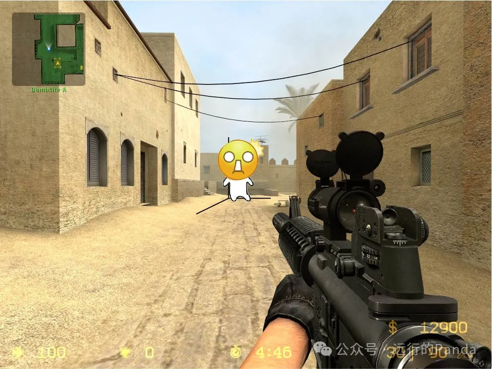

早期的CS是基于**Direct3D 7**制作的，对应那个版本的GPU还**没有用于执行Shader的处理器**，只有T&L（Transform & Lighting）电路。

后来**Direct3D 8**革命性地引入了**Vertex Shader**和**Pixel Shader**，第一次赋予了GPU可编程功能，但它用的是低级语言，而且第一版ISA还很稚嫩，给游戏开发商带来的施展空间十分有限。

转折点在**2002年**，那年出世的**Direct3D 9**支持了高级渲染语言（High Level Shading Language），帮助GPU实现了**完全可编程功能**。自此后浪滔滔，势不可挡，T&L等保守势力遭到逼宫后落寞离场。升级后的GPU产业园区长这个样子：

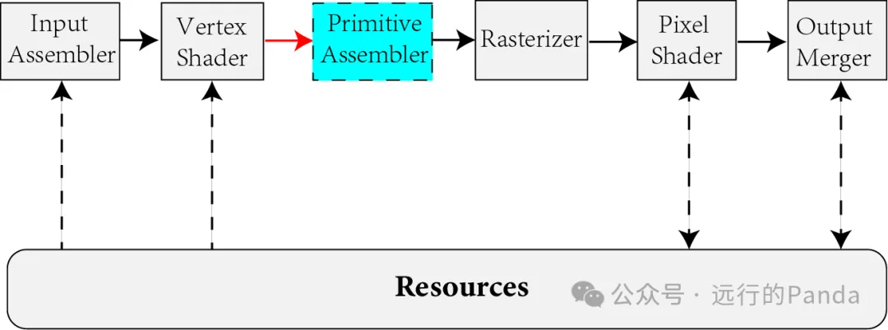

当时的Topology不过是PA（Primitive Assembler）装配厂一名默默无名的打工人。PA装配厂从Vertex Shader购入轮子，然后组装成Primitive卖给光栅化。而**Topology**的工作**是**制定**把轮子组装成Primitive的规则**。那时的Topology不过是个十四、五岁的少年郎，too young，too simple。他一开始制定的规则叫List：

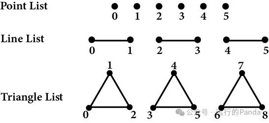

List的思想是按顺序把轮子组装成Primitive，从Vertex Shader购入的每个轮子都只被使用一次。比如Line List会把V0V1组成Primitive0，把V2V3组成Primitive1，以此类推。由于List不过是老实巴结地按1~3个轮子打包封装，PA装配厂压根赚不到油水。

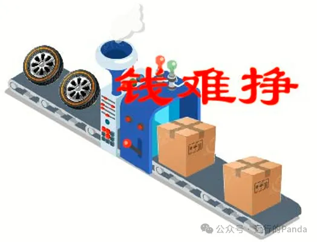

为了改变困境，Topology熬夜查看了大量订单，终于发现了一个突破口：光栅化订购的Primitive存在大量编号相同的轮子。这种情况主要发生在连续线段和网格的处理上。因为光栅化玩不了3+个轮子，所以线段和网格到他手头必须展开，重复是必然：

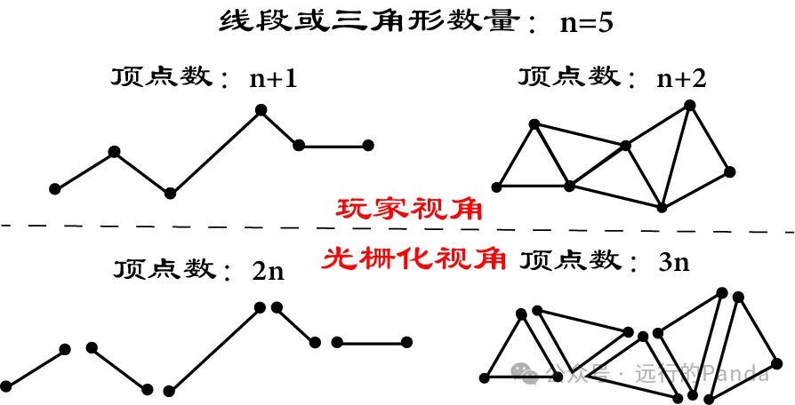

Topology看到了肥肉：如果只从Vertex Shader那里购入不重复的轮子，而重复的轮子由PA装配厂自己盗版复刻，那么就可以把成本压缩为原来的1/2（对于Line）或1/3（对于Triangle)。

当然，盗版是违法的，但它在那个年代却是个泛滥的灰色产业，很多大佬都是靠此起家。说干就干，Topology接着往他的武器库里补充了Strip系列：

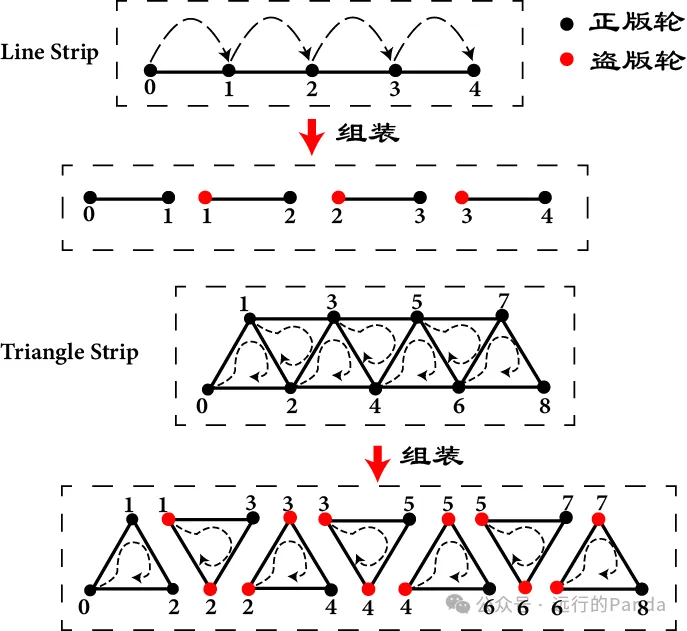

正经地说，Strip的思想，是让Vertex Buffer只存储玩家视角下的Vertex，然后在组装时复用中间那些重复的Vertex，这样能避免多余的Vertex Shading。Strip出现后，肥水滔滔，岁月静好。

一晃来到了**2006年底**，电脑开始提速，**Vista**颜值能打。那会改革开放将近30载，人民的物质文化需求日益增长。解放生产力，发展生产力是时代号召。而GPU产业园的生产效率已停滞多年，它的核心技术仍然是Strip：使用(N + 1)个正版轮组装成N辆自行车，或者用(N + 2)个正版轮组装成N辆三轮车。

撑死了也不过是一轮造一车。

园长每天忧心忡忡，担心被时代淘汰。他的下属G博士食君之禄，担君之忧：我有一计，可使社稷危而复安。园长喜出望外，G博士不慌不忙写下五个字：**一轮造N车**。

这就是后来的GS项目，它是**Direct3D 10**的核心。按照当时的规划，GPU产业园会扩展成这个样子（我暂时把Pixel Shader和Output Merger这两个闲杂人等赶了出去，不然太挤，像个群租房）。

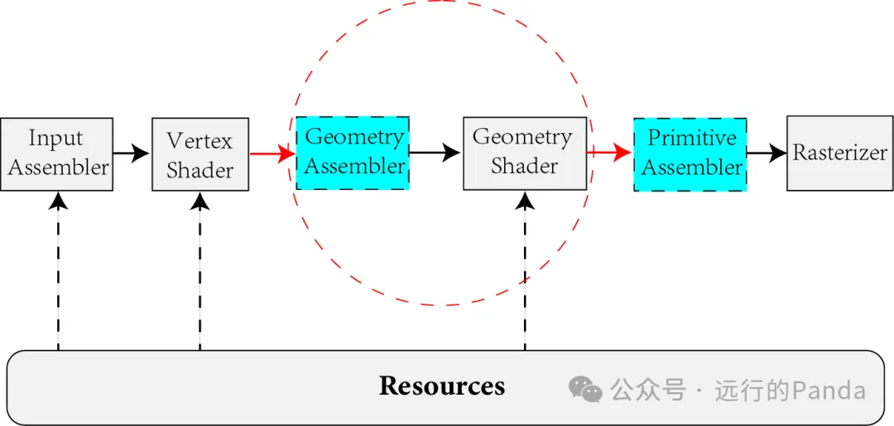

G博士的计划篇幅恢弘：

- 造一座新车间Geometry Shader（GS）以及配套的**Geometry Assembler**（GA）装配厂。
- GA装配厂根据应用指定的Topology把Vertex Shader输出的Vertex流装配成Geometry，Geometry Shader对每个Geometry进行魔改。
- 魔改后的输出类型不受输入类型制约，出门数量也不受限制。

最后一点吊炸天，它意味着Geometry Shader可以把一辆自行车改成10辆独轮车，甚至可以把一辆独轮车改成100辆三轮车。

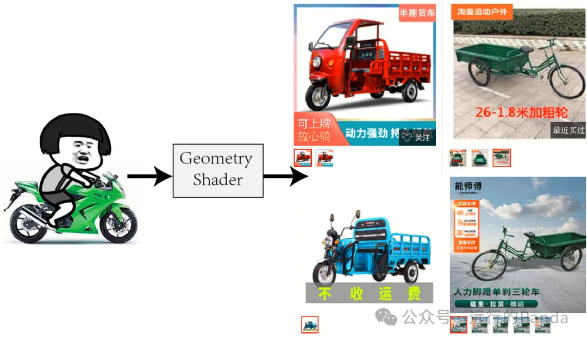

同时，为了使后方的PA装配厂不受影响，项目规定

- Geometry Shader输出的是Vertex流。
- Geometry Shader为PA装配厂指定Topology。

这个时候Topology十八岁了，意气风发的他拿到了GA装配厂的承办权。一开始GA装配厂完全照搬了PA装配厂的所有业务，也就是前面提到的3个List和2个Strip，这时Geometry和Primitive是一个概念。

过了不久后，Topology因地制宜，他意识到魔改是一种发明行为，讲究的是眼观六路，耳听八方。如果引入辅助轮，那么Geometry Shader将获得额外参数，设计会更加精密合理。于是Topology为Geometry Shader**专门打造**了新武器——Adjacency。

Adjacency有两种，一种是基于List开发出来的，完美继承了List的基因：老实巴结没油水。我们还可以看到，辅助轮的数量跟正规轮相等。

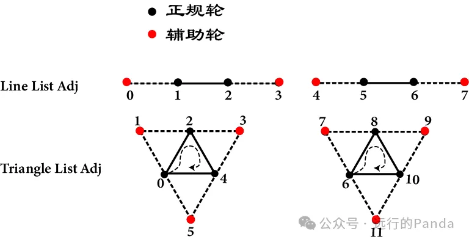

另一种是基于Strip开发的，有一部分辅助轮和相邻的Geometry重复（遗传了Strip的油腻）：

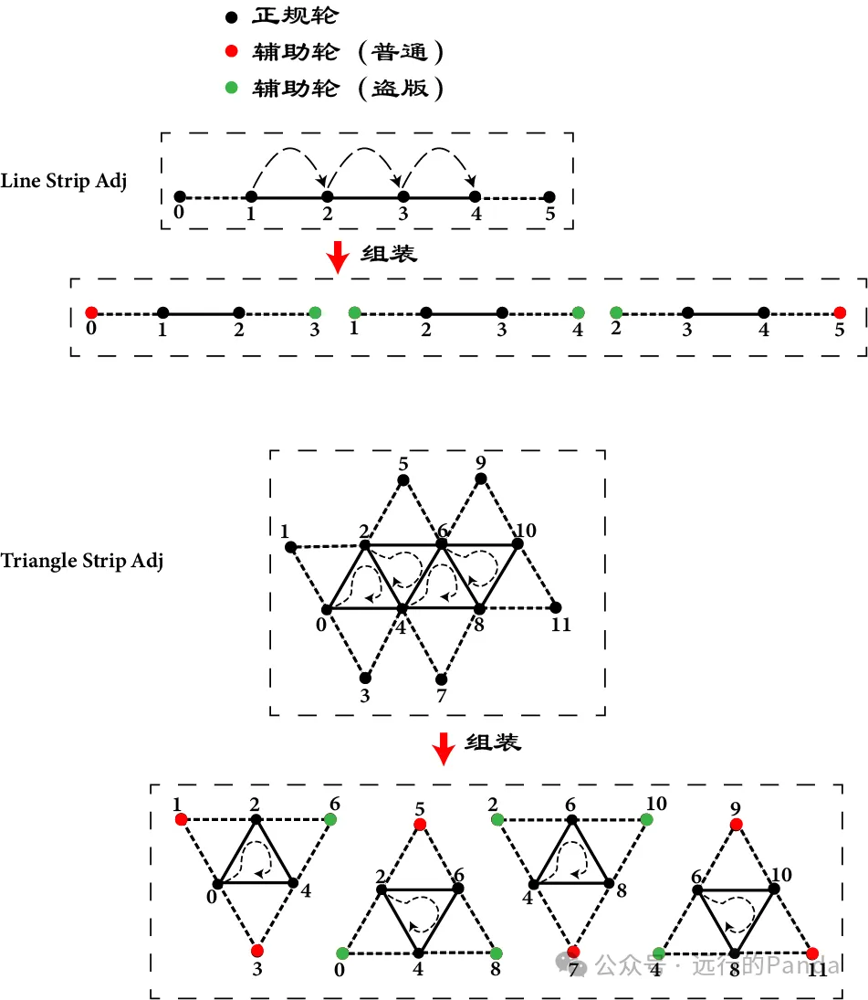

在G博士领导下，这个万众瞩目的项目最终落地了。但根据记者采访了解，当时的生产效益并没有达到预期。园长跟银行贷款购置了32台机床（每台机床可以跑一个Shader线程），打算让所有机器并行执行“一轮造N车”。结果发现应用的胃口太大，有时候8N的出车量就把整个车间的空间给占满（这些空间要等整个Shader结束后才能释放）。所以没辙，每天只能开8台机床，剩下那24台放着积灰，获得的收益只能勉强cover银行利息。

打了这场败仗的G博士，当场就被解雇了，而Topology也受到牵连被贬为保洁员。

春来秋去，滚滚长江东逝水，时间来到了**2009年**，那一年，**Win7**惊艳亮相。此时园长身边的红人是T博士。T博士为人务实，他卧薪尝胆两年多，总结出了GS项目最大的历史教训：**不要在一个Shader里输出过多的Vertex**。这会导致更多的on-chip资源被占用，限制并行线程的数量。

T博士还构思了一套全新的N车方案。这套方案由三个小厂配合完成：Hull Shader, Tessellator和Domain Shader。

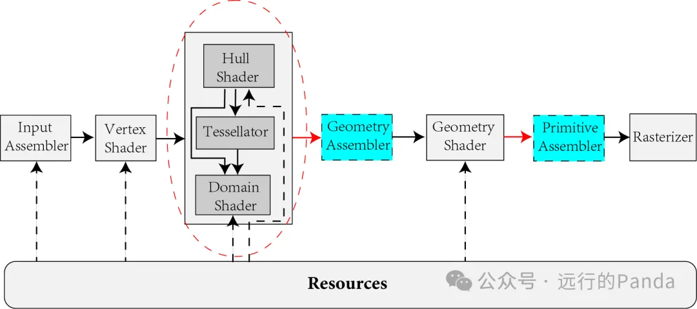

他们之间分工明确：

- Hull Shader负责给输入（一捆轮子）加工，也没多高大上，无非就是把轮子摆正，然后拿条抹布把它们擦干净。
- Tessellator（经过Hull哥的指点后）计算出轮量N。这是核心指标，象征着生产水平。
- Domain Shader是负责魔改的小弟，他每天需要完成Tess哥给他下达的指标才能下班。魔改的原材料是Hull哥塞给他的一捆干净轮子。他可以自由发挥，但不能天马行空——Tess哥会塞给他一个锦囊，上面写着每个输出轮子的魔改参数。

这套方案被称为Tessellation（曲面细分）。Tessellation是**Direct3D 11**的两大骨干之一（另一位是Compute Shader），它最大的进步在于**Domain Shader**的机床**每次只输出一个轮子**。

正当T博士沾沾自喜，一个路过的扫地小哥泼了他一盆冷水：博士，您这套方案有个隐患。T博士闻声望去，见那小哥二十出头，风尘仆仆。扫地小哥接着说：那就是Hull哥，因为他输出的是一捆轮子，太多的话会重蹈GS的覆辙。

T博士肃然起敬，因为扫地小哥的评价可谓一针见血。T博士拍了他的肩膀：小伙子，别扫地了，大材小用。当我参谋吧，下午就来报到。对了，你叫什么名字？

扫地小哥热泪盈眶，手中的扫帚滑落掉地：Topology。

参与到Tessellation项目后，Topology把每个轮子称为一个Control Point，把一捆轮子称为一个**Patch**。本着谨慎负责的态度，他把Patch的轮子个数限制在**32个以内**。于是就有了32种新武器：

X_CONTROL_POINT_PATCHLIST, 1≤ X ≤ 32

Patch List跟老的List相似，只是轮子数量范围更大。值得一提的是，除了给Tessellation作为输入和输出使用外，**GA装配厂的输入**也增加了Patch List这个业务。也就是说，Geometry Shader可以把1~32个轮子进行魔改或者Stream Out出去（为了避开不正当竞争，只在Tessellation休假时开启该业务）。

胜败兵家事不期，包羞忍耻是男儿。自那以后，Topology的商业版图不断扩大。

在武器库方面，他吸收了OpenGL的Triangle Fan，Line Loop，Polygon，Quad List和Quad Strip（非核心业务，就不展开叙述了）。

在装配厂方面，他牢牢掌控着三家连锁店：IA，GA和PA（因为Tessellation的Patch装配比较简单，就不加到简历里了）。

关于Topology的故事，就到此结束了。接下来，让我们回归主线，一起进厂，感受下IA家的企业文化。

***\*IA\****

我们先回顾下Direct3D 11的流水线：

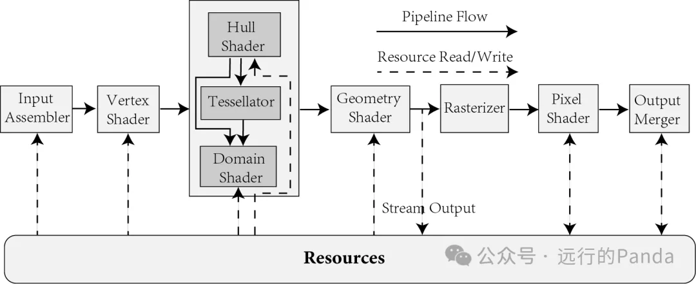

首先要指出一点，Direct3D 11发布的流水线，其实是一份项目规格说明书（以下简称规格书），而不是施工图。在工程落地方面，它给施工单位留了很大的发挥空间。比如规格书上Input Assemler这座哨楼，它通常是由GPU的命令解析模块和IA模块共同完成的。

命令解析模块所承包的，就是上篇文章中为Draw命令所做的那一波操作：Draw/Instance Loop，Indirect参数Read，Index Read等等。命令解析模块没搞定的那些，就由IA模块接棒。

**1. 处理Cut**

当命令解析模块在处理DrawIndex家族命令时，它从Index Buffer里拉回来的个别Index，有可能不是真的Index，而是一把剪刀（Direct3D管它叫Cut Index，OpenGL称之为Primitive Restart Index）。这把剪刀不对应任何Vertex，它仅仅用来告诉IA，在它之前和在它之后的那两部分Index感情决裂，一刀两断。比如这个例子，Index 4是把剪刀：

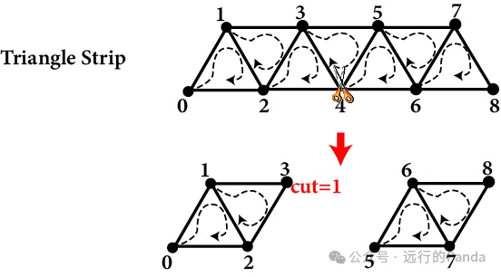

剪刀需要通过一个特殊的证件号表明自己身份。对于Direct3D，这个特殊的Index值是当前Index Format能表示的最大值（比如对于32bits的Index Format，数值为0xffffffff的Index表示一把剪刀）。而对于OpenGL，除了像Direct3D那么玩之外，还支持通过API定制靓号。

剪刀功能使得应用可以把断开的Strip继续放在同一个Draw里，省去了拆分成多个Draw的麻烦。分手了还是朋友嘛，不至于转学校，换单位，或者离开地球。

IA会把剪刀丢掉，然后给每个Index加上一个1 bit的cut标记，cut=1表示Index为一段Strip的终点。比如上面的例子，Index 3的cut标记需要设成1，因为剪断后它成了Strip的最后一个Vertex。

此时另外两个装配厂，GA和PA正被各种Topology类型整得焦头烂额。一听说有剪刀这种玩法，瞬间看到了光明。他俩找到了IA，求他好人做到底：IA兄弟，您瞧，这List像不像是被切成多段的Strip，能否把它俩整成一个类别，那兄弟我就省事了：

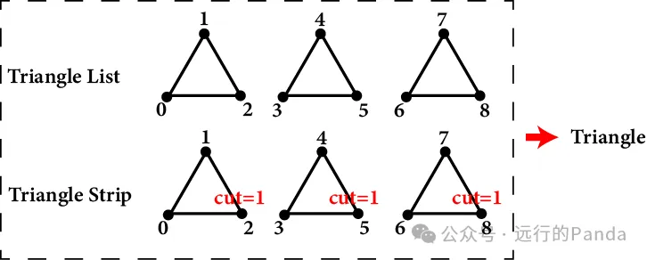

IA很爽快地答应了，因为这对他而言没有额外成本，能卖两个人情，何乐而不为？所以，如果你查看Geometry Shader官方的业务说明，会发现List和Strip是合到一类的，同根同源，在对外场合，就不需要再分你我了：

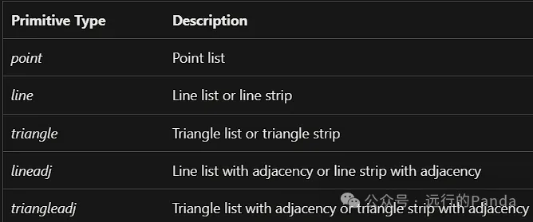

**2. 丢掉不完整的Primitive**

有时候，IA处理的Index流里可能会存在不完整的Primitive。最可能出现的情况就是应用给出的Index数量不严谨。比如对于Triangle List，Index数量不是3的倍数。还有一种情况，就是应用在一个Primitive还没凑满Index时插入剪刀。

不管是哪种情况，如果IA发现不完整的Primitive，他会把手头没配凑成功的Index直接丢掉。

**3. Primitive Id**

Primitive Id表示当前Primitive在所属Instance里的序数，**Vertex Shader之后的所有Shader**都可以使用Primitive Id来实现Primitive级别的个性化。

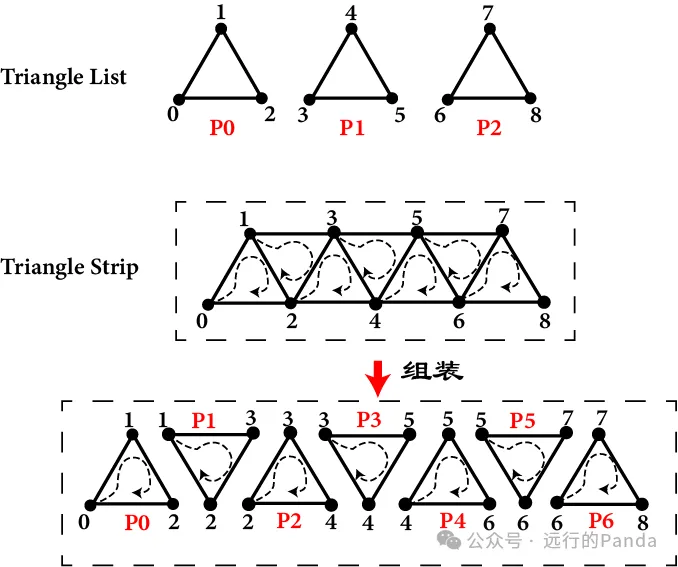

Primitive Id的计算没有捷径，全靠手算。也就是拿着Index流根据Topology类型一个个数。问题是让谁来数，PA还是IA（说明一下，如果Geometry Shader开启，那么他必须输出一个Primitive Id给光栅化。所以GA和PA不会同时有数Primitive Id的需要，派一个代表出来跟IA谈判即可）？先听听双方扯皮。

PA方认为，Primitive Id放在IA算将一劳永逸，GA和PA可以同时下架这些计算成本。而IA方认为，Primitive Id的计算越晚越好，太早了意味着有更多模块之间的通信需要增加位宽，所以，这份工作舍PA君其谁？

这场辩论，IA在表面上占了上风，但他并没有胜出。原因是Primitive Id的计算需求比他想象的要早。

我们不能忽略环境背景——在实际的硬件上，**GPU的每一种Shader都不是单独个体**，而是**一群**训练有素的精兵。他们有着清晰的等级化编制，可以分成若干小兵团，小兵团又组成大兵团。兵团之间可以独立作战，执行不同任务。比如，在本文后面**任务分配模块**里将出现的**GPC**（Graphics Processing Cluster），就属于一种大兵团编制。

任务分配模块可以把一串Index流拆成多份（每份称为一个**Batch**）分发给不同GPC。但是，他在分发前，需要把当前Batch的起始Primtive Id算出来告诉对应的GPC，因为Index流已经断开了。

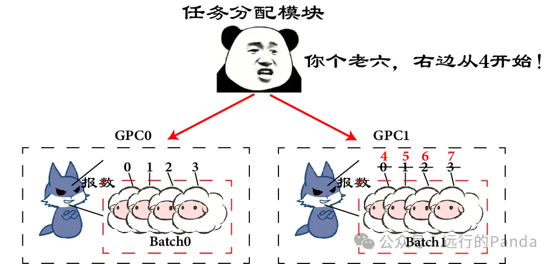

所以，看上去IA责无旁贷，因为它早已对Topoloy了如指掌，专业的人做专业的事，没必要折腾任务分配模块去学习Topology。

但IA（至少我所知道的IA）是很抠门的，是那种每次到菜场买菜挑挑拣拣，完了还非得要老板送一小把葱的那种人。我不知道再讲下去会不会让你感到不适，但抠门确实是GPU家KPI的一部分。继续，IA不愿意给每个Index配备一个32 bit的Primitive Id，他使用的是一种压缩形式的标记：

- 对于每个Instance的起始Index，IA会给它打上Instance Start标记。
- 在Instance内部，IA会给每个Primitive的起始Index打上Primitive Start标记。
- 其他Index不打标记，或者认为打了Normal Index标记。

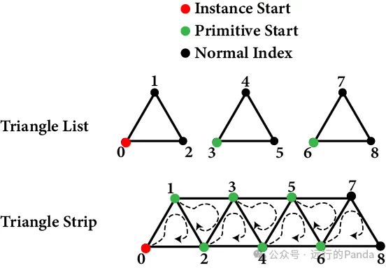

IA根据Topology类型给每个Index打标记后，下游（任务分配模块或GA/PA）将利用这些标记累积算出每个Primitive对应的Primitive Id。对于装配出的每个Primitive，下游会检查打头的Index标记：

- 如果是Instance Start就把当前Primitive Id清0。
- 如果是Primitive Start，则Primitive Id增加1。
- 否则Primitive Id保持不变。

标记只有三种类型，所以每个Index只需要2bit。也就是说，原价32块的猪蹄膀被IA砍价砍到2块，这很IA，大拇指给你。

**4. Instance Id**

Instance Id可以被（且仅被）Vertex Shader用来实现Instance级别的个性化。Instance Id同样需要三种标记：

- 每个Draw的起始Index打上Draw Start，表示Instance Id需要清0。
- Draw内部每个Instance的起始Index打上Instance Start，表示Instance Id需要加1。
- 其他的Index不打标记，表示Instance Id保持不变。

**IA的实体**

IA天生就是Fixed Function阵营的一员——无甲方之乱耳，无Read之劳形。未来应该也是，如果非要加个期限，我希望是30年。一万年太久，因为业界传闻，Direct3D 12的某M姓Shader正想着找条黑巷子把IA和Front Shader（Rasterizer前面所有Shader的统称）给X掉。

**流水线**

再往下走就是一个新的模块了，不过我们先休息下看个轻松点的概念——流水线。流水线在现代工厂车间很常见，它的思想是把生成一个产品的所有工作分成多道工序，所有工序同时运行，力求每个时钟周期都有一个或多个成品出炉。

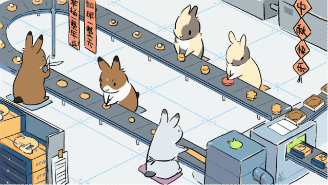

GPU每个模块内部都由若干流水线构成，而众多的模块连接起来构成一条大型流水线。我们稍微了解下GPU流水线上的几个概念。

**位宽**

位宽是指相邻两个模块间物理连线的数量。比如两个模块间有256根连线，那么位宽就是256 bit，因为每根连线在一个时钟周期传送1bit数据。

**Throughput**

对于一个特定的模块，Throughput是指它每个时钟周期能出多少业务数据。比如IA的throughput是指每个时钟周期出的Index数量，ROP的Throughput是指每个时钟周期出的Pixel数量。

**FIFO**

[第一篇文章](https://mp.weixin.qq.com/s?__biz=MzkxMDY0OTkzOQ==&mid=2247483773&idx=1&sn=192bf719a8a8af429b44bc3e83a9ad6b&chksm=c1297e41f65ef757c81facb24915898263d1a7765c7b448422f9b6ee93b9cd99cf425cc1c9bf&token=431487541&lang=zh_CN&scene=21#wechat_redirect)提到，Ring Buffer是CPU给GPU派活用的FIFO，CPU作为生产者从Tail位置填入数据，而GPU作为消费者从Head位置读取并释放数据。实际上，GPU内部的模块之间也有类似的FIFO。

模块之间的FIFO，是一个特殊的Buffer，起到缓冲模块间Traffic的作用。它的宽度通常等于位宽，而深度则等于或略大于下游业务流水线的深度（不考虑Loop逻辑的话），因为下游模块从接收到一笔业务数据开始后，要走完业务流水线的每一层后才能释放那笔数据。而在这段时间里，上游模块一直在推送业务数据。因此需要有FIFO来缓存，否则上游模块会被stall住。

而有些时候，一个模块的业务流水线并不是一条道走到底，它存在分支，而且分支需要的时钟周期比常规路线深得多。通常它代表着一种糟糕，但发生概率并不大的情况。这种情况，我们需要根据发生概率适当增加FIFO的深度。

**任务分配模块**

IA的Index流再往下走，有可能会来到任务分配模块。我说的是可能，因为这个模块在GPU里不一定存在。他跟GA和PA类似，在规格书里没名没份，但它是GPU的算力达到一定规模后必然会出现的一个模块。桌面独显，以及高性能的移动端SOC都可以看见他的身影。

这个很好理解，你原本在村里运营着一个车间生产三轮车，小日子过得也还不错。但某一年你们村突然成了网红景点，大量游客光顾打卡，三轮车的需求量跟着飙升，你收到了16倍于以往的订单。这个时候，你自然地会把车间扩建成16个，然后**再招一个小哥**，负责把订单分配给每个车间。

**SM和GPC**

关于车间，我们来看一个实例——Nvidia的Fermi架构。这是一个2010年出道的网红。不过，架构可不比醇酒那样越老越值钱。Fermi要是站到当前最新的架构身边，就像个小弟弟一样。但拿他来聊正好，因为结构太大的话手机屏幕就放不下全身照了。

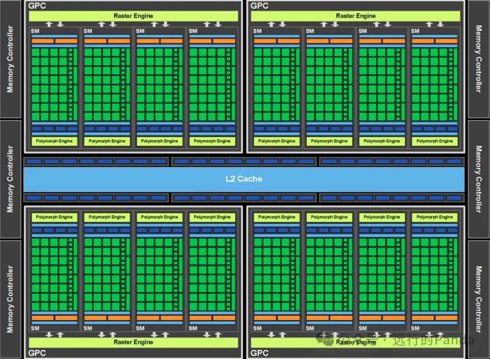

旅游热度上来后，这家工厂把规模扩大到16个车间，每个车间叫做一个SM（Stream Multiprocessor）。可以看到，每个SM车间有32台机床，另外SM车间里还有一些方块长条啥的，可以先不管，就当作休息用的凳子好了。在逻辑以及物理上，这家工厂把每4个SM车间和以及周边配套圈起来形成一个GPC。

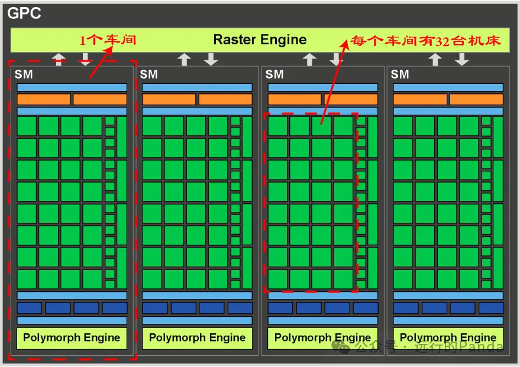

有些童鞋可能会问，为什么要分GPC呢？其实这是出于商业的考量以及管理、验证的方便。

首先，卖GPU不像超市或地摊卖菜，从1斤到16斤任你称。它更像叮咚卖菜，它给菜打个捆（比如Fermi是4斤一捆），然后你根据需求按捆买。按捆卖能降低定制种类，同时又保留可扩展性。当然，这个比喻也不是很恰当，因为有一部分特殊的Engine（比如L2 Cache，Memory Controller），他们有自己的编制，不能被拆开包进不同GPC里。

其次，在没有GPC编制的情况下，GPU只能对所有SM搞扁平化管理。而有了GPC这层编制之后，管理上就多了一个option。比如你看Fermi的GPC里面，每4个SM的背后都有一个Raster Engine在为他们站台。各个GPC的Raster Engine各干各的，泾渭分明。还有最重要的一点，就是以后会讲到的任务排队问题，这种编制能允许GPC内部先排队再出门。

最后，GPC编制还给验证带来便利。这个也好理解，每个GPC的逻辑完全一样，在项目验证的前期只需要验证其中一个GPC，后期则验证多个GPC跟外部Engine连接上的问题。

接下来，让我们简单地了解下任务分配模块这位小哥（以下简称任小哥）。其实任小哥的工作日常可以总结为每天上班都会遇到的灵魂三问：分什么？分给谁？分多少？

**分什么**

在每个任务周期里，任小哥所看到的数据流大致可以分为三种：

- 一波状态设置命令
- 一些零零碎碎的普通命令
- 若干业务命令或数据

其中，状态设置命令好比一条红毯。它们通常走在最前面，负责初始化执行任务的环境，有了环境才能开始干活。

普通命令是一群保镖。它们穿插在业务命令的前前后后各个需要的位置，为业务命令保驾护航。它们可能是准备Shader指令或纹理的2D命令，也可能是执行同步的Fence命令，又或者是业务命令结束后发给Cache的Flush或Invalidate命令等等。

而业务命令呢，你应该猜到了，是一个或多个明星，是最靓的仔。[第一篇文章](https://mp.weixin.qq.com/s?__biz=MzkxMDY0OTkzOQ==&mid=2247483773&idx=1&sn=192bf719a8a8af429b44bc3e83a9ad6b&chksm=c1297e41f65ef757c81facb24915898263d1a7765c7b448422f9b6ee93b9cd99cf425cc1c9bf&token=431487541&lang=zh_CN&scene=21#wechat_redirect)提到过，GPU支持的业务主要有两种：图形渲染和通用计算。前者我们比较熟悉了，任小哥从IA那里接手的，是Draw命令对应的Index流。而对于通用计算，我们到这里是第一次接触。

通用计算的出现有一段小故事，就是你运营的那家三轮车厂，在几代人的努力下，机床技术处于全国顶尖水平。在生产分工化的背景下，有很多造车的，造船的，甚至造飞机的大厂慕名而来，找你外包业务。他们想用你家的机床做些很常规的工作，比如钻孔啊，挖矿啊等等。你并不关心加工后的零件或者挖到的矿有什么用途，反正你能盈利就行。于是除了造三轮车这项旧业外，你新开了一条通用计算流水线，这项业务只使用了原本用于执行Shader的机床，而包括GA，PA以及光栅化在内的众多渲染设备则被孤立在外。

在GPU里，通用计算的任务是通过Compute Shader来实现的。这些任务可能来自以渲染为主业的API，比如Direct3D，OpenGL和Vulkan。也可能来自专用于计算的API，比如OpenCL和CUDA（仅Nvidia家的GPU原生支持）。

我们知道，图形渲染需要起多少线程，是由Vertex的数量间接决定的。而通用计算则不然，它由应用直接指定，不过倒也不是一步到位。通用计算是把线程打包起来一起执行的，这个包裹叫做Thread Group（**线程组**）。这里以Direct3D为例，你可以把一个线程组想象成一个三维表格，每一个格子对应一个线程。而表格每个维度的大小由Shader里的numthreads声明。分成三个维度主要是为了Shader里索引方便，因为Compute Shader的计算输出一般是写到一张Texture里，而Texture支持1D，2D和3D各种类型。至于**发起多少个线程组**，则是通过API **Dispatch指定**，同样分为三个维度：

**Dispatch**(ThreadGroupCountX, ThreadGroupCountY, ThreadGroupCountZ)

经过上述的分层后，每个线程会得到它在线程组内部的线程ID：GroupThreadID。以及它所在线程组在Dispatch任务里的ID：GroupID。这两个ID可帮助它定位自己的读写目标。

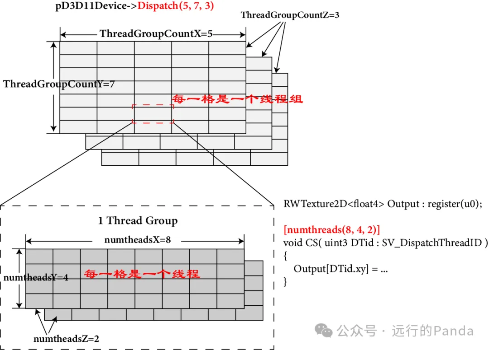

对于任小哥，他从命令解析模块接手的，是当前Dispatch命令的信息。而其中任小哥接下来将会用到的，主要就是前面提到的六个参数。

**分给谁**

对于状态设置或普通命令，那么任小哥闭着眼睛广播给每个SM车间即可，因为每个SM车间都需要它们。而对于Batch，任小哥会根据某种**分配策略，**将之分发给某个SM车间。在GPU的流水线上，凡是需要分配的地方，**最常用的策略是****Round Robin**（雨露均沾，轮询调度）。在任小哥这边，Round Robin就是轮流着给每个SM车间派活。而具体按照什么顺序去玩雨露均沾，则具有一定的自由度。比如，他可以针对GPC做Round Robin：

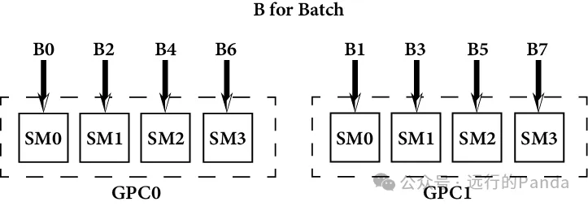

也可以忽略GPC编制，搞扁平化管理——对所有SM车间做Round Robin：

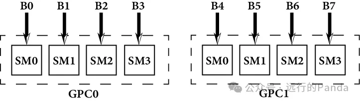

大多数情况下，这两种顺序的结果其实都差不多。任小哥还可以随眼缘挑，只是因为在人群中多看了你一眼。Round Robin的思想就是保证每个车间领到的轮子一样多。它的愿景是负载平衡：要闲一起闲，要忙一起忙。

但有些时候，一样多的轮子，并不代表一样多的活。毕竟三轮车也分高低端，而孰高孰低是随机的，这就会导致某些领到高端订单的SM车间需要消耗更多工时。所以，在下一轮订单开始时，每台机床的空闲状态有可能参差不齐。这种情况下，任小哥应该人性些，好歹征询下SM车间的意见，FIFO已满没法再营业的就放过吧。纸面上的公平不是最终目的，尽早把车给造出来才是。We are family. 今天你落魄了，我拉你一把，明天我潦倒了，你帮我一下。

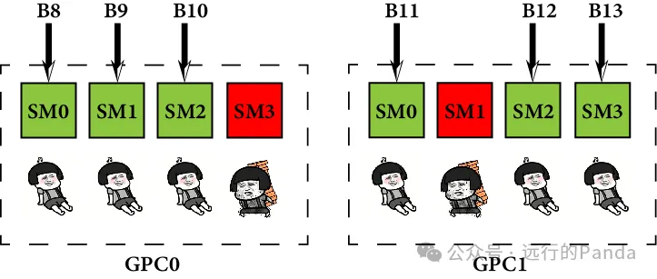

**分多少**

分多少是指业务数据要拆成多大的小包裹分发给不同的SM车间。这里，我们来定性地了解下其中的逻辑。

**图形渲染**

对于Index流，前面提到，任小哥需要把它们切分成多个Batch后再按Batch往下游分发。因为Batch必须刚好切在某个Primitive的尾巴上，所以一个Batch的大小通常用Primitive个数来衡量。而Batch多大合适，则是一个Performance Tuning的问题。

一方面，Batch不能太小，太小了可能连一个Warp都凑不齐。**Warp是一个最低消费值，同时也是SM车间的运行粒度**。比如对于Fermi，一个Warp是32个线程（对于Vertex Shader来说是32个Vertex）。如果一个Batch所包含的Index（还需要去掉重复部分）小于32个，SM车间这边还是会按照32个线程的价格收费，并安排一个Warp所需的资源帮你运行，最终会导致一部分资源空转。

另一方面，Batch也不能太大，否则任小哥可能还没发完一个Batch，机床那边就已经开始拒收了，这就很尴尬。通常，一个大小适中的Batch对于大部分场景都是比较受欢迎的，至于具体是多少则取决于Shader的复杂度以及机床的实力。

另外，需要注意一点，如果Tessellation和Geometry Shader这两家厂子开门营业，轮子的数量是会被放大的。任小哥还得酌情缩小下Batch。而Tessellation还有其他的骚操作。这家伙是个出了名的神经刀，同样大的两个Batch，经过那三剑客各种操作后，最终出门的轮子数量可能相差不止10倍，这就跟任小哥的愿景背道而驰。这时候不患寡而患不均，任小哥得更谨慎地收紧Batch。

表面上，某一台机床陷入重负载好像问题不大。因为前面说了，任小哥可以跳过这台重负载的机床，把Batch分给其他有空的小伙伴。嗯，说是这么说，但从整体影响考虑则不然。

首先，状态设置以及普通命令都需要广播给每个SM车间。如果某个SM车间负载过重，它可能会拒收下一个渲染任务的状态设置命令。那么任小哥这边就没法释放这些状态，进而有可能阻挡其他SM车间接收新的任务。

然后，最重要的一点就是，Batch之间也讲究木桶效应，如果某个Batch在前端的Shader里迟迟不结束，那么它会拖后面其他Batch的后腿。原因就是接下来要说的——任务重排序。

**通用计算**

对于通用计算，每个线程组必须运行在同一个SM里边，这样组内线程才能够便捷通信。因此，Dispatch任务的每个Batch由一个或多个线程组构成。

所以任小哥需要把他接手的Dispatch任务分割成一个个线程组，然后类似图形渲染任务那样，将Batch按照Round Robin策略分发给不同的SM。

至于Batch的大小，一般来说，一个Batch包含一个线程组就OK了。因为应用自己很清楚，线程组的线程数量需要比Warp粒度大（通常应用会把线程组大小设置成Warp粒度的整数倍），否则会出现机器空转。

不过一个SM车间其实是支持同时跑多个Warp的，有时候线程组如果不够大可能会喂不饱SM。这会体现在这个SM收到一个线程组后，还没等任小哥给他派发下一轮，就早已执行完工作闲在那了。这时候，只要Shader需要的资源（比如Share Memory）还够用，可以把Batch适当增大。

**任务重排序**

对于通用计算，Compute Shader一结束，任务也就完成了。但对于图形渲染，当Front Shader都结束后，后面的路还很长。

当一个Batch从Front Shader里边升级出关后，它不能直接向前跃进到下一关（光栅化）。而是先检查一个特殊的寄存器，这个寄存器告诉他光栅化的Primitive是否需要保持API顺序。如果是，那这个Batch需要等原本（任小哥分发时）排在它前头的Batch都出门后才能出发。也就是说，我们需要重新排下Batch的顺序。这好比讨伐暴秦，大家兵分多路，表面上先入定关中者王之。但实际上，不管谁先通关，最终还是得排资论辈让大佬排前面，谁敢坏了规矩，等着鸿门宴伺候。

如果你家厂子只有一个SM车间，那么你不需要为排序烦恼。但你决定扩大产业规模，就需要让光栅化感觉不出速度之外的差异。Index可断，顺序不能乱。这项工作通常也划入任小哥名下，解铃还须系铃人嘛。任小哥既当前锋又当后卫：在前锋位置他负责分发Batch，在后卫的位置他负责找回顺序。这项工作难度很高，能胜任的基本属于专业运动员水准了。脚法要四平八稳，然后还要负责前锋和后卫之间的通信：前锋需要把每个Batch被分到何处这个信息传递给后卫，让后卫知悉Batch之间的顺序。

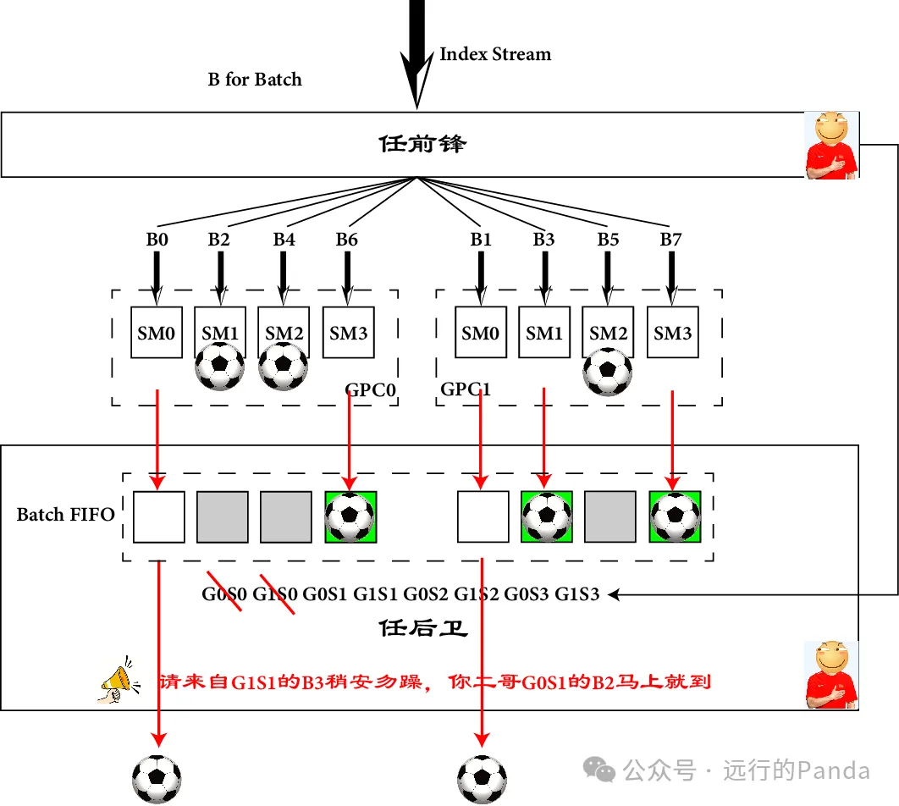

当然，前面也提到了，保持API顺序并不是必须的。Driver会根据一系列状态确定是否可以乱序做光栅化，乱序是人民群众喜闻乐见的，因为乱序意味着性能够提升。被用来确定保持顺序的那些状态主要来自于Output Merger。

如果只单独考虑Color，在有Color输出到RT的情况下，以下情况需要保持顺序：

- Raster Operation开启
- Blending关闭（很好理解，最终需要显示后来的图元）
- Blending开启，但Blending的目的或者说效果不是累加

如果只单独考虑Depth，在Depth test开启的情况下，以下情况需要保持顺序：

- Depth Write开启，并且比较函数是Always或者Not Equal （这两个比较函数的最终Depth结果与顺序有关）。
- Depth Write开启，Occlusion Query开启，同时比较函数不是Always或者Never（对于Always和Never之外的比较函数，通过测试的Pixel或Sample与顺序有关）。

Stencil test开启以及同时考虑Color和Depth/Stencil的情况比较琐碎，这里就不列了。

**总结**

- Topology包括List，Strip，Strip Adjacency和Patch四种类别。其中Strip Adjacency为Geometry Shader专用，Patch可被Geometry Shader和Tessellation使用。
- 重量级Shader(如Geometry Shader)的并行度不如轻量级Shader（如Vertex Shader和Domain Shader），因为前者占用更多on-chip Resource。
- IA模块主要处理Index的Cut，Primitive Id和Instance Id。由于Topology种类以及IA逻辑都是固定的，所以除非对IA的throughput有定制需求，否则，IA模块用Fixed Function实现更合理。
- 规模大的GPU需要一个任务分配模块，把业务数据（渲染的Index流或通用计算的线程组）拆分成小包裹分发给不同SM处理。

本文介绍过的硬件命令：

| **命令** | **描述**           |
| -------- | ------------------ |
| Dispatch | 发起Compute Shader |

部分Direct3D版本的发展历史：

| **版本**      | **主要特征**                                      | **发布时间** |
| ------------- | ------------------------------------------------- | ------------ |
| Direct3D 7.0  | 引入T&L电路                                       | 1999         |
| Direct3D 8.0  | 引入Vertex Shader和Pixel Shader，Shader Model 1.0 | 2000         |
| Direct3D 9.0  | 完全可编程的Shader Model 2.0                      | 2002         |
| Direct3D 10.0 | 支持Geometry Shader                               | 2006         |
| Direct3D 11.0 | 支持Tessellation和Compute Shader                  | 2009         |
| Direct3D 12.0 | 更底层的API                                       | 2014         |

感兴趣的童鞋可以先准备好头盔，下一篇文章，我们一起进入SM车间探秘Vertex Shader。

**以往文章：**

[Unveil GPU-1 GPU的工作环境](http://mp.weixin.qq.com/s?__biz=MzkxMDY0OTkzOQ==&mid=2247483773&idx=1&sn=192bf719a8a8af429b44bc3e83a9ad6b&chksm=c1297e41f65ef757c81facb24915898263d1a7765c7b448422f9b6ee93b9cd99cf425cc1c9bf&scene=21#wechat_redirect)

[Unveil GPU-2 GPU的命令解析模块](https://mp.weixin.qq.com/s?__biz=MzkxMDY0OTkzOQ==&mid=2247483998&idx=1&sn=b6b055e66929b179868be0809e45ffc6&scene=21#wechat_redirect)

