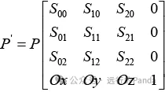

# Unveil GPU-4 GPU的Vextex Shader（上）

在上篇文章中，我们了解了各种Topology类型以及IA的基本工作。同时也大致知道了任务分配模块对Draw和Dispatch任务的分发逻辑。本篇文章将开始走入跟处理器相关的第一个Shader——Vertex Shader（VS）。这篇文章分为两部分，一个从high level角度看VS主要做什么。一个是模块的内部工作流。只写了一半，因为篇幅原因，只能先force kickoff了。

**MVP变换**

先说几句题外话，最近每个周末，我都会去商场玩几局游戏。一开始玩的是泡泡龙，最好成绩是打通到第三个Boss。后来泡泡龙被撤了，于是我又转战捣蛋鹅，目前战绩还可以，前后加起来大概完成了十个任务。


捣蛋鹅有自己的一套招牌动作，表面看上去平平无奇，但背后却隐藏着一系列Vertex Position的坐标变换。而这些坐标变换，通常是由Vertex Shader负责执行。在逻辑上，这些变换主要包括三种：Model变换，View变换和投影(Projection)变换，合称MVP变换。

这一块有矩阵有数学，如果你对Direct3D或者OpenGL一无所知，那么下面的内容会显得无趣。而如果你是应用开发者，可能又会觉得这是老生常谈。所以我在里面穿插了两道证明题，不妨接着看下去，挑战一下你对底层的理解程度。

**坐标变换：人生三境界**

坐标变换是Graphics的基本操作，各种书籍和文章关于它的介绍比比皆是。不过国内最早涉及的书却是王国维写的《人间词话》，里面（无意间）总结了三种最基本的变换。

第一种是**平移**：昨夜西风凋碧树，独上高楼，望尽天涯路。你可以给实体的每个Vertex坐标加一个相同的偏移量（Ox, Oy, Oz），把他挪动到舞台的另一个位置。


第二种是**缩放**：衣带渐宽终不悔，为伊消得人憔悴。缩放变换是让实体放大或缩小，可以通过给实体的每个Vertex坐标乘以一个缩放因子s（也可以每个维度使用不同因子）来实现：


第三种是**旋转**：众里寻他千百度，蓦然回首，那人却在灯火阑珊处。可以给实体的每个Vertex坐标乘以一个角度θ的旋转矩阵，驱动他执行一次正宗的天鹅湖芭蕾转：


这里我给出的是沿着z轴的旋转矩阵，相应地还有沿着x轴、y轴或者任意指定方向的旋转矩阵。另外，除了上面三种变换外，还有错切和镜像等变换，这些就不做详述了，还是那句老话，抓大放小。

实际中的实体变换可能是叠加的。比如，作为玩家的我可能希望大鹅像花滑运动员那样，在移动的过程中华丽转体，同时还放大自己。如果分成三次变换看着似乎不太简洁。能否**只用一次变换运算，把上面三个操作一起搞定**？

当然可以，无非就是把上面的向量加法、乘法，以及矩阵乘法合并到一块。让应用出一个包含缩放因子的旋转矩阵以及偏移向量。Vertex Shader先把Position乘以旋转矩阵，然后再把结果跟偏移向量相加就搞定了：


计算过程和结果都是对的，但是了解Direct3D或OpenGL的童鞋都比较清楚，这并不是实际应用的玩法。在实际应用里，Position其实是一个四维坐标(x, y, z, w)。通常应用会在模型实体的每个三维坐标后面补一个w=1.0，然后再放入Vertex Buffer。如果应用只给(x, y, z)，那么GPU会给w填一个默认值1.0。相应地，变换矩阵也是四维的，所以大鹅的变换应该是这样的：


在中学几何里我们学过，之前的三维坐标系叫做**笛卡尔坐标系**（Cartesian Coordinate）。而这种多了一个w分量的坐标系叫做**齐次坐标系**（Homogeneous Coordinate）。如果你从未接触过这个概念，建议搜一下了解它的特点（我就不在这里展开了），不会花多少时间。

我们看到，笛卡尔坐标转齐次坐标很简单，就是加一个w=1.0。但反过来，当我们想把齐次坐标转换成笛卡尔坐标时，则需要将其xyz分量分别除以w分量：


你可能会argue，三维也好，四维也罢，算出来的结果是完全一样的，何必多养一个w分量？这人什么来头？

请相信，w是凭实力坐上第四把交椅的。很快我们将看到，在透视变换里，观察空间的z会被存放到w分量上，在齐次坐标转笛卡尔坐标时，xy分量会除以w（也就是观察空间的z），从而实现透视效果。当然，这些只用三维坐标也能做到。但w分量的另一个作用会让你无法辩驳，那就是**透视校正**。

透视校正属于后面流水线的内容，这里我只简单说一下。起因是透视变换后Attribute在新的坐标空间里不再随着x和y线性变化（假设插值模式不是const或者non perspective），而GPU使用了一种曲折的方法解决这个问题：

- 黑化入圈

  在透视变换后将Attribute除以w分量，并将w分量取倒数得到RHW（Reciprocal Homogeneous W），使这两者都获得可线性插值特性。

- 同流合污

  黑化后Attribute和RHW混得风生水起，他们沿着流水线一直走到Pixel Shader。

- 重新洗白

  Pixel Shader将Attribute除以RHW，从而获得正确的Attribute数值。

简而言之，**w分量是透视变换的执行以及售后服务不可或缺的核心人物**。

也许有童鞋觉得捣蛋鹅的挥翅，以及走路的姿态过于惟妙惟肖，建模者肯定花了不少功夫，是不是找了一只真鹅然后连续一个月跟它同吃同睡才观察得到这些参数的？

有可能。但一般不建议这样做，因为有捷径可以走，那就是在大鹅身上装上位置传感器，捕捉它挥翅走路时一些关键节点的位置变化，然后提取出参数。

**Model变换：问苍茫大地，谁主沉浮**

第二篇文章，[Unveil GPU-2 GPU的命令解析模块](https://mp.weixin.qq.com/s?__biz=MzkxMDY0OTkzOQ==&mid=2247483998&idx=1&sn=b6b055e66929b179868be0809e45ffc6&scene=21#wechat_redirect)曾提到，3D建模者会把实体表面划分成网格片块并提取出Vertex。这些Vertex的坐标是一种本地坐标。它们以实体本身某个位置作为坐标系原点，所处的空间叫**Local空间**，也叫**Object空间**或者**Model空间**，都一个意思。

尽管这些实体平时以自我为中心，但每当应用开始布置舞台场景时，他们有令必行。舞台的布置，就是给各个实体施加一个Model变换矩阵（变换前每个实体都在舞台的原点上），把它们变换（平移，缩放或旋转等）到应用期望的位置上。这个过程好比在造物者视角下，让天地山川草木虫鱼鸟兽就其位，司其职。经过Model变换后，这些实体所处的坐标空间叫做**世界空间**。

**View变换：横看成岭侧成峰，远近高低各不同**

这个世界就在那里。你看，或不看，世界还是那个世界。但一旦你睁眼看世界了，眼睛所在的位置以及看的方向会影响你捕捉到的画面结果。

我们在玩游戏时都有种感觉，好像有一个隐形的摄像头一直在拍摄着虚拟世界并实时显示在屏幕上。这个摄像头其实是应用安排的，它代表着玩家眼睛位置和看的方向，这个位置和方向在初始化后，还可以受手柄或者VR设备实时控制。

而在初始化前，这个摄像头位于世界坐标系原点，并指向+z方向（这里以Direct3D为例，OpenGL则是指向-z方向，两者的区别后面会有详细的介绍）。比如在下面这个例子，摄像头观察到前方8公里处有一只大鹅。


假设摄像头初始化或者受玩家控制后，沿着+z方向向前移动了2公里，那么摄像头将观察到前方6公里处有大鹅。但问题是怎么实现这种观察上的变化？


前面说了，坐标变换都是施加在实体上的。摄像头向+z方向移动2公里，可以看作是世界坐标系上的所有实体向-z方向移动2公里。

同样地，如果摄像头的方向发生旋转，那么可以将实体往反方向做旋转变换来获得观察结果。比如下面的例子，摄像头除了在y轴和z轴上平移外，还沿着x轴旋转了90度。那么实体除了要在y轴和z轴上做反方向平移外，还要沿着x轴旋转-90度。


也就是说，你在游戏里春风得意马蹄疾，一日看尽长安花。而真相是应用把长安的花拉动着展现给你看（当然，这也不是绝对的。如果你玩的是Ray Tracing游戏，那么移动的确实是你。但现在我只讲普通的光栅化流水线）。我们把应用为观察者所做的这种变换称为**View变换**。经过View变换后，玩家就会很Happy地感受到，他一直是中心，而且他看的方向一直是正前方（+z方向）。而世界坐标系经过View变换后，得到的坐标系被称为**观察坐标系**。

**投影变换：一叶障目，不见泰山**

经过View变换后，你镜头里的大鹅已经就位，也喊了一声茄子。他等着你按下快门，然后在投影屏上留下靓照。不出意外，拍照这事也涉及一种坐标变换，叫做投影变换。投影变换主要有两种：正交投影和透视投影。

正交投影只是把xyz做了缩放或平移，原汁原味地保留了实体在观察坐标系下的几何特征。它跟前面的MV变换类似，变换都是这种形式：



这种变换干的无非就是前面提到的平移啊，缩放啊，旋转等等。它有一个专门的名字，叫**仿射变换**。仿射变换最大的特点是平行线变换后还是平行线，也就是没改变角度。可以说，仿射变换不会导致实体发生任何失真（虽然缩放改变了平行线间的距离，但线与线间还是等距，一般不把它列为失真）。

在投影圈里，正交投影在工业制图领域比较吃香，各个方向的正投影都属于正交投影。但今天他只是来客串，主角是我们的透视投影，或者说**透视变换**。

透视变换是摄像机模仿人眼视觉特点采用的投影方式。在这种模式下，平行线会相交于某个灭点（Vanish Point）。这种变换呈现了近大远小的特点，带有失真，但跟人眼的感知一致。

  

在这种投影模型里，z方向上的可见范围被限制在位于Z=Znear的近平面以及位于z=Zfar的远平面之间（Znear和Zfar多大由应用决定）。其中，近平面还被用作投影面。

而xy方向上的可视范围分别被限制在各自的视角（Field of View，同样由应用决定）内部。这样一来，在前后上下左右6个平面的包抄下，可视范围成为了一个视锥体。

下面我来推导下透视变换矩阵，过程不会很复杂，主要用到初中几何的知识，感兴趣的童鞋不妨跟着走下去。


在视锥体内的某一点[x, y, z]投影到近平面后，z'=Znear。因此我们只需要推导出x'和y'。这里以y'为例，根据相似三角形原理有：


这个式子很有意思，它告诉我们，投影后的坐标y'跟观察世界的z成反比（这就是所谓的近大远小）。把它推及到x'便可得出变换矩阵：


这里我把观察世界的z存放到w分量上，除以z的操作将在后面齐次坐标转笛卡尔坐标时执行。这个变换矩阵相当漂亮，但中看不中用，因为观察世界的z，也就是深度信息不见了。深度是用来判断遮挡关系的重要信息，清一色地送一个z'=Znear下去，是没法向下游的父老乡亲交代的。

那么，下游的乡亲们究竟期待你送什么样的z'？直接送z'=z下去，行不？

**不行**。

下游的乡亲会拿你给的深度值在屏幕空间下做**线性插值**，从而得到图元内每个像素的深度。观察空间的z是随着x和y线性变化的，你看下笛卡尔坐标系中的平面方程就知道了：


在观察空间里，xyz是年少结义，情同手足。可惜的是，经过有失真的透视变换后，xy沦丧了自我。z也意识到，到了投影后的空间里，它并不随着x'和y'线性变化。生死之交当天不知罕有，到你变节了，至觉未够：


经过一番思想斗争后，z还是念及桃园之义，要去追随他的两位哥。（第一道证明题开始了）如果把前面的平面方程用x'和y'来表示，就变成：


等式两边同除以z，同乘以Znear，再变成：


这个式子不怎么好看，但它给出了一个很关键的信息：**1/z在透视投影后的空间中随着x'和y'线性变化**。也就是说，投名状是把自己名字倒过来写，简直欺人太甚。不过有了这个信息，变换矩阵就接近搞定了：


这里，J和K是两个大于0的常量。让z'=J-K/z是为了让z'和z有一样的单调性并且z'>0。这样对于后面的深度测试，离眼睛近的点仍然对应较小的z'。

这个矩阵看上去是合法了，我也试过把变换后的坐标送给下游，但是惨遭退货。


是一位负责裁剪的亲（以下简称裁剪亲，一般属于Setup模块）嫌弃这些坐标过于凌乱。前面提到，眼睛的可见区域是个视锥体。如果有些图元刚好只有一部分落在视锥体内，那么裁剪亲就要削它几刀（也可能只是虚晃，因为硬件会使用一种叫Guard Band裁剪的优化，以后会提到），把落在外面那部分给斩断。裁剪亲刀法过硬，难免有点小傲气。他见上游各波操作后都有专属空间，于是他也如法炮制出一个，还用自己姓氏命名，叫**裁剪空间**。裁剪亲之所以退货，是因为视锥体的近平面，远平面以及宽高都是受应用管制的不确定因素。这样被人牵着鼻子走，他的刀法就没法纯粹了。

夫空间者，地盘也。裁剪亲这边制定的规矩是：透射变换中得把视锥体映射成一个Cube。在齐次坐标系下，这个Cube这么表示：


看下来我们只差一个缩放而已，问题不大。其实也就是解几个简单方程的事。过程我就不列了，直接贴结果（这里的W和H分别是投影屏幕的宽和高）：


最后，在重新发货前，我们还剩两个问题，谁来负责执行xyz除以w这个操作？还有，谁来把缩放成Cube的视锥体给映射到屏幕上？这两个操作都是由GPU硬件负责做的，分别叫做Perspective Divide和Viewport Transform。它们属于后面流水线的内容，这里就不说了。

**左/右手坐标系**

在View变换那里我们说，Direct3D的镜头朝向+z方向，而OpenGL的镜头朝向-z方向。导致这种区别的原因在于两者使用的坐标系不同。Direct3D使用的是左手坐标系，而OpenGL使用的是右手坐标系。

当我们用左手摆出一个点赞姿势，同时让大拇指外的四根手指从x轴绕向y轴，这时候如果大拇指指向+z方向，那么就称对应的坐标系为左手坐标系。类似地，如果要用右手才能达到同样效果，那就是右手坐标系。


除了可见范围z的符号不同外，这种区别还会导致某些中间结果的符号差异。比如，GPU硬件中有一种叫背面剔除的优化（其实应用也有一些算法会在Shader里做类似的操作）。因为一个实体的背面是眼睛看不见的，所以可以提前把背面的三角形丢掉。当应用按照一个统一的绕向（比如逆时针）去画所有三角形时，背面三角形最终呈现的实际绕向会跟正面三角形相反。因此，判断绕向是背面剔除的第一步。

对于任意的三角形ABC，它的绕向可以通过AB和BC的叉乘结果来判断。对于左撇子Direct3D，如果叉乘结果的z分量小于0，说明是逆时针。而OpenGL刚好相反，叉乘结果的z分量大于0才表示是逆时针。

**Attribute的投名状**

前面为w分量辩护的时候提到，Attribute也会黑化，因为投影变换后他也不随着xy线性变化。而他的投名状是除以z。但是，你有没有思考过为什么？这是第二道证明题，准备好纸笔，一起来攻克。

想当年，a（小写a代表Attribute）和xyz一起活在观察空间里。总角之宴，言笑晏晏：


信誓旦旦，不思其反：


反是不思，亦已焉哉：


最后一步，借用了前面1/z可由x'和y'线性表示的结论，A'，B'和D'是吸收了1/z之后的常量系数。得证，铃铃铃~，交卷。

最后再出道无门槛的附加题，也跟实体坐标变换有关：至少移动几根火柴，才能让下面的等式相等？答案见文末。


**关于SM…**

[上篇文章](https://mp.weixin.qq.com/s?__biz=MzkxMDY0OTkzOQ==&mid=2247484616&idx=1&sn=4f33f82915ce97dd2a92d5b1d9e581ba&chksm=c1297bf4f65ef2e28b6ab8e07d283b55cd635280903df634948ce535ca7f8a5a44ac6aff1789&token=1658384638&lang=zh_CN&scene=21#wechat_redirect)讲到，任务分配模块会以Batch为单位，将IA模块送下的Index流分发给每个SM。我再贴下上次那张Fermi的GPC结构图：


这次，我更想把每个SM看成一个大厨房，而那32个格子其实是32个灶台（很抱歉修改这个叙事背景，害你白买了头盔。但说实话，我对三轮车实在有点审美疲劳了……）。SM厨房的主力，是一支由32位厨哥组成的炒菜（Shading）团队，这支队伍战斗力爆表，每个成员都是身怀绝技。


厨哥团的任务是完成每个Warp菜单上的32道菜。我们一直说一个Warp包含32个线程，其实32只是一种主流，并不是一种标准。也有一些架构（比如AMD家）使用了64个线程。但这对我们认识SM只是小问题，我们就照主流来好了。

虽然厨哥团光芒四射，但他们要有序工作，离不开后勤团的全力支持。所以，今天我们把第一个镜头给到这支后勤团队。

**VS的后勤团**

我个人是Fixed Function出身，关于Shader，我只是听说过。凭着三分听说，三分推测，三分脑补外加一分演义，我把后勤团的成员以及他们跟外围的交互关系整理成了下面这张山寨结构图，大家不妨带着批判的眼光看下。


**Vertex Packer**

由于厨哥团是以Warp为粒度接单的，所以，后勤团得有人把Vertex打包成Warp。我们把这位打包的管理员称为**Vertex Packer**，或者随意点，叫他**P哥**就行。

P哥任劳任怨，每天要处理的Index动辄成千上万。本来沧海横流，方显英雄本色，但在外人眼里，P哥却显得很弱鸡——外界普遍认为他只会数数和打包。这其实是一种误解，这个岗位的技术含量并不低，工作内容很有挑战性。

**Index的重复**

P哥最大的挑战在于他所接手的Index有很多是重复的，如果他不能有效消除或者降低这些重复，那么厨哥团队会Over Shading，实际产能将被拉低一个档次。而这种重复，全都拜DrawIndex所赐。

SM被我重定格为厨房后，Draw和DrawIndex变成了点菜API。Draw像是一匹桀骜的野马，从来不吃回头草。虽然应用骑着它渲染网格会很烫手，但如果只从P哥的角度看，Draw非常友好，因为他点过的菜号（Index）不会有重复。

麻烦就出在DrawIndex这边，当Draw Index搭档List渲染网格时，菜号重复是家常便饭。跟Strip搭档情况倒是好很多，在关于[IA和任务分配模](https://mp.weixin.qq.com/s?__biz=MzkxMDY0OTkzOQ==&mid=2247484616&idx=1&sn=4f33f82915ce97dd2a92d5b1d9e581ba&chksm=c1297bf4f65ef2e28b6ab8e07d283b55cd635280903df634948ce535ca7f8a5a44ac6aff1789&token=1658384638&lang=zh_CN&scene=21#wechat_redirect)[块](https://mp.weixin.qq.com/s?__biz=MzkxMDY0OTkzOQ==&mid=2247484616&idx=1&sn=4f33f82915ce97dd2a92d5b1d9e581ba&chksm=c1297bf4f65ef2e28b6ab8e07d283b55cd635280903df634948ce535ca7f8a5a44ac6aff1789&token=1658384638&lang=zh_CN&scene=21#wechat_redirect)的文章我们了解到，Strip能够同时避免VB存储重复和Over Shading，那些重复的Vertex会光栅化前一刻才通过PA装配厂的复刻展开来。可惜Strip的步法走位太过苛刻，他像一个用惯顶针修辞的文人，有才，但不适合长篇大论。

举一个简单的例子——画一个含有8个Vertex的Cube。如果限制只用一个Draw，那么Triangle Strip是搞不定的。他经过一波0, 1, 2, 3, 4, 5, 6, 7, 0, 1之后就开始走投无路。但Triangle List闲庭信步，这对于他只是个小case。


所以对于这个例子，DrawIndex搭档Triangle List是个更好的选择。不过你看啊，这里一共要画12个三角形，也就是36个Index，平均每道菜被重复点了4.5次。于是最关心的问题来了，这样会不会导致厨哥团队Over Cooking？

P哥会尽力防止，他采取的对策是玩缓存。

**什么是缓存**

作为动词，缓存是一种减少远程读数的策略。而作为名词，缓存是电商平台在你家附近建的本地货仓。由于你家在闹市，地价较高，这个货仓要比郊区的厂房小得多。货仓里摆着一个叫Cache Line的货架，货架的每一层存放着一款商品，旁边还贴着一个标签（Tag）记录这款商品的信息。这些信息包括Valid标记，厂家地址（Address）和未处理订单数（Reference Count）。这三个信息基本上所有缓存都会有。Tag可能还有别的信息，具体取决于缓存的类型。


- Valid标记表示货架层是否为空，本来空不空用眼睛看就行了，但有些商品过期了还没来得及清理，需要通过Valid=0把它们标记成无效商品，防止发生商业事故。
- Address就是取货地址，这个没什么好说的。
- Reference Count是个计数器，它表示当前有多少用户下单要这款商品，但还未发货。每次有订单点名这款商品，它就加1。发完货后它就减1。这个计数器是占坑用的。前面说了，货架的空间是有限的，如果已经摆满了，而新订单要的商品又不在架上，那就得挑出一行，把上面的商品送回厂家，从而腾出空间。而出局者都兼有两种气质：计数器=0并且热度最低。计数器要等于0很好理解，你还没发货呢就踢了，那客户不把你撕了。而商品热度则是通过LRU（Least Recently Used）算法确定的，这里就不展开了。

缓存每次收到订单，会先检查标签上的关键信息（比如厂家地址），确定订单要的商品在不在货架上（这个步骤叫命中测试）。如果在（命中/Hit）那就地取货，平台和你都会很开心。如果不在（Miss），那么平台需要在货架上新分配一层，填好标签，然后跑到更远的下一级仓库或者厂家（Memory）去拉货。拉回的商品将被放到刚分配的货架层上。

**Vertex Tag**

上面说的是教科书里的缓存玩法，但到了P哥这边可能会有出入。Tag的设计比较简单，P哥收到Index对标教科书上的Read Address，所以Tag里需要存Valid，Index和Reference Count。P哥得稍微破点费，让这他们都住在Flip-Flop里，这样才能一个cycle完成命中测试。


回到之前画Cube的例子，经过一波命缓存操作后，Tag里只留了8道菜。这是梦寐以求的结果，甚至远远达不到下单指标（32个）。不过IA接着会给P哥发一个Batch或者Draw的结束标记，通知他提前下单。

而数据这边，靠Index菜号去Memory取回的只是原材料，这不是P哥要的，P哥要的是厨哥团最终完成的菜品，而这些菜品最终会流入到一个叫Vertex Cache的缓存里。

**Vertex Cache**

尽管Vertex Cache也受P哥管理，但它跟教科书上的Cache Line已经不是一回事了，因为一个Vertex对应多个Attribute而不是一行。而且它也没有所谓的低热度淘汰机制。总之，我想说的是，我们要按照它实际的使用功能去理解它。

Vertex Cache通常是位于片上的SRAM（至少我没听说过有放在Memory的），放Memory并不合适，那样可能会导致PA装配厂饿晕在厕所。有些应用开发者可能对Vertex Cache比较陌生，甚至感到困惑：为什么不把输出的Vertex数据直接送给PA装配厂？

原因太多了，我这里列举几个。

首先，后面我们将看到，厨哥团支持同时跑多个Warp，而这些Warp执行进度可能参差不齐，所以最终的完成顺序可能跟P哥提交的顺序不一样，直接给到PA装配厂的话，那边还得自己排队，这种送餐模式PA装配厂肯定接受不了。

其次，在单个Warp内，厨哥团的出货顺序和PA装配厂的取货顺序不同。前者以Warp为粒度输出数据，通常他会先输出32个Vertex的Position，然后再依次输出32个Vertex的每个Attribute。而PA装配厂按照图元取货，他要先取出第一个图元的Position和所有Attribute，然后再接着取第二个图元。

最后，先存到Vertex Cache能减少打包的饭盒。比如的下面Vertex输入结构，如果直接输出的话，纸面上只需要输出7个分量，每个分量为32位的float。但是硬件装Attribute的饭盒都是4分量大小的，所以我们从Vertex Cache拉出数据后可以做点手脚，把后两个Attribute给拼到一个饭盒里。当然，拼盒是有前提的，那就是参与拼盒的Attribute插值方式必须一致（同为perspective或const等），否则会给后边流水线的插值带来困扰。

- 
- 
- 
- 
- 
- 

```
struct VertexIn{    float4 pos : POSITION;    float culldistance : CULLDISTANCE;    float2 tex : TEXCOORD;};
```


**要不要送货上门**

P哥还有一个烦恼，就是如何给PA装配厂（假设Geometry Shader没开启）提供他家的产品。PA装配厂是P哥的客户，他从P哥那里购入各种菜品，然后组合成各种图元套餐卖给光栅化。原本他们约定好由P哥送货上门，PA装配厂支付配送费。但后来PA装配厂改了主意。

背后的故事是这样子的，PA装配厂常驻着一个第三方质检员质哥，质哥负责做Kill Test，看家本领背面剔除令人闻风丧胆。质哥对饮食质量要求非常高，毕竟食品安全重于泰山嘛。质哥每次会先让PA装配厂先上主菜（Position），如果觉得不合口他会直接把主菜倒湿垃圾桶，而配菜和点心（Attribute）也不需要送上来检测了。


只要有质哥在一天，就总会有一半左右的菜品直通湿垃圾桶。PA装配厂肉疼无效的Attribute配送（费），所以就跟P哥毁约了，由自己跑腿取货。

**P哥如何工作**

有了上面对环境的认识后，我们再来看看P哥的整个工作流程。

1. 缓存Index

每个新的Index进来后，P哥会使用Tag对Index做缓存，最终的Tag是长这样子的：


对于Hit的Index，P哥需要更新Reference Count。而对于Miss的Index，P哥还得计算出对应Vertex数据在Vertex Cache的地址并填到Tag里。这个Tag还兼有队列功能，每当队列里集满32个不同的菜品时，P哥就把Warp订单交给Warp Scheduler。

除了挤满一个Warp外，还有上面说到的Batch或者Draw结束也需要提交订单。除此之外，当总的Reference Count达到一定阈值时也需要提交。否则PA装配厂可能会因为FIFO装满而拒收P哥的Index，P哥受到Back Pressure影响也会拒收IA的Index。这时候就会导致dead lock：PA装配厂在等待P哥提交Warp好让自己FIFO能Release，而P哥则等待PA装配厂接收自己的Index。

2. 预取Vertex Data

[第二篇文章](https://mp.weixin.qq.com/s?__biz=MzkxMDY0OTkzOQ==&mid=2247483998&idx=1&sn=b6b055e66929b179868be0809e45ffc6&scene=21#wechat_redirect)提到过，有条件预取就预取，没条件的话就创造条件。在缓存之前，Index是没法预取的，因为IA给出的Index存在重复。而缓存之后的Index是实打实要进入厨房做Shading的，所以这时候去预取Vertex Data恰到好处。后勤团根据Index，Driver设置的VB地址以及Vertex数据的Stride算出数据地址后，就可以向MAC发起预取，而返回的Vertex数据将被进入厨哥团的锅碗中。


这个地方如果不对Vertex Data做预取，那么只能在Vertex Shader里Patch一些Load指令去读。这样导致的后果就是Vertex Shader需要多等一段时间。但你别别说，某大厂就是这么干的。后面我们将看到，厨哥团会通过车轮战的方法来缓解Memory访问延迟的影响，只要厨哥团能同时支持的warp越多，对延迟的容忍度就越高。但他们需要准备的锅碗瓢盆也越多，所以那些先上船再买票的，要么是财大气粗，要么是艺高人胆大。

3. 与PA装配厂互动


对于每个Index，不管命中测试结果是Hit还是Miss，P哥都会把Index送给PA装配厂。每个Index都携带着IA给的Cut以及P哥算的Vertex Data地址。但PA装配厂作为外人，他并不清楚Shader什么时候执行完，Vertex Data什么时候就位。

咋整？

最简单粗暴的方法就是直接打电话问P哥啦。那P哥呢，他自己知道吗？本来是不知道的，但我们提醒他之后，他就开始做作业了。P哥应该维护一张表（前面图中的Index State），里面记录每个Warp对应哪些Index，以及这个Warp是否执行结束，有了这张表，就不用担心被搞得一问三不知。

4. 管理Vertex Tag

每当PA装配厂自己从Vertex Cache取出货后，他都会打电话告诉P哥，P哥会把对应Index的Reference Count做递减。对于那些Reference Count=0的Index，原则上已经可以把它们从FIFO里剔除。但过早剔除并不好，留着还可以被更晚来的Index给Hit。通常硬件会保留一个历史窗口的Index在FIFO里，至于这个窗口有多大，则取决于架构对性能的需求。

**总结**

- 坐标变换包括Model变换，View变换和投影变换三种基本变换。
- 透视变换后的w分量是观察空间的z，经过Perspective Divide后，w分量变成了RHW，他会一直走到Pixel Shader被用于透视校正。
- Vertex Packer通过缓存减少Vertex的Over Shading。
- VS输出的Vertex数据会存放到Vertex Cache，而Primitive Assembler根据Vertex Packer给出的地址从中读取数据。


**以往文章：**

[Unveil GPU-1 GPU的工作环境](http://mp.weixin.qq.com/s?__biz=MzkxMDY0OTkzOQ==&mid=2247483773&idx=1&sn=192bf719a8a8af429b44bc3e83a9ad6b&chksm=c1297e41f65ef757c81facb24915898263d1a7765c7b448422f9b6ee93b9cd99cf425cc1c9bf&scene=21#wechat_redirect)

[Unveil GPU-2 GPU的命令解析模块](https://mp.weixin.qq.com/s?__biz=MzkxMDY0OTkzOQ==&mid=2247483998&idx=1&sn=b6b055e66929b179868be0809e45ffc6&scene=21#wechat_redirect)

[Unveil GPU-3 GPU的IA，任务分配模块](https://mp.weixin.qq.com/s?__biz=MzkxMDY0OTkzOQ==&mid=2247484616&idx=1&sn=4f33f82915ce97dd2a92d5b1d9e581ba&chksm=c1297bf4f65ef2e28b6ab8e07d283b55cd635280903df634948ce535ca7f8a5a44ac6aff1789&token=142699757&lang=zh_CN&scene=21#wechat_redirect)

公布附加题答案：一根都不需要动，只要把手机屏幕旋转180度等式就成立了。