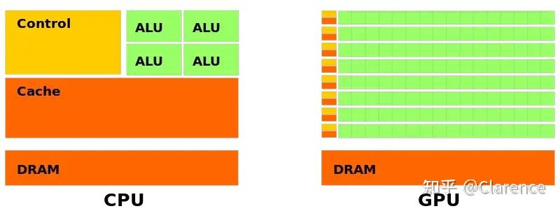
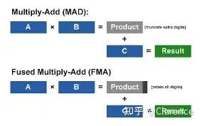
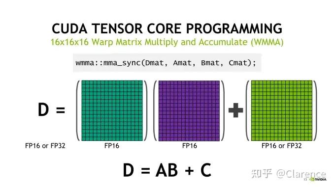
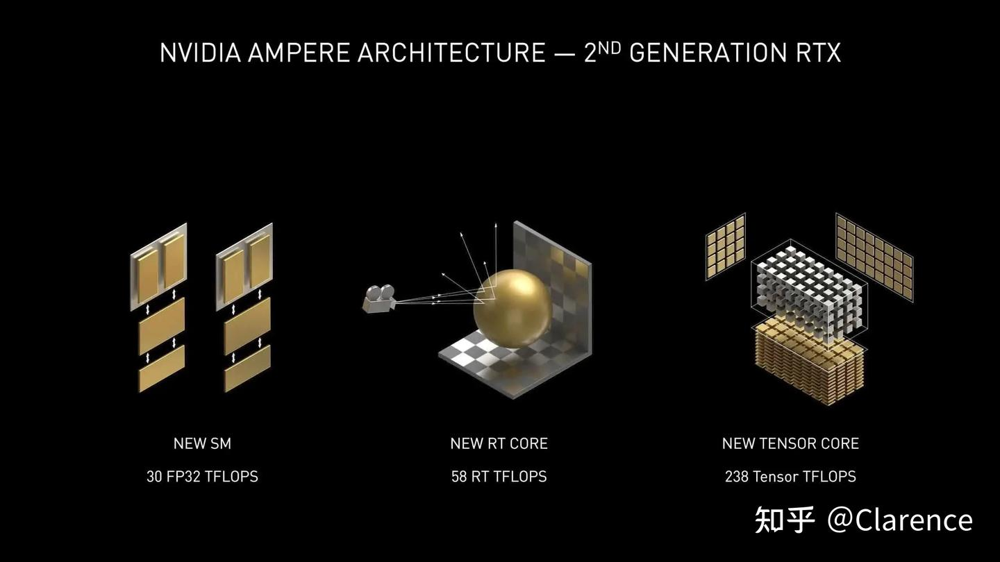
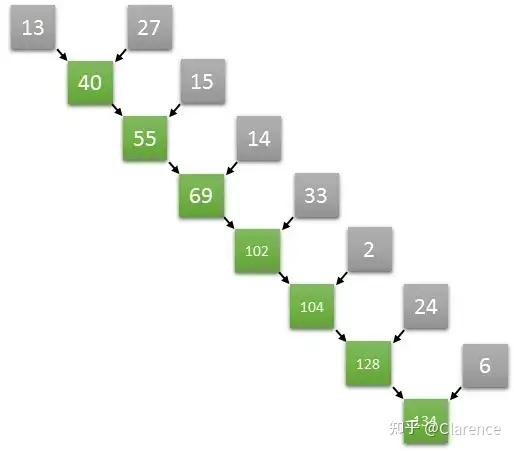
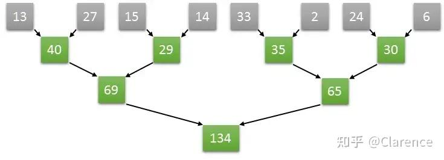
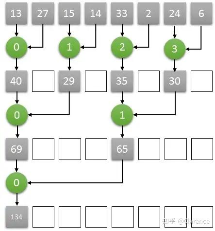
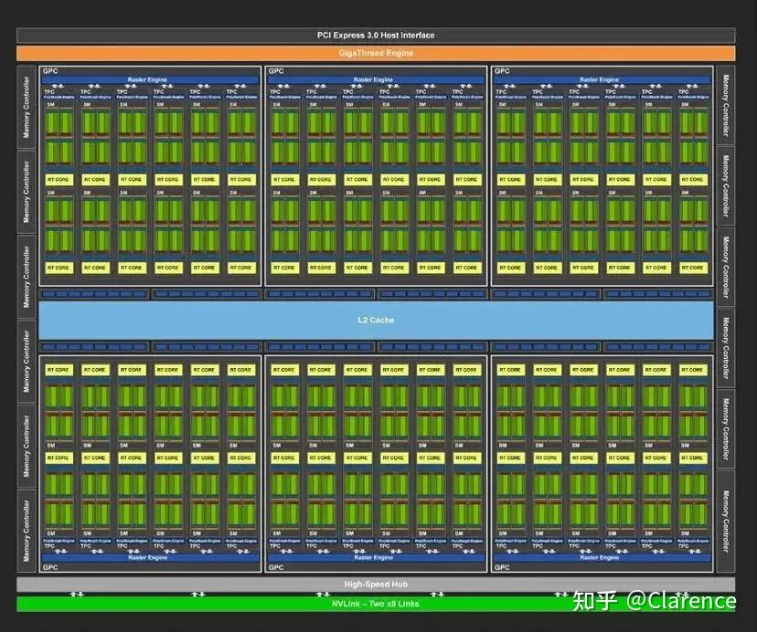
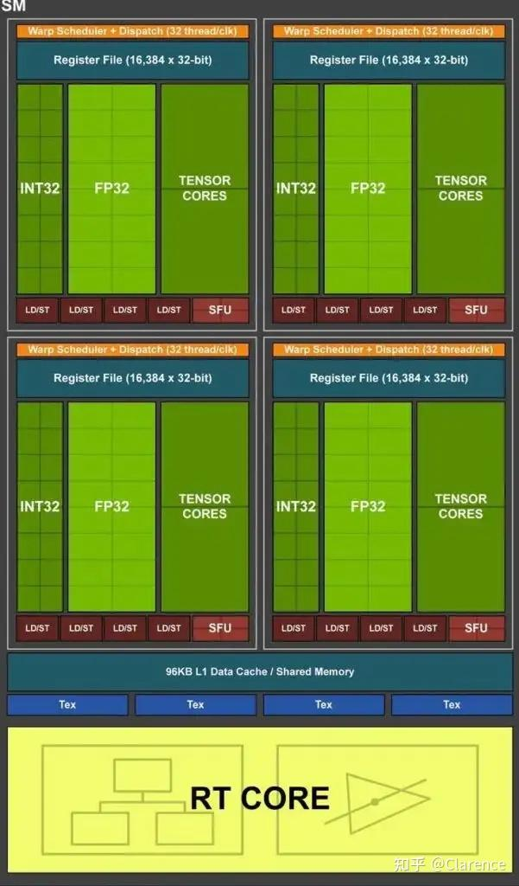

## 前言

国内关于GPU底层硬件结构的资料太少了，笔者是新进GPU行业从业者，之前在CPU芯片行业做一些底层软件驱动开发工作，深知熟悉CPU的底层[结构原理](https://zhida.zhihu.com/search?content_id=221060009&content_type=Article&match_order=1&q=结构原理&zhida_source=entity)对驱动编写和阅读他人驱动代码大有裨益，因此寻找一些文章，熟悉GPU的底层工作原理，恰好看到一篇老外的社区博客，故翻译至此，与君共同学习。

原文地址 ：[Understanding the architecture of a GPU | by Vitality Learning | CodeX | Medium](https://link.zhihu.com/?target=https%3A//medium.com/codex/understanding-the-architecture-of-a-gpu-d5d2d2e8978b)

Author ：Vitality Learning

## 正文

有一篇文章名为<The evolution of a GPU: from gaming to computing >，这篇文章非常热烈的讨论了这些年GPU的进步，这引发了我们的一些思考，为什么我们总是强调说GPU比CPU要强大，既然GPU强大，为什么不能取代CPU呢？

答案就是CPU工作方式和GPU的工作方式截然不同，下面的两张图有助于帮助我们理解CPU和GPU的工作方式的不同。

左图：CPU architecture 右图： GPU architecture.

上图有几个重点的元素，也是我们下文重点要阐述的概念，绿色代表的是[computational units](https://zhida.zhihu.com/search?content_id=221060009&content_type=Article&match_order=1&q=computational+units&zhida_source=entity)(可计算单元) 或者称之为 cores(核心)，橙色代表memories（内存） ，黄色代表的是control units（[控制单元](https://zhida.zhihu.com/search?content_id=221060009&content_type=Article&match_order=1&q=控制单元&zhida_source=entity)）。

因此想要理解GPU的底层核心构成，就必须明确这几个元素的作用，下文会逐一讲解每个元素的作用。

### 1，Computational units(cores)

总的来看，我们可以这样说：CPU的Computational units是“大”而“少”的，然而GPU的Computational units是“小”而“多”的，这里的大小是指的计算能力，多少指的是设备中的数量。通过观察上图，显然可以看出，绿色的部分，CPU“大少”，GPU“小多”的特点。

CPU的cores 比GPU的cores要更加聪明(smarter)，这也是所谓“大”的特点。

在过去的很长时间里，CPU的core计算能力增长是得益于主频时钟最大的频率增长。相反，GPU不仅没有主频时钟的提升，而且还经历过主频下降的情况，因为GPU需要适应嵌入式应用环境，在这个环境下对功耗的要求是比较高的，不能容忍超高主频的存在。例如[英伟达](https://zhida.zhihu.com/search?content_id=221060009&content_type=Article&match_order=1&q=英伟达&zhida_source=entity)的Jetson NANO,安装在[室内导航](https://zhida.zhihu.com/search?content_id=221060009&content_type=Article&match_order=1&q=室内导航&zhida_source=entity)机器人身上，就是一个很好的嵌入式环境应用示例，安装在机器人身上，就意味着使用电池供电，GPU的功耗不可以过高。(see,[Indoor Mapping and Navigation Robot Build with ROS and Nvidia Jetson Nano](https://link.zhihu.com/?target=https%3A//www.youtube.com/watch%3Fv%3Du9l-8LZC2Dc)):

CPU比GPU聪明，很大一个原因就是CPU拥有"out-of-order exectutions"（乱序执行）功能。出于优化的目的，CPU可以用不同于输入指令的顺序执行指令，当遇到分支的时候，它可以预测在不久的将来哪一个指令最有可能被执行到（multiple branch prediction 多重[分支预测](https://zhida.zhihu.com/search?content_id=221060009&content_type=Article&match_order=1&q=分支预测&zhida_source=entity)）。通过这种方式，它可以预先准备好[操作数](https://zhida.zhihu.com/search?content_id=221060009&content_type=Article&match_order=1&q=操作数&zhida_source=entity)，并且提前执行他们（soeculative execution [预测执行](https://zhida.zhihu.com/search?content_id=221060009&content_type=Article&match_order=1&q=预测执行&zhida_source=entity)），通过上述的几种方式节省了程序运行时间。

显然现代CPU拥有如此多的提升性能的机制，这是比GPU聪明的地方。

相比之下，GPU的core不能做任何类似out-of-order exectutions那样复杂的事情，总的来说，GPU的core只能做一些最简单的[浮点运算](https://zhida.zhihu.com/search?content_id=221060009&content_type=Article&match_order=1&q=浮点运算&zhida_source=entity),例如 multiply-add(MAD)或者 fused multiply-add(FMA)指令

通过上图可以看出MAD指令实际是计算A*B+C的值。

实际上，现代GPU结构，CORE不仅仅可以结算FMA这样简单的运算，还可以执行更加复杂的运算操作，例如tensor张量(tensor core)或者光线追踪(ray tracing core)相关的操作。

张量计算tensor core

光线追踪

张量核心(tensor cores)的目的在于服务张量操作在一些人工智能运算场合，[光纤追踪](https://zhida.zhihu.com/search?content_id=221060009&content_type=Article&match_order=1&q=光纤追踪&zhida_source=entity)（ray tracing） 旨在服务超现实主义（hyper-realistic）[实时渲染](https://zhida.zhihu.com/search?content_id=221060009&content_type=Article&match_order=1&q=实时渲染&zhida_source=entity)的场合。

上文说到，GPU Core最开始只是支持一些简单的浮点运算FMA,后来经过发展又增加了一些复杂运算的机制tensor core以及[ray trace](https://zhida.zhihu.com/search?content_id=221060009&content_type=Article&match_order=1&q=ray+trace&zhida_source=entity)，但是总体来说GPU的计算灵活性还是比不上CPU的核心。

值得一提的是，GPU的编程方式是SIMD(Single Instruction Multiple Data)意味着所有Core的计算操作完全是在相同的时间内进行的，但是输入的数据有所不同。显然，GPU的优势不在于核心的处理能力，而是在于他可以大规模并行处理数据。

赛艇运动中，所有人同时齐心划船

GPU中每个核心的作用有点像[罗马帆船](https://zhida.zhihu.com/search?content_id=221060009&content_type=Article&match_order=1&q=罗马帆船&zhida_source=entity)上的桨手：鼓手打着节拍（时钟），桨手跟着节拍一同滑动帆船。

SIMD[编程模型](https://zhida.zhihu.com/search?content_id=221060009&content_type=Article&match_order=1&q=编程模型&zhida_source=entity)允许加速运行非常多的应用，对图像进行缩放就是一个很好的例子。在这个例子中，每个core对应图像的一个像素点，这样就可以并行的处理每一个像素点的缩放操作，如果这个工作给到CPU来做，需要N的时间才可以做完，但是给到GPU只需要一个[时钟周期](https://zhida.zhihu.com/search?content_id=221060009&content_type=Article&match_order=1&q=时钟周期&zhida_source=entity)就可以完成，当然，这样做的前提是有足够的core来覆盖所有的图像像素点。这个问题有个显著的特点，就是对一张图像进行缩放操作，各个像素点之间的信息是相互独立的，因此可以独立的放在不同的core中进行并行运算。我们认为不同的core操作的信息相互独立，是符合SIMD的模型的，使用SIMD来解决这样的问题非常方便。

但是，也不是所有的问题都是符合SIMD模型的，尤其在[异步问题](https://zhida.zhihu.com/search?content_id=221060009&content_type=Article&match_order=1&q=异步问题&zhida_source=entity)中，在这样的问题中，不同的core之间要相互交互信息，计算的结构不规则，[负载不均衡](https://zhida.zhihu.com/search?content_id=221060009&content_type=Article&match_order=1&q=负载不均衡&zhida_source=entity)，这样的问题交给GPU来处理就会比较复杂。

### 2，memory

回到这个文章的第一张图中来，我们接下来会讨论GPU和CPU内存方面的差别。

CPU的memory系统一般是基于DRAM的，在桌面PC中，一般来说是8G，在服务器中能达到数百（256）Gbyte。

CPU[内存系统](https://zhida.zhihu.com/search?content_id=221060009&content_type=Article&match_order=1&q=内存系统&zhida_source=entity)中有个重要的概念就是cache，是用来减少CPU访问DRAM的时间。cache是一片小，但是访问速度更快，更加靠近处理器核心的内存段，用来储存DRAM中的数据副本。cache一般有一个分级，通常分为三个级别L1，L2，L3 cache，cache离核心越近就越小访问越快，例如 L1可以是64KB L2就是256KB L3是4MB。

CPU Cache的内容不再这里展开讲解，感兴趣的读者可以自行查阅资料。

从第一张图可以看到GPU中有一大片橙色的内存，名称为DRAM，这一块被称为全局内存或者GMEM。GMEM的内存大小要比CPU的DRAM小的多，在最便宜的显卡中一般只有几个G的大小，在最好的显卡中GMEM可以达到24G。GMEM的尺寸大小是[科学计算](https://zhida.zhihu.com/search?content_id=221060009&content_type=Article&match_order=1&q=科学计算&zhida_source=entity)使用中的主要限制。十年前，显卡的容量最多也就只有512M,但是，现在已经完全克服了这个问题。

关于cache，从第一张图中不难推断，左上角的小橙色块就是GPU的cache段。然而GPU的[缓存机制](https://zhida.zhihu.com/search?content_id=221060009&content_type=Article&match_order=1&q=缓存机制&zhida_source=entity)和CPU是存在一定的差异的，稍后将会证明这一点。

### 理解GPU的底层结构

为了充分理解GPU的架构，让我们在返回来看下第一张图，一个显卡中绝大多数都是计算核心core组成的海洋。

在[图像缩放](https://zhida.zhihu.com/search?content_id=221060009&content_type=Article&match_order=1&q=图像缩放&zhida_source=entity)的例子中，core与core之间不需要任何协作，因为他们的任务是完全独立的，然而，GPU解决的问题不一定这么简单，让我们来举个例子。

假设我们需要对一个数组里的数进行求和，这样的运算属于reductuin family类型，因为这样的运算试图将一个序列“reduce”简化为一个数。计算数组的元素总和的操作看起来是顺序的，我们只需要获取第一个元素，求和到第二个元素中，获取结果，再将结果求和到第三个元素，以此类推。

Sequential reduction

令人惊讶的是，一些看起来本质是顺序的运算，其实可以再[并行算法](https://zhida.zhihu.com/search?content_id=221060009&content_type=Article&match_order=1&q=并行算法&zhida_source=entity)中转化。假设一个长度为8的数组，在第一步中完全可以[并行执行](https://zhida.zhihu.com/search?content_id=221060009&content_type=Article&match_order=1&q=并行执行&zhida_source=entity)两个元素和两个元素的求和，从而同时获得四个元素，两两相加的结果，以此类推，通过并行的方式加速数组求和的运算速度。具体的操作如下图所示，

Parallel reduction

如上图计算方式，如果是长度为8的数组两两并行求和计算，那么只需要三次就可以计算出结果。如果是顺序计算需要8次。如果按照两两并行相加的算法，N个数字相加，那么仅需要log2（N）次就可以完成计算。

从GPU的角度来讲，只需要四个core就可以完成长度为8的数组求和算法，我们将四个core编号为0，1，2，3。

那么第一个时钟下，两两相加的结果通过0号core计算，放入了0号core可以访问到的内存中，另外两两对分别由1号2号3号core来计算，第二个个时钟继续按照之前的算法计算，只需要0号和1号两个core即可完成，以此类推，最终的结果将在第三个时钟由0号core计算完成，并储存在0号core可以访问到的内存中。这样实际三次就能完成长度为8的数组求和计算。

Parallel reduction with a GPU

如果GPU想要完成上述的推理计算过程，显然，多个core之间要可以共享一段内存空间以此来完成数据之间的交互，需要多个core可以在共享的内存空间中完成读/写的操作。我们希望每个Cores都有交互数据的能力，但是不幸的是，一个GPU里面可以包含数以千计的core，如果使得这些core都可以访问共享的内存段是非常困难和昂贵的。出于成本的考虑，折中的解决方案是将各类GPU的core分类为多个组，形成多个[流处理器](https://zhida.zhihu.com/search?content_id=221060009&content_type=Article&match_order=1&q=流处理器&zhida_source=entity)(Streaming Multiprocessors )或者简称为SMs。

### 最终的GPU结构

The Turing architecture

上图的绿色部分意味着Core计算单元，绿色的块就是上文谈到的Streaming Multiprocessors，理解为Core的集合。黄色的部分名为RT COREs画的离SMs非常近。单个SM的图灵架构如下图所示

The Turing SM

在SM的图灵结构中，绿色的部分CORE相关的，我们进一步区分了不同类型的CORE。主要分为INT32,FP32，TENSOR CORES。

FP32 Cores，执行单进度浮点运算，在TU102卡中，每个SM由64个FP32核，TU120由72个SMs因此，FP32 Core的数量是 72 * 64。

FP64 Cores. 实际上每个SM都包含了2个64位浮点计算核心FP64 Cores，用来计算双精度浮点运算，虽然上图没有画出，但是实际是存在的。

Integer Cores，这些core执行一些对整数的操作，例如地址计算，可以和浮点运算同时执行指令。在前几代GPU中，执行这些整型操作指令都会使得浮点运算的管道停止工作。TU102总共由4608个Integer Cores，每个SM有64个SM。

Tensor Cores，张量core是FP16单元的变种，认为是半精度单元，致力于[张量积](https://zhida.zhihu.com/search?content_id=221060009&content_type=Article&match_order=1&q=张量积&zhida_source=entity)算加速常见的深度学习操作。图灵张量Core还可以执行INT8和INT4精度的操作，用于可以接受量化而且不需要FP16精度的应用场景，在TU102中，我们每个SM有8个张量Cores，一共有8 * 72个Tensor Cores。

在大致描述了GPU的执行部分之后，让我们回到上文提出的问题，各个核心之间如何完成彼此的协作？

在四个SM块的底部有一个96KB的L1 Cache，用浅蓝色标注的。这个cache段是允许各个Core都可以访问的段，在L1 Cache中每个SM都有一块专用的[共享内存](https://zhida.zhihu.com/search?content_id=221060009&content_type=Article&match_order=1&q=共享内存&zhida_source=entity)。作为芯片上的L1 cache他的大小是有限的，但它非常快，肯定比访问GMEM快得多。

实际上L1 CACHE拥有两个功能，一个是用于SM上Core之间相互共享内存，另一个则是普通的cache功能。当Core需要协同工作，并且彼此交换结果的时候，编译器编译后的指令会将部分结果储存在共享内存中，以便于不同的core获取到对应数据。当用做普通cache功能的时候，当core需要访问GMEM数据的时候，首先会在L1中查找，如果没找到，则回去L2 cache中寻找，如果L2 cache也没有，则会从GMEM中获取数据，L1访问最快 L2 以及GMEM递减。缓存中的数据将会持续存在，除非出现新的数据做替换。从这个角度来看，如果Core需要从GMEM中多次访问数据，那么编程者应该将这块数据放入功能内存中，以加快他们的获取速度。其实可以将共享内存理解为一段受控制的cache，事实上L1 cache和共享内存是同一块电路中实现的。编程者有权决定L1 的内存多少是用作cache多少是用作共享内存。

最后，也是比较重要的是，可以储存各个core的计算中间结果，用于各个核心之间共享的内存段不仅仅可以是共享内存L1，也可以是[寄存器](https://zhida.zhihu.com/search?content_id=221060009&content_type=Article&match_order=1&q=寄存器&zhida_source=entity)，寄存器是离core最近的内存段，但是也非常小。最底层的思想是每个线程都可以拥有一个寄存器来储存中间结果，每个寄存器只能由相同的一个线程来访问，或者由相同的warp或者组的线程访问。

## 小结

这篇文章，主要阐述了GPU的基本底层构成，主要是以TU120来举例，讲解了GPU计算核心 Cores,以及Memory以及控制单元，三大组成要素。Core是计算的基本单元，既可以用作简单的浮点运算，又可以做一些复杂的运算例如，tensor 或者ray tracing。文中谈到了多个core之间通讯的方式，在特定的应用场合多个core之间是不需要的通讯的，也就是各干各的（例如 图像缩放），但是也有一些例子，多个core之间要相互通讯配合（例如上文谈到的数组求和问题），每个core之间都可以实现交互数据是非常昂贵的，因此提出了SMs的概念，SMs是多个core的集合，一个SMs里面的cores可以通过L1 Cache进行交互信息，完成使用GPU处理数组求和问题的时候，多个核心共享数据的功能。

关于memory，文章谈到，存在全局的内存GMEM，但是访问较慢，Cores当需要访问GMEM的时候会首先访问L1,L2如果都miss了，那么才会花费大代价到GMEM中寻找数据。

读了这篇来自Vitality Learning的文章，我对GPU的底层硬件结构有了初步认识，收益颇丰！

