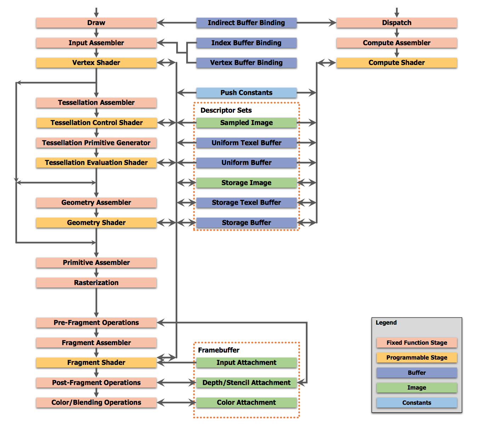

# Vulkan中的heap/memory/buffer/image对象

这篇文章主要是在阅读[vulkan spec](https://zhida.zhihu.com/search?content_id=2495194&content_type=Article&match_order=1&q=vulkan+spec&zhida_source=entity)的第十章，memory allocation，以及第十一章，resource allocation部分的一些小结和个人理解。

## Heap

相信大家都知道，vulkan api设计的一个非常重要的特点，就是向app暴露了许多细节，方便app根据自己的情况来优化场景。谈到resource的时候，vulkan同样如此。

在vulkan中，首先有一个叫做heap的概念。其实heap相信大家都已经有所了解，可以认为就是一个有着不同属性的memory pool. app显然可以根据它自己对资源的理解，讲不同用途的资源申请分配到不同属性的heap中去。但在之前的API，如ogl, d3d11.3等，资源的属性更多的时候是作为一个hint，在资源创建的时候传递给driver，由driver来最终决定将资源分配到何处。例如，在d3d11.3中，创建资源的时候可以指定用途，从default/dynamic/immutable/staging中选择一项，然后driver负责根据用途来挑选不同的memory类型。

然而，在vulkan中，资源对象，例如buffer和image，以及资源对象实际使用的memory，这两个概念已经剥离开来了。也就是说，在vulkan中，创建一个对象，并不会同时为这个对象分配相应的memory。memory需要从heap中分配出来，然后和对象来一次association，对象才真正地有了memory来存放其中的内容。

在具体了解heap之前，我们还需要区分两个非常重要的概念，即所谓的host memory和device memory。vulkan中所谓的host memory，指的是所有由实现来维护，对设备不可见的存储部分。host memory的最佳体现，就是在vulkan中，调用各式各样的api创建对象的时候，可选择的一个参数VkAllocationCallbacks。这个对象内部包含了一系列的回调函数和所需要创建对象的meta信息，一个vulkan的实现可以使用这个来做自己的host memory维护。所以，host memory对我们而言并无多大用处，它的目的主要是为给driver提供便利。而device memory，就是各种各样对设备可见的memory。我们在接下来提到memory的时候，指的都是device memory。

回到heap的概念上，heap本身作为一个硬件支撑的对象，属于physical device的scope，所以，可以用一个[vkGetPhysicalDeviceMemoryProperties(3)](https://link.zhihu.com/?target=https%3A//www.khronos.org/registry/vulkan/specs/1.0/man/html/vkGetPhysicalDeviceMemoryProperties.html) api来获取硬件可用的heap资源的信息。这个api返回的数据结构是一个[VkPhysicalDeviceMemoryProperties(3)](https://link.zhihu.com/?target=https%3A//www.khronos.org/registry/vulkan/specs/1.0/man/html/VkPhysicalDeviceMemoryProperties.html)的对象，其摘要如下：

```cpp
typedef struct VkPhysicalDeviceMemoryProperties {
    uint32_t        memoryTypeCount;
    VkMemoryType    memoryTypes[VK_MAX_MEMORY_TYPES];
    uint32_t        memoryHeapCount;
    VkMemoryHeap    memoryHeaps[VK_MAX_MEMORY_HEAPS];
} VkPhysicalDeviceMemoryProperties;
```

heap的信息以一种非常不直观的形式，由这种数据结构展示出来。其中，真正的heap存放在memoryHeaps数组中，这个数组本身的大小是固定的，但是其中有效的heap个数由memoryHeapCount指定。一个[VkMemoryHeap(3)](https://link.zhihu.com/?target=https%3A//www.khronos.org/registry/vulkan/specs/1.0/man/html/VkMemoryHeap.html)只包含两个信息，第一个是heap的大小，第二个则是一个掩码数，目前只有一个选项可选：是否是device-local的。vulkan规定所有的heap中，至少有一个必须设置为device-local。

[VkMemoryHeap(3)](https://link.zhihu.com/?target=https%3A//www.khronos.org/registry/vulkan/specs/1.0/man/html/VkMemoryHeap.html)对象的信息也太少了，关于heap的其他一些必要的信息，都保存在另一个类似的数组中，即memoryTypes，一个[VkMemoryType(3)](https://link.zhihu.com/?target=https%3A//www.khronos.org/registry/vulkan/specs/1.0/man/html/VkMemoryType.html)才真正描述了heap的属性。然而，memoryTypes数组和memoryHeaps数组之间并不是一一对应的关系，在一个[VkMemoryType(3)](https://link.zhihu.com/?target=https%3A//www.khronos.org/registry/vulkan/specs/1.0/man/html/VkMemoryType.html)中，保存了一个索引，这个索引表明这个[VkMemoryType(3)](https://link.zhihu.com/?target=https%3A//www.khronos.org/registry/vulkan/specs/1.0/man/html/VkMemoryType.html)所描述的是memoryHepas数组中的哪一个heap。这样一来，多个不同的[VkMemoryType(3)](https://link.zhihu.com/?target=https%3A//www.khronos.org/registry/vulkan/specs/1.0/man/html/VkMemoryType.html)可以指向同一个[VkMemoryHeap(3)](https://link.zhihu.com/?target=https%3A//www.khronos.org/registry/vulkan/specs/1.0/man/html/VkMemoryHeap.html)对象，即一个heap对象可以有着多个不同的类型描述。后续我们会看到，在有些时候，type比heap本身更加重要。

[VkMemoryType(3)](https://link.zhihu.com/?target=https%3A//www.khronos.org/registry/vulkan/specs/1.0/man/html/VkMemoryType.html)除了一个索引之外，还保存了这个type的细节，同样用一个掩码数来表示，可选的有

- 是否是device-local的，这个与heap中的device-local是不同的，并且只有heap有device-local设置的时候，type才可以设置为device-local
- 是否是host-visible的
- 是否是host-coherent的
- 是否是host-cached的
- 是否是lazily-allocated的，如果设置了这个的话，type只能是device-local加上lazily-allocated，不可以有其他多余掩码位。

vulkan实现保证至少有一个heap，其对应的type至少设置了host-visible+host-coherent。这里需要提一下host-coherent，根据vulkan spec中的定义，这个coherent的概念似乎只要求memory在map和unmap之间，不需要使用flush/invalidate相关的API将 cpu写对gpu可见/gpu写对cpu可见，并没有其他的要求。我想这个coherent并不会要求诸如ARM已经实现的CPU和GPU之间的双向数据一致性吧，否则的话对于其他没有掌握自己的总线技术的GPU厂商而言，做这个也太难了。

这里有一个叫做lazily-allocated的概念，vulkan中，lazily-allocated的heap中分出来的memory对象只能和有着transient_attachment使用位的image使用。这么分析下来，大概可以将lazily-allocated分配的memory对象结合renderpass优化出来的临时对象，在运行的时候动态分配，甚至不为transient对象分配实际的物理空间，从而减少存储消耗。不过lazily-allocated目前只能算是一个performance-hint，从公开的资料来看，没有哪家gpu厂商实现了这个功能。

type的这些掩码位可以有多种可能的组合，vulkan保证这些组合在memoryTypes数组中按照一种**偏序**的方式排列。关于偏序的定义可以参考vulkan是spec, 10.2章，核心的一点就是让app可以在最靠前的位置找到满足自己要求，并且没有或者尽量少地拥有其他掩码位的type。例如，app可能只需要一个device-local+host-visible的heap，那么device-local+host-visible如果存在的话一定会被app从低往高检索的时候第一个找到，如果不存在device_local+host-visible的heap，那么可能一个device_local+host_visible+host-coherent的type可以被第一个检测到，或者这种类型不存在的情况下第一个检测到的是device_local+host_visible+host_coherent+host-cached，按照兼容性顺序，一个一个排列。

## Memory

我们一般时候说的memory，都是指存储空间（不一定是cpu的内存，也可能是gpu的显存），而在vulkan中，memory也特制memory对象，即从一个heap中分配出来的、可以为image/buffer做back的对象。当我们谈到memory对象的时候，我们指的是vulkan中的memory概念，其他时候，我们谈memory，指的就是存储空间。

有了heap之后，我们就可以从中分配memory对象了，分配的方法很简单，使用[vkAllocateMemory(3)](https://link.zhihu.com/?target=https%3A//www.khronos.org/registry/vulkan/specs/1.0/man/html/vkAllocateMemory.html)即可。分配主要需要的信息都在[VkMemoryAllocateInfo(3)](https://link.zhihu.com/?target=https%3A//www.khronos.org/registry/vulkan/specs/1.0/man/html/VkMemoryAllocateInfo.html)数据结构中体现，其摘要如下：

```cpp
typedef struct VkMemoryAllocateInfo {
    VkStructureType    sType;
    const void*        pNext;
    VkDeviceSize       allocationSize;
    uint32_t           memoryTypeIndex;
} VkMemoryAllocateInfo;
```

前两项照例不用关心，第三项allocationSize给出了需要分配的memory的大小，第四项则是所需要memory的type索引。注意这里用的是type的索引，而不是直接指定heap的方式，这就是我们之前提到过的type比heap本身更重要的一个体现。此外，给出type索引而不是指定heap，也允许driver可以在满足分配要求的前提下，自行调整heap的负载，而不用app特意去关心这些过于细节的东西。不过，在有些uma平台，可能只有一个heap，这个时候做这些负载均衡就没有什么意义了。

分配出来的memory对象所满足的对齐条件由实现自行决定，分配保证memory满足实现所提出的条件。

一个memory对象在生命周期的尽头，由[vkFreeMemory(3)](https://link.zhihu.com/?target=https%3A//www.khronos.org/registry/vulkan/specs/1.0/man/html/vkFreeMemory.html)释放。当释放一个memory对象的时候，app应当保证此时device不再引用此memory对象上所关联的image/buffer。

对于从带有host-visible掩码位申请出来的memory对象，app可以使用[vkMapMemory(3)](https://link.zhihu.com/?target=https%3A//www.khronos.org/registry/vulkan/specs/1.0/man/html/vkMapMemory.html)来获取cpu侧的指针以访问其中的内容，然后使用[vkUnmapMemory(3)](https://link.zhihu.com/?target=https%3A//www.khronos.org/registry/vulkan/specs/1.0/man/html/vkUnmapMemory.html)来释放。如果过程中有cpu写，则可能需要使用[vkFlushMappedMemoryRanges(3)](https://link.zhihu.com/?target=https%3A//www.khronos.org/registry/vulkan/specs/1.0/man/html/vkFlushMappedMemoryRanges.html)来使得cpu写对gpu可见，或者相反，如果有gpu写，则需要使用[vkInvalidateMappedMemoryRanges(3)](https://link.zhihu.com/?target=https%3A//www.khronos.org/registry/vulkan/specs/1.0/man/html/vkInvalidateMappedMemoryRanges.html)使得其对cpu可见。当然，如果掩码位同时还有host-coherent，那么就不需要这两个api了。在heap保证host-coherent对前提下，调用这两个API也不是不可以，只不过可能会有performance issue. 这些api以及相关联的数据结构还是相对比较简单，可以self-explanation的，所以理解起来应该不会有什么困难。

## Buffer

在讨论buffer和image之前，先让我们看一看vulkan中有哪些类型的buffer以及image。首先是一张来自于vulkan官方spec的图，



从图中我们可以看到，vulkan中使用的buffer类型主要有：

- indirect buffer
- index buffer
- vertex buffer
- uniform texel buffer
- uniform buffer
- storage texel buffer
- storage buffer

当使用[vkCreateBuffer(3)](https://link.zhihu.com/?target=https%3A//www.khronos.org/registry/vulkan/specs/1.0/man/html/vkCreateBuffer.html)创建一个buffer对象的时候，在创建信息[VkBufferCreateInfo(3)](https://link.zhihu.com/?target=https%3A//www.khronos.org/registry/vulkan/specs/1.0/man/html/VkBufferCreateInfo.html)中，我们就要指定这个buffer对象可能的使用场景。除了上述七种有着一一对应的使用掩码位之外，还有额外的两个，分别表示buffer是否可以作为transfer的src或者dst。此外还可以设置是否创建sparse的资源，以及其在queue family之间共享或者独享等信息。

当我们创建好了一个buffer对象后，我们需要将它和一个memory对象关联起来，这样才可以真正让这个buffer对象拥有memory。关联是通过[vkBindBufferMemory(3)](https://link.zhihu.com/?target=https%3A//www.khronos.org/registry/vulkan/specs/1.0/man/html/vkBindBufferMemory.html)来完成的，然而，直接binding可能会失败，因为创建的buffer可能会有一些额外的要求，例如对齐等，所以在此之前，我们需要使用[vkGetBufferMemoryRequirements(3)](https://link.zhihu.com/?target=https%3A//www.khronos.org/registry/vulkan/specs/1.0/man/html/vkGetBufferMemoryRequirements.html)来获取这个buffer对象对于memory等要求。要求被填入一个[VkMemoryRequirements(3)](https://link.zhihu.com/?target=https%3A//www.khronos.org/registry/vulkan/specs/1.0/man/html/VkMemoryRequirements.html)的对象中，这个对象的摘要如下：

```cpp
typedef struct VkMemoryRequirements {
    VkDeviceSize    size;
    VkDeviceSize    alignment;
    uint32_t        memoryTypeBits;
} VkMemoryRequirements;
```

关于size和alignment，不再需要多提。需要注意的是最后一项，memoryTypeBits，这个可以看作是一个bool型的数组，从LSB开始，如果第i位置位，则表示我们在查询出来的heap信息中的memoryTypes数组的第i个type是支持这个资源的。的确是一种非常绕的方式，而且这里使用的也是memory type，而不是直接的heap。

对于一个texel的buffer，如uniform texel buffer或者storage texel buffer，shader如果需要使用的话，还需要用[vkCreateBufferView(3)](https://link.zhihu.com/?target=https%3A//www.khronos.org/registry/vulkan/specs/1.0/man/html/vkCreateBufferView.html)为其创建一个buffer view，才可以绑定到descriptor set上，创建信息保存在[VkBufferViewCreateInfo(3)](https://link.zhihu.com/?target=https%3A//www.khronos.org/registry/vulkan/specs/1.0/man/html/VkBufferViewCreateInfo.html)中，主要制定了view的format，以及view在buffer中的offset和range。

buffer和buffer view分别使用[vkDestroyBuffer(3)](https://link.zhihu.com/?target=https%3A//www.khronos.org/registry/vulkan/specs/1.0/man/html/vkDestroyBuffer.html)以及[vkDestroyBufferView(3)](https://link.zhihu.com/?target=https%3A//www.khronos.org/registry/vulkan/specs/1.0/man/html/vkDestroyBufferView.html)进行销毁。

## Image

vulkan中的image，大概相对于d3d中的texture, render target等，表示的是具有pixel array和mipmap结构的数据。从vulkan pipeline中，我们可以看出，image主要是作为shader resource的sampled image(即传统意义上的texture)，storage image，以及frame buffer中的input attachment, color attachment和depth/stencil attachment。然而相比于buffer简单的几个操作，由于image的一些特性，导致各个不同的实现之间对于image采用不同的存储策略，例如tile或者不tile，最终导致image对于host的可能的不透明特性，host操作image需要分出种种情况来克服这种困难。image部分比buffer部分的内容要多得多得多。

创建一个image，需要使用API [vkCreateImage(3)](https://link.zhihu.com/?target=https%3A//www.khronos.org/registry/vulkan/specs/1.0/man/html/vkCreateImage.html)，主要核心在于数据结构[VkImageCreateInfo(3)](https://link.zhihu.com/?target=https%3A//www.khronos.org/registry/vulkan/specs/1.0/man/html/VkImageCreateInfo.html)，其摘要如下：

```cpp
typedef struct VkImageCreateInfo {
    VkStructureType          sType;
    const void*              pNext;
    VkImageCreateFlags       flags;
    VkImageType              imageType;
    VkFormat                 format;
    VkExtent3D               extent;
    uint32_t                 mipLevels;
    uint32_t                 arrayLayers;
    VkSampleCountFlagBits    samples;
    VkImageTiling            tiling;
    VkImageUsageFlags        usage;
    VkSharingMode            sharingMode;
    uint32_t                 queueFamilyIndexCount;
    const uint32_t*          pQueueFamilyIndices;
    VkImageLayout            initialLayout;
} VkImageCreateInfo;
```

首先解释几个比较简答的部分，例如，imageType决定image是1d/2d/3d，注意这里没有cube的指定。format决定image的格式，extent决定其大小，mipLevels和arrayLayers则是其mip层数和数组维度，samples给出了采样个数。如同buffer创建的时候一样，创建image的时候也需要指定共享模式，以及可用的queue的family索引。

关于image的usage，指定了image潜在可能的使用目的，这同样是一个掩码数，可用的掩码位包括：

- transfer src，image可以作为一个transfer命令的src
- transfer dst, image可以作为一个transfer的dst
- sampled，image可以被采样
- storage，image可以作为一个storage image被shader使用
- color attachment，image可以作为RT或者resolved attachment
- depth/stencil attachment，image可以作为一个DSV
- transient attachment，临时的attachment，必须从lazily-allocated memroy分出来，可以作为一个performance hint
- input attachment，image可以作为framebuffer中的input attachment

tiling则决定了image本身的tile方法，包括linear和optimal两个选项。如果是linear的image，host可以预期其layout，从而从host正确访问其内容。然而，对host友好的linear对于device来说不一定友好。故而有optimal的tiling，这种是对device友好，但是对host而言基本不透明的tiling。更糟糕的是，由于各个vendor有着不同的结构设计，optimal的image layout基本是不兼容的。理解这一点，也是理解对于linear和optimal两种不同tiling格式image的使用限制的一个非常重要的点。

创建image时候，flags位上除了buffer有的那三种sparse外，还多了额外的两个掩码位。一个是muttable_format，即是否可以在image上创建与其兼容却并不完全一致的format的view. 另一个则是cube_compatible，当image是2d的时候，这指明是否可以创建cube，当然，如果是cube的话，image的extent中，width必须等于height。

接下来，是关于创建一个linear tiling的image的一些限制，只有当一下限制条件都满足的时候，vulkan才保证创建linear tiling的image是成功的，否则可能会创建失败，限制条件包括：

- 必须是2d
- format不能是depth/stencil，这是由于有些实现可能将depth/stencil放在一起，而有一些则可能分开放，所以如果format是depth/stencil则host是无法预期的
- miplevel和arrayLayers必须都是1
- 采样数只能是1
- 用途只包括transfer src和/或dst，不能包括其他的掩码位

这些限制条件基本上确定了linear tiling的image只能用来让host和device之间交换数据，而不能够让device来自己使用。

除此之外，最后一个参数，initialLayout，也是一个非常重要的参数。所谓的image layout大致指的就是image内部可能的摆放方式，可选的layout有：

- undefined
- general
- color attachment
- depth/stencil attachment
- depth/stencil read-only
- shader read-only
- transfer src
- transfer dst
- preinitialized

初始化时候的layout只能是undefined或者preinitialized。当一个image处于某种layout的时候，表明其内部可能为了当前的使用方式做了特殊的优化。故而，当从一种layout转到另一种layout的时候需要使用memory barrier来进行sync。关于这些layout具体的含义，可以参考[VkImageLayout(3)](https://link.zhihu.com/?target=https%3A//www.khronos.org/registry/vulkan/specs/1.0/man/html/VkImageLayout.html)部分。

前面提到过，对于linear tiling的image，host是可以预期其memory布局的。实际上，host可以使用[vkGetImageSubresourceLayout(3)](https://link.zhihu.com/?target=https%3A//www.khronos.org/registry/vulkan/specs/1.0/man/html/vkGetImageSubresourceLayout.html)来查询具体的subresource信息。然而，按照之前我们提到的约束，实际上linear tiling的image往往是一个没有mip-map，不是array的但采样2d的image，并且其format还不会是depth/stencil的。这个api需要接受一个[VkImageSubresource(3)](https://link.zhihu.com/?target=https%3A//www.khronos.org/registry/vulkan/specs/1.0/man/html/VkImageSubresource.html)的数据结构来指明子资源，而实际上linear tiling的image值可能有一个子资源。但是因为[VkImageSubresource(3)](https://link.zhihu.com/?target=https%3A//www.khronos.org/registry/vulkan/specs/1.0/man/html/VkImageSubresource.html)数据结构在其他地方也有用，所以这里就将其列了出来而已，再者，未来版本可能会放宽对linear tiling的限制（仅仅是说可能），所以api设计对时候还是要留下余地的。

host拿到linear tiling image的[VkSubresourceLayout(3)](https://link.zhihu.com/?target=https%3A//www.khronos.org/registry/vulkan/specs/1.0/man/html/VkSubresourceLayout.html)信息之后，就可以依靠这个来更新image的内容了。如果要将这个image用于除transfer src/dst之外的用途，则还需要在创建一个optimal tiling的image，然后将数据从linear tiling image transfer到optimal tiling的image才可以。这也是host向device upload texture数据的一种比较高效的方式。

如果需要在shader中使用image，必须通过frame buffer或者descriptor set，通过image view的方式才可以。创建image view是通过[vkCreateImageView(3)](https://link.zhihu.com/?target=https%3A//www.khronos.org/registry/vulkan/specs/1.0/man/html/vkCreateImageView.html)来完成的，这一部分的内容相对而言比较简单，直接看spec即可。

如同buffer和memory的binding一样，一个image首先需要使用[vkGetImageMemoryRequirements(3)](https://link.zhihu.com/?target=https%3A//www.khronos.org/registry/vulkan/specs/1.0/man/html/vkGetImageMemoryRequirements.html)来获取其对memory的要求，然后才可以用[vkBindImageMemory(3)](https://link.zhihu.com/?target=https%3A//www.khronos.org/registry/vulkan/specs/1.0/man/html/vkBindImageMemory.html)来将memory和image bind起来。