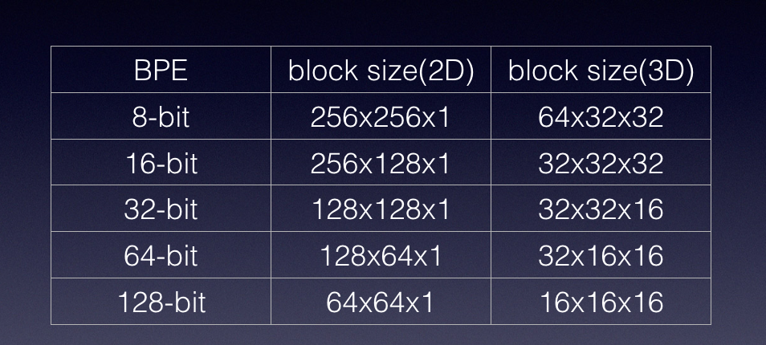
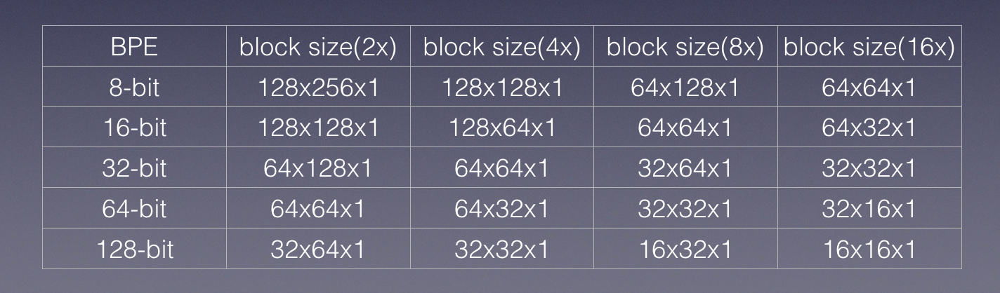

# vulkan中的sparse resource支持

之前一篇谈到了vulkan中的buffer和image对象，以及两者是如何绑定到一个memory对象上的。一般而言，这种绑定具有以下几个约束：

- 绑定必须是完全绑定，即一个buffer/image对象必须完全绑定到memory对象上。反之则不需要，即memory对象上不必只绑定一个buffer/image对象
- 绑定是连续的，这点很容易理解，buffer/image实际需要的存储空间在memory中以一个offset加上size来指定，这样的话实际上只能是一个连续的range才可以
- buffer/image对象只能绑定到一个memory对象上
- 绑定关系是不可变的，不存在所谓的“解除绑定”和“再次绑定”的概念

这样的设计虽然保证了硬件和driver实现的简单，却牺牲了app的灵活性。因此，vulkan同时提供了一个可选的sparse的概念，来一一破除上述限制条件。vulkan中的sparse特性包括如下三点：

1. [sparse binding](https://zhida.zhihu.com/search?content_id=2528800&content_type=Article&match_order=1&q=sparse+binding&zhida_source=entity)，除了必须遵守“完全绑定”这一条之外，放宽了其他三个限制条件，因此，与其说这是一个“稀疏绑定”，不如说是“离散绑定”（discrete binding）更加合适
2. sparse residency，同时放宽了所有的四项约束条件，这才是真正意义上的“稀疏绑定“
3. [sparse aliased](https://zhida.zhihu.com/search?content_id=2528800&content_type=Article&match_order=1&q=sparse+aliased&zhida_source=entity)，稀疏绑定时候可能存在的memory混叠

sparse binding是后边两项的基础，指定sparse residency或者sparse aliased的时候，必须同时指定sparse binding。

需要特别注明一点的是，sparse特性是以（可能）牺牲性能为代价来（潜在地）提高灵活性的，使用的时候需要认真评估一下，是否有必要。

## Sparse Binding

sparse binding，如前所说，允许将一个buffer/image对象的区域绑定到多个memory对象上，并且绑定可以被修改。只是sparse binding的资源在使用之前必须被完全绑定，故而实在谈不上什么“稀疏”，更准确的描述应该是“离散”吧。

buffer和image都可以使用sparse binding，并且所有格式的image，不管是linear tiling的，还是optimal tiling的，也都支持sparse binding。从这一点来看，sparse binding的资源和普通的资源除了在和memory对象上的映射关系之外，使用上基本没什么差别。

当绑定一个buffer或者image对象的时候，必须满足对齐以及粒度条件。对齐以及粒度，都是通过[VkMemoryRequirements(3)](https://link.zhihu.com/?target=https%3A//www.khronos.org/registry/vulkan/specs/1.0/man/html/VkMemoryRequirements.html)中的alignment参数给出的。一般来说，对于sparse的资源，对齐和粒度都是页面本身的大小，典型情况下，就是4kB。

我们都知道，buffer对象的线性存储方式是高度地host可预测的。故而，当一个buffer对象终端一段，例如，开始的4kB，被绑定到一个memory对象mem0上的4kB，而接下来的4-8kB，被绑定到另一个memory对象mem1上的4kB的时候，host可以预测到，当host访问buffer对象前4kB的内容的时候，一定会落在mem0上绑定的4kB，而不会落在mem1上。当然，规范中指明至于前4kB和mem0中的内存空间的映射关系是由实现自行决定的，但最普遍的做法，其实还是一一映射。

上述一段话看起来似乎是理所应当的。对于buffer而言的确如此，但是对于image而言，这种对象空间和存储空间的映射关系是无法保证的。整个image对象，都作为一整块opaque的东西，映射到绑定到memory(s)上，host是无法预知它访问memory哪一部分的时候会落到实际的哪个memory上。对于image而言，无论是linear tiling，还是optimal tiling，都是如此。

引入sparse binding的概念，一定程度上允许资源在创建的时候就预留好所需要的虚拟地址空间，而不用等到实际绑定到memory对象的时候才能够获取虚拟地址空间。

是否支持sparse binding可以通过[VkPhysicalDeviceFeatures(3)](https://link.zhihu.com/?target=https%3A//www.khronos.org/registry/vulkan/specs/1.0/man/html/VkPhysicalDeviceFeatures.html)中的sparseBinding成员来查询到。

## Sparse Residency

sparse residency特性需要sparse binding的支持，即创建buffer/image资源的时候应当同时指定sparse residency和sparse binding。sparse residency相比于sparse binding的提升点，就是不再要求资源在使用之前必须全部绑定（即全部拥有back memory空间）。那么，一个很显然的问题就出现了：如果device恰好访问到没有绑定memory部分的资源内容怎么办？

物理设备的限制，被保存在一个叫做[VkPhysicalDeviceProperties(3)](https://link.zhihu.com/?target=https%3A//www.khronos.org/registry/vulkan/specs/1.0/man/html/VkPhysicalDeviceProperties.html)的数据结构中，有一个成员类型是[VkPhysicalDeviceSparseProperties(3)](https://link.zhihu.com/?target=https%3A//www.khronos.org/registry/vulkan/specs/1.0/man/html/VkPhysicalDeviceSparseProperties.html)，在这个数据结构中，有一个bool值residencyNonResidentStrict指明了当device访问到没有绑定memory，即术语non-residency部分资源的行为。如果这个值为true，则读返回全零的数据，写被丢弃。如果这个值为false，则读返回未定义的数据，写同样被丢弃。我们可以看到，这个值主要控制读返回的数据究竟是定义好的全零，还是未定义的数据。由于cache本身的存在，严格地返回全零很可能是不现实的。例如，如果向non-residency写入一笔数据，然而这笔数据还没有真正抵达地址翻译部分，从而没有真正地被发现应当被丢弃，那么随后的读很可能直接命中写入数据的cache，从而提前返回。这一点在报feature的时候需要额外考虑到。

说回sparse residency，sparse residency的buffer除了不需要全部驻留外，与仅仅sparse binding的buffer别无二致。绑定时候的对齐和粒度条件也一模一样，由alignment决定。buffer是否支持sparse residency可以通过[VkPhysicalDeviceFeatures(3)](https://link.zhihu.com/?target=https%3A//www.khronos.org/registry/vulkan/specs/1.0/man/html/VkPhysicalDeviceFeatures.html)中的sparseResidencyBuffer来查询到。

但是，sparse residency的image就和仅仅sparse binding的image大不一样了。首先是格式上的支持，sparse residency仅支持optimal-tiling，并且format是color的那些非压缩的格式。format是depth/stencil，或者压缩格式的那些，是否支持sparse residency可以由实现自行决定，并且通过[vkGetPhysicalDeviceSparseImageFormatProperties(3)](https://link.zhihu.com/?target=https%3A//www.khronos.org/registry/vulkan/specs/1.0/man/html/vkGetPhysicalDeviceSparseImageFormatProperties.html)来查询。其次，仅仅是sparse binding的image因为使用之前必须全部绑定，所以我们不必去区分image本身哪一块区域需要绑定哪一块不需要。然而，sparse residency的image，要求必须提供一种机制，来指明image的layout和memory的footprint之间的对应关系。因此，vulkan中设计了一套比较复杂的机制来实现这一点，并且在其中引入了诸如mip-tail region，meta-data aspect等新的概念，我们随后会讲到。

sparse residency的image的支持是通过[VkPhysicalDeviceFeatures(3)](https://link.zhihu.com/?target=https%3A//www.khronos.org/registry/vulkan/specs/1.0/man/html/VkPhysicalDeviceFeatures.html)中的sparseResidencyImage2D/sparseResidencyImage3D/sparseResidency2Samples/sparseResidency4Samples/sparseResidency8Samples/sparseResidency16Samples 来体现的，其中需要特别强调一点的是，sparseResidencyImage2D仅仅指明对于单采样的2D image的支持，多采样（2/4/8/16）由随后的一系列值指定。

sparse residency的image做绑定的时候同样要满足对齐和粒度的条件，只不过这次决定对齐和粒度的并非都是alignment，alignment只决定对其对齐条件，一个叫做image sparse block的新的概念决定了粒度。所谓的image sparse block，可以认为是一个sparse residency的image的一个最小的绑定单位，不仅有形状，还有对应的内存空间的要求。事实上，此时的alignment的值就是image sparse block的size大小。

注意，image sparse block内部的对象和内存映射关系由实现自行决定。

vulkan中建议的image sparse block的内存空间是64kB，并且在不同的情况下，这么大空间能够放得下的image子区域的形状有：




并且，对于多采样的情况下，有：




如果一个实现决定遵从vulkan的建议，将其所支持的sparse residency的image sparse block的大小和形状设置为上述值，则我们认为这个实现遵从“标准”的sparse residency。这里的“标准”并非强制要求，只是建议的标准。在[VkPhysicalDeviceSparseProperties(3)](https://link.zhihu.com/?target=https%3A//www.khronos.org/registry/vulkan/specs/1.0/man/html/VkPhysicalDeviceSparseProperties.html)中，使用residencyStandard2DBlockShape/residencyStandard2DMultisampleBlockShape/residencyStandard3DBlockShape分别表示不同类型的image对“标准”image sparse block的支持。


对于特定条件的image，我们可以通过查询[VkSparseImageFormatProperties(3)](https://link.zhihu.com/?target=https%3A//www.khronos.org/registry/vulkan/specs/1.0/man/html/VkSparseImageFormatProperties.html)中，flags位是否包含掩码位K_SPARSE_IMAGE_FORMAT_NONSTANDARD_BLOCK_SIZE_BIT来获取是否支持“标准” image sparse block设定。如果实现支持标准image sparse block的话，[VkSparseImageFormatProperties(3)](https://link.zhihu.com/?target=https%3A//www.khronos.org/registry/vulkan/specs/1.0/man/html/VkSparseImageFormatProperties.html)中的imageGranularity必须和上述的形状匹配。当然，如果实现不支持标准image sparse block的话，imageGranularity将给出这个时候的image sparse block的形状。

对于同一个image，实现不能同时支持“标准”和“非标准”image sparse block，并且，如果支持“标准”的话，必须优先使用“标准”image sparse block。

现在，我们已经有了一个image中最小的绑定单位，不仅有大小，还有形状。例如，如果我们有一个512x512的2d image，bpe为8-bit，并且我们手上的显卡恰好支持标准的image sparse block。我们就可以将其拆成4个256x256的image sparse block，然后分别将这4个image sparse block任意地绑定到memory对象上，全部绑定，或者只绑定一部分，按顺序或者乱序，绑定到一个memory对象，或者分别绑定到多个上。只要我们满足绑定到最小粒度是一个image sparse block，我们就可以随心所欲。

当然，事情到这里还没有结束。还是以上边的数据为例，假如我们的2d image很不幸，是一个mip-map的texture，lod 0的image大小是512x512，这个没问题，4个image sparse block就可以搞定了。lod 1的是256x256，一个image sparse block刚好放得下。lod 2的image大小变成了128x128，放到一个image sparse block中似乎有点儿浪费资源，不过还好，也不算浪费太多。接下来是lod 3的64x64，lod 4的32x32，lod 5的16x16，一直到最后的1x1。从这里可以看出，假如为每个mip level都至少分配一个image sparse block的话，内存空间的浪费将是不可避免的，这与本来就致力于解决存储空间不足的sparse特性相矛盾。故而，这里又提出了一个mip-tail region的概念。那么，什么叫做mip-tail region呢？所谓的mip-tail region，就是将一个完整的mip-map资源中，从某些mip-level开始，往下所有的mip层都搜集到一个区域，叫做mip-tail区域。这个mip-tail区域的大小是image sparse block大小的整数倍，但是显然不应该有形状的约束，毕竟是多个mip-level的集合。并且，memory的foot print在mip-tail区域内部是由实现自行决定的。当绑定mip-map的image时，mip-tail区域必须被全部绑定。

在mip-tail的定义中，我提到了“某些mip-level开始”，那么究竟从哪一个mip-level开始呢？对于上述的例子，显然从lod 2开始是最合适的。然而，如果image sparse本身是768*768的呢？这样lod 1开始就是384*384，一个image sparse block放不下，四个image sparse block又有点儿多余。故而，vulkan在这里提到了一个aligned-mip-size的概念。如果设定为aligned-mip-size的话，那么mip-tail region就从第一个不对齐于image sparse block开始。如果没有设定aligned-mip-size的话，那么mip-tail region就从第一个小于image sparse block的mip-level开始。

aligned-mip-size体现在哪里呢？第一个体现就是在[VkPhysicalDeviceSparseProperties(3)](https://link.zhihu.com/?target=https%3A//www.khronos.org/registry/vulkan/specs/1.0/man/html/VkPhysicalDeviceSparseProperties.html)最后一个我们还没有提到的residencyAlignedMipSize部分，它决定了是否可能是aligned-mip-size的。如果这个值是false，则所有的mip-tail region都从第一个小于image sparse block的mip-level开始，没得商量。如果这个值是true，则要具体到每一个资源，来看看是不是从不对齐的那一个开始，这个类似于总控开关。具体到每一个资源的时候，资源查出来的[VkSparseImageFormatProperties(3)](https://link.zhihu.com/?target=https%3A//www.khronos.org/registry/vulkan/specs/1.0/man/html/VkSparseImageFormatProperties.html)中的flags位不仅仅有表示是否采用“标准”image sparse block的掩码位，还有一个叫做VK_SPARSE_IMAGE_FORMAT_ALIGNED_MIP_SIZE_BIT的掩码位，表示这个资源采用哪一种策略来组织mip-tail区域。

[VkSparseImageFormatProperties(3)](https://link.zhihu.com/?target=https%3A//www.khronos.org/registry/vulkan/specs/1.0/man/html/VkSparseImageFormatProperties.html)中的flags总共有三个掩码位，目前我们已经讲过其中的两个了，还有最后一个，VK_SPARSE_IMAGE_FORMAT_SINGLE_MIPTAIL_BIT，这个又是干什么的呢？这个实际上是为了array的resource做的优化。在array的resource中，如果每一个array都有自己单独的mip-tail region，很可能同样造成资源的浪费，我们可以将所有array slice的mip-tail region组织在一起，形成一个单独的mip-tail region，这就是名字里的single-miptail的含义了。

之前我们提过，sparse residency的image只要求支持color format。如果实现同时决定支持depth/stencil的format的话，还会带来一点儿麻烦的地方。这个麻烦就在于，depth/stencil的layout可以是seperate的，也可以是interleaved的。我们都知道，depth和stencil很多时候都是作为整体出现，例如D24S8格式，depth用24位，剩下的8位当作stencil，刚刚好32位。然而，具体实现的时候，可能由于某些原因，有些实现宁愿浪费一些资源，也要将depth和stencil分开放，depth用32位保存，只用到其中的24位，剩下的8位不要了。此外，stencil单独保存。如果大家都这么做的话也还好，麻烦就麻烦在某些实现还是将depth和stencil交织地摆放在一起。在支持sparse residency的时候，vulkan同时也要考虑到对这些支持的可能性，因此提出了aspect的概念。

aspect，就是指format中的一个方面。这个并不是说一个R8G8B8A8就分别有RGBA四个aspect，而是这个作为一个color的format，只有一个aspect，叫做color aspect。D24S8显然拥有两个aspect，叫做depth aspect和stencil aspect。此外，image可能有一些meta信息要保留在memory中，这些在作partial residency的时候也要全部绑定的，所以还有一个叫做metadata的aspect。在我们使用[vkGetImageSparseMemoryRequirements(3)](https://link.zhihu.com/?target=https%3A//www.khronos.org/registry/vulkan/specs/1.0/man/html/vkGetImageSparseMemoryRequirements.html)来查询一个具体的image对于memory layout的要求的时候，这些aspect可能会被分别报出来，故而app需要认真对待这些细节，做到正确地绑定。

## Sparse Aliased

sparse aliased就是多个buffer/image，或者一个buffer/image内部的不同区域，映射到同一个物理存储区域上。sparse aliased限制了aliasing只能发生在buffer和buffer之间，image和image之间。并且，如果image和image之间alias，则要保证format兼容，并且要使用同样的image sparse block形状。此外，由于mip-tail region和metadata aspect是opaque的，这两个部分是不能alias的，否则会出现为定义的行为。

## API

到目前为止，我们已经讲完了所有sparse resource相关的概念了。然而如何使用sparse resource，如何做binding，我们还没有提及。在这里，我们将会接触到这一部分，真正地把一个sparse resource和memory(s)绑定到一起。

不同于普通的[vkBindBufferMemory(3)](https://link.zhihu.com/?target=https%3A//www.khronos.org/registry/vulkan/specs/1.0/man/html/vkBindBufferMemory.html)和[vkBindImageMemory(3)](https://link.zhihu.com/?target=https%3A//www.khronos.org/registry/vulkan/specs/1.0/man/html/vkBindImageMemory.html)，将sparse的buffer/image绑定到memory(s)上是通过queue来执行的。而且这个queue于普通的 graphic/compute/transfer queue不一样，必须支持sparse。此外，往sparse queue上提交任务也并不是像graphic queue一样，录制命令到command buffer再提交，而是通过一个[vkQueueBindSparse(3)](https://link.zhihu.com/?target=https%3A//www.khronos.org/registry/vulkan/specs/1.0/man/html/vkQueueBindSparse.html) 的命令。这个命令的核心是一个[VkBindSparseInfo(3)](https://link.zhihu.com/?target=https%3A//www.khronos.org/registry/vulkan/specs/1.0/man/html/VkBindSparseInfo.html)的数组，其摘要如下：

```text
typedef struct VkBindSparseInfo {
    VkStructureType                             sType;
    const void*                                 pNext;
    uint32_t                                    waitSemaphoreCount;
    const VkSemaphore*                          pWaitSemaphores;
    uint32_t                                    bufferBindCount;
    const VkSparseBufferMemoryBindInfo*         pBufferBinds;
    uint32_t                                    imageOpaqueBindCount;
    const VkSparseImageOpaqueMemoryBindInfo*    pImageOpaqueBinds;
    uint32_t                                    imageBindCount;
    const VkSparseImageMemoryBindInfo*          pImageBinds;
    uint32_t                                    signalSemaphoreCount;
    const VkSemaphore*                          pSignalSemaphores;
} VkBindSparseInfo;
```

除了分别定义等待的semaphore，以及完成后的semaphore外，核心部分是三个数组，数组类型分别是[VkSparseBufferMemoryBindInfo(3)](https://link.zhihu.com/?target=https%3A//www.khronos.org/registry/vulkan/specs/1.0/man/html/VkSparseBufferMemoryBindInfo.html)，[VkSparseImageOpaqueMemoryBindInfo(3)](https://link.zhihu.com/?target=https%3A//www.khronos.org/registry/vulkan/specs/1.0/man/html/VkSparseImageOpaqueMemoryBindInfo.html)和[VkSparseImageMemoryBindInfo(3)](https://link.zhihu.com/?target=https%3A//www.khronos.org/registry/vulkan/specs/1.0/man/html/VkSparseImageMemoryBindInfo.html)。

[VkSparseBufferMemoryBindInfo(3)](https://link.zhihu.com/?target=https%3A//www.khronos.org/registry/vulkan/specs/1.0/man/html/VkSparseBufferMemoryBindInfo.html)用于绑定sparse的buffer，无论是fully-resident还是partial-resident的都是用这个数据结构来实现的。数据结构本身来说也很简单，不再多说。

[VkSparseImageOpaqueMemoryBindInfo(3)](https://link.zhihu.com/?target=https%3A//www.khronos.org/registry/vulkan/specs/1.0/man/html/VkSparseImageOpaqueMemoryBindInfo.html)用于绑定opaque的image，主要用于绑定fully-resident的image，或者partial-resident的image中的mip-tail region和meta-data aspect。其特点是所需要绑定的部分由于没有一个well-defined的mapping关系，故而需要全部绑定。这也是名字中的opaque的含义所在。除此之外，如果一个partial-residency的image，某一个mip-level的image需要全部绑定，也可以用这个来实现。

[VkSparseImageMemoryBindInfo(3)](https://link.zhihu.com/?target=https%3A//www.khronos.org/registry/vulkan/specs/1.0/man/html/VkSparseImageMemoryBindInfo.html)用于绑定partial-resident的image的子区域，因此这里定义了比较多的参数用于指定绑定的子区域位置以及其他信息。

在[vkQueueBindSparse(3)](https://link.zhihu.com/?target=https%3A//www.khronos.org/registry/vulkan/specs/1.0/man/html/vkQueueBindSparse.html) 中，实际提交了一系列的绑定操作。这些绑定操作按照数组中的顺序开始执行，但是可能会乱序结束。如果要保证顺序，需要使用同步原语。