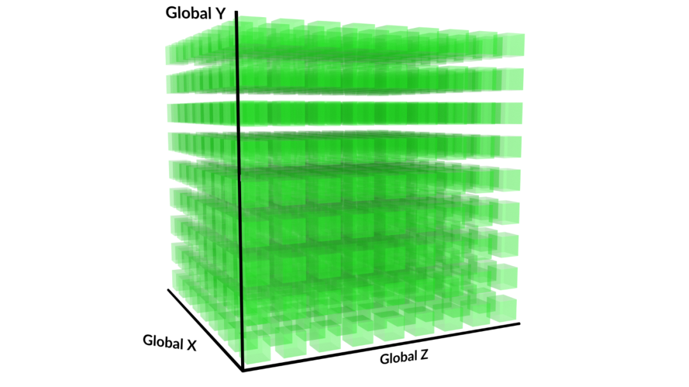
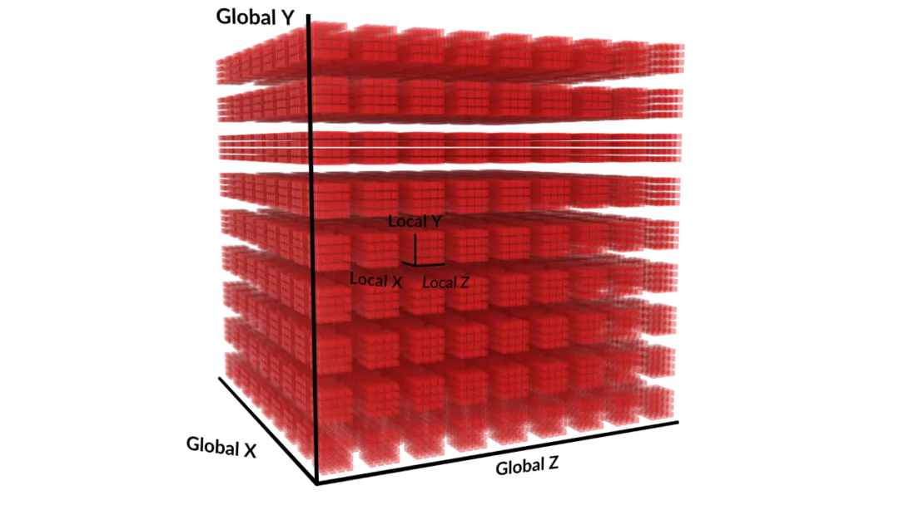
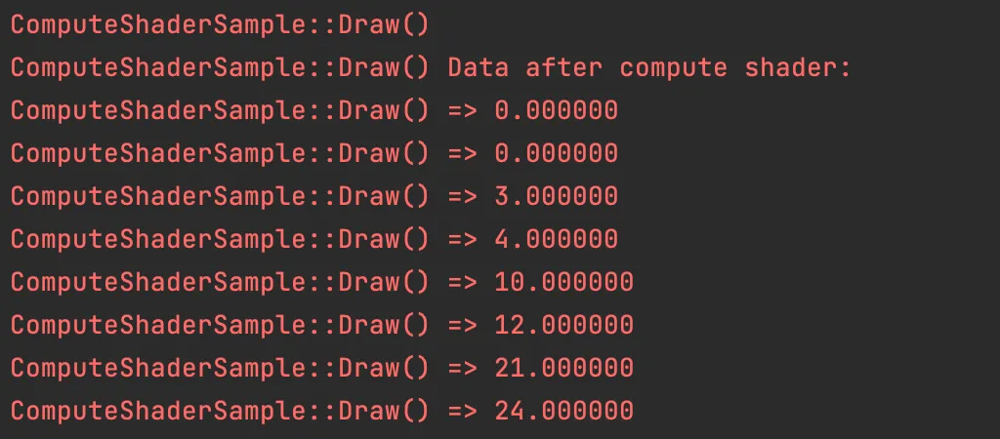

# OpenGL 计算着色器（Compute Shader ）你用过吗？

https://learnopengl.com/Guest-Articles/2022/Compute-Shaders/Introduction

https://mp.weixin.qq.com/s?__biz=MzIwNTIwMzAzNg==&mid=2654176464&idx=1&sn=1362413932e246aff15f7fdf55e60447&chksm=8d0f54939929af4a9301a6e3c0c960ec69d77d4c35fee4fdb8541bf159c225059308719c03a9#rd


Compute Shader 是 OpenGL ES（以及 OpenGL ）中的一种 Shader 程序类型，用于在GPU上执行通用计算任务。

**与传统的顶点着色器和片段着色器不同，Compute Shader 被设计用于在 GPU 上执行各种通用计算任务，而不是仅仅处理图形渲染。**

Compute Shader 使用场景广泛，除了图像处理之外，还可以用于物理模拟计算、数据加密解密、机器学习、光线追踪等。

**OpenGL ES 是 3.1 版本开始支持 Compute Shader** （OpenGL 是 4.3 版本开始支持），引入头文件或者 import package 时需要注意下。

## 计算空间

用户可以使用一个称为工作组的概念定义计算着色器正在运行的空间。这个空间是三维（x,y,z）的，用户可以将任意维度设置为 1 ，以此在一维或二维空间中执行计算。

**工作组是用户可以（从主机应用程序）执行的最小计算操作量，在计算着色器执行期间，工作组顺序可能会任意变化。**

在下图中，每个绿色立方体都是一个工作组。



**每个 Compute shader 都运行在单个工作单元上，这个工作单元称为工作项**，一个工作组包含一个或多个工作项。

如下图所示，一个工作组可以在三维空间中被划分成若干个工作项。



**工作项的划分是在 Compute shader 中定义的，称为本地空间或者局部尺寸 local_size（x,y,z）。**

例如划分一个工作组对应的本地空间为（16，8，8）：

```
#version 310 es
layout (local_size_x = 16, local_size_y = 8, local_size_z = 8) in;
```

如果设置工作组空间为（100，100，1），使用局部空间（工作项）（16，8，8），则 **Compute shader 将会被调用 100\*100\*1\*16\*8\*8 = 10240000 次**，每个调用可以都有唯一的标识 gl_GlobalInvocationID （三维向量）。

工作组的设置通过 glDispatchCompute 函数。

```
void glDispatchCompute(GLuint num_groups_x, GLuint num_groups_y, GLuint num_groups_z);
```

num_groups_x， num_groups_y 和 num_groups_z 分别设置工作组在 X，Y和Z 维度上的数量。每个参数都必须大于 0，小于或等于一个与设备相关的常量数组 GL_MAX_COMPUTE_WORK_GROUP_SIZE的对应元素。

## 内置变量

Compute shader 没有任何固定的输入或输出，除了一些内置的变量来告诉着色器它正在处理哪个项目。

```
in uvec3 gl_NumWorkGroups;
```

gl_NumWorkGroups 该变量包含传递给调度函数的工作组数，glDispatchCompute() 设置。

```
in uvec3 gl_WorkGroupID;
```

gl_WorkGroupID 表示此着色器调用的当前工作组。

```
in uvec3 gl_LocalInvocationID;
```

gl_LocalInvocationID 表示工作组中着色器的当前调用。

```
in uvec3 gl_GlobalInvocationID;
```

gl_GlobalInvocationID 表示当前执行单元在全局工作组中的位置的一种有效的 3 维索引。数学计算表示：

```
gl_GlobalInvocationID = (gl_WorkGroupID * gl_WorkGroupSize + gl_LocalInvocationID)
in uint gl_LocalInvocationIndex;
```

gl_LocalInvocationID 标识该调用在工作组内的索引。数学计算表示：

```
gl_LocalInvocationID =（gl_LocalInitationID.z * gl_WorkGroupSize.x * gl_WorkGroupSize.y + gl_LocalInspirationID.y * gl_WorkGroupSize.x + gl_LocalInitationID.x）
```

## 共享变量

**计算着色器中的全局变量可以使用共享存储限定符来声明**。此类变量的值在工作组内的所有调用之间共享。

```
shared vec3 result;
```


**如果一个变量被声明为 shared，那么它将被保存到特定的位置，从而对同一个本地工作组内的所有 Compute shader 请求可见。**

**
**通常访问共享 shared 变量的性能会远远好于访问图像或者着色器存储缓存(shader storage buffer)（例如主内存）的性能。


而这样的资源环境是有限的，所以需要查询和了解某个 Compute shader 程序的共享变量的最大数量。


要获取这个限制值，可以调用 glGetIntegerv() 并设置 pname 为 GL_MAX_COMPUTE_SHARED_MEMORY_SIZE。

## 同步计算

**barrier() 函数是 Compute shader 的同步函数，用于工作组内调用同步。**


当在 Compute shader 执行这个函数时，他将在这里阻塞，直到同一本地的工作组中所有其他 Compute shader 都调用到这个点的时候才继续。


```
glMemoryBarrier(GLbitfield barriers)
```


glMemoryBarrier 定义对内存事务进行排序的屏障，主机端（CPU）调用。barriers 不同类型的作用参考：

https://registry.khronos.org/OpenGL-Refpages/gl4/html/glMemoryBarrier.xhtml


参数常用 GL_SHADER_STORAGE_BARRIER_BIT ，使用这个函数之后后续使用对应缓冲区的数据的时候，取到的数据必然是Barrier 之前就已经写入的，实现一个强制同步的效果。

## 代码验证

现在写一个简单的 demo ，申请一块 2x4 大小的 buffer , 然后利用 Compute shader 进行简单的并行计算，最后输出计算结果。


Compute shader 脚本如下：


```
#version 310 es
layout (local_size_x = 1, local_size_y = 1, local_size_z = 1) in;
layout (std430, binding = 0) buffer DataBuffer {
    float data[];
} buffer1;
void main() {
    ivec2 pos = ivec2(gl_GlobalInvocationID.xy);
    buffer1.data[pos.y * int(gl_NumWorkGroups.x) + pos.x] *= float(pos.y);
}
```


其中 local_size 设置为 （1，1，1）。


编译 Compute shader ：


```
GLuint GLUtils::LoadComputeShader(const char* computeShaderSource) {
    GLuint computeShader = glCreateShader(GL_COMPUTE_SHADER);
    glShaderSource(computeShader, 1, &computeShaderSource, NULL);
    glCompileShader(computeShader);

    GLint success;
    glGetShaderiv(computeShader, GL_COMPILE_STATUS, &success);
    if (!success) {
        GLchar infoLog[512];
        glGetShaderInfoLog(computeShader, 512, NULL, infoLog);
        LOGCATE("GLUtils::LoadComputeShader Compute shader compilation failed: %s", infoLog);
        return 0;
    }

    GLuint computeProgram = glCreateProgram();
    glAttachShader(computeProgram, computeShader);
    glLinkProgram(computeProgram);

    glGetProgramiv(computeProgram, GL_LINK_STATUS, &success);
    if (!success) {
        GLchar infoLog[512];
        glGetProgramInfoLog(computeProgram, 512, NULL, infoLog);
        LOGCATE("GLUtils::LoadComputeShader Compute shader linking failed: %s", infoLog);
        return 0;
    }

    glDeleteShader(computeShader);
    return computeProgram;
}
```

申请一块 2x4 大小的 buffer ，上传初始数据并设置绑定点。

```
glGenBuffers(1, &m_DataBuffer);
glBindBuffer(GL_SHADER_STORAGE_BUFFER, m_DataBuffer);

float data[2][4] = {1.0, 2.0, 3.0, 4.0, 5.0, 6.0, 7.0, 8.0};
glBufferData(GL_SHADER_STORAGE_BUFFER, sizeof(data), data, GL_DYNAMIC_COPY);

glBindBufferBase(GL_SHADER_STORAGE_BUFFER, 0, m_DataBuffer);//binding=0
```

执行 Compute shader 并打印计算结果：

```
// Use the program object
glUseProgram (m_ProgramObj);
//2x4
int numGroupX = 2;
int numGroupY = 4;
glDispatchCompute(numGroupX, numGroupY, 1);
glMemoryBarrier(GL_SHADER_STORAGE_BARRIER_BIT);

// 读取并打印处理后的数据
glBindBuffer(GL_SHADER_STORAGE_BUFFER, m_DataBuffer);
auto* mappedData = (float*)glMapBufferRange(GL_SHADER_STORAGE_BUFFER, 0, m_DataSize, GL_MAP_READ_BIT);
LOGCATE("ComputeShaderSample::Draw() Data after compute shader:\n");
for (int i = 0; i < m_DataSize/ sizeof(float); ++i) {
    LOGCATE("ComputeShaderSample::Draw() => %f", mappedData[i]);
}
glUnmapBuffer(GL_SHADER_STORAGE_BUFFER);
```


输出打印结果：




## 参考文章

https://learnopengl.com/Guest-Articles/2022/Compute-Shaders/Introduction
https://www.khronos.org/opengl/wiki/Compute_Shader