# 从硬件上浅谈Compute Shader

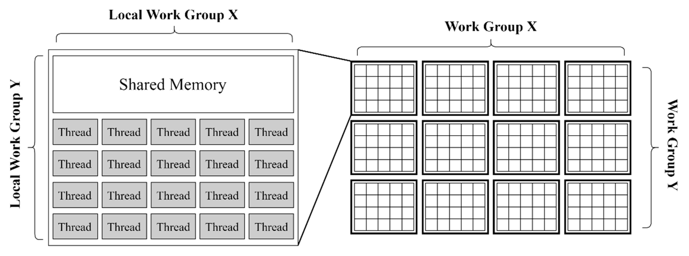

本篇文章主要谈谈compute shader在硬件上的一些实现原理，以及由这些硬件原理导致的实际操作中可能会有帮助的guideline。抛砖引玉，如撰写有不当之处还望多多指教。（本文不会涉及具体语法）

## Compute shader的优势

1. Advantage over pure cpu method: compute shader 可以利用GPU上大量的compute units 进行高效的并行计算(GPGPU)，从而实现以往纯CPU方案无法实现的实时效果。
2. Advantage over pure vertex-frag shader method: compute shader可以利用线程同步，共享显存内的数据的特性，快速在GPU内交换数据，减少CPU bottleneck，能够避免使用非常昂贵的多Pass方案，提供传统图形管线不具备的灵活性

## Compute shader为何能实现性能提升？

### **Compute units的出现**

在图形硬件发展的早期阶段（GeForce 7 ），显卡会针对不同的渲染阶段提供不同的固定功能处理单元。这些不同的单元虽然具有类似的计算能力，但是显存的读取有着很大的区别。例如顶点着色器在很长的一段时间里都不能像像素着色器一样直接访问texture。随着游戏工业的发展，以及GPGPU的应用场景开始出现，这种固定功能的硬件开始无法适应时代的需求。从GeForce 8800 GTX之后，图形硬件开始逐渐引入了统一的计算单元来处理vertex和pixel。这使得在顶点着色器和像素着色之间分配性能负担成为可能。

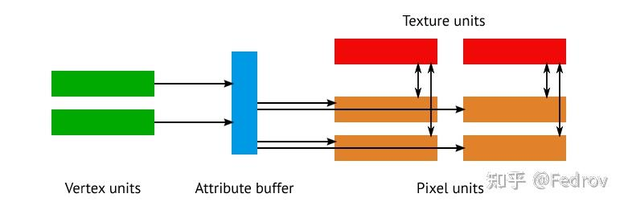

早期图形硬件，顶点着色和像素着色分别由不同的单元处理

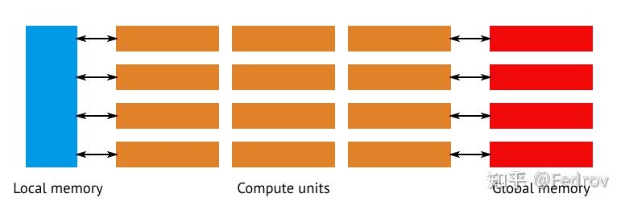

当代图形硬件，顶点着色和像素着色同时由compute units 处理，这成为了之后的GPGPU以及compute shader的铺垫

### **Compute shader之于传统图形管线**

在传统管线中，管线需有专门的硬件来处理图形与光栅化相关操作，对于通用计算来说造成了很多overhead。compute shader的引入可以直接调用一定数量的compute units与显存使它们之间互相传递数据。

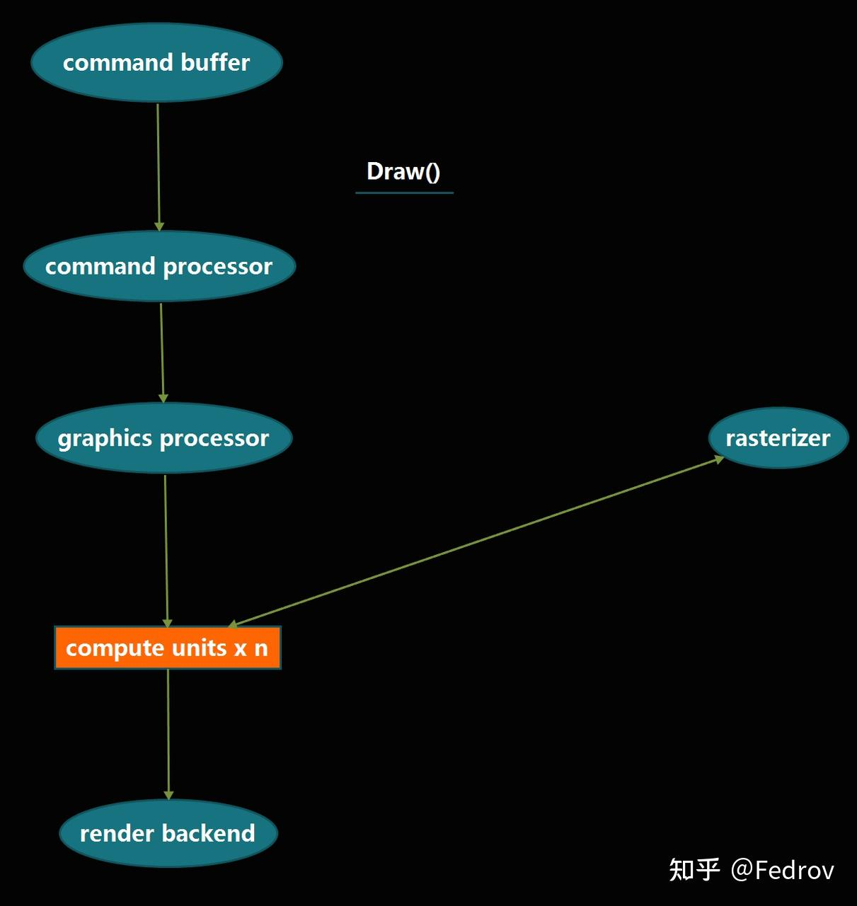

传统图形管线

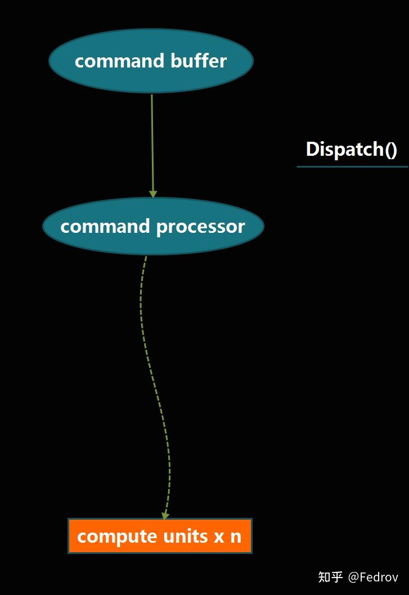

compute shader绕过了多余的硬件直接调用compute units

## Compute shader实现原理

在硬件层面，compute shader的并行性利用了compute units中的[SIMD units](https://zhida.zhihu.com/search?content_id=192322254&content_type=Article&match_order=1&q=SIMD+units&zhida_source=entity)(single instruction multiple data)
为了使threads（compute shader中最小的处理单元）能够更高效的传输给SIMD进行处理，threads被组织成一个具有2个层级的数据结构（compute space）

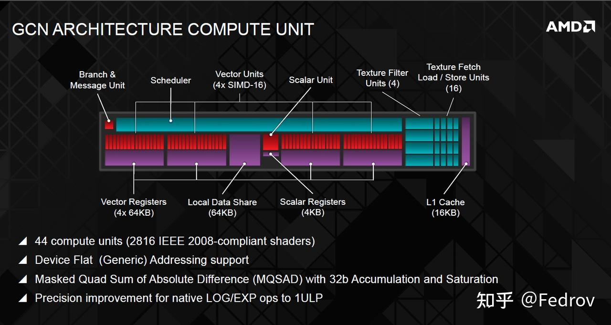

AMD的GCN架构

### **抽象的compute space**

不同于传统的vertex or pixel shader（顶点或像素的运算都在其明确定义的具象空间（object，world，tangent，camera。。。。），compute shader所在的空间是抽象的，其具体的语义只有在应用到具体的用途上才会体现。例如在对一张贴图的texel进行操作时，compute space此时类比于贴图所在的uv space。而在利用compute shader进行GPU粒子模拟时，compute space类比于object space下。

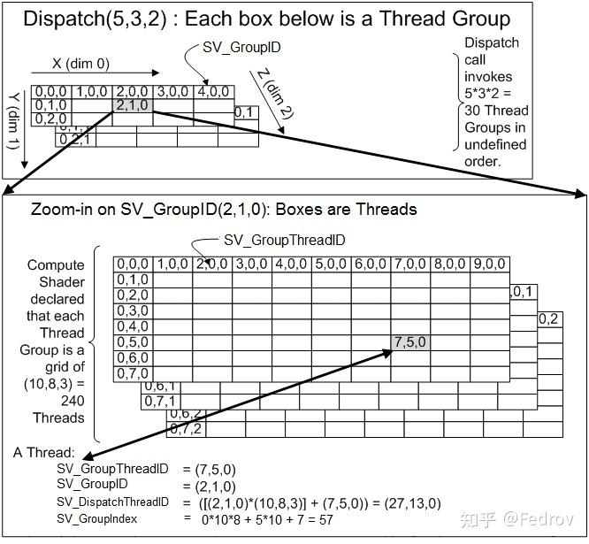

HLSL中对compute space的定义

**[work group](https://zhida.zhihu.com/search?content_id=192322254&content_type=Article&match_order=1&q=work+group&zhida_source=entity)（higher level)**

又被称为[thread group](https://zhida.zhihu.com/search?content_id=192322254&content_type=Article&match_order=1&q=thread+group&zhida_source=entity)。这里的thread只代表的是compute shader所操作的最小单元（类同per-vertex，per-pixel)。可以使用Dispatch(x,y,z)定义一个三维的thread group的组，每个组包含一个三维的numthreads。值得注意的是threadgroup的执行没有确定的顺序性，所以compute shader不可以依赖于特定的threadgroup的执行顺序

**numthreads (lower level)**

又被称为local size。[numthreads(x,y,z)]定义每个threadgroup的大小。例如如果numthreads定义了（8，8，1），Dispatch（4，4，1）大小的work group，那么整个thread count为64*16=1024. 值得注意的是threadgroup内的每个thread是并行处理，并可以通过一些共有的变量交换数据。而threadgroup之间无法高效的沟通（*这要求不同的compute units之间进行沟通）

### 硬件分配计算任务

**分配流程**

在大概了解compute shader的实现框架后，再来看下硬件是如何分配thread的。
首先dispatch call会激活thread groups(无明确顺序）。接着每个thread group被分配到相应可用的compute unit。最后在compute unit中，thread被分配给SIMDs

**分配过程中的数据形式**

threads 并不会一个接一个分配给SIMDs，而是以组的形式分配给SIMDs（bundle）。在amd的GCN架构中，一个bundle的大小是64，被称为wavefront。Nvidia 的架构通常是32（被称为warp）。如果threadgroup的大小同样是64，那么整个thread group正好都会被打包成一个wavefront分配到SIMDs（GCN架构，nvidia的架构会打包成2个）。这也就是为什么在设置threadgroup size时通常保险的做法是设成64的倍数，这样能够保证thread尽可能完整的被打包成wavefront并分配给各个SIMD，从而避免性能浪费。

### 数据读写

**thread group communication**

因为thread group被分配到了不同的compute units，如果不同thread group之间需要交换数据。这意味着不同的compute units需要至少通过L2 cache进行数据交换。在实际操作中这种数据交换并不高效。（这里没找到很好的资料）

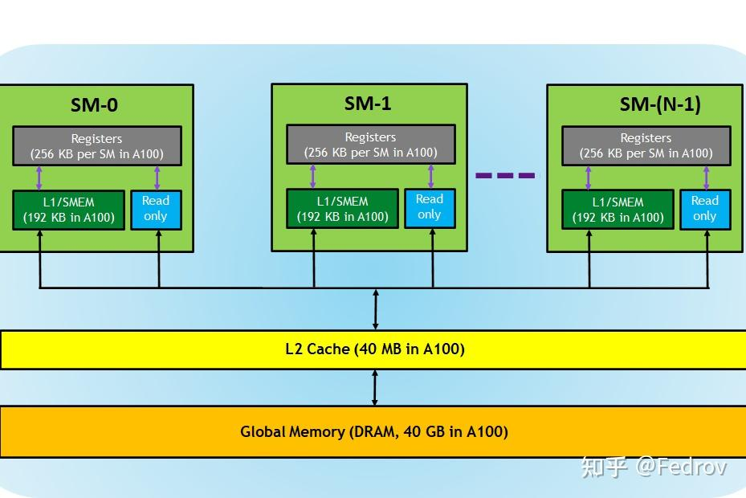

Nvidia A100显卡架构，不同的SM（compute units）通过一个40mb大小的L2 cache交换数据）

**threads communication within a single thread group**

每个compute unit中都有特殊内存[local data share](https://zhida.zhihu.com/search?content_id=192322254&content_type=Article&match_order=1&q=local+data+share&zhida_source=entity)用来为pixel shader存储interpolators。但如果是compute shader的话，此内存并不会被使用。实际操作中在同一个threadgroup内某些变量需要被频繁读写时可以使用local data share。需注意的是使用LDS时要先进行线程同步（synchronize)，我们必须在读取共享内存之前让当前线程等待线程组内其它的所有线程完成写入操作。

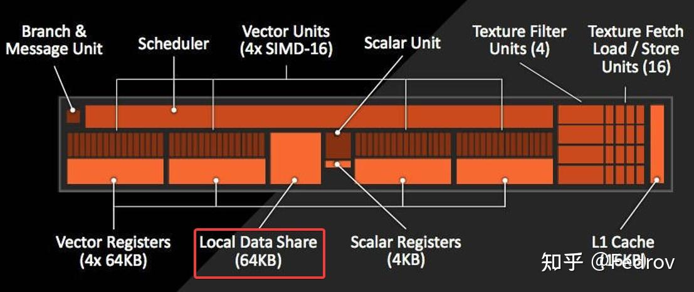

HLSL中使用LDS，在变量类型前声明groupshared

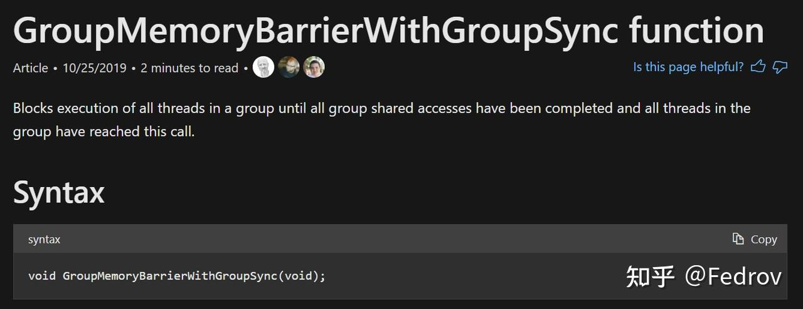

HLSL中的线程同步

### **变量与性能优化**

变量被分为uniform和非uniform变量。这两者的区别在于非uniform变量对于每个thread都有一个不同的copy，而uniform对于每个thread都只有一个相同的copy。在硬件层面，一个非uniform变量需要存储在[vector registers](https://zhida.zhihu.com/search?content_id=192322254&content_type=Article&match_order=1&q=vector+registers&zhida_source=entity)中（VGPR)，每个变量需要64倍于变量的大小的储存大小（假设wavefront大小为64）。而unifrom变量只需要1倍于变量的大小即可，变量储存在scalar register中（SGPR)。因此实际操作中应尽可能得使用uniform变量，使用太多非uniform变量会导致每个SIMDs单元所对应的wavefront数量减少，从而导致延迟增加。

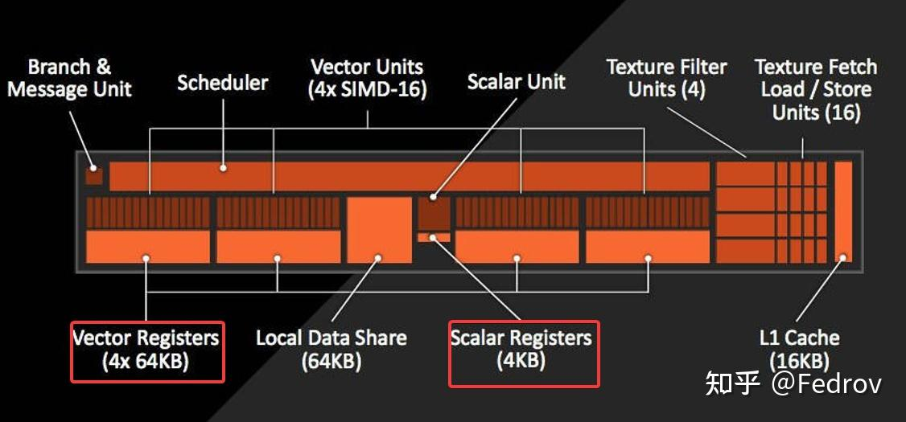

VGPR &amp; SGPR

**Flow Control**

在传统的vert-frag shader进行分支有时候会一定程度上影响性能，对于compute shader来说也是如此。当使用一个true branch的时候，只要有一个thread上的分支判断为true然后执行了相应的block，那么整个wavefront上的thread都要执行这个block。为了避免这种情况，在设计分支时尽量避免导致真分支的判断，如判断时尽量用uniform variable参与判断（对于每个thread判断条件都一致）

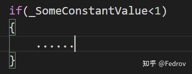

## Compute shader is not MAGIC

尽管compute shader理论上能提供巨大的性能提升，但compute shader并不是一个万能的方案。下面大概说说几点compute shader的注意点

- 不是所有效果都适合使用compute shader, 尤其是涉及传统的像素绘制的工作。对于简单的后处理效果，使用compute shader反而难以达到pixel shader的绘制效率。
- 针对特定硬件设计特定的compute shader：One solution cannot fits all hardware. 有些gpu架构缺少某些特定的硬件（例如arm的mali GPU缺少on board shared memory），从而导致在桌面端的compute shader在移动端的设计需要改变
- Keep testing and profiling: compute shader之所以能够提升性能在于其优化空间很大，这也反面意味着compute shader并不是一个开箱即用的方案。不断在实际的机器上测试并优化才能发挥出它的潜力

## 未来展望

如今高端显卡的compute units数量已经达到了80以上，伴随着的是各种基于gpu的方案的普及化（unity的vfx graph，ue的niagara等等）。移动端上目前的中高端机型也基本都支持了compute shader。有预测下一代桌面显卡有望达到150+的compute units数量。将来图形硬件的发展会使得基于compute shader的方案得到更加普遍的应用。

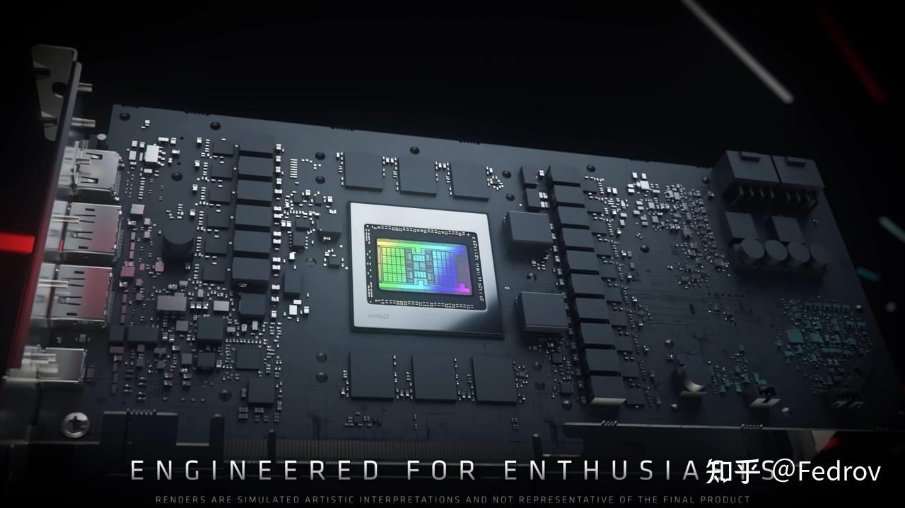

## References

1. [https://anteru.net/blog/2018/intro-to-compute-shaders/](https://link.zhihu.com/?target=https%3A//anteru.net/blog/2018/intro-to-compute-shaders/)
2. [https://docs.microsoft.com/en-us/windows/win32/direct3dhlsl/sv-dispatchthreadid](https://link.zhihu.com/?target=https%3A//docs.microsoft.com/en-us/windows/win32/direct3dhlsl/sv-dispatchthreadid)
3. [https://itigic.com/compute-units-or-sm-on-a-gpu-architecture-and-usage/](https://link.zhihu.com/?target=https%3A//itigic.com/compute-units-or-sm-on-a-gpu-architecture-and-usage/)
4. [https://www.khronos.org/opengl/wiki/Compute_Shader](https://link.zhihu.com/?target=https%3A//www.khronos.org/opengl/wiki/Compute_Shader)
5. https://zhuanlan.zhihu.com/p/68886986
6. [https://developer.arm.com/-/media/developer/Graphics%20and%20Multimedia/Developer%20Guides%20-%20PDFs/arm_mali_gpu_opengl_es_3-x_developer_guide_en.pdf?revision=31f40c1e-e404-4c4d-96e3-a59bec129e05](https://link.zhihu.com/?target=https%3A//developer.arm.com/-/media/developer/Graphics%20and%20Multimedia/Developer%20Guides%20-%20PDFs/arm_mali_gpu_opengl_es_3-x_developer_guide_en.pdf%3Frevision%3D31f40c1e-e404-4c4d-96e3-a59bec129e05)

