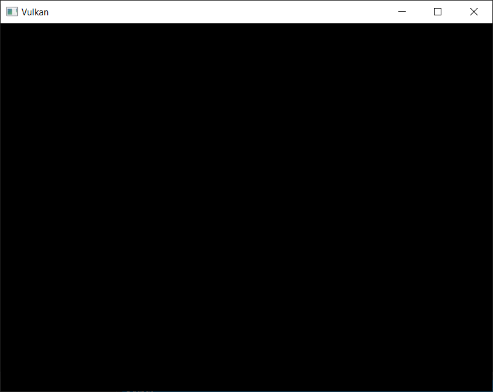

# Compute shader 无法写入 swapchain 图像

https://www.reddit.com/r/vulkan/comments/inmgwm/compute_shader_not_able_to_write_to_swapchain/?tl=zh-hans


[解决了] 我修改了一些来自 [https://vulkan-tutorial.com/ ](https://vulkan-tutorial.com/)的代码，这样它就会创建一个 compute 队列和 compute pipeline。我删除了所有与 renderpasses 相关的代码，并在 commandbuffer 中添加了图像转换，但不知何故，compute shader 无法写入图像。我没有收到任何错误或验证层。但即使我将图像的每个像素都写成白色，生成的图像仍然是黑色的。

我的代码可以在 [https://pastebin.pl/view/f8526e2a ](https://pastebin.pl/view/f8526e2a)找到。

compute shader 是：

```
#version 450
layout (binding = 0, rgba8 ) uniform writeonly image2D resultImage;
void main(){imageStore( resultImage,ivec2(gl_GlobalInvocationID.xy),vec4(1.0,1.0,1.0,1.0));}
```

请帮忙


结果屏幕：


[](https://preview.redd.it/5hkwns9mijl51.png?width=802&format=png&auto=webp&s=8c5538748bd9e7ada19c33babc4f8d24aaf091f7)

编辑：感谢大家的帮助，但我找到了问题。

vkCmdDispatch(commandBuffers[i], 255, 255, 0);

DispatchGroupZ 应该为 1 而不是 0。

vkCmdDispatch(commandBuffers[i], 255, 255, 1);

编辑 2：有些人注意到代码的链接失效了，所以这里有一个新的链接： https://pastebin.com/Wz2kLKEB


实现不需要支持在非图形管道中使用交换链图像。你已经在拉取 `VkSurfaceCapabilitiesKHR`了，检查一下 `supportedUsageFlags` 是否支持 `VK_IMAGE_USAGE_STORAGE_BIT`。我的记忆告诉我，还有另一个检查来验证计算管道是否可以与交换链一起使用，但它告诉我这个检查到底是什么，它失败了。


你也要确保适当地设置 `imageUsage` 字段的 `VkSwapchainCreateInfoKHR` 。所以如果你想把它用作存储图像，你还需要设置 `VK_IMAGE_USAGE_STORAGE_BIT` 位。


这只是检查队列（也应该检查图形和blit队列），但是，如果确实有这样的检查，仅仅检查图形队列是否支持present并不能确认图形队列上的计算管道是否可以使用交换链图像。

但是应该补充的是，OP的代码查询是否支持计算和present操作，但据我所知，实际上并没有使用这些信息，所以确实可能是他们使用了错误的队列，或者必要的队列可能不存在。


我隐约记得读到过，交换链图像只要求支持来自图形队列的写入。在某些硬件上可能不支持传输或计算。你应该可以在 VkSurfaceCapabilitiesKHR.supportedUsageFlags 中找到这一点。


```cpp
#define GLFW_INCLUDE_VULKAN
#include 
 
#include 
#include 
#include 
#include 
#include 
#include 
#include  
#include 
#include 
#include 
 
const uint32_t WIDTH = 800;
const uint32_t HEIGHT = 600;
 
const int MAX_FRAMES_IN_FLIGHT = 2;
 
const std::vector validationLayers = {
    "VK_LAYER_KHRONOS_validation"
};
 
const std::vector deviceExtensions = {
    VK_KHR_SWAPCHAIN_EXTENSION_NAME
};
 
#ifdef NDEBUG
const bool enableValidationLayers = false;
#else 
const bool enableValidationLayers = true;
#endif
 
VkResult CreateDebugUtilsMessengerEXT(VkInstance instance, const VkDebugUtilsMessengerCreateInfoEXT* pCreateInfo, const VkAllocationCallbacks* pAllocator, VkDebugUtilsMessengerEXT* pDebugMessenger) {
    auto func = (PFN_vkCreateDebugUtilsMessengerEXT)vkGetInstanceProcAddr(instance, "vkCreateDebugUtilsMessengerEXT");
    if (func != nullptr) {
        return func(instance, pCreateInfo, pAllocator, pDebugMessenger);
    }
    else {
        return VK_ERROR_EXTENSION_NOT_PRESENT;
    }
}
 
void DestroyDebugUtilsMessengerEXT(VkInstance instance, VkDebugUtilsMessengerEXT debugMessenger, const VkAllocationCallbacks* pAllocator) {
    auto func = (PFN_vkDestroyDebugUtilsMessengerEXT)vkGetInstanceProcAddr(instance, "vkDestroyDebugUtilsMessengerEXT");
    if (func != nullptr) {
        func(instance, debugMessenger, pAllocator);
    }
}
 
struct QueueFamilyIndices {
    std::optional computeFamily; 
    std::optional presentFamily;
 
    bool isComplete() {
        return computeFamily.has_value() && presentFamily.has_value();
    }
};
 
struct SwapChainSupportDetails {
    VkSurfaceCapabilitiesKHR capabilities;
    std::vector formats;
    std::vector presentModes;
};
 
class HelloTriangleApplication {
public:
    void run() {
        initWindow();
        initVulkan();
        mainLoop();
        cleanup();
    }
 
private:
    GLFWwindow* window;
 
    VkInstance instance;
    VkDebugUtilsMessengerEXT debugMessenger;
    VkSurfaceKHR surface;
 
    VkPhysicalDevice physicalDevice = VK_NULL_HANDLE;
    VkDevice device;
 
    VkQueue computeQueue;
    VkQueue presentQueue;
 
    VkSwapchainKHR swapChain;
    std::vector swapChainImages;
    //std::vector renderTargetImages; 
    std::vector renderTargetImageViews;
    VkDeviceMemory renderTargetDeviceMemory;
    VkFormat swapChainImageFormat;
    VkExtent2D swapChainExtent;
    std::vector swapChainImageViews;
 
    VkPipelineLayout pipelineLayout;
    VkPipeline pipeline;
 
    VkCommandPool commandPool;
    std::vector commandBuffers;
 
    std::vector imageAvailableSemaphores;
    std::vector renderFinishedSemaphores;
    std::vector inFlightFences;
    std::vector imagesInFlight;
    size_t currentFrame = 0;
 
    VkDescriptorSetLayout descriptorSetLayout;
    std::vector descriptorSets;
    VkDescriptorPool descriptorPool;
 
    VkSampler imageSampler;
 
    bool framebufferResized = false;
 
    void initWindow() {
        glfwInit();
 
        glfwWindowHint(GLFW_CLIENT_API, GLFW_NO_API);
 
        window = glfwCreateWindow(WIDTH, HEIGHT, "Vulkan", nullptr, nullptr);
        glfwSetWindowUserPointer(window, this);
        glfwSetFramebufferSizeCallback(window, framebufferResizeCallback);
    }
 
    static void framebufferResizeCallback(GLFWwindow* window, int width, int height) {
        auto app = reinterpret_cast(glfwGetWindowUserPointer(window));
        app->framebufferResized = true;
    }
 
    void initVulkan() {
        createInstance();
        setupDebugMessenger();
        createSurface();
        pickPhysicalDevice();
        createLogicalDevice();
 
        createSwapChain();
        createImageViews();
 
        createDescriptorSetLayout();
        createComputePipeline();
        
        createCommandPool();
        createDescriptorPool();
        createDescriptorSets();
        createCommandBuffers();
        
        createSyncObjects();
    }
 
    void mainLoop() {
        while (!glfwWindowShouldClose(window)) {
            glfwPollEvents();
            drawFrame();
        }
 
        vkDeviceWaitIdle(device);
    }
 
    void cleanupSwapChain() {
 
        vkFreeMemory(device, renderTargetDeviceMemory, nullptr);
        for (auto imageView : renderTargetImageViews) {
            vkDestroyImageView(device, imageView, nullptr);
        }
        //for (auto image : renderTargetImages) {
        //    vkDestroyImage(device, image, nullptr);
        //}
        vkDestroySampler(device, imageSampler, nullptr);
 
        vkDestroyDescriptorPool(device, descriptorPool, nullptr);
 
        vkFreeCommandBuffers(device, commandPool, static_cast(commandBuffers.size()), commandBuffers.data());
 
        vkDestroyPipeline(device, pipeline, nullptr);
        vkDestroyPipelineLayout(device, pipelineLayout, nullptr);
 
        for (auto imageView : swapChainImageViews) {
            vkDestroyImageView(device, imageView, nullptr);
        }
 
        vkDestroySwapchainKHR(device, swapChain, nullptr);
    }
 
    void cleanup() {
        cleanupSwapChain();
 
        vkDestroyDescriptorSetLayout(device, descriptorSetLayout, nullptr);
 
        for (size_t i = 0; i < MAX_FRAMES_IN_FLIGHT; i++) {
            vkDestroySemaphore(device, renderFinishedSemaphores[i], nullptr);
            vkDestroySemaphore(device, imageAvailableSemaphores[i], nullptr);
            vkDestroyFence(device, inFlightFences[i], nullptr);
        }
 
        vkDestroyCommandPool(device, commandPool, nullptr);
 
        vkDestroyDevice(device, nullptr);
 
        if (enableValidationLayers) {
            DestroyDebugUtilsMessengerEXT(instance, debugMessenger, nullptr);
        }
 
        vkDestroySurfaceKHR(instance, surface, nullptr);
        vkDestroyInstance(instance, nullptr);
 
        glfwDestroyWindow(window);
 
        glfwTerminate();
    }
 
    void recreateSwapChain() {
        int width = 0, height = 0;
        glfwGetFramebufferSize(window, &width, &height);
        while (width == 0 || height == 0) {
            glfwGetFramebufferSize(window, &width, &height);
            glfwWaitEvents();
        }
 
        vkDeviceWaitIdle(device);
 
        cleanupSwapChain();
 
        createSwapChain();
        createImageViews();
        createDescriptorPool();
        createDescriptorSets();
        createComputePipeline();
        createCommandBuffers();
        
    }
 
    void createInstance() {
        if (enableValidationLayers && !checkValidationLayerSupport()) {
            throw std::runtime_error("validation layers requested, but not available!");
        }
 
        VkApplicationInfo appInfo{};
        appInfo.sType = VK_STRUCTURE_TYPE_APPLICATION_INFO;
        appInfo.pApplicationName = "Hello Triangle";
        appInfo.applicationVersion = VK_MAKE_VERSION(1, 0, 0);
        appInfo.pEngineName = "No Engine";
        appInfo.engineVersion = VK_MAKE_VERSION(1, 0, 0);
        appInfo.apiVersion = VK_API_VERSION_1_0;
 
        VkInstanceCreateInfo createInfo{};
        createInfo.sType = VK_STRUCTURE_TYPE_INSTANCE_CREATE_INFO;
        createInfo.pApplicationInfo = &appInfo;
 
        auto extensions = getRequiredExtensions();
        createInfo.enabledExtensionCount = static_cast(extensions.size());
        createInfo.ppEnabledExtensionNames = extensions.data();
 
        VkDebugUtilsMessengerCreateInfoEXT debugCreateInfo;
        if (enableValidationLayers) {
            createInfo.enabledLayerCount = static_cast(validationLayers.size());
            createInfo.ppEnabledLayerNames = validationLayers.data();
 
            populateDebugMessengerCreateInfo(debugCreateInfo);
            createInfo.pNext = (VkDebugUtilsMessengerCreateInfoEXT*)&debugCreateInfo;
        }
        else {
            createInfo.enabledLayerCount = 0;
 
            createInfo.pNext = nullptr;
        }
 
        if (vkCreateInstance(&createInfo, nullptr, &instance) != VK_SUCCESS) {
            throw std::runtime_error("failed to create instance!");
        }
    }
 
    void populateDebugMessengerCreateInfo(VkDebugUtilsMessengerCreateInfoEXT& createInfo) {
        createInfo = {};
        createInfo.sType = VK_STRUCTURE_TYPE_DEBUG_UTILS_MESSENGER_CREATE_INFO_EXT;
        createInfo.messageSeverity = VK_DEBUG_UTILS_MESSAGE_SEVERITY_VERBOSE_BIT_EXT | VK_DEBUG_UTILS_MESSAGE_SEVERITY_WARNING_BIT_EXT | VK_DEBUG_UTILS_MESSAGE_SEVERITY_ERROR_BIT_EXT;
        createInfo.messageType = VK_DEBUG_UTILS_MESSAGE_TYPE_GENERAL_BIT_EXT | VK_DEBUG_UTILS_MESSAGE_TYPE_VALIDATION_BIT_EXT | VK_DEBUG_UTILS_MESSAGE_TYPE_PERFORMANCE_BIT_EXT;
        createInfo.pfnUserCallback = debugCallback;
    }
 
    void setupDebugMessenger() {
        if (!enableValidationLayers) return;
 
        VkDebugUtilsMessengerCreateInfoEXT createInfo;
        populateDebugMessengerCreateInfo(createInfo);
 
        if (CreateDebugUtilsMessengerEXT(instance, &createInfo, nullptr, &debugMessenger) != VK_SUCCESS) {
            throw std::runtime_error("failed to set up debug messenger!");
        }
    }
 
    void createSurface() {
        if (glfwCreateWindowSurface(instance, window, nullptr, &surface) != VK_SUCCESS) {
            throw std::runtime_error("failed to create window surface!");
        }
    }
 
    void pickPhysicalDevice() {
        uint32_t deviceCount = 0;
        vkEnumeratePhysicalDevices(instance, &deviceCount, nullptr);
 
        if (deviceCount == 0) {
            throw std::runtime_error("failed to find GPUs with Vulkan support!");
        }
 
        std::vector devices(deviceCount);
        vkEnumeratePhysicalDevices(instance, &deviceCount, devices.data());
 
        for (const auto& device : devices) {
            if (isDeviceSuitable(device)) {
                physicalDevice = device;
                break;
            }
        }
 
        if (physicalDevice == VK_NULL_HANDLE) {
            throw std::runtime_error("failed to find a suitable GPU!");
        }
    }
 
    void createLogicalDevice() {
        QueueFamilyIndices indices = findQueueFamilies(physicalDevice);
 
        std::vector queueCreateInfos;
        std::set uniqueQueueFamilies = { indices.computeFamily.value(), indices.presentFamily.value() };
 
        float queuePriority = 1.0f;
        for (uint32_t queueFamily : uniqueQueueFamilies) {
            VkDeviceQueueCreateInfo queueCreateInfo{};
            queueCreateInfo.sType = VK_STRUCTURE_TYPE_DEVICE_QUEUE_CREATE_INFO;
            queueCreateInfo.queueFamilyIndex = queueFamily;
            queueCreateInfo.queueCount = 1;
            queueCreateInfo.pQueuePriorities = &queuePriority;
            queueCreateInfos.push_back(queueCreateInfo);
        }
 
        VkPhysicalDeviceFeatures deviceFeatures{};
        VkDeviceCreateInfo createInfo{};
        createInfo.sType = VK_STRUCTURE_TYPE_DEVICE_CREATE_INFO;
 
        createInfo.queueCreateInfoCount = static_cast(queueCreateInfos.size());
        createInfo.pQueueCreateInfos = queueCreateInfos.data();
 
        createInfo.pEnabledFeatures = &deviceFeatures;
 
        createInfo.enabledExtensionCount = static_cast(deviceExtensions.size());
        createInfo.ppEnabledExtensionNames = deviceExtensions.data();
 
        if (enableValidationLayers) {
            createInfo.enabledLayerCount = static_cast(validationLayers.size());
            createInfo.ppEnabledLayerNames = validationLayers.data();
        }
        else {
            createInfo.enabledLayerCount = 0;
        }
 
        if (vkCreateDevice(physicalDevice, &createInfo, nullptr, &device) != VK_SUCCESS) {
            throw std::runtime_error("failed to create logical device!");
        }
 
        vkGetDeviceQueue(device, indices.computeFamily.value(), 0, &computeQueue);
        vkGetDeviceQueue(device, indices.presentFamily.value(), 0, &presentQueue);
    }
 
    uint32_t findMemoryType(uint32_t typeFilter, VkMemoryPropertyFlags properties) {
        VkPhysicalDeviceMemoryProperties memProperties;
        vkGetPhysicalDeviceMemoryProperties(physicalDevice, &memProperties);
 
        for (uint32_t i = 0; i < memProperties.memoryTypeCount; i++) {
            if ((typeFilter & (1 << i)) && (memProperties.memoryTypes[i].propertyFlags & properties) == properties) {
                return i;
            }
        }
 
        throw std::runtime_error("failed to find suitable memory type!");
    }
 
    void createSwapChain() {
        SwapChainSupportDetails swapChainSupport = querySwapChainSupport(physicalDevice);
 
        VkSurfaceFormatKHR surfaceFormat = chooseSwapSurfaceFormat(swapChainSupport.formats);
        VkPresentModeKHR presentMode = chooseSwapPresentMode(swapChainSupport.presentModes);
        VkExtent2D extent = chooseSwapExtent(swapChainSupport.capabilities);
 
        uint32_t imageCount = swapChainSupport.capabilities.minImageCount + 1;
        if (swapChainSupport.capabilities.maxImageCount > 0 && imageCount > swapChainSupport.capabilities.maxImageCount) {
            imageCount = swapChainSupport.capabilities.maxImageCount;
        }
 
        VkSwapchainCreateInfoKHR createInfo{};
        createInfo.sType = VK_STRUCTURE_TYPE_SWAPCHAIN_CREATE_INFO_KHR;
        createInfo.surface = surface;
 
        createInfo.minImageCount = imageCount;
        for (auto& format : swapChainSupport.formats) {
 
            if (CheckFormatSupport(physicalDevice, format.format,
                VK_FORMAT_FEATURE_STORAGE_IMAGE_BIT |
                VK_FORMAT_FEATURE_COLOR_ATTACHMENT_BIT)) {
                surfaceFormat.format = format.format;
                break;
            }
        }
 
 
        createInfo.imageFormat = surfaceFormat.format;
        createInfo.imageColorSpace = surfaceFormat.colorSpace;
        createInfo.imageExtent = extent;
        createInfo.imageArrayLayers = 1;
        createInfo.imageUsage = VK_IMAGE_USAGE_COLOR_ATTACHMENT_BIT | VK_IMAGE_USAGE_STORAGE_BIT;
 
        QueueFamilyIndices indices = findQueueFamilies(physicalDevice);
        uint32_t queueFamilyIndices[] = { indices.computeFamily.value(), indices.presentFamily.value() };
 
        if (indices.computeFamily != indices.presentFamily) {
            createInfo.imageSharingMode = VK_SHARING_MODE_CONCURRENT;
            createInfo.queueFamilyIndexCount = 2;
            createInfo.pQueueFamilyIndices = queueFamilyIndices;
        }
        else {
            createInfo.imageSharingMode = VK_SHARING_MODE_EXCLUSIVE;
        }
 
        createInfo.preTransform = swapChainSupport.capabilities.currentTransform;
        createInfo.compositeAlpha = VK_COMPOSITE_ALPHA_OPAQUE_BIT_KHR;
        createInfo.presentMode = presentMode;
        createInfo.clipped = VK_TRUE;
        if (vkCreateSwapchainKHR(device, &createInfo, nullptr, &swapChain) != VK_SUCCESS) {
            throw std::runtime_error("failed to create swap chain!");
        }
 
        vkGetSwapchainImagesKHR(device, swapChain, &imageCount, nullptr);
        swapChainImages.resize(imageCount);
        vkGetSwapchainImagesKHR(device, swapChain, &imageCount, swapChainImages.data());
 
 
        swapChainImageFormat = surfaceFormat.format;
        swapChainExtent = extent;
 
        //renderTargetImages.resize(swapChainImages.size());
       /*renderTargetImageViews.resize(swapChainImages.size());
        std::vector memRequirements(swapChainImages.size());
        VkFormat computeFormat{};
        for (auto& format : swapChainSupport.formats) {
 
                if (CheckFormatSupport(physicalDevice, format.format,
                    VK_FORMAT_FEATURE_STORAGE_IMAGE_BIT | VK_FORMAT_FEATURE_TRANSFER_SRC_BIT |
                    VK_FORMAT_FEATURE_COLOR_ATTACHMENT_BIT)) {
                    computeFormat = format.format;
                    break;
                }
            }
        /*for (int i = 0; i < swapChainImages.size(); i++) {
            VkImageCreateInfo imageCreateInfo{};
            imageCreateInfo.sType = VK_STRUCTURE_TYPE_IMAGE_CREATE_INFO;
            imageCreateInfo.imageType = VK_IMAGE_TYPE_2D;
            imageCreateInfo.usage = VK_IMAGE_USAGE_STORAGE_BIT | VK_IMAGE_USAGE_TRANSFER_SRC_BIT | VK_IMAGE_USAGE_COLOR_ATTACHMENT_BIT| VK_IMAGE_USAGE_SAMPLED_BIT;
            imageCreateInfo.flags = 0;
            imageCreateInfo.mipLevels = 1;
            imageCreateInfo.arrayLayers = 1;
            VkExtent3D imageExtent{};
            imageExtent.depth = 1;
            imageExtent.width = extent.width;
            imageExtent.height = extent.height;
            imageCreateInfo.extent = imageExtent;
            imageCreateInfo.initialLayout = VK_IMAGE_LAYOUT_UNDEFINED;
 
            uint32_t families[] { indices.computeFamily.value(),indices.presentFamily.value() };
            imageCreateInfo.sharingMode = VK_SHARING_MODE_CONCURRENT;
            if (indices.computeFamily.value() == indices.presentFamily.value()) {
                imageCreateInfo.sharingMode = VK_SHARING_MODE_EXCLUSIVE;
            }
            imageCreateInfo.pQueueFamilyIndices = families;
            imageCreateInfo.samples = VK_SAMPLE_COUNT_1_BIT;
            
            imageCreateInfo.tiling = VK_IMAGE_TILING_OPTIMAL;
            imageCreateInfo.format = computeFormat;
 
           // if (vkCreateImage(device, &imageCreateInfo, nullptr, &renderTargetImages[i]) != VK_SUCCESS) {
             //   throw std::runtime_error("failed to create image views!");
            //}
            
            //VkMemoryRequirements requirements;
            //vkGetImageMemoryRequirements(device, renderTargetImages[0], &memRequirements[i]);
        }
 
        
 
        /*VkMemoryAllocateInfo allocInfo{};
        VkDeviceSize deviceSize = 0;
        for (int i = 0; i < renderTargetImages.size(); i++) {
            deviceSize += memRequirements[i].size;
        }
        allocInfo.allocationSize = deviceSize;
        allocInfo.memoryTypeIndex = findMemoryType(memRequirements[1].memoryTypeBits,
            VK_MEMORY_PROPERTY_DEVICE_LOCAL_BIT);
        allocInfo.sType = VK_STRUCTURE_TYPE_MEMORY_ALLOCATE_INFO;
 
        vkAllocateMemory(device, &allocInfo, nullptr, &renderTargetDeviceMemory);
        uint32_t offset = 0;
        for (int i = 0; i < renderTargetImages.size(); i++) {
 
 
            vkBindImageMemory(device, renderTargetImages[i], renderTargetDeviceMemory, offset);
            offset += memRequirements[i].size;
 
            VkImageViewCreateInfo imageViewInfo{};
            imageViewInfo.sType = VK_STRUCTURE_TYPE_IMAGE_VIEW_CREATE_INFO;
            imageViewInfo.image = renderTargetImages[i];
            imageViewInfo.viewType = VK_IMAGE_VIEW_TYPE_2D;
            imageViewInfo.format = computeFormat;
            imageViewInfo.components.r = VK_COMPONENT_SWIZZLE_IDENTITY;
            imageViewInfo.components.g = VK_COMPONENT_SWIZZLE_IDENTITY;
            imageViewInfo.components.b = VK_COMPONENT_SWIZZLE_IDENTITY;
            imageViewInfo.components.a = VK_COMPONENT_SWIZZLE_IDENTITY;
            imageViewInfo.subresourceRange.aspectMask = VK_IMAGE_ASPECT_COLOR_BIT;
            imageViewInfo.subresourceRange.baseMipLevel = 0;
            imageViewInfo.subresourceRange.levelCount = 1;
            imageViewInfo.subresourceRange.baseArrayLayer = 0;
            imageViewInfo.subresourceRange.layerCount = 1;
 
            if (vkCreateImageView(device, &imageViewInfo, nullptr, &renderTargetImageViews[i]) != VK_SUCCESS) {
                throw std::runtime_error("failed to create image views!");
            }
        }*/
    }
 
    void createImageViews() {
        swapChainImageViews.resize(swapChainImages.size());
 
        for (size_t i = 0; i < swapChainImages.size(); i++) {
            VkImageViewCreateInfo createInfo{};
            createInfo.sType = VK_STRUCTURE_TYPE_IMAGE_VIEW_CREATE_INFO;
            createInfo.image = swapChainImages[i];
            createInfo.viewType = VK_IMAGE_VIEW_TYPE_2D;
            createInfo.format = swapChainImageFormat;
            createInfo.components.r = VK_COMPONENT_SWIZZLE_IDENTITY;
            createInfo.components.g = VK_COMPONENT_SWIZZLE_IDENTITY;
            createInfo.components.b = VK_COMPONENT_SWIZZLE_IDENTITY;
            createInfo.components.a = VK_COMPONENT_SWIZZLE_IDENTITY;
            createInfo.subresourceRange.aspectMask = VK_IMAGE_ASPECT_COLOR_BIT;
            createInfo.subresourceRange.baseMipLevel = 0;
            createInfo.subresourceRange.levelCount = 1;
            createInfo.subresourceRange.baseArrayLayer = 0;
            createInfo.subresourceRange.layerCount = 1;
 
 
            if (vkCreateImageView(device, &createInfo, nullptr, &swapChainImageViews[i]) != VK_SUCCESS) {
                throw std::runtime_error("failed to create image views!");
            }
        }
    }
 
    void createComputePipeline() {
        auto shader = readFile("shaders/comp.spv");
        VkShaderModule shaderModule = createShaderModule(shader);
 
        VkPipelineShaderStageCreateInfo shaderStageInfo{};
        shaderStageInfo.sType = VK_STRUCTURE_TYPE_PIPELINE_SHADER_STAGE_CREATE_INFO;
        shaderStageInfo.stage = VK_SHADER_STAGE_COMPUTE_BIT;
        shaderStageInfo.module = shaderModule;
        shaderStageInfo.pName = "main";
 
        VkPipelineLayoutCreateInfo pipelineLayoutInfo{};
        pipelineLayoutInfo.sType = VK_STRUCTURE_TYPE_PIPELINE_LAYOUT_CREATE_INFO;
        pipelineLayoutInfo.setLayoutCount = 1; // Optional
        pipelineLayoutInfo.pSetLayouts = &descriptorSetLayout; // Optional
        pipelineLayoutInfo.pushConstantRangeCount = 0; // Optional
        pipelineLayoutInfo.pPushConstantRanges = nullptr; // Optional
 
        if (vkCreatePipelineLayout(device, &pipelineLayoutInfo, nullptr, &pipelineLayout) != VK_SUCCESS) {
            throw std::runtime_error("failed to create pipeline layout!");
        }
 
        VkComputePipelineCreateInfo info{};
        info.sType = VK_STRUCTURE_TYPE_COMPUTE_PIPELINE_CREATE_INFO;
        info.layout = pipelineLayout;
        info.basePipelineIndex = -1;
        info.basePipelineHandle = VK_NULL_HANDLE;
        info.stage = shaderStageInfo;
    
 
        if (vkCreateComputePipelines(device,VK_NULL_HANDLE,1,&info,nullptr,&pipeline) != VK_SUCCESS) {
            throw std::runtime_error("compute shader");
        }
 
        vkDestroyShaderModule(device, shaderModule, nullptr);
    }
 
    void createCommandPool() {
        QueueFamilyIndices queueFamilyIndices = findQueueFamilies(physicalDevice);
 
        VkCommandPoolCreateInfo poolInfo{};
        poolInfo.sType = VK_STRUCTURE_TYPE_COMMAND_POOL_CREATE_INFO;
        poolInfo.queueFamilyIndex = queueFamilyIndices.computeFamily.value();
 
        if (vkCreateCommandPool(device, &poolInfo, nullptr, &commandPool) != VK_SUCCESS) {
            throw std::runtime_error("failed to create command pool!");
        }
    }
 
    void recordImageBarrier(VkCommandBuffer buffer, VkImage image, VkImageLayout oldLayout, VkImageLayout newLayout,
        VkAccessFlags scrAccess, VkAccessFlags dstAccess, VkPipelineStageFlags srcBind, VkPipelineStageFlags dstBind) {
        VkImageMemoryBarrier barrier{};
        barrier.image = image;
        barrier.srcQueueFamilyIndex = VK_QUEUE_FAMILY_IGNORED;
        barrier.dstQueueFamilyIndex = VK_QUEUE_FAMILY_IGNORED;
        barrier.oldLayout = oldLayout;
        barrier.newLayout = newLayout;
        barrier.srcAccessMask = scrAccess;
        barrier.dstAccessMask = dstAccess;
        barrier.sType = VK_STRUCTURE_TYPE_IMAGE_MEMORY_BARRIER;
        VkImageSubresourceRange sub{};
        sub.aspectMask = VK_IMAGE_ASPECT_COLOR_BIT;
        sub.baseArrayLayer = 0;
        sub.baseMipLevel = 0;
        sub.layerCount = VK_REMAINING_MIP_LEVELS;
        sub.levelCount = VK_REMAINING_MIP_LEVELS;
        barrier.subresourceRange = sub;
 
        vkCmdPipelineBarrier(buffer, srcBind, dstBind,
            0, 0, nullptr, 0, nullptr, 1, &barrier);
    }
 
    void createCommandBuffers() {
        commandBuffers.resize(swapChainImages.size());
 
        VkCommandBufferAllocateInfo allocInfo{};
        allocInfo.sType = VK_STRUCTURE_TYPE_COMMAND_BUFFER_ALLOCATE_INFO;
        allocInfo.commandPool = commandPool;
        allocInfo.level = VK_COMMAND_BUFFER_LEVEL_PRIMARY;
        allocInfo.commandBufferCount = (uint32_t)commandBuffers.size();
 
        if (vkAllocateCommandBuffers(device, &allocInfo, commandBuffers.data()) != VK_SUCCESS) {
            throw std::runtime_error("failed to allocate command buffers!");
        }
 
        for (size_t i = 0; i < commandBuffers.size(); i++) {
            VkCommandBufferBeginInfo beginInfo{};
            beginInfo.sType = VK_STRUCTURE_TYPE_COMMAND_BUFFER_BEGIN_INFO;
 
            if (vkBeginCommandBuffer(commandBuffers[i], &beginInfo) != VK_SUCCESS) {
                throw std::runtime_error("failed to begin recording command buffer!");
            }
 
 
            recordImageBarrier(commandBuffers[i], swapChainImages[i],
                VK_IMAGE_LAYOUT_UNDEFINED, VK_IMAGE_LAYOUT_GENERAL,
                VK_ACCESS_MEMORY_WRITE_BIT,VK_ACCESS_SHADER_WRITE_BIT,
                VK_PIPELINE_STAGE_TOP_OF_PIPE_BIT,VK_PIPELINE_STAGE_COMPUTE_SHADER_BIT);
            
            vkCmdBindPipeline(commandBuffers[i], VK_PIPELINE_BIND_POINT_COMPUTE, pipeline);
            vkCmdBindDescriptorSets(commandBuffers[i], VK_PIPELINE_BIND_POINT_COMPUTE, pipelineLayout, 0, 1, &descriptorSets[i], 0, nullptr);
            vkCmdDispatch(commandBuffers[i], 255, 255, 0);
         
            recordImageBarrier(commandBuffers[i], swapChainImages[i],
                VK_IMAGE_LAYOUT_GENERAL, VK_IMAGE_LAYOUT_PRESENT_SRC_KHR,
                VK_ACCESS_SHADER_WRITE_BIT, VK_ACCESS_MEMORY_READ_BIT,
                VK_PIPELINE_STAGE_COMPUTE_SHADER_BIT, VK_PIPELINE_STAGE_ALL_COMMANDS_BIT);
 
           /* VkImageCopy copy{};
            copy.dstOffset = { 0,0,0 };
            copy.extent = { swapChainExtent.width, swapChainExtent.height,1};
            copy.srcOffset = { 0,0,0 };
 
            VkImageSubresourceLayers subresource{};
            subresource.aspectMask = VK_IMAGE_ASPECT_COLOR_BIT;
            subresource.baseArrayLayer = 0;
            subresource.layerCount = 1;
            subresource.mipLevel = 0;
            copy.srcSubresource = subresource;
            copy.dstSubresource = subresource;
 
            recordImageBarrier(commandBuffers[i], swapChainImages[i],
                VK_IMAGE_LAYOUT_UNDEFINED, VK_IMAGE_LAYOUT_TRANSFER_DST_OPTIMAL,
                VK_ACCESS_MEMORY_READ_BIT, VK_ACCESS_MEMORY_WRITE_BIT,
                VK_PIPELINE_STAGE_ALL_COMMANDS_BIT, VK_PIPELINE_STAGE_HOST_BIT);
 
            vkCmdCopyImage(commandBuffers[i], renderTargetImages[i], VK_IMAGE_LAYOUT_TRANSFER_SRC_OPTIMAL,
                swapChainImages[i], VK_IMAGE_LAYOUT_TRANSFER_DST_OPTIMAL,1,©);
 
            recordImageBarrier(commandBuffers[i], swapChainImages[i],
                VK_IMAGE_LAYOUT_TRANSFER_DST_OPTIMAL, VK_IMAGE_LAYOUT_PRESENT_SRC_KHR,
                VK_ACCESS_MEMORY_WRITE_BIT, VK_ACCESS_MEMORY_READ_BIT,
                VK_PIPELINE_STAGE_HOST_BIT, VK_PIPELINE_STAGE_BOTTOM_OF_PIPE_BIT);
 
                */
            if (vkEndCommandBuffer(commandBuffers[i]) != VK_SUCCESS) {
                throw std::runtime_error("failed to record command buffer!");
            }
        }
    }
 
    void createSyncObjects() {
        imageAvailableSemaphores.resize(MAX_FRAMES_IN_FLIGHT);
        renderFinishedSemaphores.resize(MAX_FRAMES_IN_FLIGHT);
        inFlightFences.resize(MAX_FRAMES_IN_FLIGHT);
        imagesInFlight.resize(swapChainImages.size(), VK_NULL_HANDLE);
 
        VkSemaphoreCreateInfo semaphoreInfo{};
        semaphoreInfo.sType = VK_STRUCTURE_TYPE_SEMAPHORE_CREATE_INFO;
 
        VkFenceCreateInfo fenceInfo{};
        fenceInfo.sType = VK_STRUCTURE_TYPE_FENCE_CREATE_INFO;
        fenceInfo.flags = VK_FENCE_CREATE_SIGNALED_BIT;
 
        for (size_t i = 0; i < MAX_FRAMES_IN_FLIGHT; i++) {
            if (vkCreateSemaphore(device, &semaphoreInfo, nullptr, &imageAvailableSemaphores[i]) != VK_SUCCESS ||
                vkCreateSemaphore(device, &semaphoreInfo, nullptr, &renderFinishedSemaphores[i]) != VK_SUCCESS ||
                vkCreateFence(device, &fenceInfo, nullptr, &inFlightFences[i]) != VK_SUCCESS) {
                throw std::runtime_error("failed to create synchronization objects for a frame!");
            }
        }
    }
 
    void createDescriptorSetLayout() {
        VkDescriptorSetLayoutBinding uboLayoutBinding{};
        uboLayoutBinding.binding = 0;
        uboLayoutBinding.descriptorType = VK_DESCRIPTOR_TYPE_STORAGE_IMAGE;
        uboLayoutBinding.descriptorCount = 1;
        uboLayoutBinding.stageFlags = VK_SHADER_STAGE_COMPUTE_BIT;
        uboLayoutBinding.pImmutableSamplers = &imageSampler;
 
        VkDescriptorSetLayoutCreateInfo layoutInfo{};
        layoutInfo.sType = VK_STRUCTURE_TYPE_DESCRIPTOR_SET_LAYOUT_CREATE_INFO;
        layoutInfo.bindingCount = 1;
        layoutInfo.pBindings = &uboLayoutBinding;
 
        if (vkCreateDescriptorSetLayout(device, &layoutInfo, nullptr, &descriptorSetLayout) != VK_SUCCESS) {
            throw std::runtime_error("failed to create descriptor set layout!");
        }
    }
 
    void createDescriptorPool() {
        VkDescriptorPoolSize poolSize{};
        poolSize.type = VK_DESCRIPTOR_TYPE_STORAGE_IMAGE;
        poolSize.descriptorCount = static_cast(swapChainImages.size());
 
        VkDescriptorPoolCreateInfo poolInfo{};
        poolInfo.sType = VK_STRUCTURE_TYPE_DESCRIPTOR_POOL_CREATE_INFO;
        poolInfo.poolSizeCount = 1;
        poolInfo.pPoolSizes = &poolSize;
        poolInfo.maxSets = static_cast(swapChainImages.size());
        if (vkCreateDescriptorPool(device, &poolInfo, nullptr, &descriptorPool) != VK_SUCCESS) {
            throw std::runtime_error("failed to create descriptor pool!");
        }
    }
 
    void createDescriptorSets() {
        std::vector layouts(swapChainImages.size(), descriptorSetLayout);
        VkDescriptorSetAllocateInfo allocInfo{};
        allocInfo.sType = VK_STRUCTURE_TYPE_DESCRIPTOR_SET_ALLOCATE_INFO;
        allocInfo.descriptorPool = descriptorPool;
        allocInfo.descriptorSetCount = static_cast(swapChainImages.size());
        allocInfo.pSetLayouts = layouts.data();
 
        descriptorSets.resize(swapChainImages.size());
        if (vkAllocateDescriptorSets(device, &allocInfo, descriptorSets.data()) != VK_SUCCESS) {
            throw std::runtime_error("failed to allocate descriptor sets!");
        }
        
        VkSamplerCreateInfo samplerInfo{};
        samplerInfo.sType = VK_STRUCTURE_TYPE_SAMPLER_CREATE_INFO;
        samplerInfo.magFilter = VK_FILTER_LINEAR;
        samplerInfo.minFilter = VK_FILTER_LINEAR;
        samplerInfo.addressModeU = VK_SAMPLER_ADDRESS_MODE_REPEAT;
        samplerInfo.addressModeV = VK_SAMPLER_ADDRESS_MODE_REPEAT;
        samplerInfo.addressModeW = VK_SAMPLER_ADDRESS_MODE_REPEAT;
        samplerInfo.anisotropyEnable = VK_FALSE;
        samplerInfo.maxAnisotropy = 16.0f;
        samplerInfo.borderColor = VK_BORDER_COLOR_INT_OPAQUE_BLACK; 
        samplerInfo.unnormalizedCoordinates = VK_FALSE;
        samplerInfo.compareEnable = VK_FALSE;
        samplerInfo.compareOp = VK_COMPARE_OP_ALWAYS;
        samplerInfo.mipmapMode = VK_SAMPLER_MIPMAP_MODE_LINEAR;
        samplerInfo.mipLodBias = 0.0f;
        samplerInfo.minLod = 0.0f;
        samplerInfo.maxLod = 0.0f;
 
        vkCreateSampler(device, &samplerInfo, nullptr, &imageSampler);
 
        for (size_t i = 0; i < swapChainImages.size(); i++) {
            VkDescriptorImageInfo info{};
            info.imageView = swapChainImageViews[i];
            info.imageLayout = VK_IMAGE_LAYOUT_GENERAL;
            info.sampler = imageSampler;
 
            VkWriteDescriptorSet descriptorWrite{};
            descriptorWrite.sType = VK_STRUCTURE_TYPE_WRITE_DESCRIPTOR_SET;
            descriptorWrite.dstSet = descriptorSets[i];
            descriptorWrite.dstBinding = 0;
            descriptorWrite.dstArrayElement = 0;
            descriptorWrite.descriptorType = VK_DESCRIPTOR_TYPE_STORAGE_IMAGE;
            descriptorWrite.descriptorCount = 1;
            descriptorWrite.pImageInfo = &info;
 
            vkUpdateDescriptorSets(device, 1, &descriptorWrite, 0, nullptr);
          
        }
    }
 
    void drawFrame() {
        vkWaitForFences(device, 1, &inFlightFences[currentFrame], VK_TRUE, UINT64_MAX);
 
        uint32_t imageIndex;
        VkResult result = vkAcquireNextImageKHR(device, swapChain, UINT64_MAX, imageAvailableSemaphores[currentFrame], VK_NULL_HANDLE, &imageIndex);
 
        if (result == VK_ERROR_OUT_OF_DATE_KHR) {
            recreateSwapChain();
            return;
        }
        else if (result != VK_SUCCESS && result != VK_SUBOPTIMAL_KHR) {
            throw std::runtime_error("failed to acquire swap chain image!");
        }
 
        if (imagesInFlight[imageIndex] != VK_NULL_HANDLE) {
            vkWaitForFences(device, 1, &imagesInFlight[imageIndex], VK_TRUE, UINT64_MAX);
        }
        imagesInFlight[imageIndex] = inFlightFences[currentFrame];
 
        VkSubmitInfo submitInfo{};
        submitInfo.sType = VK_STRUCTURE_TYPE_SUBMIT_INFO;
 
        VkSemaphore waitSemaphores[] = { imageAvailableSemaphores[currentFrame] };
        VkPipelineStageFlags waitStages[] = { VK_PIPELINE_STAGE_COLOR_ATTACHMENT_OUTPUT_BIT };
        submitInfo.waitSemaphoreCount = 1;
        submitInfo.pWaitSemaphores = waitSemaphores;
        submitInfo.pWaitDstStageMask = waitStages;
 
        submitInfo.commandBufferCount = 1;
        submitInfo.pCommandBuffers = &commandBuffers[imageIndex];
 
        VkSemaphore signalSemaphores[] = { renderFinishedSemaphores[currentFrame] };
        submitInfo.signalSemaphoreCount = 1;
        submitInfo.pSignalSemaphores = signalSemaphores;
 
        vkResetFences(device, 1, &inFlightFences[currentFrame]);
 
        if (vkQueueSubmit(computeQueue, 1, &submitInfo, inFlightFences[currentFrame]) != VK_SUCCESS) {
            throw std::runtime_error("failed to submit draw command buffer!");
        }
 
        VkPresentInfoKHR presentInfo{};
        presentInfo.sType = VK_STRUCTURE_TYPE_PRESENT_INFO_KHR;
 
        presentInfo.waitSemaphoreCount = 1;
        presentInfo.pWaitSemaphores = signalSemaphores;
 
        VkSwapchainKHR swapChains[] = { swapChain };
        presentInfo.swapchainCount = 1;
        presentInfo.pSwapchains = swapChains;
 
        presentInfo.pImageIndices = &imageIndex;
 
        result = vkQueuePresentKHR(presentQueue, &presentInfo);
 
        if (result == VK_ERROR_OUT_OF_DATE_KHR || result == VK_SUBOPTIMAL_KHR || framebufferResized) {
            framebufferResized = false;
            recreateSwapChain();
        }
        else if (result != VK_SUCCESS) {
            throw std::runtime_error("failed to present swap chain image!");
        }
 
        currentFrame = (currentFrame + 1) % MAX_FRAMES_IN_FLIGHT;
    }
 
    VkShaderModule createShaderModule(const std::vector& code) {
        VkShaderModuleCreateInfo createInfo{};
        createInfo.sType = VK_STRUCTURE_TYPE_SHADER_MODULE_CREATE_INFO;
        createInfo.codeSize = code.size();
        createInfo.pCode = reinterpret_cast(code.data());
 
        VkShaderModule shaderModule;
        if (vkCreateShaderModule(device, &createInfo, nullptr, &shaderModule) != VK_SUCCESS) {
            throw std::runtime_error("failed to create shader module!");
        }
 
        return shaderModule;
    }
 
    bool CheckFormatSupport(VkPhysicalDevice gpu, VkFormat format, VkFormatFeatureFlags requestedSupport) {
        VkFormatProperties vkFormatProperties;
        vkGetPhysicalDeviceFormatProperties(gpu, format, &vkFormatProperties);
        return (vkFormatProperties.optimalTilingFeatures & requestedSupport) == requestedSupport;
    }
 
    VkSurfaceFormatKHR chooseSwapSurfaceFormat(const std::vector& availableFormats) {
        for (const auto& availableFormat : availableFormats) {
            if (availableFormat.format == VK_FORMAT_B8G8R8A8_SRGB && availableFormat.colorSpace == VK_COLOR_SPACE_SRGB_NONLINEAR_KHR) {
                return availableFormat;
            }
        }
 
        return availableFormats[0];
    }
 
    VkPresentModeKHR chooseSwapPresentMode(const std::vector& availablePresentModes) {
        for (const auto& availablePresentMode : availablePresentModes) {
            if (availablePresentMode == VK_PRESENT_MODE_MAILBOX_KHR) {
                return availablePresentMode;
            }
        }
 
        return VK_PRESENT_MODE_FIFO_KHR;
    }
 
    VkExtent2D chooseSwapExtent(const VkSurfaceCapabilitiesKHR& capabilities) {
        if (capabilities.currentExtent.width != UINT32_MAX) {
            return capabilities.currentExtent;
        }
        else {
            int width, height;
            glfwGetFramebufferSize(window, &width, &height);
 
            VkExtent2D actualExtent = {
                static_cast(width),
                static_cast(height)
            };
 
            actualExtent.width = std::max(capabilities.minImageExtent.width, std::min(capabilities.maxImageExtent.width, actualExtent.width));
            actualExtent.height = std::max(capabilities.minImageExtent.height, std::min(capabilities.maxImageExtent.height, actualExtent.height));
 
            return actualExtent;
        }
    }
 
    SwapChainSupportDetails querySwapChainSupport(VkPhysicalDevice device) {
        SwapChainSupportDetails details;
 
        vkGetPhysicalDeviceSurfaceCapabilitiesKHR(device, surface, &details.capabilities);
 
        uint32_t formatCount;
        vkGetPhysicalDeviceSurfaceFormatsKHR(device, surface, &formatCount, nullptr);
 
        if (formatCount != 0) {
            details.formats.resize(formatCount);
            vkGetPhysicalDeviceSurfaceFormatsKHR(device, surface, &formatCount, details.formats.data());
        }
 
        uint32_t presentModeCount;
        vkGetPhysicalDeviceSurfacePresentModesKHR(device, surface, &presentModeCount, nullptr);
        
        if (presentModeCount != 0) {
            details.presentModes.resize(presentModeCount);
            vkGetPhysicalDeviceSurfacePresentModesKHR(device, surface, &presentModeCount, details.presentModes.data());
        }
 
        return details;
    }
 
    bool isDeviceSuitable(VkPhysicalDevice device) {
        QueueFamilyIndices indices = findQueueFamilies(device);
 
        bool extensionsSupported = checkDeviceExtensionSupport(device);
 
        bool swapChainAdequate = false;
        if (extensionsSupported) {
            SwapChainSupportDetails swapChainSupport = querySwapChainSupport(device);
            swapChainAdequate = !swapChainSupport.formats.empty() && !swapChainSupport.presentModes.empty();
        }
 
        return indices.isComplete() && extensionsSupported && swapChainAdequate;
    }
 
    bool checkDeviceExtensionSupport(VkPhysicalDevice device) {
        uint32_t extensionCount;
        vkEnumerateDeviceExtensionProperties(device, nullptr, &extensionCount, nullptr);
 
        std::vector availableExtensions(extensionCount);
        vkEnumerateDeviceExtensionProperties(device, nullptr, &extensionCount, availableExtensions.data());
 
        std::set requiredExtensions(deviceExtensions.begin(), deviceExtensions.end());
 
        for (const auto& extension : availableExtensions) {
            requiredExtensions.erase(extension.extensionName);
        }
 
        return requiredExtensions.empty();
    }
 
    QueueFamilyIndices findQueueFamilies(VkPhysicalDevice device) {
        QueueFamilyIndices indices;
 
        uint32_t queueFamilyCount = 0;
        vkGetPhysicalDeviceQueueFamilyProperties(device, &queueFamilyCount, nullptr);
 
        std::vector queueFamilies(queueFamilyCount);
        vkGetPhysicalDeviceQueueFamilyProperties(device, &queueFamilyCount, queueFamilies.data());
 
        int i = 0;
        for (const auto& queueFamily : queueFamilies) {
            if (queueFamily.queueFlags & VK_QUEUE_COMPUTE_BIT) {
                indices.computeFamily = i;
            }
 
            VkBool32 presentSupport = false;
            vkGetPhysicalDeviceSurfaceSupportKHR(device, i, surface, &presentSupport);
 
            if (presentSupport) {
                indices.presentFamily = i;
            }
 
            if (indices.isComplete()) {
                break;
            }
 
            i++;
        }
 
        return indices;
    }
 
    std::vector getRequiredExtensions() {
        uint32_t glfwExtensionCount = 0;
        const char** glfwExtensions;
        glfwExtensions = glfwGetRequiredInstanceExtensions(&glfwExtensionCount);
 
        std::vector extensions(glfwExtensions, glfwExtensions + glfwExtensionCount);
 
        if (enableValidationLayers) {
            extensions.push_back(VK_EXT_DEBUG_UTILS_EXTENSION_NAME);
        }
 
        return extensions;
    }
 
    bool checkValidationLayerSupport() {
        uint32_t layerCount;
        vkEnumerateInstanceLayerProperties(&layerCount, nullptr);
 
        std::vector availableLayers(layerCount);
        vkEnumerateInstanceLayerProperties(&layerCount, availableLayers.data());
 
        for (const char* layerName : validationLayers) {
            bool layerFound = false;
 
            for (const auto& layerProperties : availableLayers) {
                if (strcmp(layerName, layerProperties.layerName) == 0) {
                    layerFound = true;
                    break;
                }
            }
 
            if (!layerFound) {
                return false;
            }
        }
 
        return true;
    }
 
    static std::vector readFile(const std::string& filename) {
        std::ifstream file(filename, std::ios::ate | std::ios::binary);
 
        if (!file.is_open()) {
            throw std::runtime_error("failed to open file!");
        }
 
        size_t fileSize = (size_t)file.tellg();
        std::vector buffer(fileSize);
 
        file.seekg(0);
        file.read(buffer.data(), fileSize);
 
        file.close();
 
        return buffer;
    }
 
    static VKAPI_ATTR VkBool32 VKAPI_CALL debugCallback(VkDebugUtilsMessageSeverityFlagBitsEXT messageSeverity, VkDebugUtilsMessageTypeFlagsEXT messageType, const VkDebugUtilsMessengerCallbackDataEXT* pCallbackData, void* pUserData) {
        std::cerr << "validation layer: " << pCallbackData->pMessage << std::endl;
 
        return VK_FALSE;
    }
};
 
int main() {
    HelloTriangleApplication app;
 
    try {
        app.run();
    }
    catch (const std::exception& e) {
        std::cerr << e.what() << std::endl;
        return EXIT_FAILURE;
    }
 
    return EXIT_SUCCESS;
}
```


