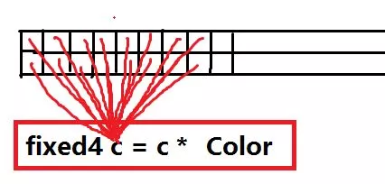
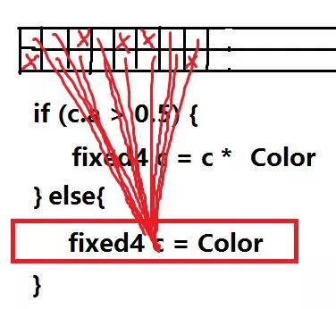
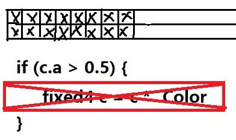
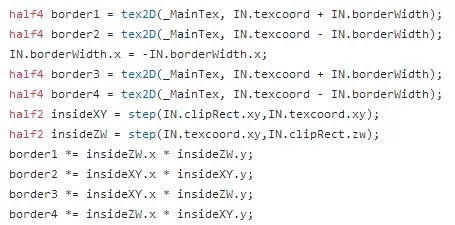
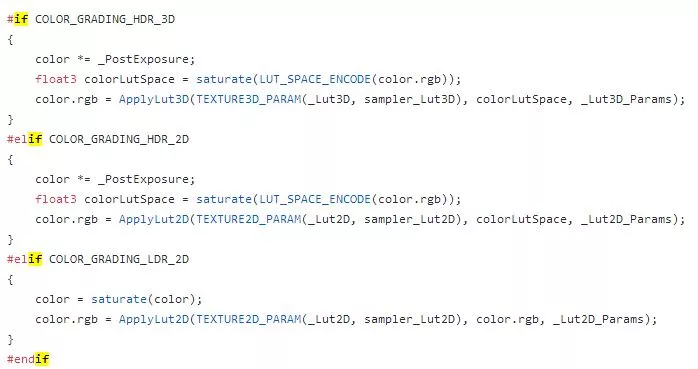

# Shader中if和for的效率问题以及使用策略

## 先放结论：

- if和for确实有效率问题（相比CPU下的情况），但是通常情况无法回避，也就无需处理。
- 用step代替if，大部分情况是无优化或者负优化，只在一些个别情况下有少量的提升。
- 可以用Shader变体来取代一些只和固定参数有关的if，但这只是为了减少if自身的成本（if和里面执行的表达式毕竟也是指令）

if和for之所以比预想的要慢，是因为GPU的“进行计算的运算单元”和“执行指令的逻辑单元”并不是一对一对应的，而是一对多的关系。

当你执行一条指令的时候，并不是操作一个像素，而是同时操作一组像素，并一条一条指令向下执行。

如果你的代码里出现了if，在这组像素中，可能有条件表达式返回true的，也可能有返回false的。但只要有一个返回true，下面那条代码就必须执行。而那些不需要执行的像素点，虽然这次并不需要计算，但也没有其他的逻辑单元可以与它们配对工作，所以也只能干等。

X的部分也只能等待

后面的else部分也是同理，即使只有一个像素需要计算，也需要占用全部资源。

所以，if的效率问题是会导致多个分支重复执行。

而for的问题也和if类似，会导致循环逻辑必须以这组像素里最大循环次数的那一个为准来执行。

## 然而，也就仅此而已。

if的效率低，是因为它会导致多分支重复执行，而不是它自身有多慢。如果你去掉了if，但是执行的逻辑还是原本全部分支的总和，并不会有多少改善。step代替if的做法就是如此。

假如考虑是的是if本身这条指令的耗费的话。虽然if本身并不算一个简单指令，但如果要使用step来代替if，直译则是这样：fixed4 c = lerp(c * Color,Color,step(c.a,0.5));

这毕竟是两条指令，未见得就比if本身要好多少。但如果在某些特定情况能省略掉那条lerp，确实有可能获得一些优势（比如：if (x >= 1) x +=1 --> x += step(1,x)）

## 但是，使用if，也不是任何时候都会导致分支重复执行的。

当那组像素内，如果所有c.a > 0.5的判断都返回false的话，就意味着下面那条指令计算的结果全部都会抛弃。这种时候，GPU还是会正常的跳过这条语句。

所有分支都执行只是无奈之举。只要能够避免，自然就会避免。

在实际运行环境中，一批像素内全部c.a <= 0.5的情况可能并不那么常见，但只要出现一次，就会导致计算被跳过，这样就可能比step的代替方案效率更高。所以，只有在我们基本确信这种情况99%都不会出现的情况，用step代替if才可能是一种“优化”，而优化幅度也未见得会高到能够被结果体现出来。

但假如这种情况很常见，你将if替换成step，反而可能产生明显的负优化。

这里就有一个问题：我们应该如何判断，同一批像素全部c.a <= 0.5的概率呢？这就需要知道，什么才叫“同一批像素”。

事实上，“同一批像素”的分配方式，每种硬件的每一代都是不同的。有竖着扫的，也有和扫描线一样横着排的。移动平台由于都是TBR，还会以一个方块作为基础分布。但不管怎么样，至少是连续的。至于这一批像素到底有多少个……一般的说法是32，但这同样也是不确定的。

我们能确定的是，假如是这样一张透明图片

它有这么大的体积，中间的部分还是实心的，那么它的像素被分配到同一批次的可能性就很高，也就边缘会出现两条分支都执行的情况。

但是，像文本这样的，镂空较多，概率就比较低，也就可以考虑用step代替if。但是并不保险，你看，其实连续不透明部分还是满多的样子的嘛，搞不好在某些单个批次像素数量较少的机器上……

适合step代替if的情况，其实非常有限，大概只有网点图能算一个了。

而我在下图的情景下使用step，与其说是了为避免if，不如说是为了减少指令。

去掉单字rect外的像素

说白了，就是正确使用step代替if收益太少，错误使用step代替if代价太大。如果你没有绝对的信心，不要用step代替if，尤其是取代分支下有大量复杂计算的if。

如果一定要这样用的话，根据情况，最好做测试验证下是否会导致性能的下降。

## 这里有一个特例

如果和if有关的参数是一个外部变量(Uniform)的话，由于在一个Pass里它的值是一定不变的，所以同一批次下，也一定会走同一条分支，走多条分支的情况100%不会出现。这时候还使用step，就是愚蠢至极的做法。

但是，假如是这种情况，则更倾向于用Shader变体的做法，用条件编译来直接切换不同分支。

这样可以将那条if语句本身的成本（据说算上else是4个时钟周期），还有表达式的成本给消除掉。虽然优化幅度不大，但是在frag单元任何一条指令的节省都是值得的。

但是不做……

其实也没什么大碍，Shader变体太多也可能存在内存和加载时间的问题，变体切换也有成本，要根据实际情况进行选择了。

## 结语：

- GPU的这种工作方式叫Single Instruction Multiple Threads(单指令多线程)，前面用“一个像素”的说法不准确，因为顶点也是一样处理的，应该叫一个Thread。而一组像素是一组Thread，被称为“线程束”，也就是一般说的Warp。不在正文直接使用这些专业名词只是为了不增加理解成本。
- 硬件一直都在发展，很难判断现在if的成本有多少，我说的也是一种很老旧的实现方式，现在GPU对分支的处理很可能变得更加复杂，因为空载是一件明显粗暴的处理方法，具有优化的余地。这种优化可能逻辑复杂，涉及断批，重新创建warp等等行为，但至少并不会比这种简单暴力的空载方式更慢。
  ——而使用step则等于放弃了这些优化。
  step和if的性能差距只会越来越大，step万一比if快的情况，也只可能越来越少。
- 自己的测试结果才靠谱。手机型号虽多，按GPU的厂商/大版本区分其实也没多少台，没什么不能测试的。未经过测试验证的结论，管它多权威，信的人有多少，都不能信。