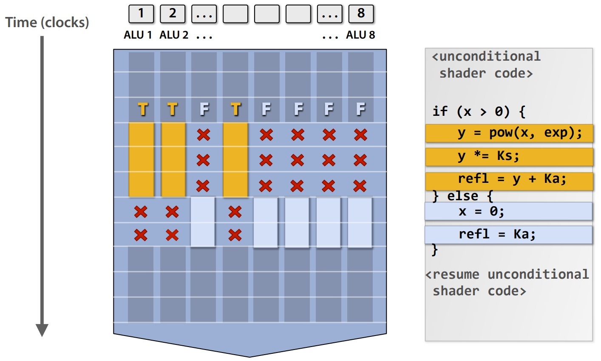
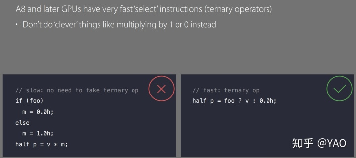
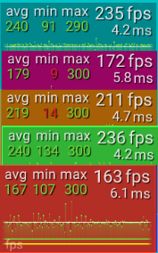
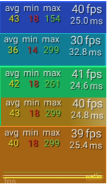
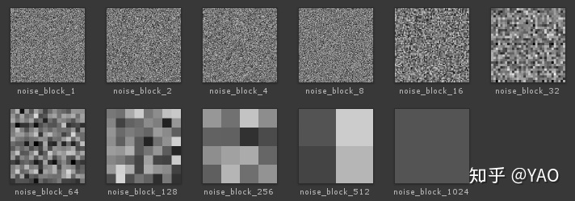
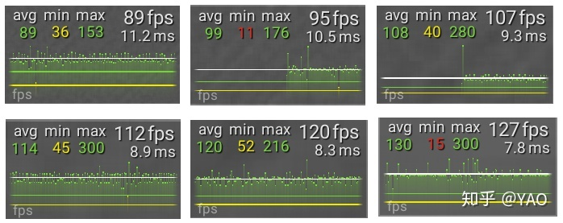
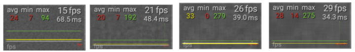

# shader mad是汇编指令吗_Shader中的 if 和分支

Shader 中提供了一些流程控制指令，如 if、for、while、switch、discard等。而使用最频繁的是以 if 为首的可能会产生分支的流程控制指令，所以本文也主要围绕 if 和分支进行讨论。


## 1 对 if 的传统理解

在 Shader 中，尽量避免使用 if 已成为绝大多数开发者的共识，究其原因是认为 if 会打断 GPU 的 warp内部（或者 wavefront，下文统称 warp）的并行化。

一种“优化”思路是规避 if 关键字，用内置指令替代，如 step 等。如：

```
if(cx > cy)
{
    x = a;
}
else
{
    x = b;
}
```

用内置指令优化一下：

```
lerp(a, b, step(cx, cy));
```

或者采取更“花哨”的内置函数组合封装一些通用判断方法，如这篇帖子：Avoiding Shader Conditionals。以文中的 when_gt 示例：

```
float when_gt(float x, float y) {
  return max(sign(x - y), 0.0);
}

col += 0.5 * when_gt(IN.uv.x, IN.uv.y));
```

对应的汇编指令如下：

```
   0: add r0.x, -v0.y, v0.x
   1: lt r0.y, l(0.000000), r0.x
   2: lt r0.x, r0.x, l(0.000000)
   3: iadd r0.x, -r0.y, r0.x
   4: itof r0.x, r0.x
   5: max r0.x, r0.x, l(0.000000)
   6: lt r0.y, v0.y, v0.x
   7: movc r0.y, r0.y, l(0.600000), l(0.100000)
   8: mad o0.xyzw, r0.xxxx, l(0.500000, 0.500000, 0.500000, 0.500000), r0.yyyy
   9: ret 
```

对照 if 表达式：

```
if (x > y)
{
     col += 0.5; 
}
```

生成的汇编指令：

```
   0: lt r0.x, v0.y, v0.x
   1: movc o0.xyzw, r0.xxxx, l(0.600000,0.600000,0.600000,0.600000), l(0.100000,0.100000,0.100000,0.100000)
   2: ret 
```

"if 表达式" 版本只有1条比较指令和 movc 指令，而 "when_gt" 生成的指令数更多、成了负优化，执行效率上来说 if 表达式完胜。（当然每条指令在硬件上执行的 cycle 不同，如果对照的指令差别很大，则不能纯粹通过比较指令数来衡量最终的GPU执行效率。）


## 2 if ≠ 分支

从上面 if 生成的指令来看，if 没有生成分支指令。事实上，对于简单逻辑而言，编译器大多生成的是一条现代GPU会硬件支持的 "select"（或称为 "conditional move"）指令，在D3D、PowerVR 等指令集中对应的就是一条 movc 指令。

所以，if 有可能生成分支，也有可能生成 "select"。if 不等于分支，我们真正要规避的是分支，而不是 if。if 最终是否会生成和执行分支指令，取决于具体厂商的“编译器 + driver + GPU”。像苹果就明确让开发者使用 ternary 操作符进行 "select"，并且在A8及之后的 GPU 都对 ternary 提供硬件支持：



对于 "select" ，我们可以通过iq大佬给出的一段测试用例（"Select" Test），比较下不同的写法和对应的性能表现：

```
// conditional move
#if METHOD==0
col = (p.x<h && p.y<h+h) ? col+tmp : col;
#endif
        
// "smart" way
#if METHOD==1
col += tmp*step(p.x,h)*step(p.y,h+h);
#endif
        
// even "smarter" way
#if METHOD==2
col += tmp*float(p.x<h && p.y<h+h);
#endif


// conditional branching
#if METHOD==3
if( p.x<h && p.y<h+h ) col += tmp;
#endif
```

另外像D3D或成熟的商用引擎如 UE4、U3D 等还提供了 flatten、branch 等流程控制关键字，根据对应的关键字编译成对应的流程控制指令或者翻译成对应的目标平台代码。


flatten 把分支所有侧的逻辑都执行一遍，根据判断条件选择其中一个结果；而 branch 则是一次执行分支中的一侧逻辑。（在具体使用时，编译器会判定这两个关键字是否会产生副作用，如果有就会让该关键字失效，可参考微软或其它相关文档。）


在大多数没有标明关键字的情况下，编译器默认生成的是 flatten 形式的指令。所以，在METHOD 3的基础上补充一条：

```
#if METHOD == 4
[branch]
if (uv.x < uv.z && uv.y < uv.z + uv.z) col += tmp;
#endif
```

在PC上（分辨率=1280 x 800，Graphics API = Direct3D 11.0，GPU = GTX 970，LoopNum = 1000），Method 0~4 的测试结果从上至下依次展示在下图中：



Test Selection
而在Android设备上（分辨率=1440 x 720，Graphics API = OpenGL ES 3.2，GPU = Mali-G72，LoopNum = 150），Method 0~4 的测试结果从上至下依次展示在下图中：




PC上最终的测试帧率：0 = 3 >= 2 > 1 > 4。Method 0 和 3生成的指令一样，Method 2在指令数上一致，只是指令略有不同，所以执行效率上有些差异。而 Method 1在本地测试平台生成的指令数较0、3、2多所以性能较低。Method 4 则是生成了分支所以性能最差。但在本地安卓设备上Method 4 和 3 测试结果几乎一致，说明并没有生成分支。（测试结果仅供参考，在不同设备上可能表现略有不同，以具体设备的 profile 为准。）


## 3 分支

分支无法避免，如果最终生成了分支指令，能尝试做些什么？首先从渲染流水线的角度来看，我们使用最频繁的还是 vertex shader 和 pixel shader，所以我们仅考虑这两个 stage。

而分支大体可以分为：

 static branch：如判断变量为 uniform 类型；
 dynamic branch & invariant（coherent）：如判断变量为 varying类型，且在 warp中 有相关性甚至一致；
 dynamic branch & variant（incoherent） ：如判断变量为 varying类型，但在 warp中 无任何相关性。

静态分支性能上几乎无损，而“ps + varaiant”分支则是需要尽量避免的。如有可能，优化方向尽量从 "ps + variant" -->“ps + invariant" 或 "vs + variant" --> "vs + invariant" ……

这里针对 pixel shader 中 invariant 和 variant 简单做了个实验（复用2中的测试用例代码逻辑，测试设备相同）。另外提供一组 block size 不同的噪声图，block size 用来模拟动态分支下不同程度的相关性。将噪声值作为判断条件，渲染一个三角形到全屏：





PC测试结果（LoopNum=1000，block size 从 1x1 到 32x32）



Android测试结果（LoopNum=100，block size 从 1x1 到 8x8）


可以看到随着 block size 越来越大即分支相关性越高，帧率也越来越高。（测试结果仅供参考，以具体设备 profile 为准。）

需要附加说明的是：

​    这一论证需要有个前置条件，GPU的像素绘制顺序 应该是按一定规律的方向顺序绘制；
​    在移动平台上，当 block size 大到一定程度的时候（本地android设备是 8x8），帧率不变。猜测是移动平台上的 Tile-Based 特性导致，而且 tile 大小很有可能就是 8x8 的块，而 warp 处理的 thread 数量应该小于等于 64。


## PS 现代GPU编译器

对于1中给出的 lerp + step“优化”方案，直觉上应该也会生成比 if表达式更多的指令，但聪明的编译器给出的结果是：

```
   0: ge r0.x, v0.y, v0.x
   1: movc o0.xyzw, r0.xxxx, l(1.100000,1.100000,1.100000,1.100000), l(0.600000,0.600000,0.600000,0.600000)
```

跟 if 几乎一致（比较指令不同而已）。现代GPU编译器已经能够很好的优化代码，不用像 GPU Gem介绍的Shader优化 需要手动整理成硬件友好的 mad、rcp 等形式，而且大量的 swizzle 技巧也是编译器的常规操作。手动调整一方面会影响代码可读性，另一方面带来的收益性价比不高。当然在 ALU 成为绝对瓶颈的情况下，可以进行尝试。


