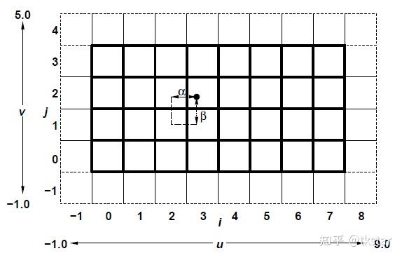
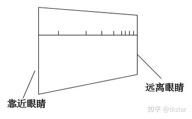
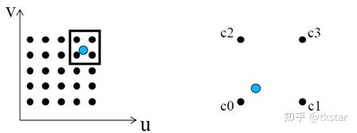
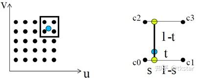
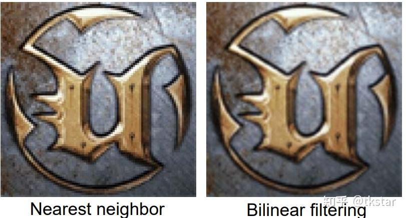
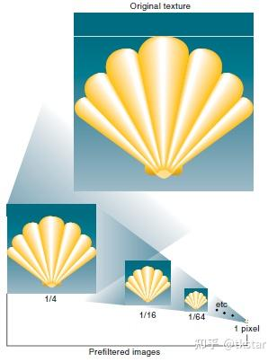
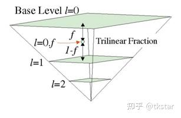
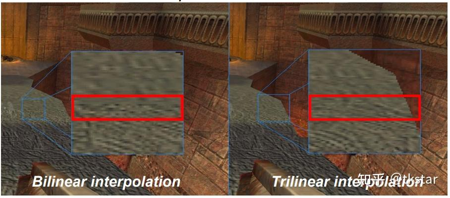
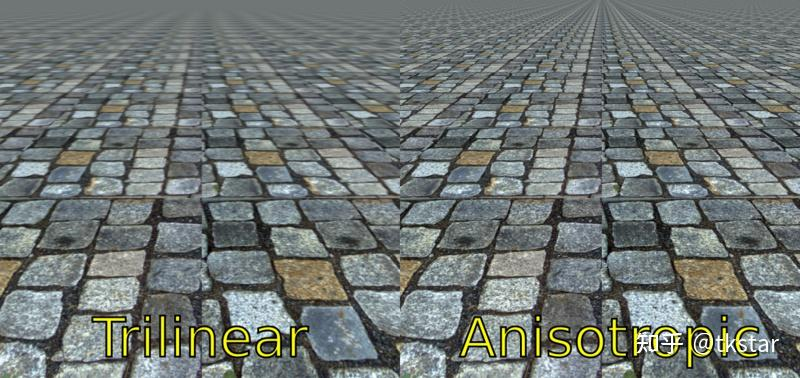

# 移动平台的纹理过滤

https://zhuanlan.zhihu.com/p/565721594

本篇文章浅谈下几种[纹理过滤](https://zhida.zhihu.com/search?content_id=213848262&content_type=Article&match_order=1&q=纹理过滤&zhida_source=entity)方法的原理、效果、硬件支持和性能。

纹理的长宽分别为(W,H)，那么它的存储就是一个W⋅H的数组，我们可以用texel(i,j)来索引纹理上的数据，例如texel(0,0)就表示水平位置为0，垂直位置为0的数据，每个像素值就称为**纹素**（Texel）。

在图形渲染时，我们往往不会用整数去获取纹素，我们用[UV坐标](https://zhida.zhihu.com/search?content_id=213848262&content_type=Article&match_order=1&q=UV坐标&zhida_source=entity)来表示（忽略三维纹理的情况），UV坐标是介于[0,1]之间的浮点数表示，一张纹理与UV坐标的对应关系的问题，如下图所示[6]。(u,v)=(0,0)表示texel(0,0)，那么(u,v)=(0.5,0)介于两个像素之间的情况时，它到底采用的是texel(0,0)，还是texel(1,0)呢？最简单的设想，就是取texel(0,0)和texel(1,0)的平均值，当然这是一种非常简单高效的做法。

但是，这里举的例子是假设纹理与屏幕是1：1且平铺的对应关系，它是最简单的情况，往往实际应用中，[纹理映射](https://zhida.zhihu.com/search?content_id=213848262&content_type=Article&match_order=1&q=纹理映射&zhida_source=entity)到场景的模型上时，或多或少都是有放大或者缩小的情况，而且贴图并不会平整的铺在屏幕上，如下图所示。当然，如何计算[三维空间](https://zhida.zhihu.com/search?content_id=213848262&content_type=Article&match_order=1&q=三维空间&zhida_source=entity)下的UV坐标是另外的一个话题。

纹理的[过滤算法](https://zhida.zhihu.com/search?content_id=213848262&content_type=Article&match_order=1&q=过滤算法&zhida_source=entity)，解决的问题就是给定uv坐标，如何获取纹素，**使得它有最优的场景表现**。通过屏幕显示的纹理有两类规则：

- 放大，Texture Magnification
- 缩小，Texture Minification

两类规则应用的过滤算法原理是一致的，共有四种纹理过滤方式：

- 邻近过滤（Nearest Neighbor Filtering）
- 线性过滤，也称为[双线性过滤](https://zhida.zhihu.com/search?content_id=213848262&content_type=Article&match_order=1&q=双线性过滤&zhida_source=entity)（(Bi)linear Filtering）
- 三线性过滤（Trilinear filtering）
- 各向异性过滤（Anisotropic Filtering）

设纹理的长宽分别为W、H，接下来考虑不同的纹理过滤算法，给定纹理坐标(u,v)，如何计算纹理上的[纹素值](https://zhida.zhihu.com/search?content_id=213848262&content_type=Article&match_order=1&q=纹素值&zhida_source=entity)呢？

## 邻近过滤

选择中心点最接近[纹理坐标](https://zhida.zhihu.com/search?content_id=213848262&content_type=Article&match_order=2&q=纹理坐标&zhida_source=entity)的那个像素，也是最简单的纹理过滤方式，只需要一次采样，效率最高，如下图所示，邻近过滤的计算方法为：

f(u,v)=texel(⌊u⋅W⌋,⌊v⋅H⌋)

邻近过滤[3]

## 线性过滤

选择中心点周围的4个纹素加权计算出来，如下图所示，周围的4个纹素分别为c0、c1、c2、c3，线性过滤是先从水平方向上根据距离s加权计算，再根据垂直方向t加权计算。

线性过滤[3]

s、t的计算方法如下所示，frac()函数是取一个浮点数的小数部分。

(s,t)=(frac(u⋅W),frac(v⋅H))

那么，计算纹素的算法就可以表示为：f(u,v)=lerp[lerp(c0,c1,s),lerp(c2,c3,s),t]

其中，lerp(a,b,x)=(1−x)a+bx。

原理上线性过滤需要获取4个纹素，但是现代的GPU硬件已经支持单个周期内完成线性过滤的采样，换句话说它是一个[原子操作](https://zhida.zhihu.com/search?content_id=213848262&content_type=Article&match_order=1&q=原子操作&zhida_source=entity)，并不会拆分为多次采样再加权计算，它消耗是与邻近过滤相当的。

邻近过滤和线性过滤效果也会有较为明显的差异，如下图所示。

邻近过滤和线性过滤效果对比[1]

在实际应用中，并不是邻近过滤方式没有任何用武之地，例如很多对深度的采样，并不希望有不同像素之间的加权效果，否则会引入较大的误差。

## 三线性过滤

前面两种过滤方式都是建立只使用单张[纹理贴图](https://zhida.zhihu.com/search?content_id=213848262&content_type=Article&match_order=1&q=纹理贴图&zhida_source=entity)的情况。有一篇神文"Pyramidal parametrics"[4]提出了mipmap的概念，下图所示，概念不赘述。在游戏引擎的渲染中，往往mipmap的纹理加载也是一个消耗点，最简单的策略是根据距离选择不同的层级加载，也可能根据项目不同模型的需求，选择不同的加载策略，例如根据模型的优先级来加载等。mipmap的加载策略，也是游戏优化的一个方面，不过这就是题外话了。在移动端的应用中，Mipmap是一种对GPU性能更友好的技术，它可以降低带宽的开销。

mipmap

举个mipmap的例子，一张128x128的纹理，总共就有8层mipmap，包括：1x1、2x2、4x4、8x8、16x16、32x32、64x64、128x128。这里有一个LOD（Level Of Detail）的概念，我们可以认为LOD 0表示128x128的原始贴图，LOD 1表示64x64的贴图，依次类推。

三线性过滤算法的原理相当于：线性过滤 + mipmap技术，在线性过滤的基础上，再从mipmap上选择两层mipmap，做一次加权混合，原理如下图所示。

三线性过滤[1]

这里有一个问题需要解决，如何选择[加权](https://zhida.zhihu.com/search?content_id=213848262&content_type=Article&match_order=7&q=加权&zhida_source=entity)的两层mipmap纹理呢？[OpenGL Spec](https://www.khronos.org/registry/OpenGL/specs/gl/glspec46.core.pdf)

估计纹理的梯度，基于[uv坐标](https://zhida.zhihu.com/search?content_id=213848262&content_type=Article&match_order=2&q=uv坐标&zhida_source=entity)在水平和垂直两个方向上的梯度来计算的：

ρ=max((∂u∂x)2+(∂v∂x)2,(∂u∂y)2+(∂v∂y)2)

梯度估计转化为LOD：

λ=log2ρ+lodbias

那么，我们就可以得到mipmap上的两层的纹理：

bott=⌊λ⌋,top=⌈λ⌉

最后，对两层采样出来的纹理进行[加权混合](https://zhida.zhihu.com/search?content_id=213848262&content_type=Article&match_order=2&q=加权混合&zhida_source=entity)，加权值为：w=frac(λ)

三线性过滤得到的效果也会优于线性过滤：

线性过滤 VS 三线性过滤

## 各向异性过滤

各向异性过滤就是纹理过滤的终极形态，它比三线性过滤效果更好，也更复杂，如下图所示。三线性过滤方式并不考虑UV两个方向上在屏幕空间上的缩放差异，而各向异性考虑到这个因素，因此在倾斜角度观察场景中的模型时，能获取更清晰的表现效果。

各向异性过滤与三线性过滤的效果对比[wiki]

首先，需要计算u方向和v方向的纹理梯度：

ρx=(∂u∂x)2+(∂v∂x)2,ρy=(∂u∂y)2+(∂v∂y)2

计算需要采样的次数：

ρmax=max(ρx,ρy),ρmin=min(ρx,ρy)N=min(⌈ρmaxρmin⌉,maxAniso)

即采样N次，最后再取加权算出结果，采样的次数上限受maxAniso控制。

选择的LOD的计算方法为：

λ=log2ρmaxN+lodbias

设单次采样在位置(u,v,λ)可以表示为τ(u,v,λ)，那么各向异性的采样计算就可以表示为：

f(u,v)={1N∑iNτ(u(x−12+iN+1,y),v(x−12+iN+1,y),λ),ρx≻ρy1N∑iNτ(u(x,y−12+iN+1),v(x,y−12+iN+1),λ),ρx≤ρy

## [性能分析](https://zhida.zhihu.com/search?content_id=213848262&content_type=Article&match_order=1&q=性能分析&zhida_source=entity)

在OpenGL下，是否支持可以通过[EXT_texture_filter_anisotropic](https://www.khronos.org/registry/OpenGL/extensions/EXT/EXT_texture_filter_anisotropic.txt)扩展来来判断；在[Metal](https://developer.apple.com/metal/Metal-Feature-Set-Tables.pdf)下，[移动平台](https://zhida.zhihu.com/search?content_id=213848262&content_type=Article&match_order=1&q=移动平台&zhida_source=entity)A7及以后的处理器都支持各向异性过滤方式，只是需要权衡它在移动平台的收益和消耗，再确定是否开启。

从实时开销的角度来说，邻近过滤和线性过滤的纹理采样消耗相似，可认为是一次普通的纹理采样消耗；三线性过滤的纹理采样消耗是普通的2倍；各向异性消耗的采样是普通采样的N倍，N依赖设置的maxAniso和实际的纹理与在屏幕上的水平垂直缩放尺寸，即最大采样层数。

从实时开销的角度分析，采样开销：

- 邻近过滤/线性过滤，1x；
- 三线性过滤，2x；
- 各向异性过滤，Nx（N依赖于设置以及纹理的倾斜角度）；

从带宽的角度分析：

- 邻近过滤/线性过滤，仅需要采样单层即可；
- 三线性过滤，需要支持mipmap，有两层mipmap的带宽开销；
- 各向异性过滤，需要支持mipmap，有两层mipmap的带宽开销，而且由于LOD更小，因此产生的带宽开销是高于三线性过滤。

单纯的考虑GPU性能而言，mipmap是带宽友好的技术。

## 参考

[1] CS 380 - GPU and GPGPU Programming Lecture 12: GPU Texturing 2. website< [https://faculty.kaust.edu.sa/sites/markushadwiger/Documents/CS380_spring2015_lecture_12.pdf#page=4](https://faculty.kaust.edu.sa/sites/markushadwiger/Documents/CS380_spring2015_lecture_12.pdf%23page=4) >

[2] The Khronos OpenGL ARB Working Group. OpenGL programming guide: the official guide to learning OpenGL, versions 3.0 and 3.1. Pearson Education, 2009.

[3] Computer Graphics Texture Filtering. website< [https://graphics.cg.uni-saarland.de/courses/cg1-2017/slides/CG09-TextureFiltering.pdf](https://graphics.cg.uni-saarland.de/courses/cg1-2017/slides/CG09-TextureFiltering.pdf) >

[4] Lance Williams. "Pyramidal parametrics." Proceedings of the 10th annual conference on Computer graphics and interactive techniques. 1983.

[5] Arm® Mali™ GPU Best Practices Version 2.0.

[6] [OpenGL 4.6 Core Profile](https://www.khronos.org/registry/OpenGL/specs/gl/glspec46.core.pdf)