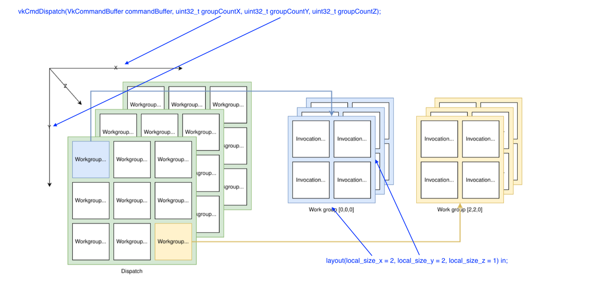

# vulkan compute shader 纹理解压

## Preface

在 android 模拟器等环境中，原生的移动端应用的渲染任务需要在桌面级 GPU 上进行。
但在移动端上，常见的 ASTC 等纹理格式在桌面级 GPU 上往往并没有支持。所以这时往往选择利用 compute shader 将 ASTC 等纹理转码解压为 RGBA 格式（或进一步压缩为 BC 格式）来供桌面级 GPU 识别。
本文参考了 google android emulator、ANGLE、gfxstream 项目，不深究纹理格式的细节，只关注数据的流向，简单总结一下 vulkan compute shader 在压缩纹理模拟中的应用。

## work item & work group

在 vulkan compute shader 中，work item 是 shader 运行的基本单位。即有 n 个 work item，compute shader 就会被调用 n 次。所以 work item 也叫做 invocation (调用)。
而 work group 是 work item 的集合。在同一个 work group 中，work item 之间有共用 shared memory。
vulkan 中的 work item 是与 cuda 中的 thread 中类似的概念；vulkan 中的 work group 是与 cuda 中的 block 类似的概念。
在 vulkan API 中，vkCmdDispatch 函数是 compute shader 实际下发的接口。
`void vkCmdDispatch(VkCommandBuffer commandBuffer, uint32_t groupCountX, uint32_t groupCountY, uint32_t groupCountZ);`
其中的 groupCountX, groupCountY, groupCountZ 参数指每个维度上 work group 的数目。
而在对应的 GLSL 代码中，local_size_x、local_size_y、local_size_z 指一个 workgroup 中，每个维度上，work item 的数目，所以也叫作 local work group size。

举例来说，如果我们有一个 512 * 512 的 2D 图像，并且想把图像中的每个像素在 compute shader 中处理一次（per pixel），并且设置 local work group size 为 8。
那么我们可以在 GLSL 代码中做如下设置：
`layout(local_size_x = 8, local_size_y = 8, local_size_z = 1) in;`
并在 vkCmdDispatch 调用时设置如下的参数：
`vk->vkCmdDispatch(commandBuffer, 512/8, 512/8, 1);`

下图也可以很直观地反映 work item (invocation)、work group 和 vkCmdDispatch 之间的关系。


## descriptor set

在配置 compute shader pipeline 的过程中，输入（压缩纹理）与输出（解压后的纹理）的图像以 descriptor set 的形式传输给 shader。
以 [google android emulator 项目中的代码](https://android.googlesource.com/platform/external/qemu/+/emu-master-dev/android/android-emugl/host/libs/libOpenglRender/vulkan/VkDecoderGlobalState.cpp)为例，

```cpp
    for (uint32_t i = 0; i < mipLevels; i++) {
        sizeCompImageViews[i] = createDefaultImageView(
                vk, device, sizeCompImgs[i], sizeCompFormat, imageType,
                0, layerCount);
        decompImageViews[i] = createDefaultImageView(
                vk, device, decompImg, intermediateFormat, imageType, i,
                layerCount);
        sizeCompDescriptorImageInfo[0].imageView =
            sizeCompImageViews[i];
        decompDescriptorImageInfo[0].imageView = decompImageViews[i];
        writeDescriptorSets[0].dstSet = decompDescriptorSets[i];
        writeDescriptorSets[1].dstSet = decompDescriptorSets[i];
        vk->vkUpdateDescriptorSets(device, 2, writeDescriptorSets, 0,
                nullptr);
    }
```

代码中 sizeCompDescriptorImageInfo 即压缩纹理的数据，decompDescriptorImageInfo 即解压后的数据。
值得注意的是，createDefaultImageView 函数会调用 vkCreateImageView，其中的第 4 个函数会被传入当作 VkImageViewCreateInfo 的 format，即 VkImageView 的格式。
在 ASTC 输入时，VkImageView 的格式为 VK_FORMAT_R32G32B32A32_UINT，而在 RGBA 格式作为输出时，VkImageView 的格式为 VK_FORMAT_R8G8B8A8_UINT。
这么选择格式的原因在于：ASTC 纹理的每个 block 占用 128 bits，所以 shader 以 128 bits 为单位读取数据；而 RGBA 格式的图像每个像素占用 32 bits，所以 shader 以 32 bits 为单位写入数据。这与 [shader 中的代码](https://android.googlesource.com/platform/external/qemu/+/emu-master-dev/android/android-emugl/host/libs/libOpenglRender/vulkan/Astc.comp)也是对应的：

```cpp
layout(binding = 0, rgba32ui) readonly uniform uimage${type} u_image0;
layout(binding = 1, rgba8ui) writeonly uniform uimage${type} u_image1;
```

## imageLoad & texelFetch

compute shader 读取纹理的接口为 imageLoad 函数。
依旧以 [google android emulator 中的 ASTC 解压 shader](https://android.googlesource.com/platform/external/qemu/+/emu-master-dev/android/android-emugl/host/libs/libOpenglRender/vulkan/Astc.comp) 为例：

```cpp
void main(void) {
    ivec3 pos = ivec3(gl_GlobalInvocationID.xyz);
    pos.z += int(u_pushConstant.baseLayer);
    uvec4 srcBlock = uvec4(imageLoad(u_image0, getPos${type}(pos)));
    srcBlock = uvec4(srcBlock[3], srcBlock[2], srcBlock[1], srcBlock[0]);
    uvec4[144] decompressed = astc_decode_block(srcBlock);
```

由于该 shader 本身是 per block 调用的（vkCmdDispatch 中的参数决定），gl_GlobalInvocationID 就是每个 ASTC block 的坐标起始位置。 imageLoad 就会在这个坐标下读取 128 bits，即一个完整的 ASTC block 的数据，并将其分为四个 channel，每个 32 bits，存入 srcBlock 的 x、y、z、w 向量中。

另外还有一个 texelFetch 接口，也可以在 compute shader 中读取图像数据。
但这类数据的来源不是 uimage ，而是 usamplerBuffer，而且这类数据是以 1 维的形式读入的。
[ANGLE 项目中 ETC->BC 转码的 shader](https://chromium.googlesource.com/angle/angle/+/refs/heads/main/src/libANGLE/renderer/vulkan/shaders/src/EtcToBc.comp) 中就用到了这个方式。

```cpp
void main()
{
    ivec2 coord = build_coord();
    if( any(greaterThanEqual(coord, ivec2(width, height)) ))
        return;

    ivec2 tile_coord = coord >> 2;
    ivec2 pixel_coord = coord & 3;
    int linear_pixel = 4 * pixel_coord.x + pixel_coord.y;
    int pid = 4 * pixel_coord.y + pixel_coord.x;
    uvec4 payload = texelFetch(uInputBuffer, tile_coord.y * int((width+3)>>2) + tile_coord.x + texelOffset);
    //...
```

由于 ANGLE 中 ETC->BC 的转码 shader 是以 per pixel 调用的，build_coord 函数得到的是图像的绝对坐标。
代码中在 X 和 Y 轴上都将其除以 4 （因为 ETC 的纹理 block 为 4×4），来获取对应纹理数据在 1 维呈现时的线性位置，进而调用 texelFetch，将输入存入 payload 的 x、y、z、w 向量中。
与 uimage 的读取方式由 VkImageViewCreateInfo 的 format 参数确定类似，usamplerBuffer 输入格式由 VkBufferViewCreateInfo 的 format 参数确定。
该 format 在[这段代码](https://chromium.googlesource.com/angle/angle/+/refs/heads/main/src/libANGLE/renderer/vulkan/UtilsVk.cpp)中确定：

```cpp
angle::FormatID GetCompactibleUINTFormat(const angle::Format &format)
{
    ASSERT(format.pixelBytes == 8 || format.pixelBytes == 16);
    return format.pixelBytes != 8 ? angle::FormatID::R32G32B32A32_UINT
                                  : angle::FormatID::R32G32_UINT;
}
```

pixelBytes 指的是一个纹理 block 需要的字节数。ETC2 纹理的一个 block 占用 64 bits，即 8 bytes。

## imageStore

纹理的存储用到的是 imageStore 接口，与 imageLoad 是相似的过程。
以 [gfxstream 中 ASTC->RGBA 的转码 shader](https://android.googlesource.com/platform/hardware/google/gfxstream/+/refs/heads/main/host/vulkan/emulated_textures/shaders/AstcToRgb.comp) 举例，

```cpp
layout(binding = 0, rgba32ui) readonly uniform WITH_TYPE(uimage) srcImage;
layout(binding = 1, rgba8ui) writeonly uniform WITH_TYPE(uimage) dstImage;
void main() {
    uvec2 texelPos = gl_GlobalInvocationID.xy;
    uint layer = u_pushConstant.baseLayer + gl_GlobalInvocationID.z;
    uvec2 blockPos = texelPos / u_pushConstant.blockSize;
    uvec2 posInBlock = texelPos % u_pushConstant.blockSize;
    uvec4 astcBlock = imageLoad(srcImage, WITH_TYPE(getPos)(ivec3(blockPos, layer))).wzyx;
    astcDecoderInitialize(astcBlock, u_pushConstant.blockSize);
    uvec4 texel = astcDecodeTexel(posInBlock);
    imageStore(dstImage, WITH_TYPE(getPos)(ivec3(texelPos, layer)), texel);
}
```

该 shader 是以 per pixel 调用的，故 texelPos 就是图像的绝对坐标，所以 imageStore 直接以 32 bits 为单位，将数据写入对应的坐标。
而对比 [gfxstream 中 ASTC->BC3 转码的 shader](https://android.googlesource.com/platform/hardware/google/gfxstream/+/refs/heads/main/host/vulkan/emulated_textures/shaders/AstcToBc3.comp)，

```cpp
layout(binding = 0, rgba32ui) readonly uniform WITH_TYPE(uimage) srcImage;
layout(binding = 1, rgba32ui) writeonly uniform WITH_TYPE(uimage) dstImage;

//...

void main() {
    //...
    if (texelId == 0) {
        imageStore(dstImage, WITH_TYPE(getPos)(ivec3(texelCoord / 4, layer)), result);
}
```

由于输出的是 BC3 格式，所以写入时的坐标在 X、Y 轴都除以了 4，并且一次写入的数据为 128 bits。