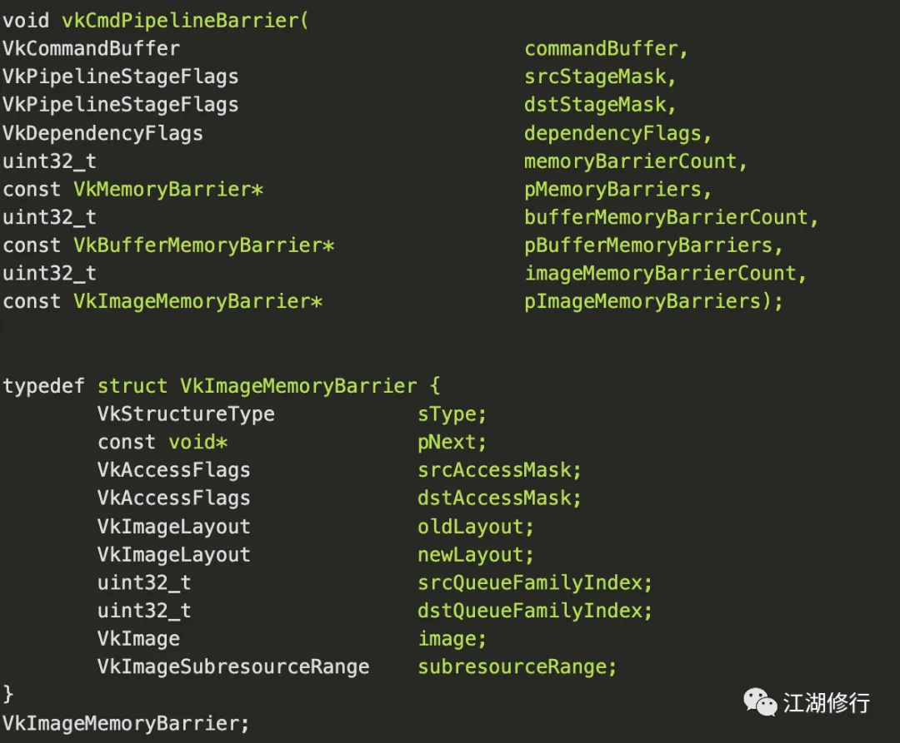
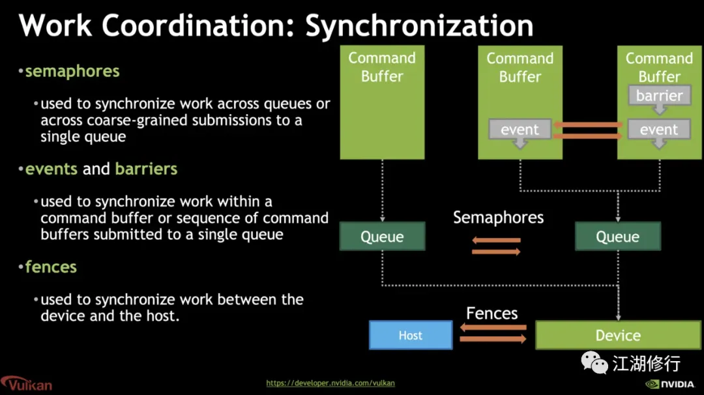
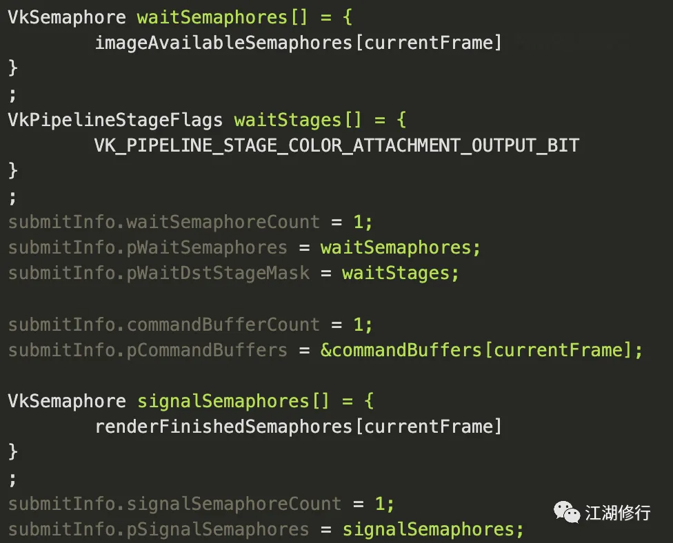
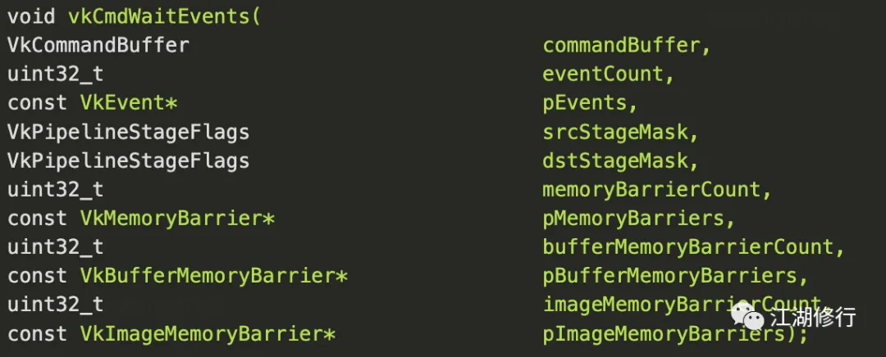
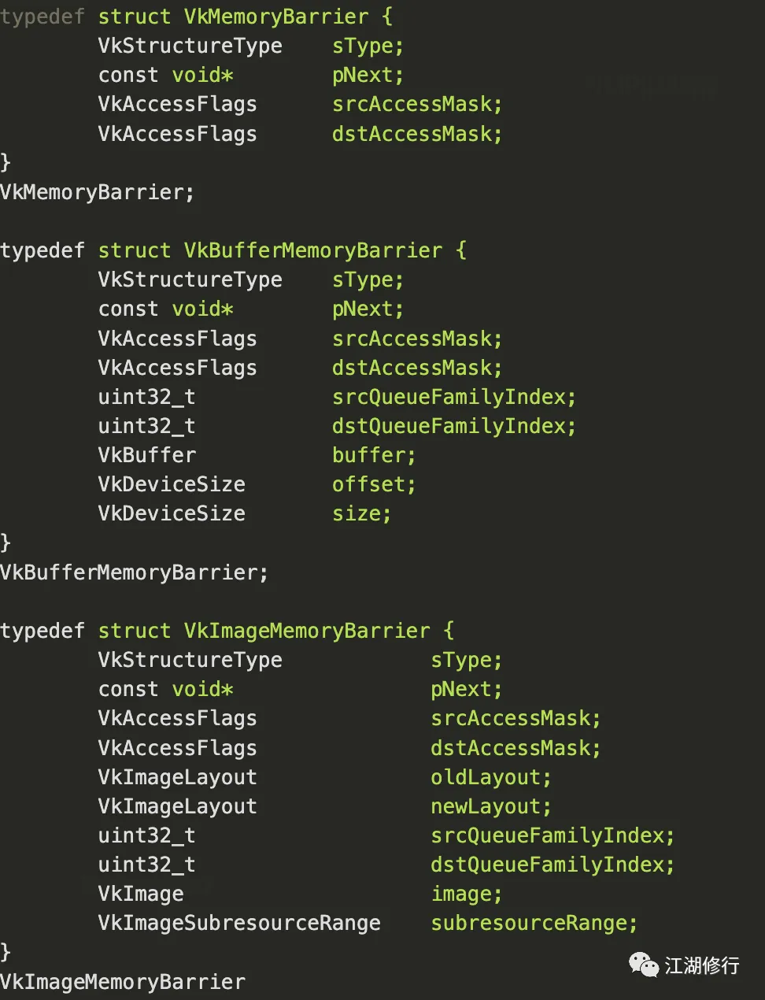

# Vulkan 同步

**前言**

在前面的文章中，我们讲解了Vulkan的多线程设计理念，分析了其底层的机制。我们知道在Vulkan的设计中，尽量避免资源的同步竞争，但是在某些复杂场景和多线程优化过程中难免会遇到资源竞争的问题，这时候就需要同步机制来保证线程访问数据的安全性和一致性。

然而Vulkan认为资源读写所需要做的同步是应用程序的职责，其内部只提供了很少的隐式同步机制，其余的都需要在程序中显式地使用Vulkan中的同步机制来实现。

**Vulkan同步基础**

在Vulkan代码实现中，使用的同步命令会涉及如下代码：

**VkPipelineStageFlags**

Vulkan所有的命令都会在Pipeline上执行，只是不同类型的命令，它们的执行阶段是不同的。当我们在Vulkan中使用同步机制时，都是以流水线阶段为单位，即某个流水线阶段上执行的所有命令，会在当前阶段暂停，等待另一个流水线阶段上的所有命令在相应的阶段执行完全后，再开始执行。VkPipelineStageFlags就代表流水线阶段。

***\*VkAccessFlags\****

Vulkan中的同步不仅控制操作执行的顺序，还要控制缓存的写回，即内存数据的同步，VkAccessFlags是为了控制流水线阶段对于内存的读写操作。

因为在CPU等存储器件为了读写性能都会分为多层缓存。多级缓存就会导致多线程读写数据的一致性问题，就需要有机制保证某一层缓存数据更新了需要同步到其他缓存上，比如MemoryBarrier，而所有的MemoryBarrier中也都会包含VkAccessFlags参数。

Vulkan所有的同步在全局上都应该认为是对一个Queue中的所有命令有效果。

**Vulkan同步原语
**

Vulkan中主要有四种同步原语（synchronization primitives）：

- - Fences

  - - 最粗粒度的同步原语，用于同步跨队列或跨粗粒度提交到单个队列的工作，目的是给CPU端提供一种方法，可以知道GPU或者其他Vulkan Device什么时候把提交的工作全部做完。类似Android的显示机制。

  - Semaphores

  - - 颗粒度比Fences更小一点，通常用于不同Queue之间的数据同步操作

  - Events

  - - 颗粒度更小，可以用于Command Buffer之间的同步工作。

  - Barriers

  - - Vulkan流水线（Pipeline）阶段内用于内存访问管理和资源状态移动的同步机制。

## **Fence**

如上介绍Fence是粗粒度的同步，它有两种状态——signaled和unsignaled。

在调用vkQueueSubmit时可以关联一个Fence，这样当Queue中的所有命令都被完成以后，Fence就会被设置成signaled的状态；

通过调用vKResetFences可以让一个Fence恢复成unsignaled的状态；

vkWaitForFences会让CPU原地阻塞，需要等待直到它关联的Fence变为signaled的状态，这样就可以实现在某个渲染队列内的所有任务被完成后，CPU再执行某些操作的同步场景。

Fence也具备内存数据同步的功能，但不需要开发者手动调用。在使用Fence时，如果它一旦被设置成signaled状态，那么使用这个Fence的Queue中的所有的命令如果涉及到了对内存的修改，后续的内存访问就一定会在signaled之前在Device上更新（注意只是在Device上更新，如果确保CPU也能够获取最新的值的话，就需要再用上其他的同步原语）。

## **Semaphore**

Semaphore用于queue每次提交的一批命令之间的同步和Fence一样，它也有两种状态：signaled和unsignaled。

调用vkQueueSubmit提交命令时，会填充VkSubmitInfo结构，而这个结构体中需要设置pWaitSemaphores、pSignalSemaphores、pWaitDstStageMask。程序在执行到pWaitDstStageMask时要阻塞，直到等pWaitSemaphores所指向的所有Semaphore的状态变成signaled时才可以继续执行。本次提交的Command buffer执行结束后，pSignalSemaphores所指向的所有Semaphore的状态都会被设置成signaled。

注：vkQueueSubmit函数本身也隐含了一个内存数据的同步机制：就是CPU上所有的内存修改操作，都会在GPU读写之前，对GPU而言变成available的，并且对于所有后续在GPU上的MemoryAccess，它们都是visible的。

部分相关代码示例：

vkQueueSubmit(graphicsQueue, 1, &submitInfo, inFlightFences[currentFrame])；

**Event**

Event同样也具有两种状态——signaled和unsignaled，与Fence不同的是，它的状态改变既可以在CPU上完成，也可以在GPU上完成，并且它是一种细粒度的同步机制。注意：Event只能用在同队列的Command buffer间的同步。

在CPU侧可以调用vkSetEvent来使一个Event变成Signaled的状态；调用vkResetEvent来使一个Event恢复成Unsignaled的状态；调用vkGetEventStatus获取一个Event的当前状态，根据Event状态阻塞CPU运行。

GPU侧：通过vkCmdSetEvent命令来使得一个Event变成Signaled状态，此时该命令附加了一个操作执行同步：根据提交顺序，在该命令之前的所有命令都必须在Event设置Signaled状态之前完成。

通过vkCmdResetEvent命令来使得一个Event变成Unsignaled状态，此时该命令同样附加了一个操作执行同步：根据提交顺序，在该命令之前的所有命令都必须在Event设置Unsignaled状态之前完成。

相关代码：

#### **Barrier**

所有的同步原语中，Barrier的使用成本最高。Barrier用于显式地控制buffer或者image的访问范围，避免hazards（RaW,WaR,and WaW），保证数据一致性。

Barrier又分为pipeline barrier和memory barrier。

**pipeline barrier**

要开发者了解渲染管线的各个阶段，能清晰地把握管线中每个步骤对资源的读写顺序。

Vulkan中Pipline各阶段的定义：

- - - TOP_OF_PIPE_BIT
    - DRAW_INDIRECT_BIT
    - VERTEX_INPUT_BIT
    - VERTEX_SHADER_BIT
    - TESSELLATION_CONTROL_SHADER_BIT
    - TESSELLATION_EVALUATION_SHADER_BIT
    - GEOMETRY_SHADER_BIT
    - FRAGMENT_SHADER_BIT
    - EARLY_FRAGMENT_TESTS_BIT
    - LATE_FRAGMENT_TESTS_BIT
    - COLOR_ATTACHMENT_OUTPUT_BIT
    - TRANSFER_BIT
    - COMPUTE_SHADER_BIT
    - BOTTOM_OF_PIPE_BIT
    - - 

举一个简单的例子：

场景中有两个渲染管线P1 和 P2，P1会通过Vertex Shader往Command buffer写入顶点数据，P2需要在Compute Shader中使用这些数据。如果使用fence，P1的command提交后，P2通过fence确保P1的操作已经被全部执行完，再开始工作。但理论上P2只需要在Compute Shader阶段等待P1的顶点数据即可。

该场景优化可以用Barrier，只需要告诉Vulkan，我们在P2的Compute Shader阶段才需要等待P1 Vertex Shader里面的数据，其他阶段可以并行。

***\*Memory Barrier\****

内存数据的同步需要使用Memory Barrier完成，Vulkan中有三种MemoryBarrier。

所有的MemoryBarrier都需要搭配PipelineBarrier或者Event使用。

#### **隐藏的执行顺序**

Vulkan是显式的，号称“没有秘密的API”。但是在多线程同步时，还是存在一些潜规则。在提隐式执行前，先来了解下提交顺序，它是Vulkan的隐式同步及用户的显式同步的前提。

- - - 在CPU上通过多次vkQueueSubmit提交了一系列命令，这些命令的提交顺序为先提交的先行。
    - 同一个Command Buffer的操作，先提交的先行
    - 同一个Queue中，一起提交的多个Command Buffer，按照下标顺序提交。

了解了提交顺序后，我们来看下Vulkan中隐式的执行顺序，

- - - Command Buffer中的Command，严格遵循提交顺序的，先记录的先执行。
    - 先提交的Command Buffer先执行
    - 同一个Queue中，一起提交的多个Command Buffer，严格按照提交顺序执行
    - ImageLayout的转移是通过ImageMemoryBarrier实现的，严格按照提交顺序执行。

**总结
**

本篇文章讲了Vulkan中的同步机制，包含显示和隐藏的同步控制，只能感叹Vulkan的操作是真的繁琐，希望大家能在了解同步机制的情况下，实现出性能更极致的程序。

参考

> Vulkan Specification
>
> https://www.khronos.org/registry/vulkan/specs/1.1-extensions/html/vkspec.html#synchronization

> Yet another blog explaining Vulkan synchronization
>
> http://themaister.net/blog/2019/08/14/yet-another-blog-explaining-vulkan-synchronization/