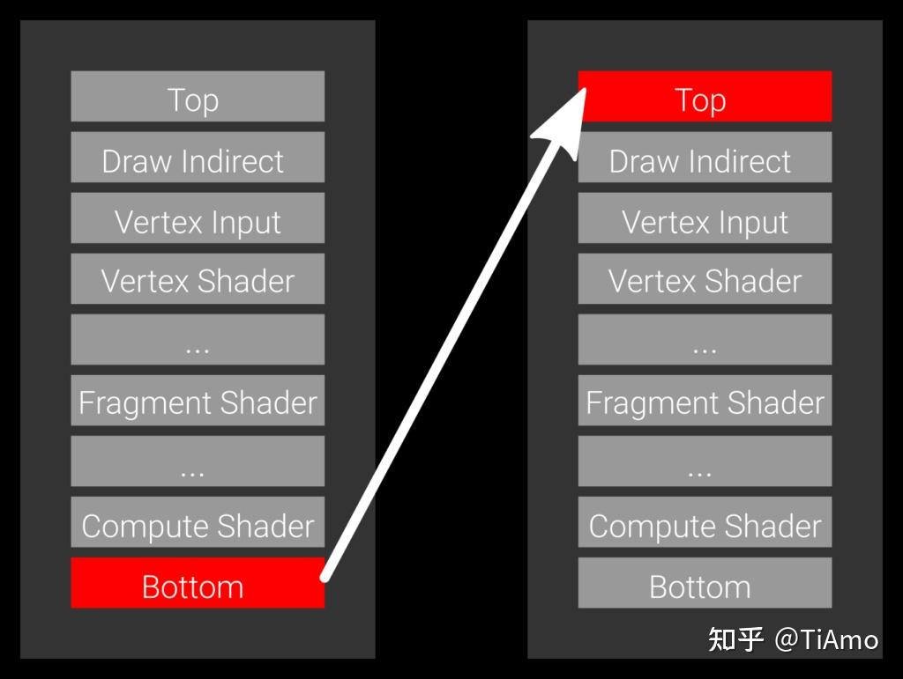
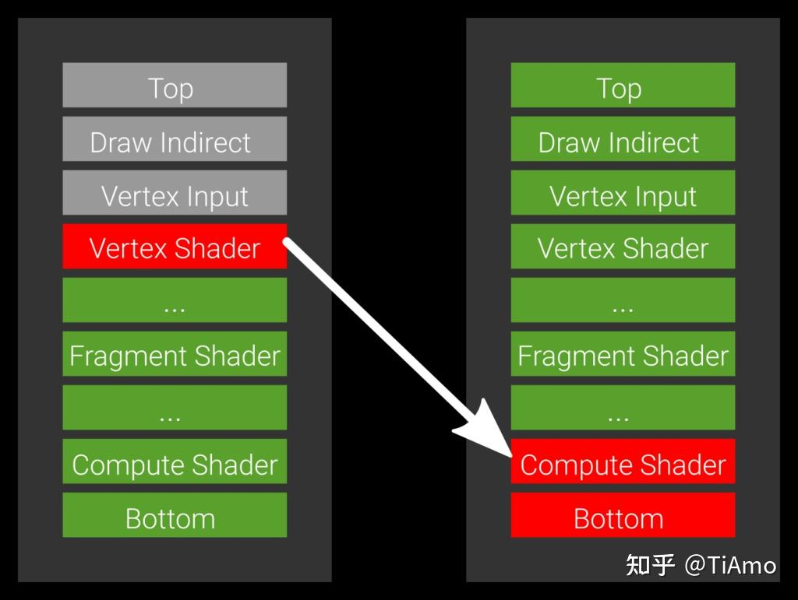

# Vulkan Barriers

### **Vulkan® 屏障系统的独特性**

Vulkan® 的屏障系统在设计上具有独特性：它不仅要求开发者指定需要转换的资源，还需明确**源（Source）和目标（Destination）管线阶段**。这种设计支持对转换执行时机进行细粒度控制。然而，若仅采用简单粗暴的设置方式，可能导致显著的性能损失。本文将深入解析 `vkCmdPipelineBarrier` 的优化策略。


------

### **管线阶段概述**

GPU 作为高度流水线化的设备，命令从管线顶端进入，依次执行顶点着色（Vertex Shading）、片元着色（Fragment Shading）等阶段，最终在底部完成执行并退出。Vulkan 通过 `VK_PIPELINE_STAGE` 枚举公开了这一流程：

```plaintext
TOP_OF_PIPE_BIT
DRAW_INDIRECT_BIT
VERTEX_INPUT_BIT
VERTEX_SHADER_BIT
TESSELLATION_CONTROL_SHADER_BIT
TESSELLATION_EVALUATION_SHADER_BIT
GEOMETRY_SHADER_BIT
FRAGMENT_SHADER_BIT
EARLY_FRAGMENT_TESTS_BIT
LATE_FRAGMENT_TESTS_BIT
COLOR_ATTACHMENT_OUTPUT_BIT
TRANSFER_BIT
COMPUTE_SHADER_BIT
BOTTOM_OF_PIPE_BIT
```

> **注**：枚举顺序并非严格对应命令执行顺序——某些阶段可能合并或跳过，但整体描述了命令流经的管线阶段。

此外，还存在三个**伪阶段（Pseudo-Stages）**，用于组合多阶段或处理特殊访问：

- `HOST_BIT`（主机操作）
- `ALL_GRAPHICS_BIT`（所有图形阶段）
- `ALL_COMMANDS_BIT`（所有命令阶段）

------

### **屏障中的源与目标阶段**

在屏障上下文中，**源阶段**代表**生产者（Producer）**，即生成数据的操作；**目标阶段**代表**消费者（Consumer）**，即使用数据的操作。通过指定这两个阶段，开发者告知驱动程序：

1. **源阶段的所有操作**必须完成，方可执行转换；
2. **目标阶段的操作**必须等待转换结束后启动。

------

### **案例分析：优化屏障策略**

#### **❌ 低效方案：全管线阻塞**

```cpp
vkCmdPipelineBarrier(
    commandBuffer,
    VK_PIPELINE_STAGE_BOTTOM_OF_PIPE_BIT, // 源阶段
    VK_PIPELINE_STAGE_TOP_OF_PIPE_BIT,    // 目标阶段
    /* 其余参数省略 */
);
```

此配置要求 **GPU 上所有进行中的命令完成**后才执行转换，且**新命令需等待转换结束**。这会导致严重的**管线气泡（Pipeline Bubble）**，浪费并行潜力。


------

#### **✅ 优化方案：精准阶段匹配**

**场景**：顶点着色器通过 `imageStore` 写入数据，计算着色器需读取该数据。

```cpp
vkCmdPipelineBarrier(
    commandBuffer,
    VK_PIPELINE_STAGE_VERTEX_SHADER_BIT, // 源阶段（生产者：顶点着色器）
    VK_PIPELINE_STAGE_COMPUTE_SHADER_BIT, // 目标阶段（消费者：计算着色器）
    /* 其余参数省略 */
);
```

**效果**：

- 仅等待顶点着色器完成写入，而非整个管线；
- 计算着色器可立即启动，避免阻塞片元着色等耗时操作。

------

### **常见场景的优化配置**

|       **场景**       |     **源阶段（生产者）**      | **目标阶段（消费者）** |           **依据**            |
| :------------------: | :---------------------------: | :--------------------: | :---------------------------: |
|    G-Buffer 渲染     | `COLOR_ATTACHMENT_OUTPUT_BIT` | `FRAGMENT_SHADER_BIT`  | 颜色附件输出 → 片元读取 **4** |
|       阴影贴图       |   `LATE_FRAGMENT_TESTS_BIT`   | `FRAGMENT_SHADER_BIT`  | 深度测试完成 → 片元采样 **4** |
| 数据传输至顶点缓冲区 |        `TRANSFER_BIT`         |   `VERTEX_INPUT_BIT`   | 传输完成 → 顶点输入使用 **4** |

------

### **黄金法则：最小化阻塞范围**

- **生产者端**：尽量将源阶段**靠近数据实际就绪点**（避免过度等待后续阶段）。
- **消费者端**：尽量将目标阶段**靠近数据实际使用点**（避免过早阻塞后续阶段）。

> **硬件实现差异**：若硬件不支持指定阶段的同步信号，驱动可能将源阶段下移（向 `BOTTOM`）、目标阶段上移（向 `TOP`）。开发者应**聚焦设置最紧密（Tight）的阶段**，无需担忧底层适配。

------

### **总结**

Vulkan 屏障的核心在于**精准匹配生产者与消费者阶段**。通过避免全管线阻塞（如 `BOTTOM → TOP`），转而指定如 `VERTEX → COMPUTE` 的紧耦合阶段，可显著提升 GPU 利用率。始终遵循 **“早生产、晚等待”** 原则，最大化管线并行度。


# Vulkan Barriers Explained

Vulkan®’s barrier system is unique as it not only requires you to provide what resources are transitioning, but also specify a source and destination pipeline stage. This allows for more fine-grained control of when a transition is executed. However, you can also leave quite some performance on the table if you just use the simple way, so today we’re going to look at `vkCmdPipelineBarrier` in detail.

## Pipeline overview

It is common knowledge that the GPU is a highly pipelined device. Commands come in at the *top*, and then individual stages like vertex and fragment shading are executed in order. Finally, commands retire at the *bottom* of the pipeline when execution has finished.

This is exposed in Vulkan® through the `VK_PIPELINE_STAGE` enumeration, which is defined as:

- `TOP_OF_PIPE_BIT`
- `DRAW_INDIRECT_BIT`
- `VERTEX_INPUT_BIT`
- `VERTEX_SHADER_BIT`
- `TESSELLATION_CONTROL_SHADER_BIT`
- `TESSELLATION_EVALUATION_SHADER_BIT`
- `GEOMETRY_SHADER_BIT`
- `FRAGMENT_SHADER_BIT`
- `EARLY_FRAGMENT_TESTS_BIT`
- `LATE_FRAGMENT_TESTS_BIT`
- `COLOR_ATTACHMENT_OUTPUT_BIT`
- `TRANSFER_BIT`
- `COMPUTE_SHADER_BIT`
- `BOTTOM_OF_PIPE_BIT`

Notice that this enumeration is not necessarily in the order a command is executed – some stages can be merged, some stages can be missing, but overall these are the pipeline stages a command will go through.

There are also three pseudo-stages which combine multiple stages or handle special access:

- `HOST_BIT`
- `ALL_GRAPHICS_BIT`
- `ALL_COMMANDS_BIT`

For the sake of this article, the list between `TOP_OF_PIPE_BIT` and `BOTTOM_OF_PIPE_BIT` is what we’re going to discuss. So what does *source* and *target* mean in the context of a barrier? You can think of it as the “producer” and the “consumer” stage – the source being the producer, and the target stage being the consumer. By specifying the source and target stages, you tell the driver what operations need to finish before the transition can execute, and what must not have started yet.



Let’s look first at the simplest case, which is a barrier which specifies `BOTTOM_OF_PIPE_BIT` as the source stage and `TOP_OF_PIPE_BIT` as the target stage (Example 1). The source code for this would be something like:

vkCmdPipelineBarrier(
commandBuffer,
VK_PIPELINE_STAGE_BOTTOM_OF_PIPE_BIT, // source stage
VK_PIPELINE_STAGE_TOP_OF_PIPE_BIT, // destination stage
/* remaining parameters omitted */);


This transition expresses that every command currently in flight on the GPU needs to finish, then the transition is executed, and no command may start before it finishes transitioning. This barrier will wait for everything to finish and block any work from starting. That’s generally not ideal because it introduces an unnecessary pipeline bubble.



Imagine you have a vertex shader that also stores data via an `imageStore` and a compute shader that wants to consume it. In this case you wouldn’t want to wait for a subsequent fragment shader to finish as this can take a long time to complete. You really want the compute shader to start as soon as the vertex shader is done. The way to express this is to set the source stage -the producer- to `VERTEX_SHADER_BIT` and the target stage -the consumer- to `COMPUTE_SHADER_BIT` (Example 2).

vkCmdPipelineBarrier(
commandBuffer,
VK_PIPELINE_VERTEX_SHADER_BIT, // source stage
VK_PIPELINE_COMPUTE_SHADER_BIT, // destination stage
/* remaining parameters omitted */);


If you write to a render target and read from it in a fragment shader, the stages would be `VK_PIPELINE_STAGE_COLOR_ATTACHMENT_OUTPUT_BIT` as the source and `VK_PIPELINE_STAGE_FRAGMENT_SHADER_BIT` as the destination – typical for G-Buffer rendering. For shadow maps, the source would be `VK_PIPELINE_STAGE_LATE_FRAGMENT_TESTS_BIT`. Another typical example is copying data – you produce the data through a copy, so the source stage would be set to `VK_PIPELINE_STAGE_TRANSFER_BIT`, and the destination to the stage where you need it. For [vertex buffers](https://zhida.zhihu.com/search?content_id=172767973&content_type=Article&match_order=1&q=vertex+buffers&zhida_source=entity), this would be for instance `VK_PIPELINE_STAGE_VERTEX_INPUT_BIT`.

Generally, you should try to maximize the number of “unblocked” stages, that is, produce data early and wait late for it. It’s always safe on the producer side to move towards the bottom of the pipe, as you’ll wait for more and more stages to finish, but it won’t improve performance. Similarly, if you want to be safe on the target side, you move upwards towards the top of pipe – but it prevents more stages from running, so that should be avoided as well.

One final remark: as mentioned previously, the hardware may not have all the stages internally, or may not be able to signal or wait at the specified stage. In those cases, the driver is free to move your source stage towards the bottom of the pipe and the target stage towards the top. This is implementation-specific though, and you should not have to worry about this – your goal should be to set the stages as “tight” as possible and minimize the number the blocked stages.