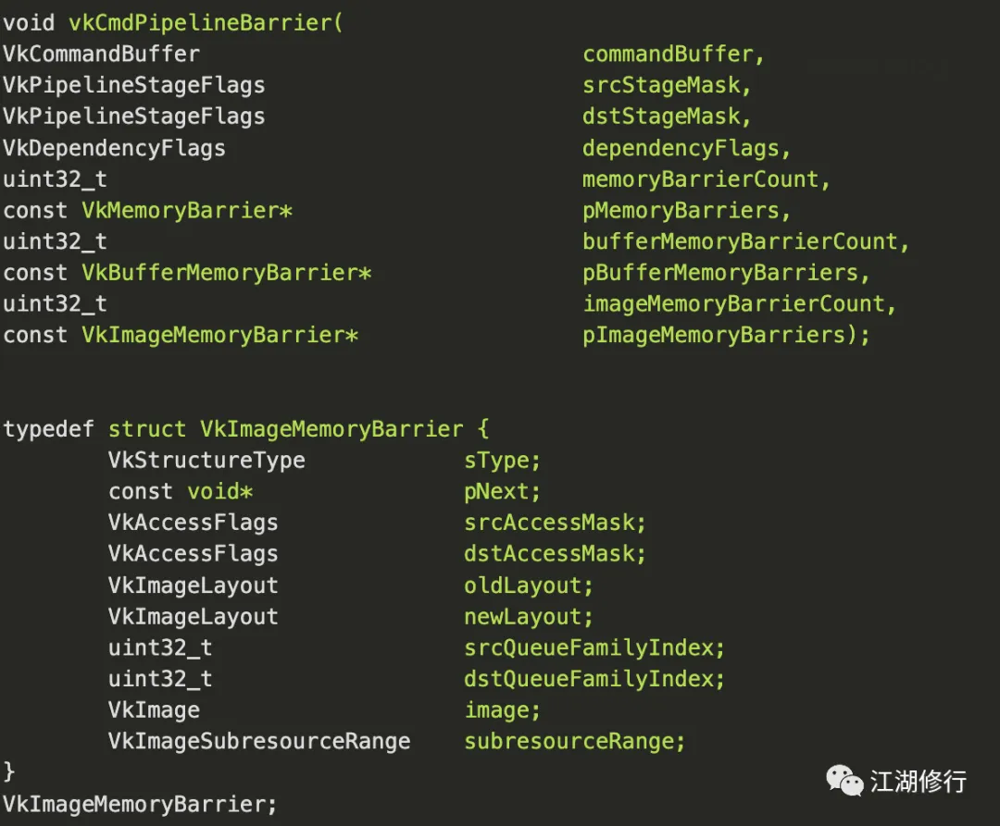

# 深入理解 Vulkan 同步机制

## 概述

**Vulkan的一大优势是能通过多线程来提升CPU bounding场景的performance**，这依赖于其提供了下面几种同步机制。


**Semaphores**，用于多个queue之间的同步或者是一个queue的任务提交同步。


**Events**，用于一个command buffer内部的同步或在同一个queue内部多个command buffer的同步。


**Fences**，用于提供devive和host之间的同步。


**barriers**，用于精确控制pipeline中各个pipeline阶段的资源流动。


下图说明了这几种同步机制适用的场景。




## 管线屏障 Pipeline Barrier

Barrier是一种同步机制，**用来管理内存访问和同步Vulkan pipeline中各个阶段里的资源状态变化。**

通过这种机制来fine-grained控制command buffer执行过程中资源在pipeline的各个阶段中的流动。

Vulkan通过API vkCmdPipelineBarrier()来控制三种barrier操作，**Memory barrier, Buffer Memory barrier和Image Memory barrier。**

其中Memory barrier, Buffer Memory barrier会控制资源在pipeline各个阶段的执行次序。其作用有两个，一个作用是控制执行顺序，对写后读(WaR)，读后写(RaW)，写后写(WaW)三种情况提供保护。

另外一个作用是保证pipeline不同部分中数据的视图的一致性，因为pipeline不同stage之间可能有cache，在插入了barrier的地方需要flush cache。

Image Memory barrier的作用是控制对图像的访问。

三种barrier的数据结构如下所示:


Vulkan的pipeline包括下面这几种,Command的执行从top开始，然后执行类似VS，FS之类的pipeline，最后是bottom。

```
TOP_OF_PIPE_BIT
DRAW_INDIRECT_BIT
VERTEX_INPUT_BIT
VERTEX_SHADER_BIT
TESSELLATION_CONTROL_SHADER_BIT
TESSELLATION_EVALUATION_SHADER_BIT
GEOMETRY_SHADER_BIT
FRAGMENT_SHADER_BIT
EARLY_FRAGMENT_TESTS_BIT
LATE_FRAGMENT_TESTS_BIT
COLOR_ATTACHMENT_OUTPUT_BIT
TRANSFER_BIT
COMPUTE_SHADER_BIT
BOTTOM_OF_PIPE_BIT
```

但是如何设置vkCmdPipelineBarrier中source stage和dest stage呢？


最简单的方式是把source stage设置为VK_PIPELINE_STAGE_BOTTOM_OF_PIPE_BIT，dest stage设置为VK_PIPELINE_STAGE_TOP_OF_PIPE_BIT。


这种设置会等待前面command buffer的所有pipeline都执行结束了，后面command buffer才能开始，很明显这种设置多个command buffer没有并行执行，command buffer之间只是串行的，performance应该会受到影响。


如果希望能在多个command buffer之间并行执行，需要根据实际情况设置source stage和dest stage。

假如vertex shader后面接了一个compute shader, compute shader执行的时候需要读取vertex shader的执行结果。

我们可以把source stage设置为VK_PIPELINE_STAGE_VERTEX_SHADER_BIT，dest stage设置为VK_PIPELINE_STAGE_COMPUTE_SHADER_BIT。

更详细的介绍，请参考后面的代码说明。

原则上source stage和dest stage的设置应该尽量使下图中的ubblocked pipeline(green stages)尽可能地多，这样并行度会越高。


Memory barrier示例代码


根据需要，创建两个queue(graphics queue和compute queue)和对应的command buffer.

```
// 创建graphics queue和command pool
vkGetDeviceQueue(device, vulkanDevice->queueFamilyIndices.graphics, 0, &queue);
VkCommandPoolCreateInfo cmdPoolInfo = {};
cmdPoolInfo.sType = VK_STRUCTURE_TYPE_COMMAND_POOL_CREATE_INFO;
cmdPoolInfo.queueFamilyIndex = vulkanDevice->queueFamilyIndices.graphics;
cmdPoolInfo.flags = VK_COMMAND_POOL_CREATE_RESET_COMMAND_BUFFER_BIT;
VK_CHECK_RESULT(vkCreateCommandPool(device, &cmdPoolInfo, nullptr, &cmdPool));
// 创建compute queue和command pool
vkGetDeviceQueue(device, vulkanDevice->queueFamilyIndices.compute, 0, &compute.queue);
VkCommandPoolCreateInfo cmdPoolInfo = {};
cmdPoolInfo.sType = VK_STRUCTURE_TYPE_COMMAND_POOL_CREATE_INFO;
cmdPoolInfo.queueFamilyIndex = vulkanDevice->queueFamilyIndices.compute;
cmdPoolInfo.flags = VK_COMMAND_POOL_CREATE_RESET_COMMAND_BUFFER_BIT;
VK_CHECK_RESULT(vkCreateCommandPool(device, &cmdPoolInfo, nullptr, &compute.commandPool));
```

下面的代码说明了如何在这两个command buffer执行的过程中插入barrier, 从而实现资源访问的控制。

```
void buildComputeCommandBuffer()
{
 VkCommandBufferBeginInfo cmdBufInfo = vks::initializers::commandBufferBeginInfo();
 VK_CHECK_RESULT(vkBeginCommandBuffer(compute.commandBuffer, &cmdBufInfo));
// Compute particle movement
// Add memory barrier to ensure that the (graphics) vertex shader has fetched attributes before compute starts to write to the buffer
 VkBufferMemoryBarrier bufferBarrier = vks::initializers::bufferMemoryBarrier();
 bufferBarrier.buffer = compute.storageBuffer.buffer;
 bufferBarrier.size = compute.storageBuffer.descriptor.range;
 bufferBarrier.srcAccessMask = VK_ACCESS_VERTEX_ATTRIBUTE_READ_BIT; // Vertex shader invocations have finished reading from the buffer
 bufferBarrier.dstAccessMask = VK_ACCESS_SHADER_WRITE_BIT; // Compute shader wants to write to the buffer
// Compute and graphics queue may have different queue families (see VulkanDevice::createLogicalDevice)
// For the barrier to work across different queues, we need to set their family indices
 bufferBarrier.srcQueueFamilyIndex = vulkanDevice->queueFamilyIndices.graphics; // Required as compute and graphics queue may have different families
 bufferBarrier.dstQueueFamilyIndex = vulkanDevice->queueFamilyIndices.compute; // Required as compute and graphics queue may have different families
 vkCmdPipelineBarrier(
  compute.commandBuffer,
  VK_PIPELINE_STAGE_VERTEX_SHADER_BIT,
  VK_PIPELINE_STAGE_COMPUTE_SHADER_BIT,
  VK_FLAGS_NONE,
0, nullptr,
1, &bufferBarrier,
0, nullptr);
 vkCmdBindPipeline(compute.commandBuffer, VK_PIPELINE_BIND_POINT_COMPUTE, compute.pipeline);
 vkCmdBindDescriptorSets(compute.commandBuffer, VK_PIPELINE_BIND_POINT_COMPUTE, compute.pipelineLayout, 0, 1, &compute.descriptorSet, 0, 0);
// Dispatch the compute job
 vkCmdDispatch(compute.commandBuffer, PARTICLE_COUNT / 256, 1, 1);
// Add memory barrier to ensure that compute shader has finished writing to the buffer
// Without this the (rendering) vertex shader may display incomplete results (partial data from last frame) 
 bufferBarrier.srcAccessMask = VK_ACCESS_SHADER_WRITE_BIT;  // Compute shader has finished writes to the buffer
 bufferBarrier.dstAccessMask = VK_ACCESS_VERTEX_ATTRIBUTE_READ_BIT; // Vertex shader invocations want to read from the buffer
 bufferBarrier.buffer = compute.storageBuffer.buffer;
 bufferBarrier.size = compute.storageBuffer.descriptor.range;
// Compute and graphics queue may have different queue families (see VulkanDevice::createLogicalDevice)
// For the barrier to work across different queues, we need to set their family indices
 bufferBarrier.srcQueueFamilyIndex = vulkanDevice->queueFamilyIndices.compute; // Required as compute and graphics queue may have different families
 bufferBarrier.dstQueueFamilyIndex = vulkanDevice->queueFamilyIndices.graphics; // Required as compute and graphics queue may have different families
 vkCmdPipelineBarrier(
  compute.commandBuffer,
  VK_PIPELINE_STAGE_COMPUTE_SHADER_BIT,
  VK_PIPELINE_STAGE_VERTEX_SHADER_BIT,
  VK_FLAGS_NONE,
0, nullptr,
1, &bufferBarrier,
0, nullptr);
 vkEndCommandBuffer(compute.commandBuffer);
}
```

Image barrier示例代码如下

```
for (int32_t i = 0; i < drawCmdBuffers.size(); ++i)
{
// Set target frame buffer
 renderPassBeginInfo.framebuffer = frameBuffers[i];
 VK_CHECK_RESULT(vkBeginCommandBuffer(drawCmdBuffers[i], &cmdBufInfo));
// Image memory barrier to make sure that compute shader writes are finished before sampling from the texture
 VkImageMemoryBarrier imageMemoryBarrier = {};
 imageMemoryBarrier.sType = VK_STRUCTURE_TYPE_IMAGE_MEMORY_BARRIER;
// We won't be changing the layout of the image
 imageMemoryBarrier.oldLayout = VK_IMAGE_LAYOUT_GENERAL;
 imageMemoryBarrier.newLayout = VK_IMAGE_LAYOUT_GENERAL;
 imageMemoryBarrier.image = textureComputeTarget.image;
 imageMemoryBarrier.subresourceRange = { VK_IMAGE_ASPECT_COLOR_BIT, 0, 1, 0, 1 };
 imageMemoryBarrier.srcAccessMask = VK_ACCESS_SHADER_WRITE_BIT;
 imageMemoryBarrier.dstAccessMask = VK_ACCESS_SHADER_READ_BIT;
 vkCmdPipelineBarrier(
  drawCmdBuffers[i],
  VK_PIPELINE_STAGE_COMPUTE_SHADER_BIT,
  VK_PIPELINE_STAGE_FRAGMENT_SHADER_BIT,
  VK_FLAGS_NONE,
0, nullptr,
0, nullptr,
1, &imageMemoryBarrier);
 vkCmdBeginRenderPass(drawCmdBuffers[i], &renderPassBeginInfo, VK_SUBPASS_CONTENTS_INLINE);
 VkViewport viewport = vks::initializers::viewport((float)width * 0.5f, (float)height, 0.0f, 1.0f);
 vkCmdSetViewport(drawCmdBuffers[i], 0, 1, &viewport);
 VkRect2D scissor = vks::initializers::rect2D(width, height, 0, 0);
 vkCmdSetScissor(drawCmdBuffers[i], 0, 1, &scissor);
 VkDeviceSize offsets[1] = { 0 };
 vkCmdBindVertexBuffers(drawCmdBuffers[i], VERTEX_BUFFER_BIND_ID, 1, &vertexBuffer.buffer, offsets);
 vkCmdBindIndexBuffer(drawCmdBuffers[i], indexBuffer.buffer, 0, VK_INDEX_TYPE_UINT32);
// Left (pre compute)
 vkCmdBindDescriptorSets(drawCmdBuffers[i], VK_PIPELINE_BIND_POINT_GRAPHICS, graphics.pipelineLayout, 0, 1, &graphics.descriptorSetPreCompute, 0, NULL);
 vkCmdBindPipeline(drawCmdBuffers[i], VK_PIPELINE_BIND_POINT_GRAPHICS, graphics.pipeline);
 vkCmdDrawIndexed(drawCmdBuffers[i], indexCount, 1, 0, 0, 0);
// Right (post compute)
 vkCmdBindDescriptorSets(drawCmdBuffers[i], VK_PIPELINE_BIND_POINT_GRAPHICS, graphics.pipelineLayout, 0, 1, &graphics.descriptorSetPostCompute, 0, NULL);
 vkCmdBindPipeline(drawCmdBuffers[i], VK_PIPELINE_BIND_POINT_GRAPHICS, graphics.pipeline);
 viewport.x = (float)width / 2.0f;
 vkCmdSetViewport(drawCmdBuffers[i], 0, 1, &viewport);
 vkCmdDrawIndexed(drawCmdBuffers[i], indexCount, 1, 0, 0, 0);
 vkCmdEndRenderPass(drawCmdBuffers[i]);
 VK_CHECK_RESULT(vkEndCommandBuffer(drawCmdBuffers[i]));
}
```

## Semaphore/Event/Fence

下面说明并行渲染多帧时采用的同步机制。


如上图所示，当swap chain中的image可用时，vkAcquireNextImageKHR会触发一个semaphore a，vkQueueSubmit拿到这个semaphore b以后开始执行command buffer的命令，执行command buffer的过程中会往vkAcquireNextImageKHR得到的image(这个image类似于frame buffer的概念)中写内容。

执行完毕以后会触发semaphore b, vkQueuePresentKHR等待这个semaphore b触发以后就把image的内容绘制到display上。

当第N frame在Submit任务到GPU上执行的时候， (N+1)frame同时在CPU上开启多线程往多个command buffer中生成command，这样CPU和GPU相互配合，提升performance。

下面说明渲染一帧时内部采用的同步机制。


上图中第一个vkQueueSubmit的参数如下

```
submitInfo.waitSemaphoreCount = 1;
   // 执行vkQueueSubmit的wait semaphore，等待其触发，其已经在vkAcquireNextImageKHR中触发
submitInfo.pWaitSemaphores = &semaphores.presentComplete;
submitInfo.signalSemaphoreCount = 1;
   // vkQueueSubmit执行完以后的signal semaphore
submitInfo.pSignalSemaphores = &semaphores.renderComplete;
submitInfo.commandBufferCount = 1;
submitInfo.pCommandBuffers = &primaryCommandBuffer;
VK_CHECK_RESULT(vkQueueSubmit(queue, 1, &submitInfo, renderFence));
```

然后执行vKQueuePresentKHR，这边的wait semaphore是前面一步的renderComplete, 表明只有renderComplete被触发以后vKQueuePresentKHR才能被执行。

```
VK_CHECK_RESULT(swapChain.queuePresent(queue, currentBuffer, submitTextOverlay ? semaphores.textOverlayComplete : semaphores.renderComplete));
```

上面虚线部分表明在执行vKQueuePresentKHR之间，还有一个text overlay command buffer需要执行。


这个command buffer的wait semaphore为renderComplete。

```
// Set semaphores
// Wait for render complete semaphore
submitInfo.waitSemaphoreCount = 1;
submitInfo.pWaitSemaphores = &semaphores.renderComplete;
// Signal ready with text overlay complete semaphpre
submitInfo.signalSemaphoreCount = 1;
submitInfo.pSignalSemaphores = &semaphores.textOverlayComplete;
// Submit current text overlay command buffer
submitInfo.commandBufferCount = 1;
submitInfo.pCommandBuffers = &textOverlay->cmdBuffers[currentBuffer];
VK_CHECK_RESULT(vkQueueSubmit(queue, 1, &submitInfo, VK_NULL_HANDLE));
```

## 参考文献

Vulkan barriers explained:https://gpuopen.com/vulkan-barriers-explained
Multi-Threading in Vulkan:https://community.arm.com/developer/tools-software/graphics/b/blog/posts/multi-threading-in-vulkan