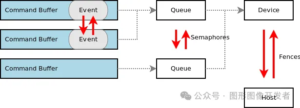

# 理解 Vulkan 同步机制

**Vulkan 的同步机制用于控制 GPU 和 CPU 之间的任务执行顺序，确保资源的正确访问顺序和任务的按序执行**。


由于 Vulkan 是高度并发的 API，需要明确管理同步，防止读写冲突、数据损坏等问题。


Vulkan 提供了多种同步机制，用来解决不同场景下的同步需求，主要包括以下几类：


- **Semaphores 信号量**：用于多个 queue 之间的同步或者是一个 queue 的任务提交同步（在 GPU 和 GPU 之间同步）。 

  

- **Events 事件**：用于一个 command buffer 内部的同步或在同一个 queue 内部多个 command buffer 的同步（更细粒度的同步）。 

  

- **Fences 栅栏**：用于在 CPU 和 GPU 之间同步，栅栏通常用于让 CPU 等待 GPU 完成某个操作。

  

- **Barriers 管线屏障**：用于控制资源在不同阶段的访问顺序。用于图像布局转换、内存访问屏障等操作，保证不同管线阶段对同一资源的访问顺序。

 下图说明了这几种同步机制适用的场景。




# 信号量/Semaphores

信号量 Semaphores 主要用于多个队列之间的同步，比如传递图像渲染和图像展示的信号。


一个队列的操作完成时，通过信号量通知另一个队列继续执行。


信号量是 GPU 内部的同步机制，不会使 CPU 阻塞。信号量一般用来协调渲染流程中不同阶段的执行顺序。


**信号量是 GPU 内部的同步机制，不会使 CPU 阻塞**。

Vulkan 创建和销毁信号量：

```
// 1. 定义 VkSemaphoreCreateInfo 结构体
VkSemaphoreCreateInfo semaphoreInfo{};
semaphoreInfo.sType = VK_STRUCTURE_TYPE_SEMAPHORE_CREATE_INFO; // 指定结构体类型
semaphoreInfo.pNext = nullptr;  // 可选的扩展字段
semaphoreInfo.flags = 0;        // 保留字段，必须为0

// 2. 创建 Semaphore
VkSemaphore semaphore;
VkResult result = vkCreateSemaphore(device, &semaphoreInfo, nullptr, &semaphore); // 创建信号量
if (result != VK_SUCCESS) {
    throw std::runtime_error("Failed to create semaphore!"); // 错误处理
}

// 3. 使用信号量时：
// 通常与队列提交、等待等同步操作一起使用

// 4. 销毁 Semaphore
vkDestroySemaphore(device, semaphore, nullptr); // 销毁信号量
```

# 事件/Events

**Events 用于更细粒度的同步控制**，比如在 GPU 中执行复杂操作时，允许在某些阶段通过事件进行同步，或者等待某个事件完成再进行下一步操作。

与信号量相比，Events 可以提供更多的控制和灵活性，允许更复杂的同步模式**。**

# 栅栏/Fences

**Fences 用于 CPU 端等待 GPU 任务完成**，例如在提交命令缓冲区后，等待 GPU 执行结束，方便在此基础上进行下一步处理。


栅栏是单向的（CPU 等待 GPU），可以查询或阻塞直到操作完成。

Vulkan VkFence 使用**：**

```
VkFenceCreateInfo fenceInfo{};
fenceInfo.sType = VK_STRUCTURE_TYPE_FENCE_CREATE_INFO;
fenceInfo.flags = 0; // 设置为 0 表示初始状态为未触发

//创建 VkFence
VkFence fence;
VkResult result = vkCreateFence(device, &fenceInfo, nullptr, &fence);
if (result != VK_SUCCESS) {
    throw std::runtime_error("Failed to create fence!");
}

//Fence 是一次性触发的，如果需要在下次使用之前重置 Fence，可以通过 vkResetFences。
vkResetFences(device, 1, &fence);

//销毁 VkFence
vkDestroyFence(device, fence, nullptr);
```

# Pipeline Barriers /管线屏障

Pipeline Barriers 是一种非常灵活且强大的同步机制，用于在不同阶段或队列之间插入内存和执行依赖项。


这种机制包括三种不同类型的 Barrier 操作：**Memory Barrier，Buffer Memory Barrier 和 Image Memory Barrier**，它们分别作用于全局内存、缓冲区和图像资源。


**Memory Barrier** 是一种通用的内存屏障，它可以在整个 Vulkan 内存中应用于任意类型的数据。


它用于同步全局内存访问，确保内存的某些操作在指定的阶段完成之后，其他阶段才能访问相同的数据。


**Buffer Memory Barrier** **专门用于同步缓冲区（Buffer）的内存访问**。


这种 Barrier 作用于 Vulkan 的缓冲区资源，它能够确保缓冲区的某些内存操作（如写入或读取）完成后，其他管线阶段才能访问相同的缓冲区。


**Image Memory Barrier 是专门用于图像资源（Image）的内存同步**，它确保在某些阶段完成对图像资源的写操作后，其他阶段才能读取或修改相同的图像数据。


它还可以控制图像布局转换，确保图像在使用前被正确地转变为合适的布局。

Vulkan 中，我们通过 vkCmdPipelineBarrier API 来设置管线屏障：

```
void vkCmdPipelineBarrier(
    VkCommandBuffer commandBuffer,                 // 命令缓冲区，指明在哪个命令缓冲区记录该操作
    VkPipelineStageFlags srcStageMask,             // 源管线阶段，指明依赖关系的起点
    VkPipelineStageFlags dstStageMask,             // 目标管线阶段，指明依赖关系的终点
    VkDependencyFlags dependencyFlags,             // 依赖类型，通常为 0
    uint32_t memoryBarrierCount,                   // Memory barrier 数量
    const VkMemoryBarrier* pMemoryBarriers,        // Memory barrier 数组
    uint32_t bufferMemoryBarrierCount,             // Buffer memory barrier 数量
    const VkBufferMemoryBarrier* pBufferMemoryBarriers, // Buffer memory barrier 数组
    uint32_t imageMemoryBarrierCount,              // Image memory barrier 数量
    const VkImageMemoryBarrier* pImageMemoryBarriers // Image memory barrier 数组
);
```


篇幅原因，VkMemoryBarrier 和 VkBufferMemoryBarrier 暂时不展开讲，留到后面章节里。


下面给出代码示例，介绍下 VkImageMemoryBarrier 的使用，将图像从呈现布局转换为着色器读取布局通常用于将图像资源从被展示转为被着色器读取。

例如，当你渲染到屏幕后希望将该图像作为纹理供着色器使用时，需要进行这种布局转换。

```
VkImageMemoryBarrier barrier{};
barrier.sType = VK_STRUCTURE_TYPE_IMAGE_MEMORY_BARRIER;
barrier.oldLayout = VK_IMAGE_LAYOUT_PRESENT_SRC_KHR; // 当前图像布局：用于显示呈现
barrier.newLayout = VK_IMAGE_LAYOUT_SHADER_READ_ONLY_OPTIMAL; // 新布局：供着色器读取
barrier.srcQueueFamilyIndex = VK_QUEUE_FAMILY_IGNORED; // 队列族，忽略队列族转移
barrier.dstQueueFamilyIndex = VK_QUEUE_FAMILY_IGNORED; // 队列族，忽略队列族转移
barrier.image = image; // 需要进行布局转换的图像
barrier.subresourceRange.aspectMask = VK_IMAGE_ASPECT_COLOR_BIT; // 只操作颜色部分
barrier.subresourceRange.baseMipLevel = 0;
barrier.subresourceRange.levelCount = 1;
barrier.subresourceRange.baseArrayLayer = 0;
barrier.subresourceRange.layerCount = 1;

// 设置源和目标阶段的内存访问掩码
barrier.srcAccessMask = VK_ACCESS_MEMORY_READ_BIT; // 之前可能读取过图像
barrier.dstAccessMask = VK_ACCESS_SHADER_READ_BIT; // 之后着色器需要读取

// 插入管线屏障进行布局转换
vkCmdPipelineBarrier(
    commandBuffer,
    VK_PIPELINE_STAGE_COLOR_ATTACHMENT_OUTPUT_BIT, // 源阶段：颜色附件输出阶段
    VK_PIPELINE_STAGE_FRAGMENT_SHADER_BIT,         // 目标阶段：着色器读取阶段
    0,                                             // 依赖标志
    0, nullptr,                                    // Memory barrier
    0, nullptr,                                    // Buffer memory barrier
    1, &barrier                                    // 图像布局转换 barrier
);
```

# 使用 Semaphore 和 Fence

[我们在上一节 Vulkan 指令缓存中，介绍了渲染指令的录制，最后渲染指令会被记录到一个 CommandBuffer ，接下来使用 vkQueueSubmit 提交到队列中](http://mp.weixin.qq.com/s?__biz=Mzg2NDc1OTIzOQ==&mid=2247484151&idx=1&sn=103fd546f056d02f6563f7ea78f8aa7c&chksm=ce653e5ff912b74950b86ab14ef7ee131e4e86d6735968e99e6d623e71ef8817b10521a1afc2&scene=21#wechat_redirect)，然后等待 GPU 执行完成，这个渲染的同步就是通过Semaphore 和 Fence实现的。

在 Vulkan 渲染中，同时使用 Semaphore 和 Fence代码示例（只需要关注流程即可，完整代码后面会给出）：

```
VkSubmitInfo submitInfo{};
submitInfo.sType = VK_STRUCTURE_TYPE_SUBMIT_INFO;

// 等待的信号量，用于等待图像从交换链获取
VkSemaphore waitSemaphores[] = {imageAvailableSemaphore};
VkPipelineStageFlags waitStages[] = {VK_PIPELINE_STAGE_COLOR_ATTACHMENT_OUTPUT_BIT};
submitInfo.waitSemaphoreCount = 1;
submitInfo.pWaitSemaphores = waitSemaphores;
submitInfo.pWaitDstStageMask = waitStages;

// 提交指令缓冲区
submitInfo.commandBufferCount = 1;
submitInfo.pCommandBuffers = &commandBuffer;

// 渲染完成后的信号量
VkSemaphore signalSemaphores[] = {renderFinishedSemaphore};
submitInfo.signalSemaphoreCount = 1;
submitInfo.pSignalSemaphores = signalSemaphores;

// 提交到队列并附带Fence，Fence只在特定情况下使用
VkResult result = vkQueueSubmit(graphicsQueue, 1, &submitInfo, renderFence);
if (result != VK_SUCCESS) {
    throw std::runtime_error("Failed to submit draw command buffer!");
}

// 可以选择使用 Fence 来定期检查 GPU 渲染任务的完成状态
result = vkWaitForFences(device, 1, &renderFence, VK_TRUE, UINT64_MAX); 
if (result != VK_SUCCESS) {
    throw std::runtime_error("Failed to wait for fence!");
}

// 重置 Fence 供下一帧使用
vkResetFences(device, 1, &renderFence);
```


在这个示例中，信号量用于在 GPU 之间同步，而栅栏用于让 CPU 等待 GPU 渲染完成。这是 Vulkan 中典型的同步场景，确保渲染和展示队列按顺序执行，且 GPU 和 CPU 间协同工作。


# 参考

https://wenxiaoming.github.io/2019/03/09/Synchronization-in-Vulkan/

《Vulkan 学习指南》 — [新加坡] 帕敏德·辛格（Parminder Singh）

《Vulkan 应用开发指南》— [美] 格拉汉姆·塞勒斯（Graham Sellers）等 译者：李晓波 等