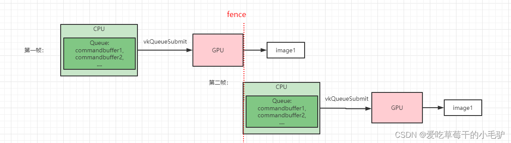
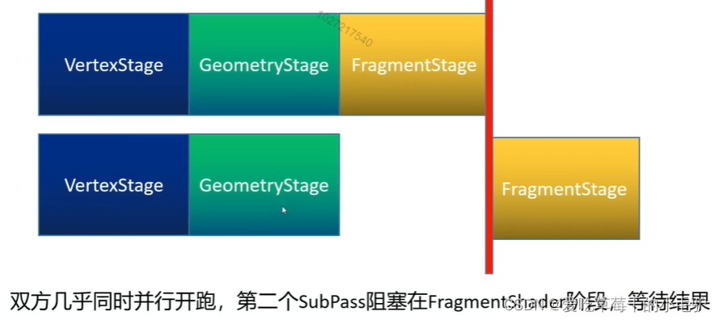

# vulkan的同步问题

## 一.信号量和栅栏的使用

显示一帧图像时，需要进行如下三步操作：* 1.从交换链获取一张图像
                                  \* 2.对帧缓冲附着执行指令缓冲中的渲染指令
                                  \* 3.返回渲染后的图像到交换链进行呈现操作

上面这些操作每一个都是通过一个函数调用设置的, 但每个操作的实际 执行却是异步进行的。函数调用会在操作实际结束前返回，并且操作的实 际执行顺序也是不确定的。而我们的函数需要按照一定的顺序，所以就需要进行同步操作。有两种用于交换链的同步方式：信号量和栅栏。

不同之处：栅栏可以使用 vkWaitForFences 查询fences的状态，但是信号量的状态不可查询。通常，我们使用栅栏 (fence) 来对应用程序本身和渲染操作进行同步。使用信号量 (semaphore) 来对一个指令队列内的操作或多个不同指令队列的操作进行同步。

1.fence

 从上图可以看出fence主要用于CPU和GPU之间的同步，GPU在执行完Queue里的所有指令以后通知CPU继续运行，因此fence是一种GPU向CPU发送的同步命令，可以令CPU阻塞，这里主要阻塞了CPU向GPU的提交命令操作。

2.semaphore

semaphore也是同步命令，主要用于不同命令提交之间的同步，即GPU与GPU之间的同步，它与fence一样都是一种粗粒度的同步命令（粗粒度是指我们在代码中只显式的规定了代码的同步时机，但是并没有规定内存的同步）。这两个同步命令都有隐式的内存同步：

- 当一个semaphore变成signaled时，semaphore之前所有的GPU内存读写操作都已完成，semaphore被激活以后，所有GPU内存变为available状态。
- 当一个等待semaphore的指令被激活以后，所有暂停的命令会重新被唤醒，此后memory变为visible状态。

举例：

1. vkAcquireNextImageKHR 的第四个参数就需要传一个信号量或者栅栏对象，表示拿到该图像以后信号量就会被激活。（信号量什么时候激活呢？在含有该信号量的指令被调用以后）

```autohotkey
vkAcquireNextImageKHR( device, 
                       swapChain, 
                       UINT64_MAX, 
                       imageAvailableSemaphores[currentFrame], 
                       VK_NULL_HANDLE, 
                       &imageIndex);
```

信号量的等待时机和等待数量在submitInfo中注册，意味着程序执行到COLOR_ATTACHMENT_OUTPUT_BIT阶段时会阻塞，直到信号量被激活，也就是要求从swapchain中拿到image以后才能继续往下执行。

```mipsasm
VkSemaphore waitSemaphores[] = { imageAvailableSemaphores[currentFrame] };
        VkPipelineStageFlags waitStages[] = { VK_PIPELINE_STAGE_COLOR_ATTACHMENT_OUTPUT_BIT               };
        submitInfo.waitSemaphoreCount = 1;
        submitInfo.pWaitSemaphores = waitSemaphores;
        submitInfo.pWaitDstStageMask = waitStages;

        submitInfo.commandBufferCount = 1;
        submitInfo.pCommandBuffers = &commandBuffers[currentFrame];

        VkSemaphore signalSemaphores[] = { renderFinishedSemaphores[currentFrame] };
        submitInfo.signalSemaphoreCount = 1;
        submitInfo.pSignalSemaphores = signalSemaphores;
```

2. vkQueueSubmit的最后一个参数是一个可选的栅栏对象，它表示队列中的指令执行结束以后要进行的操作。

```stylus
vkQueueSubmit(graphicsQueue, 1, &submitInfo, inFlightFences[currentFrame])
```

 **在规定了信号量与等待阶段和等待操作之后，并不能完全实现内存的同步，因为还需要实现layout的转换。**

## 二：Renderpass Layout转换

1.当image作为attachment时， 我们会在renderpass创建的时候指定该attachment的initiallayout和final layout：

- **initialLayout**：指image作为attachment之前的layout，即输入之前的layout。其中**VK_IMAGE_LAYOUT_UNDEFINED**意味着不关系image中的原始数据，后续也不会使用image各种的数据，以便驱动进行优化**。**
- **finalLayout：**指当前renderpass完成以后需要将image转换为 final layout输出
- Subpass 在使用 attachment 时，指定的 layout 可以不同于 initialLayout 或 finalLayout。`VkSubpassDescription` 中需要指定 render pass 中 attachment 的引用。
- [VkSubpassDependency](https://link.csdn.net/?target=https%3A%2F%2Flink.zhihu.com%2F%3Ftarget%3Dhttps%3A%2F%2Fwww.khronos.org%2Fregistry%2Fvulkan%2Fspecs%2F1.2-khr-extensions%2Fhtml%2Fvkspec.html%23VkSubpassDependency%26login%3Dfrom_csdn)控制了两个subpass之间layout转换的时机。
- 当没有指定dependency时，可能存在**implicit subpass dependency**，隐式转换存在三种情况：

- External 至 subpass
- Subpass 至 external
- Subpass 之间

分别对应：

- initialLayout 和首个使用该 attachment 的 subpass 所需 layout 不一致；
- finalLayout 和最后使用该 attachment 的 subpass 所需 layout 不一致；
- 两个 subpass 读取同一个 attachement 而且所需 layout 不同，且驱动实现上区分对待两种 layouts。

## 三. VkImageMemoryBarrier 和Subpass Dependencies

1.对于非attachment资源，VkImageMemoryBarrier几乎等同于 [VkSubpassDependency](https://link.csdn.net/?target=https%3A%2F%2Flink.zhihu.com%2F%3Ftarget%3Dhttps%3A%2F%2Fwww.khronos.org%2Fregistry%2Fvulkan%2Fspecs%2F1.2-khr-extensions%2Fhtml%2Fvkspec.html%23VkSubpassDependency%26login%3Dfrom_csdn)，区别在于二者的影响范围不一样：

- 当vkCmdPipelineBarrier出现在renderpass以外，则会同步barrier前后的所有commands。
- 当vkCmdPipelineBarrier出现在renderpass以内，则会同步barrier之前和之后属于当前subpass的commands。

2.对于attachment资源，二者等价。

3. 当图像属于attachment资源时，在Subpass Dependencies中进行如下设置时 ：

```abnf
VkSubpassDependency dependency{};  //控制layout转换时机
        dependency.srcSubpass = VK_SUBPASS_EXTERNAL;
        dependency.dstSubpass = 0;
        dependency.srcStageMask = VK_PIPELINE_STAGE_COLOR_ATTACHMENT_OUTPUT_BIT; 
        dependency.srcAccessMask = 0;
        dependency.dstStageMask = VK_PIPELINE_STAGE_COLOR_ATTACHMENT_OUTPUT_BIT;
        dependency.dstAccessMask = VK_ACCESS_COLOR_ATTACHMENT_WRITE_BIT;
```

这里解释一下srcStagXXX和dstStageXXX的作用：

​    由于vulkan是并行的，所以各个subpass可以认为是从同一起跑线上开始执行的（如下图所示），但是两个subpass使用的是同一幅图像，因此存在读写冲突。



dstStageXXX比较好理解，就是指当前subpass阻塞在哪个阶段的哪个操作，但是不可能一直阻塞在这个阶段吧！srcStageXXX可以理解为一种signal，即上一个使用该图像的subpass执行到srcStage的srcAccess操作以后，就会通知当前subpass，可以执行imagelayout转换，然后继续写（或者读）操作了。

srcStageMask 意味着在COLOR_ATTACHMENT_OUTPUT阶段之前的所有操作完成之后才会开始layout转换，这里面包括阻塞在COLOR_ATTACHMENT_OUTPUT阶段的semaphore的wait操作，保证了layout转换在semaphore被激发之后。