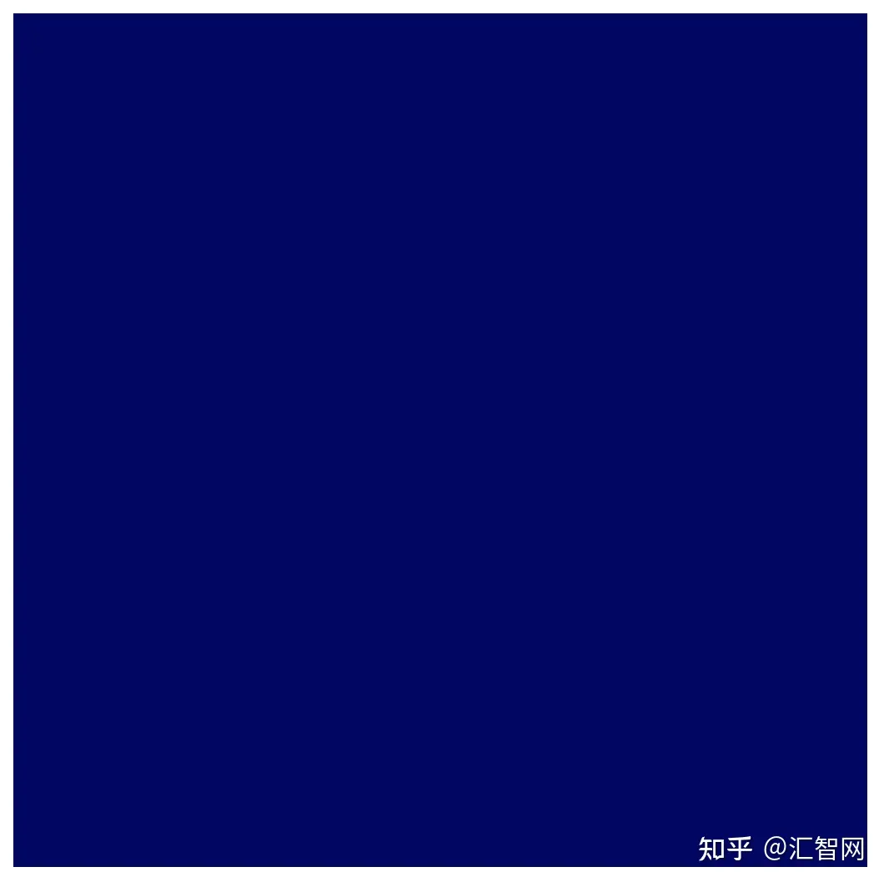
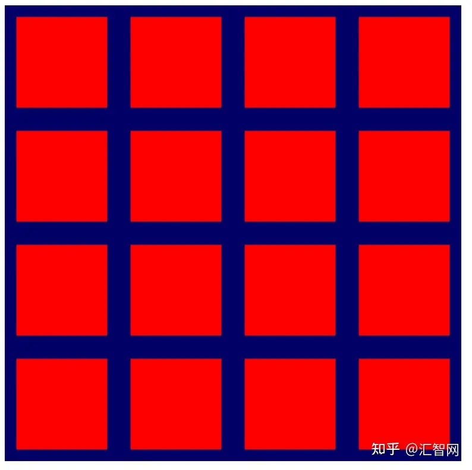

# WebGPU开发快速入门

WebGPU 是一种全新的现代 API，用于在 Web 应用程序中访问 GPU 的功能。

在 WebGPU 之前，有 WebGL，它提供了 WebGPU 功能的子集。 它启用了新一类丰富的网络内容，开发人员用它构建了令人惊叹的东西。 然而，它基于 2007 年发布的 OpenGL ES 2.0 API，而该 API 又基于更旧的 OpenGL API。 GPU 在那段时间发生了显着的发展，用于与其交互的本机 API 也随着 Direct3D 12、Metal 和 Vulkan 的发展而发展。


> 推荐：用[NSDT设计器](https://studio.nsdt.cloud/)快速搭建可编程3D场景。

WebGPU 将这些现代 API 的进步带到了 Web 平台。 它专注于以跨平台的方式启用 GPU 功能，同时提供一个在网络上感觉自然的 API，并且比它所构建的一些本机 API 更简洁。

GPU 通常与渲染快速、详细的图形联系在一起，WebGPU 也不例外。 它具有支持当今桌面和移动 GPU 上许多最流行的渲染技术所需的功能，并为未来随着硬件功能的不断发展添加新功能提供了途径。

除了渲染之外，WebGPU 还可以释放 GPU 执行通用、高度并行工作负载的潜力。 这些计算着色器可以独立使用，无需任何渲染组件，也可以作为渲染管道的紧密集成部分。

在今天的 Codelab 中，我们将学习如何利用 WebGPU 的渲染和计算功能来创建一个简单的入门项目！

## 1、初始化WebGPU

如果你只想使用 WebGPU 进行计算，则无需在屏幕上显示任何内容即可使用 WebGPU。 但是，如果你想要渲染任何内容，就像我们将在 Codelab 中所做的那样，你需要一个画布。 所以这是一个很好的起点！

### 1.1 从canvas开始

创建一个新的 HTML 文档，其中包含一个 `<canvas>` 元素，以及一个用于查询 canvas 元素的 `<script>` 标签：

```text
<!doctype html>

<html>
  <head>
    <meta charset="utf-8">
    <title>WebGPU Life</title>
  </head>
  <body>
    <canvas width="512" height="512"></canvas>
    <script type="module">
      const canvas = document.querySelector("canvas");

      // Your WebGPU code will begin here!
    </script>
  </body>
</html>
```

### 1.2 请求GPU设备

现在可以进入 WebGPU 了！ 首先，你应该考虑到像 WebGPU 这样的 API 可能需要一段时间才能在整个 Web 生态系统中传播。 因此，第一个预防措施是检查用户的浏览器是否可以使用 WebGPU。

要检查充当 WebGPU 入口点的 navigator.gpu 对象是否存在，请添加以下代码：

```text
if (!navigator.gpu) {
  throw new Error("WebGPU not supported on this browser.");
}
```

理想情况下，如果 WebGPU 不可用，你希望通过让页面回退到不使用 WebGPU 的模式来通知用户。 （也许它可以使用 WebGL 来代替？）不过，出于本 Codelab 的目的，我们只需抛出一个错误来阻止代码进一步执行。

一旦知道浏览器支持 WebGPU，为应用程序初始化 WebGPU 的第一步就是请求 GPUAdapter。 可以将适配器视为设备中特定 GPU 硬件的 WebGPU 表示。

要获取适配器，请使用 navigator.gpu.requestAdapter() 方法。 它返回一个承诺，因此用await 调用它是最方便的。

```text
const adapter = await navigator.gpu.requestAdapter();
if (!adapter) {
  throw new Error("No appropriate GPUAdapter found.");
}
```

如果找不到合适的适配器，则返回的适配器值可能为 null，因此你需要处理这种可能性。 如果用户的浏览器支持 WebGPU，但他们的 GPU 硬件不具备使用 WebGPU 所需的所有功能，则可能会发生这种情况。

大多数时候，只需让浏览器选择一个默认适配器就可以了，就像你在此处所做的那样，但是对于更高级的需求，可以将参数传递给 requestAdapter() 来指定是要使用低功耗还是高功耗 - 具有多个 GPU 的设备（如某些笔记本电脑）上的性能硬件。

拥有适配器后，开始使用 GPU 之前的最后一步是请求 GPUDevice。 设备是与 GPU 进行大多数交互的主要接口。

通过调用adapter.requestDevice()获取设备，它也会返回一个promise。

```text
const device = await adapter.requestDevice();
```

与 requestAdapter() 一样，可以在此处传递一些选项以实现更高级的用途，例如启用特定的硬件功能或请求更高的限制，但对于本文的目的，默认值工作得很好。

### 1.3 配置canvas

现在已经有了一个设备，如果想使用它来显示页面上的任何内容，还需要做一件事：将画布配置为与刚刚创建的设备一起使用。

为此，首先通过调用 canvas.getContext("webgpu") 从画布请求 GPUCanvasContext。 这与您用来初始化 Canvas 2D 或 WebGL 上下文的调用相同，分别使用 2d 和 webgl 上下文类型。然后，它返回的上下文必须使用 configure() 方法与设备关联，例如 ：

```text
const context = canvas.getContext("webgpu");
const canvasFormat = navigator.gpu.getPreferredCanvasFormat();
context.configure({
  device: device,
  format: canvasFormat,
});
```

这里可以传递一些选项，但最重要的是你要使用上下文的设备和格式，即上下文应使用的纹理格式。

纹理是 WebGPU 用于存储图像数据的对象，每个纹理都有一种格式，可以让 GPU 了解数据在内存中的布局方式。 纹理内存工作原理的详细信息超出了本 Codelab 的范围。 需要了解的重要一点是，canvas上下文为你的代码提供了要绘制的纹理，并且你使用的格式可能会影响画布显示这些图像的效率。 不同类型的设备在使用不同的纹理格式时性能最佳，如果你不使用设备的首选格式，则可能会导致在图像作为页面的一部分显示之前在幕后发生额外的内存复制。

幸运的是，你不必太担心这些，因为 WebGPU 会告诉你画布使用哪种格式！ 几乎在所有情况下，你都希望传递通过调用 navigator.gpu.getPreferredCanvasFormat() 返回的值，如上所示。

### 1.4 清除canvas

现在我们已经拥有了设备并且已经使用它配置了画布，可以开始使用该设备来更改画布的内容。 首先，用纯色清除它。

为了做到这一点（或者 WebGPU 中的几乎任何其他事情），需要向 GPU 提供一些命令，指示它做什么。

为此，让设备创建一个 GPUCommandEncoder，它提供用于记录 GPU 命令的接口。

```text
const encoder = device.createCommandEncoder();
```

我们想要发送到 GPU 的命令与渲染相关（在本例中为清除画布），因此下一步是使用编码器开始渲染通道。

渲染通道是指 WebGPU 中的所有绘图操作发生时。 每个都以 beginRenderPass() 调用开始，该调用定义接收所执行的任何绘图命令的输出的纹理。 更高级的用途可以提供多种纹理（称为附件），具有各种用途，例如存储渲染几何体的深度或提供抗锯齿。 然而，对于这个应用程序，我们只需要一个。

通过调用 context.getCurrentTexture() 从之前创建的画布上下文中获取纹理，该纹理返回一个像素宽度和高度与画布的宽度和高度属性以及调用 context.configure() 时指定的格式相匹配的纹理。

```text
const pass = encoder.beginRenderPass({
  colorAttachments: [{
     view: context.getCurrentTexture().createView(),
     loadOp: "clear",
     storeOp: "store",
  }]
});
```

纹理作为 colorAttachment 的 view 属性给出。 渲染通道要求你提供 GPUTextureView 而不是 GPUTexture，它告诉它要渲染到纹理的哪些部分。 这仅对于更高级的用例才真正重要，因此在这里我们调用 createView() 时不带纹理参数，表明希望渲染通道使用整个纹理。

还必须指定渲染通道在开始和结束时对纹理执行的操作：

- loadOp 值为“clear”表示我们希望在渲染通道开始时清除纹理。
- storeOp 值为“store”表示渲染通道完成后，我们希望将渲染通道期间完成的任何绘制的结果保存到纹理中。

一旦渲染轮开始，就什么都不做！ 最起码到现在。 使用 loadOp: "clear" 启动渲染通道的行为足以清除纹理视图和画布。

通过在 beginRenderPass() 之后立即添加以下调用来结束渲染轮：

```text
pass.end();
```

重要的是要知道，仅仅进行这些调用并不会导致 GPU 实际上执行任何操作。 它们只是记录命令供 GPU 稍后执行。

为了创建 GPUCommandBuffer，请在命令编码器上调用 finish()。 命令缓冲区是记录命令的不透明句柄。

```text
const commandBuffer = encoder.finish();
```

使用GPUDevice的队列将命令缓冲区提交给GPU。 队列执行所有 GPU 命令，确保它们的执行有序且正确同步。 队列的submit()方法接受一组命令缓冲区，尽管在本例中只有一个。

```text
device.queue.submit([commandBuffer]);
```

一旦提交命令缓冲区，就无法再次使用它，因此无需保留它。 如果要提交更多命令，则需要构建另一个命令缓冲区。 这就是为什么这两个步骤合二为一的情况相当常见，正如本 Codelab 的示例页面中所做的那样：

```text
// Finish the command buffer and immediately submit it.
device.queue.submit([encoder.finish()]);
```

将命令提交给 GPU 后，让 JavaScript 将控制权返回给浏览器。 此时，浏览器会发现我们已更改上下文的当前纹理，并更新画布以将该纹理显示为图像。 如果之后想再次更新画布内容，则需要记录并提交新的命令缓冲区，再次调用 context.getCurrentTexture() 来获取渲染通道的新纹理。

重新加载页面。 请注意，画布充满了黑色。 恭喜！ 这意味着我们已经成功创建了第一个 WebGPU 应用程序。


### 1.5 选择一种颜色

但说实话，黑色方块很无聊。 因此，在进入下一部分之前请花点时间对其进行个性化设置。

在 device.beginRenderPass() 调用中，向 colorAttachment 添加一个带有clearValue 的新行，如下所示：

```text
const pass = encoder.beginRenderPass({
  colorAttachments: [{
    view: context.getCurrentTexture().createView(),
    loadOp: "clear",
    clearValue: { r: 0, g: 0, b: 0.4, a: 1 }, // New line
    storeOp: "store",
  }],
});
```

clearValue 指示渲染通道在通道开始时执行清除操作时应使用哪种颜色。 传递给它的字典包含四个值：r 代表红色，g 代表绿色，b 代表蓝色，a 代表 alpha（透明度）。 每个值的范围为 0 到 1，它们一起描述该颜色通道的值。 例如：

- { r: 1, g: 0, b: 0, a: 1 } 为亮红色。
- { r: 1, g: 0, b: 1, a: 1 } 为亮紫色。
- {r:0,g:0.3,b:0,a:1}为深绿色。
- {r：0.5，g：0.5，b：0.5，a：1}是中灰色。
- { r: 0, g: 0, b: 0, a: 0 } 是默认的透明黑色。

此 Codelab 中的示例代码和屏幕截图使用深蓝色，但你可以随意选择想要的任何颜色！

选择颜色后，重新加载页面。 应该在画布中看到我们选择的颜色。



## 2、绘制几何图形

在本节结束时，我们的应用程序将在画布上绘制一些简单的几何图形：彩色正方形。 现在请注意，对于如此简单的输出来说，看起来需要做很多工作，但这是因为 WebGPU 旨在非常有效地渲染大量几何图形。 这种效率的一个副作用是，做相对简单的事情可能会感觉异常困难，但如果转向像 WebGPU 这样的 API，这就是我们的期望 - 想做一些更复杂的事情。

### 2.1 了解 GPU 如何绘图

在进行更多代码更改之前，有必要对 GPU 如何创建我们在屏幕上看到的形状进行快速、简化、高级概述。 （如果你已经熟悉 GPU 渲染工作原理的基础知识，请随意跳到定义顶点部分。）

与 Canvas 2D 等具有大量形状和选项可供使用的 API 不同， GPU 实际上只处理几种不同类型的形状（或 WebGPU 所指的图元）：点、线和三角形 。 出于本 Codelab 的目的，我们将仅使用三角形。

GPU 几乎专门处理三角形，因为三角形具有许多良好的数学属性，使它们易于以可预测且高效的方式进行处理。 几乎所有用 GPU 绘制的东西都需要先被分割成三角形，然后 GPU 才能绘制它，并且这些三角形必须由它们的角点定义。

这些点或顶点以 X、Y 和（对于 3D 内容）Z 值的形式给出，这些值定义了由 WebGPU 或类似 API 定义的笛卡尔坐标系上的点。 坐标系的结构最容易考虑它与页面上画布的关系。 无论画布有多宽或多高，左边缘始终位于 X 轴上的 -1 处，右边缘始终位于 X 轴上的 +1 处。 同样，Y 轴上的底部边缘始终为 -1，Y 轴上的顶部边缘始终为 +1。 这意味着 (0, 0) 始终是画布的中心，(-1, -1) 始终是左下角，(1, 1) 始终是右上角。 这称为剪辑空间（Clip Space）。


顶点最初很少在此坐标系中定义，因此 GPU 依靠称为顶点着色器（Vertex Shader）的小程序来执行将顶点转换为剪辑空间所需的任何数学运算，以及绘制顶点所需的任何其他计算。 例如，着色器可以应用一些动画或计算从顶点到光源的方向。 这些着色器由WebGPU 开发人员（我们）编写，它们提供了对 GPU 工作方式的大量控制。

从那里，GPU 获取由这些变换后的顶点组成的所有三角形，并确定需要屏幕上的哪些像素来绘制它们。 然后它运行我们编写的另一个小程序，称为片段着色器（fragment shader），用于计算每个像素应该是什么颜色。 该计算可以像返回绿色一样简单，也可以像计算表面相对于从附近其他表面反射的阳光的角度一样复杂，通过雾过滤，并根据表面的金属程度进行修改。 它完全在我们的控制之下，这既可以赋予我们权力，又可以带来压倒性的影响。

然后，这些像素颜色的结果会累积到纹理中，然后可以在屏幕上显示。

### 2.2 定义顶点

如前所述，生命游戏模拟显示为单元格网格。 我们的应用程序需要一种可视化网格的方法，区分活动单元格和非活动单元格。 此 Codelab 使用的方法是在活动单元格中绘制彩色方块，并将非活动单元格留空。

这意味着我们需要为 GPU 提供四个不同的点，每个点对应正方形的四个角。 例如，在画布中心绘制的正方形，从边缘拉入一定距离，其角坐标如下：


为了将这些坐标提供给 GPU，我们需要将这些值放入 TypedArray 中。 如果你还不熟悉，TypedArray 是一组 JavaScript 对象，允许我们分配连续的内存块并将系列中的每个元素解释为特定的数据类型。 例如，在 Uint8Array 中，数组中的每个元素都是单个无符号字节。 TypedArray 非常适合使用对内存布局敏感的 API 来回发送数据，例如 WebAssembly、WebAudio 和（当然）WebGPU。

对于平方示例，因为值是小数，所以 Float32Array 是合适的。

通过在代码中放置以下数组声明来创建一个包含图中所有顶点位置的数组。 放置它的好地方是靠近顶部，就在 context.configure() 调用下方。

```text
const vertices = new Float32Array([
//   X,    Y,
  -0.8, -0.8,
   0.8, -0.8,
   0.8,  0.8,
  -0.8,  0.8,
]);
```

请注意，间距和注释对值没有影响； 这只是为了方便并使其更具可读性。 它可以帮助我们了解每一对值构成一个顶点的 X 和 Y 坐标。

但有一个问题！ GPU 按照三角形工作，还记得吗？ 因此，这意味着我们必须以三个为一组提供顶点。解决方案是重复两个顶点以创建两个三角形，它们共享穿过正方形中间的一条边。


要从图中形成正方形，我们必须列出 (-0.8, -0.8) 和 (0.8, 0.8) 顶点两次，一次用于蓝色三角形，一次用于红色三角形。 也可以选择将正方形与其他两个角分开；这没有什么区别。

更新之前的顶点数组，使其看起来像这样：

```text
const vertices = new Float32Array([
//   X,    Y,
  -0.8, -0.8, // Triangle 1 (Blue)
   0.8, -0.8,
   0.8,  0.8,

  -0.8, -0.8, // Triangle 2 (Red)
   0.8,  0.8,
  -0.8,  0.8,
]);
```

尽管为了清晰起见，该图显示了两个三角形之间的分离，但顶点位置完全相同，并且 GPU 渲染它们时没有间隙。 它将呈现为单个实心正方形。

### 2.3 创建顶点缓冲区

GPU 无法使用 JavaScript 数组中的数据绘制顶点。 GPU 通常拥有针对渲染进行高度优化的自己的内存，因我们您希望 GPU 在绘制时使用的任何数据都需要放置在该内存中。

对于许多值（包括顶点数据），GPU 端内存是通过 GPUBuffer 对象进行管理的。 缓冲区是 GPU 可以轻松访问并标记用于某些目的的内存块。 我们可以将其想象为有点像 GPU 可见的 TypedArray。

要创建缓冲区来保存顶点，请在顶点数组的定义之后添加对 device.createBuffer() 的以下调用。

```text
const vertexBuffer = device.createBuffer({
  label: "Cell vertices",
  size: vertices.byteLength,
  usage: GPUBufferUsage.VERTEX | GPUBufferUsage.COPY_DST,
});
```

首先要注意的是我们给缓冲区一个标签。 创建的每个 WebGPU 对象都可以被赋予一个可选标签，你肯定想这样做！ 标签是任何你想要的字符串，只要它能帮助你识别对象是什么。 如果遇到任何问题，WebGPU 生成的错误消息中会使用这些标签来帮助我们了解出了什么问题。

接下来，给出缓冲区的大小（以字节为单位）。 我们需要一个 48 字节的缓冲区，可以通过将 32 位浮点数（4 字节）的大小乘以顶点数组中的浮点数 (12) 来确定。 令人高兴的是，TypedArrays 已经为我们计算了它们的 byteLength，因此可以在创建缓冲区时使用它。

最后，我们需要指定缓冲区的使用情况。 这是一个或多个 GPUBufferUsage 标志，多个标志与 | 组合在一起。 （按位或）运算符。 在这种情况下，我们指定希望缓冲区用于顶点数据 (GPUBufferUsage.VERTEX)，并且还希望能够将数据复制到其中 (GPUBufferUsage.COPY_DST)。

返回给我们的缓冲区对象是不透明的 - 无法（轻松）检查它保存的数据。 此外，它的大多数属性都是不可变的——创建 GPUBuffer 后我们无法调整其大小，也无法更改使用标志。 可以更改的是其内存的内容。

当缓冲区最初创建时，它包含的内存将被初始化为零。 有多种方法可以更改其内容，但最简单的方法是使用要复制的 TypedArray 调用 device.queue.writeBuffer() 。

要将顶点数据复制到缓冲区的内存中，请添加以下代码：

```text
device.queue.writeBuffer(vertexBuffer, /*bufferOffset=*/0, vertices);
```

### 2.4 定义顶点布局

现在我们有了一个包含顶点数据的缓冲区，但就 GPU 而言，它只是一个字节块。 如果你想用它画任何东西，需要提供更多的信息。 我们需要能够告诉 WebGPU 有关顶点数据结构的更多信息。

使用 GPUVertexBufferLayout 字典定义顶点数据结构：

```text
const vertexBufferLayout = {
  arrayStride: 8,
  attributes: [{
    format: "float32x2",
    offset: 0,
    shaderLocation: 0, // Position, see vertex shader
  }],
};
```

乍一看这可能有点令人困惑，但它相对容易分解。

我们给出的第一件事是 arrayStride。 这是 GPU 在查找下一个顶点时需要在缓冲区中向前跳过的字节数。 正方形的每个顶点都由两个 32 位浮点数组成。 前面提到，一个 32 位浮点数是 4 个字节，所以两个浮点数是 8 个字节。

接下来是attributes 属性，它是一个数组。 属性是编码到每个顶点中的单独信息。 我们的顶点仅包含一个属性（顶点位置），但更高级的用例经常包含具有多个属性的顶点，例如顶点的颜色或几何表面指向的方向。 不过，这超出了本 Codelab 的范围。

在单个属性中，我们首先定义数据的格式。 它来自 GPUVertexFormat 类型的列表，这些类型描述了 GPU 可以理解的每种顶点数据类型。 我们的顶点各有两个 32 位浮点数，因此使用 float32x2 格式。 例如，如果顶点数据由四个 16 位无符号整数组成，则可以使用 uint16x4。 看出规律了吗？

接下来，偏移量描述了该特定属性从顶点开始的字节数。 如果缓冲区中有多个属性，实际上只需担心这一点，而在此 Codelab 中不会出现这种情况。

最后，我们得到了着色器位置。 这是 0 到 15 之间的任意数字，并且对于我们定义的每个属性都必须是唯一的。 它将这个属性链接到顶点着色器中的特定输入，我们将在下一节中了解该输入。

请注意，虽然现在定义了这些值，但实际上尚未将它们传递到任何地方的 WebGPU API。 这即将到来，但在定义顶点时考虑这些值是最容易的，因此我们现在就可以设置它们以供以后使用。

### 2.5 从着色器开始

现在我们已经有了想要渲染的数据，但仍然需要告诉 GPU 到底如何处理它。 其中很大一部分发生在着色器上。

着色器是我们编写并在 GPU 上执行的小程序。 每个着色器在不同的数据阶段上运行：顶点处理、片段处理或一般计算。 因为它们位于 GPU 上，所以它们的结构比普通 JavaScript 更严格。 但这种结构使它们能够非常快速地执行，而且最重要的是，可以并行执行！

WebGPU 中的着色器是用称为 WGSL（WebGPU 着色语言）的着色语言编写的。 从语法上讲，WGSL 有点像 Rust，其功能旨在使常见类型的 GPU 工作（如向量和矩阵数学）更容易、更快。 教授整个着色语言远远超出了本 Codelab 的范围，但希望您在完成一些简单示例时能够掌握一些基础知识。

着色器本身作为字符串传递到 WebGPU。

通过将以下内容复制到 vertexBufferLayout 下方的代码中，创建一个用于输入着色器代码的位置：

```text
const cellShaderModule = device.createShaderModule({
  label: "Cell shader",
  code: `
    // Your shader code will go here
  `
});
```

要创建着色器，请调用 device.createShaderModule()，向其提供可选标签和 WGSL 代码作为字符串。 （请注意，此处使用反引号以允许多行字符串！）添加一些有效的 WGSL 代码后，该函数将返回一个包含编译结果的 GPUShaderModule 对象。

### 2.6 定义顶点着色器

从顶点着色器开始，因为这也是 GPU 开始的地方！

顶点着色器被定义为一个函数，GPU 为 vertexBuffer 中的每个顶点调用该函数一次。 由于我们的 vertexBuffer 有六个位置（顶点），因此定义的函数将被调用六次。 每次调用它时，vertexBuffer 中的不同位置都会作为参数传递给函数，而顶点着色器函数的工作就是返回剪辑空间中的相应位置。

重要的是要了解它们也不一定会按顺序调用。 相反，GPU 擅长并行运行此类着色器，有可能同时处理数百（甚至数千！）个顶点！ 这是 GPU 实现令人难以置信的速度的重要原因，但它也有局限性。 为了确保极端并行化，顶点着色器之间不能进行通信。 每个着色器调用一次只能查看单个顶点的数据，并且只能输出单个顶点的值。

在 WGSL 中，顶点着色器函数可以随意命名，但它前面必须有 @vertex 属性，以指示它代表哪个着色器阶段。 WGSL 表示带有 fn 关键字的函数，使用括号声明任何参数，并使用花括号定义范围。

创建一个空的 @vertex 函数，如下所示：

```text
@vertex
fn vertexMain() {

}
```

但这是无效的，因为顶点着色器必须至少返回剪辑空间中正在处理的顶点的最终位置。 它始终以 4 维向量的形式给出。 向量在着色器中使用非常常见，因此它们被视为语言中的一流基元，具有自己的类型，例如 4 维向量的 vec4f。 2D 向量 (vec2f) 和 3D 向量 (vec3f) 也有类似的类型！

要指示返回的值是所需的位置，请使用 @builtin(position) 属性对其进行标记。 -> 符号用于指示这是函数返回的内容。

```text
@vertex
fn vertexMain() -> @builtin(position) vec4f {

}
```

当然，如果函数有返回类型，则需要在函数体内实际返回一个值。 可以使用语法 vec4f(x, y, z, w) 构造一个新的 vec4f 来返回。 x、y 和 z 值都是浮点数，它们在返回值中指示顶点在剪辑空间中的位置。

可以返回静态值 (0, 0, 0, 1)，从技术上讲，我们就拥有了一个有效的顶点着色器，尽管该着色器从不显示任何内容，因为 GPU 识别出它生成的三角形只是一个点，然后将其丢弃。

```text
@vertex
fn vertexMain() -> @builtin(position) vec4f {
  return vec4f(0, 0, 0, 1); // (X, Y, Z, W)
}
```

相反，我们想要的是利用创建的缓冲区中的数据，并通过使用 @location() 属性和与在 vertexBufferLayout 中描述的类型匹配的类型声明函数的参数来实现这一点。 我们将 ShaderLocation 指定为 0，因此在 WGSL 代码中，使用 @location(0) 标记参数。 我们还将格式定义为 float32x2，它是一个 2D 向量，因此在 WGSL 中的参数是 vec2f。 可以将其命名为任何你喜欢的名称，但由于这些代表我们的顶点位置，因此像 pos 这样的名称似乎很自然。

将着色器函数更改为以下代码：

```text
@vertex
fn vertexMain(@location(0) pos: vec2f) ->
  @builtin(position) vec4f {
  return vec4f(0, 0, 0, 1);
}
```

现在我们需要返回该位置。 由于位置是 2D 向量并且返回类型是 4D 向量，因此必须对其进行一些更改。 我们想要做的是将位置参数中的两个分量放入返回向量的前两个分量中，将最后两个分量分别保留为 0 和 1。

通过明确说明要使用的位置组件来返回正确的位置：

```text
@vertex
fn vertexMain(@location(0) pos: vec2f) ->
  @builtin(position) vec4f {
  return vec4f(pos.x, pos.y, 0, 1);
}
```

但是，由于这些类型的映射在着色器中非常常见，因此还可以以方便的速记方式将位置向量作为第一个参数传递，这意味着同样的事情。

使用以下代码重写 return 语句：

```text
@vertex
fn vertexMain(@location(0) pos: vec2f) ->
  @builtin(position) vec4f {
  return vec4f(pos, 0, 1);
}
```

这就是我们最初的顶点着色器！ 这非常简单，只需将位置有效地传递出去，但它足以开始使用。

### 2.7 定义片段着色器

接下来是片段着色器。 片段着色器的操作方式与顶点着色器非常相似，但它们不是为每个顶点调用，而是为每个绘制的像素调用。

片段着色器总是在顶点着色器之后调用。 GPU 获取顶点着色器的输出并对它进行三角测量，从三个点的集合中创建三角形。 然后，它通过确定输出颜色附件的哪些像素包含在该三角形中来光栅化每个三角形，然后为每个像素调用一次片段着色器。 片段着色器返回一种颜色，通常根据从顶点着色器发送到它的值和 GPU 写入颜色附件的纹理等资源来计算。

就像顶点着色器一样，片段着色器以大规模并行方式执行。 它们在输入和输出方面比顶点着色器更灵活，但可以认为它们只是为每个三角形的每个像素返回一种颜色。

WGSL 片段着色器函数用 @fragment 属性表示，并且它还返回 vec4f。 但在这种情况下，矢量代表颜色，而不是位置。 需要为返回值提供 @location 属性，以便指示返回的颜色写入 beginRenderPass 调用中的哪个 colorAttachment。 由于我们只有一个附件，因此位置为 0。

创建一个空的 @fragment 函数，如下所示：

```text
@fragment
fn fragmentMain() -> @location(0) vec4f {

}
```

返回向量的四个分量是红色、绿色、蓝色和 alpha 颜色值，它们的解释方式与我们之前在 beginRenderPass 中设置的clearValue 完全相同。 所以 vec4f(1, 0, 0, 1) 是亮红色，这对于我们的正方形来说似乎是一个不错的颜色。 不过，可以随意将其设置为你想要的任何颜色！

设置返回的颜色向量，如下所示：

```text
@fragment
fn fragmentMain() -> @location(0) vec4f {
  return vec4f(1, 0, 0, 1); // (Red, Green, Blue, Alpha)
}
```

这就是一个完整的片段着色器！ 这并不是一件非常有趣的事。 它只是将每个三角形的每个像素设置为红色，但现在就足够了。

回顾一下，添加上面详细介绍的着色器代码后，我们的 createShaderModule 调用现在如下所示：

```text
const cellShaderModule = device.createShaderModule({
  label: 'Cell shader',
  code: `
    @vertex
    fn vertexMain(@location(0) pos: vec2f) ->
      @builtin(position) vec4f {
      return vec4f(pos, 0, 1);
    }

    @fragment
    fn fragmentMain() -> @location(0) vec4f {
      return vec4f(1, 0, 0, 1);
    }
  `
});
```

### 2.8 创建渲染管道

着色器模块不能单独用于渲染。 相反，我们必须将其用作通过调用 device.createRenderPipeline() 创建的 GPURenderPipeline 的一部分。 渲染管道控制几何图形的绘制方式，包括使用哪些着色器、如何解释顶点缓冲区中的数据、应渲染哪种几何图形（线、点、三角形...）等等！

渲染管道是整个 API 中最复杂的对象，但不用担心！ 可以传递给它的大多数值都是可选的，我们只需提供一些即可开始。

创建渲染管道，如下所示：

```text
const cellPipeline = device.createRenderPipeline({
  label: "Cell pipeline",
  layout: "auto",
  vertex: {
    module: cellShaderModule,
    entryPoint: "vertexMain",
    buffers: [vertexBufferLayout]
  },
  fragment: {
    module: cellShaderModule,
    entryPoint: "fragmentMain",
    targets: [{
      format: canvasFormat
    }]
  }
});
```

每个管道都需要一个布局来描述管道需要什么类型的输入（顶点缓冲区除外），但实际上没有任何输入。 幸运的是，我们现在可以传递“auto”，管道会从着色器构建自己的布局。

接下来，我们必须提供有关顶点阶段的详细信息。 该模块是包含顶点着色器的 GPUShaderModule，entryPoint 给出着色器代码中为每个顶点调用调用的函数的名称。 （可以在单个着色器模块中拥有多个 @vertex 和 @fragment 函数！）缓冲区是 GPUVertexBufferLayout 对象的数组，用于描述如何将数据打包到与此管道一起使用的顶点缓冲区中。 幸运的是，我们之前已经在 vertexBufferLayout 中定义了它！ 这是你传递它的地方。

最后，我们将了解有关片段阶段的详细信息。 这还包括着色器模块和入口点，就像顶点阶段一样。 最后一位是定义该管道使用的目标。 这是一个字典数组，提供管道输出到的颜色附件的详细信息（例如纹理格式）。 这些细节需要与该管道所使用的任何渲染通道的 colorAttachments 中给出的纹理相匹配。 我们的渲染通道使用画布上下文中的纹理，并使用我们在 canvasFormat 中保存的值作为其格式，因此可以在此处传递相同的格式。

这甚至还没有接近您在创建渲染管道时可以指定的所有选项，但足以满足此 Codelab 的需求！

### 2.9 绘制正方形

这样，我们现在就拥有了绘制正方形所需的一切！

要绘制正方形，请跳回到encoder.beginRenderPass() 和 pass.end() 对调用，然后在它们之间添加这些新命令：

```text
// After encoder.beginRenderPass()

pass.setPipeline(cellPipeline);
pass.setVertexBuffer(0, vertexBuffer);
pass.draw(vertices.length / 2); // 6 vertices

// before pass.end()
```

这为 WebGPU 提供了绘制正方形所需的所有信息。 首先，我们使用 setPipeline() 来指示应使用哪个管道进行绘制。 这包括所使用的着色器、顶点数据的布局以及其他相关状态数据。

接下来，我们使用包含正方形顶点的缓冲区调用 setVertexBuffer()。 可以使用 0 来调用它，因为该缓冲区对应于当前管道的 vertex.buffers 定义中的第 0 个元素。

最后，进行draw() 调用，在完成之前的所有设置之后，这似乎非常简单。 我们唯一需要传入的是它应该渲染的顶点数量，它从当前设置的顶点缓冲区中提取并使用当前设置的管道进行解释。 可以将其硬编码为 6，但是从顶点数组（每个顶点 12 个浮点/2 个坐标 == 6 个顶点）计算它意味着，如果我们决定用圆形等替换正方形，则数量会更少 手动更新。

刷新屏幕并（最终）看到所有辛勤工作的结果：一个大的彩色方块。


## 3、绘制栅格

首先，花点时间祝贺一下自己！ 对于大多数 GPU API 而言，在屏幕上获取第一批几何图形通常是最困难的步骤之一。 我们从这里所做的一切都可以通过更小的步骤完成，从而更轻松地验证我们的进度。

在本节中，我们将学习：

- 如何从 JavaScript 将变量（称为uniform）传递给着色器。
- 如何使用uniforms来改变渲染行为。
- 如何使用实例绘制同一几何体的许多不同变体。

### 3.1 定义栅格

为了渲染栅格，我们需要了解有关它的非常基本的信息。 它包含多少个单元格（宽度和高度）？ 这取决于开发人员，但为了让事情变得更简单，请将栅格视为正方形（相同的宽度和高度）并使用 2 的幂的大小。 （这使得稍后的一些数学计算变得更容易。）我们最终希望将其变得更大，但对于本节的其余部分，将网格大小设置为 4x4，因为这样可以更轻松地演示本节中使用的一些数学。 之后再放大！

通过在 JavaScript 代码顶部添加常量来定义网格大小。

```text
const GRID_SIZE = 4;
```

接下来，我们需要更新渲染正方形的方式，以便可以在画布上容纳 GRID_SIZE 乘以 GRID_SIZE 的正方形。 这意味着正方形需要小得多，而且需要有很多。

现在，解决这个问题的一种方法是使顶点缓冲区变得更大，并在其中以正确的大小和位置定义 GRID_SIZE 乘以 GRID_SIZE 的正方形。 事实上，该代码不会太糟糕！ 只需几个 for 循环和一些数学知识。 但这也没有充分利用 GPU，并且使用了超出实现效果所需的内存。 本节探讨一种对 GPU 更友好的方法。

### 3.2 创建uniform缓冲区

首先，我们需要将选择的栅格大小传达给着色器，因为它使用它来更改事物的显示方式。 可以将大小硬编码到着色器中，但这意味着每当想要更改网格大小时，都必须重新创建着色器和渲染管道，这是昂贵的。 更好的方法是将栅格大小作为uniform提供给着色器。

我们之前了解到，顶点缓冲区中的不同值会传递给顶点着色器的每次调用。 uniform是来自缓冲区的值，对于每次调用都是相同的。 它们对于传达几何图形（例如其位置）、完整动画帧（例如当前时间）甚至应用程序的整个生命周期（例如用户首选项）的常见值非常有用。

通过添加以下代码创建uniform缓冲区：

```text
// Create a uniform buffer that describes the grid.
const uniformArray = new Float32Array([GRID_SIZE, GRID_SIZE]);
const uniformBuffer = device.createBuffer({
  label: "Grid Uniforms",
  size: uniformArray.byteLength,
  usage: GPUBufferUsage.UNIFORM | GPUBufferUsage.COPY_DST,
});
device.queue.writeBuffer(uniformBuffer, 0, uniformArray);
```

这看起来应该非常熟悉，因为它与之前用于创建顶点缓冲区的代码几乎完全相同！ 这是因为uniform是通过与顶点相同的 GPUBuffer 对象与 WebGPU API 通信的，主要区别在于这次的使用包括 GPUBufferUsage.UNIFORM 而不是 GPUBufferUsage.VERTEX。

### 3.3 在着色器中访问uniform

通过添加以下代码来定义uniform：

```text
// At the top of the `code` string in the createShaderModule() call
@group(0) @binding(0) var<uniform> grid: vec2f;

@vertex
fn vertexMain(@location(0) pos: vec2f) ->
  @builtin(position) vec4f {
  return vec4f(pos / grid, 0, 1);
}

// ...fragmentMain is unchanged
```

这在着色器中定义了一个名为 grid 的uniform，它是一个 2D 浮点向量，与刚刚复制到统一缓冲区中的数组相匹配。 它还指定uniform在 @group(0) 和 @binding(0) 处绑定。 稍后你就会了解这些值的含义。

然后，在着色器代码的其他位置，可以根据需要使用栅格向量。 在此代码中，我们将顶点位置除以栅格向量。 由于 pos 是一个 2D 向量，而 grid 是一个 2D 向量，因此 WGSL 执行按分量划分。 换句话说，结果与 vec2f(pos.x / grid.x, pos.y / grid.y) 相同。

这些类型的矢量运算在 GPU 着色器中非常常见，因为许多渲染和计算技术都依赖于它们！

在我们的情况下，这意味着（如果使用的网格大小为 4）渲染的正方形将是其原始大小的四分之一。 如果想将其中四个放入一行或一列，那就完美了！

### 3.4 创建绑定组

不过，在着色器中声明uniform并不会将其与我们创建的缓冲区连接起来。 为此，需要创建并设置一个绑定组。

绑定组是我们希望着色器可以同时访问的资源的集合。 它可以包含多种类型的缓冲区（例如统一缓冲区）以及其他资源（例如此处未介绍的纹理和采样器），但它们是 WebGPU 渲染技术的常见部分。

通过在创建uniform缓冲区和渲染管道后添加以下代码，使用uniform缓冲区创建绑定组：

```text
const bindGroup = device.createBindGroup({
  label: "Cell renderer bind group",
  layout: cellPipeline.getBindGroupLayout(0),
  entries: [{
    binding: 0,
    resource: { buffer: uniformBuffer }
  }],
});
```

除了现在的标准标签之外，我们还需要一个布局来描述此绑定组包含哪些类型的资源。 这是在以后的步骤中进一步深入研究的内容，但目前你可以愉快地向管道询问绑定组布局，因为我们使用布局创建了管道：“auto”。 这会导致管道根据我们在着色器代码本身中声明的绑定自动创建绑定组布局。 在本例中，我们要求它 getBindGroupLayout(0)，其中 0 对应于我们在着色器中键入的 @group(0)。

指定布局后，我们提供一个条目数组。 每个条目都是一个至少包含以下值的字典：

- binding，它与您在着色器中输入的 @binding() 值相对应。 在这种情况下，0。
- resource，这是想要向指定绑定索引处的变量公开的实际资源。 在这种情况下，你的uniform缓冲区。

该函数返回一个 GPUBindGroup，它是一个不透明、不可变的句柄。 创建绑定组后，我们将无法更改其指向的资源，但可以更改这些资源的内容。 例如，如果更改uniform缓冲区以包含新的栅格大小，则使用此绑定组的未来绘制调用会反映这一点。

### 3.5 绑定绑定组

现在绑定组已创建，我们仍然需要告诉 WebGPU 在绘图时使用它。 幸运的是，这非常简单。

跳回渲染通道并在draw() 方法之前添加此新行：

```text
pass.setPipeline(cellPipeline);
pass.setVertexBuffer(0, vertexBuffer);

pass.setBindGroup(0, bindGroup); // New line!

pass.draw(vertices.length / 2);
```

作为第一个参数传递的 0 对应于着色器代码中的 @group(0)。 意思是说属于 @group(0) 一部分的每个 @binding 都使用此绑定组中的资源。

现在uniform缓冲区已暴露给我们的着色器！

刷新页面，然后应该看到类似这样的内容：


太棒了！ 我们的正方形现在大小是以前的四分之一！ 这并不多，但它表明我们的uniform已实际应用，并且着色器现在可以访问栅格的大小。

### 3.6 在着色器中操纵几何体

现在我们可以在着色器中引用栅格大小，可以开始做一些工作来操纵正在渲染的几何体以适合我们所需的网格图案。 为此，请仔细考虑想要实现的目标。

我们需要从概念上将画布划分为各个单元。 为了保持 X 轴随着向右移动而增加、Y 轴随着向上移动而增加的惯例，假设第一个单元格位于画布的左下角。 这会给你一个看起来像这样的布局，当前的方形几何图形位于中间：

我们面临的挑战是在着色器中找到一种方法，可以在给定单元坐标的任何单元中定位方形几何体。

首先，可以看到我们的正方形与任何单元格都没有很好地对齐，因为它被定义为围绕画布的中心。 我们希望将正方形移动半个单元格，以便它在它们内部很好地对齐。

解决此问题的一种方法是更新正方形的顶点缓冲区。 例如，通过移动顶点使右下角位于 (0.1, 0.1) 而不是 (-0.8, -0.8)，可以移动该正方形以更好地与单元格边界对齐。 但是，由于我们可以完全控制着色器中顶点的处理方式，因此使用着色器代码将它们推到位也同样容易！

使用以下代码更改顶点着色器模块：

```text
@group(0) @binding(0) var<uniform> grid: vec2f;

@vertex
fn vertexMain(@location(0) pos: vec2f) ->
  @builtin(position) vec4f {

  // Add 1 to the position before dividing by the grid size.
  let gridPos = (pos + 1) / grid;

  return vec4f(gridPos, 0, 1);
}
```

这会将每个顶点向上和向左移动 1（请记住，这是剪辑空间的一半），然后将其除以栅格大小。 结果是一个与原点完全对齐的正方形。


接下来，因为画布的坐标系将 (0, 0) 放置在中心，将 (-1, -1) 放置在左下角，并且我们希望 (0, 0) 位于左下角，所以需要平移几何体的 除以网格大小后将位置除以 (-1, -1)，以便将其移动到该角落。

平移几何体的位置，如下所示：

```text
@group(0) @binding(0) var<uniform> grid: vec2f;

@vertex
fn vertexMain(@location(0) pos: vec2f) ->
  @builtin(position) vec4f {

  // Subtract 1 after dividing by the grid size.
  let gridPos = (pos + 1) / grid - 1;

  return vec4f(gridPos, 0, 1); 
}
```

现在你的方块已经很好地位于单元格 (0, 0) 中！


如果想将其放置在不同的单元格中怎么办？ 通过在着色器中声明一个单元向量并用静态值填充它来解决这个问题，例如 let cell = vec2f(1, 1)。

如果将其添加到 gridPos 中，它将撤消算法中的 - 1，因此这不是我们想要的。 相反，我们只想为每个单元格将正方形移动一个网格单位（画布的四分之一）。 听起来需要再按网格除一次！

更改网格定位，如下所示：

```text
@group(0) @binding(0) var<uniform> grid: vec2f;

@vertex
fn vertexMain(@location(0) pos: vec2f) ->
  @builtin(position) vec4f {

  let cell = vec2f(1, 1); // Cell(1,1) in the image above
  let cellOffset = cell / grid; // Compute the offset to cell
  let gridPos = (pos + 1) / grid - 1 + cellOffset; // Add it here!

  return vec4f(gridPos, 0, 1);
}
```

如果现在刷新，会看到以下内容：


嗯。 不完全是我们想要的。

这样做的原因是，由于画布坐标从 -1 到 +1，它实际上是 2 个单位。 这意味着如果想将画布的四分之一移动顶点，则必须将其移动 0.5 个单位。 在使用 GPU 坐标进行推理时，这是一个很容易犯的错误！ 幸运的是，修复也同样简单。

将偏移量乘以 2，如下所示：

```text
@group(0) @binding(0) var<uniform> grid: vec2f;

@vertex
fn vertexMain(@location(0) pos: vec2f) ->
  @builtin(position) vec4f {

  let cell = vec2f(1, 1);
  let cellOffset = cell / grid * 2; // Updated
  let gridPos = (pos + 1) / grid - 1 + cellOffset;

  return vec4f(gridPos, 0, 1);
}
```

这正是我们想要的。


屏幕截图如下所示：


此外，现在可以将单元格设置为栅格边界内的任何值，然后刷新以查看所需位置的正方形渲染。

### 3.7 绘制实例

现在可以通过一些数学运算将正方形放置在我们想要的位置，下一步是在栅格的每个单元格中渲染一个正方形。

实现它的一种方法是将单元格坐标写入统一缓冲区，然后为网格中的每个方块调用一次绘制，每次更新统一。 然而，这会非常慢，因为 GPU 每次都必须等待 JavaScript 写入新坐标。 从 GPU 获得良好性能的关键之一是最大限度地减少 GPU 等待系统其他部分的时间！

相反，可以使用一种称为实例化的技术。 实例化是一种告诉 GPU 通过一次调用绘制同一几何图形的多个副本的方法，这比为每个副本调用一次绘制要快得多。 几何体的每个副本都称为一个实例。

要告诉 GPU 需要足够的正方形实例来填充网格，请向现有绘制调用添加一个参数：

```text
pass.draw(vertices.length / 2, GRID_SIZE * GRID_SIZE);
```

这告诉系统我们希望它绘制正方形的六个 (vertices.length / 2) 顶点 16 (GRID_SIZE * GRID_SIZE) 次。 但如果刷新页面，仍然会看到以下内容：


为什么？ 嗯，这是因为我们将所有 16 个正方形绘制在同一个位置。 需要在着色器中添加一些额外的逻辑，以根据每个实例重新定位几何体。

在着色器中，除了来自顶点缓冲区的 pos 等顶点属性之外，还可以访问所谓的 WGSL 内置值。 这些是由 WebGPU 计算的值，其中一个值是 instance_index。 instance_index 是一个无符号 32 位数字，范围为 0 到实例数 - 1，可以将其用作着色器逻辑的一部分。 对于属于同一实例的每个已处理顶点，其值是相同的。 这意味着我们的顶点着色器将被调用六次，instance_index 为 0，对于顶点缓冲区中的每个位置调用一次。 然后，再进行六次，instance_index 为 1，然后再进行六次，instance_index 为 2，依此类推。

要查看其实际效果，必须将内置的instance_index 添加到着色器输入中。 以与位置相同的方式执行此操作，但不要使用 @location 属性标记它，而是使用 @builtin(instance_index)，然后将参数命名为想要的任何名称。 （可以将其称为实例以匹配示例代码。）然后将其用作着色器逻辑的一部分！

使用实例代替单元格坐标：

```text
@group(0) @binding(0) var<uniform> grid: vec2f;

@vertex
fn vertexMain(@location(0) pos: vec2f,
              @builtin(instance_index) instance: u32) ->
  @builtin(position) vec4f {
  
  let i = f32(instance); // Save the instance_index as a float
  let cell = vec2f(i, i);
  let cellOffset = cell / grid * 2; // Updated
  let gridPos = (pos + 1) / grid - 1 + cellOffset;

  return vec4f(gridPos, 0, 1);
}
```

如果你现在刷新，会发现确实有不止一个正方形！ 但无法看到全部 16 个。


这是因为我们生成的单元格坐标为 (0, 0)、(1, 1)、(2, 2)...一直到 (15, 15)，但只有其中的前四个适合画布。 要创建所需的网格，需要转换instance_index，以便每个索引映射到网格中的唯一单元格，如下所示：

其数学原理相当简单。 对于每个单元格的 X 值，需要对 instance_index 和网格宽度取模，这可以在 WGSL 中使用 % 运算符执行。 对于每个单元格的 Y 值，我们希望将 instance_index 除以网格宽度，并丢弃任何小数余数。 可以使用 WGSL 的 Floor() 函数来做到这一点。

更改计算，如下所示：

```text
@group(0) @binding(0) var<uniform> grid: vec2f;

@vertex
fn vertexMain(@location(0) pos: vec2f,
              @builtin(instance_index) instance: u32) ->
  @builtin(position) vec4f {

  let i = f32(instance);
  // Compute the cell coordinate from the instance_index
  let cell = vec2f(i % grid.x, floor(i / grid.x));

  let cellOffset = cell / grid * 2;
  let gridPos = (pos + 1) / grid - 1 + cellOffset;

  return vec4f(gridPos, 0, 1);
}
```

更新代码后，终于得到了期待已久的正方形网格！



现在它可以工作了，返回并增大栅格大小！

```text
const GRID_SIZE = 32;
```


==