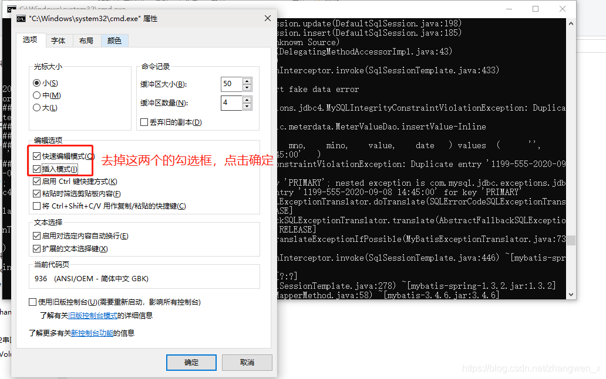

Windows下cmd 运行jar，出现假死现象

煜 [yù]

于 2020-09-08 14:51:34 发布

1140
 收藏 1
分类专栏： 其他
版权

其他
专栏收录该内容
4 篇文章0 订阅
订阅专栏
打包成jar之后部署在windows上之后，使用java -jar xxx.jar/bat脚本，运行一段时间项目就假死一样/鼠标在命令框点击后，导致程序访问不了，需要到命令行容器随意敲一个键，总之光标移动了就行，然后卡住的内容就会迅速输出到窗口，不敲任何键程序就一直卡在那

问题根本：

cmd默认开启了“快速编辑模式”，只要当鼠标点击cmd任何区域时，就自动进入了编辑模式，之后的程序向控制台输入内容甚至后台的程序都会被阻塞。

我们在控制台里面回车或者右键鼠标后，自动退出了编辑模式。因此，控制又恢复输出内容，服务端又正常了。

解决方法：

知道了什么原因出现的问题，解决起来就十分简单了

windows cmd -> 属性 -> 选项 -> 编辑选项

