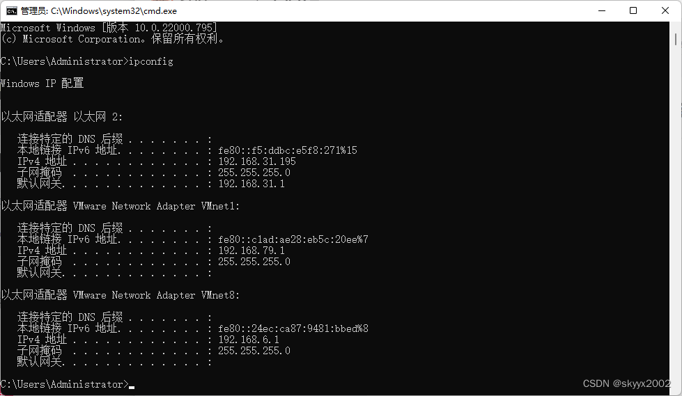
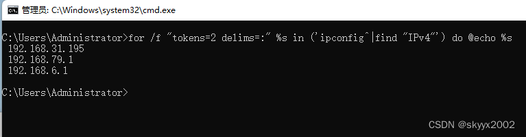
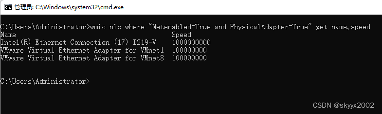

Windows命令行取本机IP、一次ping多个IP、取网卡速率

都知道，Windows查看IP信息的命令是：

```bash
ipconfig
```

如图：



 但有的时候，可能只希望得到IP，可以打开CMD，输入以下命令：

```bash
for /f "tokens=2 delims=:" %s in ('ipconfig^|find "IPv4"') do @echo %s
```

 执行如图：



一次ping多个IP
有时候在局域网中，可能需要看一下哪些IP没有使用，或者哪些IP正在使用，一个一个的ping太费力了，可以这样：

```bash
for /L %s in (1,1,10) do start "%s" ping 192.168.1.%s -t
```

执行效果如图：


 窗口太多，查看不方便？按下Win+Tab键试试。。

打开的ping命令窗口太多，如何快速关闭？

同样的在CMD中打入命令：

```bash
taskkill /f /im ping.exe
```

命令行取网卡速率

```bash
wmic nic where "Netenabled=True and PhysicalAdapter=True" get name,speed
```

执行效果如图：



