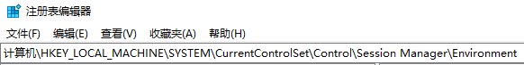
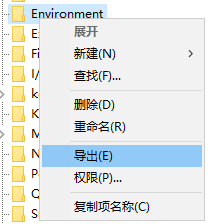
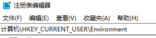
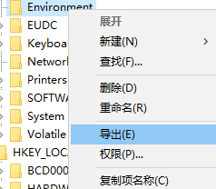

# windows备份环境变量（导入导出）


导出（备份）
win+r regedit 回车

系统环境变量
地址栏输入

```
计算机\HKEY_LOCAL_MACHINE\SYSTEM\CurrentControlSet\Control\Session Manager\Environment 
```



回车
右键导出，命名为系统环境变量保存




用户环境变量
地址栏输入

```bash
计算机\HKEY_CURRENT_USER\Environment
```



回车
右键导出，命名为用户环境变量保存



导入（恢复）
双击.reg即可


