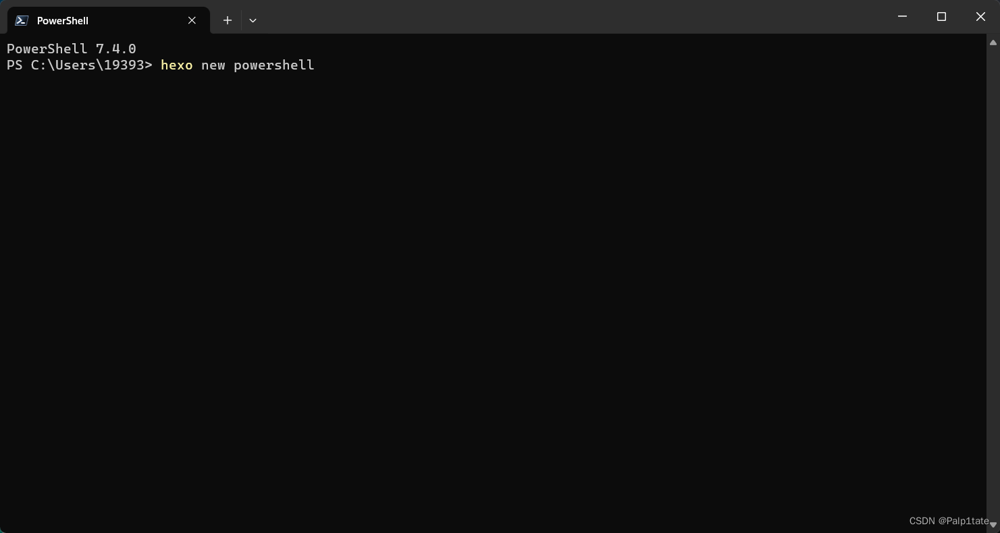

# 快速提高生产力——Power Shell也能命令提示并自动补全


## 突发奇想

昨天打开终端的时候，无意间看到了这样一行字：
安装最新的 PowerShell，了解新功能和改进！https://aka.ms/PSWindows。Win11的系统打开终端默认应该都是Power shell。


于是便点进去官网看了看，就是说Power shell现在已经到7版本了，而我的好像是5版本。起初我还是不是很相信，直到我用了一行命令去测试：

```
$PSVersionTable.PSVersion
```


好的，我不再多说，我的是5.1版本，出于对新版本的好奇，我看了看有哪些新功能，其中有一条：自动补全就吸引了我，这样我想起写代码的的时候有copilot，能快速提高编码效率，该说不说，准备直接冲power shell 7.4了。


## 如何安装

Winget 安装 PowerShell（推荐）
winget 命令行工具作为应用安装程序与 Windows 11 和现代版本的 Windows 10 捆绑在一起。我就是通过这种方式安装的power shell 7.4，简单快捷，就两行命令搞定。

搜索最新版本的 PowerShell：

```
winget search Microsoft.PowerShell
```

输出以下内容：


有两个版本，一个稳定版，一个预览版，可分别通过下面的命令安装：

```
#稳定版
winget install --id Microsoft.Powershell --source winget

#预览版
winget install --id Microsoft.Powershell.Preview --source winget
```

我安装的是稳定版，输入winget install --id Microsoft.Powershell --source winget这行命令后，winget 会安装 MSI 包，并且会自动安装到电脑上，应该会另外弹出一个图形化窗口显示安装的进度条，等待即可，整个过程在10s左右。

我已经安装过了，所以显示没有可升级的版本。


安装 MSI 包
也可以下载MSI包，然后点击它按流程操作即可。

进入Github：
https://github.com/PowerShell/PowerShell/releases/tag/v7.4.0

选择适合你的电脑的相应版本进行下载：


你只需要点击这个msi文件，根据弹出的窗口，按照对应的流程进行操作，非常简单。

配置终端
安装好后，开始菜单界面应该会弹出它的快捷方式。


既然安装好了，但是你发现打开终端还是原来的Power shell 5.1，也就是，咱们还需要简单调一下，以便能新建终端的时候能够用上新Power shell。

按图示进行操作：


这下你会发现当你无论打开终端还是新建选项卡，打开的都是Power shell 7.4：


此时我又想到，我的Jetbrains IDE默认打开的终端也是Power shell 5.1，于是想把IDE的默认设置也改一下。

我打开我的Goland，还是按照类似的流程进行配置：


最开始Shell path里应该不能自动检测到你的Power shell 7.4，你需要手动添加pwsh.exe的路径。


可以看到我的Goland也配置成功了。


常用命令即快捷键
在文章开篇就已经提到，Power shell 7.4支持自动补全，

可以看到，我只输入了h，它就弹出了我想要使用的命令：


只需要点击键盘的**右箭头**：**→**就能自动补全，它这个自动补全的原理就是根据你的输入的命令历史进行自动匹配，也就是说你不需要使用上箭头进行查看以往的命令，有时候会找很久，所以通过自动补全能节约不少时间。




Tab 键应该也可以自动补全命令名称、参数名称、参数值和文件路径，如果你的 Tab 键有问题，可能是PSReadLine 模块可能没有正确加载的原因。

在 PowerShell 7.4 中，你可以通过以下步骤来重新加载 PSReadLine 模块：

首先，你需要确保 PSReadLine 模块已经安装。你可以通过运行 Get-Module -ListAvailable PSReadLine 命令来检查 PSReadLine 模块是否已经安装。
如果 PSReadLine 模块已经安装，你可以通过运行 Remove-Module PSReadLine 命令来卸载当前加载的 PSReadLine 模块。
然后，你可以通过运行 Import-Module PSReadLine 命令来重新加载 PSReadLine 模块。
这样，PSReadLine 模块就被重新加载了。


以下是一些在 PowerShell 7 中常用的命令：

Get-ChildItem：列出当前目录下的文件和文件夹。
Set-Location：更改当前目录。
Get-Process：列出当前正在运行的进程。
Stop-Process：停止指定的进程。
Get-Service：列出系统服务的状态。
Start-Service：启动指定的服务。
Stop-Service：停止指定的服务。
Get-EventLog：读取指定的事件日志。


以下是一些在 PowerShell 7 中常用的捷键：

Ctrl+C / 鼠标右键：复制
Ctrl+V / 鼠标右键：粘贴
Esc：删除整行命令

笔者就不一一列举了，参照链接学习了解更多快捷键。

今天的分享就到这！！！