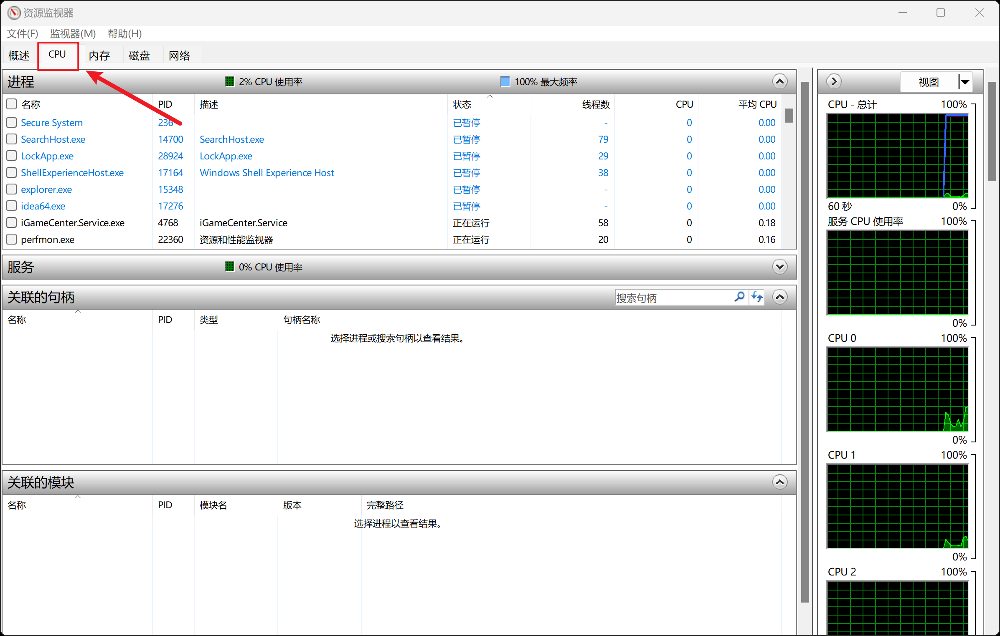

# 如何确定哪个进程在Windows中占用了特定的文件或文件夹

要精确地确定哪个进程在Windows中占用了特定的文件或文件夹，您可以使用一些内置工具和技术。下面是几种方法：

1 **资源监视器**:

打开“任务管理器”（您可以通过右键点击任务栏或按 `Ctrl + Shift + Esc` 快捷键来打开）。

切换到“性能”标签。

点击右上角的“打开资源监视器”。

在资源监视器中，切换到“CPU”标签页。

在“关联的句柄”部分，使用搜索框查找您想要删除的文件或文件夹的名称。

这将显示占用该文件的进程。

2  **命令行工具**
打开命令提示符（以管理员身份）。

输入以下命令：`handle <文件路径>` （需要先从官网下载并安装Sysinternals Suite中的Handle工具）。

这个命令会列出所有占用指定文件路径的进程。

3 **Process Explorer**
另一个实用工具是Sysinternals Suite中的Process Explorer。
在Process Explorer中，您可以使用“Find”功能（在菜单栏中点击“Find”->“Find Handle or DLL...”）。
在弹出的窗口中输入文件名或文件夹名进行搜索。
这将显示所有占用该文件的进程。

一旦找到占用文件的进程，您可以选择结束该进程（如果它是安全的操作），然后尝试再次删除文件或文件夹。然而，这种操作需要谨慎，因为强行终止某些进程可能会导致系统不稳定或数据丢失。如果您不确定某个进程的功能，最好先进行一些研究或咨询专业意见。