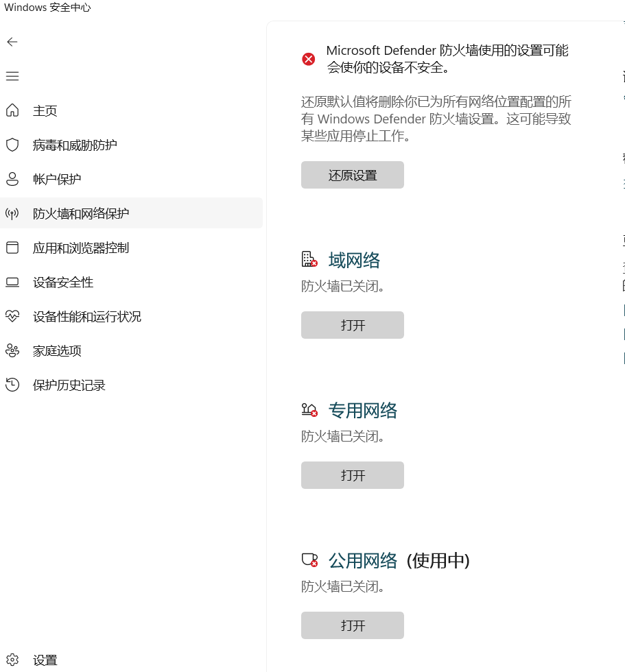

# WSL2安装

启用wsl

```
dism.exe /online /enable-feature /featurename:Microsoft-Windows-Subsystem-Linux /all /norestart
```

```
dism.exe /online /enable-feature /featurename:VirtualMachinePlatform /all /norestart
```

设置使用wsl2

```
wsl --set-default-version 2
```

列出可用的发行版

```
wsl --list --online
```

安装指定的发行版

```
wsl --install -d Ubuntu-24.04
```

启动wsl

```
wsl
```

关闭wsl

```
wsl --shutdown
```


配置网络代理


关闭防火墙:



在windows上执行:

```shell
ipconfig /all
```

查看ip地址:

```shell
以太网适配器 vEthernet (WSL (Hyper-V firewall)):

   连接特定的 DNS 后缀 . . . . . . . :
   描述. . . . . . . . . . . . . . . : Hyper-V Virtual Ethernet Adapter
   物理地址. . . . . . . . . . . . . : 00-15-5D-11-62-F2
   DHCP 已启用 . . . . . . . . . . . : 否
   自动配置已启用. . . . . . . . . . : 是
   本地链接 IPv6 地址. . . . . . . . : fe80::befd:f0e9:842b:6b85%37(首选)
   IPv4 地址 . . . . . . . . . . . . : 172.25.176.1(首选)
   子网掩码  . . . . . . . . . . . . : 255.255.240.0
   默认网关. . . . . . . . . . . . . :
   DHCPv6 IAID . . . . . . . . . . . : 620762461
   DHCPv6 客户端 DUID  . . . . . . . : 00-01-00-01-2D-61-F5-2C-00-E0-4C-88-FF-21
   TCPIP 上的 NetBIOS  . . . . . . . : 已启用
```

注意找到 WSL (Hyper-V firewall) 这个虚拟适配器的ip地址,如上面的 172.25.176.1


#### **修改 WSL2 中的 DNS 配置**

1. 禁止 WSL 自动生成 `resolv.conf` 文件：

   ```bash
   sudo nano /etc/wsl.conf
   ```

   添加以下内容：

   ```bash
   [network]
   generateResolvConf = false
   ```

2. 删除原有的 `resolv.conf` 文件：

   ```bash
   sudo rm /etc/resolv.conf
   ```

3. 手动创建一个新的 `resolv.conf` 文件：

   ```bash
   sudo nano /etc/resolv.conf
   ```

   添加以下内容（将 `172.25.176.1` 替换为你的 DNS 地址）：

   ```bash
   nameserver 172.25.176.1
   ```

4. 保存后, 在windows中重启 WSL：

   ```bash
   wsl --shutdown
   wsl
   ```


然后配置bash

```shell
nano ~/.bashrc
```

添加:

```shell
export http_proxy="172.25.176.1:10809"
export https_proxy="172.25.176.1:10809"
```

执行

```shell
source ~/.bashrc
```

重要的就是将本地代理的客户端的**允许局域网打开**


测试:

```shell
curl -I https://www.google.com
```

输出:

```shell
HTTP/1.1 200 Connection established

HTTP/2 200
content-type: text/html; charset=ISO-8859-1
content-security-policy-report-only: object-src 'none';base-uri 'self';script-src 'nonce-qQr7g_nFZ4qNYySn1nUXVg' 'strict-dynamic' 'report-sample' 'unsafe-eval' 'unsafe-inline' https: http:;report-uri https://csp.withgoogle.com/csp/gws/other-hp
accept-ch: Sec-CH-Prefers-Color-Scheme
p3p: CP="This is not a P3P policy! See g.co/p3phelp for more info."
date: Thu, 05 Dec 2024 04:59:40 GMT
server: gws
x-xss-protection: 0
x-frame-options: SAMEORIGIN
expires: Thu, 05 Dec 2024 04:59:40 GMT
cache-control: private
set-cookie: AEC=AZ6Zc-WRf6FY8i-GvfqicMnHNgp98Fns0EF4DxF0B_-w6-yncevv9WStd5Q; expires=Tue, 03-Jun-2025 04:59:40 GMT; path=/; domain=.google.com; Secure; HttpOnly; SameSite=lax
set-cookie: NID=519=QDCf4zEDz3QxjOBSaHQ04j1J0KLIjYT8UDMkt0RkVSHhFxGr3e9rGxs7tOowKvk2fhbi_ng4_hLpMUV7wdds6GjpFRVwiXYrpym5rxqtayhLzWrnsHtq1zdhdRnB2NLjB1ZigDif2U9nvH_h2V3E8wOw2RXQ2sM9Apcl3KVoH5m7eZiYZSxWLFovlPKW4dgbhgZ_NQ; expires=Fri, 06-Jun-2025 04:59:40 GMT; path=/; domain=.google.com; HttpOnly
alt-svc: h3=":443"; ma=2592000,h3-29=":443"; ma=2592000
```

说明配置成功


